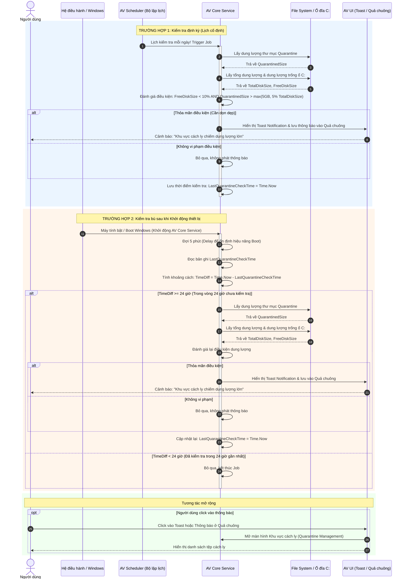

# 1. Trường hợp 1: Kiểm tra Định kỳ (Scheduled Job)

* **Thời điểm kích hoạt:** Lịch kiểm tra **mỗi ngày**, bộ lập lịch (AV Scheduler) sẽ gửi lệnh yêu cầu dịch vụ ngầm (AV Core Service) thực hiện kiểm tra.
* **Các bước xử lý:**
    1. **Thu thập dữ liệu:** Hệ thống truy vấn ổ đĩa để lấy các thông số:
        * Dung lượng thư mục cách ly ($QuarantinedSize$).
        * Tổng dung lượng ổ C: ($TotalDiskSize$).
        * Dung lượng trống còn lại của ổ C: ($FreeDiskSize$).
    2. **Đánh giá điều kiện:** Hệ thống đối chiếu dữ liệu với điều kiện cảnh báo:
        * Dung lượng trống ổ C < 10% **VÀ** Dung lượng cách ly > max(5 GB, 5% tổng dung lượng ổ C).
    3. **Phát cảnh báo & Ghi nhận:**
        * **Nếu vi phạm điều kiện:** Đẩy thông báo Toast góc màn hình và lưu thông báo vào Quả chuông.
        * **Nếu không vi phạm:** Không phát thông báo.
        * **Luôn thực hiện:** Cập nhật lại thời điểm kiểm tra gần nhất (`LastQuarantineCheckTime` = Thời gian hiện tại).

# 2. Trường hợp 2: Kiểm tra Bù khi Khởi động thiết bị

* **Thời điểm kích hoạt:** Ngay khi máy tính bật/khởi động lại và dịch vụ AV khởi động cùng Windows.
* **Các bước xử lý:**
    1. **Trì hoãn (Delay):** Hệ thống tạm dừng **5 phút** sau khi boot để tránh gây giật/lag máy tính.
    2. **Tính toán thời gian trôi qua:**
       Thời gian trôi qua ($TimeDiff$) = Thời gian hiện tại - Thời gian kiểm tra gần nhất (`LastQuarantineCheckTime`).
    3. **Phân nhánh xử lý:**
        * **Nếu $TimeDiff \ge 24$ giờ** (Tức là trong vòng 24 giờ qua chưa thực hiện kiểm tra):
            * Hệ thống tự động kích hoạt lượt kiểm tra bù.
            * Đọc thông số ổ đĩa $\rightarrow$ Đánh giá điều kiện dung lượng $\rightarrow$ Đẩy thông báo (nếu vi phạm).
            * Cập nhật thời điểm kiểm tra mới (`LastQuarantineCheckTime` = Thời gian hiện tại).
        * **Nếu $TimeDiff < 24$ giờ** (Tức là trong vòng 24 giờ qua đã thực hiện kiểm tra):
            * Bỏ qua, kết thúc tiến trình ngầm.

# 3. Tương tác từ phía Người dùng

* Khi nhận được thông báo Toast hoặc bấm vào thông báo trong Quả chuông:
    1. Người dùng click vào thông báo: "Khu vực cách ly chiếm dung lượng lớn".
    2. Phần mềm lập tức chuyển hướng người dùng đến màn hình **Khu vực Cách ly**.
