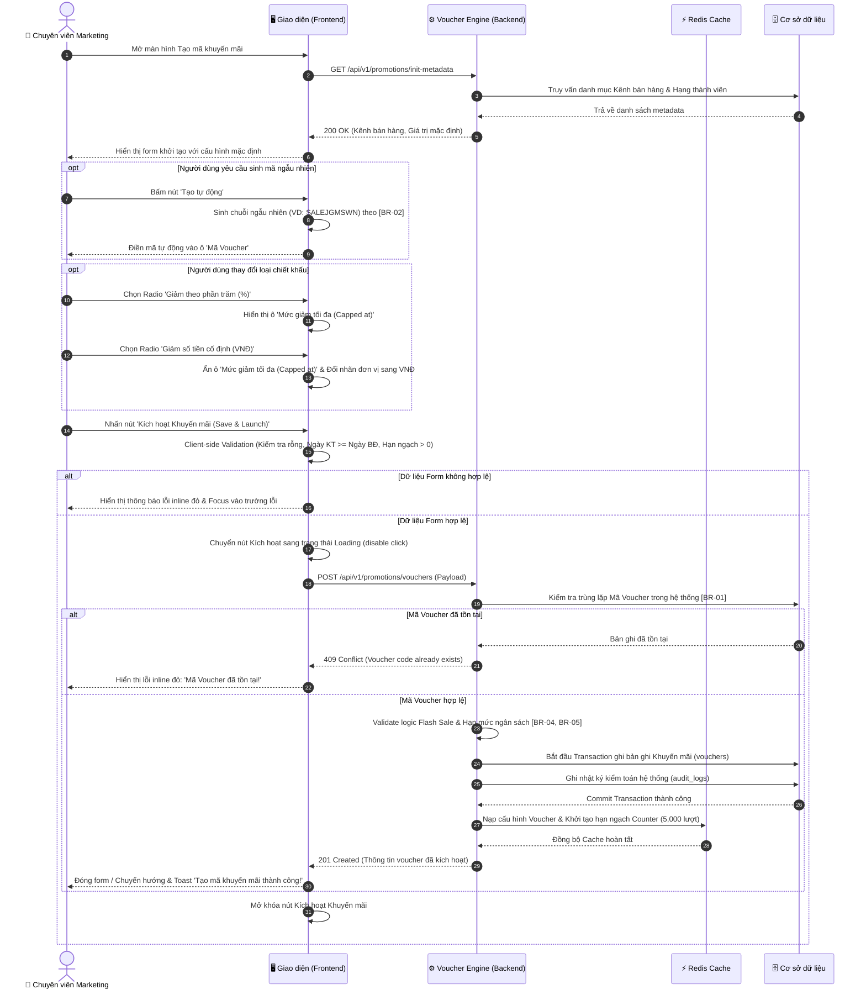

# TÀI LIỆU ĐẶC TẢ YÊU CẦU PHẦN MỀM (SRS)
## TÍNH NĂNG: TẠO MÃ KHUYẾN MÃI & GIẢM GIÁ NÂNG CAO
**Mã tính năng:** `MKT_VOUCHER_03`  
**Hệ thống:** Nền tảng Thương mại Điện tử Đa kênh (Omni-channel E-Commerce Platform)  
**Phiên bản:** 1.0  
**Tác giả:** Business Analyst Team  

---

# 1. THÔNG TIN CHUNG CHỨC NĂNG

| Thuộc tính | Nội dung mô tả |
| :--- | :--- |
| **Mã chức năng** | `MKT_VOUCHER_03` |
| **Tên chức năng** | Tạo mã khuyến mãi & giảm giá nâng cao (Advanced Promotion & Voucher Engine) |
| **Mô tả tổng quan** | Cho phép bộ phận Tiếp thị (Marketing) thiết lập và kích hoạt các chiến dịch khuyến mãi mã voucher giảm giá đa dạng trên các kênh bán hàng (Web, App, POS). Hỗ trợ cơ chế chiết khấu theo phần trăm có chặn trần (Capped discount), giới hạn khung giờ vàng Flash Sale trong ngày, quản lý hạn ngạch lượt dùng (Usage Quota) chống trục lợi và cá nhân hóa ưu đãi theo phân khúc khách hàng (New user, VIP). |
| **Phạm vi tính năng** | - **Bao gồm (In-Scope):**<br>&nbsp;&nbsp;+ Khai báo thông tin mã voucher, tự động sinh mã ngẫu nhiên hoặc đặt mã tùy chỉnh.<br>&nbsp;&nbsp;+ Cấu hình loại chiết khấu: Giảm theo phần trăm (kèm trần tối đa), Giảm tiền cố định, Miễn phí vận chuyển.<br>&nbsp;&nbsp;+ Thiết lập điều kiện giá trị đơn hàng tối thiểu (Min Spend).<br>&nbsp;&nbsp;+ Cấu hình thời gian hiệu lực chiến dịch và khung giờ vàng Flash Sale áp dụng trong ngày.<br>&nbsp;&nbsp;+ Thiết lập hạn ngạch tổng lượt dùng toàn hệ thống và giới hạn số lượt áp dụng trên mỗi khách hàng.<br>&nbsp;&nbsp;+ Phân loại áp dụng theo đối tượng khách hàng (Tất cả, Khách hàng mới, Hạng VIP) và kênh bán lẻ.<br>- **Không bao gồm (Out-of-Scope):**<br>&nbsp;&nbsp;+ Tính năng gửi thông báo đẩy (Push Notification) hoặc gửi Email/SMS tự động mời nhận voucher (thuộc module CRM Marketing Automation).<br>&nbsp;&nbsp;+ Tính năng phân tích hiệu quả ROI, doanh thu theo chiến dịch sau bán hàng (thuộc module Báo cáo BI). |
| **Điều kiện trước** | 1. Người dùng đã đăng nhập hệ thống quản trị và tài khoản được gán quyền Marketing/Promotion Manager (hoặc Super Admin).<br>2. Phân hệ Khách hàng thân thiết (Loyalty & Customer Tier) đang hoạt động ổn định để hệ thống đồng bộ các cấp độ thành viên (Standard, Silver, Gold, Platinum).<br>3. Bảng tỷ giá và cấu hình đơn vị tiền tệ cơ sở (VNĐ) đã được kích hoạt trong phân hệ Cài đặt Thương mại. |
| **Điều kiện sau** | 1. Thành công: Bản ghi mã khuyến mãi được tạo và kích hoạt thành công trong CSDL; Đồng bộ tức thời sang Cache Redis của Voucher Engine để người mua có thể áp mã ngay tại giỏ hàng khi đến thời điểm hiệu lực; Ghi nhận nhật ký kiểm toán (Audit Log) đầy đủ.<br>2. Thất bại: Không có mã voucher nào được kích hoạt, hệ thống hiển thị thông báo lỗi chi tiết và giữ nguyên thông tin đã nhập trên form để người dùng chỉnh sửa. |
| **Ngoại lệ tổng quan** | 1. Xung đột mã voucher: Mã voucher nhập vào bị trùng lặp với một mã voucher khác đang hoạt động hoặc chưa hết hạn trên toàn hệ thống (báo lỗi theo quy tắc BR-01).<br>2. Lỗi mất kết nối mạng giữa Client và máy chủ trong quá trình gửi yêu cầu kích hoạt chiến dịch. |

---

# 2. MA TRẬN PHÂN QUYỀN (RBAC MATRIX)

Bảng phân quyền kiểm soát truy cập và phạm vi dữ liệu đối với tính năng Tạo mã khuyến mãi & giảm giá nâng cao:

| Vai trò | Xem | Thêm mới | Chỉnh sửa | Xóa | Tác vụ đặc biệt | Phạm vi dữ liệu |
| :--- | :---: | :---: | :---: | :---: | :--- | :--- |
| **Super Admin** | ✅ | ✅ | ✅ | ✅ | Bật/Tắt khẩn cấp, Xem Audit Log | Toàn bộ hệ thống |
| **Trưởng phòng Marketing** | ✅ | ✅ | ✅ | ❌ | Bật/Tắt khẩn cấp, Kích hoạt chiến dịch | Toàn bộ chiến dịch |
| **Chuyên viên Marketing** | ✅ | ✅ | ❌ | ❌ | Tạo mã nháp (Draft), Xem danh sách | Do mình tạo |
| **Quản lý Bán hàng (Sales Lead)** | ✅ | ❌ | ❌ | ❌ | Xem danh sách voucher khả dụng | Toàn bộ kênh bán hàng (Chỉ xem) |
| **Thu ngân / Nhân viên POS** | ✅ | ❌ | ❌ | ❌ | Tra cứu mã áp dụng tại quầy | Kênh POS (Chỉ xem) |
| **Kiểm toán viên (Auditor)** | ✅ | ❌ | ❌ | ❌ | Xuất báo cáo cấu hình, Xem Audit Log | Toàn bộ hệ thống (Chỉ xem) |

*Ghi chú:*
- Nút **Kích hoạt Khuyến mãi (Save & Launch)** và nút **Tạo tự động** chỉ hiển thị và kích hoạt đối với các vai trò có quyền `Thêm mới` hoặc `Chỉnh sửa` (`Super Admin`, `Trưởng phòng Marketing`, `Chuyên viên Marketing`).
- Nhân viên bán hàng và thu ngân chỉ có quyền tra cứu trạng thái mã tại màn hình Checkout/POS, không có quyền truy cập vào màn hình cấu hình này.

---

# 3. BIỂU ĐỒ LUỒNG XỬ LÝ (WORKFLOWS)

Quy trình tạo và kích hoạt mã khuyến mãi bao gồm các tương tác giữa Người dùng (Marketing), Giao diện (Frontend), Dịch vụ khuyến mãi (Voucher Engine Backend), Bộ nhớ đệm tốc độ cao (Redis Cache) và Cơ sở dữ liệu.

### 3.1. Biểu đồ tuần tự (Sequence Diagram)



### 3.2. Mô tả chi tiết logic các bước:
1. **Bước 1-5 (Khởi tạo màn hình):** Khi người dùng truy cập, Frontend gọi API lấy metadata danh mục kênh bán hàng và các cấp bậc hạng thành viên VIP. Giao diện hiển thị form với giá trị mặc định (`Kênh = Tất cả`, `Loại giảm = %`, `Giảm = 20%`, `Lượt dùng = 5000`, `Hạn mức người = 1`).
2. **Bước 6-8 (Sinh mã tự động):** Người dùng có thể tự gõ mã hoặc bấm nút `Tạo tự động`. Hệ thống Frontend/Backend áp dụng thuật toán `[BR-02]` sinh chuỗi ngẫu nhiên gồm 10-12 ký tự chữ hoa và số, hiển thị trực tiếp vào ô input.
3. **Bước 9-12 (Tương tác động trên form):** 
   - Khi chọn loại `Giảm theo phần trăm (%)`: Hệ thống tự động kích hoạt hiển thị trường `Mức giảm tối đa (Capped at)` và đặt đơn vị là `%`.
   - Khi chuyển sang `Giảm số tiền cố định`: Ẩn trường mức giảm tối đa và đổi đơn vị sang `VNĐ`.
   - Khi bật toggle `Khung giờ vàng Flash Sale`: Hiển thị 2 cặp ô chọn giờ buổi trưa và buổi tối.
4. **Bước 13-16 (Client Validation):** Người dùng bấm `Kích hoạt Khuyến mãi (Save & Launch)`. Frontend kiểm tra tính hợp lệ toàn bộ form: Tên không rỗng, Mã đúng định dạng, Ngày kết thúc $\ge$ Ngày bắt đầu, Min spend $\ge$ 0, Lượt dùng $\ge$ 1. Nếu vi phạm, highlight viền đỏ và hiển thị inline error. Nếu hợp lệ, bật spinner loading trên nút bấm.
5. **Bước 17-27 (Backend Validation, Ghi DB & Nạp Cache):**
   - Backend kiểm tra trùng lặp Mã Voucher trên CSDL (`[BR-01]`). Nếu trùng, trả về mã `409 Conflict`.
   - Backend kiểm tra tính logic của thời gian Flash Sale (`[BR-04]`).
   - Mở Transaction CSDL ghi nhận bản ghi khuyến mãi vào bảng `vouchers` và ghi nhật ký `audit_logs`.
   - Nạp cấu hình voucher và khởi tạo bộ đếm hạn ngạch (Usage Counter) trên Redis Cache (`[BR-05]`) để phục vụ kiểm tra tức thời khi khách mua hàng checkout.
   - Trả về mã `201 Created`. Frontend hiển thị Toast thông báo thành công và điều hướng về danh sách khuyến mãi.

---

# 4. THIẾT KẾ GIAO DIỆN & ĐẶC TẢ CHI TIẾT UI COMPONENTS

Giao diện được thiết kế dạng trang cấu hình tập trung chia thành 4 thẻ chức năng (Cards), hỗ trợ đầy đủ các hiệu ứng tương tác động theo đúng 2 hình ảnh giao diện UI đính kèm.

```
+-------------------------------------------------------------------------------------------------------------------------+
| Tạo Mã Khuyến Mãi & Giảm Giá Nâng Cao  [ID: MKT_VOUCHER_03]                    [Hủy bỏ]  [Kích hoạt Khuyến mãi (Launch)]|
| Thiết lập chiến dịch giảm giá theo phần trăm có chặn trần, khung giờ vàng...                                            |
+-------------------------------------------------------------------------------------------------------------------------+
| [Thẻ 1: Thông Tin Cơ Bản Chương Trình (Basic Information)]                                                              |
| Tên chương trình khuyến mãi *                                                 Mã Voucher (Code) *                       |
| [ Siêu Hội Mua Sắm 9.9 - Giảm 20% Đơn Hàng Đầu Tiên                         ] [ SALEJGMSWN               ] [Tạo tự động]|
|                                                                               Tối đa 16 ký tự chữ hoa và số             |
| Mô tả điều khoản khuyến mãi                                                   Kênh bán hàng áp dụng *                   |
| [ Áp dụng cho khách hàng mua sắm trong sự kiện ngày 9.9...                  ] [ Tất cả các kênh (Omni-channel)         v] |
+-------------------------------------------------------------------------------------------------------------------------+
| [Thẻ 2: Loại Chiết Khấu & Giá Trị Khuyến Mãi (Discount Value)]                                                          |
| Loại chiết khấu *                                                                                                       |
| (o) Giảm theo phần trăm (%)          ( ) Giảm số tiền cố định (VNĐ)           ( ) Miễn phí vận chuyển                   |
|     Khấu trừ tỷ lệ % giá trị đơn         Trừ trực tiếp số tiền cố định            Trợ giá phí ship toàn quốc            |
|                                                                                                                         |
| Mức giảm (%) *                                Mức giảm tối đa (Capped at)             Giá trị đơn hàng tối thiểu (Min)  |
| [ 20                                       %] [ 150,000                           VNĐ] [ 300,000                     VNĐ] |
|                                               Giới hạn số tiền giảm tối đa để...      Đơn hàng phải đạt từ mức này mới..|
+-------------------------------------------------------------------------------------------------------------------------+
| [Thẻ 3: Thời Gian Áp Dụng & Khung Giờ Flash Sale (Schedule)]                                                            |
| Thời điểm bắt đầu (Start Date) *                              Thời điểm kết thúc (End Date) *                           |
| [ 09/09/2026 12:00 AM                                       ] [ 09/15/2026 11:59 PM                                   ] |
|                                                                                                                         |
| [⚡ Kích hoạt Khung giờ vàng Flash Sale (Chỉ áp dụng giờ vàng trong ngày)]                                         (ON)  |
| Khung giờ buổi trưa: [12:00 PM] đến [02:00 PM]                Khung giờ buổi tối: [08:00 PM] đến [10:00 PM]             |
+-------------------------------------------------------------------------------------------------------------------------+
| [Thẻ 4: Giới Hạn Lượt Dùng & Khách Hàng (Usage Quota & Audience)]                                                       |
| Tổng số lượt dùng toàn hệ thống *             Lượt dùng tối đa mỗi khách hàng *       Phân khúc khách hàng áp dụng      |
| [ 5000                                  Lượt] [ 1                         Lượt/Người] [ Thành viên VIP (Vàng, Bạch...) v] |
| Hết lượt mã sẽ tự động chuyển sang Hết hạn    Dựa theo số điện thoại và User ID                                         |
+-------------------------------------------------------------------------------------------------------------------------+
```

### 4.1. Bảng đặc tả chi tiết các thành phần giao diện (UI Components)

| STT | Tên trường | Loại dữ liệu | Mô tả |
| :--- | :--- | :--- | :--- |
| **1** | **Tạo Mã Khuyến Mãi & Giảm Giá Nâng Cao**<br>(Tiêu đề trang) | Label | - Tiêu đề chính của màn hình, thể hiện chức năng khởi tạo chiến dịch khuyến mãi mã voucher.<br>- **Nội dung hiển thị:** Tạo Mã Khuyến Mãi & Giảm Giá Nâng Cao<br>- **Badge đi kèm:** `ID: MKT_VOUCHER_03`<br>- **Tính chất hiển thị:** Tĩnh (Static). |
| **2** | **Hủy bỏ**<br>(Nút Cancel) | Button | - Cho phép người dùng hủy bỏ các thiết lập đang nhập và thoát về danh sách mã khuyến mãi.<br>- **Vị trí:** Phía trên bên phải trang.<br>- **Trạng thái mặc định:** Enabled.<br>- **Hành vi khi nhấn (OnClick Event):**<br>1. Không thực hiện kiểm tra dữ liệu đầu vào.<br>2. Nếu người dùng chưa chỉnh sửa bất kỳ trường nào: Điều hướng ngay về trang Danh sách voucher.<br>3. Nếu người dùng đã nhập hoặc chỉnh sửa dữ liệu: Hiển thị Hộp thoại cảnh báo chưa lưu dữ liệu (Modal Unsaved Changes). |
| **3** | **Kích hoạt Khuyến mãi**<br>(Nút Save & Launch) | Button | - Cho phép người dùng xác nhận lưu và phát hành mã khuyến mãi ra toàn hệ thống.<br>- **Vị trí:** Góc trên bên phải, cạnh nút Hủy bỏ (Màu hồng đỏ Rose nổi bật).<br>- **Trạng thái mặc định:** Enabled.<br>- **Quyền hạn truy cập:** Người dùng có vai trò `Super Admin` hoặc `Marketing Manager` theo Mục 2.<br>- **Hành vi khi nhấn (OnClick Event):**<br>Khi nhấn vào, hệ thống thực hiện kiểm tra toàn bộ dữ liệu trên form:<br>+ Nếu dữ liệu không hợp lệ: Hiển thị các thông báo lỗi inline màu đỏ dưới từng trường vi phạm và tự động cuộn màn hình đến trường lỗi đầu tiên.<br>+ Nếu dữ liệu hợp lệ: Bắt đầu gửi request xử lý:<br>&nbsp;&nbsp;. Chuyển nút sang trạng thái Loading (hiển thị spinner xoay tròn, đổi text thành `"Đang kích hoạt..."`, vô hiệu hóa click chống submit đúp).<br>&nbsp;&nbsp;. Gọi API `POST /api/v1/promotions/vouchers`. Trạng thái disable chỉ mở khóa sau khi có phản hồi từ máy chủ.<br>&nbsp;&nbsp;. Nếu kích hoạt thành công: Đóng form, điều hướng về danh sách voucher và hiển thị toast message tự động đóng: `"Kích hoạt mã khuyến mãi thành công!"` (`"Voucher launched successfully!"`).<br>&nbsp;&nbsp;. Nếu không thành công: Giữ nguyên form, hiển thị toast message thất bại: `"Kích hoạt mã khuyến mãi không thành công!"` (`"Failed to launch voucher!"`). |
| **4** | **Tên chương trình khuyến mãi** | Textbox (Single-line) | - Người dùng bắt buộc nhập tên mô tả chiến dịch khuyến mãi.<br>- **Placeholder:**<br>&nbsp;&nbsp;+ VI: Nhập tên chương trình...<br>&nbsp;&nbsp;+ EN: Enter promotion name...<br>- **Giá trị mặc định:** Trống (Tạo mới).<br>- **Giới hạn ký tự:** Tối đa 128 ký tự. Hành vi khi vượt quá: Tự động chặn gõ, không nhận thêm ký tự vượt quá 128.<br>- **Kiểu ký tự hợp lệ:** Tất cả các ký tự chữ, số và ký tự đặc biệt thông thường.<br>- **Quy tắc Nghiệp vụ:** Tự động trim khoảng trắng ở đầu và cuối chuỗi trước khi lưu.<br>- **Thông báo lỗi tương ứng:**<br>+ Trống và nhấn Kích hoạt: Hiển thị lỗi inline màu đỏ ngay dưới trường: `"Tên chương trình là bắt buộc!"` (`"Promotion name is required!"`) |
| **5** | **Mã Voucher (Code)** | Textbox (Single-line) | - Người dùng bắt buộc nhập mã ký tự định danh dùng để khách hàng nhập áp mã khi thanh toán.<br>- **Placeholder:**<br>&nbsp;&nbsp;+ VI: Nhập mã code hoặc tạo tự động<br>&nbsp;&nbsp;+ EN: Enter voucher code or auto-generate<br>- **Giá trị mặc định:** Trống.<br>- **Giới hạn ký tự:** Tối đa 16 ký tự. Tự động chuyển đổi tất cả ký tự nhập thành chữ hoa (Uppercase).<br>- **Kiểu ký tự hợp lệ:** Chỉ cho phép chữ cái tiếng Anh in hoa (`A-Z`) và chữ số (`0-9`), không chứa dấu cách hay ký tự đặc biệt.<br>- **Quy tắc Nghiệp vụ:**<br>1. Mã voucher phải là duy nhất trên toàn hệ thống trong các mã đang còn hiệu lực (Xem quy tắc **[BR-01]**).<br>2. Hỗ trợ nút hành động **Tạo tự động** nằm phía trong bên phải ô nhập: Khi nhấn, hệ thống tự động sinh chuỗi mã ngẫu nhiên 10 ký tự hợp lệ (Xem quy tắc **[BR-02]**).<br>- **Thông báo lỗi tương ứng:**<br>+ Trống và nhấn Kích hoạt: Hiển thị lỗi inline màu đỏ: `"Mã Voucher là bắt buộc!"` (`"Voucher code is required!"`)<br>+ Chứa ký tự không hợp lệ: Hiển thị lỗi inline màu đỏ: `"Mã Voucher chỉ được chứa chữ cái in hoa và số!"` (`"Voucher code must contain uppercase letters and numbers only!"`)<br>+ Trùng lặp: Hiển thị lỗi inline màu đỏ: `"Mã Voucher đã tồn tại trên hệ thống!"` (`"Voucher code already exists!"`) |
| **6** | **Mô tả điều khoản khuyến mãi** | Textbox (Multi-line / Textarea) | - Cho phép người dùng nhập chi tiết thể lệ, điều kiện và phạm vi áp dụng khuyến mãi (không bắt buộc).<br>- **Placeholder:**<br>&nbsp;&nbsp;+ VI: Nhập mô tả điều khoản khuyến mãi...<br>&nbsp;&nbsp;+ EN: Enter promotion terms and conditions...<br>- **Giá trị mặc định:** Trống.<br>- **Giới hạn ký tự:** Tối đa 300 ký tự. Hành vi khi vượt quá: Hệ thống chặn không cho gõ tiếp ký tự vượt quá 300.<br>- **Thông báo lỗi:** Không có. |
| **7** | **Kênh bán hàng áp dụng** | Combobox / Dropdown (Single-select) | - Cho phép người dùng lựa chọn nền tảng bán hàng được phép sử dụng voucher này.<br>- **Nguồn dữ liệu:** Danh mục cố định gồm:<br>&nbsp;&nbsp;+ Tất cả các kênh (Omni-channel)<br>&nbsp;&nbsp;+ Chỉ trên Website E-Commerce<br>&nbsp;&nbsp;+ Chỉ trên Ứng dụng di động (Mobile App)<br>&nbsp;&nbsp;+ Chỉ tại Cửa hàng trực tiếp (POS)<br>- **Giá trị mặc định:** `Tất cả các kênh (Omni-channel)`<br>- **Chức năng tìm kiếm:** Không.<br>- **Thông báo lỗi tương ứng:** Không có (do luôn có giá trị mặc định). |
| **8** | **Loại chiết khấu** | Radio Button (Card Options) | - Cho phép người dùng lựa chọn hình thức khấu trừ tiền khuyến mãi.<br>- **Danh sách tùy chọn:**<br>&nbsp;&nbsp;+ Tùy chọn 1: `Giảm theo phần trăm (%)` (Khấu trừ tỷ lệ % giá trị đơn hàng)<br>&nbsp;&nbsp;+ Tùy chọn 2: `Giảm số tiền cố định (VNĐ)` (Trừ trực tiếp số tiền cố định)<br>&nbsp;&nbsp;+ Tùy chọn 3: `Miễn phí vận chuyển` (Trợ giá phí ship toàn quốc)<br>- **Giá trị mặc định:** `Giảm theo phần trăm (%)`<br>- **Quy tắc Nghiệp vụ & Kích hoạt động (Dynamic Trigger Rules):**<br>&nbsp;&nbsp;+ Khi chọn **Giảm theo phần trăm (%)**: Hiển thị trường `Mức giảm tối đa (Capped at)`, đổi đơn vị ô Mức giảm thành `%`, giới hạn Max = 100.<br>&nbsp;&nbsp;+ Khi chọn **Giảm số tiền cố định (VNĐ)**: Ẩn trường `Mức giảm tối đa (Capped at)`, đổi đơn vị ô Mức giảm thành `VNĐ`, bỏ chặn Max 100.<br>&nbsp;&nbsp;+ Khi chọn **Miễn phí vận chuyển**: Ẩn trường `Mức giảm tối đa (Capped at)`, đổi nhãn ô Mức giảm thành `"Mức trợ giá vận chuyển (VNĐ)"`.<br>- **Thông báo lỗi:** Không có (do luôn có giá trị mặc định). |
| **9** | **Mức giảm** | Input Number (Numeric) | - Người dùng bắt buộc nhập giá trị chiết khấu tương ứng với loại giảm đã chọn.<br>- **Placeholder:** Nhập giá trị giảm<br>- **Giá trị mặc định:** `20` (khi loại là %), `50,000` (khi loại là VNĐ).<br>- **Ràng buộc giá trị (Min/Max):**<br>&nbsp;&nbsp;+ Nếu Loại = `%`: Min = 1, Max = 100.<br>&nbsp;&nbsp;+ Nếu Loại = `VNĐ`: Min = 1,000, Max không giới hạn.<br>- **Quy tắc Nghiệp vụ:** Hệ thống tự động chặn gõ ký tự không phải số.<br>- **Thông báo lỗi tương ứng:**<br>+ Trống và nhấn Kích hoạt: Hiển thị lỗi inline màu đỏ: `"Mức giảm là bắt buộc!"` (`"Discount value is required!"`)<br>+ Lớn hơn 100 (khi là %): Hiển thị lỗi inline màu đỏ: `"Mức giảm phần trăm không được vượt quá 100%!"` (`"Percentage discount must not exceed 100%!"`) |
| **10** | **Mức giảm tối đa (Capped at)** | Input Number (Numeric) | - Cho phép người dùng thiết lập số tiền giảm tối đa đối với loại giảm theo phần trăm nhằm tránh thâm hụt ngân sách khi đơn hàng có giá trị cực lớn.<br>- **Điều kiện hiển thị:** Chỉ hiển thị khi `Loại chiết khấu = Giảm theo phần trăm (%)`.<br>- **Giá trị mặc định:** `150,000`<br>- **Định dạng hiển thị:** Tự động phân cách hàng nghìn (VNĐ).<br>- **Ràng buộc giá trị:** Min $\ge 1,000$ VNĐ.<br>- **Quy tắc Nghiệp vụ:** Xem chi tiết công thức áp dụng tại **[BR-03]**.<br>- **Thông báo lỗi tương ứng:**<br>+ Nhỏ hơn 1,000 VNĐ: Hiển thị lỗi inline: `"Mức giảm tối đa phải lớn hơn hoặc bằng 1,000 VNĐ!"` |
| **11** | **Giá trị đơn hàng tối thiểu (Min Spend)** | Input Number (Numeric) | - Cho phép người dùng đặt điều kiện tổng giá trị giỏ hàng (chưa trừ giảm giá) tối thiểu để được quyền kích hoạt áp mã voucher.<br>- **Giá trị mặc định:** `300,000`<br>- **Định dạng hiển thị:** Tự động phân cách hàng nghìn (VNĐ).<br>- **Ràng buộc giá trị:** Min $\ge 0$ VNĐ. Nếu nhập 0 tức là áp dụng cho mọi đơn hàng không điều kiện.<br>- **Thông báo lỗi:** Nhập số âm báo lỗi inline: `"Giá trị đơn hàng tối thiểu không được là số âm!"` |
| **12** | **Thời điểm bắt đầu (Start Date)** | Datetime Picker | - Người dùng bắt buộc chọn ngày và giờ bắt đầu chiến dịch voucher có hiệu lực.<br>- **Định dạng hiển thị & nhập:** `MM/DD/YYYY hh:mm A` (Ví dụ: `09/09/2026 12:00 AM`).<br>- **Giá trị mặc định:** Thời điểm hiện tại hoặc đầu ngày mai.<br>- **Quy tắc Nghiệp vụ:** Không được chọn thời điểm trong quá khứ so với thời điểm hiện tại.<br>- **Thông báo lỗi tương ứng:**<br>+ Trống và nhấn Kích hoạt: Hiển thị lỗi inline: `"Thời điểm bắt đầu là bắt buộc!"` (`"Start date is required!"`)<br>+ Nhỏ hơn thời điểm hiện tại: Hiển thị lỗi inline: `"Thời điểm bắt đầu không được nằm trong quá khứ!"` (`"Start date must not be in the past!"`) |
| **13** | **Thời điểm kết thúc (End Date)** | Datetime Picker | - Người dùng bắt buộc chọn ngày và giờ hết hiệu lực chiến dịch voucher.<br>- **Định dạng hiển thị & nhập:** `MM/DD/YYYY hh:mm A` (Ví dụ: `09/15/2026 11:59 PM`).<br>- **Giá trị mặc định:** 7 ngày sau thời điểm bắt đầu.<br>- **Ràng buộc ngày:** Bắt buộc `Thời điểm kết thúc > Thời điểm bắt đầu`.<br>- **Thông báo lỗi tương ứng:**<br>+ Trống và nhấn Kích hoạt: Hiển thị lỗi inline: `"Thời điểm kết thúc là bắt buộc!"` (`"End date is required!"`)<br>+ Nhỏ hơn hoặc bằng Thời điểm bắt đầu: Hiển thị lỗi inline: `"Thời điểm kết thúc phải lớn hơn thời điểm bắt đầu!"` (`"End date must be greater than start date!"`) |
| **14** | **Kích hoạt Khung giờ vàng Flash Sale** | Switch / Toggle Button | - Cho phép người dùng kích hoạt cơ chế giới hạn chỉ cho phép áp mã vào các khung giờ vàng cụ thể trong ngày.<br>- **Trạng thái mặc định:** Checked (Bật).<br>- **Quy tắc Nghiệp vụ & Kích hoạt động:**<br>&nbsp;&nbsp;+ Khi **BẬT**: Hiển thị khối cấu hình chi tiết `Khung giờ buổi trưa` và `Khung giờ buổi tối`. Mã chỉ áp dụng thành công khi đơn hàng được đặt trong các khung giờ này (Xem **[BR-04]**).<br>&nbsp;&nbsp;+ Khi **TẮT**: Ẩn khối khung giờ; mã có thể áp dụng 24/24 trong suốt khoảng ngày hiệu lực.<br>- **Thông báo lỗi:** Không có. |
| **15** | **Khung giờ buổi trưa** | Time Range Picker | - Cho phép cấu hình dải giờ Flash Sale buổi trưa.<br>- **Điều kiện hiển thị:** Chỉ hiển thị khi Toggle Flash Sale = Bật.<br>- **Giá trị mặc định:** `12:00 PM` đến `02:00 PM`<br>- **Ràng buộc:** Giờ kết thúc phải lớn hơn Giờ bắt đầu. |
| **16** | **Khung giờ buổi tối** | Time Range Picker | - Cho phép cấu hình dải giờ Flash Sale buổi tối.<br>- **Điều kiện hiển thị:** Chỉ hiển thị khi Toggle Flash Sale = Bật.<br>- **Giá trị mặc định:** `08:00 PM` đến `10:00 PM`<br>- **Ràng buộc:** Giờ kết thúc phải lớn hơn Giờ bắt đầu và không chồng lấn với Khung giờ buổi trưa. |
| **17** | **Tổng số lượt dùng toàn hệ thống** | Input Number (Integer) | - Người dùng bắt buộc nhập tổng ngân sách số lượng voucher tối đa được phát hành cho toàn bộ khách hàng trên hệ thống.<br>- **Placeholder:** Nhập tổng số lượt...<br>- **Giá trị mặc định:** `5000` Lượt.<br>- **Ràng buộc giá trị:** Min $\ge 1$. Số nguyên dương.<br>- **Quy tắc Nghiệp vụ:** Hệ thống đếm ngược số lượt dùng theo thời gian thực trên Redis Cache (`[BR-05]`). Khi số lượt còn lại = 0, voucher tự động chuyển sang trạng thái Hết lượt (Expired).<br>- **Thông báo lỗi tương ứng:**<br>+ Trống hoặc $\le 0$: Hiển thị lỗi inline: `"Tổng số lượt dùng phải là số nguyên lớn hơn 0!"` (`"Total usage quota must be greater than 0!"`) |
| **18** | **Lượt dùng tối đa trên mỗi khách hàng** | Input Number (Integer) | - Người dùng bắt buộc nhập số lần tối đa mà một tài khoản khách hàng được phép áp dụng voucher này.<br>- **Giá trị mặc định:** `1` Lượt/Người.<br>- **Ràng buộc giá trị:** Min = 1, Max = 10.<br>- **Quy tắc Nghiệp vụ:** Đối soát chặt chẽ dựa trên cặp định danh `(User ID, Số điện thoại)` và `Device ID` để chống gian lận tạo tài khoản ảo (Xem chi tiết tại **[BR-06]**).<br>- **Thông báo lỗi tương ứng:**<br>+ Nhỏ hơn 1 hoặc lớn hơn 10: Hiển thị lỗi inline: `"Lượt dùng mỗi khách hàng phải nằm trong khoảng từ 1 đến 10!"` |
| **19** | **Phân khúc khách hàng áp dụng** | Combobox / Dropdown (Single-select) | - Cho phép người dùng nhắm đối tượng ưu đãi theo phân khúc khách hàng của hệ thống CRM/Loyalty.<br>- **Nguồn dữ liệu:** Danh mục gồm:<br>&nbsp;&nbsp;+ Tất cả khách hàng (Public for all)<br>&nbsp;&nbsp;+ Chỉ khách hàng mới (Đơn hàng đầu tiên - First order only)<br>&nbsp;&nbsp;+ Thành viên VIP (Vàng, Bạch Kim, Kim Cương)<br>- **Giá trị mặc định:** `Thành viên VIP (Vàng, Bạch Kim, Kim Cương)`<br>- **Quy tắc Nghiệp vụ:** Xem chi tiết điều kiện xác thực phân khúc tại **[BR-07]**.<br>- **Thông báo lỗi:** Không có (do luôn có giá trị mặc định). |

---

### 4.2. Đặc tả các Hộp thoại xác nhận đi kèm (Confirmation Modals)

#### 1. Hộp thoại Cảnh báo hủy bỏ tạo mã khuyến mãi (Modal Unsaved Changes)
- **Tên Modal:** Hộp thoại cảnh báo dữ liệu chưa lưu form tạo voucher
- **Tiêu đề (Header):** `"Hủy bỏ tạo mã khuyến mãi?"` (`"Discard promotion changes?"`)
- **Nội dung thông báo (Body):** `"Các thông tin ưu đãi và mức giảm giá bạn vừa nhập chưa được lưu lại. Bạn có chắc chắn muốn thoát về trang danh sách không?"` (`"The promotion settings have not been saved. Are you sure you want to exit and discard changes?"`)
- **Nút Xác nhận thoát (Confirm Button):**
  - Nhãn nút: `"Thoát không lưu"` (`"Discard and exit"`) - Màu đỏ (Rose).
  - Hành vi khi nhấn: Đóng modal, đồng thời điều hướng người dùng về trang Danh sách mã khuyến mãi, không lưu thay đổi.
- **Nút Hủy/Giữ lại (Cancel Button):**
  - Nhãn nút: `"Tiếp tục chỉnh sửa"` (`"Keep editing"`) - Màu xám viền mờ.
  - Hành vi khi nhấn: Đóng modal, giữ nguyên trạng thái dữ liệu trên form để người dùng tiếp tục thao tác.
- **Hành vi khi click vùng ngoài Modal:** Không đóng modal cảnh báo.

---

### 4.3. Đặc tả các trạng thái màn hình bổ trợ (Screen States)

#### 1. Trạng thái lỗi tải dữ liệu (Error / Offline State)
- **Điều kiện kích hoạt:** Khi API nạp metadata kênh bán hàng hoặc hạng thành viên bị lỗi 500 hoặc mất kết nối mạng.
- **Nội dung hiển thị:** Banner đỏ đầu trang: `"Không thể tải danh mục cấu hình khuyến mãi. Vui lòng kiểm tra kết nối mạng và thử lại."` kèm nút `[Tải lại (Retry)]`.

---

# 5. QUY TẮC NGHIỆP VỤ CHUYÊN SÂU (BUSINESS RULES)

### Bảng tổng hợp quy tắc nghiệp vụ:
| Mã BR | Tên quy tắc nghiệp vụ | Phân loại quy tắc | Mức độ ưu tiên |
| :--- | :--- | :--- | :---: |
| **[BR-01]** | Kiểm tra tính duy nhất và định dạng chuẩn của Mã Voucher | Ràng buộc dữ liệu & Thuật toán | Bắt buộc |
| **[BR-02]** | Thuật toán sinh mã Voucher tự động ngẫu nhiên an toàn | Bảo mật & Sinh dữ liệu | Bắt buộc |
| **[BR-03]** | Công thức tính toán chiết khấu theo % có chặn trần (Capped Discount) | Công thức tính toán | Bắt buộc |
| **[BR-04]** | Logic kiểm soát khung giờ vàng Flash Sale kép (Dual Time Windows) | Quy trình & Trạng thái | Bắt buộc |
| **[BR-05]** | Cơ chế kiểm soát hạn ngạch lượt dùng thời gian thực (Concurrency Quota) | Ràng buộc dữ liệu & Thuật toán | Bắt buộc |
| **[BR-06]** | Ràng buộc giới hạn lượt dùng trên từng khách hàng chống gian lận | Bảo mật & Chống trục lợi (Fraud) | Bắt buộc |
| **[BR-07]** | Quy tắc đối soát phân khúc khách hàng và hạng thành viên VIP | Ràng buộc logic nghiệp vụ | Bắt buộc |

---

### Chi tiết từng quy tắc nghiệp vụ:

### [BR-01] Kiểm tra tính duy nhất và định dạng chuẩn của Mã Voucher
- **Phân loại:** Ràng buộc dữ liệu & Thuật toán
- **Phạm vi áp dụng:** Toàn bộ hệ thống E-Commerce (áp dụng cho cả luồng tạo qua UI và API nhập hàng loạt).
- **Điều kiện kích hoạt:** Khi người dùng nhấn nút `Kích hoạt Khuyến mãi` hoặc khi gọi API `POST /api/v1/promotions/vouchers`.
- **Logic xử lý chi tiết:**
  1. Tự động trim khoảng trắng đầu và cuối chuỗi, tự động chuyển đổi toàn bộ ký tự sang in hoa (`UPPERCASE`).
  2. Kiểm tra định dạng Regex: `^[A-Z0-9]{4,16}$` (Độ dài từ 4 đến 16 ký tự, chỉ gồm chữ cái tiếng Anh in hoa và chữ số).
  3. Thực hiện truy vấn trong CSDL bảng `vouchers` với điều kiện:
     `code = UPPER(:voucher_code) AND status IN ('ACTIVE', 'SCHEDULED')`
  4. Nếu tìm thấy mã đã tồn tại ở trạng thái Đang hoạt động hoặc Đang lên lịch: Coi là vi phạm trùng lặp.
- **Hành vi khi vi phạm:**
  - Backend từ chối lưu, trả về mã lỗi HTTP `409 Conflict`.
  - Frontend highlight viền đỏ trường Mã Voucher và hiển thị thông báo lỗi inline: `"Mã Voucher đã tồn tại trên hệ thống!"`.

---

### [BR-02] Thuật toán sinh mã Voucher tự động ngẫu nhiên an toàn
- **Phân loại:** Bảo mật & Sinh dữ liệu
- **Phạm vi áp dụng:** Khi người dùng click nút `Tạo tự động` trên giao diện.
- **Điều kiện kích hoạt:** Sự kiện OnClick nút `Tạo tự động`.
- **Logic xử lý chi tiết:**
  1. Sử dụng tiền tố mặc định: `SALE` (4 ký tự).
  2. Sinh chuỗi ngẫu nhiên 6 ký tự tiếp theo từ tập ký tự URL-safe an toàn không gây nhầm lẫn:
     $$\text{Charset} = \{\text{'A'..'Z'}\} \cup \{\text{'2'..'9'}\} \setminus \{\text{'O', '0', 'I', '1'}\}$$
     *(Loại bỏ ký tự O, 0, I, 1 để tránh người dùng đọc nhầm khi áp mã).*
  3. Ghép chuỗi hoàn chỉnh (đạt 10 ký tự, ví dụ: `SALEJGMSWN`).
  4. Hệ thống tự động điền chuỗi này vào ô nhập và kích hoạt xóa bỏ trạng thái báo lỗi rỗng nếu có.
- **Hành vi khi ngoại lệ:** Đảm bảo chuỗi sinh ra luôn đạt chuẩn định dạng của `[BR-01]`.

---

### [BR-03] Công thức tính toán chiết khấu theo % có chặn trần (Capped Discount)
- **Phân loại:** Công thức tính toán
- **Phạm vi áp dụng:** Module tính toán giỏ hàng Checkout khi người mua nhập mã voucher.
- **Điều kiện kích hoạt:** Khi khách hàng áp mã voucher vào đơn hàng có `Loại chiết khấu = Giảm theo phần trăm (%)`.
- **Logic xử lý chi tiết:**
  1. Kiểm tra điều kiện giá trị đơn hàng tối thiểu:
     - Nếu $\text{Tổng tiền hàng (Subtotal)} < \text{Min Spend}$: Báo lỗi không thỏa mãn điều kiện áp mã.
  2. Tính toán số tiền giảm giá ban đầu theo tỷ lệ phần trăm:
     $$\text{Discount Raw} = \text{Subtotal} \times \frac{\text{Mức giảm (\%)}}{100}$$
  3. So sánh với Mức giảm tối đa (Capped at):
     $$\text{Số tiền giảm thực tế} = \min(\text{Discount Raw}, \text{Mức giảm tối đa})$$
  4. *Ví dụ thực tế:* Đơn hàng trị giá `1,000,000 VNĐ`, Mức giảm = `20%`, Mức giảm tối đa = `150,000 VNĐ`:
     - $\text{Discount Raw} = 1,000,000 \times 20\% = 200,000 \text{ VNĐ}$.
     - Do `200,000 > 150,000`, hệ thống tự động khóa mức giảm thực tế là **`150,000 VNĐ`**. Khách hàng chỉ phải thanh toán `850,000 VNĐ`.
- **Hành vi khi vi phạm:** Nếu khách hàng cố tình thay đổi payload giỏ hàng qua API, Backend tính toán lại và trả về số tiền khấu trừ chính xác theo công thức trên.

---

### [BR-04] Logic kiểm soát khung giờ vàng Flash Sale kép (Dual Time Windows)
- **Phân loại:** Quy trình & Trạng thái
- **Phạm vi áp dụng:** Khi tùy chọn `Kích hoạt Khung giờ vàng Flash Sale` ở Thẻ 3 đang BẬT.
- **Điều kiện kích hoạt:** Khi khách hàng áp mã hoặc nhấn Đặt hàng tại Checkout.
- **Logic xử lý chi tiết:**
  1. Kiểm tra ngày đặt hàng: Phải nằm trong khoảng $[\text{Start Date}, \text{End Date}]$.
  2. Kiểm tra giờ đặt hàng hiện tại của máy chủ ($\text{Time}_{\text{Server}}$ theo giờ GMT+7):
     - Khung giờ buổi trưa: Từ `12:00:00` đến `14:00:00`.
     - Khung giờ buổi tối: Từ `20:00:00` đến `22:00:00`.
  3. Điều kiện hợp lệ:
     $$\text{Hợp lệ} \iff (\text{12:00} \le \text{Time} \le \text{14:00}) \lor (\text{20:00} \le \text{Time} \le \text{22:00})$$
- **Hành vi khi vi phạm:** Nếu khách hàng nhập mã ngoài 2 khung giờ trên (ví dụ lúc 15:30): Hệ thống từ chối áp mã và hiển thị thông báo lỗi rõ ràng trên giỏ hàng: `"Mã khuyến mãi này chỉ có hiệu lực trong khung giờ Flash Sale (12:00 - 14:00 và 20:00 - 22:00)!"`.

---

### [BR-05] Cơ chế kiểm soát hạn ngạch lượt dùng thời gian thực (Concurrency Quota)
- **Phân loại:** Ràng buộc dữ liệu & Thuật toán
- **Phạm vi áp dụng:** Toàn bộ hệ thống trong các đợt Siêu Sale có lượng truy cập đồng thời cao (High Concurrency).
- **Điều kiện kích hoạt:** Khi có giao dịch đặt hàng thành công sử dụng mã voucher.
- **Logic xử lý chi tiết:**
  1. Khi voucher được kích hoạt: Hệ thống khởi tạo một khóa đếm nguyên tử trên Redis Cache:
     `REDIS.SET("voucher:quota:SALEJGMSWN", 5000)`
  2. Khi khách hàng nhấn Đặt hàng (Place Order):
     - Hệ thống thực hiện trừ nguyên tử: `DECR("voucher:quota:SALEJGMSWN")`.
     - Nếu kết quả trả về $\ge 0$: Đơn hàng được giữ chỗ hạn ngạch thành công.
     - Nếu kết quả trả về $< 0$: Hạn ngạch đã cạn kiệt. Hệ thống tự động rollback lại số đếm (`INCR`), từ chối áp mã và chuyển trạng thái voucher sang `EXPIRED`.
  3. **Xử lý khi hủy đơn:** Nếu đơn hàng bị hủy hoặc thanh toán thất bại trong vòng 15 phút: Hệ thống tự động hoàn trả lại 01 lượt dùng vào Redis Counter (`INCR`).
- **Hành vi khi vi phạm:** Khách hàng đến sau khi hết lượt sẽ nhận được thông báo: `"Rất tiếc, mã khuyến mãi đã hết lượt sử dụng!"`.

---

### [BR-06] Ràng buộc giới hạn lượt dùng trên từng khách hàng chống gian lận
- **Phân loại:** Bảo mật & Chống trục lợi (Fraud Prevention)
- **Phạm vi áp dụng:** Mỗi tài khoản khách hàng thực hiện checkout.
- **Điều kiện kích hoạt:** Khi khách hàng áp mã tại giỏ hàng hoặc bấm Đặt hàng.
- **Logic xử lý chi tiết:**
  1. Hệ thống xác định danh tính khách hàng dựa trên 3 thông tin định danh độc lập:
     - `User ID` (Mã tài khoản đăng nhập)
     - `Phone Number` (Số điện thoại nhận hàng)
     - `Device Fingerprint` (Mã định danh thiết bị trình duyệt / điện thoại)
  2. Truy vấn đếm số đơn hàng thành công hoặc đang xử lý đã dùng mã này liên kết với bất kỳ thông tin nào trong 3 thông tin trên:
     $$\text{Số lượt đã dùng} = \text{Count}(\text{Orders with this Voucher where UserID or Phone or Device matched})$$
  3. So sánh với `Lượt dùng tối đa mỗi khách hàng` (mặc định = 1):
     - Nếu $\text{Số lượt đã dùng} \ge \text{Lượt tối đa}$: Hệ thống chặn áp mã.
- **Hành vi khi vi phạm:** Hiển thị thông báo cảnh báo: `"Bạn đã sử dụng hết số lượt cho phép của mã khuyến mãi này!"`.

---

### [BR-07] Quy tắc đối soát phân khúc khách hàng và hạng thành viên VIP
- **Phân loại:** Ràng buộc logic nghiệp vụ
- **Phạm vi áp dụng:** Kiểm tra điều kiện áp mã đối với các voucher nhắm đối tượng cụ thể.
- **Điều kiện kích hoạt:** Khi người mua áp mã voucher tại Checkout.
- **Logic xử lý chi tiết:**
  1. Trường hợp chọn `Chỉ khách hàng mới (Đơn đầu tiên)`:
     - Hệ thống kiểm tra lịch sử đặt hàng của User ID và Số điện thoại. Nếu số đơn hàng thành công trong quá khứ $> 0$: Từ chối áp mã, thông báo: `"Mã khuyến mãi này chỉ dành riêng cho khách hàng mua đơn đầu tiên!"`.
  2. Trường hợp chọn `Thành viên VIP (Vàng, Bạch Kim, Kim Cương)`:
     - Hệ thống gọi API nội bộ sang phân hệ Loyalty để lấy `Tier ID` của khách hàng:
     - Nếu `Tier ID` thuộc tập `['GOLD', 'PLATINUM', 'DIAMOND']`: Cho phép áp mã.
     - Nếu khách hàng là thành viên Tiêu chuẩn (`STANDARD`) hoặc Bạc (`SILVER`): Từ chối áp mã, thông báo: `"Mã khuyến mãi này chỉ dành riêng cho hội viên hạng Vàng, Bạch Kim và Kim Cương!"`.
