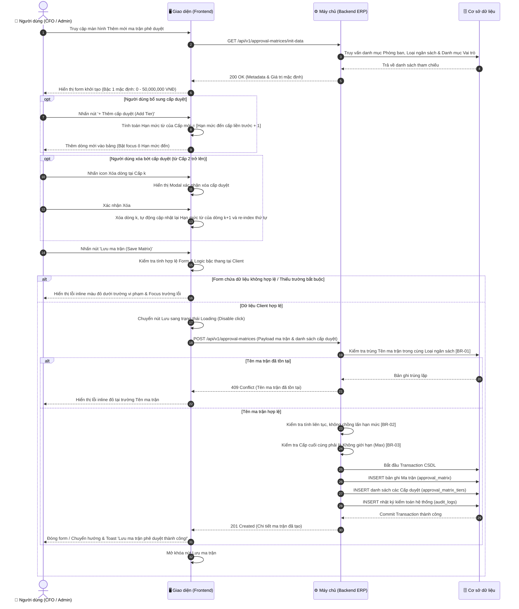

# TÀI LIỆU ĐẶC TẢ YÊU CẦU PHẦN MỀM (SRS)
## TÍNH NĂNG: THIẾT LẬP MA TRẬN PHÊ DUYỆT HẠN MỨC ĐA CẤP
**Mã tính năng:** `FIN_APPR_MATRIX_02`  
**Hệ thống:** Quản trị Tài chính & Mua sắm Doanh nghiệp (Enterprise Finance ERP)  
**Phiên bản:** 1.0  
**Tác giả:** Business Analyst Team  

---

# 1. THÔNG TIN CHUNG CHỨC NĂNG

| Thuộc tính | Nội dung mô tả |
| :--- | :--- |
| **Mã chức năng** | `FIN_APPR_MATRIX_02` |
| **Tên chức năng** | Thiết lập ma trận phê duyệt hạn mức đa cấp (Configure Multi-level Approval Matrix) |
| **Mô tả tổng quan** | Cung cấp công cụ cho Giám đốc Tài chính (CFO) và Quản trị viên cấu hình ma trận thẩm quyền phê duyệt tự động cho các loại đơn mua sắm, thanh toán và giải ngân. Quy trình phê duyệt được phân tầng theo các bậc thang hạn mức số tiền tăng dần, áp dụng linh hoạt theo phòng ban, đồng thời thiết lập thời hạn cam kết xử lý (SLA), cơ chế ủy quyền khi vắng mặt và kiểm soát rủi ro tuân thủ (SoD). |
| **Phạm vi tính năng** | - **Bao gồm (In-Scope):**<br>&nbsp;&nbsp;+ Khai báo thông tin định danh ma trận và phân loại theo nhóm chi phí (CAPEX, OPEX, Tạm ứng, Phúc lợi).<br>&nbsp;&nbsp;+ Gán phạm vi áp dụng theo từng khối/phòng ban cụ thể.<br>&nbsp;&nbsp;+ Thêm mới, chỉnh sửa, xóa các dòng cấp duyệt bậc thang động (Approval Tiers).<br>&nbsp;&nbsp;+ Tự động tính toán hạn mức bắt đầu liền kề và kiểm soát không cho chồng lấn khoảng giá trị.<br>&nbsp;&nbsp;+ Thiết lập thời hạn SLA duyệt và hành động xử lý tự động khi quá hạn (Escalate, Cảnh báo, Từ chối).<br>&nbsp;&nbsp;+ Cấu hình cơ chế ủy quyền duyệt và các ràng buộc tuân thủ (đính kèm báo giá, cấm tự duyệt).<br>- **Không bao gồm (Out-of-Scope):**<br>&nbsp;&nbsp;+ Thao tác duyệt/từ chối từng đơn hàng cụ thể của người dùng (thuộc module Hộp thư phê duyệt - Approval Inbox).<br>&nbsp;&nbsp;+ Thực hiện hạch toán chi tiền và lệnh chuyển khoản ngân hàng (thuộc module Kế toán thanh toán). |
| **Điều kiện trước** | 1. Người dùng đã đăng nhập hệ thống ERP và tài khoản được gán vai trò có thẩm quyền quản trị cấu hình tài chính (Super Admin hoặc Giám đốc Tài chính - CFO).<br>2. Đã khởi tạo danh mục Phòng ban/Đơn vị và danh mục Chức danh/Vai trò người dùng trong hệ thống quản trị nhân sự ERP.<br>3. Danh mục Loại chi phí/Ngân sách (CAPEX, OPEX...) đã được kích hoạt trong phân hệ Quản lý Ngân sách. |
| **Điều kiện sau** | 1. Thành công: Ma trận phê duyệt mới được lưu vào CSDL ở trạng thái kích hoạt (Active); Tự động áp dụng làm căn cứ định tuyến luồng duyệt cho tất cả các đơn mua sắm/thanh toán được tạo mới kể từ thời điểm lưu; Ghi nhận nhật ký kiểm toán (Audit Log) đầy đủ chi tiết các bậc duyệt.<br>2. Thất bại: Không có bản ghi ma trận nào được ghi nhận, hệ thống hiển thị thông báo lỗi chi tiết và giữ nguyên trạng thái dữ liệu trên giao diện để người dùng hiệu chỉnh. |
| **Ngoại lệ tổng quan** | 1. Xung đột cấu hình: Một quản trị viên khác vừa cập nhật ma trận cho cùng Loại chi phí và Phòng ban trước đó (Hệ thống báo lỗi xung đột phiên bản Optimistic Locking và yêu cầu tải lại dữ liệu mới nhất).<br>2. Lỗi ngắt kết nối mạng giữa client và server trong quá trình gửi payload lưu ma trận. |

---

# 2. MA TRẬN PHÂN QUYỀN (RBAC MATRIX)

Bảng phân quyền kiểm soát truy cập và phạm vi dữ liệu đối với tính năng Thiết lập ma trận phê duyệt hạn mức đa cấp:

| Vai trò | Xem | Thêm mới | Chỉnh sửa | Xóa | Tác vụ đặc biệt | Phạm vi dữ liệu |
| :--- | :---: | :---: | :---: | :---: | :--- | :--- |
| **Super Admin** | ✅ | ✅ | ✅ | ✅ | Kích hoạt/Vô hiệu hóa, Xem Audit Log | Toàn bộ hệ thống |
| **Giám đốc Tài chính (CFO)** | ✅ | ✅ | ✅ | ❌ | Kích hoạt/Vô hiệu hóa, Xem Audit Log | Toàn bộ hệ thống |
| **Kế toán trưởng** | ✅ | ❌ | ❌ | ❌ | Xem lịch sử phiên bản ma trận | Toàn bộ hệ thống (Chỉ xem) |
| **Trưởng phòng ban** | ✅ | ❌ | ❌ | ❌ | Xem quy trình duyệt áp dụng cho phòng mình | Thuộc phòng ban quản lý |
| **Nhân viên / Người lập đơn** | ❌ | ❌ | ❌ | ❌ | Không có | Không có quyền truy cập |
| **Kiểm toán nội bộ (Auditor)** | ✅ | ❌ | ❌ | ❌ | Xuất báo cáo cấu hình, Xem Audit Log | Toàn bộ hệ thống (Chỉ xem) |

*Ghi chú:*
- Nút **Lưu ma trận (Save Matrix)** và nút **+ Thêm cấp duyệt (Add Tier)** chỉ hiển thị và cho phép thao tác đối với các vai trò có quyền `Thêm mới` hoặc `Chỉnh sửa` (`Super Admin`, `CFO`).
- Các vai trò chỉ có quyền `Xem` khi truy cập sẽ hiển thị giao diện ở chế độ chỉ đọc (Read-only), vô hiệu hóa toàn bộ các ô nhập liệu, dropdown và nút bấm thay đổi dữ liệu.

---

# 3. BIỂU ĐỒ LUỒNG XỬ LÝ (WORKFLOWS)

Quy trình thiết lập ma trận phê duyệt hạn mức đa cấp là sự phối hợp chặt chẽ giữa Người dùng quản trị, Giao diện (Frontend), Máy chủ xử lý logic tài chính (Backend) và Cơ sở dữ liệu.

### 3.1. Biểu đồ tuần tự (Sequence Diagram)



### 3.2. Mô tả chi tiết logic các bước:
1. **Bước 1-5 (Khởi tạo form):** Khi người dùng mở màn hình, Frontend gọi API lấy metadata. Backend nạp danh mục Loại ngân sách, danh mục Phòng ban và danh mục Vai trò thẩm quyền phê duyệt. Giao diện điền sẵn dòng Cấp 1 mặc định (`Từ 0 đến 50,000,000 VNĐ`).
2. **Bước 6-8 (Thêm cấp duyệt động):** Khi người dùng nhấn `+ Thêm cấp duyệt`, Frontend tự động sinh dòng tiếp theo với `Hạn mức từ = Hạn mức đến của dòng trước + 1 VNĐ` (`[BR-02]`), đặt SLA mặc định và cho phép chọn vai trò duyệt.
3. **Bước 9-12 (Xóa cấp duyệt):** Nếu xóa một cấp ở giữa (ví dụ xóa Cấp 2), hệ thống hiển thị modal xác nhận. Khi xác nhận, dòng đó bị xóa, cấp tiếp theo sẽ tự động nối hạn mức và đánh số lại thứ tự cấp từ trên xuống dưới liên tục.
4. **Bước 13-16 (Client Validation & Submit):** Người dùng nhấn `Lưu ma trận`. Frontend kiểm tra: Tên không rỗng, Phòng ban có chọn, các ô Hạn mức đến > Hạn mức từ, SLA > 0. Nếu có lỗi, highlight viền đỏ và dừng request. Nếu hợp lệ, kích hoạt spinner loading trên nút Lưu.
5. **Bước 17-25 (Backend Validation & Ghi CSDL):**
   - Backend kiểm tra trùng lặp tên theo loại ngân sách (`[BR-01]`).
   - Kiểm tra thuật toán liên tục của toàn bộ dải hạn mức (`[BR-02]`) và xác thực cấp cuối cùng là Max (`[BR-03]`).
   - Mở Transaction ghi đồng thời bảng Master `approval_matrix`, bảng Detail `approval_matrix_tiers` và bảng `audit_logs`.
   - Phản hồi mã `201 Created`, Frontend hiển thị Toast thông báo thành công và điều hướng về trang danh sách ma trận.

---

# 4. THIẾT KẾ GIAO DIỆN & ĐẶC TẢ CHI TIẾT UI COMPONENTS

Giao diện được thiết kế dạng trang cấu hình tập trung (Full-page Form) chia thành 3 thẻ chức năng rõ ràng, hỗ trợ đầy đủ chế độ tương tác động theo hình ảnh thiết kế UI đính kèm.

```
+-------------------------------------------------------------------------------------------------------------------------+
| Cấu Hình Ma Trận Phê Duyệt Hạn Mức Đa Cấp  [ID: FIN_APPR_MATRIX_02]              [Hủy bỏ]   [Lưu ma trận (Save Matrix)] |
| Thiết lập quy tắc phân cấp thẩm quyền phê duyệt đơn mua sắm, thanh toán...                                              |
+-------------------------------------------------------------------------------------------------------------------------+
| [Thẻ 1: Thông Tin Quy Trình Áp Dụng]                                                                                   |
| Tên ma trận phê duyệt *                                       Loại chi phí / Ngân sách *                                |
| [ Ma trận Phê duyệt Chi phí Mua sắm Thiết bị & Hạ tầng IT   ] [ Chi phí đầu tư tài sản cố định (CAPEX)                v] |
|                                                                                                                         |
| Phòng ban / Đơn vị áp dụng *                                  Đơn vị tiền tệ tính toán                                  |
| [ (x) Khối CNTT  (x) Khối An ninh mạng  Chọn thêm phòng ban ] [ VNĐ (Việt Nam Đồng)                                   ] |
+-------------------------------------------------------------------------------------------------------------------------+
| [Thẻ 2: Bảng Thiết Lập Bậc Thang Cấp Duyệt]                                                [+ Thêm cấp duyệt (Add Tier)]|
| Hạn mức của cấp sau phải bắt đầu liền kề với hạn mức của cấp trước (+1 VNĐ)...                                          |
|-------------------------------------------------------------------------------------------------------------------------|
| CẤP | HẠN MỨC TỪ (VNĐ) | HẠN MỨC ĐẾN (VNĐ) | VAI TRÒ THẨM QUYỀN PHÊ DUYỆT | SLA DUYỆT | HÀNH ĐỘNG QUÁ HẠN SLA | XÓA     |
|  1  | [0             ] | [50,000,000     ] | [Trưởng phòng trực tiếp    v] | [24] Giờ  | [Gửi cảnh báo & Chuyển v] | [trash] |
|  2  | [50,000,001     ] | [200,000,000    ] | [Giám đốc Khối nghiệp vụ   v] | [48] Giờ  | [Gửi cảnh báo & Chuyển v] | [trash] |
|  3  | [200,000,001    ] | [oo Không giới hạn] | [Tổng Giám đốc + CFO       v] | [72] Giờ  | [Chỉ gửi email cảnh bá v] | [trash] |
+-------------------------------------------------------------------------------------------------------------------------+
| [Thẻ 3: Cơ Chế Ủy Quyền & Ràng Buộc Kiểm Soát Rủi Ro]                                                                   |
| Cho phép cơ chế Ủy quyền phê duyệt khi vắng mặt (Delegation of Authority)                                        (ON)   |
| Bắt buộc đính kèm tối thiểu 03 Báo giá cạnh tranh từ Cấp 2 (> 50 triệu VNĐ)                                     (ON)   |
| Quy tắc cấm Tự phê duyệt đơn của chính mình (Separation of Duties - SoD)                                        [ON]lock|
+-------------------------------------------------------------------------------------------------------------------------+
```

### 4.1. Bảng đặc tả chi tiết các thành phần giao diện (UI Components)

| STT | Tên trường | Loại dữ liệu | Mô tả |
| :--- | :--- | :--- | :--- |
| **1** | **Cấu Hình Ma Trận Phê Duyệt Hạn Mức Đa Cấp**<br>(Tiêu đề trang) | Label | - Tiêu đề chính của màn hình, thể hiện chức năng cấu hình quy trình phê duyệt hạn mức đa cấp.<br>- **Nội dung hiển thị mặc định:** Cấu Hình Ma Trận Phê Duyệt Hạn Mức Đa Cấp<br>- **Badge đi kèm:** `ID: FIN_APPR_MATRIX_02`<br>- **Tính chất hiển thị:** Tĩnh (Static). |
| **2** | **Hủy bỏ**<br>(Nút Cancel) | Button | - Cho phép người dùng hủy bỏ các thao tác đang nhập và quay trở về màn hình danh sách ma trận phê duyệt.<br>- **Vị trí:** Góc trên bên phải thanh tiêu đề trang.<br>- **Trạng thái mặc định:** Enabled.<br>- **Hành vi khi nhấn (OnClick Event):**<br>1. Không thực hiện kiểm tra dữ liệu đầu vào.<br>2. Nếu người dùng chưa thay đổi bất kỳ trường thông tin nào trên form: Điều hướng ngay về trang Danh sách ma trận.<br>3. Nếu người dùng đã nhập hoặc chỉnh sửa dữ liệu: Hiển thị Hộp thoại cảnh báo chưa lưu dữ liệu (Modal Unsaved Changes). |
| **3** | **Lưu ma trận**<br>(Nút Save Matrix) | Button | - Cho phép người dùng lưu lại toàn bộ cấu hình quy trình và bảng bậc thang phê duyệt.<br>- **Vị trí:** Cạnh nút Hủy bỏ ở góc trên bên phải.<br>- **Trạng thái mặc định:** Enabled.<br>- **Quyền hạn truy cập:** Chỉ người dùng có vai trò `Super Admin` hoặc `CFO` theo Ma trận phân quyền tại Mục 2.<br>- **Hành vi khi nhấn (OnClick Event):**<br>Khi nhấn vào, hệ thống thực hiện kiểm tra toàn bộ dữ liệu trên form:<br>+ Nếu dữ liệu không hợp lệ: Dừng xử lý, hiển thị các thông báo lỗi inline màu đỏ ngay dưới từng trường vi phạm và tự động cuộn màn hình đến trường lỗi đầu tiên.<br>+ Nếu dữ liệu hợp lệ: Bắt đầu gửi request xử lý:<br>&nbsp;&nbsp;. Chuyển nút sang trạng thái Loading (hiển thị spinner xoay tròn, đổi text thành `"Đang lưu ma trận..."`, vô hiệu hóa click để chống submit đúp).<br>&nbsp;&nbsp;. Gọi API `POST /api/v1/approval-matrices`. Trạng thái disable chỉ mở khóa sau khi có phản hồi từ máy chủ.<br>&nbsp;&nbsp;. Nếu lưu thành công: Điều hướng về màn hình Danh sách ma trận phê duyệt và hiển thị toast message tự động đóng: `"Lưu ma trận phê duyệt thành công!"` (`"Approval matrix saved successfully!"`).<br>&nbsp;&nbsp;. Nếu lưu không thành công: Giữ nguyên form, hiển thị toast message cảnh báo: `"Lưu ma trận phê duyệt không thành công! [Chi tiết lỗi]"` (`"Failed to save approval matrix!"`). |
| **4** | **Tên ma trận phê duyệt** | Textbox (Single-line) | - Người dùng bắt buộc nhập vào tên định danh mô tả quy trình ma trận phê duyệt.<br>- **Placeholder:**<br>&nbsp;&nbsp;+ VI: Nhập tên ma trận phê duyệt...<br>&nbsp;&nbsp;+ EN: Enter approval matrix name...<br>- **Giá trị mặc định:** Trống (Nếu tạo mới) / Điền sẵn tên cũ (Nếu chỉnh sửa).<br>- **Giới hạn ký tự:** Tối đa 128 ký tự. Hành vi khi vượt quá: Tự động chặn gõ, không nhận thêm ký tự vượt quá 128.<br>- **Kiểu ký tự hợp lệ:** Tất cả ký tự chữ, số và dấu gạch nối, không chứa ký tự đặc biệt nguy hiểm (`<`, `>`, `"`, `;`).<br>- **Quy tắc Nghiệp vụ:**<br>1. Tự động trim khoảng trắng ở đầu và cuối chuỗi trước khi kiểm tra trùng và lưu.<br>2. Tên ma trận phê duyệt phải là duy nhất trong cùng Loại chi phí / Ngân sách trên toàn hệ thống (Xem chi tiết quy tắc so sánh tại **[BR-01]**).<br>- **Thông báo lỗi tương ứng:**<br>+ Trống và nhấn Lưu: Hiển thị lỗi inline màu đỏ ngay dưới trường: `"Tên ma trận là bắt buộc!"` (`"Matrix name is required!"`)<br>+ Trùng lặp tên: Hiển thị lỗi inline màu đỏ ngay dưới trường: `"Tên ma trận phê duyệt đã tồn tại trong loại ngân sách này!"` (`"Matrix name already exists for this expense category!"`) |
| **5** | **Loại chi phí / Ngân sách** | Combobox / Dropdown (Single-select) | - Cho phép người dùng lựa chọn loại chi phí/ngân sách áp dụng quy trình duyệt này.<br>- **Nguồn dữ liệu:** Danh mục cố định gồm:<br>&nbsp;&nbsp;+ Chi phí đầu tư tài sản cố định (CAPEX)<br>&nbsp;&nbsp;+ Chi phí vận hành thường xuyên (OPEX)<br>&nbsp;&nbsp;+ Tạm ứng & Quyết toán dự án (Project Advance)<br>&nbsp;&nbsp;+ Phúc lợi & Công tác phí (Travel & Benefits)<br>- **Giá trị mặc định:** `Chi phí đầu tư tài sản cố định (CAPEX)`<br>- **Chức năng tìm kiếm:** Không.<br>- **Quy tắc Nghiệp vụ:** Mỗi Loại chi phí trong một Phòng ban chỉ được liên kết với 01 ma trận phê duyệt đang hoạt động.<br>- **Thông báo lỗi tương ứng:** Không có (do luôn có giá trị mặc định). |
| **6** | **Phòng ban / Đơn vị áp dụng** | Tag Input / Multi-select Dropdown | - Người dùng bắt buộc chọn một hoặc nhiều phòng ban áp dụng ma trận phê duyệt này.<br>- **Nguồn dữ liệu:** Danh mục phòng ban động lấy từ phân hệ Nhân sự (HRM).<br>- **Placeholder:**<br>&nbsp;&nbsp;+ VI: Chọn thêm phòng ban...<br>&nbsp;&nbsp;+ EN: Select departments...<br>- **Chế độ hiển thị:** Dạng thẻ (Tags/Chips) màu xanh tím độc lập, có icon `x` bên phải để người dùng click xóa nhanh từng phòng ban.<br>- **Cách thức chọn:** Click vào ô nhập sẽ hiển thị dropdown danh sách các phòng ban; click chọn để thêm thẻ.<br>- **Quy tắc Nghiệp vụ:** Bắt buộc phải có ít nhất 01 phòng ban được chọn.<br>- **Thông báo lỗi tương ứng:**<br>+ Trống và nhấn Lưu: Hiển thị lỗi inline màu đỏ ngay dưới trường: `"Vui lòng chọn ít nhất một phòng ban áp dụng!"` (`"Please select at least one department!"`) |
| **7** | **Đơn vị tiền tệ tính toán** | Textbox (Single-line) | - Hiển thị đơn vị tiền tệ quy chuẩn dùng để tính toán và so khớp hạn mức của các cấp duyệt.<br>- **Nội dung hiển thị:** `VNĐ (Việt Nam Đồng)`<br>- **Trạng thái tương tác:** Read-only / Disabled (Người dùng không được phép chỉnh sửa). |
| **8** | **+ Thêm cấp duyệt**<br>(Nút Add Tier) | Button | - Cho phép người dùng bổ sung thêm một cấp phê duyệt vào bảng bậc thang hạn mức.<br>- **Vị trí:** Phía trên bên phải của Thẻ 2 (Bảng cấp duyệt).<br>- **Trạng thái mặc định:** Enabled.<br>- **Hành vi khi nhấn (OnClick Event):**<br>1. Kiểm tra số lượng cấp duyệt hiện tại: Tối đa cho phép 10 cấp duyệt. Nếu đã đủ 10 cấp, hiển thị toast cảnh báo: `"Chỉ được phép thiết lập tối đa 10 cấp phê duyệt!"`.<br>2. Nếu chưa vượt giới hạn: Tự động chèn thêm một dòng mới vào cuối bảng với:<br>&nbsp;&nbsp;. Số thứ tự cấp: Tự động tăng lên 1.<br>&nbsp;&nbsp;. `Hạn mức từ`: Tự động lấy giá trị bằng `[Hạn mức đến của cấp liền trước + 1 VNĐ]`.<br>&nbsp;&nbsp;. `Hạn mức đến`: Mặc định để trống, tự động focus con trỏ chuột vào ô này để người dùng nhập.<br>&nbsp;&nbsp;. `SLA duyệt`: Mặc định `24` giờ.<br>&nbsp;&nbsp;. `Hành động quá hạn`: Mặc định `"Gửi cảnh báo & Chuyển cấp trên (Escalate)"`. |
| **9** | **Bảng thiết lập bậc thang cấp duyệt**<br>(Approval Tiers Table) | Datatable (Editable Dynamic Table) | - Hiển thị danh sách các bậc thang cấp duyệt theo thứ tự tăng dần của hạn mức số tiền.<br>- **Đặc tả chi tiết từng cột trong bảng:**<br>&nbsp;&nbsp;+ **Cột Cấp (STT):** Hiển thị số thứ tự cấp duyệt (1, 2, 3...), căn giữa, font đậm màu tím.<br>&nbsp;&nbsp;+ **Cột Hạn mức từ (VNĐ):** Ô nhập dạng Read-only, font chữ mono. Cấp 1 luôn cố định là `0`. Từ cấp 2 trở đi, giá trị tự động gán bằng `[Hạn mức đến của cấp trước + 1 VNĐ]` theo quy tắc **[BR-02]**.<br>&nbsp;&nbsp;+ **Cột Hạn mức đến (VNĐ):**<br>&nbsp;&nbsp;&nbsp;&nbsp;. Cho phép người dùng nhập số tiền tối đa của cấp duyệt tương ứng.<br>&nbsp;&nbsp;&nbsp;&nbsp;. Định dạng hiển thị: Tự động format dấu phẩy phân cách hàng nghìn (Ví dụ: `50,000,000`).<br>&nbsp;&nbsp;&nbsp;&nbsp;. Đối với cấp cuối cùng: Cho phép tích chọn hoặc hiển thị nhãn `"Không giới hạn (Max)"` (Xem quy tắc **[BR-03]**).<br>&nbsp;&nbsp;&nbsp;&nbsp;. Ràng buộc: Giá trị Hạn mức đến bắt buộc phải lớn hơn Hạn mức từ của cùng cấp đó.<br>&nbsp;&nbsp;+ **Cột Vai trò thẩm quyền phê duyệt:** Dropdown chọn chức danh phê duyệt đơn (Trưởng phòng trực tiếp, Giám đốc Khối, CFO, Tổng Giám đốc CEO, Hội đồng Quản trị). Hỗ trợ tùy chọn đồng thuận nhiều người (Ví dụ: CEO + CFO cùng duyệt).<br>&nbsp;&nbsp;+ **Cột SLA duyệt (Giờ):** Input Number nhập số giờ tối đa cho phép duyệt đơn. Khoảng giá trị: Min = 1 giờ, Max = 720 giờ (30 ngày). Mặc định: Cấp 1 là 24h, Cấp 2 là 48h, Cấp 3 là 72h.<br>&nbsp;&nbsp;+ **Cột Hành động quá hạn SLA:** Dropdown chọn hành vi xử lý khi hết hạn SLA gồm:<br>&nbsp;&nbsp;&nbsp;&nbsp;1. *Gửi cảnh báo & Chuyển cấp trên (Escalate)* - Chi tiết xem **[BR-04]**.<br>&nbsp;&nbsp;&nbsp;&nbsp;2. *Chỉ gửi email cảnh báo người duyệt*<br>&nbsp;&nbsp;&nbsp;&nbsp;3. *Tự động từ chối đơn yêu cầu (Auto Reject)*<br>&nbsp;&nbsp;+ **Cột Xóa (Icon Trash):** Nút icon thùng rác cho phép xóa dòng cấp duyệt tương ứng:<br>&nbsp;&nbsp;&nbsp;&nbsp;. Cấp 1: Nút xóa bị vô hiệu hóa (disabled, opacity 40%), không được phép xóa.<br>&nbsp;&nbsp;&nbsp;&nbsp;. Từ cấp 2 trở lên: Khi nhấn, hiển thị Hộp thoại xác nhận xóa cấp duyệt. Nếu người dùng xác nhận xóa, hệ thống xóa dòng, tự động cập nhật lại Hạn mức từ của dòng liền sau và đánh số lại thứ tự cấp liên tục. |
| **10** | **Cơ chế Ủy quyền phê duyệt khi vắng mặt**<br>(Delegation of Authority) | Switch / Toggle Button | - Cho phép người dùng bật/tắt cơ chế ủy quyền duyệt tự động khi người có thẩm quyền đi vắng/nghỉ phép.<br>- **Trạng thái mặc định:** Checked (Bật).<br>- **Quy tắc Nghiệp vụ:** Khi bật, người duyệt được quyền tạo giấy ủy quyền trên hệ thống chỉ định cấp phó duyệt thay trong khoảng thời gian xác định (Chi tiết tại **[BR-05]**).<br>- **Thông báo lỗi:** Không có. |
| **11** | **Bắt buộc đính kèm tối thiểu 03 Báo giá cạnh tranh từ Cấp 2** | Switch / Toggle Button | - Cho phép người dùng bật/tắt ràng buộc bắt buộc đính kèm hồ sơ so sánh giá đối với các đơn hàng giá trị lớn.<br>- **Trạng thái mặc định:** Checked (Bật).<br>- **Quy tắc Nghiệp vụ:** Khi bật, tất cả các đơn mua sắm có tổng giá trị thuộc Cấp 2 trở lên (> 50 triệu VNĐ) bắt buộc phải đính kèm tối thiểu 3 file báo giá cạnh tranh thì nút Gửi duyệt mới kích hoạt (Chi tiết tại **[BR-06]**).<br>- **Thông báo lỗi:** Không có. |
| **12** | **Quy tắc cấm Tự phê duyệt đơn của chính mình**<br>(Separation of Duties - SoD) | Switch / Toggle Button (Locked) | - Thể hiện nguyên tắc kiểm soát phân tách trách nhiệm trong quản trị tài chính doanh nghiệp.<br>- **Trạng thái mặc định:** Checked (Bật).<br>- **Tính chất tương tác:** Disabled / Read-only (Khóa cứng, hệ thống không cho phép tắt).<br>- **Quy tắc Nghiệp vụ:** Người lập đơn mua sắm/thanh toán dù giữ chức danh quản lý cũng tuyệt đối không được tự phê duyệt đơn của chính mình; đơn sẽ tự động nhảy lên cấp trên kế tiếp (Chi tiết tại **[BR-07]**). |

---

### 4.2. Đặc tả các Hộp thoại xác nhận đi kèm (Confirmation Modals)

#### 1. Hộp thoại Cảnh báo dữ liệu chưa lưu khi thoát (Modal Unsaved Changes)
- **Tên Modal:** Cảnh báo hủy bỏ thay đổi ma trận phê duyệt
- **Tiêu đề (Header):** `"Thông tin chưa được lưu"` (`"Unsaved changes"`)
- **Nội dung thông báo (Body):** `"Các thông tin phân cấp hạn mức và cấu hình bạn vừa nhập chưa được lưu lại. Bạn có chắc chắn muốn thoát và hủy bỏ các thay đổi này không?"` (`"The approval matrix configuration has not been saved. Are you sure you want to exit and discard changes?"`)
- **Nút Xác nhận thoát (Confirm Button):**
  - Nhãn nút: `"Thoát không lưu"` (`"Exit without saving"`) - Màu đỏ (Rose/Red).
  - Hành vi khi nhấn: Đóng modal, đồng thời điều hướng người dùng quay trở lại trang Danh sách ma trận phê duyệt, không lưu bất kỳ thay đổi nào.
- **Nút Hủy/Giữ lại (Cancel Button):**
  - Nhãn nút: `"Giữ lại tiếp tục sửa"` (`"Keep editing"`) - Màu xám viền mờ.
  - Hành vi khi nhấn: Đóng modal cảnh báo, giữ nguyên toàn bộ dữ liệu đang nhập trên form để người dùng tiếp tục thao tác.
- **Hành vi khi click vùng ngoài Modal (Backdrop click):** Không đóng modal.

#### 2. Hộp thoại Xác nhận xóa cấp duyệt (Modal Confirm Delete Tier)
- **Tên Modal:** Xác nhận xóa cấp phê duyệt
- **Tiêu đề (Header):** `"Xác nhận xóa cấp phê duyệt"` (`"Confirm Tier Deletion"`)
- **Nội dung thông báo (Body):** `"Bạn có chắc chắn muốn xóa Cấp phê duyệt {X} này không? Hạn mức của các cấp sau sẽ tự động được điều chỉnh liền kề."` (`"Are you sure you want to delete Tier {X}? Subsequent tiers will be adjusted automatically."`)
- **Nút Xác nhận xóa:** Nhãn `"Xóa cấp"` (`"Delete Tier"`) - Thực hiện xóa dòng khỏi bảng, re-index lại thứ tự và cập nhật lại hạn mức.
- **Nút Hủy:** Nhãn `"Hủy bỏ"` (`"Cancel"`) - Đóng modal, giữ nguyên dòng.

---

### 4.3. Đặc tả các trạng thái màn hình bổ trợ (Screen States)

#### 1. Trạng thái trống (Empty State) - Khi xem danh mục phòng ban
- **Điều kiện kích hoạt:** Khi người dùng mở ô tìm kiếm phòng ban mà không tìm thấy kết quả nào phù hợp.
- **Hiển thị:** Icon kính lúp xám, text: `"Không tìm thấy phòng ban phù hợp"` (`"No departments found"`).

#### 2. Trạng thái lỗi tải dữ liệu (Error / Offline State)
- **Điều kiện kích hoạt:** Khi API khởi tạo danh mục `init-data` bị lỗi 500 hoặc mất kết nối mạng.
- **Hiển thị:** Banner màu đỏ ở đầu trang kèm nội dung: `"Không thể tải danh mục cấu hình hệ thống. Vui lòng kiểm tra kết nối mạng và thử lại."` kèm nút bấm `[Tải lại (Retry)]`.

---

# 5. QUY TẮC NGHIỆP VỤ CHUYÊN SÂU (BUSINESS RULES)

### Bảng tổng hợp quy tắc nghiệp vụ:
| Mã BR | Tên quy tắc nghiệp vụ | Phân loại quy tắc | Mức độ ưu tiên |
| :--- | :--- | :--- | :---: |
| **[BR-01]** | Kiểm tra tính duy nhất của Tên ma trận theo Loại ngân sách | Ràng buộc dữ liệu & Thuật toán | Bắt buộc |
| **[BR-02]** | Thuật toán kiểm soát tính liên tục và không chồng lấn hạn mức | Ràng buộc dữ liệu & Thuật toán | Bắt buộc |
| **[BR-03]** | Quy tắc thiết lập hạn mức vô hạn cho cấp phê duyệt cao nhất | Quy trình & Trạng thái | Bắt buộc |
| **[BR-04]** | Cơ chế tự động leo thang phê duyệt khi quá hạn SLA (Escalation) | Quy trình & Trạng thái | Bắt buộc |
| **[BR-05]** | Cơ chế ủy quyền người duyệt thay thế khi vắng mặt (Delegation) | Bảo mật & Phân quyền | Bắt buộc |
| **[BR-06]** | Ràng buộc đính kèm báo giá cạnh tranh đối với đơn hàng Cấp 2 trở lên | Ràng buộc dữ liệu & Kiểm soát rủi ro | Bắt buộc |
| **[BR-07]** | Nguyên tắc phân tách nhiệm vụ và cấm tự phê duyệt đơn của chính mình | Bảo mật & Phân quyền (SoD) | Bắt buộc |

---

### Chi tiết từng quy tắc nghiệp vụ:

### [BR-01] Kiểm tra tính duy nhất của Tên ma trận theo Loại ngân sách
- **Phân loại:** Ràng buộc dữ liệu & Thuật toán
- **Phạm vi áp dụng:** Toàn bộ hệ thống ERP (áp dụng cho cả luồng tạo qua UI và Import API).
- **Điều kiện kích hoạt:** Khi người dùng nhấn nút `Lưu ma trận` hoặc khi gọi API `POST /api/v1/approval-matrices`.
- **Logic xử lý chi tiết:**
  1. Hệ thống tự động trim toàn bộ khoảng trắng ở đầu và cuối chuỗi của trường `Tên ma trận`.
  2. Thực hiện truy vấn kiểm tra trong CSDL với cặp khóa: `(LOWER(matrix_name), expense_category)`.
  3. Nếu tồn tại bản ghi có cùng tên (không phân biệt chữ hoa, chữ thường) trong cùng một Loại ngân sách: Coi là vi phạm trùng lặp.
- **Hành vi khi vi phạm:**
  - Backend hủy bỏ transaction, trả về mã lỗi HTTP `409 Conflict`.
  - Frontend highlight viền đỏ trường Tên ma trận và hiển thị lỗi inline: `"Tên ma trận phê duyệt đã tồn tại trong loại ngân sách này!"`.

---

### [BR-02] Thuật toán kiểm soát tính liên tục và không chồng lấn hạn mức
- **Phân loại:** Ràng buộc dữ liệu & Thuật toán
- **Phạm vi áp dụng:** Bảng ma trận cấp duyệt động (Approval Tiers).
- **Điều kiện kích hoạt:** Khi người dùng nhập/sửa ô `Hạn mức đến`, khi bấm thêm dòng hoặc khi xóa một dòng trong bảng.
- **Logic xử lý chi tiết:**
  1. **Quy tắc Cấp 1:** `Hạn mức từ` của Cấp 1 luôn cố định bằng `0 VNĐ` (Read-only, không cho sửa).
  2. **Quy tắc liên tục (Continuity):** Với mọi cấp $k \ge 2$, giá trị `Hạn mức từ` của Cấp $k$ được tự động tính toán theo công thức:
     $$\text{Hạn mức từ}_k = \text{Hạn mức đến}_{k-1} + 1 \text{ VNĐ}$$
  3. **Quy tắc hợp lệ khoảng (Strict Inequality):** Tại mỗi cấp $k$ (ngoại trừ cấp cuối cùng vô hạn), giá trị `Hạn mức đến` bắt buộc phải lớn hơn `Hạn mức từ`:
     $$\text{Hạn mức đến}_k > \text{Hạn mức từ}_k$$
  4. **Hành vi khi sửa đổi hạn mức ở giữa:** Nếu người dùng thay đổi giá trị `Hạn mức đến` của Cấp 1 từ `50,000,000` thành `70,000,000`, hệ thống lập tức tự động cập nhật lại `Hạn mức từ` của Cấp 2 thành `70,000,001` trên giao diện theo thời gian thực.
  5. **Hành vi khi xóa dòng:** Khi xóa dòng cấp $k$, dòng $k+1$ sẽ được gán lại `Hạn mức từ = Hạn mức đến của cấp k-1 + 1 VNĐ`.
- **Hành vi khi vi phạm:** Nếu người dùng nhập `Hạn mức đến` nhỏ hơn hoặc bằng `Hạn mức từ`, hệ thống hiển thị lỗi inline đỏ ngay dưới ô nhập: `"Hạn mức đến phải lớn hơn Hạn mức từ ({Hạn mức từ} VNĐ)!"`.

---

### [BR-03] Quy tắc thiết lập hạn mức vô hạn cho cấp phê duyệt cao nhất
- **Phân loại:** Quy trình & Trạng thái
- **Phạm vi áp dụng:** Cấp phê duyệt cuối cùng trong ma trận (Tier N).
- **Điều kiện kích hoạt:** Khi hệ thống phân tích bậc thang cuối cùng trước khi lưu.
- **Logic xử lý chi tiết:**
  1. Trong một ma trận hoàn chỉnh, cấp duyệt cao nhất (Cấp cuối cùng) bắt buộc phải bao quát toàn bộ các đơn hàng có giá trị lớn mà không có giới hạn trên.
  2. Tại cấp này, trường `Hạn mức đến` hiển thị nhãn đặc biệt: `Không giới hạn (Max)` (trong CSDL lưu giá trị `NULL` hoặc `UNLIMITED`).
  3. Thẩm quyền duyệt của cấp này bắt buộc phải thuộc về cấp quản trị tối cao (Tổng Giám đốc CEO, hoặc CEO kết hợp Giám đốc Tài chính CFO duyệt đồng thuận).
- **Hành vi khi vi phạm:** Nếu cấp cuối cùng vẫn giới hạn một số tiền cụ thể mà không có cấp bao quát phần còn lại, hệ thống từ chối lưu và cảnh báo: `"Cấp phê duyệt cao nhất phải được thiết lập Không giới hạn để đảm bảo không bị nghẽn đơn giá trị lớn!"`.

---

### [BR-04] Cơ chế tự động leo thang phê duyệt khi quá hạn SLA (Escalation)
- **Phân loại:** Quy trình & Trạng thái
- **Phạm vi áp dụng:** Các cấp duyệt có cấu hình hành động quá hạn là `"Gửi cảnh báo & Chuyển cấp trên (Escalate)"`.
- **Điều kiện kích hoạt:** Cronjob quét định kỳ mỗi 15 phút trên hệ thống Workflow Engine.
- **Logic xử lý chi tiết:**
  1. Mỗi khi đơn được chuyển đến một cấp duyệt, hệ thống gán mốc thời gian hết hạn:
     $$\text{Thời hạn xử lý (Deadline)} = \text{Thời điểm nhận đơn} + \text{SLA duyệt (Giờ)}$$
  2. Khi thời gian hiện tại vượt quá Deadline mà người duyệt chưa thao tác (Pending):
     - Hệ thống tự động chuyển trạng thái đơn sang `Escalated`.
     - Tự động gán quyền phê duyệt đơn cho người quản lý cấp trên liền kề (Cấp $k+1$).
     - Gửi email cảnh báo vi phạm SLA tới người duyệt cấp $k$ và người duyệt cấp $k+1$.
     - Ghi nhận sự kiện leo thang vào lịch sử vòng đời đơn (Audit Trail).
- **Hành vi khi quá hạn ở cấp cao nhất:** Nếu cấp cao nhất (Cấp Max) bị quá hạn SLA, hệ thống không thể chuyển cấp trên mà sẽ gửi cảnh báo khẩn cấp (Email/SMS) trực tiếp đến Thư ký Ban Giám đốc.

---

### [BR-05] Cơ chế ủy quyền người duyệt thay thế khi vắng mặt (Delegation)
- **Phân loại:** Bảo mật & Phân quyền
- **Phạm vi áp dụng:** Khi tùy chọn `Cho phép cơ chế Ủy quyền phê duyệt khi vắng mặt` ở Thẻ 3 đang ở trạng thái BẬT.
- **Điều kiện kích hoạt:** Khi một người duyệt thiết lập giấy ủy quyền duyệt thay trong hồ sơ cá nhân.
- **Logic xử lý chi tiết:**
  1. Giấy ủy quyền phải xác định rõ: Người được ủy quyền (Cấp phó hoặc nhân sự cùng cấp), Khoảng thời gian ủy quyền (Từ ngày ... Đến ngày ...), và Phạm vi hạn mức ủy quyền.
  2. Trong thời gian ủy quyền có hiệu lực, khi có đơn gửi đến người ủy quyền:
     - Hệ thống đồng thời gửi thông báo và cấp quyền duyệt tạm thời cho Người được ủy quyền.
     - Quyết định phê duyệt của Người được ủy quyền có giá trị pháp lý tương đương.
     - Trên lịch sử duyệt ghi nhận rõ: `"Đã duyệt bởi [Tên người được ủy quyền] thay mặt cho [Tên người ủy quyền]"`.
  3. Nếu tùy chọn này bị TẮT trong ma trận: Mọi giấy ủy quyền cá nhân sẽ bị vô hiệu hóa đối với các đơn thuộc ma trận này (Bắt buộc chính chủ phải duyệt).

---

### [BR-06] Ràng buộc đính kèm báo giá cạnh tranh đối với đơn hàng Cấp 2 trở lên
- **Phân loại:** Ràng buộc dữ liệu & Kiểm soát rủi ro
- **Phạm vi áp dụng:** Khi tùy chọn `Bắt buộc đính kèm tối thiểu 03 Báo giá cạnh tranh từ Cấp 2` ở Thẻ 3 đang ở trạng thái BẬT.
- **Điều kiện kích hoạt:** Khi người lập đơn tạo đơn mua sắm/thanh toán có tổng số tiền thuộc phạm vi Cấp 2 trở lên (> 50,000,000 VNĐ).
- **Logic xử lý chi tiết:**
  1. Hệ thống kiểm tra số lượng file đính kèm thuộc phân loại tài liệu `"Báo giá nhà cung cấp (Vendor Quotation)"`.
  2. Nếu số lượng file đính kèm hợp lệ $< 3$:
     - Hệ thống vô hiệu hóa nút `"Gửi phê duyệt"` trên giao diện lập đơn.
     - Hiển thị thông báo hướng dẫn: `"Đơn hàng trên 50 triệu VNĐ bắt buộc phải đính kèm tối thiểu 03 báo giá cạnh tranh theo quy chế mua sắm!"`.
- **Hành vi khi vi phạm:** Chặn gửi đơn ở tầng giao diện và chặn ở tầng API Backend (trả về lỗi `422 Unprocessable Entity` nếu cố tình gửi request qua API).

---

### [BR-07] Nguyên tắc phân tách nhiệm vụ và cấm tự phê duyệt đơn của chính mình
- **Phân loại:** Bảo mật & Phân quyền (Separation of Duties - SoD)
- **Phạm vi áp dụng:** Toàn bộ hệ thống phê duyệt tài chính, áp dụng cố định (Hard Rule - không thể tắt).
- **Điều kiện kích hoạt:** Khi hệ thống xác định người duyệt cho một đơn hàng mới tạo.
- **Logic xử lý chi tiết:**
  1. Lấy thông tin `Người tạo đơn (Requester ID)`.
  2. Đối chiếu với danh sách `Người có thẩm quyền duyệt ở cấp hiện tại (Approver IDs)`:
     - Nếu `Requester ID` trùng khớp với một người trong danh sách người duyệt: Hệ thống tự động loại bỏ người này khỏi quyền duyệt đơn đó.
     - Nếu người đó là người duyệt duy nhất ở cấp hiện tại (ví dụ: Trưởng phòng tự làm đơn mua sắm cho mình): Hệ thống tự động bỏ qua (bypass) cấp này và chuyển đơn thẳng lên cấp quản lý cao hơn kế tiếp (Giám đốc Khối).
  3. Ghi chú rõ trong nhật ký luồng duyệt: `"Tự động chuyển cấp do Người tạo đơn trùng với Người phê duyệt (Quy tắc SoD [BR-07])"`.
