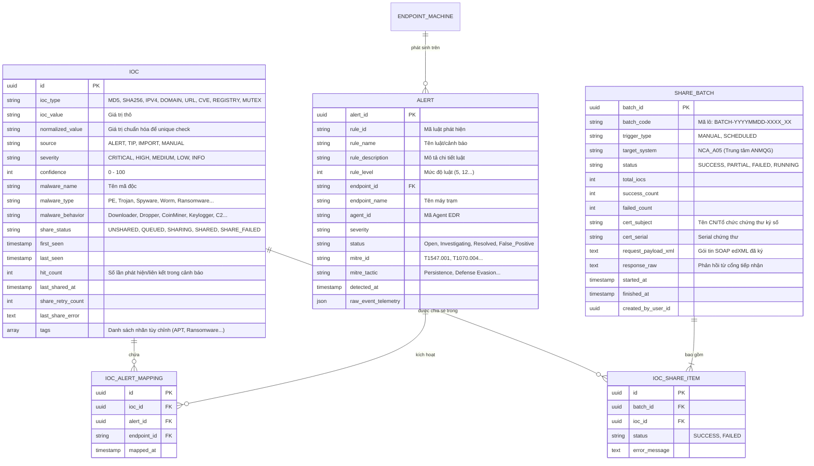
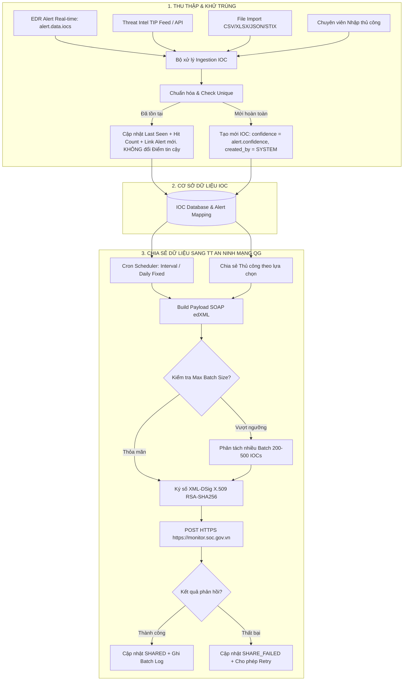
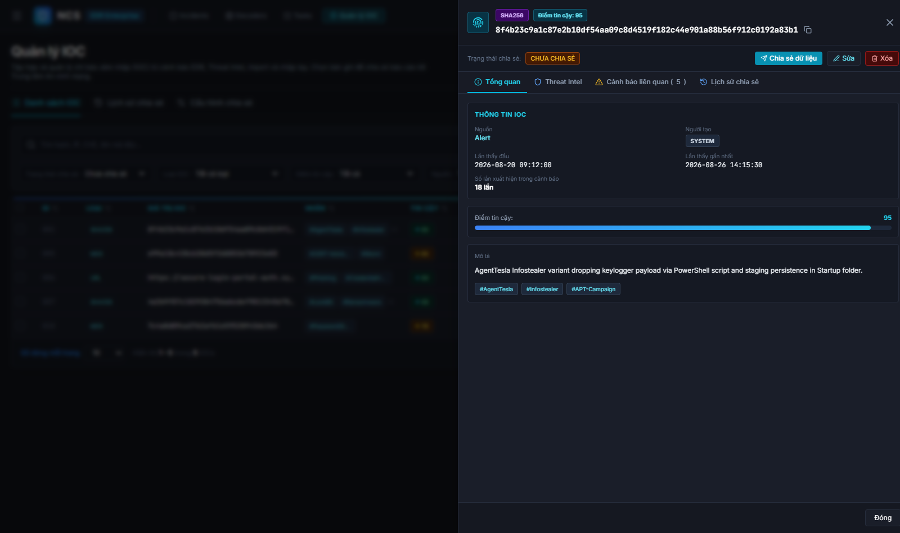
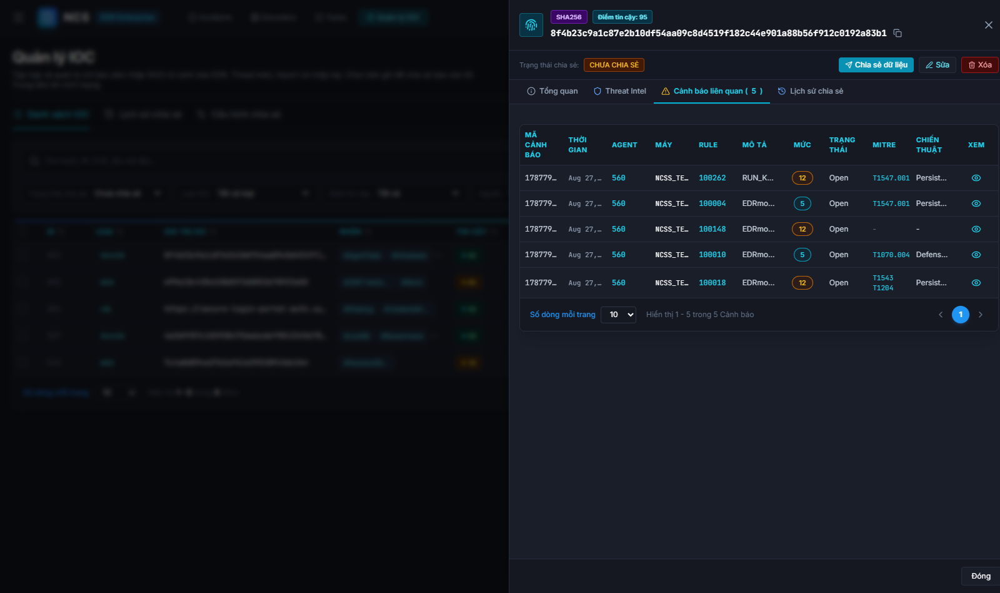
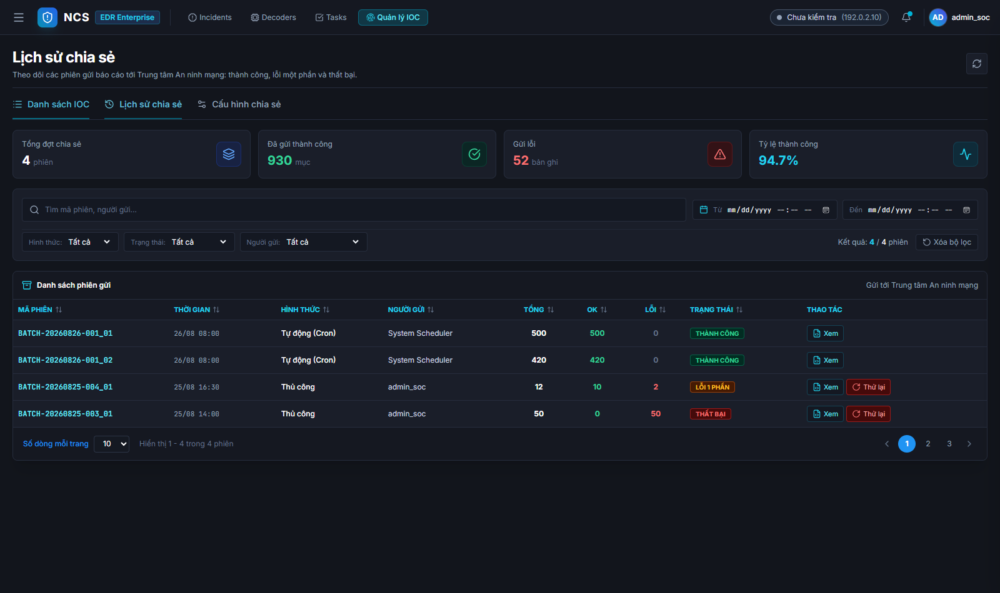
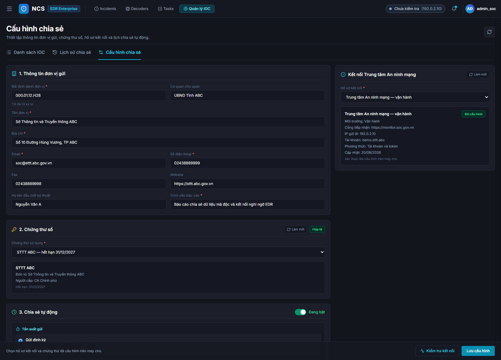
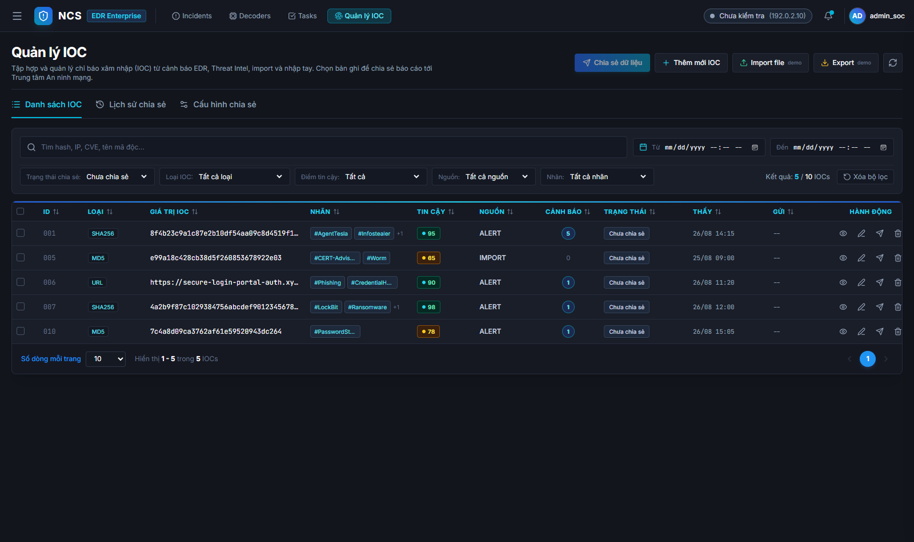

# TÀI LIỆU ĐẶC TẢ YÊU CẦU NGHIỆP VỤ & HỆ THỐNG (BRD & SRS)
# TÍNH NĂNG: QUẢN LÝ THÔNG TIN NHẬN DIỆN MỐI NGUY HẠI (IOC MANAGEMENT) & CHIA SẺ DỮ LIỆU TRÊN HỆ THỐNG EDR

---

| **Thuộc tính** | **Chi tiết** |
|---|---|
| **Dự án** | Hệ thống Giám sát và Ứng cứu sự cố Điểm cuối (Endpoint Detection & Response - EDR) |
| **Phân hệ** | Quản lý Mối đe dọa & Chia sẻ Dữ liệu (Threat Intelligence & National Sharing Integration) |
| **Phiên bản tài liệu** | v2.0 (Cập nhật đồng bộ theo bản thiết kế giao diện chi tiết) |
| **Tác giả** | Senior Business Analyst / Cybersecurity Domain Expert |
| **Tài liệu tham chiếu** | Phụ lục 2: Hướng dẫn kết nối chia sẻ dữ liệu phòng chống mã độc với TT An ninh mạng quốc gia (Kèm CV 8676/A05-TT4) |
| **Đối tượng áp dụng** | Product Owner, SOC Lead, Dev Backend/Frontend, QA/Tester, Integration Engineer |

---

## 1. TỔNG QUAN & BỐI CẢNH NGHIỆP VỤ (EXECUTIVE SUMMARY)

### 1.1. Bối cảnh
Trong hệ thống EDR, **IOC (Indicator of Compromise)** là các dấu hiệu kỹ thuật phản ánh hành vi xâm nhập độc hại trên endpoint (như mã băm tập tin độc hại SHA256/MD5, địa chỉ C2 IP/Domain, URL phishing, CVE lỗ hổng bị khai thác). 

Để hoàn thiện năng lực phát hiện, điều tra và tuân thủ quy định giám sát an toàn thông tin quốc gia, phân hệ **Quản lý IOC & Chia sẻ Dữ liệu** đáp ứng 4 trụ cột nghiệp vụ cốt lõi:
1. **Thu thập tập trung & Tự động khử trùng (Deduplication):** Tích hợp đa nguồn (tự động bóc tách mảng `data.iocs` từ các EDR Alert nội bộ, nhận luồng đẩy từ Threat Intelligence Platform - TIP, Import file và nhập thủ công). Đảm bảo tính duy nhất, liên tục cập nhật vòng đời (*First seen*, *Last seen*, *Số lần bắt gặp*), giữ nguyên Điểm tin cậy ban đầu hoặc đã chỉnh sửa khi trùng, và liên kết 2 chiều với danh sách Cảnh báo liên quan (Associated Alerts).
2. **Tuân thủ quy chuẩn chia sẻ dữ liệu Quốc gia (Cục A05 - Bộ Công An):** Đóng gói và truyền tải dữ liệu giám sát mã độc, kết nối nghi ngờ, lỗ hổng sang Trung tâm An ninh mạng quốc gia (`monitor.soc.gov.vn`) theo định dạng **SOAP edXML** có **chữ ký số XML-DSig** (X.509 Certificate).
3. **Cơ chế chia sẻ linh hoạt & Kiểm soát lịch sử:** Hỗ trợ cả chia sẻ thủ công theo bộ lọc/lựa chọn và chia sẻ tự động theo lịch (Cron Scheduler linh hoạt với 2 chế độ: Lặp định kỳ hoặc Khung giờ cố định hàng ngày, kiểm soát kích thước lô Max Batch Size 10 - 1,000 IOCs), lưu vết chi tiết trạng thái gửi và nhật ký kiểm toán phiên gửi.
4. **Quản trị dữ liệu mạnh mẽ:** Tìm kiếm nâng cao, bộ lọc đa tầng (Thời gian Từ-Đến, Trạng thái chia sẻ, Loại IOC, Điểm tin cậy từ 0 - 100, Nguồn, Nhãn/Tag); hỗ trợ Import/Export đa định dạng chuẩn (CSV, XLSX, JSON, STIX 2.1).

---

## 2. KIẾN TRÚC THỰC THỂ & MÔ HÌNH DỮ LIỆU (DATA MODEL)

### 2.1. Sơ đồ Quan hệ Thực thể (ERD)



### 2.2. Chi tiết Từ điển Dữ liệu (Data Dictionary) của Bảng `IOC`

| Tên trường | Kiểu dữ liệu | Bắt buộc | Mô tả & Quy tắc nghiệp vụ |
|---|---|:---:|---|
| `id` | UUID | Có | Khóa chính tự sinh |
| `ioc_type` | Enum | Có | Các loại: `MD5`, `SHA1`, `SHA256`, `IPV4`, `IPV6`, `DOMAIN`, `URL`, `CVE`, `REGISTRY`, `MUTEX` |
| `ioc_value` | Varchar(1000) | Có | Giá trị gốc người dùng hoặc hệ thống đưa vào |
| `normalized_value` | Varchar(1000) | Có | Chuẩn hóa: Lowercase, bỏ trailing slash (URL), trim space. Đánh index Unique kết hợp `(ioc_type, normalized_value)` |
| `source` | Enum | Có | `ALERT` (Cảnh báo EDR), `TIP` (Threat Intel Platform), `IMPORT` (File import), `MANUAL` (Nhập thủ công) |
| `severity` | Enum | Không | Mức độ nguy hiểm: `CRITICAL`, `HIGH`, `MEDIUM`, `LOW`, `INFO` |
| `confidence` | Integer (0-100) | Có | **Điểm tin cậy** của IOC theo thang 0 đến 100 (Ví dụ: Alert=98, TIP=90, Import=80, Thủ công=85) |
| `malware_name` | Varchar(255) | Không | Tên chủng mã độc (Ví dụ: `Trojan.Win32.CobaltStrike`, `Ransom.LockBit3`) |
| `malware_type` | Varchar(100) | Không | Phân loại mã độc: `PE`, `Trojan`, `Spyware`, `Worm`, `Ransomware`, `Rootkit` |
| `malware_behavior` | Varchar(100) | Không | Hành vi mã độc: `Downloader`, `Dropper`, `Keylogger`, `C2`, `File Encryption` |
| `share_status` | Enum | Có | Trạng thái chia sẻ: `UNSHARED` (Chưa chia sẻ), `QUEUED` (Đang chờ gửi), `SHARED` (Đã chia sẻ), `SHARE_FAILED` (Chia sẻ lỗi) |
| `first_seen` | Timestamp | Có | Thời điểm đầu tiên ghi nhận IOC trong toàn hệ thống |
| `last_seen` | Timestamp | Có | Thời điểm gần nhất IOC được bắt gặp lại (từ alert mới hoặc đợt sync TIP mới) |
| `hit_count` | Integer | Có | Tổng số lần IOC xuất hiện trong các alerts (Khởi tạo = 1, tăng dần khi trùng lặp) |
| `last_shared_at` | Timestamp | Không | Thời điểm gần nhất chia sẻ thành công hoặc lỗi |
| `last_share_error` | Text | Không | Thông điệp lỗi chi tiết từ hệ thống tiếp nhận (nếu thất bại) |
| `tags` | Array[String] | Không | Danh sách nhãn phân loại (Ví dụ: `APT29`, `Phishing`, `Ransomware`, `CobaltStrike`) |

---

## 3. ĐẶC TẢ CHI TIẾT CÁC LUỒNG NGHIỆP VỤ (USE CASE FLOWS)



### 3.1. Luồng 1: Tự động trích xuất IOC từ Alert EDR & Khử trùng dữ liệu (Deduplication)

#### 3.1.1. Cấu trúc Payload Alert chứa thông tin IOC
Khi hệ thống EDR phát hiện hành vi bất thường trên máy trạm, Alert được sinh ra với cấu trúc JSON chứa mảng `data.iocs`:
```json
{
  "alert_id": "1787794081.37464",
  "rule_id": "100262",
  "rule_name": "RUN_KEY_PERSIST: Run key added pointing to",
  "agent_id": "560",
  "agent_name": "NCSS_TEST_INSTALLER_TOOL_70D7_2",
  "data": {
    "iocs": [
      {
        "type": "md5",
        "value": "547b18831411ca24b76120a2259d7e15",
        "confidence": 98
      },
      {
        "type": "sha256",
        "value": "8f4b23c9a1c87e2b10df54aa09c8d4519f182c44e901a88b56f912c0192a83b1",
        "confidence": 85
      }
    ]
  }
}
```

#### 3.1.2. Quy tắc Khử trùng & Lưu trữ:
1. **Trường hợp IOC chưa tồn tại trong hệ thống:**
   - Tạo mới bản ghi IOC trong DB.
   - Gán `confidence = alert.confidence` (lấy từ alert).
   - Gán `source = 'ALERT'`, `created_by = 'SYSTEM'`, `share_status = 'UNSHARED'`, `hit_count = 1`.
   - Ghi nhận `first_seen = alert.time`, `last_seen = alert.time`.
   - Tạo liên kết trong bảng `IOC_ALERT_MAPPING` tới Alert hiện tại.
2. **Trường hợp IOC đã tồn tại trong hệ thống:**
   - **KHÔNG cập nhật / KHÔNG ghi đè Điểm tin cậy (Confidence)** nhằm bảo lưu giá trị ban đầu hoặc điểm đã được chuyên viên tinh chỉnh thủ công.
   - Cập nhật thời gian `last_seen = alert.time`.
   - Tăng biến đếm `hit_count = hit_count + 1`.
   - Thêm bản ghi mới vào `IOC_ALERT_MAPPING` để liên kết Alert mới vào danh sách Cảnh báo liên quan của IOC đó.
   - Cho phép chuyên viên SOC chỉnh sửa Điểm tin cậy thủ công bất kỳ lúc nào trên giao diện.

---

### 3.2. Luồng 2: Đóng gói Payload SOAP edXML & Ký số XML-DSig X.509

Theo chuẩn kỹ thuật quy định tại **Phụ lục 2 (Kèm CV 8676/A05-TT4)**, dữ liệu chia sẻ sang Trung tâm An ninh mạng Quốc gia được đóng gói theo định dạng SOAP Envelope chứa cấu trúc `edXML`:

```xml
<?xml version="1.0" encoding="UTF-8"?>
<soapenv:Envelope xmlns:soapenv="http://schemas.xmlsoap.org/soap/envelope/" xmlns:edXML="http://edxml.gov.vn/schema">
    <soapenv:Header>
        <edXML:MessageHeader>
            <edXML:From>
                <edXML:OrganId>000.01.12.H28</edXML:OrganId>
                <edXML:OrganizationInCharge>UBND Tỉnh ABC</edXML:OrganizationInCharge>
                <edXML:OrganName>Sở Thông tin và Truyền thông ABC</edXML:OrganName>
                <edXML:OrganAdd>Số 10 Đường Hùng Vương, TP ABC</edXML:OrganAdd>
                <edXML:Email>soc@sttt.abc.gov.vn</edXML:Email>
                <edXML:Telephone>0243.888.9999</edXML:Telephone>
            </edXML:From>
            <edXML:Subject>Báo cáo chia sẻ dữ liệu mã độc và kết nối độc hại EDR</edXML:Subject>
        </edXML:MessageHeader>
        <Signature xmlns="http://www.w3.org/2000/09/xmldsig#">
            <SignedInfo>
                <CanonicalizationMethod Algorithm="http://www.w3.org/TR/xml-exc-c14n/"/>
                <SignatureMethod Algorithm="http://www.w3.org/2001/04/xmldsig-more#rsa-sha256"/>
                <Reference URI="">
                    <DigestMethod Algorithm="http://www.w3.org/2001/04/xmlenc#sha256"/>
                    <DigestValue>X5kL9qZ1P0mRtVwXyZ8aB...Digest...</DigestValue>
                </Reference>
            </SignedInfo>
            <SignatureValue>MEYCIQDxK3...DigitalSignatureBase64...==</SignatureValue>
            <KeyInfo>
                <X509Data>
                    <X509SubjectName>CN=STTT ABC, O=UBND Tinh ABC, C=VN</X509SubjectName>
                    <X509Certificate>MIIE8TCCAtmgAwIBAgIU...CertificateBase64...==</X509Certificate>
                </X509Data>
            </KeyInfo>
        </Signature>
    </soapenv:Header>
    <soapenv:Body>
        <AVReport name="NCS Enterprise EDR">
            <Datetime>1724662800</Datetime>
            <Malware>
                <Machine ip="192.168.10.45" ippublic="113.160.25.10" name="WS-KETOAN-02">
                    <MalwareInfo>
                        <MalwareName>Trojan.Win32.AgentTesla</MalwareName>
                        <MalwareType>Trojan</MalwareType>
                        <MalwareBehavior>Keylogger</MalwareBehavior>
                        <PathFile>C:\Users\Admin\AppData\Roaming\svchost.exe</PathFile>
                        <HashFile>547b18831411ca24b76120a2259d7e15</HashFile>
                        <TypeOfDevice>SSD</TypeOfDevice>
                        <NumberFile>1</NumberFile>
                    </MalwareInfo>
                </Machine>
            </Malware>
            <Connection>
                <Machine ip="192.168.10.45" name="WS-KETOAN-02">
                    <ConnectionInfo>
                        <Program>svchost.exe</Program>
                        <TargetIP>198.51.100.23</TargetIP>
                        <TargetPort>443</TargetPort>
                    </ConnectionInfo>
                </Machine>
            </Connection>
        </AVReport>
    </soapenv:Body>
</soapenv:Envelope>
```

---

### 3.3. Luồng 3: Quản trị Chia sẻ (Thủ công, Tự động & Lịch sử kiểm toán)

#### 3.3.1. Chia sẻ Thủ công theo Lựa chọn (Manual Sharing)
- Chuyên viên tích chọn 1 hoặc nhiều bản ghi IOC trên bảng danh sách.
- Bấm nút **"Chia sẻ dữ liệu"** $\rightarrow$ Hệ thống mở Modal xác nhận thông tin đơn vị gửi, chứng thư số, số lượng bản ghi hợp lệ và cảnh báo các bản ghi sẽ bỏ qua (nếu có).
- Bấm **"Xác nhận gửi"** $\rightarrow$ Backend tạo phiên `SHARE_BATCH`, phân tách lô nếu vượt ngưỡng, ký số XML-DSig và gửi POST HTTPS tới cổng tiếp nhận.
- Kết quả cập nhật trạng thái thời gian thực (`SHARED` / `SHARE_FAILED`).

#### 3.3.2. Chia sẻ Tự động theo Lịch (Cron Scheduler linh hoạt)
1. **Thiết lập tần suất gửi linh hoạt (2 chế độ):**
   - **Chế độ 1: Định kỳ lặp lại (Interval Mode):** Cho phép nhập số lượng và chọn đơn vị thời gian (*Ví dụ: Mỗi `15` hoặc `30` `Phút / Giờ / Ngày`*).
   - **Chế độ 2: Khung giờ cố định hàng ngày (Fixed Daily Time):** Cho phép chọn giờ cố định trong ngày (*Ví dụ: Vào lúc `23:00` hàng ngày*).
2. **Kích thước lô tối đa (Max Batch Size):**
   - Ràng buộc giới hạn an toàn từ **`10` đến `1,000` IOCs/Batch** (Mặc định: 500) nhằm chống quá tải băng thông và gateway.
   - Khi số lượng IOC cần gửi vượt quá Max Batch Size, hệ thống tự động chia nhỏ thành các Batch tuần tự (`BATCH-YYYYMMDD-001_01`, `BATCH-YYYYMMDD-001_02`...).
3. **Bộ lọc tiêu chí gửi đa dạng:**
   - Trạng thái gửi: `Chưa chia sẻ (UNSHARED)`, `Chia sẻ lỗi (SHARE_FAILED)`, và cho phép gửi lại cả `Đã chia sẻ (SHARED)`.
   - Chọn nhiều loại IOC (Multi-select: SHA256, MD5, IPv4, Domain, URL, CVE).
   - Chọn nhiều nguồn dữ liệu (Alert EDR, TIP, Import, Thủ công).
   - Ngưỡng Điểm tin cậy tối thiểu (*Ví dụ: $\ge 80$*).

---

## 4. BỘ TÍNH NĂNG & THIẾT KẾ GIAO DIỆN CHI TIẾT (UI/UX DESIGN SPECS)

### 4.1. Cấu trúc Menu & Điều hướng Phân hệ
- **Topbar Hệ thống:**
  - Chỉ báo trạng thái kết nối cổng tiếp nhận: Badge động hiển thị trạng thái (*Connected / Chưa kiểm tra / Lỗi*) kèm IP tĩnh đã duyệt (`192.0.2.10` / `113.160.25.10`).
- **3 Phân hệ Tab chính:**
  1. **Danh sách IOC** *(Màn hình chính)*
  2. **Lịch sử chia sẻ** *(Kiểm toán các đợt gửi)*
  3. **Cấu hình chia sẻ** *(Thiết lập đơn vị, cert, lập lịch và cổng tiếp nhận)*

---

### 4.2. Màn hình 1: Danh sách & Bộ lọc Quản lý IOC (IOC Inventory)
Màn hình trung tâm quản lý toàn bộ kho IOC của hệ thống EDR:


#### Các thành phần chức năng trên màn hình:
1. **Thanh tác vụ Header:**
   - Nút `[ Chia sẻ dữ liệu ]` (kèm số lượng đang chọn, chỉ sáng khi có tích chọn).
   - Nút `[ + Thêm mới IOC ]` mở modal nhập liệu.
   - Nút `[ Import file ]` và `[ Export ]`.
   - Nút `[ Làm mới ]`.
2. **Thanh Tìm kiếm & Bộ lọc nâng cao:**
   - Ô tìm kiếm: Placeholder *"Tìm hash, IP, CVE, tên mã độc..."*.
   - Bộ lọc Thời gian: 2 ô chọn Từ ngày giờ - Đến ngày giờ (`datetime-local`).
   - Dropdown Trạng thái chia sẻ: *Tất cả trạng thái, Chưa chia sẻ, Chia sẻ lỗi, Đã chia sẻ, Đang chờ gửi* (dạng text thuần).
   - Dropdown Loại IOC: *Tất cả loại, SHA256, MD5, IPv4, Domain, URL, CVE*.
   - Dropdown Điểm tin cậy: *Tất cả, Rất cao & Cao (≥ 80), Trung bình (50 - 79), Thấp (< 50)* (thang 0-100, không có ký tự %).
   - Dropdown Nguồn: *Tất cả nguồn, Cảnh báo EDR, Threat Intel (TIP), Import File, Nhập thủ công*.
   - Dropdown Nhãn (Tag filter): *Tất cả nhãn, APT, Ransomware, CobaltStrike, Phishing...*.
   - Hiển thị số lượng động: **`Kết quả: [ X ] / [ Tổng ] IOCs`** (tự động cập nhật ngay khi đổi điều kiện lọc).
3. **Bảng Dữ liệu IOC (12 cột chuẩn, table-fixed không ngắt dòng):**
   - `[ ]` (Checkbox chọn dòng)
   - `ID` (Mã IOC)
   - `LOẠI` (SHA256, MD5, IPV4, DOMAIN, URL, CVE)
   - `GIÁ TRỊ IOC` (Chỉ hiển thị giá trị thô, font mono, copy nhanh)
   - `NHÃN` (Hiển thị các tag/badge màu phân loại mối nguy)
   - `TIN CẬY` (Điểm tin cậy từ 0 - 100 dạng badge màu)
   - `NGUỒN` (Cảnh báo EDR, TIP, Import, Thủ công)
   - `CẢNH BÁO` (Số lượng cảnh báo liên quan, click để mở trực tiếp tab Cảnh báo trong Drawer)
   - `TRẠNG THÁI` (Badge trạng thái chia sẻ)
   - `THẤY` (Thời gian thấy gần nhất)
   - `GỬI` (Thời gian gửi gần nhất)
   - `HÀNH ĐỘNG` (Xem chi tiết Drawer, Chỉnh sửa, Chia sẻ lẻ, Xóa)
4. **Thanh phân trang NCS chuẩn:**
   - Rows per page: Dropdown 10, 20, 50.
   - Text đếm: `Hiển thị X - Y trong Z IOCs`.
   - Điều hướng phân trang số tròn.

---

### 4.3. Màn hình 2: Popup Chi tiết IOC (Drawer 50% màn hình)
Khi click vào một dòng IOC bất kỳ, hệ thống trượt mở Drawer từ cạnh phải màn hình với độ rộng chính xác **50% màn hình**, cung cấp 4 Tab chuyên sâu:





#### Chi tiết 4 Tab trong Drawer:
- **Tab 1 - Tổng quan:**
  - Thông tin nhận diện: *Nguồn thu thập (Alert/TIP/Import/Manual)*, *Người tạo (SYSTEM / admin_soc)*, *First Seen*, *Last Seen*, *Số lần bắt gặp trong Cảnh báo*.
  - **Điểm tin cậy của IOC:** Thang điểm 0 - 100 hiển thị thanh bar trực quan.
  - Mô tả & Ngữ cảnh tấn công, Danh sách Nhãn (Tags).
- **Tab 2 - Threat Intel:**
  - Tên mối đe dọa, Phân loại mã độc, Hành vi mã độc, Nguồn intel, Mức độ nghiêm trọng (Severity), TLP/PAP Marking, nút liên kết nền tảng TIP.
- **Tab 3 - Cảnh báo liên quan (Associated Alerts Table):**
  - Bảng dữ liệu chuẩn **11 cột**: `ALERT ID`, `TIME`, `AGENT ID`, `AGENT NAME`, `RULE ID`, `RULE DESCRIPTION`, `RULE LEVEL`, `ALERT STATUS`, `MITRE ID`, `MITRE TACTIC`, `ACTION`.
  - Hỗ trợ cuộn ngang `min-w-[1180px]` và phân trang riêng.
  - Cột `ACTION`: Click icon con mắt mở Modal xem đầy đủ chi tiết Cảnh báo (`modal-alert-detail`).
- **Tab 4 - Lịch sử chia sẻ:**
  - Danh sách chi tiết các lần gửi của riêng bản ghi IOC này.

---

### 4.4. Màn hình 3: Lịch sử Chia sẻ Dữ liệu (Sharing History & Logs)
Màn hình kiểm toán và giám sát toàn bộ các phiên gửi dữ liệu theo lô:



- **4 Thẻ thống kê tổng quan:** Tổng đợt chia sẻ, Số bản ghi thành công, Số bản ghi lỗi, Tỷ lệ thành công (%).
- **Bảng Lịch sử Phiên gửi (9 cột):** `MÃ PHIÊN (BATCH ID)`, `THỜI GIAN GỬI`, `HÌNH THỨC`, `NGƯỜI GỬI`, `TỔNG SỐ`, `THÀNH CÔNG`, `LỖI`, `TRẠNG THÁI`, `THAO TÁC`.
- **Cột Thao tác:**
  - Nút **`[ Xem XML ]`**: Mở modal xem và sao chép gói tin SOAP edXML đã ký số XML-DSig.
  - Nút **`[ Thử lại lỗi ]`**: Chỉ hiển thị khi có bản ghi lỗi, cho phép gửi lại ngay lập tức.

---

### 4.5. Màn hình 4: Cấu hình chia sẻ (Connection & Sharing Settings)
Cung cấp giao diện quản trị toàn diện:



1. **Mục 1: Thông tin đơn vị gửi báo cáo (`edXML:From`):**
   - Mã định danh đơn vị (`OrganId` tối đa 13 ký tự theo QCVN 102:2016/BTTTT).
   - Tên cơ quan chủ quản, Tên đơn vị gửi báo cáo, Địa chỉ, Email đầu mối, Số điện thoại.
2. **Mục 2: Chứng thư số Ký gói tin (XML Digital Signature X.509):**
   - Nút **`Thay đổi file cert...`** kích hoạt cửa sổ tải file từ máy tính.
   - Tự động kiểm tra định dạng hợp lệ (`.pfx`, `.p12`, `.pem`, `.cer`, `.crt`).
   - Hiển thị tên file cert, Subject X.509, Thời hạn hiệu lực và Thuật toán ký (RSA-SHA256).
3. **Mục 3: Thiết lập Chia sẻ Tự động theo Lịch (Cron Scheduler linh hoạt):**
   - Toggle Bật / Tắt tiến trình tự động.
   - **Tần suất gửi (2 chế độ lựa chọn):**
     - *Chế độ 1: Định kỳ lặp lại (Interval):* Nhập số lượng + chọn đơn vị (*Mỗi `[ 15 ]` `[ Phút / Giờ / Ngày ]`*).
     - *Chế độ 2: Khung giờ cố định hàng ngày:* Chọn thời gian (*Vào lúc `[ 23:00 ]` hàng ngày*).
   - **Kích thước lô tối đa (Max Batch Size):** Giới hạn từ `10` đến `1,000` IOCs/Batch.
   - **Tiêu chí lọc dữ liệu chia sẻ:**
     - Checkbox trạng thái: Chưa chia sẻ, Chia sẻ lỗi, Gửi lại cả IOC đã chia sẻ.
     - Multi-select Loại IOC: Checkbox độc lập (*SHA256, MD5, IPv4, Domain, URL, CVE*) kèm nút *"Chọn tất cả / Bỏ chọn"*.
     - Multi-select Nguồn: Checkbox chọn đồng thời nhiều nguồn (*EDR Alert, TIP, Import, Thủ công*).
     - Điểm tin cậy tối thiểu: Ô nhập điểm số (*$\ge [ 80 ]$*).
4. **Mục 4: Thông số Cổng tiếp nhận & Kiểm tra kết nối:**
   - Hiển thị URL cổng tiếp nhận (`https://monitor.soc.gov.vn`), IP Public tĩnh đã duyệt, giao thức SOAP edXML, chuẩn ký số C14N.
   - Nút **`Kiểm tra Kết nối & Ký thử`**: Thực hiện ping kiểm tra cổng và cập nhật badge trạng thái kết nối trên Topbar.

---

### 4.6. Màn hình 5 & Các Modals Hỗ trợ Nghiệp vụ

1. **Form Thêm mới IOC (`modal-create-ioc`):**
   - Cho phép chuyên viên SOC chủ động thêm mới IOC với trường Điểm tin cậy (0 - 100), Nhãn phân loại, Đánh dấu TLP/PAP Marking, Nguồn và Pattern/Value.
   
   

2. **Modal Chi tiết Cảnh báo EDR (`modal-alert-detail`):**
   - Hiển thị đầy đủ thông tin: Mã Alert, Tên luật, Agent ID/Name, Hostname, IP máy trạm, Thời điểm phát hiện, MITRE Tactic/Technique, Mã lỗi và hành động xử lý.
3. **Modal Gửi tới Trung tâm An ninh mạng (`modal-share-a05`):**
   - Hiển thị tóm tắt đơn vị gửi, chứng thư số, số lượng bản ghi hợp lệ, thông tin phân tách lô (Batch splitting) và danh sách các bản ghi sẽ bị bỏ qua (nếu thiếu thông tin).
4. **Modal Import IOC (`modal-import`):**
   - Hỗ trợ định dạng CSV, XLSX, JSON, STIX 2.1 kèm tùy chọn xử lý trùng lặp.
5. **Modal Export IOC (`modal-export`):**
   - Cho phép xuất tất cả theo bộ lọc hoặc chỉ xuất các dòng đang chọn sang định dạng CSV, XLSX, JSON, STIX 2.1.
6. **Modal Xem gói tin SOAP edXML (`modal-view-xml`):**
   - Xem toàn văn gói tin SOAP edXML đã ký số XML-DSig và hỗ trợ sao chép nhanh.

---

## 5. YÊU CẦU PHI CHỨC NĂNG (NON-FUNCTIONAL REQUIREMENTS - NFRS)

1. **Hiệu năng & Khả năng mở rộng (Performance & Scalability):**
   - Bộ khử trùng (Deduplication engine) xử lý kiểm tra trùng và ghi nhận IOC trong thời gian $< 50ms$ trên mỗi Alert.
   - Hỗ trợ dung lượng lưu trữ tối thiểu 5,000,000 IOCs với tốc độ truy vấn, lọc dữ liệu $< 500ms$ (sử dụng PostgreSQL / ElasticSearch index).
   - Module đóng gói và ký số XML-DSig xử lý batch 500 IOCs trong thời gian $< 2$ giây.
2. **Tính toàn vẹn & Bảo mật (Security & Integrity):**
   - Khóa bí mật (Private Key) của chứng thư số X.509 phải được mã hóa lưu trong KMS/Vault an toàn, tuyệt đối không lộ trên log hoặc client.
   - Giao tiếp với cổng tiếp nhận qua TLS 1.3/1.2 với ràng buộc IP tĩnh.
   - Ghi Audit Log toàn bộ hành vi: Ai import file, ai thực hiện gửi thủ công, thay đổi cấu hình lịch gửi.
3. **Độ tin cậy & Chống mất dữ liệu (Reliability & Fault Tolerance):**
   - Cơ chế Message Queue (RabbitMQ / Kafka / Celery) đảm bảo không bỏ sót IOC khi có hàng nghìn Alerts phát sinh cùng lúc trong các đợt tấn công bão táp (Alert Storm).
   - Cơ chế Idempotency: Không gửi trùng gói tin nếu lần gửi trước đang ở trạng thái pending hoặc chưa nhận được phản hồi rõ ràng.

---

## 6. MA TRẬN PHÂN QUYỀN (RBAC MATRIX)

| Quyền hạn / Vai trò | SOC Viewer | SOC Analyst (L1/L2) | SOC Lead / Admin |
|---|:---:|:---:|:---:|
| Xem danh sách & Tìm kiếm IOC | Có | Có | Có |
| Xem chi tiết IOC, Threat Intel & Danh sách Alert liên quan | Có | Có | Có |
| Thực hiện Chia sẻ Dữ liệu sang TT An ninh mạng | Không | Có | Có |
| Thêm mới / Chỉnh sửa / Xóa IOC | Không | Có | Có |
| Import / Export file IOC | Không | Có | Có |
| Cấu hình Lịch chia sẻ tự động & Chứng thư số | Không | Không | Có |
| Xem Lịch sử chia sẻ & Tải file XML ký số | Có | Có | Có |
| Thử lại phiên gửi lỗi (Retry Batch) | Không | Có | Có |

---

## 7. TIÊU CHÍ NGHIỆM THU (ACCEPTANCE CRITERIA)

- [x] **AC-01 (Alert Ingestion & Deduplication):** Khi có Alert EDR mới đẩy về, hệ thống tự động trích xuất mảng `data.iocs`. Nếu IOC chưa có: Tạo mới với `confidence = alert.confidence`, `created_by = SYSTEM`. Nếu IOC đã có: Giữ nguyên điểm tin cậy cũ, cập nhật `last_seen`, tăng `hit_count` và gắn Alert mới vào danh sách Cảnh báo liên quan.
- [x] **AC-02 (Threat Intelligence & Tags):** Hỗ trợ đầy đủ các trường Threat Intel (Tên mã độc, phân loại, hành vi, MITRE Tactic/Technique, Severity) và hệ thống Nhãn (Tags).
- [x] **AC-03 (SOAP edXML & XML-DSig):** Tạo thành công gói tin SOAP edXML chuẩn cấu trúc Phụ lục 2 (CV 8676/A05-TT4), ký số XML-DSig X.509 RSA-SHA256 hợp lệ và truyền tải qua HTTPS.
- [x] **AC-04 (Multi-Batch Chunking):** Tự động chia tách thành nhiều Batch nhỏ (200 - 500 IOCs/Batch) khi số lượng bản ghi vượt quá cấu hình `Max Batch Size` (giới hạn an toàn từ 10 đến 1,000 IOCs).
- [x] **AC-05 (Sharing Control & Retry):** Hỗ trợ chia sẻ thủ công theo lựa chọn và chia sẻ tự động theo lịch (Cron) với 2 chế độ (Lặp định kỳ hoặc Khung giờ cố định hàng ngày). Cho phép xem gói tin XML đã ký và thử lại (Retry) khi gặp sự cố.
- [x] **AC-06 (Popup Chi tiết 50% & Bảng Cảnh báo 11 cột):** Drawer chi tiết chiếm đúng 50% màn hình với 4 tab (Tổng quan, Threat Intel, Cảnh báo liên quan 11 cột có cuộn ngang + phân trang, Lịch sử chia sẻ).
- [x] **AC-07 (Import / Export đa định dạng):** Import và Export chuẩn xác các định dạng CSV, XLSX, JSON, STIX 2.1.
