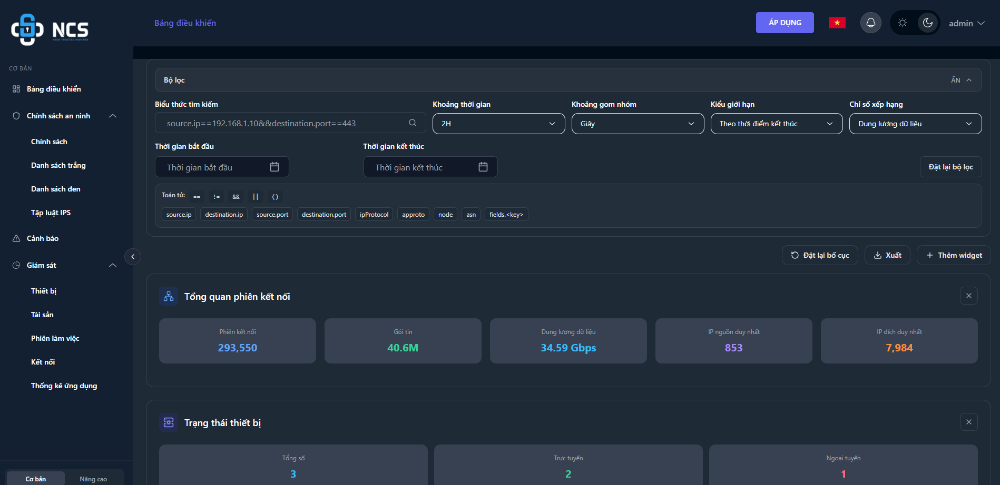
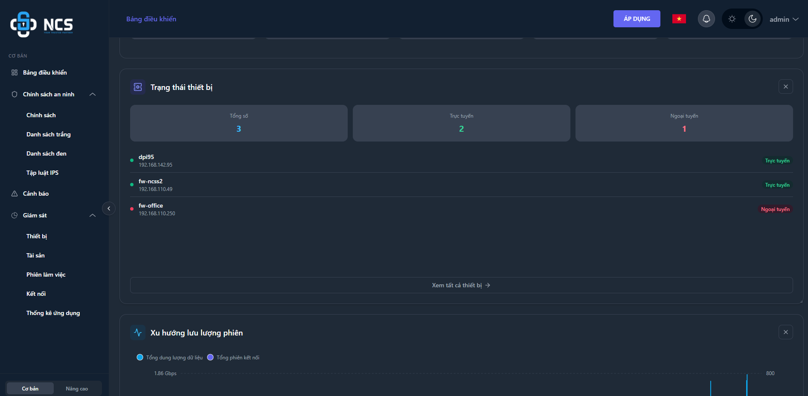
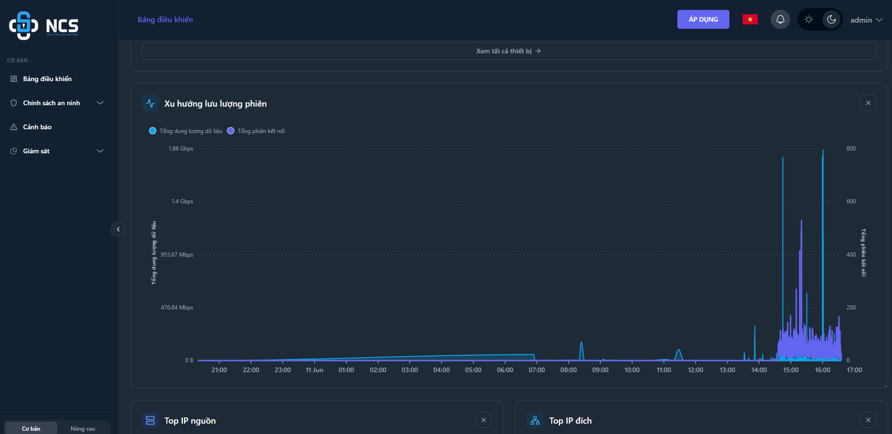
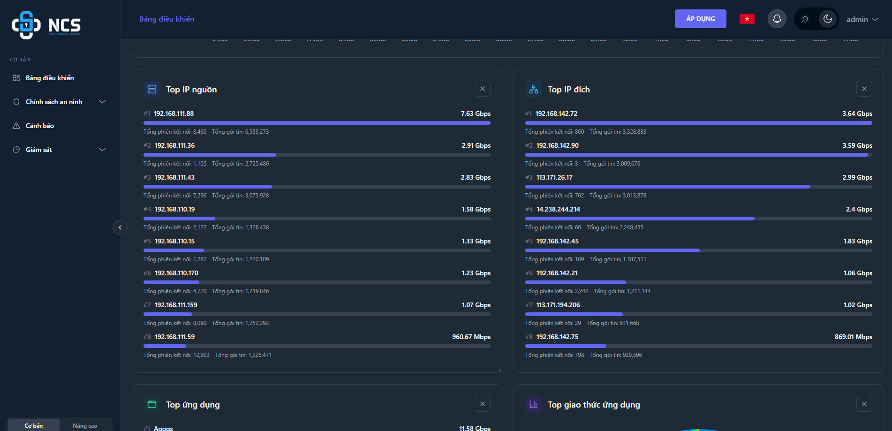
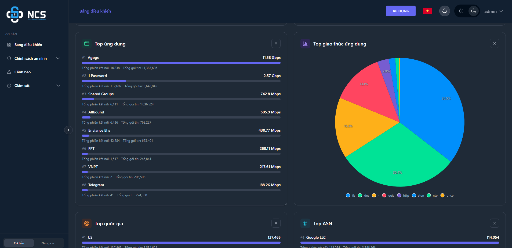
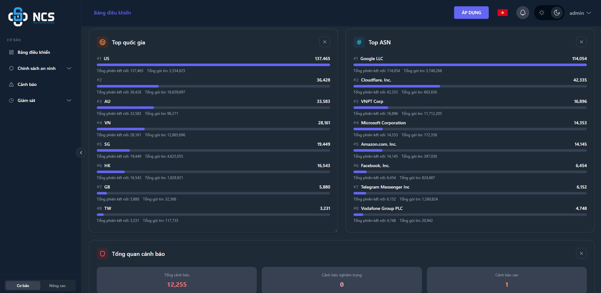
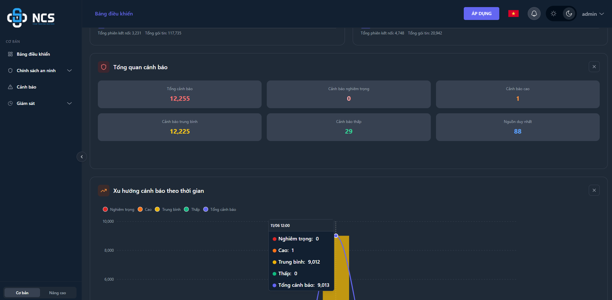
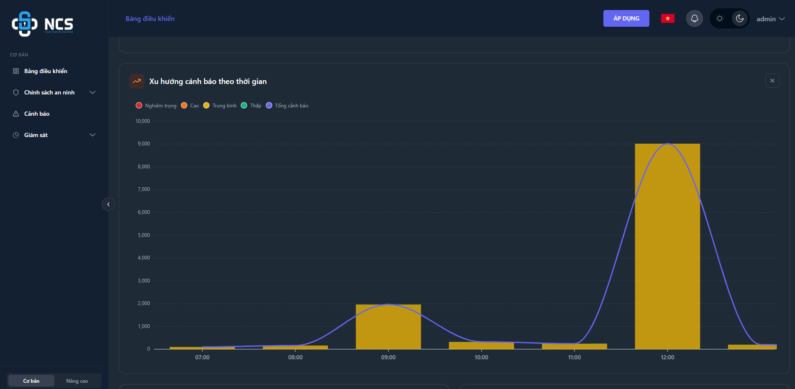
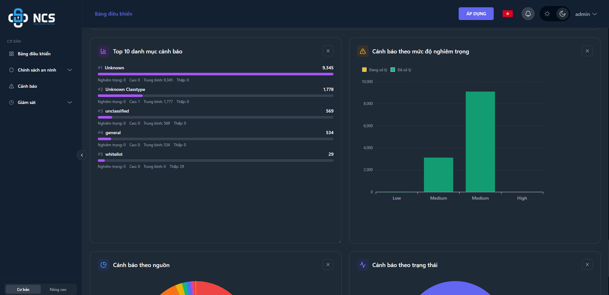
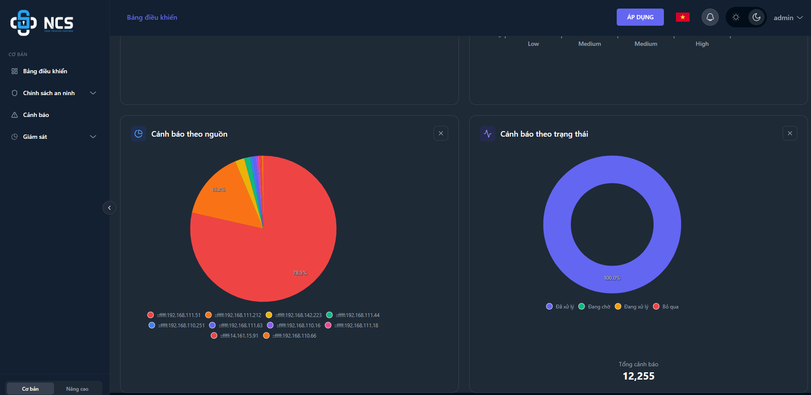

# Chương 1: Tổng quan và Bắt đầu nhanh

Chương này cung cấp cái nhìn tổng quan về hệ thống Firewall/NGFW, hướng dẫn cách đăng nhập vào hệ thống và cách sử dụng **Bảng điều khiển (Dashboard)** để giám sát toàn diện hiệu năng, lưu lượng và các sự kiện an ninh mạng theo thời gian thực.

---

## 1.1. Giới thiệu hệ thống Firewall/NGFW
*(Nội dung đang được cập nhật. Phần này giới thiệu kiến trúc tổng quan, các tính năng bảo mật cốt lõi và mô hình triển khai của hệ thống Firewall/NGFW).*

---

## 1.2. Đăng nhập hệ thống

Hướng dẫn người dùng đăng nhập vào giao diện quản trị web của hệ thống Firewall để cấu hình và giám sát thiết bị.

**Các bước thực hiện:**
1. Mở trình duyệt web (Khuyến nghị sử dụng Google Chrome, Mozilla Firefox hoặc Microsoft Edge phiên bản mới nhất).
2. Truy cập vào địa chỉ IP quản trị của thiết bị Firewall (Ví dụ: `https://192.168.1.1`). Giao diện đăng nhập của **NCS Next Generation Firewall** sẽ hiển thị.
3. Tại form đăng nhập bên phải màn hình, điền các thông tin sau:
    - **Tên đăng nhập:** Nhập tên tài khoản quản trị được cấp.
    - **Mật khẩu:** Nhập mật khẩu đăng nhập tương ứng. Quản trị viên có thể nhấp vào biểu tượng con mắt ở góc phải ô mật khẩu để hiển thị hoặc ẩn các ký tự mật khẩu đã nhập.
    - *Lưu ý về Xác thực hai yếu tố (2FA):* Nếu tài khoản đã kích hoạt tính năng xác thực hai yếu tố, quản trị viên cần **nhập thêm mã OTP 6 chữ số vào ngay cuối mật khẩu** trong ô **Mật khẩu** (Ví dụ: mật khẩu là `Admin@123` và mã OTP là `456789` thì chuỗi cần nhập vào ô mật khẩu là `Admin@123456789`).
4. Nhấn vào nút **ĐĂNG NHẬP** (hoặc nhấn phím **Enter**) để truy cập vào hệ thống.

---

## 1.3. Bảng điều khiển (Dashboard) - Xem tổng quan trạng thái, sự kiện và hiệu năng

Bảng điều khiển (Dashboard) là giao diện chính hiển thị ngay sau khi đăng nhập thành công. Chức năng này cung cấp một trung tâm giám sát trực quan, tập trung toàn bộ các số liệu thống kê thời gian thực về hiệu năng thiết bị, trạng thái kết nối mạng, xu hướng lưu lượng và các cảnh báo bảo mật.

Hệ thống cung cấp 10 widget giám sát chính trên giao diện Dashboard với ý nghĩa cụ thể như sau:

### 1. Tổng quan phiên kết nối
Thống kê nhanh các chỉ số tổng hợp về lưu lượng mạng đi qua Firewall trong khoảng thời gian được chọn:
- **Phiên kết nối:** Tổng số lượng phiên kết nối (Sessions) mạng được xử lý.
- **Gói tin:** Tổng số gói tin (Packets) truyền tải.
- **Dung lượng dữ liệu:** Tổng dung lượng băng thông dữ liệu đã xử lý.
- **IP nguồn duy nhất / IP đích duy nhất:** Số lượng địa chỉ IP nguồn và IP đích khác biệt được ghi nhận.

### 2. Trạng thái thiết bị
Giúp quản trị viên giám sát số lượng và trạng thái kết nối thời gian thực của các thiết bị Firewall/NGFW đang được quản lý tập trung:
- Hiển thị tổng số thiết bị, số lượng thiết bị đang **Trực tuyến** (Online) và **Ngoại tuyến** (Offline).
- Liệt kê danh sách chi tiết các thiết bị kèm địa chỉ IP quản trị và nút chuyển hướng nhanh **Xem tất cả thiết bị ->**.

### 3. Xu hướng lưu lượng phiên
Biểu thị diễn biến lưu lượng mạng và số lượng phiên kết nối theo trục thời gian thực, giúp quản trị viên dễ dàng nhận diện các thời điểm lưu lượng tăng đột biến hoặc các dấu hiệu bất thường của hệ thống.

### 4. Top IP nguồn và Top IP đích
Thống kê nhanh những địa chỉ IP tạo ra hoặc nhận về lượng dữ liệu lớn nhất trong mạng, hỗ trợ tìm kiếm nguyên nhân gây nghẽn băng thông:
- **Top IP nguồn:** Liệt kê 8 địa chỉ IP nguồn phát sinh dung lượng dữ liệu nhiều nhất.
- **Top IP đích:** Liệt kê 8 địa chỉ IP đích nhận dung lượng dữ liệu nhiều nhất.
- Hiển thị chi tiết số dung lượng dữ liệu, số phiên kết nối và số gói tin của từng địa chỉ IP.

### 5. Top ứng dụng và Top giao thức ứng dụng
Phân tích lưu lượng dữ liệu đi qua hệ thống Firewall theo khía cạnh ứng dụng và giao thức để kiểm soát hành vi người dùng và tối ưu tài nguyên mạng:
- **Top ứng dụng:** Danh sách 8 ứng dụng (Ví dụ: Agogs, 1Password, Telegram...) tiêu thụ nhiều băng thông nhất kèm số phiên và số gói tin chi tiết.
- **Top giao thức ứng dụng:** Biểu đồ tròn thể hiện tỷ lệ % phân bổ của các giao thức mạng phổ biến (TLS, DNS, HTTP, QUIC, STUN...).

### 6. Top quốc gia và Top ASN
Cung cấp thông tin phân tích địa lý và hạ tầng mạng của các kết nối để xác định nguồn gốc lưu lượng quốc tế hoặc nhà mạng liên quan:
- **Top quốc gia:** Thống kê các quốc gia phát sinh lưu lượng mạng nhiều nhất dựa trên định vị GeoIP.
- **Top ASN:** Thống kê các Số hiệu mạng tự trị (Autonomous System Numbers - ASN) của các nhà mạng hoặc tổ chức phát sinh kết nối nhiều nhất đến hệ thống.

### 7. Tổng quan cảnh báo
Hiển thị tổng số lượng cảnh báo bảo mật (Alerts) được Firewall ghi nhận và phân chia theo các mức độ nghiêm trọng khác nhau (Nghiêm trọng, Cao, Trung bình, Thấp) cùng số lượng địa chỉ IP nguồn duy nhất phát sinh cảnh báo.

### 8. Xu hướng cảnh báo theo thời gian
Biểu đồ cột kết hợp đường thể hiện số lượng và xu hướng phân bổ cảnh báo an ninh theo thời gian thực. Các cột phân biệt mức độ nghiêm trọng bằng các màu sắc tương ứng (Đỏ: Nghiêm trọng, Cam: Cao, Vàng: Trung bình, Xanh lá: Thấp).

### 9. Top 10 danh mục cảnh báo và Cảnh báo theo mức độ nghiêm trọng
Thống kê phân loại cảnh báo theo các luật bảo mật và trạng thái xử lý đối với từng mức độ nghiêm trọng:
- **Top 10 danh mục cảnh báo:** Liệt kê các nhóm luật bảo mật bị vi phạm nhiều nhất (Ví dụ: Unknown Classtype, unclassified, general...).
- **Cảnh báo theo mức độ nghiêm trọng:** Thống kê số lượng cảnh báo ở trạng thái **Đang xử lý** và **Đã xử lý** tương ứng với từng mức độ nghiêm trọng (Low, Medium, High).

### 10. Cảnh báo theo nguồn và Cảnh báo theo trạng thái
Giúp quản trị viên có cái nhìn toàn cảnh về các địa chỉ IP phát sinh tấn công nhiều nhất và tỷ lệ xử lý sự cố an ninh trên hệ thống Firewall:
- **Cảnh báo theo nguồn:** Biểu đồ tròn hiển thị tỷ lệ % phát sinh cảnh báo của các địa chỉ IP nguồn hàng đầu.
- **Cảnh báo theo trạng thái:** Biểu đồ donut thể hiện tỷ lệ % các trạng thái xử lý cảnh báo trong hệ thống (Đã xử lý, Đang chờ, Đang xử lý, Bỏ qua).

