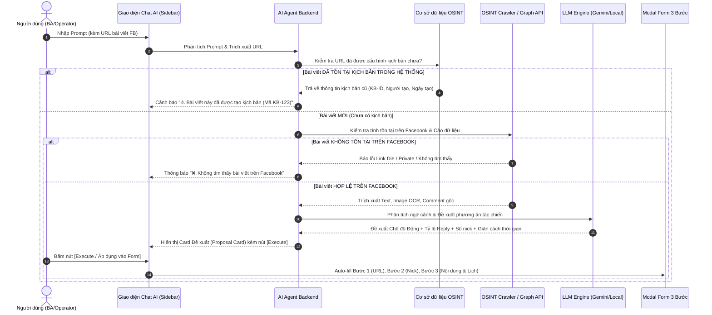
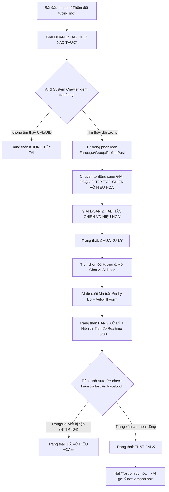

# Đặc Tả Chi Tiết & Kế Hoạch Tích Hợp AI Trong Hệ Thống OSINT

Tài liệu này mở rộng đặc tả luồng ứng dụng AI theo đúng trải nghiệm người dùng (UI/UX) dựa trên **giao diện thực tế của Form "Thêm kịch bản đấu tranh phản bác"** và **Form "Cấu hình vô hiệu hóa"**, kết hợp với widget **Chat với Trợ lý AI (AI Assistant Sidebar)**.

---

## 1. Luồng Tương Tác UI: Chat Với AI Tại Màn Hình Cấu Hình Đấu Tranh Phản Bác

### 1.1 Tổng Quan Giao Diện & Kích Hoạt Widget
1. **Vị trí tích hợp**: Nút bấm **"Chat với Trợ lý AI"** (Icon Sparkles ✨) được đặt nổi bật ở góc trên bên phải của Modal **Thêm kịch bản đấu tranh phản bác**.
2. **Hành vi**: Khi click vào nút, cửa sổ trượt Right Sidebar (`AI Assistant Chat`) mở ra song song với Modal 3 bước hiện tại.

```
+-------------------------------------------------------+--------------------------+
|  THÊM KỊCH BẢN ĐẤU TRANH PHẢN BÁC                     |  TRỢ LÝ AI (SIDEBAR)     |
|  Step 1: Chọn bài viết -> Step 2: Chọn nick -> Step 3 | ------------------------ |
|  ---------------------------------------------------  | AI: Chào bạn! Nhập link  |
|  (•) Sinh phản bác Động  ( ) Nhập thủ công mẫu tĩnh   | bài viết để tôi phân     |
|  - Định hướng AI: [                                ]  | tích và tạo kịch bản...  |
|  - Tỷ lệ Reply: [ 70% Reply / 30% Đăng bài gốc    ]  |                          |
|  - Thời gian đăng: [ Ngẫu nhiên từ 25 đến 40 phút  ]  | User: Hãy giúp tôi tạo   |
|                                                       | kịch bản phản bác cho    |
|  [ Lưu kịch bản ]  [ Hủy ]                            | bài viết fb.com/12345... |
|                                                       | [Nhập tin nhắn...][Send] |
+-------------------------------------------------------+--------------------------+
```

---

### 1.2 Luồng Xử Lý Chi Tiết Của AI (Agentic Workflow)



---

### 1.3 Quy Trình Kiểm Tra & Đề Xuất Của AI (4 Bước Hoàn Chỉnh)

#### Bước 1: Kiểm Tra Trùng Lặp & Tính Tồn Tại Bài Viết
* **Input**: Prompt chứa URL bài viết (Ví dụ: `https://facebook.com/groups/296053177/posts/12345`).
* **Kiểm tra 1 (Hệ thống nội bộ)**: Đối chiếu với CSDL xem bài viết này đã gắn với Kịch bản Đấu tranh nào chưa.
  * *Nếu đã có*: **Cảnh báo trùng**: *"⚠️ Bài viết này đã được cấu hình kịch bản đấu tranh trước đó (Mã kịch bản: `KB-FB-2026-089`, Tạo bởi: Nguyễn Văn A). Bạn muốn xem lại kịch bản cũ hay tiếp tục đè kịch bản mới?"*
* **Kiểm tra 2 (Trên Facebook)**: Gọi Crawler xác minh link còn sống hay bị gỡ/private.

#### Bước 2: Phân Tích Ngữ Cảnh & Đề Xuất Phương Án Tác Chiến
Khi bài viết hợp lệ & mới, AI phân tích nội dung và đưa ra **Đề xuất chiến lược đầy đủ**:
1. **Chế độ phản bác đề xuất**: **Sinh phản bác Động thời gian thực (Dynamic AI)**.
2. **Tỷ lệ phân bổ hành động**: **`70% Reply comment đối phương` | `30% Đăng comment mới bài gốc`**.
3. **Số lượng tài khoản ảo**: **35 Tài khoản**.
4. **Mặc định thời gian đăng (Giãn cách tác chiến)**: **Ngẫu nhiên từ 25 đến 40 phút** (giữa các lần nick ảo nhảy vào bài viết tác chiến).
5. **Định hướng chiến lược (Prompt chỉ đạo)**: *"Bác bỏ thông tin sai lệch về giá đền bù; khi gặp comment kích động khiếu kiện thì reply trực tiếp trích dẫn Quyết định 123/QĐ-UBND..."*

#### Bước 3: Phản Hồi Card Đề Xuất Trực Quan Cho Người Dùng

> 🎯 **KẾT QUẢ PHÂN TÍCH & ĐỀ XUẤT KỊCH BẢN ĐẤU TRANH**
> 
> * **Bài viết mục tiêu**: `[Tóm tắt bài viết đền bù đất đai]`
> * **Trạng thái**: ✅ Tồn tại trên Facebook | ✅ Chưa có kịch bản trong hệ thống
> * **Chế độ phản bác**: **Sinh phản bác Động thời gian thực (Dynamic AI)**
> * **Tỷ lệ tác chiến**: **70% Reply comment tiêu cực** \| **30% Đăng bài gốc**
> * **Thời gian đăng**: **Ngẫu nhiên từ 25 đến 40 phút / lượt**
> * **Tài khoản ảo**: **35 Nick**
> * **Định hướng chỉ đạo**: *Bác bỏ tin đồn đền bù, reply trực tiếp các comment xấu bằng dẫn chứng pháp lý.*
> 
> -------------------------------------------------------------
> **[  👉 ÁP DỤNG VÀO FORM (AUTO-FILL)  ]**   **[ 🔄 Điều chỉnh thông số ]**

---

## 2. Thiết Kế Giao Diện Tinh Chỉnh (Modal Step 3: Cấu Hình Nội Dung)

Dựa trên góp ý của bạn, giao diện **Bước 3: Cấu hình nội dung** được thu gọn chỉ còn **2 lựa chọn duy nhất**:

### 2.1 Thu Gọn Còn 2 Tùy Chọn Soạn Nội Dung

```
[?] Tùy chọn soạn nội dung:
  (•) Sinh phản bác Động thời gian thực (Dynamic AI Auto-Reply)  [Khuyên dùng]
  ( ) Nhập thủ công mẫu tĩnh (Manual Static Templates)
```

---

### 2.2 Chi Tiết Giao Diện Khi Chọn Cực Kỳ Tối Ưu

#### CHẾ ĐỘ 1: `(•) Sinh phản bác Động thời gian thực`
* **Ẩn** bảng danh sách các câu bình luận mẫu tĩnh.
* **Hiển thị Khối Cấu Hình Động**:
  1. **Định hướng & Luận điểm phản bác (Textarea)**: AI Auto-fill prompt chỉ đạo hoặc người dùng gõ tay.
  2. **Tỷ lệ phân bổ hành động (Select/Slider)**: `[ 70% Reply comment đối phương  |  30% Đăng comment mới bài gốc ]`.
  3. **Mặc định thời gian đăng (GIỮ NGUYÊN KHỐI HIỆN TẠI CỦA BẠN)**:
     * Kiểu thời gian: `( ) Sau x phút` | `(•) Ngẫu nhiên trong khoảng thời gian`
     * Khoảng thời gian: *Từ `25` đến `40` phút* (Quy định khoảng giãn cách chạy giữa các tài khoản ảo).

#### CHẾ ĐỘ 2: `( ) Nhập thủ công mẫu tĩnh`
* **Giữ nguyên 100% như giao diện hiện tại của bạn**:
  * Khối "Mặc định thời gian đăng".
  * Bảng "Danh sách nội dung phản bác tĩnh" (STT, Nội dung bình luận, Thời gian bình luận).

---

## 3. Ứng Dụng AI Vào Màn Hình "Cấu Hình Vô Hiệu Hóa" (Target Neutralization / Mass Report)

Dựa trên ảnh chụp giao diện Modal **"Cấu hình vô hiệu hóa"** thực tế của bạn, dưới đây là các điểm ứng dụng AI mang lại hiệu quả vượt trội:

```
+-------------------------------------------------------------------------+
| Cấu hình vô hiệu hóa                                                 (X)|
| ----------------------------------------------------------------------- |
| Lý do report chính:           [ ✨ Tài khoản giả mạo (Chính - 60%)  v ]|
| Lý do bổ trợ 1 & 2:           [ ✨ Ngôn từ thù ghét (25%), Spam (15%) v ]|
| Số lượng report trên mỗi đối tượng: [ 30 report / đối tượng ]            |
| Phân bổ tài khoản ảo:         [ Xoay vòng tài khoản trust cao      v ]|
| Phân bổ thời gian:            [ Theo khoảng thời gian ngẫu nhiên AI  v ]|
| Giãn cách từ:                 [ 45s ] đến [ 180s ] (Né thuật toán FB)   |
| ----------------------------------------------------------------------- |
| Số lượng đối tượng đã chọn: 3         [ Nút ✨ AI Gợi Ý ] [ Hủy ] [ Lưu ]|
+-------------------------------------------------------------------------+
```

### 3.1 Các Điểm Tích Hợp AI Tối Ưu Cho Form

#### 1. AI Phân Tích Nội Dung & Lập Ma Trận Tỷ Lệ Đa Lý Do Report (Multi-Reason Matrix Engine)
* **Bài toán**: Nếu 30 tài khoản ảo đồng loạt report 1 trang với 100% cùng 1 lý do "Tài khoản giả mạo", hệ thống Facebook Security sẽ phát hiện đây là đợt tấn công Spam Bot được dàn xếp và khóa lượt report.
* **AI làm gì**:
  * AI cào quét nội dung đối tượng và đối chiếu với Tiêu chuẩn Cộng đồng Facebook.
  * Tự động lập **Ma trận Phân bổ Tỷ lệ Đa Lý Do**:
    * **Lý do CHÍNH (60% nick ảo ~ 18 nick)**: `Tài khoản giả mạo` *(Độ khớp: 96%)*
    * **Lý do BỔ TRỢ 1 (25% nick ảo ~ 8 nick)**: `Ngôn từ gây thù ghét` *(Độ khớp: 85%)*
    * **Lý do BỔ TRỢ 2 (15% nick ảo ~ 4 nick)**: `Thông tin sai lệch` *(Độ khớp: 75%)*
  * Giúp đợt report trông hoàn toàn tự nhiên dưới góc nhìn kiểm duyệt của Facebook (như một nhóm người dùng thật có các góc nhìn báo cáo đa chiều khác nhau).

#### 2. AI Đề Xuất "Số lượng Report Trên Mỗi Đối Tượng" Chuẩn Ngưỡng Kiểm Duyệt
* **AI làm gì**: Phân tích số lượng Follower/Bình luận của đối tượng để tính ra con số tối ưu (Ví dụ: Trang 20k Follower -> Đề xuất 30 report chia theo Ma trận Đa Lý Do).

#### 3. AI Tự Động Phân Bổ Thời Gian Giãn Cách Tránh Thuật Toán Quét (Anti-Spam Staggering)
* **AI làm gì**: Tự động đề xuất giãn cách thời gian ngẫu nhiên theo **Phân phối Gaussian (Nhịp sinh học con người)** từ **45s đến 180s** (hoặc rải đều trong 3-6 giờ).

---

### 3.2 Chuẩn Hóa Luồng Nghiệp Vụ 2 Giai Đoạn (Sơ Đồ Tái Cấu Trúc)



---

## 4. Ma Trận Tương Tác AI Assistant Cho Cả 4 Màn Hình Chức Năng (Full System)

| Màn hình | Trigger của User | Hành vi Agentic của AI | Nút Hành động (Proposal Card) |
| :--- | :--- | :--- | :--- |
| **Cấu hình Đấu tranh Phản bác** | *"Tạo kịch bản phản bác bài viết [URL]"* | 1. Check URL tồn tại FB & CSDL.<br>2. Phân tích ngữ cảnh & trích luận điểm.<br>3. Đề xuất Chế độ Động + Tỷ lệ Reply 70/30. | **`[Áp dụng vào Form]`**<br>(Auto-fill định hướng phản bác & rải lịch) |
| **Vô hiệu hóa Đối tượng (Report)** | *"Tạo cấu hình report cho 3 đối tượng chọn"* | 1. Quét nội dung 3 đối tượng.<br>2. Đối chiếu Tiêu chuẩn Cộng đồng FB.<br>3. Đề xuất **Ma trận Tỷ lệ Đa lý do** + Phân bổ thời gian an toàn (45-180s). | **`[Áp dụng vào Form]`**<br>(Auto-fill lý do report & thời gian giãn cách) |
| **Nuôi & Tạo Kịch bản Nick** | *"Tạo kịch bản nuôi nick 7 ngày mảng giải trí"* | 1. Phân tích Persona.<br>2. Sinh chuỗi JSON hành động (Like, Share, Story).<br>3. Rải lịch theo nhịp sinh học con người. | **`[Lưu Kịch Bản AI]`**<br>(Tự tạo kịch bản mới & lưu hệ thống) |
| **Quản lý & Gán Lịch Tài khoản** | *"Gán kịch bản Seeding cho 30 nick, chạy T2, T5 lúc 8h"* | 1. Phân tích số nick khả dụng.<br>2. Kiểm tra xung đột lịch chạy.<br>3. Tạo lệnh Scheduler gán nick. | **`[Xác nhận Gán Lịch]`**<br>(Gán lịch chạy tự động cho 30 nick) |
