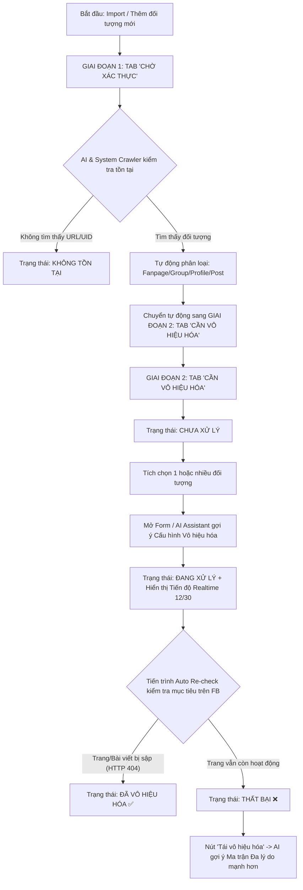

# BÁO CÁO PHÂN TÍCH & ĐỀ XUẤT CHUẨN HÓA LUỒNG QUẢN LÝ ĐỐI TƯỢNG CẦN VÔ HIỆU HÓA

Báo cáo này phân tích toàn bộ luồng nghiệp vụ hiện tại của tính năng **Quản lý đối tượng cần vô hiệu hóa** dựa trên 5 màn hình giao diện thực tế, chỉ ra các điểm bất hợp lý về mặt UX/UI/Nghệp vụ và đưa ra phương án tái cấu trúc toàn diện (tích hợp AI Agent).

---

## 1. TỔNG QUAN LUỒNG HIỆN TẠI & CÁC ĐIỂM BẤT HỢP LÝ (PAIN POINTS)

### 1.1 Sơ Đồ Luồng Hiện Tại
```
[Thêm / Import Đối tượng]
           │
           ▼
 [Trạng thái: Chờ xác nhận] ──(Hệ thống check tồn tại)──► [Không tồn tại]
           │
           ▼ (Nếu tồn tại)
   [Chưa xử lý] ──(Tích chọn & Cấu hình)──► [Đang xử lý]
                                                │
                                  ┌─────────────┴─────────────┐
                                  ▼                           ▼
                         [Đã vô hiệu hóa]                [Thất bại]
```

---

### 1.2 Phân Tích 5 Điểm Bất Hợp Lý Lớn Trên Giao Diện Hiện Tại

#### 🔴 1. Tên gọi 2 Tab "Đã xác nhận" và "Xử lý" bị mâu thuẫn & gây hiểu nhầm
* **Trên ảnh 1**: Tab đang chọn là **"Xử lý"** (màu xanh), nhưng tiêu đề bảng bên dưới lại là *"Danh sách đối tượng **chờ xác nhận**"*.
* **Trên ảnh 2**: Tab đang chọn là **"Đã xác nhận"** (màu xanh), nhưng tiêu đề bảng lại là *"Danh sách đối tượng **cần vô hiệu hoá**"* và chứa các trạng thái `Chưa xử lý`, `Đang xử lý`, `Đã vô hiệu hoá`, `Thất bại`.
* 👉 **Hậu quả**: Tên Tab bị ngược hoàn toàn so với nội dung bên trong. Người dùng không phân biệt được đâu là màn hình kiểm tra dữ liệu đầu vào, đâu là màn hình tác chiến vô hiệu hóa.

#### 🔴 2. Thiếu hiển thị "Thông tin Cấu hình đang chạy & Tiến độ" trên bảng dữ liệu
* **Hiện tại**: Khi chọn các dòng và lưu cấu hình report (8 report, rải trong 3 giờ), bảng ở Screen 2 **chỉ đổi nhãn sang `Đang xử lý` hoặc `Thất bại`**.
* người dùng **KHÔNG THỂ BIẾT**:
  * Đối tượng này đang được report với lý do gì?
  * Đã chạy được bao nhiêu report/tổng số? (Ví dụ: `18/30 report`).
  * Còn bao lâu thì xong đợt tác chiến?
* 👉 người dùng buộc phải click từng dòng mở Modal *"Lịch sử thực hiện vô hiệu hóa"* (Ảnh 5) để tự đếm số dòng thủ công.

#### 🔴 3. Thiếu cơ chế Xác thực lại (Re-check Engine) & Nút "Tái vô hiệu hóa" khi Thất bại
* Khi một chiến dịch báo cáo kết thúc nhưng đối tượng vẫn ở trạng thái **`Thất bại`** (trang vẫn hoạt động trên Facebook), hệ thống chưa có:
  * Tiến trình tự động cào quét lại để xác nhận xem trang thực sự còn sống hay đã bị Facebook bóp tương tác/ẩn bài.
  * Nút **`[Tái vô hiệu hóa / Retry]`** cho phép kích hoạt đợt tác chiến đợt 2 với cấu hình mạnh hơn (tăng số nick trust cao, bổ sung lý do report khác).

#### 🔴 4. Thiếu Bộ lọc Trạng thái nhanh (Filter Pills/Tabs)
* Tại Tab "Danh sách đối tượng cần vô hiệu hóa" có đến 223 bản ghi nhưng bảng không có bộ lọc để người dùng lọc nhanh:
  * `Tất cả (223)` | `Chưa xử lý (12)` | `Đang xử lý (45)` | `Đã vô hiệu hóa (150)` | `Thất bại (16)`
* Làm người dùng rất khó quản lý khi danh sách lên đến hàng ngàn đối tượng.

#### 5. Form "Thêm đối tượng" (Ảnh 3) quá đơn giản
* Form chỉ có 3 trường: `Nền tảng`, `UID đối tượng`, `Nội dung`.
* Thiếu trường phân loại **Loại đối tượng** (`Trang cá nhân`, `Fanpage`, `Nhóm`, `Bài viết`, `Reels/Video`), trong khi trên bảng dữ liệu Ảnh 2 lại hiển thị cột "Loại đối tượng".

---

## 2. QUY TRÌNH CHUẨN HÓA ĐỀ XUẤT (PROPOSED WORKFLOW)

Để giải quyết triệt để các vấn đề trên, luồng nghiệp vụ được tái cấu trúc thành **2 Giai đoạn gãy gọn**:



---

## 3. TÁI CẤU TRÚC GIAO DIỆN & TÍNH NĂNG CHI TIẾT

### 3.1 Cải Tiến 1: Chuẩn Hóa Tên Gọi 2 Tab Chính

Thay vì tên gọi mâu nạp "Đã xác nhận" và "Xử lý", đổi thành:

* **Tab 1: `Chờ xác thực`** (Thay cho tab Xử lý cũ)
  * *Nhiệm vụ*: Chứa danh sách các UID mới import/thêm thủ công. Hệ thống tự động quét kiểm tra xem UID có tồn tại trên Facebook hay không.
  * *Trạng thái gồm*: `Đang kiểm tra` | `Không tồn tại` | `Đã xác thực`. (Khi đã xác thực thành công sẽ tự đẩy sang Tab 2).
* **Tab 2: `Tác chiến vô hiệu hóa`** (Thay cho tab Đã xác nhận cũ)
  * *Nhiệm vụ*: Chứa danh sách các đối tượng ĐÃ TỒN TẠI, sẵn sàng để gán cấu hình report.
  * *Trạng thái gồm*: `Chưa xử lý` | `Đang xử lý` | `Đã vô hiệu hóa` | `Thất bại`.

---

### 3.2 Cải Tiến 2: Bổ Sung Cột "Tiến Độ & Cấu Hình Đang Chạy" Trên Bảng Dữ Liệu

Tại Bảng dữ liệu Tab **Tác chiến vô hiệu hóa**, bổ sung 2 cột thông tin quan trọng:

1. **Cột `Tiến độ thực hiện`**:
   * Khi trạng thái `Đang xử lý`: Hiển thị Thanh Progress bar trực quan: `18/30 Report (60%)` + Thời gian còn lại `1h 15m`.
   * Khi trạng thái `Đã vô hiệu hóa`: Hiển thị `Hoàn thành 30/30 (Sập trang lúc 14:20)`.
   * Khi trạng thái `Thất bại`: Hiển thị `Dừng ở 30/30 (Trang vẫn còn sống)`.
2. **Cột `Cấu hình tác chiến` (Hoặc Popover khi di chuột vào)**:
   * Hiển thị tóm tắt: `Tài khoản giả mạo (60%) + Ngôn từ thù ghét (40%) | Giãn cách 45-180s`.
   * Cho phép người dùng click xem nhanh toàn bộ cấu hình mà không cần mở lịch sử.

---

### 3.3 Cải Tiến 3: Bổ Sung Bộ Lọc Trạng Thái Nhanh (Filter Pills)

Phía trên Bảng dữ liệu Tab Tác chiến vô hiệu hóa, thêm các Tab lọc nhanh:

```
[ Tất cả (223) ]  [ Chưa xử lý (12) ]  [ Đang xử lý (45) ]  [ Đã vô hiệu hóa (150) ]  [ Thất bại (16) ]
```
Giúp cán bộ vận hành lọc ngay ra 16 đối tượng `Thất bại` để xử lý đợt 2, hoặc xem 45 đối tượng `Đang xử lý` chỉ bằng 1 cú click.

---

### 3.4 Cải Tiến 4: Thêm Nút "Tái Vô Hiệu Hóa" (Retry Neutralization)

Tại cột Chức năng của các dòng có trạng thái **`Thất bại`**:
* Bổ sung nút **`[ 🔄 Tái vô hiệu hóa ]`**.
* Khi bấm nút này, Modal Cấu hình mở ra với sự trợ giúp của AI Copilot:
  * AI tự động phân tích: *"Đợt report 1 thất bại do chỉ dùng 8 report với 1 lý do duy nhất. Đề xuất Đợt 2: Tăng lên 35 nick trust cao và áp dụng Ma trận Đa lý do (60% Giả mạo / 40% Ngôn từ thù ghét)"*.

---

### 3.5 Cải Tiến 5: Chuẩn Hóa Form "Thêm Đối Tượng" (Modal Step 1)

Nâng cấp Form Modal **Thêm đối tượng cần vô hiệu hóa**:
* **Nền tảng**: Select (`Facebook`, `TikTok`, `YouTube`, `Telegram`).
* **Loại đối tượng**: Select (`Trang cá nhân`, `Fanpage`, `Nhóm`, `Bài viết`, `Reels/Video`).
* **URL / UID đối tượng \***: Textbox (Cho phép dán cả Link URL đầy đủ, hệ thống tự tách lấy UID).
* **Mô tả / Nội dung vi phạm**: Textarea.
* **Tự động quét AI ngay khi nhập**: Khi dán URL vào, AI tự động cào trước ảnh Avatar/Cover + Tên đối tượng để preview xác nhận ngay trên Form!

---

## 4. MA TRẬN TỔNG HỢP CẢI TIẾN (BEFORE VS AFTER)

| Hạng mục | Luồng Giao Diện Hiện Tại | Luồng Đề Xuất Cải Tiến (Có AI) |
| :--- | :--- | :--- |
| **Tên Tab chính** | "Xử lý" vs "Đã xác nhận" (Bị ngược & rối). | **"Chờ xác thực"** vs **"Tác chiến vô hiệu hóa"** (Rõ ràng 2 giai đoạn). |
| **Kiểm tra bài viết** | Phải bấm chuyển tab mới biết kết quả. | AI & Crawler tự check background, tự phân loại Page/Post/Group/Profile. |
| **Thông tin bảng** | Chỉ hiển thị nhãn trạng thái tĩnh (Đang xử lý). | Hiển thị **Tiến độ Realtime (18/30 report)** + **Cấu hình Ma trận Đa lý do**. |
| **Quản lý thất bại** | Chỉ có nhãn "Thất bại", không xử lý được tiếp. | Thêm nút **[Tái vô hiệu hóa / Retry]** + AI đề xuất chiến thuật đợt 2 mạnh hơn. |
| **Bộ lọc** | Không có bộ lọc trạng thái. | Thanh **Filter Pills** lọc nhanh (Chưa xử lý, Đang xử lý, Đã sập, Thất bại). |
| **Trợ lý AI** | Chưa có. | Chat AI Sidebar gợi ý Ma trận Đa lý do + Auto-fill 100% Form cấu hình. |
