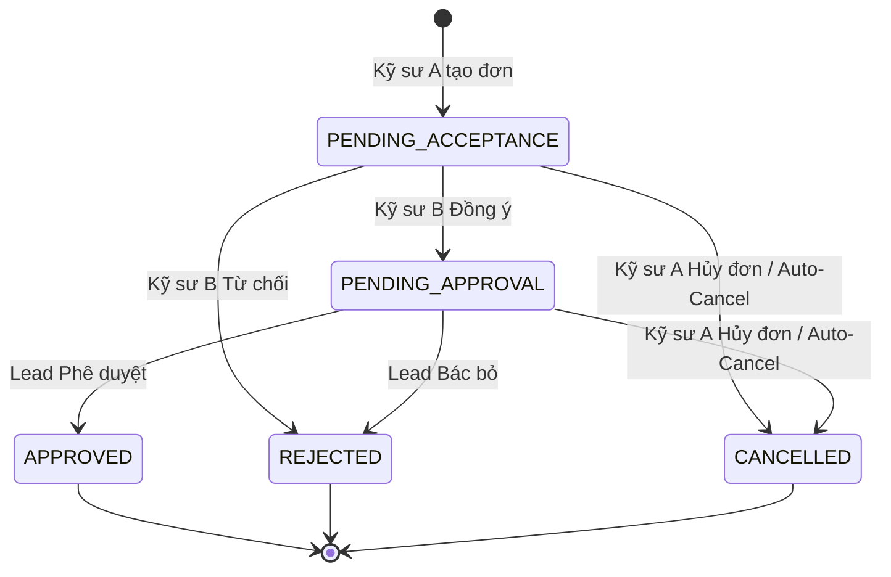

# ĐẶC TẢ YÊU CẦU PHẦN MỀM (SRS)
## TÍNH NĂNG: QUẢN LÝ ĐƠN CHUYỂN GIAO CA TRỰC (SHIFT TRANSFER REQUEST MANAGEMENT)

---

# 1. THÔNG TIN CHUNG CHỨC NĂNG

| Thuộc tính | Nội dung |
| :--- | :--- |
| **Mã chức năng** | `SOAR_SHIFT_TRANSFER_04` |
| **Tên chức năng** | Quản lý Đơn chuyển giao ca trực (Shift Transfer Request Management) |
| **Mô tả tổng quan** | Tính năng này cung cấp quy trình tạo, xác nhận, phê duyệt và điều phối đổi ca trực tinh giản theo cơ chế **Chuyển ca 1 chiều (One-way Shift Transfer)**. Khi Kỹ sư A có việc bận đột xuất, họ chỉ cần chọn một ca trực cụ thể của mình và chỉ định Kỹ sư B tiếp nhận trực hộ. Sau khi Kỹ sư B xác nhận đồng ý, đơn sẽ được chuyển lên Trưởng kíp / Quản lý SOC phê duyệt. Khi được duyệt, trách nhiệm trực ca và tiếp nhận Case sẽ được **khóa trực tiếp vào User ID của Kỹ sư B** trên Lịch trực hiệu lực (Effective Schedule). Thiết kế 1 chiều này loại bỏ hoàn toàn sự rườm rà của việc tìm ca đổi chéo 2 chiều (nếu B muốn A trực bù một ngày khác, B chỉ việc tạo một đơn 1 chiều độc lập). Đồng thời, tính năng tích hợp cơ chế tự động hủy đơn an toàn khi có biến động nhân sự và hệ thống thông báo đa kênh tức thời. |
| **Phạm vi tính năng** | - **Bao gồm:**<br>&nbsp;&nbsp;+ Xem danh sách đơn chuyển ca theo các Tab điều hướng: Cần xử lý (Action Required kèm badge đỏ đếm số), Đơn do tôi tạo (My Requests), Tất cả đơn (All Transfers - dành cho Lead/Manager).<br>&nbsp;&nbsp;+ Tạo mới Đơn chuyển ca 1 chiều: Chọn ca trực tương lai của mình, tìm kiếm Kỹ sư B tiếp nhận (kèm tag khuyến nghị `[Rảnh]` hoặc cảnh báo `[Đã có ca trùng]`), nhập lý do chuyển ca.<br>&nbsp;&nbsp;+ Ràng buộc thời gian tạo đơn: Bắt buộc tạo trước giờ ca trực bắt đầu tối thiểu $X$ giờ (mặc định 2 giờ).<br>&nbsp;&nbsp;+ Luồng duyệt 2 cấp độc lập: Cấp 1 (Kỹ sư B xác nhận Đồng ý / Từ chối) $\rightarrow$ Cấp 2 (Trưởng ca / Lead Phê duyệt / Bác bỏ).<br>&nbsp;&nbsp;+ Cho phép Kỹ sư A chủ động hủy đơn khi đơn chưa hoàn tất phê duyệt.<br>&nbsp;&nbsp;+ Cơ chế Tự động Hủy đơn (Auto-Cancel): Tự động chuyển đơn Pending sang `Đã hủy` nếu Kỹ sư B bị gỡ khỏi kíp hoặc vô hiệu hóa tài khoản.<br>&nbsp;&nbsp;+ Cập nhật Lịch hiệu lực tức thì: Sau khi duyệt, gán trách nhiệm cho B trên `soar_effective_schedules`, tự động đổi màu hiển thị trên Lịch cá nhân của cả A và B.<br>&nbsp;&nbsp;+ Bắn thông báo đa kênh (In-app, Telegram, Teams, Email) theo từng bước chuyển trạng thái của đơn.<br>&nbsp;&nbsp;+ Ghi nhận nhật ký kiểm toán (Audit Log) toàn vẹn cho mọi hành động tạo, xác nhận, duyệt, từ chối, hủy đơn.<br>- **Không bao gồm:**<br>&nbsp;&nbsp;+ Cấu hình tự động hoán đổi chéo 2 ca trong cùng một đơn (được tách thành 2 đơn 1 chiều độc lập).<br>&nbsp;&nbsp;+ Chấm công hay thanh toán phụ cấp trực hộ (thuộc phân hệ Nhân sự bên ngoài). |
| **Điều kiện trước** | 1. Người dùng đã đăng nhập thành công vào hệ thống SOAR với tài khoản kỹ sư/quản lý hợp lệ.<br>2. Đã có Lịch phân công ca trực (Roster) được ban hành trong khoảng thời gian tương lai (`shift_date >= CURRENT_DATE`).<br>3. Người tạo đơn (Kỹ sư A) phải có tên trong danh sách nhân sự trực thực tế của ca trực muốn chuyển giao.<br>4. Ca trực cần chuyển giao phải có thời điểm bắt đầu cách thời điểm hiện tại tối thiểu 2 giờ (theo cấu hình hệ thống). |
| **Điều kiện sau** | 1. **Khi đơn được tạo:** Đơn ở trạng thái `Pending Acceptance`, gửi thông báo khẩn tới Kỹ sư B.<br>2. **Khi Kỹ sư B đồng ý:** Đơn chuyển sang `Pending Approval`, gửi thông báo cho Trưởng kíp/SOC Lead.<br>3. **Khi Lead phê duyệt:** Đơn chuyển sang `Approved`; Lịch hiệu lực được cập nhật cho Kỹ sư B; Lịch cá nhân của A chuyển xám, của B chuyển xanh lá; gửi thông báo hoàn tất cho A và B.<br>4. **Khi bị từ chối/bác bỏ:** Đơn chuyển sang `Rejected`, bắt buộc lưu lý do từ chối; gửi thông báo cho A.<br>5. **Khi đơn bị hủy:** Đơn chuyển sang `Cancelled`, lịch trực giữ nguyên như cũ. |
| **Ngoại lệ tổng quan** | 1. Kỹ sư B từ chối trực hộ hoặc Lead bác bỏ: Đơn bị đóng ở trạng thái Rejected, Kỹ sư A vẫn chịu trách nhiệm trực ca đó cho đến khi tìm được người khác.<br>2. Kỹ sư B bị xóa khỏi kíp hoặc khóa tài khoản khi đơn đang Pending: Hệ thống tự động kích hoạt hủy đơn và gửi cảnh báo cho Kỹ sư A theo [BR-05].<br>3. Ca trực bắt đầu trước khi đơn được phê duyệt: Hệ thống tự động chuyển đơn sang trạng thái quá hạn (`Expired`), không cập nhật lịch hiệu lực. |

---

# 2. MA TRẬN PHÂN QUYỀN

Tính năng Quản lý Đơn chuyển giao ca trực được kiểm soát truy cập và phân định phạm vi thao tác dữ liệu theo cơ chế phân quyền chức năng:

### 2.1. Danh mục quyền chức năng

| Mã quyền | Tên quyền | Mô tả chi tiết |
| :--- | :--- | :--- |
| `SHIFT_TRANSFER_APPROVE` | **Duyệt đơn chuyển ca** | Quyền hạn cho phép người dùng xem toàn bộ lịch sử đơn chuyển ca trên toàn hệ thống và thực hiện phê duyệt hoặc bác bỏ các đơn chuyển ca trực. |

---

### 2.2. Chi tiết phạm vi thao tác theo quyền hạn

| Trạng thái quyền | Xem danh sách đơn | Tạo đơn mới | Thao tác trên đơn cá nhân (Nhờ / Trực hộ) | Phê duyệt đơn (Approve / Reject) | Phạm vi dữ liệu hiển thị |
| :--- | :---: | :---: | :---: | :---: | :--- |
| **Không có quyền Duyệt đơn chuyển ca** | ✅ | ✅ | ✅<br>• Đồng ý / Từ chối trực hộ<br>• Hủy đơn do mình tạo | ❌ | **Giới hạn phạm vi cá nhân:**<br>• Người dùng vẫn truy cập được vào màn hình danh sách đơn chuyển giao ca trực.<br>• Vẫn xem được đầy đủ 3 Tab điều hướng: *Cần tôi xử lý*, *Đơn do tôi tạo*, và *Tất cả đơn*.<br>• Tuy nhiên, người dùng chỉ xem được các đơn do chính mình tạo (vai trò Người nhờ) và các đơn mà mình được chỉ định là Người trực hộ.<br>• Được phép thao tác bấm "Đồng ý" hoặc "Từ chối" đối với các đơn nhờ mình trực hộ (khi đơn ở trạng thái Chờ đồng ý).<br>• Không xem được đơn của các nhân sự khác và không có quyền phê duyệt/bác bỏ đơn. |
| **Có quyền Duyệt đơn chuyển ca** | ✅ | ✅ | ✅<br>• Đồng ý / Từ chối trực hộ<br>• Hủy đơn do mình tạo | ✅<br>• Phê duyệt đơn<br>• Bác bỏ đơn | **Toàn quyền hệ thống:**<br>• Được xem toàn bộ tất cả các đơn chuyển ca trong toàn hệ thống ở cả 3 Tab điều hướng.<br>• Được phép thực hiện phê duyệt (Phê duyệt / Bác bỏ) đối với tất cả các đơn chuyển ca đang ở trạng thái Chờ phê duyệt.<br>• Vẫn có đầy đủ quyền hạn thao tác cá nhân: Tạo đơn chuyển ca mới, Hủy đơn do mình tạo, hoặc Đồng ý / Từ chối đối với các đơn nhờ mình trực hộ. |

*Ghi chú ràng buộc kiểm soát truy cập:*
1. Nút **"Tạo đơn chuyển ca"** hiển thị và cho phép thao tác đối với tất cả người dùng có lịch trực trong tương lai.
2. Nút **"✓ Đồng ý"** và **"Từ chối"** chỉ hiển thị duy nhất cho tài khoản của nhân sự được chỉ định là **Người trực hộ** khi đơn ở trạng thái `Chờ đồng ý` (`Pending Acceptance`).
3. Nút **"✓ Phê duyệt"** và **"Bác bỏ"** chỉ hiển thị cho tài khoản **Có quyền Duyệt đơn chuyển ca** khi đơn ở trạng thái `Chờ phê duyệt` (`Pending Approval`).
4. Nút **"Hủy đơn"** chỉ hiển thị cho **Người nhờ (Người tạo đơn)** khi đơn chưa hoàn tất phê duyệt (`Chờ đồng ý` hoặc `Chờ phê duyệt`).

---

# 3. BIỂU ĐỒ LUỒNG XỬ LÝ

### 3.1. Sơ đồ tuần tự: Vòng đời Tạo đơn, Xác nhận, Phê duyệt và Cập nhật Lịch hiệu lực (Sequence Diagram)

```mermaid
sequenceDiagram
    autonumber
    actor A as 👨‍💻 Kỹ sư A (Người nhờ)
    actor B as 👨‍💻 Kỹ sư B (Người trực hộ)
    actor Lead as 👨‍💼 Trưởng kíp / SOC Lead
    participant FE as 🖥️ Giao diện (Frontend)
    participant BE as ⚙️ Máy chủ (Backend API)
    participant DB as 🗄️ Cơ sở dữ liệu (Database)
    participant Notif as 🔔 Dịch vụ Thông báo (Telegram/In-app)

    %% GIAI ĐOẠN 1: TẠO ĐƠN CHUYỂN CA 1 CHIỀU
    rect rgb(240, 248, 255)
    Note over A, DB: GIAI ĐOẠN 1: TẠO ĐƠN CHUYỂN CA 1 CHIỀU
    A->>FE: Click ca trực trên Calendar -> Bấm 'Đề nghị trực hộ' (hoặc bấm '+ Tạo đơn')
    FE->>BE: GET /api/v1/users/active-soc-engineers
    BE-->>FE: Trả về danh sách kỹ sư SOC kèm trạng thái lịch trực
    FE-->>A: Mở Modal Tạo đơn (Chọn ca của A, Chọn Kỹ sư B, Nhập lý do)
    A->>FE: Chọn Kỹ sư B, nhập lý do "Bận việc gia đình" -> Bấm 'Gửi yêu cầu'
    FE->>FE: Kiểm tra thời gian tạo đơn: Cách giờ bắt đầu ca >= 2 giờ [BR-02]
    FE->>BE: POST /api/v1/shift-transfers (Payload)
    BE->>DB: INSERT bản ghi đơn chuyển ca (status = PENDING_ACCEPTANCE) [BR-03]
    BE->>DB: Ghi Audit Log tạo đơn [BR-07]
    DB-->>BE: Ghi thành công
    BE->>Notif: Gửi thông báo khẩn tới Kỹ sư B (In-app + Telegram) [BR-06]
    BE-->>FE: 201 Created
    FE-->>A: Đóng modal, Toast 'Đã gửi đề nghị trực hộ tới Kỹ sư B!'
    end

    %% GIAI ĐOẠN 2: KỸ SƯ B PHẢN HỒI (XÁC NHẬN / TỪ CHỐI)
    rect rgb(255, 250, 240)
    Note over B, DB: GIAI ĐOẠN 2: KỸ SƯ B PHẢN HỒI
    Notif-->>B: Thông báo: "Kỹ sư A nhờ bạn trực hộ Ca Sáng ngày X. Bấm để xử lý!"
    B->>FE: Mở Tab 'Cần xử lý' -> Click đơn chuyển ca
    alt Kỹ sư B TỪ CHỐI trực hộ
        B->>FE: Bấm 'Từ chối' và nhập lý do từ chối
        FE->>BE: POST /api/v1/shift-transfers/{id}/decline (rejection_reason)
        BE->>DB: Cập nhật status = REJECTED, ghi nhận `declined_by = B`
        BE->>Notif: Báo Kỹ sư A: 'Kỹ sư B đã từ chối trực hộ ca ngày X'
        FE-->>B: Toast 'Đã từ chối yêu cầu trực hộ!'
    else Kỹ sư B ĐỒNG Ý trực hộ
        B->>FE: Bấm 'Đồng ý trực hộ'
        FE->>BE: POST /api/v1/shift-transfers/{id}/accept
        BE->>DB: Cập nhật status = PENDING_APPROVAL, ghi nhận `accepted_by = B`
        BE->>Notif: Bắn thông báo cho Trưởng kíp/SOC Lead: 'Đơn chuyển ca đang chờ duyệt'
        BE-->>FE: 200 OK
        FE-->>B: Toast 'Đã đồng ý trực hộ! Đang chờ Trưởng kíp phê duyệt.'
    end
    end

    %% GIAI ĐOẠN 3: TRƯỞNG KÍP / SOC LEAD PHÊ DUYỆT & CẬP NHẬT LỊCH
    rect rgb(245, 255, 250)
    Note over Lead, DB: GIAI ĐOẠN 3: LEAD PHÊ DUYỆT & CẬP NHẬT LỊCH HIỆU LỰC
    Notif-->>Lead: Thông báo: "Có đơn chuyển ca của Kỹ sư A -> B đang chờ phê duyệt!"
    Lead->>FE: Mở Tab 'Cần xử lý' -> Bấm 'Phê duyệt'
    FE->>BE: POST /api/v1/shift-transfers/{id}/approve
    BE->>DB: Cập nhật status = APPROVED, ghi nhận `approved_by = Lead`
    
    %% CẬP NHẬT LỊCH HIỆU LỰC
    BE->>DB: CẬP NHẬT `soar_effective_schedules`: Gán ca ngày X cho Kỹ sư B [BR-04]
    BE->>DB: Ghi Audit Log duyệt đơn [BR-07]
    DB-->>BE: Ghi CSDL thành công
    
    %% THÔNG BÁO & CẬP NHẬT GIAO DIỆN
    BE->>Notif: Bắn thông báo đổi ca thành công cho Kỹ sư A và Kỹ sư B [BR-06]
    BE-->>FE: 200 OK
    FE-->>Lead: Toast 'Phê duyệt đơn chuyển ca thành công!'
    Note over A, B: Lịch cá nhân của A đổi màu XÁM GẠCH NGANG; Lịch cá nhân của B đổi màu XANH LÁ CÂY [BR-04]
    end

    %% GIAI ĐOẠN 4: NGOẠI LỆ TỰ ĐỘNG HỦY ĐƠN (AUTO-CANCEL)
    rect rgb(255, 245, 245)
    Note over BE, DB: GIAI ĐOẠN 4: TỰ ĐỘNG HỦY ĐƠN KHI B BỊ GỠ KHỎI KÍP [BR-05]
    opt Kỹ sư B bị xóa khỏi kíp hoặc vô hiệu hóa tài khoản khi đơn đang Pending
        BE->>DB: Quét các đơn Pending có `assignee_id = B` -> Update status = CANCELLED
        BE->>Notif: Gửi thông báo khẩn cho Kỹ sư A: 'Đơn chuyển ca bị hủy do Kỹ sư B không còn hoạt động'
    end
    end
```

### 3.2. Mô tả chi tiết logic các bước trong luồng xử lý:
1. **Bước 1-10 (Tạo đơn chuyển ca 1 chiều):** Kỹ sư A mở popover ca trực của mình trên Calendar hoặc bấm "+ Tạo đơn". Frontend kiểm tra điều kiện tiên quyết: thời điểm tạo đơn phải trước giờ bắt đầu ca trực tối thiểu 2 giờ (`[BR-02]`). Sau khi A gửi yêu cầu, đơn được lưu vào CSDL với trạng thái ban đầu là `PENDING_ACCEPTANCE` (`[BR-03]`), hệ thống gửi thông báo đẩy (In-app + Telegram/Email) ngay lập tức tới Kỹ sư B.
2. **Bước 11-18 (Kỹ sư B xác nhận hoặc từ chối):**
   - Kỹ sư B đăng nhập, thấy huy hiệu đỏ trên Tab "Cần xử lý". B mở chi tiết đơn để xem ngày, giờ ca trực và lý do A nhờ.
   - Nếu B từ chối: Bắt buộc nhập lý do từ chối. Đơn chuyển trạng thái sang `REJECTED`, gửi thông báo cho A để A chủ động tìm người khác.
   - Nếu B đồng ý: Đơn tự động chuyển trạng thái sang `PENDING_APPROVAL`, kích hoạt thông báo gửi đến Trưởng kíp / SOC Lead.
3. **Bước 19-27 (Phê duyệt và Cập nhật Lịch hiệu lực):**
   - Trưởng kíp / SOC Lead kiểm tra tính hợp lý của đơn và bấm "Phê duyệt".
   - Backend cập nhật trạng thái đơn thành `APPROVED`, đồng thời **ghi đè nhân sự trực thực tế của ca đó thành User ID của Kỹ sư B** trên bảng Lịch trực hiệu lực `soar_effective_schedules` (`[BR-04]`).
   - Kể từ thời điểm này, mọi Case phát sinh trong ca đó sẽ được Engine tự động gán cho Kỹ sư B theo ma trận Severity. Lịch cá nhân của A tự động chuyển sang màu xám gạch ngang; Lịch cá nhân của B hiển thị ca trực thay màu xanh lá cây.
4. **Bước 28-30 (Xử lý Ngoại lệ Tự động hủy):** Nếu trong quá trình đơn đang chờ duyệt, Kỹ sư B bị Quản lý gỡ khỏi kíp hoặc tài khoản bị khóa, Backend sẽ tự động quét và hủy đơn (`CANCELLED`), đồng thời gửi thông báo khẩn cho A (`[BR-05]`).

---

# 4. THIẾT KẾ GIAO DIỆN & ĐẶC TẢ CHI TIẾT UI COMPONENTS

### 4.1. Màn hình Quản lý Đơn chuyển ca (`/shifts/transfers`)

Toàn bộ các thành phần hiển thị, tabs điều hướng và bảng dữ liệu được đặc tả tập trung trong bảng dưới đây:

| STT | Tên trường | Loại dữ liệu | Mô tả |
| :---: | :--- | :--- | :--- |
| 1 | **Tiêu đề trang** | Label | - Tiêu đề màn hình phân hệ Quản lý Đơn chuyển ca.<br>- **Nội dung mặc định:** `"Quản lý Đơn chuyển giao Ca trực"` (`"Shift Transfer Requests Hub"`)<br>- **Tính chất:** Tĩnh. |
| 2 | **Nút "Tạo đơn chuyển ca"** | Button | - Nút có icon `+` ở đầu nút, cho phép kỹ sư mở Modal tạo đơn chuyển ca 1 chiều.<br>- **Trạng thái:** Enabled.<br>- **Quyền hạn:** Tất cả kỹ sư và quản lý SOC có lịch trực tương lai.<br>- **Hành vi (OnClick):** Mở Modal "Tạo đơn chuyển giao ca trực". |
| 3 | **Thanh điều hướng Tab trạng thái (Status Tabs)** | Tabs Nav | - Chứa 3 tab phân loại đơn giúp người dùng quản lý công việc dễ dàng:<br>&nbsp;&nbsp;• **Tab 1: "Cần tôi xử lý" (Action Required):** Hiển thị các đơn đang chờ tôi (vai trò B) đồng ý trực hộ HOẶC các đơn chờ tôi (vai trò Lead) phê duyệt. Có **Huy hiệu số đếm màu đỏ (Badge)** thể hiện số lượng đơn cần hành động.<br>&nbsp;&nbsp;• **Tab 2: "Đơn do tôi tạo" (My Requests):** Hiển thị toàn bộ các đơn do tài khoản hiện tại tạo đề nghị nhờ đồng nghiệp trực hộ.<br>&nbsp;&nbsp;• **Tab 3: "Tất cả đơn" (All Transfers):** Hiển thị danh sách đơn chuyển ca (Đối với người dùng có quyền Duyệt đơn chuyển ca: hiển thị toàn bộ lịch sử đơn trong toàn hệ thống; Đối với người dùng không có quyền: hiển thị danh sách các đơn liên quan đến cá nhân gồm đơn do mình tạo hoặc đơn nhờ mình trực hộ). |
| 4 | **Thanh tìm kiếm & Bộ lọc** | Searchbox & Comboboxes | - **Ô tìm kiếm:** Placeholder là `Tìm mã đơn, lý do`. Cho phép tìm kiếm nhanh theo Mã đơn hoặc Lý do chuyển ca.<br>- **Bộ lọc Người nhờ:** Nằm bên phải thanh tìm kiếm. Dropdown danh sách nhân sự SOC (mặc định `Người nhờ: Tất cả`), cho phép lọc các đơn theo Kỹ sư nhờ trực.<br>- **Bộ lọc Người tạo:** Nằm bên phải bộ lọc Người nhờ. Dropdown danh sách nhân sự SOC (mặc định `Người tạo: Tất cả`), cho phép lọc các đơn theo người lập yêu cầu chuyển ca.<br>- **Bộ lọc Trạng thái:** Dropdown chỉ hiển thị các giá trị tiếng Việt thuần túy: `Tất cả trạng thái`, `Chờ đồng ý`, `Chờ phê duyệt`, `Đã phê duyệt`, `Bị từ chối`, `Đã hủy`. |
| 5 | **Bảng danh sách Đơn chuyển ca** | Datatable | - Hiển thị danh sách các đơn chuyển ca dưới dạng bảng dữ liệu.<br>- **Các chức năng bổ trợ:** Phân trang (10, 25, 50 bản ghi/trang), Sắp xếp theo Ngày tạo, Ngày ca trực.<br>- **Đặc tả chi tiết các cột dữ liệu:**<br>&nbsp;&nbsp;• **Cột Mã đơn (Transfer Code):** Dạng Text link in đậm font monospace (ví dụ: `TR-2026-0012`). Click mở Drawer Chi tiết đơn.<br>&nbsp;&nbsp;• **Cột Người nhờ:** Bỏ avatar tròn, chỉ hiển thị `username` và `họ tên đầy đủ` (trong đó `username` hiển thị ở dòng trên và `họ tên` hiển thị ở dòng dưới).<br>&nbsp;&nbsp;• **Cột Ca trực chuyển giao:** Hiển thị 2 dòng: Dòng 1 ghi Tên ca và Khung giờ (ví dụ: `Ca Sáng (06:00 - 14:00)`); Dòng 2 ghi Ngày trực dạng in đậm (ví dụ: `Thứ 5, 15/10/2026`).<br>&nbsp;&nbsp;• **Cột Người trực hộ:** Bỏ avatar tròn, chỉ hiển thị `username` và `họ tên đầy đủ` (trong đó `username` hiển thị ở dòng trên và `họ tên` hiển thị ở dòng dưới).<br>&nbsp;&nbsp;• **Cột Lý do chuyển ca:** Hiển thị text lý do ngắn gọn. Nếu dài quá 50 ký tự, hiển thị dấu `...` và hiển thị tooltip đầy đủ khi hover chuột.<br>&nbsp;&nbsp;• **Cột Trạng thái đơn (Status Badge):** Hiển thị các Badge màu sắc theo `[BR-03]`, bỏ toàn bộ biểu tượng icon ở trạng thái, chỉ hiển thị text tiếng Việt:<br>&nbsp;&nbsp;&nbsp;&nbsp;- Tag Vàng cam: `Chờ đồng ý`<br>&nbsp;&nbsp;&nbsp;&nbsp;- Tag Xanh lam: `Chờ phê duyệt`<br>&nbsp;&nbsp;&nbsp;&nbsp;- Tag Xanh lá: `Đã phê duyệt`<br>&nbsp;&nbsp;&nbsp;&nbsp;- Tag Đỏ: `Bị từ chối`<br>&nbsp;&nbsp;&nbsp;&nbsp;- Tag Xám: `Đã hủy`<br>&nbsp;&nbsp;• **Cột Cấp duyệt hiện tại:** Hiển thị đối tượng đang giữ trách nhiệm xử lý tiếp theo: `"Người trực hộ"` (khi đơn ở trạng thái Chờ đồng ý) hoặc `"Quản lý ca trực"` (khi đơn ở trạng thái Chờ phê duyệt).<br>&nbsp;&nbsp;• **Cột Ngày tạo:** Hiển thị ngày giờ gửi đơn (`HH:mm dd/mm/yyyy`).<br>&nbsp;&nbsp;• **Cột Thao tác nhanh (Quick Actions):** Tự động hiển thị các nút thao tác phù hợp theo vai trò của người đang đăng nhập:<br>&nbsp;&nbsp;&nbsp;&nbsp;- Nếu là Kỹ sư B và đơn đang Chờ đồng ý: Hiển thị 2 nút `"✓ Đồng ý"` và `"Từ chối"`.<br>&nbsp;&nbsp;&nbsp;&nbsp;- Nếu là Lead / Manager và đơn đang Chờ duyệt: Hiển thị 2 nút `"✓ Phê duyệt"` (icon check tương tự như nút Đồng ý) và `"Bác bỏ"`.<br>&nbsp;&nbsp;&nbsp;&nbsp;- Nếu là Kỹ sư A và đơn chưa hoàn tất: Hiển thị nút `"Hủy đơn"`. |

---

### 4.2. Modal Tạo Đơn Chuyển ca trực (1 chiều)

Modal dạng Pop-up trung tâm, mở ra khi click nút "+ Tạo đơn" hoặc từ popover ca trực trên Lịch cá nhân:

| STT | Tên trường | Loại dữ liệu | Mô tả |
| :---: | :--- | :--- | :--- |
| 1 | **Tiêu đề Modal** | Label | - Tiêu đề Pop-up.<br>- **Nội dung:** `"Đề nghị chuyển giao ca trực (1 chiều)"` (`"Shift Transfer Request"`)<br>- **Tính chất:** Tĩnh. |
| 2 | **Ca trực cần chuyển giao** | Combobox | - Người dùng bắt buộc chọn 1 ca trực của mình trong tương lai để nhờ đồng nghiệp trực hộ.<br>- **Nguồn dữ liệu:** Danh sách tất cả các ca trực tương lai của tài khoản đang đăng nhập thỏa mãn điều kiện: thời điểm bắt đầu ca cách hiện tại `>= 2 giờ` (`[BR-02]`).<br>- **Định dạng hiển thị tùy chọn:** `[Tên ca] - [Giờ bắt đầu - Giờ kết thúc] - Ngày [dd/mm/yyyy]` (ví dụ: `Ca Sáng (06:00 - 14:00) - Ngày 15/10/2026`).<br>- **Giá trị mặc định:** Tự động điền nếu người dùng mở từ popover ca trực trên Lịch cá nhân; nếu mở từ nút ngoài thì để trống.<br>- **Thông báo lỗi tương ứng:**<br>&nbsp;&nbsp;+ Trống và bấm Gửi: Hiển thị lỗi inline màu đỏ: `"Vui lòng chọn ca trực cần chuyển giao!"` (`"Please select a shift to transfer!"`) |
| 3 | **Kỹ sư tiếp nhận trực hộ (Kỹ sư B)** | Combobox (Searchable) | - Người dùng chọn 1 nhân sự SOC để đề nghị trực hộ.<br>- **Placeholder:** `Tìm kiếm và chọn kỹ sư SOC tiếp nhận...`<br>- **Nguồn dữ liệu:** Danh sách tất cả tài khoản kỹ sư SOC đang `Active` (loại trừ chính tài khoản của Kỹ sư A).<br>- **Tính năng hỗ trợ thông minh:** Khi hiển thị danh sách kỹ sư, hệ thống tự động kiểm tra lịch trực của từng người trong khung giờ ca đó để gắn Badge khuyến nghị:<br>&nbsp;&nbsp;• Tag Xanh lá: `[Rảnh]` (Kỹ sư không có lịch trực nào trùng giờ).<br>&nbsp;&nbsp;• Tag Đỏ cảnh báo: `[Đã có ca trùng]` (Kỹ sư đã được phân công ca trực khác trùng khung giờ đó). Nếu chọn người này, hệ thống hiển thị cảnh báo phụ màu cam.<br>- **Thông báo lỗi tương ứng:**<br>&nbsp;&nbsp;+ Trống và bấm Gửi: Hiển thị lỗi inline màu đỏ: `"Vui lòng chọn kỹ sư tiếp nhận trực hộ!"` (`"Please select an assignee engineer!"`) |
| 4 | **Lý do chuyển ca** | Textarea | - Người dùng bắt buộc nhập lý do cần nhờ trực hộ.<br>- **Placeholder:**<br>&nbsp;&nbsp;+ VI: `Nhập lý do chuyển giao ca trực (ví dụ: Bận việc gia đình đột xuất, Đi công tác...)...`<br>&nbsp;&nbsp;+ EN: `Enter reason for shift transfer...`<br>- **Giá trị mặc định:** Trống.<br>- **Giới hạn ký tự:** Tối đa 500 ký tự. Có bộ đếm ký tự `0/500`.<br>- **Quy tắc:** Tự động trim khoảng trắng đầu/cuối trước khi lưu.<br>- **Thông báo lỗi tương ứng:**<br>&nbsp;&nbsp;+ Trống và bấm Gửi: Hiển thị lỗi inline màu đỏ: `"Lý do chuyển ca là bắt buộc!"` (`"Transfer reason is required!"`) |
| 5 | **Nút "Hủy bỏ" (Cancel)** | Button | - Đóng Modal. Nếu form đã nhập dữ liệu, hiển thị hộp thoại xác nhận hủy bỏ. |
| 6 | **Nút "Gửi yêu cầu" (Submit Request)** | Button | - Gửi yêu cầu chuyển ca vào hệ thống.<br>- **Hành vi (OnClick):** Kiểm tra validate toàn bộ form. Kiểm tra ràng buộc thời gian 2 giờ (`[BR-02]`). Hiển thị loading spinner, gửi request lên Backend, chuyển trạng thái đơn sang `Pending Acceptance`, đóng modal và hiển thị Toast thành công: `"Đã gửi đề nghị trực hộ thành công tới Kỹ sư [Tên B]!"`. |

---

### 4.3. Drawer Chi tiết & Xử lý Đơn chuyển ca (Transfer Detail & Action Drawer)

Mở ra khi click vào Mã đơn trên bảng danh sách:

| STT | Tên trường | Loại dữ liệu | Mô tả |
| :---: | :--- | :--- | :--- |
| 1 | **Tiêu đề Drawer** | Label | - Hiển thị: `"Chi tiết đơn: [Mã đơn]"` kèm Tag trạng thái hiển thị bằng tiếng Việt (ví dụ: `Đã phê duyệt`, `Chờ đồng ý`, `Chờ phê duyệt`, `Bị từ chối`, `Đã hủy`). |
| 2 | **Thông tin Ca chuyển giao** | Info Card | - Hiển thị dạng khối thẻ tóm tắt: Tên ca, Khung giờ, Ngày trực, Quy định: `"Chuyển giao 1 chiều"`. |
| 3 | **Thông tin Hai bên chuyển giao** | Comparison Card | - Khối hiển thị đối sánh trực quan:<br>&nbsp;&nbsp;• Bên nhờ trực: Hiển thị `username` ở dòng trên và `họ tên đầy đủ` ở dòng dưới, bỏ thông tin vai trò.<br>&nbsp;&nbsp;• Mũi tên chuyển giao một chiều: `─────▶`<br>&nbsp;&nbsp;• Bên nhận trực: Hiển thị `username` ở dòng trên và `họ tên đầy đủ` ở dòng dưới, bỏ thông tin vai trò. Kèm trạng thái phản hồi (`Đã xác nhận đồng ý`, `Chờ phản hồi` hoặc `Đã từ chối`). |
| 4 | **Lý do chuyển ca** | Textarea (Chỉ đọc) | - Hiển thị nội dung lý do do Kỹ sư A cung cấp khi tạo đơn. |
| 5 | **Dòng thời gian xử lý (Audit Timeline)** | Stepper / Timeline | - Hiển thị lịch sử tiến trình của đơn theo thời gian thực theo cú pháp chuẩn gồm cả `username` và `họ tên`, bỏ thông tin vai trò:<br>&nbsp;&nbsp;• Ví dụ: `tunglv (Lê Văn Tùng) đã gửi đề nghị chuyển giao ca trực 1 chiều.`<br>&nbsp;&nbsp;• `namnh (Nguyễn Hoài Nam) đã xác nhận đồng ý trực hộ.`<br>&nbsp;&nbsp;• `linhdt (Đỗ Thùy Linh) đã phê duyệt lịch chuyển ca.`<br>- Mốc thời gian chỉ hiển thị giá trị thời gian (ví dụ: `08:00 07/09/2026`), bỏ chữ `"Mốc thời gian:"`. |
| 6 | **Khu vực Nút hành động phê duyệt** | Action Buttons | - Tự động hiển thị các nút thao tác theo thẩm quyền của người xem:<br>&nbsp;&nbsp;• **Đối với Kỹ sư B (khi Pending Acceptance):** Nút `"Đồng ý trực hộ"` (Xanh lá) và Nút `"Từ chối trực hộ"` (Đỏ).<br>&nbsp;&nbsp;• **Đối với Trưởng kíp / SOC Lead (khi Pending Approval):** Nút `"Phê duyệt đơn"` (Xanh dương) và Nút `"Bác bỏ đơn"` (Đỏ).<br>&nbsp;&nbsp;• **Đối với Kỹ sư A:** Nút `"Hủy đơn đề nghị"` (Xám). |

---

### 4.4. Quy tắc đặc tả các Hộp thoại xác nhận (Confirmation Modals)

#### 4.4.1. Hộp thoại Từ chối trực hộ / Bác bỏ đơn (Rejection Modal)
- **Tên Modal:** Hộp thoại từ chối / bác bỏ đơn chuyển ca.
- **Tiêu đề (Header):** `"Từ chối đề nghị trực hộ"` (đối với B) HOẶC `"Bác bỏ đơn chuyển ca"` (đối với Lead).
- **Trường nhập bắt buộc:** Textarea `"Lý do từ chối"` (`Rejection Reason`). Tối đa 300 ký tự. Bắt buộc nhập để Kỹ sư A biết rõ lý do.
- **Nút Xác nhận từ chối (Confirm Button):** Nhãn `"Xác nhận từ chối"` (`"Confirm Rejection"`). Gọi API cập nhật đơn thành `REJECTED`, lưu lý do và gửi thông báo cho A.
- **Nút Hủy (Cancel Button):** Nhãn `"Quay lại"`. Đóng hộp thoại.

#### 4.4.2. Hộp thoại Hủy đơn chuyển ca (Cancellation Modal)
- **Tên Modal:** Hộp thoại xác nhận hủy đơn.
- **Tiêu đề (Header):** `"Xác nhận hủy đơn đề nghị chuyển ca"`
- **Nội dung:** `"Bạn có chắc chắn muốn hủy đơn đề nghị trực hộ này không? Sau khi hủy, bạn vẫn sẽ chịu trách nhiệm trực ca làm việc này theo lịch chuẩn."`
- **Nút Xác nhận hủy (Confirm Button):** Nhãn `"Hủy đơn"` (`"Cancel Request"`). Chuyển đơn sang `CANCELLED`.
- **Nút Giữ lại (Cancel Button):** Nhãn `"Giữ lại đơn"`.

---

# 5. QUY TẮC NGHIỆP VỤ CHUYÊN SÂU (BUSINESS RULES)

### Bảng tổng hợp quy tắc nghiệp vụ:

| Mã BR | Tên quy tắc nghiệp vụ | Phân loại | Mức độ ưu tiên |
| :---: | :--- | :--- | :---: |
| **[BR-01]** | Quy tắc Chuyển ca 1 chiều tinh gọn (One-way Shift Transfer) | Quy trình & Trạng thái | Bắt buộc |
| **[BR-02]** | Ràng buộc thời gian tạo đơn trước giờ ca trực bắt đầu (Lead Time Constraint) | Ràng buộc dữ liệu & Thời gian | Bắt buộc |
| **[BR-03]** | Máy trạng thái và Vòng đời Đơn chuyển ca (Transfer State Machine) | Quy trình & Trạng thái | Bắt buộc |
| **[BR-04]** | Quy tắc Cập nhật Lịch hiệu lực và Ràng buộc trách nhiệm cá nhân (Individual Binding) | Ràng buộc dữ liệu & Phân công | Bắt buộc |
| **[BR-05]** | Cơ chế Tự động Hủy đơn (Auto-Cancellation) khi biến động nhân sự kíp | Quy trình & Trạng thái | Bắt buộc |
| **[BR-06]** | Quy chuẩn Thông báo Đa kênh theo Sự kiện Đơn chuyển ca | Tích hợp & Thông báo | Bắt buộc |
| **[BR-07]** | Quy chuẩn ghi nhận Nhật ký kiểm toán (Audit Logging) | Bảo mật & Lưu trữ | Bắt buộc |

---

### Chi tiết từng quy tắc:

### [BR-01] Quy tắc Chuyển ca 1 chiều tinh gọn (One-way Shift Transfer)
- **Phân loại:** Quy trình & Trạng thái
- **Phạm vi áp dụng:** Toàn bộ phân hệ Đổi ca của SOAR.
- **Nguyên lý thiết kế:**
  1. Loại bỏ 100% cơ chế "Đổi chéo ca 2 chiều" (Two-way Swap) phức tạp. Kỹ sư A không cần tìm hiểu ca trực của B vào ngày nào, không cần cấu hình ràng buộc đối ứng.
  2. Mỗi đơn chuyển ca chỉ giải quyết **duy nhất 01 giao dịch chuyển giao trách nhiệm 1 chiều:**
     $$\text{Ca trực } S \text{ ngày } D: \text{Kỹ sư A } \xrightarrow{\text{Chuyển giao}} \text{Kỹ sư B trực thay}$$
  3. **Nguyên tắc trực bù:** Nếu Kỹ sư B muốn Kỹ sư A trực bù lại cho mình một ca vào ngày khác ($D'$), Kỹ sư B sẽ tự tạo một **Đơn chuyển ca 1 chiều độc lập khác** cho ngày $D'$ với người tiếp nhận là A. Hai đơn hoạt động hoàn toàn độc lập, không bị ràng buộc điều kiện lẫn nhau.

---

### [BR-02] Ràng buộc thời gian tạo đơn trước giờ ca trực bắt đầu (Lead Time Constraint)
- **Phân loại:** Ràng buộc dữ liệu & Thời gian
- **Phạm vi áp dụng:** Thao tác Tạo đơn chuyển ca (`POST /api/v1/shift-transfers`).
- **Điều kiện kích hoạt:** Khi Kỹ sư A gửi yêu cầu tạo đơn.
- **Công thức kiểm tra:**
  - Giả sử Thời điểm bắt đầu của ca trực cần chuyển là $T_{shift\_start}$ và Thời điểm gửi đơn là $T_{now}$:
    $$\Delta T = T_{shift\_start} - T_{now}$$
  - **Ràng buộc:** Bắt buộc $\Delta T \ge X \text{ giờ}$ (Giá trị cấu hình mặc định: $X = 2 \text{ giờ}$).
  - *Hành vi khi vi phạm:* Nếu $\Delta T < 2 \text{ giờ}$, hệ thống từ chối cho phép tạo đơn qua UI và API, hiển thị thông báo lỗi:
    > *"Không thể tạo đơn chuyển ca! Đơn phải được tạo trước giờ ca trực bắt đầu tối thiểu 2 giờ để đảm bảo thời gian xác nhận và phê duyệt."*
  - *Ngoại lệ đặc thù:* Chỉ tài khoản vai trò *SOC Manager* mới có quyền miễn trừ kiểm tra giới hạn thời gian này (dành cho các tình huống khẩn cấp).

---

### [BR-03] Máy trạng thái và Vòng đời Đơn chuyển ca (Transfer State Machine)
- **Phân loại:** Quy trình & Trạng thái
- **Phạm vi áp dụng:** Vòng đời của bản ghi đơn chuyển ca trong CSDL.
- **Sơ đồ chuyển đổi trạng thái:**



- **Mô tả 5 trạng thái:**
  1. `PENDING_ACCEPTANCE` (Chờ đồng ý): Đơn mới tạo, đang chờ Kỹ sư B xác nhận.
  2. `PENDING_APPROVAL` (Chờ phê duyệt): B đã đồng ý, đang chờ Trưởng kíp/Lead duyệt.
  3. `APPROVED` (Đã phê duyệt): Lead đã duyệt thành công. Lịch hiệu lực được cập nhật.
  4. `REJECTED` (Bị từ chối): B từ chối HOẶC Lead bác bỏ. Bắt buộc có `rejection_reason`.
  5. `CANCELLED` (Đã hủy): A chủ động hủy HOẶC hệ thống tự động hủy do B bị xóa khỏi kíp (`[BR-05]`).

---

### [BR-04] Quy tắc Cập nhật Lịch hiệu lực và Ràng buộc trách nhiệm cá nhân (Individual Binding)
- **Phân loại:** Ràng buộc dữ liệu & Phân công
- **Phạm vi áp dụng:** Khi đơn chuyển sang trạng thái `APPROVED`.
- **Logic xử lý chi tiết:**
  1. **Khóa trực tiếp vào User ID:** Đơn chuyển ca sau khi được phê duyệt sẽ khóa trực tiếp vào `user_id` của Kỹ sư B trên Lịch trực hiệu lực (`soar_effective_schedules`):
     ```sql
     UPDATE soar_effective_schedules 
     SET actual_engineer_id = :user_b_id,
         transfer_request_id = :transfer_id,
         updated_at = CURRENT_TIMESTAMP
     WHERE shift_id = :shift_id 
       AND shift_date = :shift_date 
       AND planned_engineer_id = :user_a_id;
     ```
  2. **Kế thừa quyền và trách nhiệm:** Kỹ sư B hoàn toàn kế thừa vai trò và ma trận Severity tiếp nhận Case của Kỹ sư A trong ca trực đó.
  3. **Độc lập với Kíp trực:** Nếu sau đó Kỹ sư B bị chuyển sang Kíp khác hoặc gỡ khỏi Kíp cũ, **trách nhiệm trực ca đã duyệt này vẫn không thay đổi**. Kỹ sư B vẫn có nghĩa vụ hoàn thành ca trực đã cam kết.
  4. **Cập nhật giao diện Calendar:**
     - Trên Lịch cá nhân của A: Ca này chuyển sang màu xám gạch ngang `[⇄ Trực hộ bởi: B]`.
     - Trên Lịch cá nhân của B: Ca này hiển thị màu xanh lá cây `[⇄ Trực thay cho: A]`.

---

### [BR-05] Cơ chế Tự động Hủy đơn (Auto-Cancellation) khi biến động nhân sự kíp
- **Phân loại:** Quy trình & Trạng thái (Edge-case Handling)
- **Phạm vi áp dụng:** Khi Quản trị viên cập nhật thành viên trong Kíp hoặc vô hiệu hóa tài khoản người dùng.
- **Điều kiện kích hoạt:** Khi Kỹ sư B bị gỡ khỏi kíp trực HOẶC tài khoản của B bị khóa/vô hiệu hóa trong khi đang có Đơn chuyển ca ở trạng thái `PENDING_ACCEPTANCE` hoặc `PENDING_APPROVAL`.
- **Logic xử lý chi tiết:**
  1. Backend quét toàn bộ các đơn chuyển ca mà Kỹ sư B là người tiếp nhận (`assignee_id = B`) và trạng thái là `PENDING_*`.
  2. Hệ thống tự động chuyển trạng thái các đơn này sang `CANCELLED`.
  3. Ghi nhận lý do hủy tự động: `"Hệ thống tự động hủy đơn do nhân sự tiếp nhận [Tên B] không còn hoạt động trong kíp trực."`
  4. Gửi thông báo khẩn cấp (In-app + Telegram) tới Kỹ sư A:
     > *"⚠️ THÔNG BÁO: Đơn chuyển ca [Mã đơn] ngày [dd/mm/yyyy] của bạn đã bị HỦY TỰ ĐỘNG do Kỹ sư B không còn hoạt động trong kíp. Bạn vui lòng tìm kiếm nhân sự khác để đề nghị trực hộ."*

---

### [BR-06] Quy chuẩn Thông báo Đa kênh theo Sự kiện Đơn chuyển ca
- **Phân loại:** Tích hợp & Thông báo
- **Phạm vi áp dụng:** Notification Service (In-app, Telegram Bot, Microsoft Teams, Email).
- **Ma trận sự kiện thông báo:**

| Sự kiện (Event) | Người nhận thông báo | Kênh phát | Nội dung tóm tắt |
| :--- | :--- | :--- | :--- |
| **A vừa tạo đơn** | Kỹ sư B | In-app, Telegram, Email | *"Kỹ sư A gửi đề nghị bạn trực hộ Ca [Tên ca] ngày [Ngày]. Bấm để xem và phản hồi!"* |
| **B đồng ý trực hộ** | Kỹ sư A & Trưởng kíp | In-app, Telegram | • Với A: *"Kỹ sư B đã đồng ý trực hộ ca ngày [Ngày]. Đơn đang chờ Trưởng kíp duyệt."*<br>• Với Lead: *"Đơn chuyển ca của A -> B đang chờ bạn phê duyệt."* |
| **B từ chối trực hộ** | Kỹ sư A | In-app, Telegram, Email | *"Kỹ sư B đã TỪ CHỐI đề nghị trực hộ ca ngày [Ngày]. Lý do: [Lý do từ chối]."* |
| **Lead phê duyệt** | Kỹ sư A & Kỹ sư B | In-app, Telegram, Email | *"Đơn chuyển ca ngày [Ngày] đã được PHÊ DUYỆT thành công. Lịch trực đã được cập nhật!"* |
| **Lead bác bỏ** | Kỹ sư A & Kỹ sư B | In-app, Telegram, Email | *"Đơn chuyển ca ngày [Ngày] đã bị BÁC BỎ bởi Trưởng kíp. Lý do: [Lý do bác bỏ]."* |
| **Đơn bị Hủy tự động**| Kỹ sư A | In-app, Telegram khẩn | *"Đơn chuyển ca bị HỦY TỰ ĐỘNG do nhân sự tiếp nhận không còn hoạt động trong kíp."* |

---

### [BR-07] Quy chuẩn ghi nhận Nhật ký kiểm toán (Audit Logging)
- **Phân loại:** Bảo mật & Lưu trữ
- **Phạm vi áp dụng:** Mọi hành động Tạo, Xác nhận, Phê duyệt, Bác bỏ, Hủy đơn chuyển ca.
- **Logic ghi nhận:** Tự động tạo bản ghi vào `soar_audit_logs` với `module = "SHIFT_MANAGEMENT"`, `feature = "SHIFT_TRANSFER"`, lưu chi tiết `actor_id`, `action` (`CREATE`, `ACCEPT`, `DECLINE`, `APPROVE`, `REJECT`, `CANCEL`), IP client, chuỗi JSON trạng thái trước/sau và mốc thời gian UTC. Dữ liệu lưu trữ dạng Append-only phục vụ kiểm toán an ninh.
