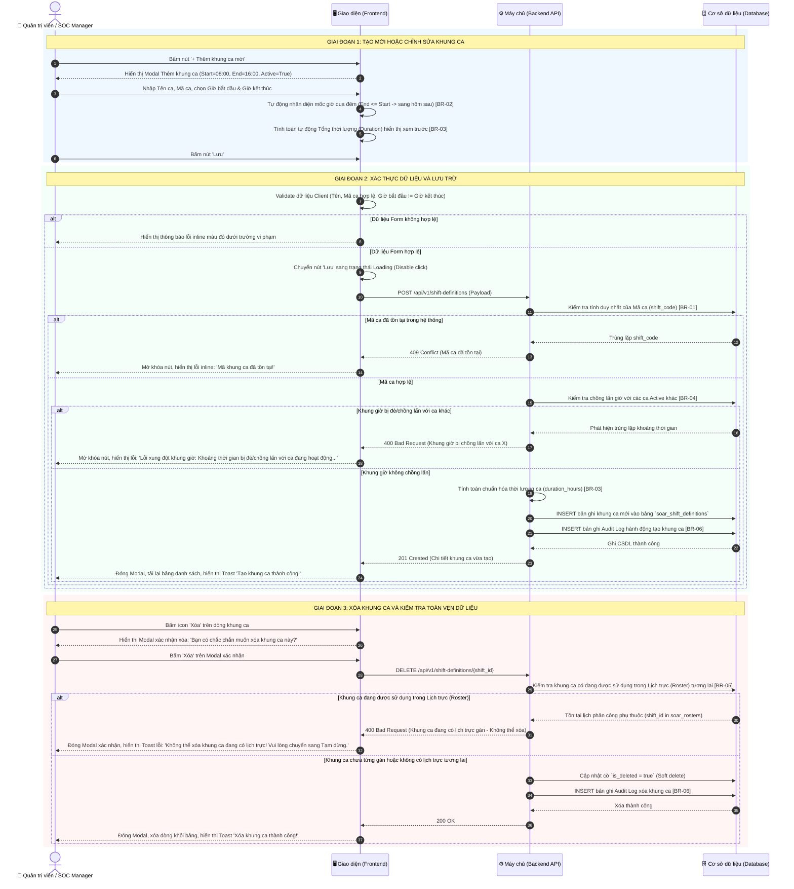

# ĐẶC TẢ YÊU CẦU PHẦN MỀM (SRS)
## TÍNH NĂNG: QUẢN LÝ KHUNG CA LÀM VIỆC (SHIFT DEFINITION MANAGEMENT)

---

# 1. THÔNG TIN CHUNG CHỨC NĂNG

| Thuộc tính | Nội dung |
| :--- | :--- |
| **Mã chức năng** | `SOAR_SHIFT_DEF_01` |
| **Tên chức năng** | Quản lý Khung ca làm việc (Shift Definition Management) |
| **Mô tả tổng quan** | Tính năng này cho phép Quản trị viên hệ thống (Super Admin) hoặc Quản lý SOC (SOC Manager) thiết lập, chỉnh sửa và quản lý các khung giờ làm việc tiêu chuẩn trong ngày của trung tâm SOC (như Ca Sáng, Ca Chiều, Ca Đêm 24/7). Hệ thống tự động xác định mốc thời gian của ca (ví dụ từ 20h đến 6h hệ thống tự hiểu là từ 20h hôm nay đến 6h sáng hôm sau, còn từ 6h đến 8h là trong cùng ngày mà người dùng không cần phải chọn hay phân loại thủ công), đồng thời **kiểm tra ràng buộc nghiêm ngặt không cho phép khung giờ của các ca trực đè/chồng lấn lên nhau**. Tính năng cũng tự động tính tổng số giờ làm việc thực tế và kiểm soát chặt chẽ tính toàn vẹn dữ liệu để ngăn ngừa việc xóa các khung ca đang được phân bổ trên Lịch trực (Roster). Đây là khối dữ liệu nền tảng phục vụ trực tiếp cho việc lập lịch kíp trực, gán tự động Case và giám sát thời hạn cam kết SLA. |
| **Phạm vi tính năng** | - **Bao gồm:**<br>&nbsp;&nbsp;+ Xem danh sách các khung ca làm việc với các chỉ số: Mã ca, Tên ca, Giờ bắt đầu, Giờ kết thúc, Thời lượng thực tế, Trạng thái hoạt động.<br>&nbsp;&nbsp;+ Tìm kiếm theo từ khóa Tên/Mã ca và Lọc nhanh theo Trạng thái (Tất cả, Đang hoạt động, Tạm dừng).<br>&nbsp;&nbsp;+ Thêm mới khung ca: Tự động hiểu mốc giờ qua đêm khi giờ kết thúc nhỏ hơn giờ bắt đầu, tự tính tổng thời lượng làm việc, và **bắt buộc kiểm tra không được đè/chồng lấn khung giờ với các ca đang hoạt động khác**.<br>&nbsp;&nbsp;+ Cập nhật thông tin khung ca (Tên ca, Giờ bắt đầu, Giờ kết thúc, Mô tả, Trạng thái). Khóa cố định trường Mã ca khi cập nhật.<br>&nbsp;&nbsp;+ Bật/Tắt trạng thái hoạt động (Active/Inactive) nhanh trực tiếp trên bảng dữ liệu.<br>&nbsp;&nbsp;+ Xóa khung ca kèm cơ chế kiểm tra ràng buộc dữ liệu nghiêm ngặt (chặn xóa nếu khung ca đã hoặc đang được gán trên Lịch trực tương lai).<br>&nbsp;&nbsp;+ Ghi nhận nhật ký kiểm toán (Audit Log) cho toàn bộ các thao tác Thêm, Sửa, Xóa, Bật/Tắt khung ca.<br>- **Không bao gồm:**<br>&nbsp;&nbsp;+ Phân bổ kíp trực hoặc nhân sự cụ thể vào ca (thuộc tính năng Quản lý Lịch phân công `SOAR_ROSTER_SCHED_03`).<br>&nbsp;&nbsp;+ Chấm công hoặc tính lương theo giờ làm việc (thuộc phân hệ Nhân sự bên ngoài). |
| **Điều kiện trước** | 1. Người dùng đã đăng nhập thành công vào hệ thống SOAR với tài khoản hợp lệ.<br>2. Tài khoản người dùng đã được phân quyền quản trị cấu hình ca trực (vai trò Super Admin hoặc SOC Manager theo Ma trận phân quyền).<br>3. Múi giờ hệ thống (Timezone) đã được đồng bộ chuẩn UTC+7 (hoặc múi giờ chuẩn của đơn vị). |
| **Điều kiện sau** | 1. **Khi thêm mới thành công:** Khung ca mới được lưu vào CSDL với trạng thái `Active`, hiển thị ngay trên bảng danh sách, ghi nhận Audit Log.<br>2. **Khi cập nhật thành công:** Thông tin khung ca được cập nhật, các lịch trực tương lai sử dụng khung ca này sẽ áp dụng mốc giờ mới, ghi nhận Audit Log.<br>3. **Khi xóa thành công:** Bản ghi khung ca bị xóa khỏi hệ thống (Soft delete), ghi nhận Audit Log.<br>4. **Khi thao tác thất bại / hủy bỏ:** CSDL không thay đổi, dữ liệu đang nhập trên form được giữ nguyên nếu người dùng chưa xác nhận thoát. |
| **Ngoại lệ tổng quan** | 1. Xung đột mã khung ca: Mã ca nhập vào bị trùng lặp với mã đã có trong hệ thống (Hệ thống chặn lưu và báo lỗi theo [BR-01]).<br>2. Xung đột/Chồng lấn khung giờ: Khung giờ làm việc của ca mới bị đè lên khung giờ của một ca khác đang hoạt động (Hệ thống từ chối lưu và báo lỗi theo [BR-04]).<br>3. Vi phạm ràng buộc toàn vẹn khi xóa: Người dùng cố tình xóa khung ca đang được sử dụng trong Lịch phân công Roster (Hệ thống từ chối xóa và hiển thị cảnh báo hướng dẫn chuyển sang trạng thái Inactive theo [BR-05]).<br>4. Mất kết nối CSDL hoặc lỗi mạng: Hiển thị Toast thông báo lỗi hệ thống, form nhập liệu được giữ nguyên trạng thái để không mất công sức nhập liệu của người dùng. |

---

# 2. MA TRẬN PHÂN QUYỀN

Tính năng Quản lý Khung ca làm việc được kiểm soát truy cập và phân định phạm vi thao tác dữ liệu theo cơ chế phân quyền chức năng:

### 2.1. Danh mục quyền chức năng

| Mã quyền | Tên quyền | Mô tả chi tiết |
| :--- | :--- | :--- |
| `SHIFT_DEF_VIEW` | **Xem** | Quyền xem danh sách các khung ca làm việc chuẩn trên hệ thống, tra cứu thông tin chi tiết khung giờ, thời lượng và trạng thái hoạt động. |
| `SHIFT_DEF_MANAGE` | **Tạo/sửa/xóa** | Quyền toàn quyền thao tác dữ liệu khung ca: Thêm mới khung ca, Chỉnh sửa thông tin khung ca, Xóa khung ca và Bật/Tắt trạng thái hoạt động (Active/Inactive). *(Quyền này đã bao gồm quyền Xem).* |

---

### 2.2. Chi tiết phạm vi thao tác và hiển thị giao diện theo quyền hạn

| Quyền hạn | Xem danh sách khung ca | Nút "+ Thêm khung ca mới" | Icon Chỉnh sửa (Edit) | Icon Xóa (Delete) | Bật/Tắt trạng thái (Active/Inactive) | Mô tả chi tiết hành vi giao diện & Phạm vi thao tác |
| :--- | :---: | :---: | :---: | :---: | :---: | :--- |
| **Không có quyền** | ❌ | ❌ | ❌ | ❌ | ❌ | • Người dùng không được truy cập vào tính năng Quản lý Khung ca.<br>• Menu chức năng bị ẩn hoặc hệ thống chuyển hướng sang trang 403 Forbidden nếu cố gắng truy cập trực tiếp bằng URL. |
| **Chỉ có quyền Xem**<br>(`SHIFT_DEF_VIEW`) | ✅ | ❌ | ❌ | ❌ | ❌ (Chỉ xem) | • **Xem danh sách khung ca:** Người dùng truy cập được màn hình Quản lý khung ca, xem toàn bộ danh sách các khung ca làm việc đang có trên hệ thống kèm mốc thời gian, thời lượng và trạng thái.<br>• Được sử dụng thanh tìm kiếm và bộ lọc trạng thái (Tất cả, Đang hoạt động, Tạm dừng).<br>• **Ẩn hoàn toàn các nút thao tác:** Không hiển thị nút **"+ Thêm khung ca mới"**, ẩn icon **Chỉnh sửa** (Edit) và ẩn icon **Xóa** (Delete) trên từng dòng của bảng dữ liệu.<br>• Cột trạng thái hiển thị dưới dạng Badge tĩnh (Read-only), không cho phép click thao tác bật/tắt. |
| **Có quyền Tạo/sửa/xóa**<br>(`SHIFT_DEF_MANAGE`) | ✅ | ✅ | ✅ | ✅ | ✅ | • **Toàn quyền quản trị khung ca:** Đã bao gồm toàn bộ quyền Xem.<br>• **Hiển thị nút "+ Thêm khung ca mới":** Cho phép bấm vào để hiển thị modal Thêm mới khung ca.<br>• **Hiển thị icon Chỉnh sửa (Edit) tại từng dòng:** Bấm vào sẽ mở modal Chỉnh sửa thông tin khung ca tương ứng.<br>• **Hiển thị icon Xóa (Delete) tại từng dòng:** Bấm vào sẽ hiển thị modal/popup xác nhận Xóa khung ca (kèm kiểm tra ràng buộc toàn vẹn theo [BR-05]).<br>• **Bật/Tắt trạng thái (Active/Inactive):** Công tắc trên từng dòng được mở quyền click tương tác, cho phép người dùng kích hoạt hoặc tạm dừng khung ca trực tiếp (kèm kiểm tra ràng buộc trùng lặp khung giờ theo [BR-04]). |

*Ghi chú ràng buộc kiểm soát truy cập:*
1. Nút **"+ Thêm khung ca mới"** ở góc phải thanh công cụ chỉ hiển thị đối với tài khoản có quyền **Tạo/sửa/xóa** (`SHIFT_DEF_MANAGE`).
2. Nút/Icon **Chỉnh sửa** (icon bút) và **Xóa** (icon thùng rác) tại cột *Thao tác* trên bảng danh sách chỉ hiển thị đối với tài khoản có quyền **Tạo/sửa/xóa** (`SHIFT_DEF_MANAGE`). Với người dùng chỉ có quyền **Xem**, các icon này bị ẩn hoàn toàn để đảm bảo tính an toàn cho dữ liệu.
3. Công tắc chuyển đổi **Active/Inactive** trên bảng dữ liệu chỉ mở quyền click tương tác cho tài khoản có quyền **Tạo/sửa/xóa**. Với tài khoản chỉ có quyền **Xem**, trạng thái hiển thị dưới dạng Badge tĩnh (chế độ Read-only).
4. Mọi hành động Thêm mới, Chỉnh sửa, Xóa hoặc Thay đổi trạng thái khung ca từ người dùng có quyền `SHIFT_DEF_MANAGE` đều được hệ thống ghi nhận đầy đủ vào Nhật ký kiểm toán (Audit Log) theo [BR-06].

---

# 3. BIỂU ĐỒ LUỒNG XỬ LÝ

### 3.1. Sơ đồ tuần tự: Thêm mới, Cập nhật và Xóa Khung ca làm việc (Sequence Diagram)



### 3.2. Mô tả chi tiết các bước trong luồng xử lý:
1. **Bước 1-5 (Khởi tạo form & Nhập liệu):** Quản trị viên bấm "+ Thêm khung ca mới". Frontend hiển thị Modal với giá trị khởi tạo mặc định (`Start Time = 08:00`, `End Time = 16:00`, `Trạng thái = Active`). Khi người dùng thay đổi giờ, hệ thống tự động xác định mốc thời gian (nếu End Time <= Start Time thì tự hiểu kết thúc vào sáng hôm sau; nếu End Time > Start Time thì là trong ngày) và hiển thị Thời lượng tính toán xem trước (`[BR-02]`, `[BR-03]`).
2. **Bước 6-10 (Validate Form tại Client):** Người dùng bấm "Lưu". Frontend kiểm tra các điều kiện bắt buộc: Tên ca không được rỗng, Mã ca đúng format chữ hoa, Giờ bắt đầu không được trùng khớp hoàn toàn với Giờ kết thúc (thời lượng = 0h). Nếu không đạt, hiển thị lỗi inline và dừng luồng.
3. **Bước 11-23 (Backend kiểm tra trùng mã, kiểm tra chặn chồng lấn giờ & Ghi CSDL):**
   - Backend tiếp nhận request, kiểm tra trường `shift_code` trong CSDL (`[BR-01]`). Nếu trùng, trả về mã `409 Conflict`.
   - **Kiểm tra chồng lấn khung giờ (`[BR-04]`):** Backend so sánh khoảng thời gian của ca mới với toàn bộ các ca đang `Active`. **Nếu phát hiện khung giờ bị đè/chồng lấn lên nhau, Backend từ chối lưu và trả về mã `400 Bad Request`**, Frontend hiển thị thông báo lỗi chi tiết để người dùng điều chỉnh lại giờ.
   - Nếu hoàn toàn không chồng lấn: Backend tính toán chuẩn hóa `duration_hours` (`[BR-03]`), ghi dữ liệu vào bảng `soar_shift_definitions` và ghi nhật ký kiểm toán `soar_audit_logs` (`[BR-06]`).
4. **Bước 24-26 (Phản hồi thành công):** Backend trả về mã `201 Created`. Frontend đóng modal, tải lại bảng danh sách và hiển thị Toast thông báo thành công.
5. **Bước 27-36 (Kiểm tra ràng buộc khi Xóa khung ca):** Khi người dùng bấm xóa và xác nhận, Backend thực hiện truy vấn bảng `soar_rosters` (`[BR-05]`). Nếu khung ca này đang có lịch trực được phân bổ từ thời điểm hiện tại trở về tương lai, hệ thống từ chối xóa và trả về mã lỗi `400 Bad Request`. Nếu không vướng ràng buộc, hệ thống thực hiện Soft delete và ghi Audit Log.

---

# 4. THIẾT KẾ GIAO DIỆN & ĐẶC TẢ CHI TIẾT UI COMPONENTS

### 4.1. Màn hình Danh sách Khung ca làm việc (`/settings/shifts/definitions`)

Toàn bộ các thành phần hiển thị, lọc tìm kiếm và bảng dữ liệu trên màn hình danh sách được đặc tả chi tiết trong bảng dưới đây:

| STT | Tên trường | Loại dữ liệu | Mô tả |
| :---: | :--- | :--- | :--- |
| 1 | **Tiêu đề trang** | Label | - Tiêu đề màn hình, hiển thị tên phân hệ Quản lý Khung ca.<br>- **Nội dung hiển thị mặc định:** `"Quản lý Khung ca làm việc"` (`"Shift Definitions Management"`)<br>- **Tính chất hiển thị:** Tĩnh (Static). |
| 2 | **Mô tả phụ** | Label | - Đoạn văn bản ngắn hướng dẫn và mô tả mục đích của phân hệ.<br>- **Nội dung hiển thị mặc định:** `"Định nghĩa các khung thời gian làm việc tiêu chuẩn không chồng lấn cho trung tâm SOC."`<br>- **Tính chất hiển thị:** Tĩnh. |
| 3 | **Nút "+ Thêm khung ca mới"** | Button | - Cho phép Quản trị viên mở Modal thêm mới khung ca làm việc.<br>- **Trạng thái mặc định:** Enabled.<br>- **Quyền hạn truy cập:** Chỉ hiển thị và cho phép thao tác đối với vai trò *Super Admin* và *SOC Manager* (theo Mục 2).<br>- **Hành vi khi nhấn (OnClick):** Mở Modal "Thêm khung ca mới" với các giá trị mặc định được khởi tạo sẵn. |
| 4 | **Thanh tìm kiếm khung ca** | Searchbox | - Cho phép người dùng nhập từ khóa để tìm kiếm nhanh khung ca theo Tên hoặc Mã ca.<br>- **Placeholder:**<br>&nbsp;&nbsp;+ VI: `Tìm kiếm theo tên hoặc mã khung ca...`<br>&nbsp;&nbsp;+ EN: `Search by shift name or code...`<br>- **Giá trị mặc định:** Trống.<br>- **Giới hạn ký tự:** Tối đa 100 ký tự.<br>- **Quy tắc Nghiệp vụ:** Tự động trim khoảng trắng ở đầu/cuối chuỗi. Áp dụng cơ chế Debounce 300ms kể từ khi người dùng ngừng gõ để tự động kích hoạt lọc dữ liệu trên bảng mà không cần nhấn Enter. Hỗ trợ icon "x" ở góc phải để xóa nhanh nội dung tìm kiếm. |
| 5 | **Bộ lọc Trạng thái** | Combobox | - Cho phép người dùng lọc danh sách khung ca theo trạng thái hoạt động.<br>- **Nguồn dữ liệu cố định:**<br>&nbsp;&nbsp;+ `Tất cả trạng thái` (`ALL`) - Mặc định<br>&nbsp;&nbsp;+ `Đang hoạt động` (`ACTIVE`)<br>&nbsp;&nbsp;+ `Tạm dừng` (`INACTIVE`)<br>- **Chức năng tìm kiếm:** Không.<br>- **Quy tắc Nghiệp vụ:** Khi chọn một tùy chọn, bảng dữ liệu lập tức cập nhật lại danh sách tương ứng. |
| 6 | **Bảng danh sách khung ca** | Datatable | - Hiển thị danh sách các khung ca làm việc đang có trong hệ thống dưới dạng bảng dữ liệu.<br>- **Các chức năng chung bổ trợ:**<br>&nbsp;&nbsp;+ Phân trang (Pagination): Có, hỗ trợ các mốc 10, 25, 50 bản ghi/trang. Mặc định 10 bản ghi/trang.<br>&nbsp;&nbsp;+ Sắp xếp (Sorting): Cho phép click vào Header các cột `Mã ca`, `Tên ca`, `Giờ bắt đầu`, `Thời lượng` để sắp xếp tăng/giảm dần.<br>- **Đặc tả chi tiết các cột dữ liệu:**<br>&nbsp;&nbsp;• **Cột Mã ca (Shift Code):** Hiển thị mã định danh in hoa của ca (ví dụ: `SHIFT_MORNING`). Dạng chữ in đậm, kèm font monospace dễ đọc.<br>&nbsp;&nbsp;• **Cột Tên ca (Shift Name):** Hiển thị tên gọi của khung ca (ví dụ: `Ca Sáng Tiêu Chuẩn`).<br>&nbsp;&nbsp;• **Cột Khung giờ làm việc:** Hiển thị kết hợp chuỗi thời gian: `[Giờ bắt đầu] - [Giờ kết thúc]` (ví dụ: `06:00 - 14:00` hoặc `20:00 - 06:00 (+1)`). Nếu kết thúc vào ngày hôm sau, tự động gắn ký hiệu `(+1)` bên cạnh giờ kết thúc để người dùng nhận diện nhanh.<br>&nbsp;&nbsp;• **Cột Thời lượng (Duration):** Hiển thị tổng số giờ làm việc thực tế được tính toán tự động (ví dụ: `8.0 giờ`, `10.0 giờ`). Xem công thức tính tại `[BR-03]`.<br>&nbsp;&nbsp;• **Cột Trạng thái (Status Toggle):** Cho phép bật/tắt nhanh trạng thái hoạt động của khung ca trực tiếp trên dòng. Giá trị mặc định lấy theo trạng thái thực tế của bản ghi. Khi chuyển đổi, hiển thị spinner xoay tròn nhỏ; gọi API cập nhật. Nếu thành công hiển thị Toast thông báo; nếu thất bại tự động hoàn tác (rollback) trạng thái công tắc và báo lỗi.<br>&nbsp;&nbsp;• **Cột Thao tác (Actions):** Chứa các nút chức năng cho từng dòng:<br>&nbsp;&nbsp;&nbsp;&nbsp;- *Icon Chỉnh sửa (Edit):* Cho phép mở Modal "Chỉnh sửa khung ca", điền sẵn toàn bộ dữ liệu hiện tại lên form.<br>&nbsp;&nbsp;&nbsp;&nbsp;- *Icon Xóa (Delete):* Cho phép xóa khung ca. Khi click, mở Hộp thoại xác nhận xóa (Xem mục 4.3). Bị vô hiệu hóa (disabled) kèm Tooltip cảnh báo nếu khung ca đang có lịch trực được gán theo `[BR-05]`. |

---

### 4.2. Modal Thêm mới / Chỉnh sửa Khung ca làm việc

Modal dạng Pop-up trung tâm, dùng chung cho cả luồng Thêm mới và Chỉnh sửa (khi chỉnh sửa, tiêu đề đổi thành "Chỉnh sửa khung ca" và trường Mã khung ca chuyển sang chế độ Chỉ đọc - Read-only):

| STT | Tên trường | Loại dữ liệu | Mô tả |
| :---: | :--- | :--- | :--- |
| 1 | **Tiêu đề Modal** | Label | - Tiêu đề của Pop-up.<br>- **Nội dung hiển thị:**<br>&nbsp;&nbsp;+ Khi tạo mới: `"Thêm khung ca làm việc mới"` (`"Add New Shift Definition"`)<br>&nbsp;&nbsp;+ Khi cập nhật: `"Chỉnh sửa khung ca: {shift_name}"` (`"Edit Shift Definition: {shift_name}"`)<br>- **Tính chất hiển thị:** Động. |
| 2 | **Tên khung ca** | Textbox | - Người dùng bắt buộc nhập vào tên gợi nhớ của khung ca làm việc.<br>- **Placeholder:**<br>&nbsp;&nbsp;+ VI: `Nhập tên khung ca (ví dụ: Ca Sáng Tiêu Chuẩn)`<br>&nbsp;&nbsp;+ EN: `Enter shift name (e.g., Morning Shift)`<br>- **Giá trị mặc định:** Trống.<br>- **Giới hạn ký tự:** Tối đa 100 ký tự. Hành vi khi vượt quá: Hệ thống chặn gõ, không cho nhập thêm ký tự thứ 101.<br>- **Kiểu ký tự hợp lệ:** Tất cả ký tự chữ, số và ký tự đặc biệt thông dụng.<br>- **Quy tắc Nghiệp vụ:** Tự động trim khoảng trắng ở đầu và cuối chuỗi trước khi lưu.<br>- **Thông báo lỗi tương ứng:**<br>&nbsp;&nbsp;+ Trống và nhấn nút Lưu: Hiển thị lỗi inline màu đỏ ngay dưới trường: `"Tên khung ca là bắt buộc!"` (`"Shift name is required!"`) |
| 3 | **Mã khung ca** | Textbox | - Người dùng bắt buộc nhập mã định danh duy nhất cho khung ca trên toàn hệ thống.<br>- **Placeholder:**<br>&nbsp;&nbsp;+ VI: `Nhập mã khung ca (ví dụ: SHIFT_MORNING)`<br>&nbsp;&nbsp;+ EN: `Enter shift code (e.g., SHIFT_MORNING)`<br>- **Giá trị mặc định:** Trống.<br>- **Giới hạn ký tự:** Tối đa 30 ký tự.<br>- **Kiểu ký tự hợp lệ:** Chỉ cho phép chữ cái viết hoa tiếng Anh không dấu (`A-Z`), chữ số (`0-9`) và dấu gạch dưới (`_`). Tự động chuyển ký tự người dùng gõ thành chữ in hoa (Auto-uppercase).<br>- **Quy tắc Nghiệp vụ:**<br>&nbsp;&nbsp;1. Khi mở ở chế độ Chỉnh sửa: Trường này bị khóa hoàn toàn (Disabled / Read-only) để bảo toàn liên kết khóa ngoại với các phân hệ khác.<br>&nbsp;&nbsp;2. Mã khung ca phải là duy nhất trên toàn hệ thống, không phân biệt hoa/thường (Xem chi tiết tại `[BR-01]`).<br>- **Thông báo lỗi tương ứng:**<br>&nbsp;&nbsp;+ Trống và nhấn nút Lưu: Hiển thị lỗi inline màu đỏ: `"Mã khung ca là bắt buộc!"` (`"Shift code is required!"`)<br>&nbsp;&nbsp;+ Chứa ký tự không hợp lệ: Hiển thị lỗi inline màu đỏ: `"Mã khung ca chỉ được chứa chữ hoa không dấu, số và dấu gạch dưới!"` (`"Shift code only allows uppercase letters, numbers, and underscores!"`)<br>&nbsp;&nbsp;+ Trùng lặp: Hiển thị lỗi inline màu đỏ: `"Mã khung ca đã tồn tại trên hệ thống!"` (`"Shift code already exists!"`) |
| 4 | **Giờ bắt đầu (Start Time)** | Timepicker | - Người dùng bắt buộc chọn mốc thời gian bắt đầu ca làm việc trong ngày.<br>- **Định dạng hiển thị & nhập:** 24 giờ (`HH:mm`) (ví dụ: `06:00`, `14:00`, `20:00`).<br>- **Cách thức nhập:** Chọn từ đồng hồ xoay hoặc gõ trực tiếp bàn phím.<br>- **Bước nhảy chọn (Interval):** Khối 15 phút (00, 15, 30, 45).<br>- **Giá trị mặc định:** `08:00`.<br>- **Quy tắc Nghiệp vụ & Kích hoạt động:**<br>&nbsp;&nbsp;1. Khi thay đổi Giờ bắt đầu, hệ thống tự động xác định mốc thời gian theo `[BR-02]` và tính lại Thời lượng hiển thị ở trường Thời lượng (`[BR-03]`).<br>- **Thông báo lỗi tương ứng:** Không có (do luôn có giá trị mặc định). |
| 5 | **Giờ kết thúc (End Time)** | Timepicker | - Người dùng bắt buộc chọn mốc thời gian kết thúc ca làm việc.<br>- **Định dạng hiển thị & nhập:** 24 giờ (`HH:mm`) (ví dụ: `14:00`, `22:00`, `06:00`).<br>- **Cách thức nhập:** Chọn từ đồng hồ xoay hoặc gõ trực tiếp bàn phím.<br>- **Bước nhảy chọn (Interval):** Khối 15 phút (00, 15, 30, 45).<br>- **Giá trị mặc định:** `16:00`.<br>- **Quy tắc Nghiệp vụ & Kích hoạt động:**<br>&nbsp;&nbsp;1. **Cơ chế tự động hiểu mốc giờ:** Nếu Giờ kết thúc <= Giờ bắt đầu (ví dụ: từ 20:00 đến 06:00), hệ thống tự động hiểu là kết thúc vào 06:00 sáng ngày hôm sau. Nếu Giờ kết thúc > Giờ bắt đầu (ví dụ: từ 06:00 đến 08:00), hệ thống tự hiểu là kết thúc trong cùng ngày (`[BR-02]`). Người dùng không cần tích chọn bất kỳ cờ phân loại nào.<br>&nbsp;&nbsp;2. Nếu Giờ kết thúc trùng hoàn toàn với Giờ bắt đầu (Thời lượng = 0 giờ), hệ thống không cho phép lưu.<br>&nbsp;&nbsp;3. Tự động cập nhật Tổng thời lượng hiển thị tại trường Thời lượng theo `[BR-03]`.<br>- **Thông báo lỗi tương ứng:**<br>&nbsp;&nbsp;+ Giờ kết thúc trùng Giờ bắt đầu: Hiển thị lỗi inline màu đỏ: `"Giờ kết thúc không được trùng với giờ bắt đầu!"` (`"End time cannot be the same as start time!"`) |
| 6 | **Thời lượng ca tính toán (Duration)** | Textbox (Chỉ đọc) | - Hiển thị tổng số giờ làm việc thực tế được tính toán tự động dựa trên Giờ bắt đầu và Giờ kết thúc.<br>- **Giá trị mặc định:** Tự động tính: `8.0 giờ` (với ca `08:00 - 16:00`), `10.0 giờ` (với ca `20:00 - 06:00`).<br>- **Định dạng hiển thị:** Số thập phân lấy 1 chữ số sau dấu phẩy kèm hậu tố `"giờ"` (`"hours"`).<br>- **Quy tắc Nghiệp vụ:** Trường chỉ đọc (Read-only), không cho phép nhập tay. Công thức tính toán tuân theo quy tắc `[BR-03]`.<br>- **Thông báo lỗi tương ứng:** Không có (trường chỉ đọc). |
| 7 | **Mô tả / Ghi chú** | Textarea | - Cho phép người dùng nhập thông tin mô tả mục đích hoặc yêu cầu đặc thù của ca làm việc.<br>- **Placeholder:**<br>&nbsp;&nbsp;+ VI: `Nhập mô tả khung ca làm việc (tùy chọn)...`<br>&nbsp;&nbsp;+ EN: `Enter shift description (optional)...`<br>- **Giá trị mặc định:** Trống.<br>- **Giới hạn ký tự:** Tối đa 300 ký tự. Có bộ đếm số ký tự ở góc phải (ví dụ: `0/300`).<br>- **Kiểu ký tự hợp lệ:** Tất cả ký tự.<br>- **Thông báo lỗi tương ứng:** Không có (trường tùy chọn). |
| 8 | **Trạng thái hoạt động** | Toggle Switch | - Cho phép thiết lập trạng thái sử dụng của khung ca.<br>- **Giá trị mặc định:** Bật (`Active`).<br>- **Hành vi hiển thị:** Gồm nhãn hiển thị kèm theo: `"Đang hoạt động"` (`Active`) khi bật, hoặc `"Tạm dừng"` (`Inactive`) khi tắt.<br>- **Quy tắc Nghiệp vụ:** Chỉ các khung ca ở trạng thái `Active` mới được phép chọn khi lập Lịch phân công (Roster). Khung ca `Inactive` vẫn được lưu trên hệ thống để bảo toàn dữ liệu lịch sử. |
| 9 | **Nút "Hủy bỏ" (Cancel)** | Button | - Cho phép người dùng đóng Modal và hủy bỏ thao tác đang thực hiện.<br>- **Trạng thái mặc định:** Enabled.<br>- **Quyền hạn truy cập:** Tất cả người dùng có quyền mở Modal.<br>- **Hành vi khi nhấn (OnClick):**<br>&nbsp;&nbsp;+ Nếu form chưa có bất kỳ thay đổi nào so với ban đầu: Đóng Modal ngay lập tức.<br>&nbsp;&nbsp;+ Nếu form đã có chỉnh sửa dữ liệu: Hiển thị Hộp thoại cảnh báo dữ liệu chưa lưu (Xem mục 4.3). |
| 10 | **Nút "Lưu khung ca" (Save)** | Button | - Cho phép người dùng gửi thông tin để lưu khung ca vào hệ thống.<br>- **Trạng thái mặc định:** Enabled.<br>- **Quyền hạn truy cập:** Chỉ vai trò *Super Admin* và *SOC Manager* (theo Mục 2).<br>- **Hành vi khi nhấn (OnClick):**<br>&nbsp;&nbsp;1. Kiểm tra tính hợp lệ của các trường bắt buộc trên form. Nếu có trường vi phạm, hiển thị lỗi inline đỏ.<br>&nbsp;&nbsp;2. **Kiểm tra ràng buộc không chồng lấn khung giờ (`[BR-04]`):** Nếu khung giờ bị đè/chồng lấn lên bất kỳ ca `Active` nào khác, hệ thống chặn lưu và hiển thị thông báo lỗi màu đỏ: `"Lỗi xung đột khung giờ: Khoảng thời gian [Start - End] bị đè/chồng lấn với ca đang hoạt động '[Tên ca]' ([Start - End])."` (chỉ thông báo rõ ca và khoảng thời gian xung đột, không kèm câu quy tắc rườm rà).<br>&nbsp;&nbsp;3. Nếu dữ liệu hợp lệ, chuyển nút sang trạng thái Loading và gửi request lên Backend.<br>&nbsp;&nbsp;4. Nếu thành công: Đóng Modal, tải lại bảng danh sách khung ca, hiển thị Toast thành công: `"Lưu khung ca làm việc thành công!"` (`"Shift definition saved successfully!"`).<br>&nbsp;&nbsp;5. Nếu thất bại do trùng mã hoặc lỗi hệ thống: Mở khóa nút, hiển thị Toast lỗi hoặc thông báo lỗi inline tương ứng. |

---

### 4.3. Quy tắc đặc tả các Hộp thoại xác nhận (Confirmation Modals)

#### 4.3.1. Hộp thoại xác nhận xóa khung ca
- **Tên Modal:** Hộp thoại xác nhận xóa khung ca làm việc.
- **Tiêu đề (Header):** `"Xác nhận xóa khung ca"` (`"Confirm shift deletion"`)
- **Nội dung thông báo (Body text):** `"Bạn có chắc chắn muốn xóa khung ca [Tên khung ca] không? Hành động này sẽ loại bỏ khung ca khỏi danh sách cấu hình. Lưu ý: Không thể hoàn tác."` (`"Are you sure you want to delete shift [Shift Name]? This action cannot be undone."`)
- **Nút Xác nhận xóa (Confirm Button):**
  - Nhãn nút: `"Xóa khung ca"` (`"Delete Shift"`)
  - Màu sắc: Đỏ cảnh báo (Danger).
  - Hành vi khi nhấn: Nút chuyển sang trạng thái Loading, gọi API `DELETE /api/v1/shift-definitions/{shift_id}`. Nếu thành công, đóng hộp thoại, cập nhật bảng danh sách và hiển thị Toast `"Đã xóa khung ca thành công!"`. Nếu vi phạm ràng buộc lịch trực theo `[BR-05]`, đóng hộp thoại và hiển thị Toast lỗi từ chối.
- **Nút Hủy (Cancel Button):**
  - Nhãn nút: `"Hủy bỏ"` (`"Cancel"`) hoặc click icon "x" góc trên bên phải.
  - Hành vi khi nhấn: Đóng hộp thoại xác nhận, không thực hiện hành động xóa.
- **Hành vi khi click vùng ngoài Modal:** Không đóng hộp thoại (chống click nhầm).

#### 4.3.2. Hộp thoại cảnh báo dữ liệu chưa lưu khi thoát form
- **Tên Modal:** Cảnh báo dữ liệu chưa được lưu.
- **Tiêu đề (Header):** `"Thông tin chưa được lưu"` (`"Unsaved changes"`)
- **Nội dung thông báo (Body text):** `"Các thông tin khung ca bạn vừa nhập chưa được lưu lại. Bạn có chắc chắn muốn thoát và hủy bỏ các thay đổi này không?"` (`"The changes you made have not been saved. Are you sure you want to exit and discard these changes?"`)
- **Nút Xác nhận thoát (Confirm Button):**
  - Nhãn nút: `"Thoát không lưu"` (`"Exit without saving"`)
  - Hành vi khi nhấn: Đóng hộp thoại cảnh báo đồng thời đóng Modal thêm/sửa khung ca, xóa toàn bộ dữ liệu tạm thời trên form.
- **Nút Giữ lại chỉnh sửa (Cancel Button):**
  - Nhãn nút: `"Tiếp tục chỉnh sửa"` (`"Keep editing"`)
  - Hành vi khi nhấn: Đóng hộp thoại cảnh báo, giữ nguyên toàn bộ dữ liệu đang nhập trên Modal để người dùng tiếp tục thao tác.
- **Hành vi khi click vùng ngoài Modal:** Không đóng hộp thoại.

---

### 4.4. Đặc tả các trạng thái màn hình bổ trợ (Screen States)

#### 4.4.1. Trạng thái trống (Empty State)
- **Điều kiện kích hoạt:** Khi hệ thống chưa từng có khung ca nào được tạo hoặc khi kết quả tìm kiếm/lọc trả về 0 bản ghi.
- **Trường hợp 1: Hệ thống chưa có dữ liệu khung ca nào:**
  - Hình ảnh minh họa: Icon minh họa đồng hồ ca trực rỗng.
  - Tiêu đề: `"Chưa có khung ca làm việc nào"` (`"No shift definitions yet"`)
  - Mô tả phụ: `"Bắt đầu bằng cách tạo khung ca làm việc tiêu chuẩn đầu tiên để phục vụ phân bổ kíp trực cho trung tâm SOC."` (`"Get started by creating your first shift definition for SOC operations."`)
  - Nút hành động (CTA Button): Nút `"+ Tạo khung ca đầu tiên"` (`"+ Add First Shift"`) - Click mở Modal thêm mới khung ca.
- **Trường hợp 2: Tìm kiếm / Lọc không có kết quả:**
  - Hình ảnh minh họa: Icon kính lúp không tìm thấy dữ liệu.
  - Tiêu đề: `"Không tìm thấy khung ca phù hợp"` (`"No matching shifts found"`)
  - Mô tả phụ: `"Không tìm thấy kết quả nào khớp với từ khóa hoặc bộ lọc đã chọn. Vui lòng thử lại với tiêu chí khác."`
  - Nút hành động: Nút `"Xóa bộ lọc"` (`"Clear Filters"`) - Click reset ô tìm kiếm và bộ lọc về mặc định.

#### 4.4.2. Trạng thái lỗi tải dữ liệu (Error / Offline State)
- **Điều kiện kích hoạt:** Khi API máy chủ trả về mã lỗi 5xx hoặc thiết bị mất kết nối mạng Internet.
- **Nội dung hiển thị:** `"Không thể tải danh sách khung ca làm việc do lỗi kết nối máy chủ. Vui lòng kiểm tra lại đường truyền mạng hoặc thử lại sau."` (`"Failed to load shift definitions. Please check your connection."`)
- **Nút hành động:** Nút `"Tải lại trang"` (`"Retry"`) để kích hoạt gọi lại API lấy dữ liệu.

---

# 5. QUY TẮC NGHIỆP VỤ CHUYÊN SÂU (BUSINESS RULES)

### Bảng tổng hợp quy tắc nghiệp vụ:

| Mã BR | Tên quy tắc nghiệp vụ | Phân loại | Mức độ ưu tiên |
| :---: | :--- | :--- | :---: |
| **[BR-01]** | Quy tắc kiểm tra tính duy nhất và chuẩn hóa Mã khung ca | Ràng buộc dữ liệu & Thuật toán | Bắt buộc |
| **[BR-02]** | Quy tắc tự động xác định mốc thời gian qua đêm của Ca làm việc | Ràng buộc dữ liệu & Thuật toán | Bắt buộc |
| **[BR-03]** | Công thức tính toán Tổng thời lượng làm việc thực tế của Ca | Công thức tính toán | Bắt buộc |
| **[BR-04]** | Quy tắc kiểm tra chặn trùng lấn/chồng chéo khung giờ làm việc | Ràng buộc dữ liệu & Thuật toán | Bắt buộc |
| **[BR-05]** | Ràng buộc toàn vẹn dữ liệu khi Xóa khung ca làm việc | Quy trình & Trạng thái | Bắt buộc |
| **[BR-06]** | Quy chuẩn ghi nhận Nhật ký kiểm toán (Audit Logging) | Bảo mật & Lưu trữ | Bắt buộc |

---

### Chi tiết từng quy tắc:

### [BR-01] Quy tắc kiểm tra tính duy nhất và chuẩn hóa Mã khung ca
- **Phân loại:** Ràng buộc dữ liệu & Thuật toán
- **Phạm vi áp dụng:** Toàn bộ hệ thống SOAR. Áp dụng cho cả luồng thao tác trên Giao diện Web (UI) và gọi qua API Backend (`POST /api/v1/shift-definitions`).
- **Điều kiện kích hoạt:** Khi người dùng bấm nút `Lưu` trên Modal hoặc khi Backend tiếp nhận request tạo mới khung ca.
- **Logic xử lý chi tiết:**
  1. Frontend và Backend tự động trim toàn bộ khoảng trắng ở đầu và cuối chuỗi của trường `shift_code`.
  2. Chuẩn hóa chuỗi về dạng chữ in hoa (Uppercase). Tự động thay thế khoảng trắng giữa các từ bằng dấu gạch dưới `_`.
  3. Kiểm tra tính duy nhất: Truy vấn bảng `soar_shift_definitions` với điều kiện `UPPER(shift_code) = UPPER(:input_code)` và `is_deleted = false`.
  4. Nếu tìm thấy bản ghi trùng lặp, hệ thống coi là vi phạm (Ví dụ: Đã có `SHIFT_NIGHT` thì các mã `shift_night`, `  SHIFT_NIGHT  ` đều bị coi là trùng lặp).
  5. Khi ở chế độ Chỉnh sửa (`PUT /api/v1/shift-definitions/{id}`), trường `shift_code` bị khóa cố định không cho phép thay đổi giá trị.
- **Hành vi khi vi phạm:**
  - Backend hủy bỏ transaction, trả về mã lỗi HTTP `409 Conflict` kèm message: `Shift code already exists: [shift_code]`.
  - Trên giao diện: Mở khóa nút bấm, hiển thị lỗi inline màu đỏ ngay dưới trường Mã khung ca: `"Mã khung ca đã tồn tại trên hệ thống!"` (`"Shift code already exists!"`).

---

### [BR-02] Quy tắc tự động xác định mốc thời gian qua đêm của Ca làm việc
- **Phân loại:** Ràng buộc dữ liệu & Thuật toán
- **Phạm vi áp dụng:** Logic xử lý thời gian của Khung ca trên toàn hệ thống (UI, API và Scheduler Engine).
- **Nguyên lý nghiệp vụ:**
  1. Người dùng chỉ cần nhập hai mốc giờ: `Giờ bắt đầu (Start Time)` và `Giờ kết thúc (End Time)`. **Hệ thống tự động xác định mốc thời gian mà không cần bất kỳ trường dữ liệu hay checkbox phân biệt "ca vắt qua đêm" nào**.
  2. Giả sử Giờ bắt đầu là $T_{start}$ và Giờ kết thúc là $T_{end}$ (theo định dạng 24h: `HH:mm`):
     - **Trường hợp 1 (Tự động hiểu là kết thúc vào ngày hôm sau):**
       * Nếu $T_{end} \le T_{start}$: Hệ thống tự động xác định thời điểm kết thúc ca thuộc về ngày tiếp theo ($D + 1$).
       * *Ví dụ:* Ca từ `20:00` đến `06:00` $\rightarrow$ Hệ thống tự hiểu là bắt đầu lúc 20:00 ngày hôm nay ($D$) và kết thúc lúc 06:00 sáng ngày hôm sau ($D + 1$).
     - **Trường hợp 2 (Tự động hiểu là kết thúc trong cùng ngày):**
       * Nếu $T_{end} > T_{start}$: Hệ thống tự động xác định thời điểm kết thúc ca nằm trọn vẹn trong cùng ngày ($D$).
       * *Ví dụ:* Ca từ `06:00` đến `08:00` $\rightarrow$ Hệ thống tự hiểu là từ 06:00 đến 08:00 của cùng ngày hôm đó ($D$).
  3. **Hiển thị trực quan:** Trên bảng danh sách và giao diện hiển thị, nếu ca rơi vào Trường hợp 1 (kết thúc sang ngày hôm sau), hệ thống tự động gắn thêm ký hiệu `(+1)` bên cạnh giờ kết thúc (ví dụ: `20:00 - 06:00 (+1)`) để người dùng dễ nhận biết, không cần cột hay badge phân loại riêng.

---

### [BR-03] Công thức tính toán Tổng thời lượng làm việc thực tế của Ca
- **Phân loại:** Công thức tính toán
- **Phạm vi áp dụng:** Frontend (hiển thị xem trước), Backend (tính toán lưu trữ CSDL) và Module tính toán SLA.
- **Điều kiện kích hoạt:** Tự động tính toán lại mỗi khi $T_{start}$ hoặc $T_{end}$ thay đổi.
- **Công thức tính toán:**
  - Quy đổi thời gian sang đơn vị Phút:
    $$\text{Minutes}_{start} = \text{Hour}_{start} \times 60 + \text{Minute}_{start}$$
    $$\text{Minutes}_{end} = \text{Hour}_{end} \times 60 + \text{Minute}_{end}$$
  - **Trường hợp ca trong cùng ngày** ($T_{end} > T_{start}$):
    $$\Delta_{\text{Minutes}} = \text{Minutes}_{end} - \text{Minutes}_{start}$$
  - **Trường hợp ca kết thúc ngày hôm sau** ($T_{end} \le T_{start}$):
    $$\Delta_{\text{Minutes}} = (24 \times 60 - \text{Minutes}_{start}) + \text{Minutes}_{end}$$
  - **Tổng số giờ làm việc (Duration Hours):**
    $$\text{Duration Hours} = \frac{\Delta_{\text{Minutes}}}{60}$$
  *(Kết quả làm tròn đến 1 chữ số thập phân).*
  - *Ví dụ minh họa:*
    * Ca `06:00` đến `08:00`: $\Delta = 480 - 360 = 120 \text{ phút} \rightarrow \mathbf{2.0 \text{ giờ}}$.
    * Ca `06:00` đến `14:00`: $\Delta = 840 - 360 = 480 \text{ phút} \rightarrow \mathbf{8.0 \text{ giờ}}$.
    * Ca `20:00` đến `06:00` (qua đêm): $\Delta = (1440 - 1200) + 360 = 240 + 360 = 600 \text{ phút} \rightarrow \mathbf{10.0 \text{ giờ}}$.
- **Ràng buộc kiểm tra:** Nếu $\text{Duration Hours} = 0$ (Giờ kết thúc trùng hoàn toàn với Giờ bắt đầu), hệ thống từ chối lưu và báo lỗi: `"Giờ kết thúc không được trùng với giờ bắt đầu!"`.

---

### [BR-04] Quy tắc kiểm tra chặn trùng lấn/chồng chéo khung giờ làm việc (Shift Overlap Validation)
- **Phân loại:** Ràng buộc dữ liệu & Thuật toán
- **Phạm vi áp dụng:** Thao tác Thêm mới và Chỉnh sửa khung ca làm việc.
- **Điều kiện kích hoạt:** Khi người dùng bấm `Lưu` trên Modal tạo/sửa khung ca hoặc khi API `POST/PUT /api/v1/shift-definitions` được gọi.
- **Nguyên lý nghiệp vụ bắt buộc:**
  - **Khung giờ của các ca trực đang hoạt động (`Active`) TUYỆT ĐỐI KHÔNG ĐƯỢC ĐÈ/CHỒNG LẤN LÊN NHAU.**
  - Mỗi thời điểm trong ngày chỉ được thuộc về tối đa một ca trực duy nhất để đảm bảo tính xác định rõ ràng của ca trực hiệu lực và trách nhiệm xử lý Case.
- **Thuật toán kiểm tra:**
  1. Lấy danh sách toàn bộ các khung ca đang ở trạng thái `Active` trong hệ thống (nếu là cập nhật thì loại trừ chính khung ca đang sửa).
  2. Biểu diễn khung giờ của từng ca thành các khoảng thời gian $[S_i, E_i)$ trên vòng lặp thời gian 24 giờ (1440 phút):
     - Nếu ca trong ngày ($T_{end} > T_{start}$): Khoảng thời gian là $[T_{start}, T_{end})$.
     - Nếu ca qua đêm ($T_{end} \le T_{start}$): Tách thành 2 khoảng con: $[T_{start}, 1440)$ và $[0, T_{end})$.
  3. So sánh khung giờ của ca mới $[S_{new}, E_{new})$ với từng ca hiện có $[S_{exist}, E_{exist})$:
     - Nếu tồn tại bất kỳ giao điểm thời gian nào: $\max(S_{new}, S_{exist}) < \min(E_{new}, E_{exist})$:
       $\rightarrow$ **Xác nhận vi phạm chồng lấn khung giờ.**
- **Hành vi khi vi phạm (Chặn lưu cứng):**
  - Backend hủy bỏ transaction, trả về mã lỗi HTTP `400 Bad Request` kèm thông báo lỗi chi tiết:
    `"Lỗi xung đột khung giờ: Khoảng thời gian [Start - End] bị đè/chồng lấn với ca đang hoạt động '[Tên ca trùng]' ([Start_exist - End_exist])."` (đã loại bỏ đoạn text thừa "Quy tắc vận hành SOC không cho phép các ca hoạt động đè lên nhau!").
  - Trên giao diện: Nút "Lưu" mở khóa, hiển thị thông báo lỗi màu đỏ nổi bật ngay trên form và cuộn đến khu vực nhập giờ, **chặn không cho phép lưu bản ghi vào CSDL**.

---

### [BR-05] Ràng buộc toàn vẹn dữ liệu khi Xóa khung ca làm việc
- **Phân loại:** Quy trình & Trạng thái
- **Phạm vi áp dụng:** Thao tác Xóa khung ca (`DELETE /api/v1/shift-definitions/{id}`).
- **Điều kiện kích hoạt:** Khi người dùng thực hiện xóa một khung ca.
- **Logic xử lý chi tiết:**
  1. Khi nhận request xóa khung ca có mã `shift_id`, Backend thực hiện truy vấn bảng Lịch phân công ca trực (`soar_rosters`):
     ```sql
     SELECT COUNT(*) FROM soar_rosters 
     WHERE shift_id = :shift_id 
       AND shift_date >= CURRENT_DATE 
       AND is_deleted = false;
     ```
  2. **Trường hợp vi phạm:** Nếu kết quả trả về $> 0$ (nghĩa là khung ca này đã được phân bổ cho ít nhất 1 kíp trực từ ngày hôm nay trở về tương lai):
     - Hệ thống **tuyệt đối từ chối xóa** để bảo vệ tính toàn vẹn của Lịch trực và thuật toán gán Case tự động.
     - Backend trả về mã lỗi `400 Bad Request` kèm mã lỗi nghiệp vụ: `SHIFT_IN_USE_IN_ROSTER`.
     - Frontend hiển thị Toast thông báo lỗi chi tiết:
       > *"Không thể xóa khung ca đang có lịch trực được phân bổ trong hiện tại hoặc tương lai! Vui lòng hủy phân bổ lịch trực trước, hoặc chuyển trạng thái khung ca sang 'Tạm dừng'."*
  3. **Trường hợp hợp lệ:** Nếu kết quả trả về $= 0$ (khung ca chưa từng được gán trong Roster, hoặc chỉ nằm trong các lịch trực quá khứ):
     - Hệ thống thực hiện xóa mềm (Soft delete) bằng cách cập nhật `is_deleted = true`, ghi nhận thời gian xóa và người xóa.
     - Dữ liệu lịch trực trong quá khứ vẫn giữ nguyên liên kết để phục vụ báo cáo thống kê lịch sử.

---

### [BR-06] Quy chuẩn ghi nhận Nhật ký kiểm toán (Audit Logging)
- **Phân loại:** Bảo mật & Lưu trữ
- **Phạm vi áp dụng:** Mọi hành động Thêm mới, Cập nhật, Xóa, Bật/Tắt trạng thái Khung ca.
- **Điều kiện kích hoạt:** Sau khi transaction CSDL của thao tác thực hiện thành công.
- **Logic xử lý chi tiết:**
  1. Hệ thống tự động tạo một bản ghi vào bảng `soar_audit_logs` với các thông tin chi tiết:
     - `module`: `"SHIFT_MANAGEMENT"`
     - `feature`: `"SHIFT_DEFINITION"`
     - `action`: `CREATE` | `UPDATE` | `DELETE` | `STATUS_CHANGE`
     - `record_id`: ID của khung ca bị tác động.
     - `actor_id`: ID của người dùng thực hiện thao tác.
     - `actor_ip`: Địa chỉ IP của client gửi request.
     - `old_values`: Chuỗi JSON lưu trữ trạng thái dữ liệu trước khi sửa (đối với hành động UPDATE, DELETE, STATUS_CHANGE).
     - `new_values`: Chuỗi JSON lưu trữ dữ liệu mới sau khi sửa.
     - `timestamp`: Thời gian thực hiện (UTC timestamp).
  2. Dữ liệu Audit Log được bảo vệ toàn vẹn (Append-only), không cho phép chỉnh sửa hoặc xóa bởi bất kỳ người dùng nào (kể cả Super Admin).
