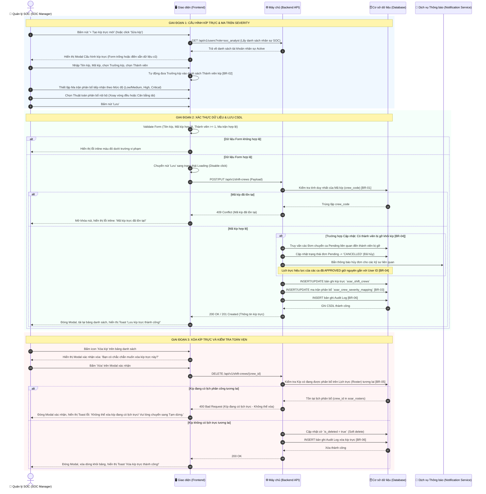

# ĐẶC TẢ YÊU CẦU PHẦN MỀM (SRS)
## TÍNH NĂNG: QUẢN LÝ KÍP TRỰC & MA TRẬN TIẾP NHẬN THEO MỨC ĐỘ NGHIÊM TRỌNG (CREW DEFINITION & SEVERITY MAPPING MANAGEMENT)

---

# 1. THÔNG TIN CHUNG CHỨC NĂNG

| Thuộc tính | Nội dung |
| :--- | :--- |
| **Mã chức năng** | `SOAR_CREW_MGMT_02` |
| **Tên chức năng** | Quản lý Kíp trực & Ma trận tiếp nhận theo mức độ nghiêm trọng (Crew Definition & Severity Mapping Management) |
| **Mô tả tổng quan** | Tính năng này cho phép Quản lý SOC (SOC Manager) và Quản trị viên hệ thống tổ chức đội ngũ kỹ sư an ninh thành các Kíp làm việc tác chiến cố định (như Kíp 1, Kíp 2, Kíp Alpha...); chỉ định nhân sự giữ vai trò Trưởng kíp (Crew Lead / Shift Lead); và cấu hình tập trung Ma trận tiếp nhận Sự việc (Case) theo Mức độ nghiêm trọng (`Low`, `Medium`, `High`, `Critical`) cho từng thành viên trong kíp. Thiết kế này giúp Quy tắc tương quan (Correlation Rule) tự động gán Case chính xác cho kỹ sư có đủ năng lực và chuyên môn trong ca trực một cách minh bạch mà không cần phải cấu hình ma trận phân công phức tạp, rời rạc trên từng Correlation Rule đơn lẻ. Đồng thời, tính năng kiểm soát an toàn dữ liệu khi có biến động nhân sự (xóa thành viên khỏi kíp) và ngăn chặn xóa các kíp đang có lịch trực phân công. |
| **Phạm vi tính năng** | - **Bao gồm:**<br>&nbsp;&nbsp;+ Xem danh sách các Kíp trực với đầy đủ thông tin: Mã kíp, Tên kíp, Trưởng kíp, Số lượng thành viên, Tóm tắt ma trận phân bổ mức độ, Trạng thái (Active/Inactive), Ngày tạo.<br>&nbsp;&nbsp;+ Tìm kiếm theo Tên/Mã kíp và Lọc theo Trạng thái hoạt động.<br>&nbsp;&nbsp;+ Thêm mới Kíp trực: Đặt tên, sinh mã, chỉ định Trưởng kíp, chọn danh sách thành viên và thiết lập Ma trận phân bổ theo Severity.<br>&nbsp;&nbsp;+ Cập nhật Kíp trực: Thay đổi Trưởng kíp, thêm/bớt thành viên, điều chỉnh ma trận phân công và thuật toán điều phối (Xoay vòng đều hoặc Cân bằng tải). Khóa trường Mã kíp khi cập nhật.<br>&nbsp;&nbsp;+ Bật/Tắt nhanh trạng thái hoạt động (Active/Inactive) của Kíp trực.<br>&nbsp;&nbsp;+ Xóa Kíp trực kèm cơ chế kiểm tra ràng buộc toàn vẹn dữ liệu (chặn xóa nếu kíp đang có lịch trực hiện tại hoặc tương lai).<br>&nbsp;&nbsp;+ Cơ chế an toàn khi gỡ thành viên khỏi kíp: Giữ nguyên lịch trực hiệu lực của các đơn chuyển ca đã duyệt (ràng buộc trực tiếp User ID), tự động hủy bỏ các đơn chuyển ca đang ở trạng thái Chờ duyệt (`Pending`) liên quan đến nhân sự bị gỡ.<br>&nbsp;&nbsp;+ Ghi nhận nhật ký kiểm toán (Audit Log) cho toàn bộ các thao tác Thêm, Sửa, Xóa, Bật/Tắt kíp trực.<br>- **Không bao gồm:**<br>&nbsp;&nbsp;+ Phân bổ kíp vào các ngày cụ thể trên Lịch trực (thuộc tính năng Quản lý Lịch phân công `SOAR_ROSTER_SCHED_03`).<br>&nbsp;&nbsp;+ Tạo và phê duyệt đơn xin đổi ca/trực hộ giữa các cá nhân (thuộc tính năng Quản lý Đơn chuyển ca `SOAR_SHIFT_TRANSFER_04`). |
| **Điều kiện trước** | 1. Người dùng đã đăng nhập thành công vào hệ thống SOAR với tài khoản có thẩm quyền Quản lý SOC hoặc Super Admin.<br>2. Danh sách tài khoản người dùng thuộc đội ngũ SOC đã được khởi tạo và đang ở trạng thái hoạt động (`Active`).<br>3. Hệ thống đã thiết lập sẵn danh mục Mức độ nghiêm trọng chuẩn của Case (`Low`, `Medium`, `High`, `Critical`). |
| **Điều kiện sau** | 1. **Khi thêm mới thành công:** Bản ghi Kíp trực mới cùng cấu hình ma trận Severity được lưu vào CSDL, hiển thị trên bảng danh sách, sẵn sàng để phân bổ trên Lịch trực Roster; ghi nhận Audit Log.<br>2. **Khi cập nhật thành công:** Thông tin kíp và ma trận tiếp nhận được cập nhật; thuật toán gán Case tự động sẽ áp dụng ngay danh sách nhân sự mới cho các Case phát sinh trong ca của kíp này; ghi nhận Audit Log.<br>3. **Khi xóa thành công:** Kíp trực bị xóa mềm (`is_deleted = true`), ghi nhận Audit Log.<br>4. **Khi gỡ thành viên khỏi kíp:** Các đơn chuyển ca Pending liên quan bị hủy; hệ thống gửi thông báo cho các bên liên quan; lịch hiệu lực của các ca đã duyệt giữ nguyên. |
| **Ngoại lệ tổng quan** | 1. Xung đột mã kíp: Mã kíp nhập vào bị trùng lặp với kíp đã tồn tại (Hệ thống chặn lưu và báo lỗi theo [BR-01]).<br>2. Vi phạm ràng buộc xóa kíp: Người dùng cố tình xóa kíp đang có lịch trực trong tương lai (Hệ thống từ chối xóa và hiển thị thông báo hướng dẫn chuyển sang Inactive theo [BR-05]).<br>3. Danh sách thành viên rỗng: Người dùng bỏ chọn toàn bộ thành viên (Hệ thống chặn lưu và yêu cầu tối thiểu 1 thành viên theo [BR-02]).<br>4. Mất kết nối CSDL hoặc lỗi mạng: Hiển thị Toast thông báo lỗi hệ thống, form nhập liệu được giữ nguyên trạng thái. |

---

# 2. MA TRẬN PHÂN QUYỀN

Tính năng Quản lý Kíp trực & Ma trận tiếp nhận theo mức độ nghiêm trọng được kiểm soát truy cập và phân định phạm vi thao tác dữ liệu theo cơ chế phân quyền chức năng:

### 2.1. Danh mục quyền chức năng

| Mã quyền | Tên quyền | Mô tả chi tiết |
| :--- | :--- | :--- |
| `CREW_VIEW` | **Xem** | Quyền xem danh sách các kíp trực, thông tin trưởng kíp, danh sách thành viên trong kíp, cấu hình ma trận tiếp nhận cảnh báo (Severity) và trạng thái hoạt động. |
| `CREW_MANAGE` | **Tạo/sửa/xóa** | Quyền toàn quyền cấu hình kíp trực: Tạo kíp trực mới, Chỉnh sửa thông tin kíp trực / phân công trưởng kíp / thành viên / ma trận Severity, Xóa kíp trực và Bật/Tắt trạng thái hoạt động (Active/Inactive). *(Quyền này đã bao gồm quyền Xem).* |

---

### 2.2. Chi tiết phạm vi thao tác và hiển thị giao diện theo quyền hạn

| Quyền hạn | Xem danh sách kíp trực | Nút "+ Tạo kíp trực mới" | Icon Chỉnh sửa kíp (Edit) | Icon Xóa kíp (Delete) | Bật/Tắt trạng thái (Active/Inactive) | Mô tả chi tiết hành vi giao diện & Phạm vi thao tác |
| :--- | :---: | :---: | :---: | :---: | :---: | :--- |
| **Không có quyền** | ❌ | ❌ | ❌ | ❌ | ❌ | • Người dùng không được truy cập vào tính năng Quản lý Kíp trực.<br>• Menu chức năng bị ẩn hoặc hệ thống chuyển hướng sang trang 403 Forbidden nếu cố gắng truy cập trực tiếp bằng URL. |
| **Chỉ có quyền Xem**<br>(`CREW_VIEW`) | ✅ | ❌ | ❌ | ❌ | ❌ (Chỉ xem) | • **Xem danh sách kíp trực:** Người dùng truy cập được màn hình Quản lý kíp trực, xem toàn bộ danh sách các kíp, mã kíp, thông tin Trưởng kíp, số lượng và danh sách thành viên, cấu hình ma trận phân công Severity.<br>• Được sử dụng thanh tìm kiếm và bộ lọc trạng thái (Tất cả, Đang hoạt động, Tạm dừng).<br>• **Ẩn hoàn toàn các nút thao tác:** Không hiển thị nút **"+ Tạo kíp trực mới"**, ẩn icon **Chỉnh sửa kíp** (Edit) và ẩn icon **Xóa kíp** (Delete) trên từng dòng của bảng dữ liệu.<br>• Cột trạng thái hiển thị dưới dạng Badge tĩnh (Read-only), không cho phép click thao tác bật/tắt. |
| **Có quyền Tạo/sửa/xóa**<br>(`CREW_MANAGE`) | ✅ | ✅ | ✅ | ✅ | ✅ | • **Toàn quyền quản trị kíp trực:** Đã bao gồm toàn bộ quyền Xem.<br>• **Hiển thị nút "+ Tạo kíp trực mới":** Cho phép bấm vào để hiển thị modal Tạo kíp trực mới kèm cấu hình ma trận phân công Severity.<br>• **Hiển thị icon Chỉnh sửa kíp (Edit) tại từng dòng:** Bấm vào sẽ mở modal Chỉnh sửa thông tin kíp trực tương ứng.<br>• **Hiển thị icon Xóa kíp (Delete) tại từng dòng:** Bấm vào sẽ hiển thị modal/popup xác nhận Xóa kíp trực (kèm kiểm tra ràng buộc toàn vẹn theo [BR-05]).<br>• **Bật/Tắt trạng thái (Active/Inactive):** Công tắc trên từng dòng được mở quyền click tương tác, cho phép người dùng kích hoạt hoặc tạm dừng kíp trực trực tiếp. |

*Ghi chú ràng buộc kiểm soát truy cập:*
1. Nút **"+ Tạo kíp trực mới"** ở góc phải thanh công cụ chỉ hiển thị đối với tài khoản có quyền **Tạo/sửa/xóa** (`CREW_MANAGE`).
2. Nút/Icon **Chỉnh sửa kíp** (icon bút) và **Xóa kíp** (icon thùng rác) tại cột *Thao tác* trên bảng danh sách chỉ hiển thị đối với tài khoản có quyền **Tạo/sửa/xóa** (`CREW_MANAGE`). Với người dùng chỉ có quyền **Xem**, các icon này bị ẩn hoàn toàn để đảm bảo tính an toàn cho dữ liệu.
3. Công tắc chuyển đổi **Active/Inactive** trên bảng dữ liệu chỉ mở quyền click tương tác cho tài khoản có quyền **Tạo/sửa/xóa**. Với tài khoản chỉ có quyền **Xem**, trạng thái hiển thị dưới dạng Badge tĩnh (chế độ Read-only).
4. Mọi hành động Tạo mới, Chỉnh sửa thông tin/thành viên/ma trận Severity, Xóa hoặc Thay đổi trạng thái kíp trực từ người dùng có quyền `CREW_MANAGE` đều được hệ thống ghi nhận đầy đủ vào Nhật ký kiểm toán (Audit Log) theo [BR-06].

---

# 3. BIỂU ĐỒ LUỒNG XỬ LÝ

### 3.1. Sơ đồ tuần tự: Thêm mới / Cập nhật Kíp trực và Xử lý Biến động Thành viên (Sequence Diagram)



### 3.2. Mô tả chi tiết logic các bước trong luồng xử lý:
1. **Bước 1-8 (Khởi tạo form & Cấu hình):** Quản lý SOC bấm "+ Tạo kíp trực mới" hoặc "Sửa kíp". Frontend gọi API lấy danh mục nhân sự SOC đang hoạt động để nạp vào các Dropdown. Khi Quản lý chọn một nhân sự làm Trưởng kíp, Frontend tự động thêm nhân sự này vào danh sách Thành viên kíp nếu chưa có (`[BR-02]`). Quản lý tiếp tục cấu hình Ma trận tiếp nhận theo mức độ nghiêm trọng và chọn thuật toán phân bổ nội bộ.
2. **Bước 9-13 (Validate Form tại Client):** Quản lý bấm "Lưu". Frontend kiểm tra các điều kiện bắt buộc: Tên kíp không được rỗng, Mã kíp đúng định dạng in hoa không dấu, Số lượng thành viên tối thiểu 1 người, và mỗi mức độ nghiêm trọng phải có ít nhất 1 thành viên tiếp nhận. Nếu có lỗi, hiển thị inline error message màu đỏ và cuộn đến vị trí lỗi.
3. **Bước 14-22 (Backend kiểm tra trùng mã & Xử lý biến động thành viên):**
   - Backend tiếp nhận payload, kiểm tra trùng lặp `crew_code` trong bảng `soar_shift_crews` (`[BR-01]`). Nếu trùng, trả về mã lỗi `409 Conflict`.
   - Nếu là luồng Cập nhật và phát hiện có thành viên bị gỡ khỏi kíp: Backend tự động quét và hủy toàn bộ các Đơn chuyển ca đang ở trạng thái `Pending` liên quan đến thành viên này (`[BR-04]`), đồng thời kích hoạt thông báo qua Notification Service. Các ca trực đã được duyệt trong tương lai (`Approved`) vẫn giữ nguyên trên Lịch trực hiệu lực (gắn chặt với `user_id` của kỹ sư đó).
   - Lưu thông tin kíp vào bảng `soar_shift_crews`, lưu ma trận phân bổ vào `soar_crew_severity_mapping` (`[BR-03]`) và ghi nhật ký kiểm toán vào `soar_audit_logs` (`[BR-06]`).
4. **Bước 23-25 (Phản hồi thành công):** Backend trả về mã `200 OK` hoặc `201 Created`. Frontend đóng modal, làm mới bảng danh sách và hiển thị Toast thông báo thành công.
5. **Bước 26-34 (Kiểm tra ràng buộc khi Xóa kíp trực):** Khi bấm xóa kíp, Backend truy vấn bảng `soar_rosters` (`[BR-05]`). Nếu kíp này đang được phân công trực từ thời điểm hiện tại trở về tương lai, hệ thống từ chối xóa và trả về mã lỗi `400 Bad Request`. Nếu không vướng lịch tương lai, hệ thống thực hiện Soft delete và ghi Audit Log.

---

# 4. THIẾT KẾ GIAO DIỆN & ĐẶC TẢ CHI TIẾT UI COMPONENTS

### 4.1. Màn hình Danh sách Kíp trực (`/settings/shifts/crews`)

Toàn bộ các thành phần hiển thị, tìm kiếm, lọc và bảng dữ liệu trên màn hình quản lý kíp trực được đặc tả chi tiết trong bảng dưới đây:

| STT | Tên trường | Loại dữ liệu | Mô tả |
| :---: | :--- | :--- | :--- |
| 1 | **Tiêu đề trang** | Label | - Tiêu đề màn hình, hiển thị tên phân hệ Quản lý Kíp trực.<br>- **Nội dung hiển thị mặc định:** `"Quản lý Kíp trực & Phân bổ Case"` (`"Crew & Severity Assignment Management"`)<br>- **Tính chất hiển thị:** Tĩnh (Static). |
| 2 | **Mô tả phụ** | Label | - Đoạn văn bản ngắn hướng dẫn vai trò của kíp trực và ma trận tiếp nhận Case.<br>- **Nội dung hiển thị mặc định:** `"Thiết lập các nhóm tác chiến cố định, chỉ định Trưởng kíp và định nghĩa ma trận tiếp nhận Sự việc theo Mức độ nghiêm trọng cho từng kỹ sư trong kíp."`<br>- **Tính chất hiển thị:** Tĩnh. |
| 3 | **Nút "+ Tạo kíp trực mới"** | Button | - Cho phép Quản lý SOC mở Modal tạo mới một kíp trực.<br>- **Trạng thái mặc định:** Enabled.<br>- **Quyền hạn truy cập:** Chỉ hiển thị và cho phép thao tác đối với vai trò *Super Admin* và *SOC Manager* (theo Mục 2).<br>- **Hành vi khi nhấn (OnClick):** Mở Modal "Tạo kíp trực mới" với form nhập liệu trống. |
| 4 | **Thanh tìm kiếm kíp trực** | Searchbox | - Cho phép người dùng nhập từ khóa để tìm kiếm nhanh kíp theo Tên hoặc Mã kíp.<br>- **Placeholder:**<br>&nbsp;&nbsp;+ VI: `Tìm kiếm theo tên hoặc mã kíp trực...`<br>&nbsp;&nbsp;+ EN: `Search by crew name or code...`<br>- **Giá trị mặc định:** Trống.<br>- **Giới hạn ký tự:** Tối đa 100 ký tự.<br>- **Quy tắc Nghiệp vụ:** Tự động trim khoảng trắng ở đầu/cuối chuỗi. Debounce 300ms tự động lọc dữ liệu trên bảng mà không cần nhấn phím Enter. Hỗ trợ icon "x" ở góc phải để xóa nhanh nội dung tìm kiếm. |
| 5 | **Bộ lọc Trạng thái kíp** | Combobox | - Cho phép người dùng lọc danh sách kíp theo trạng thái hoạt động.<br>- **Nguồn dữ liệu cố định:**<br>&nbsp;&nbsp;+ `Tất cả trạng thái` (`ALL`) - Mặc định<br>&nbsp;&nbsp;+ `Đang hoạt động` (`ACTIVE`)<br>&nbsp;&nbsp;+ `Tạm dừng` (`INACTIVE`)<br>- **Chức năng tìm kiếm:** Không.<br>- **Quy tắc Nghiệp vụ:** Lập tức cập nhật lại danh sách trên bảng dữ liệu khi thay đổi lựa chọn. |
| 6 | **Bảng danh sách kíp trực** | Datatable | - Hiển thị danh sách các kíp trực đang có trong hệ thống dưới dạng bảng dữ liệu.<br>- **Các chức năng chung bổ trợ:**<br>&nbsp;&nbsp;+ Cuộn ngang (Horizontal Scroll): Nếu độ dài bảng dữ liệu vượt quá độ dài màn hình hiển thị, tự động hiển thị thanh cuộn ngang (`overflow-x: auto`) với `min-width` phù hợp để xem trọn vẹn toàn bộ dữ liệu.<br>&nbsp;&nbsp;+ Phân trang (Pagination): Hỗ trợ các mốc 10, 25, 50 bản ghi/trang. Mặc định 10 bản ghi/trang.<br>&nbsp;&nbsp;+ Sắp xếp (Sorting): Cho phép sắp xếp theo Header các cột `Mã kíp`, `Tên kíp`, `Số thành viên`, `Ngày tạo`.<br>- **Đặc tả chi tiết các cột dữ liệu:**<br>&nbsp;&nbsp;• **Cột Mã kíp (Crew Code):** Hiển thị mã định danh in hoa của kíp (ví dụ: `CREW_01`, `CREW_ALPHA`). Dạng chữ in đậm, font monospace.<br>&nbsp;&nbsp;• **Cột Tên kíp (Crew Name):** Hiển thị tên gọi của kíp (ví dụ: `Kíp Trực Tác Chiến 1`).<br>&nbsp;&nbsp;• **Cột Trưởng kíp (Crew Lead):** Hiển thị `username` ở dòng trên, `Họ và tên` ở dòng dưới (ví dụ: dòng trên `tunglv`, dòng dưới `Lê Văn Tùng`), không hiển thị icon dấu sao.<br>&nbsp;&nbsp;• **Cột Số thành viên:** Hiển thị Badge đếm số lượng nhân sự trong kíp (ví dụ: `5 thành viên`). Khi hover chuột vào Badge, hiển thị Tooltip danh sách họ tên của toàn bộ thành viên trong kíp.<br>&nbsp;&nbsp;*(Tạm thời ẩn/bỏ cột Ma trận Severity khỏi bảng danh sách theo yêu cầu tối ưu hóa không gian hiển thị).*<br>&nbsp;&nbsp;• **Cột Thuật toán điều phối sự việc:** Đổi tên cột thành `"Thuật toán điều phối sự việc"`. Hiển thị nhãn thuật toán: `Xoay vòng` (nếu là Round-Robin) hoặc `Cân bằng tải`.<br>&nbsp;&nbsp;• **Cột Trạng thái (Status Toggle):** Cho phép bật/tắt nhanh trạng thái hoạt động của kíp trực. Giá trị mặc định lấy theo trạng thái thực tế của bản ghi. Khi chuyển đổi, hiển thị spinner xoay tròn nhỏ; gọi API cập nhật. Nếu thành công hiển thị Toast thông báo; nếu thất bại rollback trạng thái switch và báo lỗi.<br>&nbsp;&nbsp;• **Cột Thao tác (Actions):** Chứa các nút chức năng:<br>&nbsp;&nbsp;&nbsp;&nbsp;- *Icon Chỉnh sửa (Edit):* Mở Modal "Cập nhật kíp trực", điền sẵn toàn bộ dữ liệu hiện tại lên form.<br>&nbsp;&nbsp;&nbsp;&nbsp;- *Icon Xóa kíp (Delete):* Mở Hộp thoại xác nhận xóa kíp (Xem mục 4.3). Bị vô hiệu hóa (disabled) kèm Tooltip cảnh báo nếu kíp đang có lịch trực phân công theo `[BR-05]`. |

---

### 4.2. Modal Thêm mới / Cập nhật Kíp trực & Ma trận tiếp nhận

Modal dạng Pop-up lớn (Large Modal / Drawer) chia làm 3 nhóm khối thông tin rõ ràng:

| STT | Tên trường | Loại dữ liệu | Mô tả |
| :---: | :--- | :--- | :--- |
| **THÔNG TIN ĐỊNH DANH KÍP TRỰC** | | | |
| 1 | **Tiêu đề Modal** | Label | - Tiêu đề của Pop-up.<br>- **Nội dung hiển thị:**<br>&nbsp;&nbsp;+ Khi tạo mới: `"Tạo kíp trực tác chiến mới"` (`"Create New Shift Crew"`)<br>&nbsp;&nbsp;+ Khi cập nhật: `"Cấu hình kíp trực: {crew_name}"` (`"Configure Shift Crew: {crew_name}"`)<br>- **Tính chất hiển thị:** Động. |
| 2 | **Tên kíp trực** | Textbox | - Người dùng bắt buộc nhập tên định danh của kíp trực.<br>- **Placeholder:**<br>&nbsp;&nbsp;+ VI: `Nhập tên kíp trực (ví dụ: Kíp Trực Tác Chiến 1, Kíp Alpha)...`<br>&nbsp;&nbsp;+ EN: `Enter crew name (e.g., Tactical Crew 1, Alpha Crew)...`<br>- **Giá trị mặc định:** Trống.<br>- **Giới hạn ký tự:** Tối đa 100 ký tự. Hệ thống tự động chặn gõ khi vượt quá 100 ký tự.<br>- **Kiểu ký tự hợp lệ:** Tất cả ký tự chữ, số và ký tự đặc biệt thông dụng.<br>- **Quy tắc Nghiệp vụ:** Tự động trim khoảng trắng ở đầu và cuối chuỗi trước khi lưu.<br>- **Thông báo lỗi tương ứng:**<br>&nbsp;&nbsp;+ Trống và nhấn nút Lưu: Hiển thị lỗi inline màu đỏ: `"Tên kíp trực là bắt buộc!"` (`"Crew name is required!"`) |
| 3 | **Mã kíp trực** | Textbox | - Người dùng bắt buộc nhập mã định danh duy nhất cho kíp trực trên toàn hệ thống.<br>- **Placeholder:**<br>&nbsp;&nbsp;+ VI: `Nhập mã kíp trực (ví dụ: CREW_01, CREW_ALPHA)...`<br>&nbsp;&nbsp;+ EN: `Enter crew code (e.g., CREW_01, CREW_ALPHA)...`<br>- **Giá trị mặc định:** Trống.<br>- **Giới hạn ký tự:** Tối đa 30 ký tự.<br>- **Kiểu ký tự hợp lệ:** Chỉ cho phép chữ cái tiếng Anh in hoa (`A-Z`), số (`0-9`) và dấu gạch dưới (`_`). Tự động viết hoa khi gõ.<br>- **Quy tắc Nghiệp vụ:**<br>&nbsp;&nbsp;1. Khi ở chế độ Cập nhật: Trường này bị khóa hoàn toàn (Disabled / Read-only).<br>&nbsp;&nbsp;2. Mã kíp phải là duy nhất trên toàn hệ thống, không phân biệt hoa/thường (Xem chi tiết tại `[BR-01]`).<br>- **Thông báo lỗi tương ứng:**<br>&nbsp;&nbsp;+ Trống và nhấn nút Lưu: Hiển thị lỗi inline màu đỏ: `"Mã kíp trực là bắt buộc!"` (`"Crew code is required!"`)<br>&nbsp;&nbsp;+ Chứa ký tự không hợp lệ: Hiển thị lỗi inline màu đỏ: `"Mã kíp chỉ được chứa chữ hoa không dấu, số và dấu gạch dưới!"` (`"Crew code only allows uppercase letters, numbers, and underscores!"`)<br>&nbsp;&nbsp;+ Trùng lặp: Hiển thị lỗi inline màu đỏ: `"Mã kíp trực đã tồn tại trên hệ thống!"` (`"Crew code already exists!"`) |
| 4 | **Trạng thái** | Toggle Switch | - Nhãn hiển thị: `"Trạng thái"`.<br>- Cho phép thiết lập trạng thái hoạt động của kíp (Chỉ kíp "Hoạt động" mới được phân bổ lịch trực Roster).<br>- **Giá trị mặc định:** Bật (`Active`).<br>- **Hành vi hiển thị:** Kèm nhãn `"Đang hoạt động"` khi bật, hoặc `"Tạm dừng"` khi tắt. |
| **TỔ CHỨC NHÂN SỰ TRONG KÍP TRỰC** | | | |
| 5 | **Trưởng kíp** | Combobox | - Nhãn hiển thị: `"Trưởng kíp"`.<br>- Người dùng bắt buộc chọn 01 nhân sự giữ vai trò Trưởng kíp.<br>- **Giá trị hiển thị trong ô combobox:** Định dạng `username (Họ và tên)`, ví dụ: `hoangnv1 (Nguyễn Văn Hoàng)`.<br>- **Placeholder:** `Chọn Trưởng kíp...`<br>- **Nguồn dữ liệu:** Danh sách tất cả tài khoản kỹ sư/chuyên viên SOC đang ở trạng thái `Active`.<br>- **Chức năng tìm kiếm:** Có (Searchable theo username hoặc họ tên).<br>- **Quy tắc Nghiệp vụ:** Tự động bổ sung nhân sự này vào danh sách Thành viên kíp nếu chưa có.<br>- **Thông báo lỗi tương ứng:** Trống và nhấn nút Lưu: Hiển thị lỗi inline: `"Vui lòng chỉ định Trưởng kíp!"` |
| 6 | **Thành viên trong kíp** | Multi-select Tag | - Người dùng chọn danh sách các nhân sự SOC tham gia làm việc trong kíp.<br>- **Định dạng hiển thị của mỗi thẻ tag:** Hiển thị thông tin dạng `username (Họ và tên)`, không hiển thị avatar tròn (ví dụ: `hoangnv1 (Nguyễn Văn Hoàng)`). Kèm icon "x" để gỡ thành viên.<br>- *Lưu ý giao diện:* Đã bỏ nút "Chọn tất cả" và nút "Chỉ giữ trưởng kíp".<br>- **Nguồn dữ liệu:** Danh sách toàn bộ nhân sự SOC đang hoạt động trong hệ thống.<br>- **Quy tắc Nghiệp vụ & Ràng buộc:**<br>&nbsp;&nbsp;1. Bắt buộc có tối thiểu **01 thành viên** trong kíp.<br>&nbsp;&nbsp;2. Không cho phép xóa Trưởng kíp khỏi danh sách thành viên (icon "x" của Trưởng kíp bị ẩn).<br>&nbsp;&nbsp;3. Danh sách thành viên được chọn ở đây là nguồn nhân sự cung cấp cho Ma trận tiếp nhận sự việc theo Mức độ nghiêm trọng.<br>- **Thông báo lỗi tương ứng:** Không có thành viên nào: Hiển thị lỗi inline: `"Kíp trực phải có ít nhất 01 thành viên!"` |
| **MA TRẬN TIẾP NHẬN SỰ VIỆC THEO MỨC ĐỘ NGHIÊM TRỌNG** | | | |
| 7 | **Mức Thấp & Trung bình (Low & Medium)** | Checkbox + Selection Grid | - Cơ chế cấu hình phân công đồng nhất cho cả 3 mức nghiêm trọng.<br>- **Tùy chọn nhanh:** Checkbox `"[x] Tất cả thành viên trong kíp"`.<br>- **Cơ chế chọn thành viên:** Mặc định hiển thị danh sách tất cả các thành viên trong kíp kèm checkbox/tag chọn để người dùng linh hoạt đánh dấu phân công cho thành viên đó.<br>- *Lưu ý:* Đã bỏ nhãn phụ "(Tier 1 SOC)".<br>- **Ràng buộc:** Bắt buộc có ít nhất 01 thành viên được phân công. |
| 8 | **Mức Cao (High)** | Checkbox + Selection Grid | - Cơ chế cấu hình phân công đồng nhất cho cả 3 mức nghiêm trọng.<br>- **Tùy chọn nhanh:** Checkbox `"[x] Tất cả thành viên trong kíp"`.<br>- **Cơ chế chọn thành viên:** Mặc định hiển thị danh sách tất cả các thành viên trong kíp kèm checkbox/tag chọn để đánh dấu phân công cho thành viên tiếp nhận mức Cao.<br>- *Lưu ý:* Đã bỏ nhãn phụ "(Chuyên viên Tier 2 / Senior)".<br>- **Ràng buộc:** Bắt buộc có ít nhất 01 thành viên được phân công. |
| 9 | **Mức Nghiêm trọng (Critical)** | Checkbox + Selection Grid | - Cơ chế cấu hình phân công đồng nhất cho cả 3 mức nghiêm trọng.<br>- **Tùy chọn nhanh:** Checkbox `"[x] Tất cả thành viên trong kíp"`.<br>- **Cơ chế chọn thành viên:** Mặc định hiển thị danh sách tất cả các thành viên trong kíp kèm checkbox/tag chọn để đánh dấu phân công cho thành viên tiếp nhận mức Nghiêm trọng.<br>- *Lưu ý:* Đã bỏ nhãn phụ "(Trưởng kíp / Incident Responder)".<br>- **Ràng buộc:** Bắt buộc có ít nhất 01 thành viên được phân công. |
| 10 | **Thuật toán điều phối sự việc** | Radio Button | - Nhãn hiển thị: `"Thuật toán điều phối sự việc:"`<br>- Cho phép chọn thuật toán phân phối Case tự động giữa các nhân sự trong kíp.<br>- **Danh sách tùy chọn:**<br>&nbsp;&nbsp;+ Tùy chọn 1: `"Xoay vòng đều"` (Giá trị: `ROUND_ROBIN` - Mặc định).<br>&nbsp;&nbsp;+ Tùy chọn 2: `"Cân bằng tải"` (Giá trị: `LEAST_LOAD` - Tự động gán cho nhân sự đang có ít Case mở nhất).<br>- **Quy tắc Nghiệp vụ:** Xem chi tiết thuật toán tại `[BR-03]`. |
| **NÚT BẤM HÀNH ĐỘNG** | | | |
| 11 | **Nút "Hủy bỏ" (Cancel)** | Button | - Cho phép người dùng đóng Modal và hủy bỏ thao tác.<br>- **Trạng thái mặc định:** Enabled.<br>- **Hành vi khi nhấn (OnClick):** Nếu form đã có chỉnh sửa dữ liệu, hiển thị Hộp thoại cảnh báo dữ liệu chưa lưu (Xem mục 4.3). Nếu chưa chỉnh sửa, đóng Modal ngay. |
| 12 | **Nút "Lưu" (Save)** | Button | - Nhãn nút hiển thị: `"Lưu"`.<br>- Cho phép người dùng gửi thông tin để lưu kíp trực vào hệ thống.<br>- **Trạng thái mặc định:** Enabled.<br>- **Quyền hạn truy cập:** Chỉ vai trò *Super Admin* và *SOC Manager*.<br>- **Hành vi khi nhấn (OnClick):**<br>&nbsp;&nbsp;1. Kiểm tra tính hợp lệ toàn bộ các trường trên form.<br>&nbsp;&nbsp;2. Nếu hợp lệ: Gửi payload lên Backend để lưu bản ghi kíp trực và ma trận tiếp nhận sự việc.<br>&nbsp;&nbsp;3. Nếu thành công: Đóng Modal, làm mới danh sách kíp trực, hiển thị Toast: `"Lưu kíp trực thành công!"`. |

---

### 4.3. Quy tắc đặc tả các Hộp thoại xác nhận (Confirmation Modals)

#### 4.3.1. Hộp thoại xác nhận xóa kíp trực
- **Tên Modal:** Hộp thoại xác nhận xóa kíp trực.
- **Tiêu đề (Header):** `"Xác nhận xóa kíp trực"` (`"Confirm crew deletion"`)
- **Nội dung thông báo (Body text):** `"Bạn có chắc chắn muốn xóa kíp trực [Tên kíp trực] không? Hành động này sẽ loại bỏ kíp khỏi danh sách cấu hình. Lưu ý: Không thể xóa kíp nếu đang có lịch phân công trực trong tương lai."` (`"Are you sure you want to delete shift crew [Crew Name]? This action cannot be undone."`)
- **Nút Xác nhận xóa (Confirm Button):**
  - Nhãn nút: `"Xóa kíp trực"` (`"Delete Crew"`)
  - Màu sắc: Đỏ cảnh báo (Danger).
  - Hành vi khi nhấn: Nút chuyển sang trạng thái Loading, gọi API `DELETE /api/v1/shift-crews/{crew_id}`. Nếu thành công, đóng hộp thoại, cập nhật bảng danh sách và hiển thị Toast `"Đã xóa kíp trực thành công!"`. Nếu vi phạm ràng buộc lịch trực theo `[BR-05]`, đóng hộp thoại và hiển thị Toast lỗi từ chối.
- **Nút Hủy (Cancel Button):**
  - Nhãn nút: `"Hủy bỏ"` (`"Cancel"`) hoặc click icon "x".
  - Hành vi khi nhấn: Đóng hộp thoại xác nhận, không thực hiện hành động xóa.
- **Hành vi khi click vùng ngoài Modal:** Không đóng hộp thoại.

#### 4.3.2. Hộp thoại cảnh báo khi gỡ thành viên khỏi kíp trực (Edge-case Modal)
- **Tên Modal:** Cảnh báo thay đổi nhân sự kíp trực.
- **Tiêu đề (Header):** `"Xác nhận thay đổi thành viên kíp trực"` (`"Confirm crew membership changes"`)
- **Nội dung thông báo (Body text):** `"Bạn đang gỡ nhân sự [Tên nhân sự bị gỡ] ra khỏi kíp trực này. Hệ thống sẽ tự động HỦY BỎ toàn bộ các Đơn chuyển ca đang chờ duyệt liên quan đến nhân sự này. Các ca trực đã được phê duyệt trong tương lai vẫn được giữ nguyên trách nhiệm cho nhân sự đó. Bạn có chắc chắn muốn tiếp tục?"`
- **Nút Đồng ý tiếp tục (Confirm Button):**
  - Nhãn nút: `"Đồng ý & Lưu"` (`"Confirm & Save"`)
  - Hành vi khi nhấn: Đóng modal cảnh báo, tiến hành lưu kíp trực lên Backend, kích hoạt luồng hủy đơn pending theo `[BR-04]`.
- **Nút Xem lại (Cancel Button):**
  - Nhãn nút: `"Kiểm tra lại"` (`"Review changes"`)
  - Hành vi khi nhấn: Đóng modal cảnh báo, giữ nguyên Modal chỉnh sửa kíp để Quản lý kiểm tra lại thành viên.

#### 4.3.3. Hộp thoại cảnh báo dữ liệu chưa lưu khi thoát form
- **Tên Modal:** Cảnh báo dữ liệu chưa được lưu.
- **Tiêu đề (Header):** `"Thông tin chưa được lưu"` (`"Unsaved changes"`)
- **Nội dung thông báo (Body text):** `"Các thông tin kíp trực bạn vừa nhập chưa được lưu lại. Bạn có chắc chắn muốn thoát và hủy bỏ các thay đổi này không?"`
- **Nút Xác nhận thoát (Confirm Button):** Nhãn `"Thoát không lưu"` (`"Exit without saving"`). Đóng toàn bộ modal và hủy thay đổi.
- **Nút Giữ lại chỉnh sửa (Cancel Button):** Nhãn `"Tiếp tục chỉnh sửa"` (`"Keep editing"`). Tiếp tục ở lại form.

---

### 4.4. Đặc tả các trạng thái màn hình bổ trợ (Screen States)

#### 4.4.1. Trạng thái trống (Empty State)
- **Điều kiện kích hoạt:** Khi hệ thống chưa từng có kíp trực nào được tạo hoặc khi kết quả tìm kiếm/lọc trả về 0 bản ghi.
- **Trường hợp 1: Chưa có kíp trực nào trong hệ thống:**
  - Hình ảnh minh họa: Icon minh họa nhóm tác chiến rỗng (Team/Users icon).
  - Tiêu đề: `"Chưa có kíp trực nào được tạo"` (`"No shift crews yet"`)
  - Mô tả phụ: `"Tổ chức đội ngũ kỹ sư SOC thành các kíp trực cố định và phân vai tiếp nhận Case theo Mức độ nghiêm trọng để tối ưu hóa vận hành."`
  - Nút hành động (CTA Button): Nút `"+ Tạo kíp trực đầu tiên"` (`"+ Add First Crew"`) - Click mở Modal tạo mới kíp.
- **Trường hợp 2: Tìm kiếm / Lọc không có kết quả:**
  - Hình ảnh minh họa: Icon kính lúp không tìm thấy dữ liệu.
  - Tiêu đề: `"Không tìm thấy kíp trực phù hợp"` (`"No matching crews found"`)
  - Mô tả phụ: `"Không tìm thấy kíp trực nào khớp với từ khóa hoặc bộ lọc đã chọn."`
  - Nút hành động: Nút `"Xóa bộ lọc"` (`"Clear Filters"`).

#### 4.4.2. Trạng thái lỗi tải dữ liệu (Error / Offline State)
- **Điều kiện kích hoạt:** Khi API máy chủ trả về mã lỗi 5xx hoặc mất kết nối mạng.
- **Nội dung hiển thị:** `"Không thể tải danh sách kíp trực do lỗi kết nối máy chủ. Vui lòng kiểm tra lại đường truyền mạng hoặc thử lại sau."`
- **Nút hành động:** Nút `"Tải lại trang"` (`"Retry"`).

---

# 5. QUY TẮC NGHIỆP VỤ CHUYÊN SÂU (BUSINESS RULES)

### Bảng tổng hợp quy tắc nghiệp vụ:

| Mã BR | Tên quy tắc nghiệp vụ | Phân loại | Mức độ ưu tiên |
| :---: | :--- | :--- | :---: |
| **[BR-01]** | Quy tắc kiểm tra tính duy nhất và chuẩn hóa Mã kíp trực | Ràng buộc dữ liệu & Thuật toán | Bắt buộc |
| **[BR-02]** | Quy tắc ràng buộc về Trưởng kíp và Danh sách thành viên | Ràng buộc dữ liệu & Thuật toán | Bắt buộc |
| **[BR-03]** | Ma trận tiếp nhận sự việc theo Mức độ nghiêm trọng và Thuật toán điều phối sự việc | Thuật toán & Phân công | Bắt buộc |
| **[BR-04]** | Quy tắc xử lý An toàn dữ liệu khi Thay đổi / Xóa thành viên trong kíp | Quy trình & Trạng thái | Bắt buộc |
| **[BR-05]** | Ràng buộc toàn vẹn dữ liệu khi Xóa Kíp trực | Quy trình & Trạng thái | Bắt buộc |
| **[BR-06]** | Quy chuẩn ghi nhận Nhật ký kiểm toán (Audit Logging) | Bảo mật & Lưu trữ | Bắt buộc |

---

### Chi tiết từng quy tắc:

### [BR-01] Quy tắc kiểm tra tính duy nhất và chuẩn hóa Mã kíp trực
- **Phân loại:** Ràng buộc dữ liệu & Thuật toán
- **Phạm vi áp dụng:** Toàn bộ hệ thống SOAR (UI và Backend API `POST /api/v1/shift-crews`).
- **Điều kiện kích hoạt:** Khi người dùng bấm nút `Lưu kíp trực` trên Modal.
- **Logic xử lý chi tiết:**
  1. Frontend và Backend tự động trim khoảng trắng ở đầu và cuối chuỗi của trường `crew_code`.
  2. Chuẩn hóa chuỗi về dạng chữ in hoa (Uppercase). Thay thế khoảng trắng bằng dấu gạch dưới `_`.
  3. Kiểm tra tính duy nhất: Truy vấn bảng `soar_shift_crews` với điều kiện `UPPER(crew_code) = UPPER(:input_code)` và `is_deleted = false`.
  4. Nếu tìm thấy bản ghi trùng lặp, hệ thống coi là vi phạm (Ví dụ: Đã có `CREW_ALPHA` thì `crew_alpha`, `Crew_Alpha` đều bị coi là trùng lặp).
  5. Khi ở chế độ Cập nhật (`PUT /api/v1/shift-crews/{id}`), trường `crew_code` bị khóa cố định không cho phép thay đổi giá trị.
- **Hành vi khi vi phạm:**
  - Backend hủy bỏ transaction, trả về mã lỗi HTTP `409 Conflict` kèm thông báo: `Crew code already exists: [crew_code]`.
  - Trên giao diện: Hiển thị lỗi inline màu đỏ ngay dưới trường Mã kíp trực: `"Mã kíp trực đã tồn tại trên hệ thống!"` (`"Crew code already exists!"`).

---

### [BR-02] Quy tắc ràng buộc về Trưởng kíp và Danh sách thành viên
- **Phân loại:** Ràng buộc dữ liệu & Thuật toán
- **Phạm vi áp dụng:** Màn hình cấu hình kíp trực và Logic phân vai ca trực.
- **Điều kiện kích hoạt:** Khi người dùng chọn Trưởng kíp, thêm/bớt thành viên hoặc bấm Lưu.
- **Logic xử lý chi tiết:**
  1. **Số lượng thành viên tối thiểu:** Mỗi kíp trực bắt buộc phải có ít nhất **01 thành viên** (`count(members) >= 1`). Không cho phép tạo hoặc lưu kíp không có thành viên.
  2. **Ràng buộc Trưởng kíp là thành viên:**
     - Người được chọn làm Trưởng kíp (`crew_lead_id`) **bắt buộc phải là một thành viên** trong danh sách thành viên của kíp (`crew_lead_id in crew_members`).
     - Khi người dùng chọn Trưởng kíp từ Dropdown, Frontend tự động kiểm tra: nếu tài khoản này chưa có trong danh sách Thành viên kíp, hệ thống tự động thêm vào danh sách.
     - Người dùng không thể xóa thẻ Tag của Trưởng kíp trong danh sách thành viên (icon xóa bị ẩn). Nếu muốn xóa, người dùng phải đổi sang Trưởng kíp khác trước.
  3. **Quy định về vai trò Trưởng ca (Shift Lead):** Khi kíp này được phân công vào bất kỳ ca làm việc nào trên Lịch trực, Trưởng kíp sẽ tự động giữ vai trò Trưởng ca (Shift Lead) của ca đó, chịu trách nhiệm phê duyệt đổi ca và nhận các Case leo thang Mức 2.

---

### [BR-03] Ma trận tiếp nhận sự việc theo Mức độ nghiêm trọng và Thuật toán điều phối sự việc
- **Phân loại:** Thuật toán & Phân công
- **Phạm vi áp dụng:** Engine Phân công Tự động (Auto-Assignment Engine) khi Correlation Rule chọn chiến lược "Phân công theo Ca/Kíp trực".
- **Điều kiện kích hoạt:** Khi một Case mới được tạo tại thời điểm $T$ và xác định được Kíp $K$ đang trong ca trực hiệu lực.
- **Logic xử lý chi tiết:**
  1. **Tra cứu nhân sự tiếp nhận theo Mức độ nghiêm trọng của Case:**
     - Nếu Case có mức độ `Low` hoặc `Medium`: Hệ thống lấy danh sách nhân sự được cấu hình cho mức Low/Med (nếu chọn *"Tất cả thành viên trong kíp"*, danh sách bao gồm toàn bộ kỹ sư trong kíp $K$).
     - Nếu Case có mức độ `High`: Hệ thống lấy danh sách nhân sự Senior/Tier 2 được chỉ định riêng cho mức High của kíp $K$.
     - Nếu Case có mức độ `Critical`: Hệ thống lấy danh sách nhân sự được chỉ định cho mức Critical (mặc định là Trưởng kíp).
  2. **Thuật toán điều phối nội bộ (Internal Dispatch Algorithm):**
     - Giả sử danh sách nhân sự tiếp nhận hợp lệ cho mức đó là $S = \{U_1, U_2, ..., U_m\}$:
     - **Chế độ 1: Xoay vòng đều:**
       * Hệ thống lấy con trỏ xoay vòng gần nhất của kíp $K$ đối với mức nghiêm trọng đó ($last\_assigned\_index$).
       * Gán Case cho nhân sự tiếp theo: $U_{(last\_assigned\_index + 1) \pmod m}$.
       * Cập nhật lại con trỏ xoay vòng trong Redis cache.
     - **Chế độ 2: Cân bằng tải:**
       * Hệ thống đếm số lượng Case đang ở trạng thái chưa đóng (`New`, `Processing`) của từng nhân sự trong danh sách $S$.
       * Gán Case cho kỹ sư có số lượng Case đang mở ít nhất:
         $$\text{Assignee} = \arg\min_{u \in S} (\text{OpenCases}(u))$$
       * Nếu có nhiều kỹ sư cùng có số Case mở bằng nhau, ưu tiên người có thời điểm nhận Case gần nhất xa nhất (Least Recently Assigned).

---

### [BR-04] Quy tắc xử lý An toàn dữ liệu khi Thay đổi / Xóa thành viên trong kíp
- **Phân loại:** Quy trình & Trạng thái (Edge-case Handling)
- **Phạm vi áp dụng:** Thao tác Cập nhật Kíp trực khi danh sách thành viên mới bị giảm bớt so với danh sách cũ.
- **Điều kiện kích hoạt:** Khi Quản lý SOC bấm `Lưu kíp trực` và phát hiện có ít nhất 01 kỹ sư bị gỡ khỏi kíp.
- **Logic xử lý chi tiết:**
  1. Giả sử Kỹ sư $B$ bị gỡ khỏi Kíp 1. Backend sẽ kiểm tra toàn bộ dữ liệu liên quan đến $B$ trong tương lai:
  2. **Xử lý Đơn chuyển ca đang Chờ duyệt (Pending Transfers):**
     - Tất cả các đơn chuyển ca mà Kỹ sư $B$ là Người nhờ trực (A) HOẶC Người được nhờ trực hộ (B) đang ở trạng thái `Pending Acceptance` hoặc `Pending Approval` sẽ **tự động bị HỦY** (`status = CANCELLED`).
     - Hệ thống ghi nhận lý do hủy tự động: `"Đơn bị hủy do nhân sự [Tên kỹ sư] không còn hoạt động trong kíp trực."`
     - Gửi thông báo (In-app + Email) cho các bên liên quan để thông báo về việc đơn bị hủy.
  3. **Xử lý Lịch trực hiệu lực của các ca ĐÃ DUYỆT (Approved Transfers):**
     - Đơn chuyển ca sau khi đã được phê duyệt sẽ **khóa trực tiếp vào User ID của Kỹ sư $B$** trên Lịch trực hiệu lực (`soar_effective_schedules`).
     - Việc $B$ bị gỡ khỏi Kíp 1 **KHÔNG làm hủy bỏ các ca trực mà $B$ đã cam kết trực thay**. Kỹ sư $B$ vẫn có trách nhiệm trực các ca đã duyệt đó.
  4. **Xử lý nếu Kỹ sư bị Khóa hoặc Xóa tài khoản vĩnh viễn:**
     - Nếu Kỹ sư $B$ bị khóa tài khoản hoặc xóa khỏi hệ thống: Hệ thống tự động gắn cờ cảnh báo đỏ `[⚠️ Nhân sự bị vô hiệu hóa]` trên Lịch trực của ca đó và bắn thông báo khẩn cấp cho Quản lý SOC để phân công người thay thế.

---

### [BR-05] Ràng buộc toàn vẹn dữ liệu khi Xóa Kíp trực
- **Phân loại:** Quy trình & Trạng thái
- **Phạm vi áp dụng:** Thao tác Xóa kíp trực (`DELETE /api/v1/shift-crews/{id}`).
- **Điều kiện kích hoạt:** Khi người dùng thực hiện xóa một kíp trực.
- **Logic xử lý chi tiết:**
  1. Khi nhận request xóa kíp có ID `crew_id`, Backend truy vấn bảng Lịch phân công tổng thể (`soar_rosters`):
     ```sql
     SELECT COUNT(*) FROM soar_rosters 
     WHERE crew_id = :crew_id 
       AND shift_date >= CURRENT_DATE 
       AND is_deleted = false;
     ```
  2. **Trường hợp vi phạm:** Nếu kết quả trả về $> 0$ (kíp đang được phân công trực trong ngày hôm nay hoặc các ngày tương lai):
     - Hệ thống **tuyệt đối từ chối xóa** để bảo vệ tính toàn vẹn của Lịch phân công và thuật toán gán Case tự động.
     - Backend trả về mã lỗi HTTP `400 Bad Request` kèm mã lỗi nghiệp vụ: `CREW_IN_USE_IN_ROSTER`.
     - Frontend hiển thị Toast lỗi từ chối:
       > *"Không thể xóa kíp trực đang có lịch trực được phân bổ trong hiện tại hoặc tương lai! Vui lòng điều chỉnh lịch phân công trước, hoặc chuyển kíp sang trạng thái 'Tạm dừng'."*
  3. **Trường hợp hợp lệ:** Nếu kết quả trả về $= 0$ (kíp chưa từng được gán lịch hoặc chỉ nằm trong các ca trực quá khứ):
     - Hệ thống thực hiện xóa mềm (Soft delete) bằng cách cập nhật `is_deleted = true`, ghi nhận thời gian xóa và người xóa.
     - Lịch sử gán Case và nhật ký hoạt động trong quá khứ của kíp vẫn được lưu trữ đầy đủ phục vụ báo cáo.

---

### [BR-06] Quy chuẩn ghi nhận Nhật ký kiểm toán (Audit Logging)
- **Phân loại:** Bảo mật & Lưu trữ
- **Phạm vi áp dụng:** Mọi hành động Thêm mới, Cập nhật, Xóa, Bật/Tắt kíp trực và thay đổi ma trận Severity.
- **Điều kiện kích hoạt:** Sau khi transaction CSDL của thao tác thực hiện thành công.
- **Logic xử lý chi tiết:**
  1. Hệ thống tự động ghi nhận một bản ghi vào bảng `soar_audit_logs` với các thông số:
     - `module`: `"SHIFT_MANAGEMENT"`
     - `feature`: `"CREW_MANAGEMENT"`
     - `action`: `CREATE` | `UPDATE` | `DELETE` | `STATUS_CHANGE`
     - `record_id`: ID của kíp trực bị tác động.
     - `actor_id`: ID của Quản lý SOC thực hiện thao tác.
     - `actor_ip`: Địa chỉ IP của client gửi request.
     - `old_values`: JSON lưu trạng thái kíp, danh sách thành viên và ma trận Severity trước khi sửa.
     - `new_values`: JSON lưu trạng thái kíp, danh sách thành viên và ma trận Severity sau khi sửa.
     - `timestamp`: Thời gian thực hiện (UTC timestamp).
  2. Dữ liệu Audit Log được lưu trữ dạng Append-only, không thể chỉnh sửa hoặc xóa bởi bất kỳ người dùng nào.
