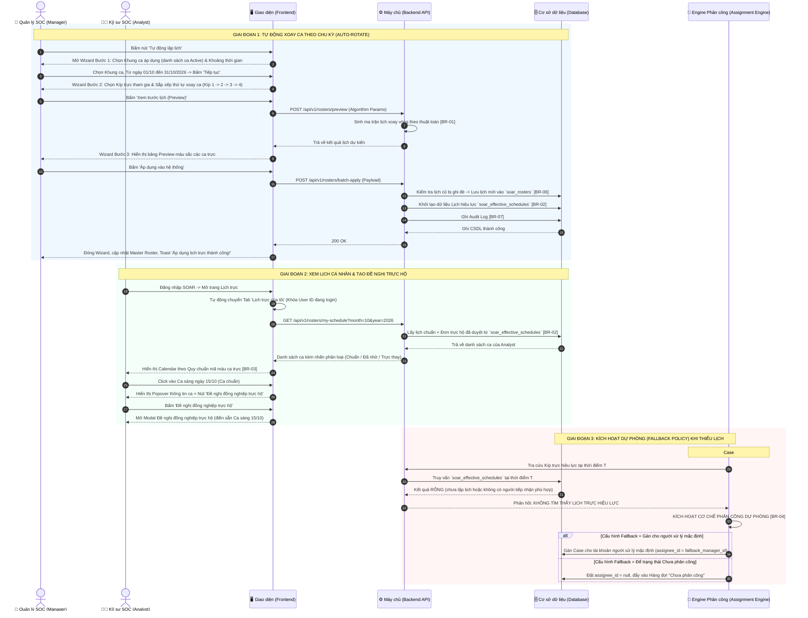

# ĐẶC TẢ YÊU CẦU PHẦN MỀM (SRS)
## TÍNH NĂNG: QUẢN LÝ LỊCH PHÂN CÔNG CA TRỰC & LỊCH TRỰC CÁ NHÂN (MASTER SHIFT ROSTER & PERSONAL CALENDAR MANAGEMENT)

---

# 1. THÔNG TIN CHUNG CHỨC NĂNG

| Thuộc tính | Nội dung |
| :--- | :--- |
| **Mã chức năng** | `SOAR_ROSTER_SCHED_03` |
| **Tên chức năng** | Quản lý Lịch phân công ca trực & Lịch trực cá nhân (Master Shift Roster & Personal Calendar Management) |
| **Mô tả tổng quan** | Tính năng này cung cấp giải pháp lập lịch và quản lý ca trực toàn diện cho trung tâm điều hành an ninh mạng (SOC 24/7). Hệ thống cung cấp giao diện Biểu đồ Lịch (Calendar / Gantt view) trực quan giúp Quản lý SOC dễ dàng phân bổ các Kíp trực vào các Khung ca làm việc theo ngày, hỗ trợ Trợ lý ảo lập lịch tự động xoay ca hàng loạt theo danh sách Khung ca và Kíp trực tùy chọn đang hoạt động trong hệ thống. Đồng thời, tính năng cung cấp góc nhìn "Lịch trực của tôi" (Personal Calendar) riêng biệt cho từng kỹ sư với hệ thống mã màu trực quan để nhận diện ca trực chuẩn, ca đã nhờ người trực hộ và ca nhận trực thay cho đồng nghiệp, kèm nút tắt tạo nhanh đơn chuyển ca. Đặc biệt, tính năng tích hợp sẵn **Cơ chế Phân công Dự phòng (Fallback Assignment Policy)** nhằm đảm bảo 100% sự việc phát sinh trong các khung giờ chưa có kíp trực (hoặc quên lập lịch) hoặc không có người tiếp nhận phù hợp đều được gán đối tượng chịu trách nhiệm xử lý an toàn. |
| **Phạm vi tính năng** | - **Bao gồm:** &nbsp;&nbsp;+ Xem Lịch phân công tổng thể (Master Roster) theo Tuần hoặc Tháng với đầy đủ thông tin Kíp trực, Trưởng ca, số lượng kỹ sư và hiển thị chi tiết tên ca kèm tên kíp. &nbsp;&nbsp;+ Chuyển đổi nhanh sang góc nhìn "Lịch trực của tôi" (Personal Calendar) khóa theo tài khoản đang đăng nhập. &nbsp;&nbsp;+ Trợ lý lập lịch tự động theo chu kỳ (Auto-Rotate Wizard 3 bước): Lựa chọn danh sách Khung ca áp dụng và Kíp trực tham gia (từ các ca và kíp đang hoạt động), cấu hình thứ tự xoay ca kèm tính năng xem trước (Preview) và áp dụng hàng loạt. &nbsp;&nbsp;+ Phân bổ ca thủ công: Click vào ô ca trực để gán kíp, đổi kíp hoặc bổ sung nhân sự tăng cường. &nbsp;&nbsp;+ Drawer chi tiết ca trực: Xem danh sách thành viên trực tế (kể cả nhân sự trực thay), lịch sử đổi ca. &nbsp;&nbsp;+ Nhận diện trực quan các trạng thái ca trên lịch cá nhân theo Quy chuẩn mã màu ca trực: Xanh dương (Ca chuẩn), Xám gạch ngang (Đã nhờ trực hộ), Xanh lá (Nhận trực thay). &nbsp;&nbsp;+ Phím tắt "Đề nghị đồng nghiệp trực hộ" mở ngay form tạo đơn từ popover của ca trực cá nhân. &nbsp;&nbsp;+ Cấu hình Phân công Dự phòng (Fallback Policy): Gán cho người xử lý mặc định hoặc để trạng thái Chưa phân công, cho phép người dùng tự nhận việc đối với các sự việc chưa phân công. &nbsp;&nbsp;+ Ghi nhận nhật ký kiểm toán (Audit Log) cho toàn bộ các thao tác lập lịch, xoay ca và ghi đè lịch. - **Không bao gồm:** &nbsp;&nbsp;+ Định nghĩa giờ bắt đầu/kết thúc của ca (thuộc `SOAR_SHIFT_DEF_01`). &nbsp;&nbsp;+ Quản lý nhân sự và ma trận Severity của Kíp (thuộc `SOAR_CREW_MGMT_02`). &nbsp;&nbsp;+ Xử lý luồng duyệt đơn xin đổi ca (thuộc `SOAR_SHIFT_TRANSFER_04`). |
| **Điều kiện trước** | 1. Người dùng đã đăng nhập thành công vào hệ thống SOAR. 2. Hệ thống đã có ít nhất 01 Khung ca làm việc ở trạng thái `Active` (`SOAR_SHIFT_DEF_01`). 3. Hệ thống đã có ít nhất 01 Kíp trực ở trạng thái `Active` (`SOAR_CREW_MGMT_02`). 4. Múi giờ hệ thống (Timezone) đã được đồng bộ chuẩn UTC+7. |
| **Điều kiện sau** | 1. **Khi lập lịch thành công:** Dữ liệu phân bổ ca được lưu vào bảng `soar_rosters`, sinh bản ghi Lịch trực hiệu lực `soar_effective_schedules`; Engine phân công Case nhận diện lịch mới để gán việc. 2. **Khi áp dụng Fallback Policy:** Case sinh ra ngoài lịch hoặc không có người tiếp nhận phù hợp được gán cho người xử lý mặc định hoặc đưa vào Hàng đợi "Chưa phân công". 3. **Khi thao tác thất bại:** Giữ nguyên lịch cũ, hiển thị thông báo lỗi chi tiết. |
| **Ngoại lệ tổng quan** | 1. Xung đột ghi đè lịch: Người dùng chạy Auto-Rotate đè lên khoảng thời gian đã có lịch cũ (Hiển thị Modal cảnh báo xác nhận ghi đè theo [BR-06]). 2. Phát sinh Case ngoài lịch trực hoặc không có người tiếp nhận phù hợp: Hệ thống kích hoạt Cơ chế Phân công Dự phòng, gán Case an toàn theo [BR-04]. 3. Mất kết nối CSDL khi lập lịch hàng loạt: Rollback toàn bộ transaction, giữ nguyên trạng thái trước khi thực hiện. |

---

# 2. MA TRẬN PHÂN QUYỀN

Tính năng Quản lý Lịch phân công ca trực được kiểm soát truy cập và phân định phạm vi hiển thị / thao tác dữ liệu theo cơ chế phân quyền chức năng:

### 2.1. Danh mục quyền chức năng

| Mã quyền | Tên quyền | Mô tả chi tiết |
| :--- | :--- | :--- |
| `ROSTER_MANAGE` | **Quản lý lịch phân công** | Quyền toàn quyền quản trị và điều hành lịch trực SOC: Xem Lịch tổng thể toàn bộ đơn vị, Tự động lập lịch xoay ca (Auto-Rotate), Cấu hình cơ chế phân công dự phòng (Fallback Policy), Điều chỉnh kíp trực và Bổ sung nhân sự tăng cường vào ca trực, Xuất báo cáo lịch trực Excel. |

---

### 2.2. Chi tiết phạm vi hiển thị giao diện và thao tác theo quyền hạn

| Quyền hạn | Tab "Lịch của tôi" | Tab "Lịch tổng thể" | Nút "Tự động lập lịch" | Nút "Cấu hình dự phòng" | Nút "Xuất Excel" | Thao tác trên ô ca trực (Đổi kíp / Thêm nhân sự) | Mô tả chi tiết hành vi giao diện & Phạm vi thao tác |
| :--- | :---: | :---: | :---: | :---: | :---: | :---: | :--- |
| **Không có quyền Quản lý lịch phân công** | ✅ | ❌ | ❌ | ❌ | ❌ *(Hoặc chỉ xuất lịch cá nhân)* | ❌ *(Chỉ click vào ca của mình để Đề nghị trực hộ)* | • **Truy cập giới hạn phạm vi cá nhân:** Người dùng vẫn truy cập được vào tính năng Quản lý lịch phân công. • **Chỉ hiển thị Tab "Lịch của tôi":** Giao diện chỉ hiển thị duy nhất lịch trực cá nhân của chính người dùng; Tab "Lịch tổng thể" bị ẩn hoàn toàn. • **Ẩn các công cụ quản trị:** Nút **"Tự động lập lịch"** và **"Cấu hình dự phòng"** bị ẩn hoàn toàn. • **Thao tác cho phép:** Người dùng xem được các ca trực của bản thân, danh sách đồng nghiệp cùng kíp, và được phép click vào ô ca trực của mình để mở popup **"Đề nghị đồng nghiệp trực hộ"** (tạo đơn chuyển ca 1 chiều). |
| **Có quyền Quản lý lịch phân công** (`ROSTER_MANAGE`) | ✅ | ✅ | ✅ | ✅ | ✅ | ✅ • Đổi kíp trực phụ trách • Bổ sung/gỡ nhân sự tăng cường | • **Toàn quyền quản trị & điều phối lịch:** Người dùng truy cập được cả 2 Tab điều hướng: **"Lịch của tôi"** và **"Lịch tổng thể"**. • **Hiển thị đầy đủ thanh công cụ quản trị:** &nbsp;&nbsp;+ Nút **"Tự động lập lịch"**: Mở Wizard 3 bước lập lịch xoay ca tự động theo chu kỳ. &nbsp;&nbsp;+ Nút **"Cấu hình dự phòng"**: Mở Modal thiết lập quy tắc gán Case ngoài giờ (Fallback Policy). &nbsp;&nbsp;+ Nút **"Xuất Excel"**: Xuất báo cáo phân công ca trực tổng thể toàn SOC. • **Toàn quyền tương tác trên Lịch tổng thể:** Click vào ô ca trực bất kỳ để mở Drawer chi tiết ca, thực hiện đổi Kíp trực phụ trách, thêm hoặc gỡ nhân sự tăng cường, giải quyết xung đột lịch trực. |

*Ghi chú ràng buộc kiểm soát truy cập:*
1. Đối với người dùng **không có quyền Quản lý lịch phân công** (ví dụ: các kỹ sư SOC Analyst thông thường), hệ thống luôn tự động định tuyến và khóa hiển thị ở chế độ **Lịch của tôi (Personal Calendar View)**. Tab "Lịch tổng thể" không xuất hiện trên thanh điều hướng tab.
2. Nút **"Tự động lập lịch"** và nút **"Cấu hình dự phòng"** chỉ hiển thị và cho phép kích hoạt đối với tài khoản có quyền `ROSTER_MANAGE`.
3. Thao tác click vào ô ca trực trên Lịch tổng thể để đổi Kíp trực hoặc bổ sung nhân sự tăng cường chỉ cho phép người dùng có quyền `ROSTER_MANAGE` thực hiện.
4. Mọi thao tác lập lịch tự động, điều chỉnh kíp trực, bổ sung nhân sự tăng cường hoặc cập nhật cấu hình dự phòng đều được hệ thống ghi nhận đầy đủ vào Nhật ký kiểm toán (Audit Log) theo [BR-08].

---

# 3. BIỂU ĐỒ LUỒNG XỬ LÝ

### 3.1. Sơ đồ tuần tự: Lập lịch Xoay ca, Xem lịch cá nhân và Kích hoạt Dự phòng (Sequence Diagram)

### 3.2. Mô tả chi tiết logic các bước trong luồng xử lý:
1. **Bước 1-13 (Tự động lập lịch bằng Wizard):** Quản lý mở Wizard 3 bước. Bước 1 chọn danh sách Khung ca áp dụng (từ các ca Active) và khoảng thời gian; Bước 2 chọn Kíp trực tham gia và sắp xếp thứ tự xoay ca; bấm "Xem trước" để Backend tính toán thuật toán xoay vòng (`[BR-01]`). Sau khi duyệt bảng Preview tại Bước 3, Quản lý bấm "Áp dụng", Backend ghi dữ liệu vào bảng `soar_rosters` và khởi tạo Lịch trực hiệu lực `soar_effective_schedules` (`[BR-02]`), đồng thời ghi nhận Audit Log (`[BR-07]`).
2. **Bước 14-22 (Trải nghiệm Lịch trực cá nhân):** Kỹ sư đăng nhập được tự động dẫn vào góc nhìn "Lịch trực của tôi". Hệ thống tải dữ liệu lịch hiệu lực và hiển thị theo Quy chuẩn mã màu ca trực: Xanh dương (Ca chuẩn), Xám gạch ngang (Đã nhờ đồng nghiệp trực hộ), Xanh lá (Nhận trực thay) (`[BR-03]`). Kỹ sư click vào ca chuẩn sẽ thấy nút tắt "Đề nghị đồng nghiệp trực hộ" mở thẳng form tạo đơn chuyển ca 1 chiều (chọn đồng nghiệp trực thay và nhập lý do).
3. **Bước 23-30 (Kích hoạt Cơ chế Phân công Dự phòng Fallback):** Khi có Case mới sinh ra nhưng hệ thống không tìm thấy kíp trực nào trong ca đó (do quên lập lịch hoặc không có người tiếp nhận phù hợp), Engine lập tức kích hoạt cơ chế bảo vệ (`[BR-04]`): Gán trực tiếp cho người xử lý mặc định hoặc đưa vào Hàng đợi "Chưa phân công" để người dùng tự nhận việc (Claim).

---

# 4. THIẾT KẾ GIAO DIỆN & ĐẶC TẢ CHI TIẾT UI COMPONENTS

### 4.1. Màn hình Lịch phân công tổng thể (`/shifts/roster`)

Toàn bộ các thành phần hiển thị, điều hướng và bảng lịch trên màn hình chính được đặc tả tập trung trong bảng dưới đây:

| STT | Tên trường | Loại dữ liệu | Mô tả |
| :---: | :--- | :--- | :--- |
| 1 | **Tiêu đề trang** | Label | - Tiêu đề phân hệ Lịch phân công ca trực. - **Nội dung mặc định:** `"Lịch phân công Ca trực SOC"` (`"SOC Shift Roster Management"`) - **Tính chất:** Tĩnh. |
| 2 | **Bộ điều hướng thời gian** | Date Navigator | - Chứa các nút điều hướng lịch: &nbsp;&nbsp;• Nút `"Hôm nay"` (`"Today"`): Nhảy nhanh về ngày hiện tại. &nbsp;&nbsp;• Nút Mũi tên Trái/Phải: Chuyển sang Tuần/Tháng trước hoặc tiếp theo. &nbsp;&nbsp;• Label hiển thị: Tháng/Năm hiện tại (ví dụ: `Tháng 10, 2026`). Click mở Datepicker chọn nhanh tháng bất kỳ. |
| 3 | **Nút chuyển chế độ xem (View Mode)** | Button Group | - Cho phép người dùng chuyển đổi hiển thị giữa các thang thời gian: &nbsp;&nbsp;• Nút `"Tuần"` (`"Week"`): Hiển thị 7 ngày trong tuần được chọn. &nbsp;&nbsp;• Nút `"Tháng"` (`"Month"`): Hiển thị toàn bộ các ngày trong tháng (Mặc định). |
| 4 | **Công tắc chuyển đổi Góc nhìn (Perspective Toggle)** | Segmented Control | - Cho phép chuyển đổi linh hoạt góc nhìn lịch: &nbsp;&nbsp;• Tùy chọn 1: `"Lịch tổng thể (Master Roster)"` (Mặc định cho Quản lý). &nbsp;&nbsp;• Tùy chọn 2: `"Lịch của tôi (Personal Calendar)"` (Mặc định cho Kỹ sư phân tích). |
| 5 | **Nút "Tự động lập lịch (Auto-Rotate)"** | Button | - Cho phép Quản lý mở Wizard tự động sinh lịch xoay ca theo chu kỳ. - **Trạng thái:** Enabled. Chỉ hiển thị cho *Super Admin* và *SOC Manager*. - **Hành vi (OnClick):** Mở Modal Wizard "Tự động lập lịch theo chu kỳ". |
| 6 | **Nút "Cài đặt Dự phòng (Fallback Settings)"** | Button | - Cho phép Quản lý mở Drawer cấu hình cơ chế xử lý khi thiếu lịch trực hoặc không có người tiếp nhận phù hợp. - **Trạng thái:** Enabled. Chỉ hiển thị cho *Super Admin* và *SOC Manager*. - **Hành vi (OnClick):** Mở Drawer "Cấu hình Phân công Dự phòng". |
| 7 | **Dòng gợi ý thao tác** | Label | - Hiển thị dòng hướng dẫn trên thanh phân bổ mã màu kíp trực: &nbsp;&nbsp;`"💡 Bấm vào ô ca trực bất kỳ để cấu hình hoặc bổ sung nhân sự tăng cường"` |
| 8 | **Lưới Lịch phân công (Roster Grid)** | Calendar Matrix | - Bảng ma trận phân bổ ca trực dạng Calendar/Gantt: &nbsp;&nbsp;• **Các hàng (Rows):** Từng Khung ca làm việc chuẩn (`Ca Sáng: 06:00 - 14:00`, `Ca Chiều: 14:00 - 22:00`, `Ca Đêm: 22:00 - 06:00 (+1)`). &nbsp;&nbsp;• **Các cột (Columns):** Từng ngày trong tuần/tháng (Thứ 2 đến Chủ Nhật). Ngày hiện tại được highlight viền xanh dương nổi bật. &nbsp;&nbsp;• **Ô ca trực ở chế độ xem Tuần (Week View):** &nbsp;&nbsp;&nbsp;&nbsp;- *Trường hợp ĐÃ gán kíp:* Hiển thị Thẻ kíp trực (Màu đại diện của Kíp, Tên kíp, Tên Trưởng ca, Số thành viên trực). Nếu có thành viên đang có đơn trực hộ, hiển thị thêm Icon hai mũi tên đổi chiều màu cam `[⇄ 1]`. &nbsp;&nbsp;&nbsp;&nbsp;- *Trường hợp CHƯA gán kíp:* Hiển thị ô trống màu xám nhạt với dấu cộng nét đứt `[+ Gán kíp]`. Cảnh báo viền đỏ nếu là ngày hôm nay hoặc quá khứ gần. &nbsp;&nbsp;• **Ô ca trực ở chế độ xem Tháng (Month View):** &nbsp;&nbsp;&nbsp;&nbsp;- Mỗi ô ca trực hiển thị gồm 2 dòng thông tin rõ ràng: &nbsp;&nbsp;&nbsp;&nbsp;&nbsp;&nbsp;+ **Dòng trên (in đậm):** Hiển thị **Tên ca** (ví dụ: `Ca Sáng`, `Ca Chiều`, `Ca Đêm`) với màu sắc nhận diện của kíp. &nbsp;&nbsp;&nbsp;&nbsp;&nbsp;&nbsp;+ **Dòng dưới (cỡ chữ nhỏ):** Hiển thị **Tên kíp** được gán cho ca đó (ví dụ: `Kíp trực tác chiến 1`, `Kíp trực giám sát 2`, hoặc `Chưa phân công`). &nbsp;&nbsp;• **Hành vi khi click vào Ô ca trực:** Mở Drawer "Chi tiết ca trực ngày dd/mm/yyyy" (Xem mục 4.2). |

---

### 4.2. Drawer Chi tiết Ca trực trong ngày (Shift Slot Detail Drawer)

Mở ra khi click vào bất kỳ ô ca trực nào trên Lưới lịch:

| STT | Tên trường | Loại dữ liệu | Mô tả |
| :---: | :--- | :--- | :--- |
| 1 | **Tiêu đề Drawer** | Label | - Hiển thị: `"Chi tiết [Tên ca] - Ngày [dd/mm/yyyy]"` kèm khung giờ ca trực. |
| 2 | **Kíp trực phụ trách** | Combobox | - Cho phép xem hoặc thay đổi Kíp trực được phân công cho ca này. - **Nguồn dữ liệu:** Danh sách tất cả Kíp trực đang ở trạng thái `Active`. - **Quyền hạn:** Chỉ *Super Admin* và *SOC Manager* mới có quyền đổi kíp. Các vai trò khác ở dạng Chỉ đọc. |
| 3 | **Trưởng ca trực (Shift Lead)** | Textbox (Chỉ đọc) | - Hiển thị Avatar và Họ tên Trưởng kíp phụ trách chỉ huy ca làm việc. |
| 4 | **Bảng danh sách Kỹ sư trực thực tế** | Datatable | - Bảng hiển thị danh sách nhân sự tham gia ca trực này theo Lịch hiệu lực: &nbsp;&nbsp;• Cột Họ tên kỹ sư & Email. &nbsp;&nbsp;• Cột Vai trò tiếp nhận Severity (Low/Med, High, Critical). &nbsp;&nbsp;• Cột Trạng thái trực: Badge Xanh `"Trực chuẩn"`, Badge Cam `"Trực thay cho [Tên kỹ sư A]"` (nếu có đơn chuyển ca đã duyệt), hoặc Badge Xanh lá `"Nhân sự tăng cường"`. |
| 5 | **Nút "+ Thêm nhân sự tăng cường"** | Button | - Cho phép Trưởng ca hoặc Quản lý bổ sung thêm 1 kỹ sư ngoài kíp vào hỗ trợ ca này (ví dụ khi có chiến dịch trực đặc biệt). - **Hành vi (OnClick):** Mở dropdown chọn tài khoản kỹ sư SOC và lý do tăng cường. |
| 6 | **Nút "Lưu thay đổi"** | Button | - Lưu lại các điều chỉnh gán kíp hoặc nhân sự tăng cường vào CSDL. Cập nhật ngay Lịch hiệu lực `[BR-02]`. |

---

### 4.3. Wizard Tự động lập lịch theo chu kỳ (Auto-Rotate Wizard)

Modal Wizard 3 bước giúp sinh lịch xoay vòng tự động theo danh sách Khung ca và Kíp trực tùy chọn:

| STT | Tên trường | Loại dữ liệu | Mô tả |
| :---: | :--- | :--- | :--- |
| **BƯỚC 1** | **CHỌN KHUNG CA ÁP DỤNG & THỜI GIAN** | | |
| 1 | **Chọn Khung ca áp dụng** | Checkbox List | - Hiển thị danh sách tất cả các Khung ca làm việc đang ở trạng thái `Active` trong hệ thống. - Mỗi ca hiển thị: Tên ca, Khoảng thời gian bắt đầu - kết thúc ca. - **Mặc định:** Hệ thống tự động tick chọn tất cả các khung ca đang hoạt động. - Người dùng có thể bỏ chọn ca không muốn lập lịch. - **Ràng buộc:** Tối thiểu phải có ít nhất 01 khung ca được chọn để lập lịch. |
| 2 | **Khoảng thời gian áp dụng** | Date Range Picker | - Người dùng chọn Ngày bắt đầu và Ngày kết thúc muốn sinh lịch. - **Placeholder:** `dd/mm/yyyy - dd/mm/yyyy` - **Ràng buộc:** Ngày kết thúc phải sau Ngày bắt đầu. Tối đa không quá 90 ngày cho 1 lần sinh lịch. |
| **BƯỚC 2** | **CẤU HÌNH THỨ TỰ KÍP TRỰC** | | |
| 3 | **Danh sách Kíp tham gia & Thứ tự** | Drag & Drop List kèm Checkbox | - Hiển thị danh sách tất cả các Kíp trực đang ở trạng thái `Active` trong hệ thống. - **Mặc định:** Tự động chọn tất cả các kíp đang hoạt động. - Người dùng có thể chọn ít hơn hoặc bỏ chọn kíp không muốn tham gia (ràng buộc: tối thiểu phải có ít nhất 01 kíp trực). - Cho phép kéo thả để sắp xếp thứ tự ưu tiên xoay ca của các kíp đã chọn (ví dụ: `1. Kíp 1` $\rightarrow$ `2. Kíp 2` $\rightarrow$ `3. Kíp 3` $\rightarrow$ `4. Kíp 4`). |
| **BƯỚC 3** | **XEM TRƯỚC (PREVIEW) & ÁP DỤNG** | | |
| 4 | **Lưới xem trước lịch (Roster Preview)** | Datatable Matrix | - Hiển thị ma trận lịch trực dự kiến được sinh ra bởi thuật toán `[BR-01]` dựa trên danh sách ca và kíp đã chọn. - Các ô ca trực hiển thị mã màu của từng kíp để Quản lý kiểm tra tính liên tục, không bị gián đoạn hoặc trùng lặp. - Cảnh báo màu vàng nếu phát hiện việc ghi đè lên các ngày đã có lịch trước đó. |
| 5 | **Nút "Áp dụng vào hệ thống" (Apply)** | Button | - Xác nhận ghi dữ liệu vào CSDL. Nếu có lịch cũ bị đè, kích hoạt `[BR-06]`. Hiển thị loading spinner và thông báo Toast thành công. |

---

### 4.4. Góc nhìn "Lịch trực của tôi" (Personal Calendar View)

Giao diện chuyên biệt dành cho từng Kỹ sư theo dõi lịch cá nhân:

| STT | Tên trường | Loại dữ liệu | Mô tả |
| :---: | :--- | :--- | :--- |
| 1 | **Tiêu đề góc nhìn** | Label | - Hiển thị: `"Lịch trực cá nhân của: [Username] ([Họ tên])"` (ví dụ: `Lịch trực cá nhân của: tunglv (Lê Văn Tùng)`). - *Lưu ý:* Không hiển thị avatar tròn và bỏ đoạn thông tin vai trò/ID người dùng. |
| 2 | **Thanh Quy chuẩn mã màu ca trực** | Legend Bar | - Hiển thị nhãn: `"Quy chuẩn mã màu ca trực:"` kèm 3 mẫu mã màu chuẩn hóa theo `[BR-03]`: &nbsp;&nbsp;• **Ca trực chuẩn của tôi:** Thẻ nền xanh dương nhạt (`rgba(41, 163, 241, 0.2)`), viền xanh dương đậm. &nbsp;&nbsp;• **Đã nhờ đồng nghiệp trực hộ:** Thẻ nền xám nhạt, viền nét đứt, chữ gạch ngang. &nbsp;&nbsp;• **Nhận trực thay cho đồng nghiệp:** Thẻ nền xanh lá nhạt (`rgba(46, 213, 115, 0.2)`), viền xanh lá đậm. |
| 3 | **Lưới Lịch cá nhân** | Calendar View | - Hiển thị các ngày trong tháng. Mỗi ngày có ca làm việc của kỹ sư được hiển thị dưới dạng Thẻ sự kiện tương ứng với mã màu quy chuẩn. |
| 4 | **Popover Chi tiết Ca cá nhân** | Popover | - Khi click vào một thẻ ca trực chuẩn (màu xanh dương), hiển thị Popover chứa: &nbsp;&nbsp;• Giờ bắt đầu, Giờ kết thúc, Thời lượng ca. &nbsp;&nbsp;• Danh sách đồng đội cùng trực trong kíp. &nbsp;&nbsp;• Mức độ nghiêm trọng được phân công tiếp nhận. &nbsp;&nbsp;• **Nút tắt nổi bật: "Đề nghị đồng nghiệp trực hộ"** (Click mở modal "Đề nghị đồng nghiệp trực hộ"). |
| 5 | **Modal Đề nghị đồng nghiệp trực hộ** | Modal Dialog | - Modal tạo đơn chuyển ca 1 chiều nhanh từ lịch cá nhân: &nbsp;&nbsp;• **Tiêu đề:** `"Đề nghị đồng nghiệp trực hộ"` &nbsp;&nbsp;• **Thông tin ca trực:** Tên ca và ngày trực được điền sẵn. &nbsp;&nbsp;• **Trường chọn người nhận:** Nhãn `"Chọn đồng nghiệp trực thay:"` (Dropdown danh sách đồng nghiệp trong SOC). &nbsp;&nbsp;• **Trường lý do:** Nhãn `"Lý do đề nghị trực hộ:"` (Textarea). &nbsp;&nbsp;• **Nút bấm:** Nút `"Hủy"` và nút `"Gửi đề nghị"`. |

---

### 4.5. Drawer Cấu hình Phân công Dự phòng (Fallback Settings)

| STT | Tên trường | Loại dữ liệu | Mô tả |
| :---: | :--- | :--- | :--- |
| 1 | **Tiêu đề Drawer** | Label | - `"Cấu hình Phân công Dự phòng"` |
| 2 | **Thông điệp định hướng cơ chế** | Notice Banner | - Văn bản: `"Đảm bảo 100% sự việc phát sinh trong các khung giờ chưa có kíp trực (hoặc quên lập lịch) hoặc không có người tiếp nhận phù hợp đều được gán đối tượng chịu trách nhiệm xử lý an toàn."` |
| 3 | **Hành vi khi phát sinh Sự việc ngoài Lịch trực hoặc không có người tiếp nhận phù hợp** | Radio Group | - Cho phép Quản lý chọn cơ chế gán khi không tra cứu được kíp trực hiệu lực hoặc không có người tiếp nhận phù hợp: &nbsp;&nbsp;• Tùy chọn 1 (Khuyến nghị): **"Gán cho người xử lý mặc định (Khuyến nghị)"** - Mô tả: `"Tự động gán trực tiếp cho người xử lý mặc định"` (Giá trị: `ASSIGN_SOC_MANAGER`). &nbsp;&nbsp;• Tùy chọn 2: **"Để trạng thái Chưa phân công"** - Mô tả: `"Đẩy vào hàng đợi 'Chưa phân công'"` (Giá trị: `UNASSIGNED`). *(Đã loại bỏ tùy chọn Gán cho Nhóm Quản trị SOC)* |
| 4 | **Chỉ định tài khoản nhận sự việc dự phòng** | Combobox | - Hiển thị khi tùy chọn 1 được chọn. Nhãn: `"Chỉ định tài khoản nhận sự việc dự phòng:"`. Dropdown cho phép chọn tài khoản người dùng tiếp nhận sự việc dự phòng. |
| 5 | **Cho phép người dùng tự nhận việc** | Checkbox | - Nhãn: `[x] Cho phép bất kỳ người dùng nào tự bấm "Nhận việc" đối với các sự việc chưa phân công`. Mặc định checked. |
| 6 | **Nút "Lưu cấu hình dự phòng"** | Button | - Lưu các thiết lập vào CSDL cấu hình hệ thống. Hiển thị Toast thông báo thành công. |

---

# 5. QUY TẮC NGHIỆP VỤ CHUYÊN SÂU (BUSINESS RULES)

### Bảng tổng hợp quy tắc nghiệp vụ:

| Mã BR | Tên quy tắc nghiệp vụ | Phân loại | Mức độ ưu tiên |
| :---: | :--- | :--- | :---: |
| **[BR-01]** | Thuật toán sinh lịch tự động theo Chu kỳ xoay ca (Auto-Rotate Algorithm) | Thuật toán & Phân bổ | Bắt buộc |
| **[BR-02]** | Quy tắc xác định Lịch trực hiệu lực (Effective Schedule Resolver) | Quy trình & Trạng thái | Bắt buộc |
| **[BR-03]** | Quy chuẩn mã màu ca trực trên Lịch trực cá nhân (Personal Calendar Styling) | Giao diện & Trạng thái | Bắt buộc |
| **[BR-04]** | Cơ chế Phân công Dự phòng (Fallback Assignment Policy) | Thuật toán & Phân công | Bắt buộc |
| **[BR-05]** | Cơ chế Cảnh báo Vi phạm Lịch trực (Schedule Breach Alerting) | Tích hợp & Thông báo | Bắt buộc |
| **[BR-06]** | Quy tắc Ghi đè lịch (Roster Override) và Bảo toàn dữ liệu quá khứ | Ràng buộc dữ liệu | Bắt buộc |
| **[BR-07]** | Quy chuẩn ghi nhận Nhật ký kiểm toán (Audit Logging) | Bảo mật & Lưu trữ | Bắt buộc |

---

### Chi tiết từng quy tắc:

### [BR-01] Thuật toán sinh lịch tự động theo Chu kỳ xoay ca (Auto-Rotate Algorithm)
- **Phân loại:** Thuật toán & Phân bổ
- **Phạm vi áp dụng:** Chức năng Auto-Rotate Wizard tại Backend.
- **Điều kiện kích hoạt:** Khi Quản lý SOC bấm "Áp dụng" trên Wizard lập lịch.
- **Logic thuật toán:**
  1. **Đầu vào cấu hình:**
     - Danh sách $m$ Khung ca làm việc được chọn: $\{S_1, S_2, ..., S_m\}$ ($m \ge 1$, thuộc các ca ở trạng thái `Active`).
     - Danh sách $n$ Kíp trực được chọn theo thứ tự ưu tiên sắp xếp: $\{K_1, K_2, ..., K_n\}$ ($n \ge 1$, thuộc các kíp ở trạng thái `Active`).
     - Khoảng thời gian áp dụng: Từ ngày $D_{start}$ đến ngày $D_{end}$.
  2. **Quy tắc tịnh tiến xoay vòng:**
     - Với mỗi ngày $D$ trong khoảng $[D_{start}, D_{end}]$, hệ thống tính toán chỉ số bước $t = (D - D_{start})$.
     - Lần lượt ánh xạ kíp trực vào từng khung ca $S_i$ ($i = 1 .. m$) theo công thức modulo thứ tự kíp:
       $$\text{Crew\_Index}(D, S_i) = (t \times m + (i - 1)) \pmod n$$
     - Kíp trực $K_{\text{Crew\_Index} + 1}$ được phân công cho ca $S_i$ ngày $D$.
  3. **Ghi nhận CSDL:** Với mỗi ô ca trực được sinh ra, hệ thống tạo một bản ghi trong `soar_rosters`:
     - `roster_id`: UUID tự sinh.
     - `shift_id`: ID khung ca $S_i$.
     - `crew_id`: ID kíp trực được phân công.
     - `shift_date`: Ngày làm việc cụ thể.
     - `is_override`: `false`.

---

### [BR-02] Quy tắc xác định Lịch trực hiệu lực (Effective Schedule Resolver)
- **Phân loại:** Quy trình & Trạng thái
- **Phạm vi áp dụng:** Toàn bộ hệ thống: Hiển thị lịch cá nhân, Drawer chi tiết ca, và Engine tự động gán Case.
- **Điều kiện kích hoạt:** Bất cứ khi nào cần xác định nhân sự thực tế đang trực tại ca làm việc $S$ ngày $D$.
- **Logic xử lý chi tiết:**
  1. **Bước 1: Lấy danh sách nhân sự gốc từ Lịch chuẩn (Base Crew):**
     - Tra cứu kíp trực $K$ được phân công cho ca $S$ ngày $D$ trong `soar_rosters`.
     - Lấy toàn bộ danh sách kỹ sư thuộc kíp $K$: $\text{Members}_{base} = \{U_1, U_2, ..., U_n\}$.
  2. **Bước 2: Áp dụng các Đơn chuyển ca ĐÃ ĐƯỢC DUYỆT (`Approved Transfers`):**
     - Truy vấn bảng `soar_shift_transfers` với điều kiện `shift_id = S`, `shift_date = D`, `status = APPROVED`:
     - Với mỗi đơn hợp lệ: Kỹ sư nhờ trực (A) sẽ bị **loại bỏ** khỏi danh sách trực của ca đó; Kỹ sư nhận trực hộ (B) sẽ được **bổ sung** vào danh sách trực của ca đó:
       $$\text{Members}_{effective} = (\text{Members}_{base} \setminus \{A\}) \cup \{B\}$$
     - Kỹ sư B kế thừa vai trò và ma trận Severity tiếp nhận của Kỹ sư A trong ca trực đó.
  3. **Bước 3: Bổ sung Nhân sự tăng cường (Reinforcements):**
     - Thêm các nhân sự được Quản lý chỉ định bổ sung thủ công vào $\text{Members}_{effective}$.
  4. Kết quả $\text{Members}_{effective}$ được lưu vào cache (Redis) của ca trực để phục vụ việc gán Case tức thì.

---

### [BR-03] Quy chuẩn mã màu ca trực trên Lịch trực cá nhân (Personal Calendar Styling)
- **Phân loại:** Giao diện & Trạng thái
- **Phạm vi áp dụng:** Màn hình "Lịch trực của tôi" (Personal Calendar View).
- **Điều kiện kích hoạt:** Khi render các thẻ ca làm việc của kỹ sư đang đăng nhập ($U_{current}$).
- **Quy chuẩn mã màu và ký hiệu:**
  1. **Ca trực chuẩn của tôi (Standard Shift):**
     - *Điều kiện:* $U_{current} \in \text{Members}_{base}$ VÀ không có đơn nhờ người khác trực hộ đã duyệt.
     - *Hiển thị:* Thẻ nền màu xanh dương nhạt (`#E8F0FE`), viền xanh dương đậm (`#1A73E8`), chữ đen đậm. Kèm icon kíp trực.
  2. **Ca tôi đã nhờ người khác trực hộ (Transferred Out):**
     - *Điều kiện:* $U_{current} \in \text{Members}_{base}$ NHƯNG đã có đơn chuyển ca cho kỹ sư B ở trạng thái `APPROVED`.
     - *Hiển thị:* Thẻ nền xám nhạt (`#F1F3F4`), viền nét đứt (dashed border), tiêu đề ca bị **gạch ngang** (line-through). Hiển thị thêm Tag màu xám: `"⇄ Trực hộ bởi: [Tên kỹ sư B]"`. Click vào không cho phép tạo đơn chuyển ca nữa.
  3. **Ca tôi nhận trực thay cho đồng nghiệp (Transferred In):**
     - *Điều kiện:* $U_{current} \notin \text{Members}_{base}$ NHƯNG có đơn nhận trực thay cho kỹ sư A ở trạng thái `APPROVED`.
     - *Hiển thị:* Thẻ nền màu xanh lá cây nhạt (`#E6F4EA`), viền xanh lá đậm (`#137333`), chữ đen. Hiển thị thêm Tag màu xanh lá: `"⇄ Trực thay cho: [Tên kỹ sư A]"`.

---

### [BR-04] Cơ chế Phân công Dự phòng (Fallback Assignment Policy)
- **Phân loại:** Thuật toán & Phân công
- **Phạm vi áp dụng:** Khi Engine Phân công Tự động tiếp nhận Case mới nhưng không tìm thấy Lịch trực hiệu lực hoặc không có người tiếp nhận phù hợp.
- **Điều kiện kích hoạt:** Tại thời điểm phát sinh Case $T$, truy vấn $\text{Members}_{effective} = \emptyset$ (chưa có kíp trực nào được phân bổ hoặc không có người tiếp nhận phù hợp).
- **Cơ chế xử lý bảo vệ:**
  1. **Cấp 1: Gán theo Cấu hình Dự phòng (Fallback Assignee):**
     - Nếu cấu hình chọn `Gán cho người xử lý mặc định (Khuyến nghị)`: Case được tự động gán trực tiếp cho người xử lý mặc định (`assignee_id = fallback_manager_id`).
     - Nếu cấu hình chọn `Để trạng thái Chưa phân công`: Giữ nguyên `assignee_id = null`, trạng thái Case là `New`, đẩy vào Hàng đợi "Chưa phân công".
  2. **Cấp 2: Cơ chế Nhận việc (Claiming):**
     - Nếu cấu hình cho phép người dùng tự nhận việc: Bất kỳ người dùng nào khi phát hiện Case chưa phân công đều có thể bấm nút **"Nhận việc" (Claim Case)** để tiếp nhận xử lý ngay.
  3. **Cấp 3: Ghi nhận vi phạm vận hành:** Đánh dấu cờ vi phạm lịch trực trên báo cáo KPI vận hành SOC cuối tháng.

---

### [BR-05] Cơ chế Cảnh báo Vi phạm Lịch trực (Schedule Breach Alerting)
- **Phân loại:** Tích hợp & Thông báo
- **Phạm vi áp dụng:** Notification Service.
- **Điều kiện kích hoạt:** Khi phát hiện ô ca trực bị khuyết nhân sự hoặc có sự việc phát sinh ngoài lịch trực.
- **Logic xử lý chi tiết:**
  1. Hệ thống tự động tạo một thông báo khẩn cấp với độ ưu tiên cao (`Severity = HIGH`).
  2. **Nội dung thông báo chuẩn hóa:**
     > *"⚠️ CẢNH BÁO VI PHẠM LỊCH TRỰC: Sự việc [Mã Case] (Mức độ: [Severity]) vừa phát sinh vào lúc [HH:mm dd/mm/yyyy], tuy nhiên khung ca làm việc hiện tại CHƯA ĐƯỢC PHÂN BỔ KÍP TRỰC hoặc không có người tiếp nhận phù hợp. Hệ thống đã kích hoạt cơ chế dự phòng: [Gán cho người xử lý mặc định / Đưa vào hàng đợi Chưa phân công]. Đề nghị Quản lý SOC kiểm tra và cập nhật Lịch trực ca ngay lập tức!"*
  3. **Các kênh phát thông báo tức thì:**
     - Bắn tin nhắn qua Webhook vào kênh chat tác chiến **Telegram / Microsoft Teams** của ban quản lý SOC.
     - Hiển thị thông báo In-app cho các tài khoản Quản lý SOC đang online.
     - Gửi email khẩn cấp đến hộp thư của SOC Manager.

---

### [BR-06] Quy tắc Ghi đè lịch (Roster Override) và Bảo toàn dữ liệu quá khứ
- **Phân loại:** Ràng buộc dữ liệu
- **Phạm vi áp dụng:** Chức năng Auto-Rotate Wizard và Thao tác sửa ca trực thủ công.
- **Điều kiện kích hoạt:** Khi Quản lý phân bổ đè lịch mới lên các ngày đã có lịch phân công trước đó.
- **Logic xử lý chi tiết:**
  1. **Bảo toàn tuyệt đối Lịch trực Quá khứ:**
     - Hệ thống **tuyệt đối không cho phép** sửa đổi, xóa hoặc ghi đè bất kỳ bản ghi lịch trực nào có `shift_date < CURRENT_DATE` (quá khứ).
     - Dữ liệu lịch trực quá khứ được đóng băng để phục vụ đối soát, kiểm toán và báo cáo KPI.
  2. **Ghi đè Lịch trực Hiện tại & Tương lai (`shift_date >= CURRENT_DATE`):**
     - Khi chạy Auto-Rotate đè lên lịch tương lai, hệ thống hiển thị Modal cảnh báo: *"Khoảng thời gian này đã có [N] ca trực được phân công. Việc ghi đè sẽ thay thế toàn bộ lịch cũ. Bạn có chắc chắn muốn tiếp tục?"*.
     - Nếu người dùng xác nhận: Hệ thống thực hiện cập nhật `crew_id` mới, đặt cờ `is_override = true`, ghi nhận `updated_by` và cập nhật lại Lịch trực hiệu lực.
     - Các đơn chuyển ca đã được duyệt trong tương lai thuộc các ca bị ghi đè sẽ tự động được đánh giá lại: nếu kỹ sư nhận trực thay vẫn có thể trực được thì giữ nguyên, nếu xung đột kíp thì gửi thông báo cho Lead kiểm tra lại.

---

### [BR-07] Quy chuẩn ghi nhận Nhật ký kiểm toán (Audit Logging)
- **Phân loại:** Bảo mật & Lưu trữ
- **Phạm vi áp dụng:** Mọi thao tác Lập lịch tự động (Auto-Rotate), Phân bổ ca thủ công, Đổi kíp, Thêm nhân sự tăng cường và Cập nhật cấu hình Fallback.
- **Điều kiện kích hoạt:** Sau khi transaction CSDL thực hiện thành công.
- **Logic xử lý chi tiết:**
  1. Hệ thống tự động ghi bản ghi vào bảng `soar_audit_logs`:
     - `module`: `"SHIFT_MANAGEMENT"`
     - `feature`: `"ROSTER_SCHEDULING"`
     - `action`: `AUTO_ROTATE` | `MANUAL_ASSIGN` | `CREW_SWAP` | `REINFORCE_ADD` | `FALLBACK_CONFIG`
     - `record_id`: ID của bản ghi roster hoặc chuỗi ngày bị tác động.
     - `actor_id`: ID của Quản lý SOC thực hiện.
     - `actor_ip`: Địa chỉ IP của client.
     - `old_values`: JSON lưu trạng thái phân bổ trước khi thao tác.
     - `new_values`: JSON lưu cấu hình phân bổ mới được áp dụng.
     - `timestamp`: Thời gian thực hiện (UTC timestamp).
  2. Dữ liệu lưu trữ dạng Append-only, đảm bảo tính toàn vẹn và phục vụ kiểm toán an ninh thông tin.
