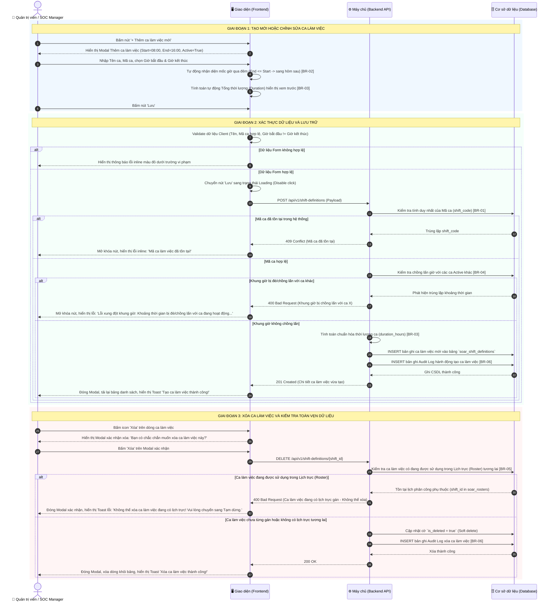
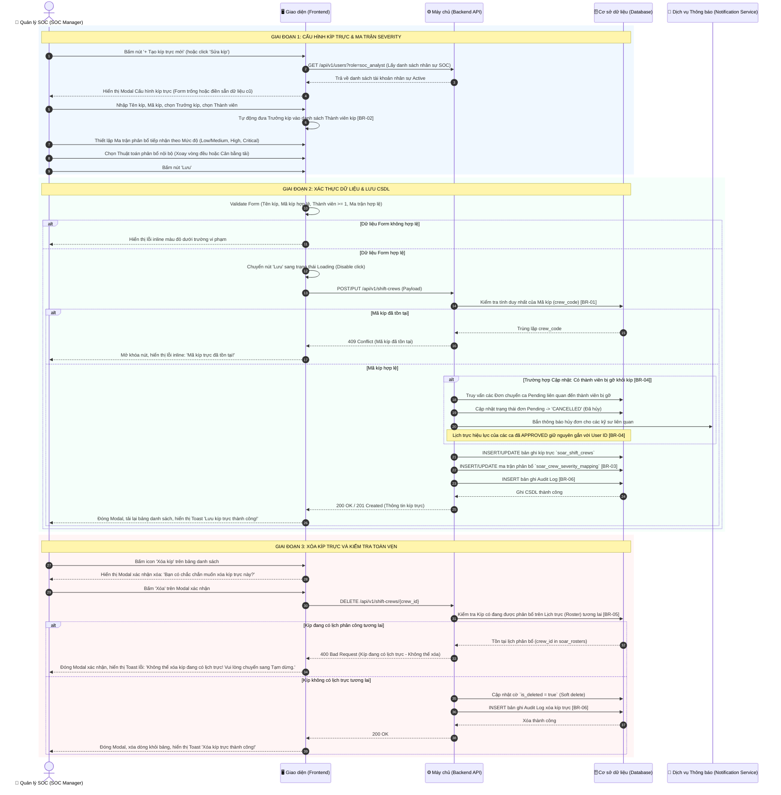
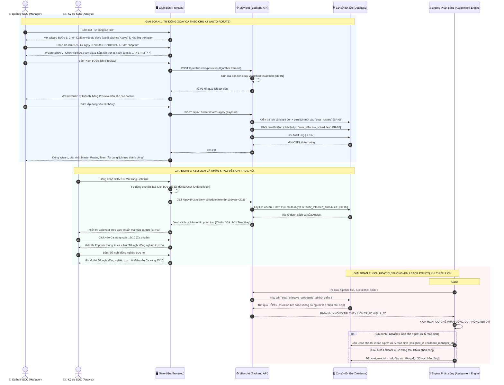
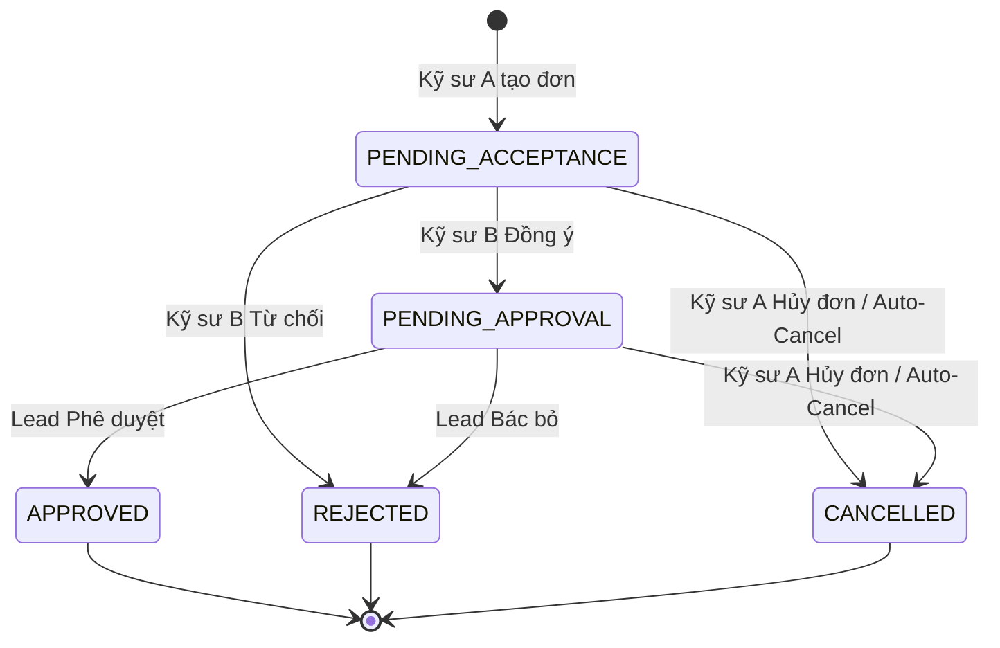

# ĐẶC TẢ YÊU CẦU PHẦN MỀM (SRS)
## PHÂN HỆ: QUẢN LÝ CA KÍP & LỊCH TRỰC VẬN HÀNH SOC
### (SOC SHIFT, CREW, ROSTER & TRANSFER MANAGEMENT SYSTEM)

---

## MỤC LỤC TỔNG THỂ PHÂN HỆ

1. [PHẦN I: QUẢN LÝ CA LÀM VIỆC (SHIFT DEFINITION MANAGEMENT)](#phan-i-quan-ly-ca-lam-viec-shift-definition-management)
2. [PHẦN II: QUẢN LÝ KÍP TRỰC & MA TRẬN TIẾP NHẬN THEO MỨC ĐỘ NGHIÊM TRỌNG (CREW DEFINITION & SEVERITY MAPPING)](#phan-ii-quan-ly-kip-truc--ma-tran-tiep-nhan-theo-muc-do-nghiem-trong-crew-definition--severity-mapping)
3. [PHẦN III: QUẢN LÝ LỊCH PHÂN CÔNG CA TRỰC & LỊCH TRỰC CÁ NHÂN (MASTER SHIFT ROSTER & PERSONAL CALENDAR)](#phan-iii-quan-ly-lich-phan-cong-ca-truc--lich-truc-ca-nhan-master-shift-roster--personal-calendar)
4. [PHẦN IV: QUẢN LÝ ĐƠN CHUYỂN GIAO CA TRỰC (SHIFT TRANSFER REQUEST MANAGEMENT)](#phan-iv-quan-ly-don-chuyen-giao-ca-truc-shift-transfer-request-management)

---

# PHẦN I: QUẢN LÝ CA LÀM VIỆC (SHIFT DEFINITION MANAGEMENT)

# ĐẶC TẢ YÊU CẦU PHẦN MỀM (SRS)
## TÍNH NĂNG: QUẢN LÝ CA LÀM VIỆC (SHIFT DEFINITION MANAGEMENT)

---

# 1. THÔNG TIN CHUNG CHỨC NĂNG

| Thuộc tính | Nội dung |
| :--- | :--- |
| **Mã chức năng** | `SOAR_SHIFT_DEF_01` |
| **Tên chức năng** | Quản lý Ca làm việc (Shift Definition Management) |
| **Mô tả tổng quan** | Tính năng này cho phép Quản trị viên hệ thống (Super Admin) hoặc Quản lý SOC (SOC Manager) thiết lập, chỉnh sửa và quản lý các khung giờ làm việc tiêu chuẩn trong ngày của trung tâm SOC (như Ca Sáng, Ca Chiều, Ca Đêm 24/7). Hệ thống tự động xác định mốc thời gian của ca (ví dụ từ 20h đến 6h hệ thống tự hiểu là từ 20h hôm nay đến 6h sáng hôm sau, còn từ 6h đến 8h là trong cùng ngày mà người dùng không cần phải chọn hay phân loại thủ công), đồng thời **kiểm tra ràng buộc nghiêm ngặt không cho phép khung giờ của các ca trực đè/chồng lấn lên nhau**. Tính năng cũng tự động tính tổng số giờ làm việc thực tế và kiểm soát chặt chẽ tính toàn vẹn dữ liệu để ngăn ngừa việc xóa các ca làm việc đang được phân bổ trên Lịch trực (Roster). Đây là khối dữ liệu nền tảng phục vụ trực tiếp cho việc lập lịch kíp trực, gán tự động Case và giám sát thời hạn cam kết SLA. |
| **Phạm vi tính năng** | - **Bao gồm:**<br>&nbsp;&nbsp;+ Xem danh sách các ca làm việc với các chỉ số: Mã ca, Tên ca, Giờ bắt đầu, Giờ kết thúc, Thời lượng thực tế, Trạng thái hoạt động.<br>&nbsp;&nbsp;+ Tìm kiếm theo từ khóa Tên/Mã ca và Lọc nhanh theo Trạng thái (Tất cả, Đang hoạt động, Tạm dừng).<br>&nbsp;&nbsp;+ Thêm mới ca làm việc: Tự động hiểu mốc giờ qua đêm khi giờ kết thúc nhỏ hơn giờ bắt đầu, tự tính tổng thời lượng làm việc, và **bắt buộc kiểm tra không được đè/chồng lấn khung giờ với các ca đang hoạt động khác**.<br>&nbsp;&nbsp;+ Cập nhật thông tin ca làm việc (Tên ca, Giờ bắt đầu, Giờ kết thúc, Mô tả, Trạng thái). Khóa cố định trường Mã ca khi cập nhật.<br>&nbsp;&nbsp;+ Bật/Tắt trạng thái hoạt động (Active/Inactive) nhanh trực tiếp trên bảng dữ liệu.<br>&nbsp;&nbsp;+ Xóa ca làm việc kèm cơ chế kiểm tra ràng buộc dữ liệu nghiêm ngặt (chặn xóa nếu ca làm việc đã hoặc đang được gán trên Lịch trực tương lai).<br>&nbsp;&nbsp;+ Ghi nhận nhật ký kiểm toán (Audit Log) cho toàn bộ các thao tác Thêm, Sửa, Xóa, Bật/Tắt ca làm việc.<br>- **Không bao gồm:**<br>&nbsp;&nbsp;+ Phân bổ kíp trực hoặc nhân sự cụ thể vào ca (thuộc tính năng Quản lý Lịch phân công `SOAR_ROSTER_SCHED_03`).<br>&nbsp;&nbsp;+ Chấm công hoặc tính lương theo giờ làm việc (thuộc phân hệ Nhân sự bên ngoài). |
| **Điều kiện trước** | 1. Người dùng đã đăng nhập thành công vào hệ thống SOAR với tài khoản hợp lệ.<br>2. Tài khoản người dùng đã được phân quyền quản trị cấu hình ca trực (vai trò Super Admin hoặc SOC Manager theo Ma trận phân quyền).<br>3. Múi giờ hệ thống (Timezone) đã được đồng bộ chuẩn UTC+7 (hoặc múi giờ chuẩn của đơn vị). |
| **Điều kiện sau** | 1. **Khi thêm mới thành công:** Ca làm việc mới được lưu vào CSDL với trạng thái `Active`, hiển thị ngay trên bảng danh sách, ghi nhận Audit Log.<br>2. **Khi cập nhật thành công:** Thông tin ca làm việc được cập nhật, các lịch trực tương lai sử dụng ca làm việc này sẽ áp dụng mốc giờ mới, ghi nhận Audit Log.<br>3. **Khi xóa thành công:** Bản ghi ca làm việc bị xóa khỏi hệ thống (Soft delete), ghi nhận Audit Log.<br>4. **Khi thao tác thất bại / hủy bỏ:** CSDL không thay đổi, dữ liệu đang nhập trên form được giữ nguyên nếu người dùng chưa xác nhận thoát. |
| **Ngoại lệ tổng quan** | 1. Xung đột mã ca làm việc: Mã ca nhập vào bị trùng lặp với mã đã có trong hệ thống (Hệ thống chặn lưu và báo lỗi theo [BR-01]).<br>2. Xung đột/Chồng lấn khung giờ: Khung giờ làm việc của ca mới bị đè lên khung giờ của một ca khác đang hoạt động (Hệ thống từ chối lưu và báo lỗi theo [BR-04]).<br>3. Vi phạm ràng buộc toàn vẹn khi xóa: Người dùng cố tình xóa ca làm việc đang được sử dụng trong Lịch phân công Roster (Hệ thống từ chối xóa và hiển thị cảnh báo hướng dẫn chuyển sang trạng thái Inactive theo [BR-05]).<br>4. Mất kết nối CSDL hoặc lỗi mạng: Hiển thị Toast thông báo lỗi hệ thống, form nhập liệu được giữ nguyên trạng thái để không mất công sức nhập liệu của người dùng. |

---

# 2. MA TRẬN PHÂN QUYỀN

Tính năng Quản lý Ca làm việc được kiểm soát truy cập và phân định phạm vi thao tác dữ liệu theo cơ chế phân quyền chức năng:

### 2.1. Danh mục quyền chức năng

| Mã quyền | Tên quyền | Mô tả chi tiết |
| :--- | :--- | :--- |
| `SHIFT_DEF_VIEW` | **Xem** | Quyền xem danh sách các ca làm việc chuẩn trên hệ thống, tra cứu thông tin chi tiết khung giờ, thời lượng và trạng thái hoạt động. |
| `SHIFT_DEF_MANAGE` | **Tạo/sửa/xóa** | Quyền toàn quyền thao tác dữ liệu ca làm việc: Thêm mới ca làm việc, Chỉnh sửa thông tin ca làm việc, Xóa ca làm việc và Bật/Tắt trạng thái hoạt động (Active/Inactive). *(Quyền này đã bao gồm quyền Xem).* |

---

### 2.2. Chi tiết phạm vi thao tác và hiển thị giao diện theo quyền hạn

| Quyền hạn | Xem danh sách ca làm việc | Nút "+ Thêm ca làm việc mới" | Icon Chỉnh sửa (Edit) | Icon Xóa (Delete) | Bật/Tắt trạng thái (Active/Inactive) | Mô tả chi tiết hành vi giao diện & Phạm vi thao tác |
| :--- | :---: | :---: | :---: | :---: | :---: | :--- |
| **Không có quyền** | ❌ | ❌ | ❌ | ❌ | ❌ | • Người dùng không được truy cập vào tính năng Quản lý Ca làm việc.<br>• Menu chức năng bị ẩn hoặc hệ thống chuyển hướng sang trang 403 Forbidden nếu cố gắng truy cập trực tiếp bằng URL. |
| **Chỉ có quyền Xem**<br>(`SHIFT_DEF_VIEW`) | ✅ | ❌ | ❌ | ❌ | ❌ (Chỉ xem) | • **Xem danh sách ca làm việc:** Người dùng truy cập được màn hình Quản lý ca làm việc, xem toàn bộ danh sách các ca làm việc đang có trên hệ thống kèm mốc thời gian, thời lượng và trạng thái.<br>• Được sử dụng thanh tìm kiếm và bộ lọc trạng thái (Tất cả, Đang hoạt động, Tạm dừng).<br>• **Ẩn hoàn toàn các nút thao tác:** Không hiển thị nút **"+ Thêm ca làm việc mới"**, ẩn icon **Chỉnh sửa** (Edit) và ẩn icon **Xóa** (Delete) trên từng dòng của bảng dữ liệu.<br>• Cột trạng thái hiển thị dưới dạng Badge tĩnh (Read-only), không cho phép click thao tác bật/tắt. |
| **Có quyền Tạo/sửa/xóa**<br>(`SHIFT_DEF_MANAGE`) | ✅ | ✅ | ✅ | ✅ | ✅ | • **Toàn quyền quản trị ca làm việc:** Đã bao gồm toàn bộ quyền Xem.<br>• **Hiển thị nút "+ Thêm ca làm việc mới":** Cho phép bấm vào để hiển thị modal Thêm mới ca làm việc.<br>• **Hiển thị icon Chỉnh sửa (Edit) tại từng dòng:** Bấm vào sẽ mở modal Chỉnh sửa thông tin ca làm việc tương ứng.<br>• **Hiển thị icon Xóa (Delete) tại từng dòng:** Bấm vào sẽ hiển thị modal/popup xác nhận Xóa ca làm việc (kèm kiểm tra ràng buộc toàn vẹn theo [BR-05]).<br>• **Bật/Tắt trạng thái (Active/Inactive):** Công tắc trên từng dòng được mở quyền click tương tác, cho phép người dùng kích hoạt hoặc tạm dừng ca làm việc trực tiếp (kèm kiểm tra ràng buộc trùng lặp khung giờ theo [BR-04]). |

*Ghi chú ràng buộc kiểm soát truy cập:*
1. Nút **"+ Thêm ca làm việc mới"** ở góc phải thanh công cụ chỉ hiển thị đối với tài khoản có quyền **Tạo/sửa/xóa** (`SHIFT_DEF_MANAGE`).
2. Nút/Icon **Chỉnh sửa** (icon bút) và **Xóa** (icon thùng rác) tại cột *Thao tác* trên bảng danh sách chỉ hiển thị đối với tài khoản có quyền **Tạo/sửa/xóa** (`SHIFT_DEF_MANAGE`). Với người dùng chỉ có quyền **Xem**, các icon này bị ẩn hoàn toàn để đảm bảo tính an toàn cho dữ liệu.
3. Công tắc chuyển đổi **Active/Inactive** trên bảng dữ liệu chỉ mở quyền click tương tác cho tài khoản có quyền **Tạo/sửa/xóa**. Với tài khoản chỉ có quyền **Xem**, trạng thái hiển thị dưới dạng Badge tĩnh (chế độ Read-only).
4. Mọi hành động Thêm mới, Chỉnh sửa, Xóa hoặc Thay đổi trạng thái ca làm việc từ người dùng có quyền `SHIFT_DEF_MANAGE` đều được hệ thống ghi nhận đầy đủ vào Nhật ký kiểm toán (Audit Log) theo [BR-06].

---

# 3. BIỂU ĐỒ LUỒNG XỬ LÝ

### 3.1. Sơ đồ tuần tự: Thêm mới, Cập nhật và Xóa Ca làm việc (Sequence Diagram)



### 3.2. Mô tả chi tiết các bước trong luồng xử lý:
1. **Bước 1-5 (Khởi tạo form & Nhập liệu):** Quản trị viên bấm "+ Thêm ca làm việc mới". Frontend hiển thị Modal với giá trị khởi tạo mặc định (`Start Time = 08:00`, `End Time = 16:00`, `Trạng thái = Active`). Khi người dùng thay đổi giờ, hệ thống tự động xác định mốc thời gian (nếu End Time <= Start Time thì tự hiểu kết thúc vào sáng hôm sau; nếu End Time > Start Time thì là trong ngày) và hiển thị Thời lượng tính toán xem trước (`[BR-02]`, `[BR-03]`).
2. **Bước 6-10 (Validate Form tại Client):** Người dùng bấm "Lưu". Frontend kiểm tra các điều kiện bắt buộc: Tên ca không được rỗng, Mã ca đúng format chữ hoa, Giờ bắt đầu không được trùng khớp hoàn toàn với Giờ kết thúc (thời lượng = 0h). Nếu không đạt, hiển thị lỗi inline và dừng luồng.
3. **Bước 11-23 (Backend kiểm tra trùng mã, kiểm tra chặn chồng lấn giờ & Ghi CSDL):**
   - Backend tiếp nhận request, kiểm tra trường `shift_code` trong CSDL (`[BR-01]`). Nếu trùng, trả về mã `409 Conflict`.
   - **Kiểm tra chồng lấn khung giờ (`[BR-04]`):** Backend so sánh khoảng thời gian của ca mới với toàn bộ các ca đang `Active`. **Nếu phát hiện khung giờ bị đè/chồng lấn lên nhau, Backend từ chối lưu và trả về mã `400 Bad Request`**, Frontend hiển thị thông báo lỗi chi tiết để người dùng điều chỉnh lại giờ.
   - Nếu hoàn toàn không chồng lấn: Backend tính toán chuẩn hóa `duration_hours` (`[BR-03]`), ghi dữ liệu vào bảng `soar_shift_definitions` và ghi nhật ký kiểm toán `soar_audit_logs` (`[BR-06]`).
4. **Bước 24-26 (Phản hồi thành công):** Backend trả về mã `201 Created`. Frontend đóng modal, tải lại bảng danh sách và hiển thị Toast thông báo thành công.
5. **Bước 27-36 (Kiểm tra ràng buộc khi Xóa ca làm việc):** Khi người dùng bấm xóa và xác nhận, Backend thực hiện truy vấn bảng `soar_rosters` (`[BR-05]`). Nếu ca làm việc này đang có lịch trực được phân bổ từ thời điểm hiện tại trở về tương lai, hệ thống từ chối xóa và trả về mã lỗi `400 Bad Request`. Nếu không vướng ràng buộc, hệ thống thực hiện Soft delete và ghi Audit Log.

---

# 4. THIẾT KẾ GIAO DIỆN & ĐẶC TẢ CHI TIẾT UI COMPONENTS

### 4.1. Màn hình Danh sách Ca làm việc (`/settings/shifts/definitions`)

Toàn bộ các thành phần hiển thị, lọc tìm kiếm và bảng dữ liệu trên màn hình danh sách được đặc tả chi tiết trong bảng dưới đây:

| STT | Tên trường | Loại dữ liệu | Mô tả |
| :---: | :--- | :--- | :--- |
| 1 | **Tiêu đề trang** | Label | - Tiêu đề màn hình, hiển thị tên phân hệ Quản lý Ca làm việc.<br>- **Nội dung hiển thị mặc định:** `"Quản lý Ca làm việc"` (`"Shift Definitions Management"`)<br>- **Tính chất hiển thị:** Tĩnh (Static). |
| 2 | **Mô tả phụ** | Label | - Đoạn văn bản ngắn hướng dẫn và mô tả mục đích của phân hệ.<br>- **Nội dung hiển thị mặc định:** `"Định nghĩa các khung thời gian làm việc tiêu chuẩn không chồng lấn cho trung tâm SOC."`<br>- **Tính chất hiển thị:** Tĩnh. |
| 3 | **Nút "+ Thêm ca làm việc mới"** | Button | - Cho phép Quản trị viên mở Modal thêm mới ca làm việc.<br>- **Trạng thái mặc định:** Enabled.<br>- **Quyền hạn truy cập:** Chỉ hiển thị và cho phép thao tác đối với vai trò *Super Admin* và *SOC Manager* (theo Mục 2).<br>- **Hành vi khi nhấn (OnClick):** Mở Modal "Thêm ca làm việc mới" với các giá trị mặc định được khởi tạo sẵn. |
| 4 | **Thanh tìm kiếm ca làm việc** | Searchbox | - Cho phép người dùng nhập từ khóa để tìm kiếm nhanh ca làm việc theo Tên hoặc Mã ca.<br>- **Placeholder:**<br>&nbsp;&nbsp;+ VI: `Tìm kiếm theo tên hoặc mã ca làm việc...`<br>&nbsp;&nbsp;+ EN: `Search by shift name or code...`<br>- **Giá trị mặc định:** Trống.<br>- **Giới hạn ký tự:** Tối đa 100 ký tự.<br>- **Quy tắc Nghiệp vụ:** Tự động trim khoảng trắng ở đầu/cuối chuỗi. Áp dụng cơ chế Debounce 300ms kể từ khi người dùng ngừng gõ để tự động kích hoạt lọc dữ liệu trên bảng mà không cần nhấn Enter. Hỗ trợ icon "x" ở góc phải để xóa nhanh nội dung tìm kiếm. |
| 5 | **Bộ lọc Trạng thái** | Combobox | - Cho phép người dùng lọc danh sách ca làm việc theo trạng thái hoạt động.<br>- **Nguồn dữ liệu cố định:**<br>&nbsp;&nbsp;+ `Tất cả trạng thái` (`ALL`) - Mặc định<br>&nbsp;&nbsp;+ `Đang hoạt động` (`ACTIVE`)<br>&nbsp;&nbsp;+ `Tạm dừng` (`INACTIVE`)<br>- **Chức năng tìm kiếm:** Không.<br>- **Quy tắc Nghiệp vụ:** Khi chọn một tùy chọn, bảng dữ liệu lập tức cập nhật lại danh sách tương ứng. |
| 6 | **Bảng danh sách ca làm việc** | Datatable | - Hiển thị danh sách các ca làm việc đang có trong hệ thống dưới dạng bảng dữ liệu.<br>- **Các chức năng chung bổ trợ:**<br>&nbsp;&nbsp;+ Phân trang (Pagination): Có, hỗ trợ các mốc 10, 25, 50 bản ghi/trang. Mặc định 10 bản ghi/trang.<br>&nbsp;&nbsp;+ Sắp xếp (Sorting): Cho phép click vào Header các cột `Mã ca`, `Tên ca`, `Giờ bắt đầu`, `Thời lượng` để sắp xếp tăng/giảm dần.<br>- **Đặc tả chi tiết các cột dữ liệu:**<br>&nbsp;&nbsp;• **Cột Mã ca (Shift Code):** Hiển thị mã định danh in hoa của ca (ví dụ: `SHIFT_MORNING`). Dạng chữ in đậm, kèm font monospace dễ đọc.<br>&nbsp;&nbsp;• **Cột Tên ca (Shift Name):** Hiển thị tên gọi của ca làm việc (ví dụ: `Ca Sáng Tiêu Chuẩn`).<br>&nbsp;&nbsp;• **Cột Khung giờ làm việc:** Hiển thị kết hợp chuỗi thời gian: `[Giờ bắt đầu] - [Giờ kết thúc]` (ví dụ: `06:00 - 14:00` hoặc `20:00 - 06:00 (+1)`). Nếu kết thúc vào ngày hôm sau, tự động gắn ký hiệu `(+1)` bên cạnh giờ kết thúc để người dùng nhận diện nhanh.<br>&nbsp;&nbsp;• **Cột Thời lượng (Duration):** Hiển thị tổng số giờ làm việc thực tế được tính toán tự động (ví dụ: `8.0 giờ`, `10.0 giờ`). Xem công thức tính tại `[BR-03]`.<br>&nbsp;&nbsp;• **Cột Trạng thái (Status Toggle):** Cho phép bật/tắt nhanh trạng thái hoạt động của ca làm việc trực tiếp trên dòng. Giá trị mặc định lấy theo trạng thái thực tế của bản ghi. Khi chuyển đổi, hiển thị spinner xoay tròn nhỏ; gọi API cập nhật. Nếu thành công hiển thị Toast thông báo; nếu thất bại tự động hoàn tác (rollback) trạng thái công tắc và báo lỗi.<br>&nbsp;&nbsp;• **Cột Thao tác (Actions):** Chứa các nút chức năng cho từng dòng:<br>&nbsp;&nbsp;&nbsp;&nbsp;- *Icon Chỉnh sửa (Edit):* Cho phép mở Modal "Chỉnh sửa ca làm việc", điền sẵn toàn bộ dữ liệu hiện tại lên form.<br>&nbsp;&nbsp;&nbsp;&nbsp;- *Icon Xóa (Delete):* Cho phép xóa ca làm việc. Khi click, mở Hộp thoại xác nhận xóa (Xem mục 4.3). Bị vô hiệu hóa (disabled) kèm Tooltip cảnh báo nếu ca làm việc đang có lịch trực được gán theo `[BR-05]`. |

---

### 4.2. Modal Thêm mới / Chỉnh sửa Ca làm việc

Modal dạng Pop-up trung tâm, dùng chung cho cả luồng Thêm mới và Chỉnh sửa (khi chỉnh sửa, tiêu đề đổi thành "Chỉnh sửa ca làm việc" và trường Mã ca làm việc chuyển sang chế độ Chỉ đọc - Read-only):

| STT | Tên trường | Loại dữ liệu | Mô tả |
| :---: | :--- | :--- | :--- |
| 1 | **Tiêu đề Modal** | Label | - Tiêu đề của Pop-up.<br>- **Nội dung hiển thị:**<br>&nbsp;&nbsp;+ Khi tạo mới: `"Thêm ca làm việc mới"` (`"Add New Shift Definition"`)<br>&nbsp;&nbsp;+ Khi cập nhật: `"Chỉnh sửa ca làm việc: {shift_name}"` (`"Edit Shift Definition: {shift_name}"`)<br>- **Tính chất hiển thị:** Động. |
| 2 | **Tên ca làm việc** | Textbox | - Người dùng bắt buộc nhập vào tên gợi nhớ của ca làm việc.<br>- **Placeholder:**<br>&nbsp;&nbsp;+ VI: `Nhập tên ca làm việc (ví dụ: Ca Sáng Tiêu Chuẩn)`<br>&nbsp;&nbsp;+ EN: `Enter shift name (e.g., Morning Shift)`<br>- **Giá trị mặc định:** Trống.<br>- **Giới hạn ký tự:** Tối đa 100 ký tự. Hành vi khi vượt quá: Hệ thống chặn gõ, không cho nhập thêm ký tự thứ 101.<br>- **Kiểu ký tự hợp lệ:** Tất cả ký tự chữ, số và ký tự đặc biệt thông dụng.<br>- **Quy tắc Nghiệp vụ:** Tự động trim khoảng trắng ở đầu và cuối chuỗi trước khi lưu.<br>- **Thông báo lỗi tương ứng:**<br>&nbsp;&nbsp;+ Trống và nhấn nút Lưu: Hiển thị lỗi inline màu đỏ ngay dưới trường: `"Tên ca làm việc là bắt buộc!"` (`"Shift name is required!"`) |
| 3 | **Mã ca làm việc** | Textbox | - Người dùng bắt buộc nhập mã định danh duy nhất cho ca làm việc trên toàn hệ thống.<br>- **Placeholder:**<br>&nbsp;&nbsp;+ VI: `Nhập mã ca làm việc (ví dụ: SHIFT_MORNING)`<br>&nbsp;&nbsp;+ EN: `Enter shift code (e.g., SHIFT_MORNING)`<br>- **Giá trị mặc định:** Trống.<br>- **Giới hạn ký tự:** Tối đa 30 ký tự.<br>- **Kiểu ký tự hợp lệ:** Chỉ cho phép chữ cái viết hoa tiếng Anh không dấu (`A-Z`), chữ số (`0-9`) và dấu gạch dưới (`_`). Tự động chuyển ký tự người dùng gõ thành chữ in hoa (Auto-uppercase).<br>- **Quy tắc Nghiệp vụ:**<br>&nbsp;&nbsp;1. Khi mở ở chế độ Chỉnh sửa: Trường này bị khóa hoàn toàn (Disabled / Read-only) để bảo toàn liên kết khóa ngoại với các phân hệ khác.<br>&nbsp;&nbsp;2. Mã ca làm việc phải là duy nhất trên toàn hệ thống, không phân biệt hoa/thường (Xem chi tiết tại `[BR-01]`).<br>- **Thông báo lỗi tương ứng:**<br>&nbsp;&nbsp;+ Trống và nhấn nút Lưu: Hiển thị lỗi inline màu đỏ: `"Mã ca làm việc là bắt buộc!"` (`"Shift code is required!"`)<br>&nbsp;&nbsp;+ Chứa ký tự không hợp lệ: Hiển thị lỗi inline màu đỏ: `"Mã ca làm việc chỉ được chứa chữ hoa không dấu, số và dấu gạch dưới!"` (`"Shift code only allows uppercase letters, numbers, and underscores!"`)<br>&nbsp;&nbsp;+ Trùng lặp: Hiển thị lỗi inline màu đỏ: `"Mã ca làm việc đã tồn tại trên hệ thống!"` (`"Shift code already exists!"`) |
| 4 | **Giờ bắt đầu (Start Time)** | Timepicker | - Người dùng bắt buộc chọn mốc thời gian bắt đầu ca làm việc trong ngày.<br>- **Định dạng hiển thị & nhập:** 24 giờ (`HH:mm`) (ví dụ: `06:00`, `14:00`, `20:00`).<br>- **Cách thức nhập:** Chọn từ đồng hồ xoay hoặc gõ trực tiếp bàn phím.<br>- **Bước nhảy chọn (Interval):** Khối 15 phút (00, 15, 30, 45).<br>- **Giá trị mặc định:** `08:00`.<br>- **Quy tắc Nghiệp vụ & Kích hoạt động:**<br>&nbsp;&nbsp;1. Khi thay đổi Giờ bắt đầu, hệ thống tự động xác định mốc thời gian theo `[BR-02]` và tính lại Thời lượng hiển thị ở trường Thời lượng (`[BR-03]`).<br>- **Thông báo lỗi tương ứng:** Không có (do luôn có giá trị mặc định). |
| 5 | **Giờ kết thúc (End Time)** | Timepicker | - Người dùng bắt buộc chọn mốc thời gian kết thúc ca làm việc.<br>- **Định dạng hiển thị & nhập:** 24 giờ (`HH:mm`) (ví dụ: `14:00`, `22:00`, `06:00`).<br>- **Cách thức nhập:** Chọn từ đồng hồ xoay hoặc gõ trực tiếp bàn phím.<br>- **Bước nhảy chọn (Interval):** Khối 15 phút (00, 15, 30, 45).<br>- **Giá trị mặc định:** `16:00`.<br>- **Quy tắc Nghiệp vụ & Kích hoạt động:**<br>&nbsp;&nbsp;1. **Cơ chế tự động hiểu mốc giờ:** Nếu Giờ kết thúc <= Giờ bắt đầu (ví dụ: từ 20:00 đến 06:00), hệ thống tự động hiểu là kết thúc vào 06:00 sáng ngày hôm sau. Nếu Giờ kết thúc > Giờ bắt đầu (ví dụ: từ 06:00 đến 08:00), hệ thống tự hiểu là kết thúc trong cùng ngày (`[BR-02]`). Người dùng không cần tích chọn bất kỳ cờ phân loại nào.<br>&nbsp;&nbsp;2. Nếu Giờ kết thúc trùng hoàn toàn với Giờ bắt đầu (Thời lượng = 0 giờ), hệ thống không cho phép lưu.<br>&nbsp;&nbsp;3. Tự động cập nhật Tổng thời lượng hiển thị tại trường Thời lượng theo `[BR-03]`.<br>- **Thông báo lỗi tương ứng:**<br>&nbsp;&nbsp;+ Giờ kết thúc trùng Giờ bắt đầu: Hiển thị lỗi inline màu đỏ: `"Giờ kết thúc không được trùng với giờ bắt đầu!"` (`"End time cannot be the same as start time!"`) |
| 6 | **Thời lượng ca tính toán (Duration)** | Textbox (Chỉ đọc) | - Hiển thị tổng số giờ làm việc thực tế được tính toán tự động dựa trên Giờ bắt đầu và Giờ kết thúc.<br>- **Giá trị mặc định:** Tự động tính: `8.0 giờ` (với ca `08:00 - 16:00`), `10.0 giờ` (với ca `20:00 - 06:00`).<br>- **Định dạng hiển thị:** Số thập phân lấy 1 chữ số sau dấu phẩy kèm hậu tố `"giờ"` (`"hours"`).<br>- **Quy tắc Nghiệp vụ:** Trường chỉ đọc (Read-only), không cho phép nhập tay. Công thức tính toán tuân theo quy tắc `[BR-03]`.<br>- **Thông báo lỗi tương ứng:** Không có (trường chỉ đọc). |
| 7 | **Mô tả / Ghi chú** | Textarea | - Cho phép người dùng nhập thông tin mô tả mục đích hoặc yêu cầu đặc thù của ca làm việc.<br>- **Placeholder:**<br>&nbsp;&nbsp;+ VI: `Nhập mô tả ca làm việc (tùy chọn)...`<br>&nbsp;&nbsp;+ EN: `Enter shift description (optional)...`<br>- **Giá trị mặc định:** Trống.<br>- **Giới hạn ký tự:** Tối đa 300 ký tự. Có bộ đếm số ký tự ở góc phải (ví dụ: `0/300`).<br>- **Kiểu ký tự hợp lệ:** Tất cả ký tự.<br>- **Thông báo lỗi tương ứng:** Không có (trường tùy chọn). |
| 8 | **Trạng thái hoạt động** | Toggle Switch | - Cho phép thiết lập trạng thái sử dụng của ca làm việc.<br>- **Giá trị mặc định:** Bật (`Active`).<br>- **Hành vi hiển thị:** Gồm nhãn hiển thị kèm theo: `"Đang hoạt động"` (`Active`) khi bật, hoặc `"Tạm dừng"` (`Inactive`) khi tắt.<br>- **Quy tắc Nghiệp vụ:** Chỉ các ca làm việc ở trạng thái `Active` mới được phép chọn khi lập Lịch phân công (Roster). Ca làm việc `Inactive` vẫn được lưu trên hệ thống để bảo toàn dữ liệu lịch sử. |
| 9 | **Nút "Hủy bỏ" (Cancel)** | Button | - Cho phép người dùng đóng Modal và hủy bỏ thao tác đang thực hiện.<br>- **Trạng thái mặc định:** Enabled.<br>- **Quyền hạn truy cập:** Tất cả người dùng có quyền mở Modal.<br>- **Hành vi khi nhấn (OnClick):**<br>&nbsp;&nbsp;+ Nếu form chưa có bất kỳ thay đổi nào so với ban đầu: Đóng Modal ngay lập tức.<br>&nbsp;&nbsp;+ Nếu form đã có chỉnh sửa dữ liệu: Hiển thị Hộp thoại cảnh báo dữ liệu chưa lưu (Xem mục 4.3). |
| 10 | **Nút "Lưu ca làm việc" (Save)** | Button | - Cho phép người dùng gửi thông tin để lưu ca làm việc vào hệ thống.<br>- **Trạng thái mặc định:** Enabled.<br>- **Quyền hạn truy cập:** Chỉ vai trò *Super Admin* và *SOC Manager* (theo Mục 2).<br>- **Hành vi khi nhấn (OnClick):**<br>&nbsp;&nbsp;1. Kiểm tra tính hợp lệ của các trường bắt buộc trên form. Nếu có trường vi phạm, hiển thị lỗi inline đỏ.<br>&nbsp;&nbsp;2. **Kiểm tra ràng buộc không chồng lấn khung giờ (`[BR-04]`):** Nếu khung giờ bị đè/chồng lấn lên bất kỳ ca `Active` nào khác, hệ thống chặn lưu và hiển thị thông báo lỗi màu đỏ: `"Lỗi xung đột khung giờ: Khoảng thời gian [Start - End] bị đè/chồng lấn với ca đang hoạt động '[Tên ca]' ([Start - End])."` (chỉ thông báo rõ ca và khoảng thời gian xung đột, không kèm câu quy tắc rườm rà).<br>&nbsp;&nbsp;3. Nếu dữ liệu hợp lệ, chuyển nút sang trạng thái Loading và gửi request lên Backend.<br>&nbsp;&nbsp;4. Nếu thành công: Đóng Modal, tải lại bảng danh sách ca làm việc, hiển thị Toast thành công: `"Lưu ca làm việc thành công!"` (`"Shift definition saved successfully!"`).<br>&nbsp;&nbsp;5. Nếu thất bại do trùng mã hoặc lỗi hệ thống: Mở khóa nút, hiển thị Toast lỗi hoặc thông báo lỗi inline tương ứng. |

---

### 4.3. Quy tắc đặc tả các Hộp thoại xác nhận (Confirmation Modals)

#### 4.3.1. Hộp thoại xác nhận xóa ca làm việc
- **Tên Modal:** Hộp thoại xác nhận xóa ca làm việc.
- **Tiêu đề (Header):** `"Xác nhận xóa ca làm việc"` (`"Confirm shift deletion"`)
- **Nội dung thông báo (Body text):** `"Bạn có chắc chắn muốn xóa ca làm việc [Tên ca làm việc] không? Hành động này sẽ loại bỏ ca làm việc khỏi danh sách cấu hình. Lưu ý: Không thể hoàn tác."` (`"Are you sure you want to delete shift [Shift Name]? This action cannot be undone."`)
- **Nút Xác nhận xóa (Confirm Button):**
  - Nhãn nút: `"Xóa ca làm việc"` (`"Delete Shift"`)
  - Màu sắc: Đỏ cảnh báo (Danger).
  - Hành vi khi nhấn: Nút chuyển sang trạng thái Loading, gọi API `DELETE /api/v1/shift-definitions/{shift_id}`. Nếu thành công, đóng hộp thoại, cập nhật bảng danh sách và hiển thị Toast `"Đã xóa ca làm việc thành công!"`. Nếu vi phạm ràng buộc lịch trực theo `[BR-05]`, đóng hộp thoại và hiển thị Toast lỗi từ chối.
- **Nút Hủy (Cancel Button):**
  - Nhãn nút: `"Hủy bỏ"` (`"Cancel"`) hoặc click icon "x" góc trên bên phải.
  - Hành vi khi nhấn: Đóng hộp thoại xác nhận, không thực hiện hành động xóa.
- **Hành vi khi click vùng ngoài Modal:** Không đóng hộp thoại (chống click nhầm).

#### 4.3.2. Hộp thoại cảnh báo dữ liệu chưa lưu khi thoát form
- **Tên Modal:** Cảnh báo dữ liệu chưa được lưu.
- **Tiêu đề (Header):** `"Thông tin chưa được lưu"` (`"Unsaved changes"`)
- **Nội dung thông báo (Body text):** `"Các thông tin ca làm việc bạn vừa nhập chưa được lưu lại. Bạn có chắc chắn muốn thoát và hủy bỏ các thay đổi này không?"` (`"The changes you made have not been saved. Are you sure you want to exit and discard these changes?"`)
- **Nút Xác nhận thoát (Confirm Button):**
  - Nhãn nút: `"Thoát không lưu"` (`"Exit without saving"`)
  - Hành vi khi nhấn: Đóng hộp thoại cảnh báo đồng thời đóng Modal thêm/sửa ca làm việc, xóa toàn bộ dữ liệu tạm thời trên form.
- **Nút Giữ lại chỉnh sửa (Cancel Button):**
  - Nhãn nút: `"Tiếp tục chỉnh sửa"` (`"Keep editing"`)
  - Hành vi khi nhấn: Đóng hộp thoại cảnh báo, giữ nguyên toàn bộ dữ liệu đang nhập trên Modal để người dùng tiếp tục thao tác.
- **Hành vi khi click vùng ngoài Modal:** Không đóng hộp thoại.

---

### 4.4. Đặc tả các trạng thái màn hình bổ trợ (Screen States)

#### 4.4.1. Trạng thái trống (Empty State)
- **Điều kiện kích hoạt:** Khi hệ thống chưa từng có ca làm việc nào được tạo hoặc khi kết quả tìm kiếm/lọc trả về 0 bản ghi.
- **Trường hợp 1: Hệ thống chưa có dữ liệu ca làm việc nào:**
  - Hình ảnh minh họa: Icon minh họa đồng hồ ca trực rỗng.
  - Tiêu đề: `"Chưa có ca làm việc nào"` (`"No shift definitions yet"`)
  - Mô tả phụ: `"Bắt đầu bằng cách tạo ca làm việc tiêu chuẩn đầu tiên để phục vụ phân bổ kíp trực cho trung tâm SOC."` (`"Get started by creating your first shift definition for SOC operations."`)
  - Nút hành động (CTA Button): Nút `"+ Tạo ca làm việc đầu tiên"` (`"+ Add First Shift"`) - Click mở Modal thêm mới ca làm việc.
- **Trường hợp 2: Tìm kiếm / Lọc không có kết quả:**
  - Hình ảnh minh họa: Icon kính lúp không tìm thấy dữ liệu.
  - Tiêu đề: `"Không tìm thấy ca làm việc phù hợp"` (`"No matching shifts found"`)
  - Mô tả phụ: `"Không tìm thấy kết quả nào khớp với từ khóa hoặc bộ lọc đã chọn. Vui lòng thử lại với tiêu chí khác."`
  - Nút hành động: Nút `"Xóa bộ lọc"` (`"Clear Filters"`) - Click reset ô tìm kiếm và bộ lọc về mặc định.

#### 4.4.2. Trạng thái lỗi tải dữ liệu (Error / Offline State)
- **Điều kiện kích hoạt:** Khi API máy chủ trả về mã lỗi 5xx hoặc thiết bị mất kết nối mạng Internet.
- **Nội dung hiển thị:** `"Không thể tải danh sách ca làm việc do lỗi kết nối máy chủ. Vui lòng kiểm tra lại đường truyền mạng hoặc thử lại sau."` (`"Failed to load shift definitions. Please check your connection."`)
- **Nút hành động:** Nút `"Tải lại trang"` (`"Retry"`) để kích hoạt gọi lại API lấy dữ liệu.

---

# 5. QUY TẮC NGHIỆP VỤ CHUYÊN SÂU (BUSINESS RULES)

### Bảng tổng hợp quy tắc nghiệp vụ:

| Mã BR | Tên quy tắc nghiệp vụ | Phân loại | Mức độ ưu tiên |
| :---: | :--- | :--- | :---: |
| **[BR-01]** | Quy tắc kiểm tra tính duy nhất và chuẩn hóa Mã ca làm việc | Ràng buộc dữ liệu & Thuật toán | Bắt buộc |
| **[BR-02]** | Quy tắc tự động xác định mốc thời gian qua đêm của Ca làm việc | Ràng buộc dữ liệu & Thuật toán | Bắt buộc |
| **[BR-03]** | Công thức tính toán Tổng thời lượng làm việc thực tế của Ca | Công thức tính toán | Bắt buộc |
| **[BR-04]** | Quy tắc kiểm tra chặn trùng lấn/chồng chéo khung giờ làm việc | Ràng buộc dữ liệu & Thuật toán | Bắt buộc |
| **[BR-05]** | Ràng buộc toàn vẹn dữ liệu khi Xóa ca làm việc | Quy trình & Trạng thái | Bắt buộc |
| **[BR-06]** | Quy chuẩn ghi nhận Nhật ký kiểm toán (Audit Logging) | Bảo mật & Lưu trữ | Bắt buộc |

---

### Chi tiết từng quy tắc:

### [BR-01] Quy tắc kiểm tra tính duy nhất và chuẩn hóa Mã ca làm việc
- **Phân loại:** Ràng buộc dữ liệu & Thuật toán
- **Phạm vi áp dụng:** Toàn bộ hệ thống SOAR. Áp dụng cho cả luồng thao tác trên Giao diện Web (UI) và gọi qua API Backend (`POST /api/v1/shift-definitions`).
- **Điều kiện kích hoạt:** Khi người dùng bấm nút `Lưu` trên Modal hoặc khi Backend tiếp nhận request tạo mới ca làm việc.
- **Logic xử lý chi tiết:**
  1. Frontend và Backend tự động trim toàn bộ khoảng trắng ở đầu và cuối chuỗi của trường `shift_code`.
  2. Chuẩn hóa chuỗi về dạng chữ in hoa (Uppercase). Tự động thay thế khoảng trắng giữa các từ bằng dấu gạch dưới `_`.
  3. Kiểm tra tính duy nhất: Truy vấn bảng `soar_shift_definitions` với điều kiện `UPPER(shift_code) = UPPER(:input_code)` và `is_deleted = false`.
  4. Nếu tìm thấy bản ghi trùng lặp, hệ thống coi là vi phạm (Ví dụ: Đã có `SHIFT_NIGHT` thì các mã `shift_night`, `  SHIFT_NIGHT  ` đều bị coi là trùng lặp).
  5. Khi ở chế độ Chỉnh sửa (`PUT /api/v1/shift-definitions/{id}`), trường `shift_code` bị khóa cố định không cho phép thay đổi giá trị.
- **Hành vi khi vi phạm:**
  - Backend hủy bỏ transaction, trả về mã lỗi HTTP `409 Conflict` kèm message: `Shift code already exists: [shift_code]`.
  - Trên giao diện: Mở khóa nút bấm, hiển thị lỗi inline màu đỏ ngay dưới trường Mã ca làm việc: `"Mã ca làm việc đã tồn tại trên hệ thống!"` (`"Shift code already exists!"`).

---

### [BR-02] Quy tắc tự động xác định mốc thời gian qua đêm của Ca làm việc
- **Phân loại:** Ràng buộc dữ liệu & Thuật toán
- **Phạm vi áp dụng:** Logic xử lý thời gian của Ca làm việc trên toàn hệ thống (UI, API và Scheduler Engine).
- **Nguyên lý nghiệp vụ:**
  1. Người dùng chỉ cần nhập hai mốc giờ: `Giờ bắt đầu (Start Time)` và `Giờ kết thúc (End Time)`. **Hệ thống tự động xác định mốc thời gian mà không cần bất kỳ trường dữ liệu hay checkbox phân biệt "ca vắt qua đêm" nào**.
  2. Giả sử Giờ bắt đầu là $T_{start}$ và Giờ kết thúc là $T_{end}$ (theo định dạng 24h: `HH:mm`):
     - **Trường hợp 1 (Tự động hiểu là kết thúc vào ngày hôm sau):**
       * Nếu $T_{end} \le T_{start}$: Hệ thống tự động xác định thời điểm kết thúc ca thuộc về ngày tiếp theo ($D + 1$).
       * *Ví dụ:* Ca từ `20:00` đến `06:00` $\rightarrow$ Hệ thống tự hiểu là bắt đầu lúc 20:00 ngày hôm nay ($D$) và kết thúc lúc 06:00 sáng ngày hôm sau ($D + 1$).
     - **Trường hợp 2 (Tự động hiểu là kết thúc trong cùng ngày):**
       * Nếu $T_{end} > T_{start}$: Hệ thống tự động xác định thời điểm kết thúc ca nằm trọn vẹn trong cùng ngày ($D$).
       * *Ví dụ:* Ca từ `06:00` đến `08:00` $\rightarrow$ Hệ thống tự hiểu là từ 06:00 đến 08:00 của cùng ngày hôm đó ($D$).
  3. **Hiển thị trực quan:** Trên bảng danh sách và giao diện hiển thị, nếu ca rơi vào Trường hợp 1 (kết thúc sang ngày hôm sau), hệ thống tự động gắn thêm ký hiệu `(+1)` bên cạnh giờ kết thúc (ví dụ: `20:00 - 06:00 (+1)`) để người dùng dễ nhận biết, không cần cột hay badge phân loại riêng.

---

### [BR-03] Công thức tính toán Tổng thời lượng làm việc thực tế của Ca
- **Phân loại:** Công thức tính toán
- **Phạm vi áp dụng:** Frontend (hiển thị xem trước), Backend (tính toán lưu trữ CSDL) và Module tính toán SLA.
- **Điều kiện kích hoạt:** Tự động tính toán lại mỗi khi $T_{start}$ hoặc $T_{end}$ thay đổi.
- **Công thức tính toán:**
  - Quy đổi thời gian sang đơn vị Phút:
    $$\text{Minutes}_{start} = \text{Hour}_{start} \times 60 + \text{Minute}_{start}$$
    $$\text{Minutes}_{end} = \text{Hour}_{end} \times 60 + \text{Minute}_{end}$$
  - **Trường hợp ca trong cùng ngày** ($T_{end} > T_{start}$):
    $$\Delta_{\text{Minutes}} = \text{Minutes}_{end} - \text{Minutes}_{start}$$
  - **Trường hợp ca kết thúc ngày hôm sau** ($T_{end} \le T_{start}$):
    $$\Delta_{\text{Minutes}} = (24 \times 60 - \text{Minutes}_{start}) + \text{Minutes}_{end}$$
  - **Tổng số giờ làm việc (Duration Hours):**
    $$\text{Duration Hours} = \frac{\Delta_{\text{Minutes}}}{60}$$
  *(Kết quả làm tròn đến 1 chữ số thập phân).*
  - *Ví dụ minh họa:*
    * Ca `06:00` đến `08:00`: $\Delta = 480 - 360 = 120 \text{ phút} \rightarrow \mathbf{2.0 \text{ giờ}}$.
    * Ca `06:00` đến `14:00`: $\Delta = 840 - 360 = 480 \text{ phút} \rightarrow \mathbf{8.0 \text{ giờ}}$.
    * Ca `20:00` đến `06:00` (qua đêm): $\Delta = (1440 - 1200) + 360 = 240 + 360 = 600 \text{ phút} \rightarrow \mathbf{10.0 \text{ giờ}}$.
- **Ràng buộc kiểm tra:** Nếu $\text{Duration Hours} = 0$ (Giờ kết thúc trùng hoàn toàn với Giờ bắt đầu), hệ thống từ chối lưu và báo lỗi: `"Giờ kết thúc không được trùng với giờ bắt đầu!"`.

---

### [BR-04] Quy tắc kiểm tra chặn trùng lấn/chồng chéo khung giờ làm việc (Shift Overlap Validation)
- **Phân loại:** Ràng buộc dữ liệu & Thuật toán
- **Phạm vi áp dụng:** Thao tác Thêm mới và Chỉnh sửa ca làm việc.
- **Điều kiện kích hoạt:** Khi người dùng bấm `Lưu` trên Modal tạo/sửa ca làm việc hoặc khi API `POST/PUT /api/v1/shift-definitions` được gọi.
- **Nguyên lý nghiệp vụ bắt buộc:**
  - **Khung giờ của các ca trực đang hoạt động (`Active`) TUYỆT ĐỐI KHÔNG ĐƯỢC ĐÈ/CHỒNG LẤN LÊN NHAU.**
  - Mỗi thời điểm trong ngày chỉ được thuộc về tối đa một ca trực duy nhất để đảm bảo tính xác định rõ ràng của ca trực hiệu lực và trách nhiệm xử lý Case.
- **Thuật toán kiểm tra:**
  1. Lấy danh sách toàn bộ các ca làm việc đang ở trạng thái `Active` trong hệ thống (nếu là cập nhật thì loại trừ chính ca làm việc đang sửa).
  2. Biểu diễn khung giờ của từng ca thành các khoảng thời gian $[S_i, E_i)$ trên vòng lặp thời gian 24 giờ (1440 phút):
     - Nếu ca trong ngày ($T_{end} > T_{start}$): Khoảng thời gian là $[T_{start}, T_{end})$.
     - Nếu ca qua đêm ($T_{end} \le T_{start}$): Tách thành 2 khoảng con: $[T_{start}, 1440)$ và $[0, T_{end})$.
  3. So sánh khung giờ của ca mới $[S_{new}, E_{new})$ với từng ca hiện có $[S_{exist}, E_{exist})$:
     - Nếu tồn tại bất kỳ giao điểm thời gian nào: $\max(S_{new}, S_{exist}) < \min(E_{new}, E_{exist})$:
       $\rightarrow$ **Xác nhận vi phạm chồng lấn khung giờ.**
- **Hành vi khi vi phạm (Chặn lưu cứng):**
  - Backend hủy bỏ transaction, trả về mã lỗi HTTP `400 Bad Request` kèm thông báo lỗi chi tiết:
    `"Lỗi xung đột khung giờ: Khoảng thời gian [Start - End] bị đè/chồng lấn với ca đang hoạt động '[Tên ca trùng]' ([Start_exist - End_exist])."` (đã loại bỏ đoạn text thừa "Quy tắc vận hành SOC không cho phép các ca hoạt động đè lên nhau!").
  - Trên giao diện: Nút "Lưu" mở khóa, hiển thị thông báo lỗi màu đỏ nổi bật ngay trên form và cuộn đến khu vực nhập giờ, **chặn không cho phép lưu bản ghi vào CSDL**.

---

### [BR-05] Ràng buộc toàn vẹn dữ liệu khi Xóa ca làm việc
- **Phân loại:** Quy trình & Trạng thái
- **Phạm vi áp dụng:** Thao tác Xóa ca làm việc (`DELETE /api/v1/shift-definitions/{id}`).
- **Điều kiện kích hoạt:** Khi người dùng thực hiện xóa một ca làm việc.
- **Logic xử lý chi tiết:**
  1. Khi nhận request xóa ca làm việc có mã `shift_id`, Backend thực hiện truy vấn bảng Lịch phân công ca trực (`soar_rosters`):
     ```sql
     SELECT COUNT(*) FROM soar_rosters 
     WHERE shift_id = :shift_id 
       AND shift_date >= CURRENT_DATE 
       AND is_deleted = false;
     ```
  2. **Trường hợp vi phạm:** Nếu kết quả trả về $> 0$ (nghĩa là ca làm việc này đã được phân bổ cho ít nhất 1 kíp trực từ ngày hôm nay trở về tương lai):
     - Hệ thống **tuyệt đối từ chối xóa** để bảo vệ tính toàn vẹn của Lịch trực và thuật toán gán Case tự động.
     - Backend trả về mã lỗi `400 Bad Request` kèm mã lỗi nghiệp vụ: `SHIFT_IN_USE_IN_ROSTER`.
     - Frontend hiển thị Toast thông báo lỗi chi tiết:
       > *"Không thể xóa ca làm việc đang có lịch trực được phân bổ trong hiện tại hoặc tương lai! Vui lòng hủy phân bổ lịch trực trước, hoặc chuyển trạng thái ca làm việc sang 'Tạm dừng'."*
  3. **Trường hợp hợp lệ:** Nếu kết quả trả về $= 0$ (ca làm việc chưa từng được gán trong Roster, hoặc chỉ nằm trong các lịch trực quá khứ):
     - Hệ thống thực hiện xóa mềm (Soft delete) bằng cách cập nhật `is_deleted = true`, ghi nhận thời gian xóa và người xóa.
     - Dữ liệu lịch trực trong quá khứ vẫn giữ nguyên liên kết để phục vụ báo cáo thống kê lịch sử.

---

### [BR-06] Quy chuẩn ghi nhận Nhật ký kiểm toán (Audit Logging)
- **Phân loại:** Bảo mật & Lưu trữ
- **Phạm vi áp dụng:** Mọi hành động Thêm mới, Cập nhật, Xóa, Bật/Tắt trạng thái Ca làm việc.
- **Điều kiện kích hoạt:** Sau khi transaction CSDL của thao tác thực hiện thành công.
- **Logic xử lý chi tiết:**
  1. Hệ thống tự động tạo một bản ghi vào bảng `soar_audit_logs` với các thông tin chi tiết:
     - `module`: `"SHIFT_MANAGEMENT"`
     - `feature`: `"SHIFT_DEFINITION"`
     - `action`: `CREATE` | `UPDATE` | `DELETE` | `STATUS_CHANGE`
     - `record_id`: ID của ca làm việc bị tác động.
     - `actor_id`: ID của người dùng thực hiện thao tác.
     - `actor_ip`: Địa chỉ IP của client gửi request.
     - `old_values`: Chuỗi JSON lưu trữ trạng thái dữ liệu trước khi sửa (đối với hành động UPDATE, DELETE, STATUS_CHANGE).
     - `new_values`: Chuỗi JSON lưu trữ dữ liệu mới sau khi sửa.
     - `timestamp`: Thời gian thực hiện (UTC timestamp).
  2. Dữ liệu Audit Log được bảo vệ toàn vẹn (Append-only), không cho phép chỉnh sửa hoặc xóa bởi bất kỳ người dùng nào (kể cả Super Admin).


---

# PHẦN II: QUẢN LÝ KÍP TRỰC & MA TRẬN TIẾP NHẬN THEO MỨC ĐỘ NGHIÊM TRỌNG (CREW DEFINITION & SEVERITY MAPPING)

# ĐẶC TẢ YÊU CẦU PHẦN MỀM (SRS)
## TÍNH NĂNG: QUẢN LÝ KÍP TRỰC & MA TRẬN TIẾP NHẬN THEO MỨC ĐỘ NGHIÊM TRỌNG (CREW DEFINITION & SEVERITY MAPPING MANAGEMENT)

---

# 1. THÔNG TIN CHUNG CHỨC NĂNG

| Thuộc tính | Nội dung |
| :--- | :--- |
| **Mã chức năng** | `SOAR_CREW_MGMT_02` |
| **Tên chức năng** | Quản lý Kíp trực & Ma trận tiếp nhận theo mức độ nghiêm trọng (Crew Definition & Severity Mapping Management) |
| **Mô tả tổng quan** | Tính năng này cho phép Quản lý SOC (SOC Manager) và Quản trị viên hệ thống tổ chức đội ngũ kỹ sư an ninh thành các Kíp làm việc tác chiến cố định (như Kíp 1, Kíp 2, Kíp Alpha...); chỉ định nhân sự giữ vai trò Trưởng kíp (Crew Lead / Shift Lead); và cấu hình tập trung Ma trận tiếp nhận Sự việc (Case) theo Mức độ nghiêm trọng (`Low`, `Medium`, `High`, `Critical`) cho từng thành viên trong kíp. Đặc biệt, mỗi kíp trực khi tạo lập được gắn với một **Phòng ban phụ trách** cụ thể trong hệ thống SOC (ví dụ: *Ban NCS*, *SOC Khối Tài chính - Ngân hàng*...). Khi có sự việc (Case) phát sinh từ khách hàng, Case sẽ được xác định thuộc khách hàng nào và do phòng ban phụ trách khách hàng đó xử lý. Do đó, Trưởng kíp và các thành viên kíp bắt buộc phải thuộc cùng phòng ban để đảm bảo thẩm quyền và sự am hiểu nghiệp vụ khách hàng. Thiết kế này giúp Quy tắc tương quan (Correlation Rule) tự động gán Case chính xác cho kỹ sư có đủ năng lực và chuyên môn trong ca trực một cách minh bạch mà không cần cấu hình ma trận phân công phức tạp, rời rạc trên từng Correlation Rule đơn lẻ. Đồng thời, tính năng kiểm soát an toàn dữ liệu khi có biến động nhân sự (xóa thành viên khỏi kíp) và ngăn chặn xóa các kíp đang có lịch trực phân công. |
| **Phạm vi tính năng** | - **Bao gồm:**<br>&nbsp;&nbsp;+ Xem danh sách các Kíp trực với đầy đủ thông tin: Mã kíp, Tên kíp, Phòng ban phụ trách, Trưởng kíp, Số lượng thành viên, Tóm tắt ma trận phân bổ mức độ, Trạng thái (Active/Inactive), Ngày tạo.<br>&nbsp;&nbsp;+ Bộ lọc kíp trực theo Phòng ban phụ trách khách hàng và trạng thái hoạt động.<br>&nbsp;&nbsp;+ Tạo mới / Cập nhật kíp trực với trường thông tin bắt buộc Phòng ban phụ trách, tự động ràng buộc Trưởng kíp và thành viên phải thuộc cùng phòng ban.<br>&nbsp;&nbsp;+ Tìm kiếm theo Tên/Mã kíp và Lọc theo Trạng thái hoạt động.<br>&nbsp;&nbsp;+ Thêm mới Kíp trực: Đặt tên, sinh mã, chỉ định Trưởng kíp, chọn danh sách thành viên và thiết lập Ma trận phân bổ theo Severity.<br>&nbsp;&nbsp;+ Cập nhật Kíp trực: Thay đổi Trưởng kíp, thêm/bớt thành viên, điều chỉnh ma trận phân công và thuật toán điều phối (Xoay vòng đều hoặc Cân bằng tải). Khóa trường Mã kíp khi cập nhật.<br>&nbsp;&nbsp;+ Bật/Tắt nhanh trạng thái hoạt động (Active/Inactive) của Kíp trực.<br>&nbsp;&nbsp;+ Xóa Kíp trực kèm cơ chế kiểm tra ràng buộc toàn vẹn dữ liệu (chặn xóa nếu kíp đang có lịch trực hiện tại hoặc tương lai).<br>&nbsp;&nbsp;+ Cơ chế an toàn khi gỡ thành viên khỏi kíp: Giữ nguyên lịch trực hiệu lực của các đơn chuyển ca đã duyệt (ràng buộc trực tiếp User ID), tự động hủy bỏ các đơn chuyển ca đang ở trạng thái Chờ duyệt (`Pending`) liên quan đến nhân sự bị gỡ.<br>&nbsp;&nbsp;+ Ghi nhận nhật ký kiểm toán (Audit Log) cho toàn bộ các thao tác Thêm, Sửa, Xóa, Bật/Tắt kíp trực.<br>- **Không bao gồm:**<br>&nbsp;&nbsp;+ Phân bổ kíp vào các ngày cụ thể trên Lịch trực (thuộc tính năng Quản lý Lịch phân công `SOAR_ROSTER_SCHED_03`).<br>&nbsp;&nbsp;+ Tạo và phê duyệt đơn xin đổi ca/trực hộ giữa các cá nhân (thuộc tính năng Quản lý Đơn chuyển ca `SOAR_SHIFT_TRANSFER_04`). |
| **Điều kiện trước** | 1. Người dùng đã đăng nhập thành công vào hệ thống SOAR với tài khoản có thẩm quyền Quản lý SOC hoặc Super Admin.<br>2. Danh sách tài khoản người dùng thuộc đội ngũ SOC đã được khởi tạo và đang ở trạng thái hoạt động (`Active`).<br>3. Hệ thống đã thiết lập sẵn danh mục Mức độ nghiêm trọng chuẩn của Case (`Low`, `Medium`, `High`, `Critical`). |
| **Điều kiện sau** | 1. **Khi thêm mới thành công:** Bản ghi Kíp trực mới cùng cấu hình ma trận Severity được lưu vào CSDL, hiển thị trên bảng danh sách, sẵn sàng để phân bổ trên Lịch trực Roster; ghi nhận Audit Log.<br>2. **Khi cập nhật thành công:** Thông tin kíp và ma trận tiếp nhận được cập nhật; thuật toán gán Case tự động sẽ áp dụng ngay danh sách nhân sự mới cho các Case phát sinh trong ca của kíp này; ghi nhận Audit Log.<br>3. **Khi xóa thành công:** Kíp trực bị xóa mềm (`is_deleted = true`), ghi nhận Audit Log.<br>4. **Khi gỡ thành viên khỏi kíp:** Các đơn chuyển ca Pending liên quan bị hủy; hệ thống gửi thông báo cho các bên liên quan; lịch hiệu lực của các ca đã duyệt giữ nguyên. |
| **Ngoại lệ tổng quan** | 1. Xung đột mã kíp: Mã kíp nhập vào bị trùng lặp với kíp đã tồn tại (Hệ thống chặn lưu và báo lỗi theo [BR-01]).<br>2. Vi phạm ràng buộc xóa kíp: Người dùng cố tình xóa kíp đang có lịch trực trong tương lai (Hệ thống từ chối xóa và hiển thị thông báo hướng dẫn chuyển sang Inactive theo [BR-05]).<br>3. Danh sách thành viên rỗng: Người dùng bỏ chọn toàn bộ thành viên (Hệ thống chặn lưu và yêu cầu tối thiểu 1 thành viên theo [BR-02]).<br>4. Mất kết nối CSDL hoặc lỗi mạng: Hiển thị Toast thông báo lỗi hệ thống, form nhập liệu được giữ nguyên trạng thái. |

---

# 2. MA TRẬN PHÂN QUYỀN

Tính năng Quản lý Kíp trực & Ma trận tiếp nhận theo mức độ nghiêm trọng được kiểm soát truy cập và phân định phạm vi thao tác dữ liệu theo cơ chế phân quyền chức năng:

### 2.1. Danh mục quyền chức năng

| Mã quyền | Tên quyền | Mô tả chi tiết |
| :--- | :--- | :--- |
| `CREW_VIEW` | **Xem** | Quyền xem danh sách các kíp trực, thông tin trưởng kíp, danh sách thành viên trong kíp, cấu hình ma trận tiếp nhận cảnh báo (Severity) và trạng thái hoạt động. |
| `CREW_MANAGE` | **Tạo/sửa/xóa** | Quyền toàn quyền cấu hình kíp trực: Tạo kíp trực mới, Chỉnh sửa thông tin kíp trực / phân công trưởng kíp / thành viên / ma trận Severity, Xóa kíp trực và Bật/Tắt trạng thái hoạt động (Active/Inactive). *(Quyền này đã bao gồm quyền Xem).* |

---

### 2.2. Chi tiết phạm vi thao tác và hiển thị giao diện theo quyền hạn

| Quyền hạn | Xem danh sách kíp trực | Nút "+ Tạo kíp trực mới" | Icon Chỉnh sửa kíp (Edit) | Icon Xóa kíp (Delete) | Bật/Tắt trạng thái (Active/Inactive) | Mô tả chi tiết hành vi giao diện & Phạm vi thao tác |
| :--- | :---: | :---: | :---: | :---: | :---: | :--- |
| **Không có quyền** | ❌ | ❌ | ❌ | ❌ | ❌ | • Người dùng không được truy cập vào tính năng Quản lý Kíp trực.<br>• Menu chức năng bị ẩn hoặc hệ thống chuyển hướng sang trang 403 Forbidden nếu cố gắng truy cập trực tiếp bằng URL. |
| **Chỉ có quyền Xem**<br>(`CREW_VIEW`) | ✅ | ❌ | ❌ | ❌ | ❌ (Chỉ xem) | • **Xem danh sách kíp trực:** Người dùng truy cập được màn hình Quản lý kíp trực, xem toàn bộ danh sách các kíp, mã kíp, thông tin Trưởng kíp, số lượng và danh sách thành viên, cấu hình ma trận phân công Severity.<br>• Được sử dụng thanh tìm kiếm và bộ lọc trạng thái (Tất cả, Đang hoạt động, Tạm dừng).<br>• **Ẩn hoàn toàn các nút thao tác:** Không hiển thị nút **"+ Tạo kíp trực mới"**, ẩn icon **Chỉnh sửa kíp** (Edit) và ẩn icon **Xóa kíp** (Delete) trên từng dòng của bảng dữ liệu.<br>• Cột trạng thái hiển thị dưới dạng Badge tĩnh (Read-only), không cho phép click thao tác bật/tắt. |
| **Có quyền Tạo/sửa/xóa**<br>(`CREW_MANAGE`) | ✅ | ✅ | ✅ | ✅ | ✅ | • **Toàn quyền quản trị kíp trực:** Đã bao gồm toàn bộ quyền Xem.<br>• **Hiển thị nút "+ Tạo kíp trực mới":** Cho phép bấm vào để hiển thị modal Tạo kíp trực mới kèm cấu hình ma trận phân công Severity.<br>• **Hiển thị icon Chỉnh sửa kíp (Edit) tại từng dòng:** Bấm vào sẽ mở modal Chỉnh sửa thông tin kíp trực tương ứng.<br>• **Hiển thị icon Xóa kíp (Delete) tại từng dòng:** Bấm vào sẽ hiển thị modal/popup xác nhận Xóa kíp trực (kèm kiểm tra ràng buộc toàn vẹn theo [BR-05]).<br>• **Bật/Tắt trạng thái (Active/Inactive):** Công tắc trên từng dòng được mở quyền click tương tác, cho phép người dùng kích hoạt hoặc tạm dừng kíp trực trực tiếp. |

*Ghi chú ràng buộc kiểm soát truy cập:*
1. Nút **"+ Tạo kíp trực mới"** ở góc phải thanh công cụ chỉ hiển thị đối với tài khoản có quyền **Tạo/sửa/xóa** (`CREW_MANAGE`).
2. Nút/Icon **Chỉnh sửa kíp** (icon bút) và **Xóa kíp** (icon thùng rác) tại cột *Thao tác* trên bảng danh sách chỉ hiển thị đối với tài khoản có quyền **Tạo/sửa/xóa** (`CREW_MANAGE`). Với người dùng chỉ có quyền **Xem**, các icon này bị ẩn hoàn toàn để đảm bảo tính an toàn cho dữ liệu.
3. Công tắc chuyển đổi **Active/Inactive** trên bảng dữ liệu chỉ mở quyền click tương tác cho tài khoản có quyền **Tạo/sửa/xóa**. Với tài khoản chỉ có quyền **Xem**, trạng thái hiển thị dưới dạng Badge tĩnh (chế độ Read-only).
4. Mọi hành động Tạo mới, Chỉnh sửa thông tin/thành viên/ma trận Severity, Xóa hoặc Thay đổi trạng thái kíp trực từ người dùng có quyền `CREW_MANAGE` đều được hệ thống ghi nhận đầy đủ vào Nhật ký kiểm toán (Audit Log) theo [BR-06].

---

# 3. BIỂU ĐỒ LUỒNG XỬ LÝ

### 3.1. Sơ đồ tuần tự: Thêm mới / Cập nhật Kíp trực và Xử lý Biến động Thành viên (Sequence Diagram)



### 3.2. Mô tả chi tiết logic các bước trong luồng xử lý:
1. **Bước 1-8 (Khởi tạo form & Cấu hình):** Quản lý SOC bấm "+ Tạo kíp trực mới" hoặc "Sửa kíp". Frontend gọi API lấy danh mục nhân sự SOC đang hoạt động để nạp vào các Dropdown. Khi Quản lý chọn một nhân sự làm Trưởng kíp, Frontend tự động thêm nhân sự này vào danh sách Thành viên kíp nếu chưa có (`[BR-02]`). Quản lý tiếp tục cấu hình Ma trận tiếp nhận theo mức độ nghiêm trọng và chọn thuật toán phân bổ nội bộ.
2. **Bước 9-13 (Validate Form tại Client):** Quản lý bấm "Lưu". Frontend kiểm tra các điều kiện bắt buộc: Tên kíp không được rỗng, Mã kíp đúng định dạng in hoa không dấu, Số lượng thành viên tối thiểu 1 người, và mỗi mức độ nghiêm trọng phải có ít nhất 1 thành viên tiếp nhận. Nếu có lỗi, hiển thị inline error message màu đỏ và cuộn đến vị trí lỗi.
3. **Bước 14-22 (Backend kiểm tra trùng mã & Xử lý biến động thành viên):**
   - Backend tiếp nhận payload, kiểm tra trùng lặp `crew_code` trong bảng `soar_shift_crews` (`[BR-01]`). Nếu trùng, trả về mã lỗi `409 Conflict`.
   - Nếu là luồng Cập nhật và phát hiện có thành viên bị gỡ khỏi kíp: Backend tự động quét và hủy toàn bộ các Đơn chuyển ca đang ở trạng thái `Pending` liên quan đến thành viên này (`[BR-04]`), đồng thời kích hoạt thông báo qua Notification Service. Các ca trực đã được duyệt trong tương lai (`Approved`) vẫn giữ nguyên trên Lịch trực hiệu lực (gắn chặt với `user_id` của kỹ sư đó).
   - Lưu thông tin kíp vào bảng `soar_shift_crews`, lưu ma trận phân bổ vào `soar_crew_severity_mapping` (`[BR-03]`) và ghi nhật ký kiểm toán vào `soar_audit_logs` (`[BR-06]`).
4. **Bước 23-25 (Phản hồi thành công):** Backend trả về mã `200 OK` hoặc `201 Created`. Frontend đóng modal, làm mới bảng danh sách và hiển thị Toast thông báo thành công.
5. **Bước 26-34 (Kiểm tra ràng buộc khi Xóa kíp trực):** Khi bấm xóa kíp, Backend truy vấn bảng `soar_rosters` (`[BR-05]`). Nếu kíp này đang được phân công trực từ thời điểm hiện tại trở về tương lai, hệ thống từ chối xóa và trả về mã lỗi `400 Bad Request`. Nếu không vướng lịch tương lai, hệ thống thực hiện Soft delete và ghi Audit Log.

---

# 4. THIẾT KẾ GIAO DIỆN & ĐẶC TẢ CHI TIẾT UI COMPONENTS

### 4.1. Màn hình Danh sách Kíp trực (`/settings/shifts/crews`)

Toàn bộ các thành phần hiển thị, tìm kiếm, lọc và bảng dữ liệu trên màn hình quản lý kíp trực được đặc tả chi tiết trong bảng dưới đây:

| STT | Tên trường | Loại dữ liệu | Mô tả |
| :---: | :--- | :--- | :--- |
| 1 | **Tiêu đề trang** | Label | - Tiêu đề màn hình, hiển thị tên phân hệ Quản lý Kíp trực.<br>- **Nội dung hiển thị mặc định:** `"Quản lý Kíp trực & Phân bổ Case"` (`"Crew & Severity Assignment Management"`)<br>- **Tính chất hiển thị:** Tĩnh (Static). |
| 2 | **Mô tả phụ** | Label | - Đoạn văn bản ngắn hướng dẫn vai trò của kíp trực và ma trận tiếp nhận Case.<br>- **Nội dung hiển thị mặc định:** `"Thiết lập các nhóm tác chiến cố định, chỉ định Trưởng kíp và định nghĩa ma trận tiếp nhận Sự việc theo Mức độ nghiêm trọng cho từng kỹ sư trong kíp."`<br>- **Tính chất hiển thị:** Tĩnh. |
| 3 | **Nút "+ Tạo kíp trực mới"** | Button | - Cho phép Quản lý SOC mở Modal tạo mới một kíp trực.<br>- **Trạng thái mặc định:** Enabled.<br>- **Quyền hạn truy cập:** Chỉ hiển thị và cho phép thao tác đối với vai trò *Super Admin* và *SOC Manager* (theo Mục 2).<br>- **Hành vi khi nhấn (OnClick):** Mở Modal "Tạo kíp trực mới" với form nhập liệu trống. |
| 4 | **Thanh tìm kiếm kíp trực** | Searchbox | - Cho phép người dùng nhập từ khóa để tìm kiếm nhanh kíp theo Tên hoặc Mã kíp.<br>- **Placeholder:**<br>&nbsp;&nbsp;+ VI: `Tìm kiếm theo tên hoặc mã kíp trực...`<br>&nbsp;&nbsp;+ EN: `Search by crew name or code...`<br>- **Giá trị mặc định:** Trống.<br>- **Giới hạn ký tự:** Tối đa 100 ký tự.<br>- **Quy tắc Nghiệp vụ:** Tự động trim khoảng trắng ở đầu/cuối chuỗi. Debounce 300ms tự động lọc dữ liệu trên bảng mà không cần nhấn phím Enter. Hỗ trợ icon "x" ở góc phải để xóa nhanh nội dung tìm kiếm. |
| 5 | **Bộ lọc Trạng thái kíp** | Combobox | - Cho phép người dùng lọc danh sách kíp theo trạng thái hoạt động.<br>- **Nguồn dữ liệu cố định:**<br>&nbsp;&nbsp;+ `Tất cả trạng thái` (`ALL`) - Mặc định<br>&nbsp;&nbsp;+ `Đang hoạt động` (`ACTIVE`)<br>&nbsp;&nbsp;+ `Tạm dừng` (`INACTIVE`)<br>- **Chức năng tìm kiếm:** Không.<br>- **Quy tắc Nghiệp vụ:** Lập tức cập nhật lại danh sách trên bảng dữ liệu khi thay đổi lựa chọn. |
| 5.1 | **Bộ lọc Phòng ban** | Combobox | - Cho phép người dùng lọc danh sách kíp trực theo từng phòng ban phụ trách khách hàng.<br>- **Nguồn dữ liệu:** Lấy từ danh mục Phòng ban hệ thống (`Tất cả phòng ban`, `Ban NCS`, `SOC Khối Tài chính - Ngân hàng`, `SOC Khối CQ Nhà nước`, `SOC Khối Doanh nghiệp`).<br>- **Giá trị mặc định:** `Tất cả phòng ban` (`ALL`).<br>- **Hành vi:** Khi chọn một phòng ban, bảng dữ liệu chỉ hiển thị các kíp trực thuộc phòng ban đó. |
| 6 | **Bảng danh sách kíp trực** | Datatable | - Hiển thị danh sách các kíp trực đang có trong hệ thống dưới dạng bảng dữ liệu.<br>- **Các chức năng chung bổ trợ:**<br>&nbsp;&nbsp;+ Cuộn ngang (Horizontal Scroll): Nếu độ dài bảng dữ liệu vượt quá độ dài màn hình hiển thị, tự động hiển thị thanh cuộn ngang (`overflow-x: auto`) với `min-width` phù hợp để xem trọn vẹn toàn bộ dữ liệu.<br>&nbsp;&nbsp;+ Phân trang (Pagination): Hỗ trợ các mốc 10, 25, 50 bản ghi/trang. Mặc định 10 bản ghi/trang.<br>&nbsp;&nbsp;+ Sắp xếp (Sorting): Cho phép sắp xếp theo Header các cột `Mã kíp`, `Tên kíp`, `Số thành viên`, `Ngày tạo`.<br>- **Đặc tả chi tiết các cột dữ liệu:**<br>&nbsp;&nbsp;• **Cột Mã kíp (Crew Code):** Hiển thị mã định danh in hoa của kíp (ví dụ: `CREW_01`, `CREW_ALPHA`). Dạng chữ in đậm, font monospace.<br>&nbsp;&nbsp;• **Cột Tên kíp (Crew Name):** Hiển thị tên gọi của kíp (ví dụ: `Kíp Trực Tác Chiến 1`).<br>&nbsp;&nbsp;• **Cột Phòng ban:** Hiển thị tên phòng ban phụ trách của kíp trực (ví dụ: `Ban NCS`, `SOC Khối Tài chính - Ngân hàng`). Dạng Badge màu nhận diện theo phòng ban.<br>&nbsp;&nbsp;• **Cột Trưởng kíp (Crew Lead):** Hiển thị `username` ở dòng trên, `Họ và tên` ở dòng dưới (ví dụ: dòng trên `tunglv`, dòng dưới `Lê Văn Tùng`), không hiển thị icon dấu sao.<br>&nbsp;&nbsp;• **Cột Số thành viên:** Hiển thị Badge đếm số lượng nhân sự trong kíp (ví dụ: `5 thành viên`). Khi hover chuột vào Badge, hiển thị Tooltip danh sách họ tên của toàn bộ thành viên trong kíp.<br>&nbsp;&nbsp;*(Tạm thời ẩn/bỏ cột Ma trận Severity khỏi bảng danh sách theo yêu cầu tối ưu hóa không gian hiển thị).*<br>&nbsp;&nbsp;• **Cột Thuật toán điều phối sự việc:** Đổi tên cột thành `"Thuật toán điều phối sự việc"`. Hiển thị nhãn thuật toán: `Xoay vòng` (nếu là Round-Robin) hoặc `Cân bằng tải`.<br>&nbsp;&nbsp;• **Cột Trạng thái (Status Toggle):** Cho phép bật/tắt nhanh trạng thái hoạt động của kíp trực. Giá trị mặc định lấy theo trạng thái thực tế của bản ghi. Khi chuyển đổi, hiển thị spinner xoay tròn nhỏ; gọi API cập nhật. Nếu thành công hiển thị Toast thông báo; nếu thất bại rollback trạng thái switch và báo lỗi.<br>&nbsp;&nbsp;• **Cột Thao tác (Actions):** Chứa các nút chức năng:<br>&nbsp;&nbsp;&nbsp;&nbsp;- *Icon Chỉnh sửa (Edit):* Mở Modal "Cập nhật kíp trực", điền sẵn toàn bộ dữ liệu hiện tại lên form.<br>&nbsp;&nbsp;&nbsp;&nbsp;- *Icon Xóa kíp (Delete):* Mở Hộp thoại xác nhận xóa kíp (Xem mục 4.3). Bị vô hiệu hóa (disabled) kèm Tooltip cảnh báo nếu kíp đang có lịch trực phân công theo `[BR-05]`. |

---

### 4.2. Modal Thêm mới / Cập nhật Kíp trực & Ma trận tiếp nhận

Modal dạng Pop-up lớn (Large Modal / Drawer) chia làm 3 nhóm khối thông tin rõ ràng:

| STT | Tên trường | Loại dữ liệu | Mô tả |
| :---: | :--- | :--- | :--- |
| **THÔNG TIN ĐỊNH DANH KÍP TRỰC** | | | |
| 1 | **Tiêu đề Modal** | Label | - Tiêu đề của Pop-up.<br>- **Nội dung hiển thị:**<br>&nbsp;&nbsp;+ Khi tạo mới: `"Tạo kíp trực tác chiến mới"` (`"Create New Shift Crew"`)<br>&nbsp;&nbsp;+ Khi cập nhật: `"Cấu hình kíp trực: {crew_name}"` (`"Configure Shift Crew: {crew_name}"`)<br>- **Tính chất hiển thị:** Động. |
| 2 | **Tên kíp trực** | Textbox | - Người dùng bắt buộc nhập tên định danh của kíp trực.<br>- **Placeholder:**<br>&nbsp;&nbsp;+ VI: `Nhập tên kíp trực (ví dụ: Kíp Trực Tác Chiến 1, Kíp Alpha)...`<br>&nbsp;&nbsp;+ EN: `Enter crew name (e.g., Tactical Crew 1, Alpha Crew)...`<br>- **Giá trị mặc định:** Trống.<br>- **Giới hạn ký tự:** Tối đa 100 ký tự. Hệ thống tự động chặn gõ khi vượt quá 100 ký tự.<br>- **Kiểu ký tự hợp lệ:** Tất cả ký tự chữ, số và ký tự đặc biệt thông dụng.<br>- **Quy tắc Nghiệp vụ:** Tự động trim khoảng trắng ở đầu và cuối chuỗi trước khi lưu.<br>- **Thông báo lỗi tương ứng:**<br>&nbsp;&nbsp;+ Trống và nhấn nút Lưu: Hiển thị lỗi inline màu đỏ: `"Tên kíp trực là bắt buộc!"` (`"Crew name is required!"`) |
| 3 | **Mã kíp trực** | Textbox | - Người dùng bắt buộc nhập mã định danh duy nhất cho kíp trực trên toàn hệ thống.<br>- **Placeholder:**<br>&nbsp;&nbsp;+ VI: `Nhập mã kíp trực (ví dụ: CREW_01, CREW_ALPHA)...`<br>&nbsp;&nbsp;+ EN: `Enter crew code (e.g., CREW_01, CREW_ALPHA)...`<br>- **Giá trị mặc định:** Trống.<br>- **Giới hạn ký tự:** Tối đa 30 ký tự.<br>- **Kiểu ký tự hợp lệ:** Chỉ cho phép chữ cái tiếng Anh in hoa (`A-Z`), số (`0-9`) và dấu gạch dưới (`_`). Tự động viết hoa khi gõ.<br>- **Quy tắc Nghiệp vụ:**<br>&nbsp;&nbsp;1. Khi ở chế độ Cập nhật: Trường này bị khóa hoàn toàn (Disabled / Read-only).<br>&nbsp;&nbsp;2. Mã kíp phải là duy nhất trên toàn hệ thống, không phân biệt hoa/thường (Xem chi tiết tại `[BR-01]`).<br>- **Thông báo lỗi tương ứng:**<br>&nbsp;&nbsp;+ Trống và nhấn nút Lưu: Hiển thị lỗi inline màu đỏ: `"Mã kíp trực là bắt buộc!"` (`"Crew code is required!"`)<br>&nbsp;&nbsp;+ Chứa ký tự không hợp lệ: Hiển thị lỗi inline màu đỏ: `"Mã kíp chỉ được chứa chữ hoa không dấu, số và dấu gạch dưới!"` (`"Crew code only allows uppercase letters, numbers, and underscores!"`)<br>&nbsp;&nbsp;+ Trùng lặp: Hiển thị lỗi inline màu đỏ: `"Mã kíp trực đã tồn tại trên hệ thống!"` (`"Crew code already exists!"`) |
| 3.1 | **Phòng ban phụ trách** | Combobox | - Người dùng bắt buộc chọn Phòng ban quản lý kíp trực để phục vụ phân bổ xử lý Case của khách hàng.<br>- **Placeholder:** `-- Chọn phòng ban phụ trách --`<br>- **Nguồn dữ liệu:** Danh mục Phòng ban hệ thống (`Ban NCS`, `SOC Khối Tài chính - Ngân hàng`, `SOC Khối CQ Nhà nước`, `SOC Khối Doanh nghiệp`).<br>- **Giá trị mặc định:** Trống.<br>- **Quy tắc Nghiệp vụ:**<br>&nbsp;&nbsp;1. Là trường thông tin bắt buộc khi tạo kíp trực mới.<br>&nbsp;&nbsp;2. Khi thay đổi phòng ban, hệ thống tự động làm mới (reset) danh sách nhân sự đã chọn (Trưởng kíp và các thành viên) để đảm bảo toàn bộ nhân sự kíp trực đều thuộc đúng phòng ban mới chọn.<br>- **Thông báo lỗi tương ứng:**<br>&nbsp;&nbsp;+ Trống và nhấn nút Lưu: Hiển thị lỗi inline màu đỏ: `"Phòng ban phụ trách là bắt buộc!"` |
| 4 | **Trạng thái** | Toggle Switch | - Nhãn hiển thị: `"Trạng thái"`.<br>- Cho phép thiết lập trạng thái hoạt động của kíp (Chỉ kíp "Hoạt động" mới được phân bổ lịch trực Roster).<br>- **Giá trị mặc định:** Bật (`Active`).<br>- **Hành vi hiển thị:** Kèm nhãn `"Đang hoạt động"` khi bật, hoặc `"Tạm dừng"` khi tắt. |
| **TỔ CHỨC NHÂN SỰ TRONG KÍP TRỰC** | | | |
| 5 | **Trưởng kíp** | Combobox | - Nhãn hiển thị: `"Trưởng kíp"`.<br>- Người dùng bắt buộc chọn 01 nhân sự giữ vai trò Trưởng kíp.<br>- **Giá trị hiển thị trong ô combobox:** Định dạng `username (Họ và tên)`, ví dụ: `hoangnv1 (Nguyễn Văn Hoàng)`.<br>- **Placeholder:** `Chọn Trưởng kíp...`<br>- **Nguồn dữ liệu:** Danh sách tất cả tài khoản kỹ sư/chuyên viên SOC đang ở trạng thái `Active`.<br>- **Chức năng tìm kiếm:** Có (Searchable theo username hoặc họ tên).<br>- **Quy tắc Nghiệp vụ:** Tự động bổ sung nhân sự này vào danh sách Thành viên kíp nếu chưa có.<br>- **Thông báo lỗi tương ứng:** Trống và nhấn nút Lưu: Hiển thị lỗi inline: `"Vui lòng chỉ định Trưởng kíp!"` |
| 6 | **Thành viên trong kíp** | Multi-select Tag | - Người dùng chọn danh sách các nhân sự SOC tham gia làm việc trong kíp.<br>- **Định dạng hiển thị của mỗi thẻ tag:** Hiển thị thông tin dạng `username (Họ và tên)`, không hiển thị avatar tròn (ví dụ: `hoangnv1 (Nguyễn Văn Hoàng)`). Kèm icon "x" để gỡ thành viên.<br>- *Lưu ý giao diện:* Đã bỏ nút "Chọn tất cả" và nút "Chỉ giữ trưởng kíp".<br>- **Nguồn dữ liệu:** Danh sách toàn bộ nhân sự SOC đang hoạt động trong hệ thống.<br>- **Quy tắc Nghiệp vụ & Ràng buộc:**<br>&nbsp;&nbsp;1. Bắt buộc có tối thiểu **01 thành viên** trong kíp.<br>&nbsp;&nbsp;2. Không cho phép xóa Trưởng kíp khỏi danh sách thành viên (icon "x" của Trưởng kíp bị ẩn).<br>&nbsp;&nbsp;3. Danh sách thành viên được chọn ở đây là nguồn nhân sự cung cấp cho Ma trận tiếp nhận sự việc theo Mức độ nghiêm trọng.<br>- **Thông báo lỗi tương ứng:** Không có thành viên nào: Hiển thị lỗi inline: `"Kíp trực phải có ít nhất 01 thành viên!"` |
| **MA TRẬN TIẾP NHẬN SỰ VIỆC THEO MỨC ĐỘ NGHIÊM TRỌNG** | | | |
| 7 | **Mức Thấp & Trung bình (Low & Medium)** | Checkbox + Selection Grid | - Cơ chế cấu hình phân công đồng nhất cho cả 3 mức nghiêm trọng.<br>- **Tùy chọn nhanh:** Checkbox `"[x] Tất cả thành viên trong kíp"`.<br>- **Cơ chế chọn thành viên:** Mặc định hiển thị danh sách tất cả các thành viên trong kíp kèm checkbox/tag chọn để người dùng linh hoạt đánh dấu phân công cho thành viên đó.<br>- *Lưu ý:* Đã bỏ nhãn phụ "(Tier 1 SOC)".<br>- **Ràng buộc:** Bắt buộc có ít nhất 01 thành viên được phân công. |
| 8 | **Mức Cao (High)** | Checkbox + Selection Grid | - Cơ chế cấu hình phân công đồng nhất cho cả 3 mức nghiêm trọng.<br>- **Tùy chọn nhanh:** Checkbox `"[x] Tất cả thành viên trong kíp"`.<br>- **Cơ chế chọn thành viên:** Mặc định hiển thị danh sách tất cả các thành viên trong kíp kèm checkbox/tag chọn để đánh dấu phân công cho thành viên tiếp nhận mức Cao.<br>- *Lưu ý:* Đã bỏ nhãn phụ "(Chuyên viên Tier 2 / Senior)".<br>- **Ràng buộc:** Bắt buộc có ít nhất 01 thành viên được phân công. |
| 9 | **Mức Nghiêm trọng (Critical)** | Checkbox + Selection Grid | - Cơ chế cấu hình phân công đồng nhất cho cả 3 mức nghiêm trọng.<br>- **Tùy chọn nhanh:** Checkbox `"[x] Tất cả thành viên trong kíp"`.<br>- **Cơ chế chọn thành viên:** Mặc định hiển thị danh sách tất cả các thành viên trong kíp kèm checkbox/tag chọn để đánh dấu phân công cho thành viên tiếp nhận mức Nghiêm trọng.<br>- *Lưu ý:* Đã bỏ nhãn phụ "(Trưởng kíp / Incident Responder)".<br>- **Ràng buộc:** Bắt buộc có ít nhất 01 thành viên được phân công. |
| 10 | **Thuật toán điều phối sự việc** | Radio Button | - Nhãn hiển thị: `"Thuật toán điều phối sự việc:"`<br>- Cho phép chọn thuật toán phân phối Case tự động giữa các nhân sự trong kíp.<br>- **Danh sách tùy chọn:**<br>&nbsp;&nbsp;+ Tùy chọn 1: `"Xoay vòng đều"` (Giá trị: `ROUND_ROBIN` - Mặc định).<br>&nbsp;&nbsp;+ Tùy chọn 2: `"Cân bằng tải"` (Giá trị: `LEAST_LOAD` - Tự động gán cho nhân sự đang có ít Case mở nhất).<br>- **Quy tắc Nghiệp vụ:** Xem chi tiết thuật toán tại `[BR-03]`. |
| **NÚT BẤM HÀNH ĐỘNG** | | | |
| 11 | **Nút "Hủy bỏ" (Cancel)** | Button | - Cho phép người dùng đóng Modal và hủy bỏ thao tác.<br>- **Trạng thái mặc định:** Enabled.<br>- **Hành vi khi nhấn (OnClick):** Nếu form đã có chỉnh sửa dữ liệu, hiển thị Hộp thoại cảnh báo dữ liệu chưa lưu (Xem mục 4.3). Nếu chưa chỉnh sửa, đóng Modal ngay. |
| 12 | **Nút "Lưu" (Save)** | Button | - Nhãn nút hiển thị: `"Lưu"`.<br>- Cho phép người dùng gửi thông tin để lưu kíp trực vào hệ thống.<br>- **Trạng thái mặc định:** Enabled.<br>- **Quyền hạn truy cập:** Chỉ vai trò *Super Admin* và *SOC Manager*.<br>- **Hành vi khi nhấn (OnClick):**<br>&nbsp;&nbsp;1. Kiểm tra tính hợp lệ toàn bộ các trường trên form.<br>&nbsp;&nbsp;2. Nếu hợp lệ: Gửi payload lên Backend để lưu bản ghi kíp trực và ma trận tiếp nhận sự việc.<br>&nbsp;&nbsp;3. Nếu thành công: Đóng Modal, làm mới danh sách kíp trực, hiển thị Toast: `"Lưu kíp trực thành công!"`. |

---

### 4.3. Quy tắc đặc tả các Hộp thoại xác nhận (Confirmation Modals)

#### 4.3.1. Hộp thoại xác nhận xóa kíp trực
- **Tên Modal:** Hộp thoại xác nhận xóa kíp trực.
- **Tiêu đề (Header):** `"Xác nhận xóa kíp trực"` (`"Confirm crew deletion"`)
- **Nội dung thông báo (Body text):** `"Bạn có chắc chắn muốn xóa kíp trực [Tên kíp trực] không? Hành động này sẽ loại bỏ kíp khỏi danh sách cấu hình. Lưu ý: Không thể xóa kíp nếu đang có lịch phân công trực trong tương lai."` (`"Are you sure you want to delete shift crew [Crew Name]? This action cannot be undone."`)
- **Nút Xác nhận xóa (Confirm Button):**
  - Nhãn nút: `"Xóa kíp trực"` (`"Delete Crew"`)
  - Màu sắc: Đỏ cảnh báo (Danger).
  - Hành vi khi nhấn: Nút chuyển sang trạng thái Loading, gọi API `DELETE /api/v1/shift-crews/{crew_id}`. Nếu thành công, đóng hộp thoại, cập nhật bảng danh sách và hiển thị Toast `"Đã xóa kíp trực thành công!"`. Nếu vi phạm ràng buộc lịch trực theo `[BR-05]`, đóng hộp thoại và hiển thị Toast lỗi từ chối.
- **Nút Hủy (Cancel Button):**
  - Nhãn nút: `"Hủy bỏ"` (`"Cancel"`) hoặc click icon "x".
  - Hành vi khi nhấn: Đóng hộp thoại xác nhận, không thực hiện hành động xóa.
- **Hành vi khi click vùng ngoài Modal:** Không đóng hộp thoại.

#### 4.3.2. Hộp thoại cảnh báo khi gỡ thành viên khỏi kíp trực (Edge-case Modal)
- **Tên Modal:** Cảnh báo thay đổi nhân sự kíp trực.
- **Tiêu đề (Header):** `"Xác nhận thay đổi thành viên kíp trực"` (`"Confirm crew membership changes"`)
- **Nội dung thông báo (Body text):** `"Bạn đang gỡ nhân sự [Tên nhân sự bị gỡ] ra khỏi kíp trực này. Hệ thống sẽ tự động HỦY BỎ toàn bộ các Đơn chuyển ca đang chờ duyệt liên quan đến nhân sự này. Các ca trực đã được phê duyệt trong tương lai vẫn được giữ nguyên trách nhiệm cho nhân sự đó. Bạn có chắc chắn muốn tiếp tục?"`
- **Nút Đồng ý tiếp tục (Confirm Button):**
  - Nhãn nút: `"Đồng ý & Lưu"` (`"Confirm & Save"`)
  - Hành vi khi nhấn: Đóng modal cảnh báo, tiến hành lưu kíp trực lên Backend, kích hoạt luồng hủy đơn pending theo `[BR-04]`.
- **Nút Xem lại (Cancel Button):**
  - Nhãn nút: `"Kiểm tra lại"` (`"Review changes"`)
  - Hành vi khi nhấn: Đóng modal cảnh báo, giữ nguyên Modal chỉnh sửa kíp để Quản lý kiểm tra lại thành viên.

#### 4.3.3. Hộp thoại cảnh báo dữ liệu chưa lưu khi thoát form
- **Tên Modal:** Cảnh báo dữ liệu chưa được lưu.
- **Tiêu đề (Header):** `"Thông tin chưa được lưu"` (`"Unsaved changes"`)
- **Nội dung thông báo (Body text):** `"Các thông tin kíp trực bạn vừa nhập chưa được lưu lại. Bạn có chắc chắn muốn thoát và hủy bỏ các thay đổi này không?"`
- **Nút Xác nhận thoát (Confirm Button):** Nhãn `"Thoát không lưu"` (`"Exit without saving"`). Đóng toàn bộ modal và hủy thay đổi.
- **Nút Giữ lại chỉnh sửa (Cancel Button):** Nhãn `"Tiếp tục chỉnh sửa"` (`"Keep editing"`). Tiếp tục ở lại form.

---

### 4.4. Đặc tả các trạng thái màn hình bổ trợ (Screen States)

#### 4.4.1. Trạng thái trống (Empty State)
- **Điều kiện kích hoạt:** Khi hệ thống chưa từng có kíp trực nào được tạo hoặc khi kết quả tìm kiếm/lọc trả về 0 bản ghi.
- **Trường hợp 1: Chưa có kíp trực nào trong hệ thống:**
  - Hình ảnh minh họa: Icon minh họa nhóm tác chiến rỗng (Team/Users icon).
  - Tiêu đề: `"Chưa có kíp trực nào được tạo"` (`"No shift crews yet"`)
  - Mô tả phụ: `"Tổ chức đội ngũ kỹ sư SOC thành các kíp trực cố định và phân vai tiếp nhận Case theo Mức độ nghiêm trọng để tối ưu hóa vận hành."`
  - Nút hành động (CTA Button): Nút `"+ Tạo kíp trực đầu tiên"` (`"+ Add First Crew"`) - Click mở Modal tạo mới kíp.
- **Trường hợp 2: Tìm kiếm / Lọc không có kết quả:**
  - Hình ảnh minh họa: Icon kính lúp không tìm thấy dữ liệu.
  - Tiêu đề: `"Không tìm thấy kíp trực phù hợp"` (`"No matching crews found"`)
  - Mô tả phụ: `"Không tìm thấy kíp trực nào khớp với từ khóa hoặc bộ lọc đã chọn."`
  - Nút hành động: Nút `"Xóa bộ lọc"` (`"Clear Filters"`).

#### 4.4.2. Trạng thái lỗi tải dữ liệu (Error / Offline State)
- **Điều kiện kích hoạt:** Khi API máy chủ trả về mã lỗi 5xx hoặc mất kết nối mạng.
- **Nội dung hiển thị:** `"Không thể tải danh sách kíp trực do lỗi kết nối máy chủ. Vui lòng kiểm tra lại đường truyền mạng hoặc thử lại sau."`
- **Nút hành động:** Nút `"Tải lại trang"` (`"Retry"`).

---

# 5. QUY TẮC NGHIỆP VỤ CHUYÊN SÂU (BUSINESS RULES)

### Bảng tổng hợp quy tắc nghiệp vụ:

| Mã BR | Tên quy tắc nghiệp vụ | Phân loại | Mức độ ưu tiên |
| :---: | :--- | :--- | :---: |
| **[BR-01]** | Quy tắc kiểm tra tính duy nhất và chuẩn hóa Mã kíp trực | Ràng buộc dữ liệu & Thuật toán | Bắt buộc |
| **[BR-02]** | Quy tắc ràng buộc về Trưởng kíp và Danh sách thành viên | Ràng buộc dữ liệu & Thuật toán | Bắt buộc |
| **[BR-03]** | Ma trận tiếp nhận sự việc theo Mức độ nghiêm trọng và Thuật toán điều phối sự việc | Thuật toán & Phân công | Bắt buộc |
| **[BR-04]** | Quy tắc xử lý An toàn dữ liệu khi Thay đổi / Xóa thành viên trong kíp | Quy trình & Trạng thái | Bắt buộc |
| **[BR-05]** | Ràng buộc toàn vẹn dữ liệu khi Xóa Kíp trực | Quy trình & Trạng thái | Bắt buộc |
| **[BR-06]** | Quy chuẩn ghi nhận Nhật ký kiểm toán (Audit Logging) | Bảo mật & Lưu trữ | Bắt buộc |

---

### Chi tiết từng quy tắc:

### [BR-01] Quy tắc kiểm tra tính duy nhất và chuẩn hóa Mã kíp trực
- **Phân loại:** Ràng buộc dữ liệu & Thuật toán
- **Phạm vi áp dụng:** Toàn bộ hệ thống SOAR (UI và Backend API `POST /api/v1/shift-crews`).
- **Điều kiện kích hoạt:** Khi người dùng bấm nút `Lưu kíp trực` trên Modal.
- **Logic xử lý chi tiết:**
  1. Frontend và Backend tự động trim khoảng trắng ở đầu và cuối chuỗi của trường `crew_code`.
  2. Chuẩn hóa chuỗi về dạng chữ in hoa (Uppercase). Thay thế khoảng trắng bằng dấu gạch dưới `_`.
  3. Kiểm tra tính duy nhất: Truy vấn bảng `soar_shift_crews` với điều kiện `UPPER(crew_code) = UPPER(:input_code)` và `is_deleted = false`.
  4. Nếu tìm thấy bản ghi trùng lặp, hệ thống coi là vi phạm (Ví dụ: Đã có `CREW_ALPHA` thì `crew_alpha`, `Crew_Alpha` đều bị coi là trùng lặp).
  5. Khi ở chế độ Cập nhật (`PUT /api/v1/shift-crews/{id}`), trường `crew_code` bị khóa cố định không cho phép thay đổi giá trị.
- **Hành vi khi vi phạm:**
  - Backend hủy bỏ transaction, trả về mã lỗi HTTP `409 Conflict` kèm thông báo: `Crew code already exists: [crew_code]`.
  - Trên giao diện: Hiển thị lỗi inline màu đỏ ngay dưới trường Mã kíp trực: `"Mã kíp trực đã tồn tại trên hệ thống!"` (`"Crew code already exists!"`).

---

### [BR-02] Quy tắc ràng buộc về Trưởng kíp và Danh sách thành viên
- **Phân loại:** Ràng buộc dữ liệu & Thuật toán
- **Phạm vi áp dụng:** Màn hình cấu hình kíp trực và Logic phân vai ca trực.
- **Điều kiện kích hoạt:** Khi người dùng chọn Trưởng kíp, thêm/bớt thành viên hoặc bấm Lưu.
- **Logic xử lý chi tiết:**
  1. **Số lượng thành viên tối thiểu:** Mỗi kíp trực bắt buộc phải có ít nhất **01 thành viên** (`count(members) >= 1`). Không cho phép tạo hoặc lưu kíp không có thành viên.
  2. **Ràng buộc Trưởng kíp là thành viên:**
     - Người được chọn làm Trưởng kíp (`crew_lead_id`) **bắt buộc phải là một thành viên** trong danh sách thành viên của kíp (`crew_lead_id in crew_members`).
     - Khi người dùng chọn Trưởng kíp từ Dropdown, Frontend tự động kiểm tra: nếu tài khoản này chưa có trong danh sách Thành viên kíp, hệ thống tự động thêm vào danh sách.
     - Người dùng không thể xóa thẻ Tag của Trưởng kíp trong danh sách thành viên (icon xóa bị ẩn). Nếu muốn xóa, người dùng phải đổi sang Trưởng kíp khác trước.
  3. **Quy định về vai trò Trưởng ca (Shift Lead):** Khi kíp này được phân công vào bất kỳ ca làm việc nào trên Lịch trực, Trưởng kíp sẽ tự động giữ vai trò Trưởng ca (Shift Lead) của ca đó, chịu trách nhiệm phê duyệt đổi ca và nhận các Case leo thang Mức 2.
  4. **Ràng buộc về Phòng ban phụ trách của Nhân sự trong Kíp:**
     - Trưởng kíp và toàn bộ thành viên trong kíp trực **bắt buộc phải thuộc cùng một phòng ban phụ trách** (`user.department_id === crew.department_id`).
     - Hệ thống ngăn chặn việc chọn hoặc gán chéo nhân sự giữa các phòng ban khác nhau vào cùng một kíp trực nhằm bảo đảm thẩm quyền và trách nhiệm xử lý Case của khách hàng được phân công cho phòng ban đó.
     - Khi người dùng thay đổi giá trị trường "Phòng ban phụ trách", hệ thống tự động làm mới (reset) danh sách thành viên và Trưởng kíp hiện tại để yêu cầu chọn lại nhân sự thuộc đúng phòng ban mới.

---

### [BR-03] Ma trận tiếp nhận sự việc theo Mức độ nghiêm trọng và Thuật toán điều phối sự việc
- **Phân loại:** Thuật toán & Phân công
- **Phạm vi áp dụng:** Engine Phân công Tự động (Auto-Assignment Engine) khi Correlation Rule chọn chiến lược "Phân công theo Ca/Kíp trực".
- **Điều kiện kích hoạt:** Khi một Case mới được tạo tại thời điểm $T$ và xác định được Kíp $K$ đang trong ca trực hiệu lực.
- **Logic xử lý chi tiết:**
  1. **Tra cứu nhân sự tiếp nhận theo Mức độ nghiêm trọng của Case:**
     - Nếu Case có mức độ `Low` hoặc `Medium`: Hệ thống lấy danh sách nhân sự được cấu hình cho mức Low/Med (nếu chọn *"Tất cả thành viên trong kíp"*, danh sách bao gồm toàn bộ kỹ sư trong kíp $K$).
     - Nếu Case có mức độ `High`: Hệ thống lấy danh sách nhân sự Senior/Tier 2 được chỉ định riêng cho mức High của kíp $K$.
     - Nếu Case có mức độ `Critical`: Hệ thống lấy danh sách nhân sự được chỉ định cho mức Critical (mặc định là Trưởng kíp).
  2. **Thuật toán điều phối nội bộ (Internal Dispatch Algorithm):**
     - Giả sử danh sách nhân sự tiếp nhận hợp lệ cho mức đó là $S = \{U_1, U_2, ..., U_m\}$:
     - **Chế độ 1: Xoay vòng đều:**
       * Hệ thống lấy con trỏ xoay vòng gần nhất của kíp $K$ đối với mức nghiêm trọng đó ($last\_assigned\_index$).
       * Gán Case cho nhân sự tiếp theo: $U_{(last\_assigned\_index + 1) \pmod m}$.
       * Cập nhật lại con trỏ xoay vòng trong Redis cache.
     - **Chế độ 2: Cân bằng tải:**
       * Hệ thống đếm số lượng Case đang ở trạng thái chưa đóng (`New`, `Processing`) của từng nhân sự trong danh sách $S$.
       * Gán Case cho kỹ sư có số lượng Case đang mở ít nhất:
         $$\text{Assignee} = \arg\min_{u \in S} (\text{OpenCases}(u))$$
       * Nếu có nhiều kỹ sư cùng có số Case mở bằng nhau, ưu tiên người có thời điểm nhận Case gần nhất xa nhất (Least Recently Assigned).

---

### [BR-04] Quy tắc xử lý An toàn dữ liệu khi Thay đổi / Xóa thành viên trong kíp
- **Phân loại:** Quy trình & Trạng thái (Edge-case Handling)
- **Phạm vi áp dụng:** Thao tác Cập nhật Kíp trực khi danh sách thành viên mới bị giảm bớt so với danh sách cũ.
- **Điều kiện kích hoạt:** Khi Quản lý SOC bấm `Lưu kíp trực` và phát hiện có ít nhất 01 kỹ sư bị gỡ khỏi kíp.
- **Logic xử lý chi tiết:**
  1. Giả sử Kỹ sư $B$ bị gỡ khỏi Kíp 1. Backend sẽ kiểm tra toàn bộ dữ liệu liên quan đến $B$ trong tương lai:
  2. **Xử lý Đơn chuyển ca đang Chờ duyệt (Pending Transfers):**
     - Tất cả các đơn chuyển ca mà Kỹ sư $B$ là Người nhờ trực (A) HOẶC Người được nhờ trực hộ (B) đang ở trạng thái `Pending Acceptance` hoặc `Pending Approval` sẽ **tự động bị HỦY** (`status = CANCELLED`).
     - Hệ thống ghi nhận lý do hủy tự động: `"Đơn bị hủy do nhân sự [Tên kỹ sư] không còn hoạt động trong kíp trực."`
     - Gửi thông báo (In-app + Email) cho các bên liên quan để thông báo về việc đơn bị hủy.
  3. **Xử lý Lịch trực hiệu lực của các ca ĐÃ DUYỆT (Approved Transfers):**
     - Đơn chuyển ca sau khi đã được phê duyệt sẽ **khóa trực tiếp vào User ID của Kỹ sư $B$** trên Lịch trực hiệu lực (`soar_effective_schedules`).
     - Việc $B$ bị gỡ khỏi Kíp 1 **KHÔNG làm hủy bỏ các ca trực mà $B$ đã cam kết trực thay**. Kỹ sư $B$ vẫn có trách nhiệm trực các ca đã duyệt đó.
  4. **Xử lý nếu Kỹ sư bị Khóa hoặc Xóa tài khoản vĩnh viễn:**
     - Nếu Kỹ sư $B$ bị khóa tài khoản hoặc xóa khỏi hệ thống: Hệ thống tự động gắn cờ cảnh báo đỏ `[⚠️ Nhân sự bị vô hiệu hóa]` trên Lịch trực của ca đó và bắn thông báo khẩn cấp cho Quản lý SOC để phân công người thay thế.

---

### [BR-05] Ràng buộc toàn vẹn dữ liệu khi Xóa Kíp trực
- **Phân loại:** Quy trình & Trạng thái
- **Phạm vi áp dụng:** Thao tác Xóa kíp trực (`DELETE /api/v1/shift-crews/{id}`).
- **Điều kiện kích hoạt:** Khi người dùng thực hiện xóa một kíp trực.
- **Logic xử lý chi tiết:**
  1. Khi nhận request xóa kíp có ID `crew_id`, Backend truy vấn bảng Lịch phân công tổng thể (`soar_rosters`):
     ```sql
     SELECT COUNT(*) FROM soar_rosters 
     WHERE crew_id = :crew_id 
       AND shift_date >= CURRENT_DATE 
       AND is_deleted = false;
     ```
  2. **Trường hợp vi phạm:** Nếu kết quả trả về $> 0$ (kíp đang được phân công trực trong ngày hôm nay hoặc các ngày tương lai):
     - Hệ thống **tuyệt đối từ chối xóa** để bảo vệ tính toàn vẹn của Lịch phân công và thuật toán gán Case tự động.
     - Backend trả về mã lỗi HTTP `400 Bad Request` kèm mã lỗi nghiệp vụ: `CREW_IN_USE_IN_ROSTER`.
     - Frontend hiển thị Toast lỗi từ chối:
       > *"Không thể xóa kíp trực đang có lịch trực được phân bổ trong hiện tại hoặc tương lai! Vui lòng điều chỉnh lịch phân công trước, hoặc chuyển kíp sang trạng thái 'Tạm dừng'."*
  3. **Trường hợp hợp lệ:** Nếu kết quả trả về $= 0$ (kíp chưa từng được gán lịch hoặc chỉ nằm trong các ca trực quá khứ):
     - Hệ thống thực hiện xóa mềm (Soft delete) bằng cách cập nhật `is_deleted = true`, ghi nhận thời gian xóa và người xóa.
     - Lịch sử gán Case và nhật ký hoạt động trong quá khứ của kíp vẫn được lưu trữ đầy đủ phục vụ báo cáo.

---

### [BR-06] Quy chuẩn ghi nhận Nhật ký kiểm toán (Audit Logging)
- **Phân loại:** Bảo mật & Lưu trữ
- **Phạm vi áp dụng:** Mọi hành động Thêm mới, Cập nhật, Xóa, Bật/Tắt kíp trực và thay đổi ma trận Severity.
- **Điều kiện kích hoạt:** Sau khi transaction CSDL của thao tác thực hiện thành công.
- **Logic xử lý chi tiết:**
  1. Hệ thống tự động ghi nhận một bản ghi vào bảng `soar_audit_logs` với các thông số:
     - `module`: `"SHIFT_MANAGEMENT"`
     - `feature`: `"CREW_MANAGEMENT"`
     - `action`: `CREATE` | `UPDATE` | `DELETE` | `STATUS_CHANGE`
     - `record_id`: ID của kíp trực bị tác động.
     - `actor_id`: ID của Quản lý SOC thực hiện thao tác.
     - `actor_ip`: Địa chỉ IP của client gửi request.
     - `old_values`: JSON lưu trạng thái kíp, danh sách thành viên và ma trận Severity trước khi sửa.
     - `new_values`: JSON lưu trạng thái kíp, danh sách thành viên và ma trận Severity sau khi sửa.
     - `timestamp`: Thời gian thực hiện (UTC timestamp).
  2. Dữ liệu Audit Log được lưu trữ dạng Append-only, không thể chỉnh sửa hoặc xóa bởi bất kỳ người dùng nào.


---

# PHẦN III: QUẢN LÝ LỊCH PHÂN CÔNG CA TRỰC & LỊCH TRỰC CÁ NHÂN (MASTER SHIFT ROSTER & PERSONAL CALENDAR)

# ĐẶC TẢ YÊU CẦU PHẦN MỀM (SRS)
## TÍNH NĂNG: QUẢN LÝ LỊCH PHÂN CÔNG CA TRỰC & LỊCH TRỰC CÁ NHÂN (MASTER SHIFT ROSTER & PERSONAL CALENDAR MANAGEMENT)

---

# 1. THÔNG TIN CHUNG CHỨC NĂNG

| Thuộc tính | Nội dung |
| :--- | :--- |
| **Mã chức năng** | `SOAR_ROSTER_SCHED_03` |
| **Tên chức năng** | Quản lý Lịch phân công ca trực & Lịch trực cá nhân (Master Shift Roster & Personal Calendar Management) |
| **Mô tả tổng quan** | Tính năng này cung cấp giải pháp lập lịch và quản lý ca trực toàn diện cho trung tâm điều hành an ninh mạng (SOC 24/7). Hệ thống hỗ trợ quản lý Lịch phân công tách biệt theo từng **Phòng ban phụ trách** khách hàng (Ban NCS, Khối Tài chính - Ngân hàng, Khối CQ Nhà nước, Khối Doanh nghiệp) giúp Quản lý SOC dễ dàng phân bổ các Kíp trực thuộc phòng ban vào các Ca làm việc theo ngày, bảo đảm việc phân công kỹ sư trực và xử lý Case gắn chặt với khách hàng mà phòng ban đó phụ trách. Hệ thống hỗ trợ Trợ lý ảo lập lịch tự động xoay ca hàng loạt theo danh sách Ca làm việc và Kíp trực tùy chọn theo từng phòng ban. Đồng thời, tính năng cung cấp góc nhìn "Lịch trực của tôi" (Personal Calendar) riêng biệt cho từng kỹ sư với hệ thống mã màu trực quan để nhận diện ca trực chuẩn, ca đã nhờ người trực hộ và ca nhận trực thay cho đồng nghiệp, kèm nút tắt tạo nhanh đơn chuyển ca. Đối với các ca trực chưa có kíp phụ trách hoặc khuyết nhân sự, hệ thống áp dụng cơ chế xử lý mặc định: **Để trống người xử lý** (`UNASSIGNED`) và chuyển Case vào hàng đợi Chờ phân công để kỹ sư trong phòng ban tự nhận việc hoặc trưởng ca phân bổ thủ công. |
| **Phạm vi tính năng** | - **Bao gồm:**<br>&nbsp;&nbsp;+ Xem Lịch phân công tổng thể (Master Roster) theo Tuần hoặc Tháng với đầy đủ thông tin Kíp trực, Trưởng ca, số lượng kỹ sư và hiển thị chi tiết tên ca kèm tên kíp.<br>&nbsp;&nbsp;+ Chuyển đổi nhanh sang góc nhìn "Lịch trực của tôi" (Personal Calendar) khóa theo tài khoản đang đăng nhập.<br>&nbsp;&nbsp;+ Trợ lý lập lịch tự động theo chu kỳ (Auto-Rotate Wizard 3 bước): Lựa chọn danh sách Ca làm việc áp dụng và Kíp trực tham gia (từ các ca và kíp đang hoạt động), cấu hình thứ tự xoay ca kèm tính năng xem trước (Preview) và áp dụng hàng loạt.<br>&nbsp;&nbsp;+ Phân bổ ca thủ công: Click vào ô ca trực để gán kíp, đổi kíp hoặc bổ sung nhân sự tăng cường.<br>&nbsp;&nbsp;+ Drawer chi tiết ca trực: Xem danh sách thành viên trực tế (kể cả nhân sự trực thay), lịch sử đổi ca.<br>&nbsp;&nbsp;+ Nhận diện trực quan các trạng thái ca trên lịch cá nhân theo Quy chuẩn mã màu ca trực: Xanh dương (Ca chuẩn), Xám gạch ngang (Đã nhờ trực hộ), Xanh lá (Nhận trực thay).<br>&nbsp;&nbsp;+ Phím tắt "Đề nghị đồng nghiệp trực hộ" mở ngay form tạo đơn từ popover của ca trực cá nhân.<br>&nbsp;&nbsp;+ Bộ lọc / Bộ chọn Lịch trực độc lập theo từng Phòng ban phụ trách khách hàng.<br>&nbsp;&nbsp;+ Cơ chế xử lý an toàn mặc định: Để trống người xử lý (UNASSIGNED) đối với các sự việc phát sinh ngoài ca trực hoặc thiếu nhân sự tiếp nhận, tự động đưa vào hàng đợi Chưa phân công để kỹ sư tự nhận việc hoặc phân công thủ công.<br>&nbsp;&nbsp;+ Ghi nhận nhật ký kiểm toán (Audit Log) cho toàn bộ các thao tác lập lịch, xoay ca và ghi đè lịch.<br>- **Không bao gồm:**<br>&nbsp;&nbsp;+ Định nghĩa giờ bắt đầu/kết thúc của ca (thuộc `SOAR_SHIFT_DEF_01`).<br>&nbsp;&nbsp;+ Quản lý nhân sự và ma trận Severity của Kíp (thuộc `SOAR_CREW_MGMT_02`).<br>&nbsp;&nbsp;+ Xử lý luồng duyệt đơn xin đổi ca (thuộc `SOAR_SHIFT_TRANSFER_04`). |
| **Điều kiện trước** | 1. Người dùng đã đăng nhập thành công vào hệ thống SOAR.<br>2. Hệ thống đã có ít nhất 01 Ca làm việc ở trạng thái `Active` (`SOAR_SHIFT_DEF_01`).<br>3. Hệ thống đã có ít nhất 01 Kíp trực ở trạng thái `Active` (`SOAR_CREW_MGMT_02`).<br>4. Múi giờ hệ thống (Timezone) đã được đồng bộ chuẩn UTC+7. |
| **Điều kiện sau** | 1. **Khi lập lịch thành công:** Dữ liệu phân bổ ca được lưu vào bảng `soar_rosters`, sinh bản ghi Lịch trực hiệu lực `soar_effective_schedules`; Engine phân công Case nhận diện lịch mới để gán việc.<br>2. **Khi áp dụng Fallback Policy:** Case sinh ra ngoài lịch hoặc không có người tiếp nhận phù hợp được gán cho người xử lý mặc định hoặc đưa vào Hàng đợi "Chưa phân công".<br>3. **Khi thao tác thất bại:** Giữ nguyên lịch cũ, hiển thị thông báo lỗi chi tiết. |
| **Ngoại lệ tổng quan** | 1. Xung đột ghi đè lịch: Người dùng chạy Auto-Rotate đè lên khoảng thời gian đã có lịch cũ (Hiển thị Modal cảnh báo xác nhận ghi đè theo [BR-06]).<br>2. Phát sinh Case ngoài lịch trực hoặc không có người tiếp nhận phù hợp: Hệ thống kích hoạt Cơ chế Phân công Dự phòng, gán Case an toàn theo [BR-04].<br>3. Mất kết nối CSDL khi lập lịch hàng loạt: Rollback toàn bộ transaction, giữ nguyên trạng thái trước khi thực hiện. |

---

# 2. MA TRẬN PHÂN QUYỀN

Tính năng Quản lý Lịch phân công ca trực được kiểm soát truy cập và phân định phạm vi hiển thị / thao tác dữ liệu theo cơ chế phân quyền chức năng:

### 2.1. Danh mục quyền chức năng

| Mã quyền | Tên quyền | Mô tả chi tiết |
| :--- | :--- | :--- |
| `ROSTER_MANAGE` | **Quản lý lịch phân công** | Quyền toàn quyền quản trị và điều hành lịch trực SOC: Xem Lịch tổng thể toàn bộ đơn vị, Tự động lập lịch xoay ca (Auto-Rotate), Cấu hình cơ chế phân công dự phòng (Fallback Policy), Điều chỉnh kíp trực và Bổ sung nhân sự tăng cường vào ca trực, Xuất báo cáo lịch trực Excel. |

---

### 2.2. Chi tiết phạm vi hiển thị giao diện và thao tác theo quyền hạn

| Quyền hạn | Tab "Lịch của tôi" | Tab "Lịch tổng thể" | Nút "Tự động lập lịch" | Nút "Cấu hình dự phòng" | Nút "Xuất Excel" | Thao tác trên ô ca trực (Đổi kíp / Thêm nhân sự) | Mô tả chi tiết hành vi giao diện & Phạm vi thao tác |
| :--- | :---: | :---: | :---: | :---: | :---: | :---: | :--- |
| **Không có quyền Quản lý lịch phân công** | ✅ | ❌ | ❌ | ❌ | ❌ *(Hoặc chỉ xuất lịch cá nhân)* | ❌ *(Chỉ click vào ca của mình để Đề nghị trực hộ)* | • **Truy cập giới hạn phạm vi cá nhân:** Người dùng vẫn truy cập được vào tính năng Quản lý lịch phân công.<br>• **Chỉ hiển thị Tab "Lịch của tôi":** Giao diện chỉ hiển thị duy nhất lịch trực cá nhân của chính người dùng; Tab "Lịch tổng thể" bị ẩn hoàn toàn.<br>• **Ẩn các công cụ quản trị:** Nút **"Tự động lập lịch"** và **"Cấu hình dự phòng"** bị ẩn hoàn toàn.<br>• **Thao tác cho phép:** Người dùng xem được các ca trực của bản thân, danh sách đồng nghiệp cùng kíp, và được phép click vào ô ca trực của mình để mở popup **"Đề nghị đồng nghiệp trực hộ"** (tạo đơn chuyển ca 1 chiều). |
| **Có quyền Quản lý lịch phân công**<br>(`ROSTER_MANAGE`) | ✅ | ✅ | ✅ | ✅ | ✅ | ✅<br>• Đổi kíp trực phụ trách<br>• Bổ sung/gỡ nhân sự tăng cường | • **Toàn quyền quản trị & điều phối lịch:** Người dùng truy cập được cả 2 Tab điều hướng: **"Lịch của tôi"** và **"Lịch tổng thể"**.<br>• **Hiển thị đầy đủ thanh công cụ quản trị:**<br>&nbsp;&nbsp;+ Nút **"Tự động lập lịch"**: Mở Wizard 3 bước lập lịch xoay ca tự động theo chu kỳ.<br>&nbsp;&nbsp;+ Nút **"Cấu hình dự phòng"**: Mở Modal thiết lập quy tắc gán Case ngoài giờ (Fallback Policy).<br>&nbsp;&nbsp;+ Nút **"Xuất Excel"**: Xuất báo cáo phân công ca trực tổng thể toàn SOC.<br>• **Toàn quyền tương tác trên Lịch tổng thể:** Click vào ô ca trực bất kỳ để mở Drawer chi tiết ca, thực hiện đổi Kíp trực phụ trách, thêm hoặc gỡ nhân sự tăng cường, giải quyết xung đột lịch trực. |

*Ghi chú ràng buộc kiểm soát truy cập:*
1. Đối với người dùng **không có quyền Quản lý lịch phân công** (ví dụ: các kỹ sư SOC Analyst thông thường), hệ thống luôn tự động định tuyến và khóa hiển thị ở chế độ **Lịch của tôi (Personal Calendar View)**. Tab "Lịch tổng thể" không xuất hiện trên thanh điều hướng tab.
2. Nút **"Tự động lập lịch"** và nút **"Cấu hình dự phòng"** chỉ hiển thị và cho phép kích hoạt đối với tài khoản có quyền `ROSTER_MANAGE`.
3. Thao tác click vào ô ca trực trên Lịch tổng thể để đổi Kíp trực hoặc bổ sung nhân sự tăng cường chỉ cho phép người dùng có quyền `ROSTER_MANAGE` thực hiện.
4. Mọi thao tác lập lịch tự động, điều chỉnh kíp trực, bổ sung nhân sự tăng cường hoặc cập nhật cấu hình dự phòng đều được hệ thống ghi nhận đầy đủ vào Nhật ký kiểm toán (Audit Log) theo [BR-08].

---

# 3. BIỂU ĐỒ LUỒNG XỬ LÝ

### 3.1. Sơ đồ tuần tự: Lập lịch Xoay ca, Xem lịch cá nhân và Kích hoạt Dự phòng (Sequence Diagram)



### 3.2. Mô tả chi tiết logic các bước trong luồng xử lý:
1. **Bước 1-13 (Tự động lập lịch bằng Wizard):** Quản lý mở Wizard 3 bước. Bước 1 chọn danh sách Ca làm việc áp dụng (từ các ca Active) và khoảng thời gian; Bước 2 chọn Kíp trực tham gia và sắp xếp thứ tự xoay ca; bấm "Xem trước" để Backend tính toán thuật toán xoay vòng (`[BR-01]`). Sau khi duyệt bảng Preview tại Bước 3, Quản lý bấm "Áp dụng", Backend ghi dữ liệu vào bảng `soar_rosters` và khởi tạo Lịch trực hiệu lực `soar_effective_schedules` (`[BR-02]`), đồng thời ghi nhận Audit Log (`[BR-07]`).
2. **Bước 14-22 (Trải nghiệm Lịch trực cá nhân):** Kỹ sư đăng nhập được tự động dẫn vào góc nhìn "Lịch trực của tôi". Hệ thống tải dữ liệu lịch hiệu lực và hiển thị theo Quy chuẩn mã màu ca trực: Xanh dương (Ca chuẩn), Xám gạch ngang (Đã nhờ đồng nghiệp trực hộ), Xanh lá (Nhận trực thay) (`[BR-03]`). Kỹ sư click vào ca chuẩn sẽ thấy nút tắt "Đề nghị đồng nghiệp trực hộ" mở thẳng form tạo đơn chuyển ca 1 chiều (chọn đồng nghiệp trực thay và nhập lý do).
3. **Bước 23-30 (Kích hoạt Cơ chế Phân công Dự phòng Fallback):** Khi có Case mới sinh ra nhưng hệ thống không tìm thấy kíp trực nào trong ca đó (do quên lập lịch hoặc không có người tiếp nhận phù hợp), Engine lập tức kích hoạt cơ chế bảo vệ (`[BR-04]`): Gán trực tiếp cho người xử lý mặc định hoặc đưa vào Hàng đợi "Chưa phân công" để người dùng tự nhận việc (Claim).

---

# 4. THIẾT KẾ GIAO DIỆN & ĐẶC TẢ CHI TIẾT UI COMPONENTS

### 4.1. Màn hình Lịch phân công tổng thể (`/shifts/roster`)

Toàn bộ các thành phần hiển thị, điều hướng và bảng lịch trên màn hình chính được đặc tả tập trung trong bảng dưới đây:

| STT | Tên trường | Loại dữ liệu | Mô tả |
| :---: | :--- | :--- | :--- |
| 1 | **Tiêu đề trang** | Label | - Tiêu đề phân hệ Lịch phân công ca trực.<br>- **Nội dung mặc định:** `"Lịch phân công Ca trực SOC"` (`"SOC Shift Roster Management"`)<br>- **Tính chất:** Tĩnh. |
| 2 | **Bộ điều hướng thời gian** | Date Navigator | - Chứa các nút điều hướng lịch:<br>&nbsp;&nbsp;• Nút `"Hôm nay"` (`"Today"`): Nhảy nhanh về ngày hiện tại.<br>&nbsp;&nbsp;• Nút Mũi tên Trái/Phải: Chuyển sang Tuần/Tháng trước hoặc tiếp theo.<br>&nbsp;&nbsp;• Label hiển thị: Tháng/Năm hiện tại (ví dụ: `Tháng 10, 2026`). Click mở Datepicker chọn nhanh tháng bất kỳ. |
| 3 | **Nút chuyển chế độ xem (View Mode)** | Button Group | - Cho phép người dùng chuyển đổi hiển thị giữa các thang thời gian:<br>&nbsp;&nbsp;• Nút `"Tuần"` (`"Week"`): Hiển thị 7 ngày trong tuần được chọn.<br>&nbsp;&nbsp;• Nút `"Tháng"` (`"Month"`): Hiển thị toàn bộ các ngày trong tháng (Mặc định). |
| 4 | **Công tắc chuyển đổi Góc nhìn (Perspective Toggle)** | Segmented Control | - Cho phép chuyển đổi linh hoạt góc nhìn lịch:<br>&nbsp;&nbsp;• Tùy chọn 1: `"Lịch tổng thể (Master Roster)"` (Mặc định cho Quản lý).<br>&nbsp;&nbsp;• Tùy chọn 2: `"Lịch của tôi (Personal Calendar)"` (Mặc định cho Kỹ sư phân tích). |
| 4.1 | **Bộ chọn Phòng ban** | Combobox | - Cho phép Quản lý chọn xem và quản lý Lịch phân công của từng phòng ban phụ trách khách hàng.<br>- **Nguồn dữ liệu:** Danh mục Phòng ban hệ thống (`Ban NCS`, `SOC Khối Tài chính - Ngân hàng`, `SOC Khối CQ Nhà nước`, `SOC Khối Doanh nghiệp`).<br>- **Giá trị mặc định:** `Ban NCS` (hoặc phòng ban đầu tiên).<br>- **Hành vi:** Khi chọn một phòng ban, ma trận lịch trực và thanh mã màu kíp trực sẽ hiển thị độc lập theo dữ liệu của phòng ban đó. |
| 5 | **Nút "Tự động lập lịch (Auto-Rotate)"** | Button | - Cho phép Quản lý mở Wizard tự động sinh lịch xoay ca theo chu kỳ cho phòng ban được chọn.<br>- **Trạng thái:** Enabled. Chỉ hiển thị cho *Super Admin* và *SOC Manager*.<br>- **Hành vi (OnClick):** Mở Modal Wizard "Tự động lập lịch theo chu kỳ". |
| 6 | **Nút "Cài đặt Dự phòng (Fallback Settings)"** | Button | - *(Đã loại bỏ nút này trên giao diện Lịch phân công theo yêu cầu tinh gọn; hệ thống áp dụng cơ chế xử lý mặc định: Để trống người xử lý khi phát sinh sự việc ngoài ca hoặc khuyết kíp trực - xem chi tiết tại [BR-04])* |
| 7 | **Dòng gợi ý thao tác** | Label | - Hiển thị dòng hướng dẫn trên thanh phân bổ mã màu kíp trực:<br>&nbsp;&nbsp;`"💡 Bấm vào ô ca trực bất kỳ để cấu hình hoặc bổ sung nhân sự tăng cường"` |
| 8 | **Lưới Lịch phân công (Roster Grid)** | Calendar Matrix | - Bảng ma trận phân bổ ca trực dạng Calendar/Gantt:<br>&nbsp;&nbsp;• **Các hàng (Rows):** Từng Ca làm việc chuẩn (`Ca Sáng: 06:00 - 14:00`, `Ca Chiều: 14:00 - 22:00`, `Ca Đêm: 22:00 - 06:00 (+1)`).<br>&nbsp;&nbsp;• **Các cột (Columns):** Từng ngày trong tuần/tháng (Thứ 2 đến Chủ Nhật). Ngày hiện tại được highlight viền xanh dương nổi bật.<br>&nbsp;&nbsp;• **Ô ca trực ở chế độ xem Tuần (Week View):**<br>&nbsp;&nbsp;&nbsp;&nbsp;- *Trường hợp ĐÃ gán kíp:* Hiển thị Thẻ kíp trực (Màu đại diện của Kíp, Tên kíp, Tên Trưởng ca, Số thành viên trực). Nếu có thành viên đang có đơn trực hộ, hiển thị thêm Icon hai mũi tên đổi chiều màu cam `[⇄ 1]`.<br>&nbsp;&nbsp;&nbsp;&nbsp;- *Trường hợp CHƯA gán kíp:* Hiển thị ô trống màu xám nhạt với dấu cộng nét đứt `[+ Gán kíp]`. Cảnh báo viền đỏ nếu là ngày hôm nay hoặc quá khứ gần.<br>&nbsp;&nbsp;• **Ô ca trực ở chế độ xem Tháng (Month View):**<br>&nbsp;&nbsp;&nbsp;&nbsp;- Mỗi ô ca trực hiển thị gồm 2 dòng thông tin rõ ràng:<br>&nbsp;&nbsp;&nbsp;&nbsp;&nbsp;&nbsp;+ **Dòng trên (in đậm):** Hiển thị **Tên ca** (ví dụ: `Ca Sáng`, `Ca Chiều`, `Ca Đêm`) với màu sắc nhận diện của kíp.<br>&nbsp;&nbsp;&nbsp;&nbsp;&nbsp;&nbsp;+ **Dòng dưới (cỡ chữ nhỏ):** Hiển thị **Tên kíp** được gán cho ca đó (ví dụ: `Kíp trực tác chiến 1`, `Kíp trực giám sát 2`, hoặc `Chưa phân công`).<br>&nbsp;&nbsp;• **Hành vi khi click vào Ô ca trực:** Mở Drawer "Chi tiết ca trực ngày dd/mm/yyyy" (Xem mục 4.2). |

---

### 4.2. Drawer Chi tiết Ca trực trong ngày (Shift Slot Detail Drawer)

Mở ra khi click vào bất kỳ ô ca trực nào trên Lưới lịch:

| STT | Tên trường | Loại dữ liệu | Mô tả |
| :---: | :--- | :--- | :--- |
| 1 | **Tiêu đề Drawer** | Label | - Hiển thị: `"Chi tiết [Tên ca] - Ngày [dd/mm/yyyy]"` kèm nhãn **Phòng ban phụ trách** và khung giờ ca trực. |
| 2 | **Kíp trực phụ trách** | Combobox | - Cho phép xem hoặc thay đổi Kíp trực được phân công cho ca này.<br>- **Nguồn dữ liệu:** Danh sách tất cả Kíp trực đang ở trạng thái `Active` **thuộc cùng phòng ban** với ca trực.<br>- **Quyền hạn:** Chỉ *Super Admin* và *SOC Manager* mới có quyền đổi kíp. Các vai trò khác ở dạng Chỉ đọc. |
| 3 | **Trưởng ca trực (Shift Lead)** | Textbox (Chỉ đọc) | - Hiển thị Avatar và Họ tên Trưởng kíp phụ trách chỉ huy ca làm việc. |
| 4 | **Bảng danh sách Kỹ sư trực thực tế** | Datatable | - Bảng hiển thị danh sách nhân sự tham gia ca trực này theo Lịch hiệu lực:<br>&nbsp;&nbsp;• Cột Họ tên kỹ sư & Email.<br>&nbsp;&nbsp;• Cột Vai trò tiếp nhận Severity (Low/Med, High, Critical).<br>&nbsp;&nbsp;• Cột Trạng thái trực: Badge Xanh `"Trực chuẩn"`, Badge Cam `"Trực thay cho [Tên kỹ sư A]"` (nếu có đơn chuyển ca đã duyệt), hoặc Badge Xanh lá `"Nhân sự tăng cường"`. |
| 5 | **Nút "+ Thêm nhân sự tăng cường"** | Button | - Cho phép Trưởng ca hoặc Quản lý bổ sung thêm 1 kỹ sư ngoài kíp vào hỗ trợ ca này (ví dụ khi có chiến dịch trực đặc biệt).<br>- **Ràng buộc:** Kỹ sư tăng cường bắt buộc phải **thuộc cùng phòng ban** với ca trực đó.<br>- **Hành vi (OnClick):** Mở dropdown chọn tài khoản kỹ sư SOC (được lọc theo phòng ban) và lý do tăng cường. |
| 6 | **Nút "Lưu thay đổi"** | Button | - Lưu lại các điều chỉnh gán kíp hoặc nhân sự tăng cường vào CSDL. Cập nhật ngay Lịch hiệu lực `[BR-02]`. |

---

### 4.3. Wizard Tự động lập lịch theo chu kỳ (Auto-Rotate Wizard)

Modal Wizard 3 bước giúp sinh lịch xoay vòng tự động theo danh sách Ca làm việc và Kíp trực tùy chọn:

| STT | Tên trường | Loại dữ liệu | Mô tả |
| :---: | :--- | :--- | :--- |
| **BƯỚC 1** | **CHỌN CA ÁP DỤNG & THỜI GIAN** | | |
| 1 | **Phòng ban lập lịch** | Combobox | - Người dùng chọn Phòng ban áp dụng sinh lịch tự động.<br>- **Nguồn dữ liệu:** Danh mục Phòng ban hệ thống (`Ban NCS`, `SOC Khối Tài chính - Ngân hàng`, `SOC Khối CQ Nhà nước`, `SOC Khối Doanh nghiệp`).<br>- **Giá trị mặc định:** Phòng ban đang được chọn trên toolbar.<br>- **Ràng buộc:** Bắt buộc chọn. Lịch sinh ra chỉ áp dụng cho phòng ban này, không ảnh hưởng các phòng ban khác. |
| 1.1 | **Chọn Ca làm việc áp dụng** | Checkbox List | - Hiển thị danh sách tất cả các Ca làm việc đang ở trạng thái `Active` trong hệ thống.<br>- Mỗi ca hiển thị: Tên ca, Khoảng thời gian bắt đầu - kết thúc ca.<br>- **Mặc định:** Hệ thống tự động tick chọn tất cả các ca làm việc đang hoạt động.<br>- Người dùng có thể bỏ chọn ca không muốn lập lịch.<br>- **Ràng buộc:** Tối thiểu phải có ít nhất 01 ca làm việc được chọn để lập lịch. |
| 2 | **Khoảng thời gian áp dụng** | Date Range Picker | - Người dùng chọn Ngày bắt đầu và Ngày kết thúc muốn sinh lịch.<br>- **Placeholder:** `dd/mm/yyyy - dd/mm/yyyy`<br>- **Ràng buộc:** Ngày kết thúc phải sau Ngày bắt đầu. Tối đa không quá 90 ngày cho 1 lần sinh lịch. |
| **BƯỚC 2** | **CẤU HÌNH THỨ TỰ KÍP TRỰC** | | |
| 3 | **Danh sách Kíp tham gia & Thứ tự** | Drag & Drop List kèm Checkbox | - Hiển thị danh sách tất cả các Kíp trực đang ở trạng thái `Active` **thuộc phòng ban đã chọn ở Bước 1**.<br>- **Mặc định:** Tự động chọn tất cả các kíp đang hoạt động.<br>- Người dùng có thể chọn ít hơn hoặc bỏ chọn kíp không muốn tham gia (ràng buộc: tối thiểu phải có ít nhất 01 kíp trực).<br>- Cho phép kéo thả để sắp xếp thứ tự ưu tiên xoay ca của các kíp đã chọn (ví dụ: `1. Kíp 1` $\rightarrow$ `2. Kíp 2` $\rightarrow$ `3. Kíp 3` $\rightarrow$ `4. Kíp 4`). |
| **BƯỚC 3** | **XEM TRƯỚC (PREVIEW) & ÁP DỤNG** | | |
| 4 | **Lưới xem trước lịch (Roster Preview)** | Datatable Matrix | - Hiển thị ma trận lịch trực dự kiến được sinh ra bởi thuật toán `[BR-01]` dựa trên danh sách ca và kíp đã chọn.<br>- Các ô ca trực hiển thị mã màu của từng kíp để Quản lý kiểm tra tính liên tục, không bị gián đoạn hoặc trùng lặp.<br>- Cảnh báo màu vàng nếu phát hiện việc ghi đè lên các ngày đã có lịch trước đó. |
| 5 | **Nút "Áp dụng vào hệ thống" (Apply)** | Button | - Xác nhận ghi dữ liệu vào CSDL. Nếu có lịch cũ bị đè, kích hoạt `[BR-06]`. Hiển thị loading spinner và thông báo Toast thành công. |

---

### 4.4. Góc nhìn "Lịch trực của tôi" (Personal Calendar View)

Giao diện chuyên biệt dành cho từng Kỹ sư theo dõi lịch cá nhân:

| STT | Tên trường | Loại dữ liệu | Mô tả |
| :---: | :--- | :--- | :--- |
| 1 | **Tiêu đề góc nhìn** | Label | - Hiển thị: `"Lịch trực cá nhân của: [Username] ([Họ tên])"` (ví dụ: `Lịch trực cá nhân của: tunglv (Lê Văn Tùng)`).<br>- *Lưu ý:* Không hiển thị avatar tròn và bỏ đoạn thông tin vai trò/ID người dùng. |
| 2 | **Thanh Quy chuẩn mã màu ca trực** | Legend Bar | - Hiển thị nhãn: `"Quy chuẩn mã màu ca trực:"` kèm 3 mẫu mã màu chuẩn hóa theo `[BR-03]`:<br>&nbsp;&nbsp;• **Ca trực chuẩn của tôi:** Thẻ nền xanh dương nhạt (`rgba(41, 163, 241, 0.2)`), viền xanh dương đậm.<br>&nbsp;&nbsp;• **Đã nhờ đồng nghiệp trực hộ:** Thẻ nền xám nhạt, viền nét đứt, chữ gạch ngang.<br>&nbsp;&nbsp;• **Nhận trực thay cho đồng nghiệp:** Thẻ nền xanh lá nhạt (`rgba(46, 213, 115, 0.2)`), viền xanh lá đậm. |
| 3 | **Lưới Lịch cá nhân** | Calendar View | - Hiển thị các ngày trong tháng. Mỗi ngày có ca làm việc của kỹ sư được hiển thị dưới dạng Thẻ sự kiện tương ứng với mã màu quy chuẩn. |
| 4 | **Popover Chi tiết Ca cá nhân** | Popover | - Khi click vào một thẻ ca trực chuẩn (màu xanh dương), hiển thị Popover chứa:<br>&nbsp;&nbsp;• Giờ bắt đầu, Giờ kết thúc, Thời lượng ca.<br>&nbsp;&nbsp;• Danh sách đồng đội cùng trực trong kíp.<br>&nbsp;&nbsp;• Mức độ nghiêm trọng được phân công tiếp nhận.<br>&nbsp;&nbsp;• **Nút tắt nổi bật: "Đề nghị đồng nghiệp trực hộ"** (Click mở modal "Đề nghị đồng nghiệp trực hộ"). |
| 5 | **Modal Đề nghị đồng nghiệp trực hộ** | Modal Dialog | - Modal tạo đơn chuyển ca 1 chiều nhanh từ lịch cá nhân:<br>&nbsp;&nbsp;• **Tiêu đề:** `"Đề nghị đồng nghiệp trực hộ"`<br>&nbsp;&nbsp;• **Thông tin ca trực:** Tên ca và ngày trực được điền sẵn.<br>&nbsp;&nbsp;• **Trường chọn người nhận:** Nhãn `"Chọn đồng nghiệp trực thay:"` (Dropdown danh sách đồng nghiệp trong SOC).<br>&nbsp;&nbsp;• **Trường lý do:** Nhãn `"Lý do đề nghị trực hộ:"` (Textarea).<br>&nbsp;&nbsp;• **Nút bấm:** Nút `"Hủy"` và nút `"Gửi đề nghị"`. |

---

### 4.5. Cơ chế Xử lý Mặc định khi Không tìm được Thành viên phù hợp (Default Unassigned Policy)

*(Lưu ý: Tính năng Drawer cấu hình dự phòng và nút bấm "Cài đặt Dự phòng" đã được loại bỏ trên giao diện Lịch phân công theo yêu cầu tinh gọn. Hệ thống áp dụng quy tắc mặc định an toàn sau đây)*

| STT | Thành phần / Cơ chế | Quy định xử lý |
| :---: | :--- | :--- |
| 1 | **Trạng thái phân công mặc định** | Khi có sự việc (Case) phát sinh trong ca trực chưa được phân bổ kíp hoặc không tìm được kỹ sư có ma trận tiếp nhận phù hợp, hệ thống **mặc định để trống người xử lý** (`assignee_id = null`, `UNASSIGNED`). |
| 2 | **Hàng đợi tiếp nhận** | Case được tự động đẩy vào hàng đợi **"Chưa phân công"** (Unassigned Queue) thuộc phòng ban phụ trách khách hàng đó. |
| 3 | **Cơ chế Nhận việc (Self-Claiming)** | Cho phép bất kỳ kỹ sư an ninh nào thuộc phòng ban phụ trách đều có thể chủ động bấm **"Nhận việc" (Claim Case)** để tiếp nhận xử lý ngay mà không cần chờ phân bổ. |
| 4 | **Điều phối thủ công** | Trưởng ca (Shift Lead) hoặc Quản lý phòng ban theo dõi hàng đợi và chủ động phân công thủ công Case cho nhân sự phù hợp. |
| 5 | **Ghi nhận vi phạm KPI** | Đánh dấu cờ vi phạm lịch trực trên báo cáo KPI vận hành SOC cuối tháng nhằm ghi nhận ca trực bị khuyết kíp hoặc thiếu nhân sự. |

---

# 5. QUY TẮC NGHIỆP VỤ CHUYÊN SÂU (BUSINESS RULES)

### Bảng tổng hợp quy tắc nghiệp vụ:

| Mã BR | Tên quy tắc nghiệp vụ | Phân loại | Mức độ ưu tiên |
| :---: | :--- | :--- | :---: |
| **[BR-01]** | Thuật toán sinh lịch tự động theo Chu kỳ xoay ca (Auto-Rotate Algorithm) | Thuật toán & Phân bổ | Bắt buộc |
| **[BR-02]** | Quy tắc xác định Lịch trực hiệu lực (Effective Schedule Resolver) | Quy trình & Trạng thái | Bắt buộc |
| **[BR-03]** | Quy chuẩn mã màu ca trực trên Lịch trực cá nhân (Personal Calendar Styling) | Giao diện & Trạng thái | Bắt buộc |
| **[BR-04]** | Cơ chế Phân công Dự phòng (Fallback Assignment Policy) | Thuật toán & Phân công | Bắt buộc |
| **[BR-05]** | Cơ chế Cảnh báo Vi phạm Lịch trực (Schedule Breach Alerting) | Tích hợp & Thông báo | Bắt buộc |
| **[BR-06]** | Quy tắc Ghi đè lịch (Roster Override) và Bảo toàn dữ liệu quá khứ | Ràng buộc dữ liệu | Bắt buộc |
| **[BR-07]** | Quy chuẩn ghi nhận Nhật ký kiểm toán (Audit Logging) | Bảo mật & Lưu trữ | Bắt buộc |

---

### Chi tiết từng quy tắc:

### [BR-01] Thuật toán sinh lịch tự động theo Chu kỳ xoay ca (Auto-Rotate Algorithm)
- **Phân loại:** Thuật toán & Phân bổ
- **Phạm vi áp dụng:** Chức năng Auto-Rotate Wizard tại Backend.
- **Điều kiện kích hoạt:** Khi Quản lý SOC bấm "Áp dụng" trên Wizard lập lịch.
- **Logic thuật toán:**
  1. **Đầu vào cấu hình:**
     - Phòng ban áp dụng: `department_id` (xác định phòng ban được sinh lịch tự động).
     - Danh sách $m$ Ca làm việc được chọn: $\{S_1, S_2, ..., S_m\}$ ($m \ge 1$, thuộc các ca ở trạng thái `Active`).
     - Danh sách $n$ Kíp trực được chọn theo thứ tự ưu tiên sắp xếp: $\{K_1, K_2, ..., K_n\}$ ($n \ge 1$, thuộc các kíp ở trạng thái `Active` **thuộc phòng ban `department_id`**).
     - Khoảng thời gian áp dụng: Từ ngày $D_{start}$ đến ngày $D_{end}$.
  2. **Quy tắc tịnh tiến xoay vòng:**
     - Với mỗi ngày $D$ trong khoảng $[D_{start}, D_{end}]$, hệ thống tính toán chỉ số bước $t = (D - D_{start})$.
     - Lần lượt ánh xạ kíp trực vào từng ca làm việc $S_i$ ($i = 1 .. m$) theo công thức modulo thứ tự kíp:
       $$\text{Crew\_Index}(D, S_i) = (t \times m + (i - 1)) \pmod n$$
     - Kíp trực $K_{\text{Crew\_Index} + 1}$ được phân công cho ca $S_i$ ngày $D$.
  3. **Ghi nhận CSDL:** Với mỗi ô ca trực được sinh ra, hệ thống tạo một bản ghi trong `soar_rosters`:
     - `roster_id`: UUID tự sinh.
     - `department_id`: ID phòng ban áp dụng.
     - `shift_id`: ID ca làm việc $S_i$.
     - `crew_id`: ID kíp trực được phân công.
     - `shift_date`: Ngày làm việc cụ thể.
     - `is_override`: `false`.
     - **Phạm vi cập nhật:** Chỉ xóa/ghi đè các bản ghi ca trực có cùng `department_id` trong khoảng thời gian $[D_{start}, D_{end}]$, bảo toàn 100% lịch trực của các phòng ban khác.

---

### [BR-02] Quy tắc xác định Lịch trực hiệu lực (Effective Schedule Resolver)
- **Phân loại:** Quy trình & Trạng thái
- **Phạm vi áp dụng:** Toàn bộ hệ thống: Hiển thị lịch cá nhân, Drawer chi tiết ca, và Engine tự động gán Case.
- **Điều kiện kích hoạt:** Bất cứ khi nào cần xác định nhân sự thực tế đang trực tại ca làm việc $S$ ngày $D$.
- **Logic xử lý chi tiết:**
  1. **Bước 1: Lấy danh sách nhân sự gốc từ Lịch chuẩn (Base Crew):**
     - Tra cứu kíp trực $K$ được phân công cho ca $S$ ngày $D$ trong `soar_rosters`.
     - Lấy toàn bộ danh sách kỹ sư thuộc kíp $K$: $\text{Members}_{base} = \{U_1, U_2, ..., U_n\}$.
  2. **Bước 2: Áp dụng các Đơn chuyển ca ĐÃ ĐƯỢC DUYỆT (`Approved Transfers`):**
     - Truy vấn bảng `soar_shift_transfers` với điều kiện `shift_id = S`, `shift_date = D`, `status = APPROVED`:
     - Với mỗi đơn hợp lệ: Kỹ sư nhờ trực (A) sẽ bị **loại bỏ** khỏi danh sách trực của ca đó; Kỹ sư nhận trực hộ (B) sẽ được **bổ sung** vào danh sách trực của ca đó:
       $$\text{Members}_{effective} = (\text{Members}_{base} \setminus \{A\}) \cup \{B\}$$
     - Kỹ sư B kế thừa vai trò và ma trận Severity tiếp nhận của Kỹ sư A trong ca trực đó.
  3. **Bước 3: Bổ sung Nhân sự tăng cường (Reinforcements):**
     - Thêm các nhân sự được Quản lý chỉ định bổ sung thủ công vào $\text{Members}_{effective}$.
  4. Kết quả $\text{Members}_{effective}$ được lưu vào cache (Redis) của ca trực để phục vụ việc gán Case tức thì.

---

### [BR-03] Quy chuẩn mã màu ca trực trên Lịch trực cá nhân (Personal Calendar Styling)
- **Phân loại:** Giao diện & Trạng thái
- **Phạm vi áp dụng:** Màn hình "Lịch trực của tôi" (Personal Calendar View).
- **Điều kiện kích hoạt:** Khi render các thẻ ca làm việc của kỹ sư đang đăng nhập ($U_{current}$).
- **Quy chuẩn mã màu và ký hiệu:**
  1. **Ca trực chuẩn của tôi (Standard Shift):**
     - *Điều kiện:* $U_{current} \in \text{Members}_{base}$ VÀ không có đơn nhờ người khác trực hộ đã duyệt.
     - *Hiển thị:* Thẻ nền màu xanh dương nhạt (`#E8F0FE`), viền xanh dương đậm (`#1A73E8`), chữ đen đậm. Kèm icon kíp trực.
  2. **Ca tôi đã nhờ người khác trực hộ (Transferred Out):**
     - *Điều kiện:* $U_{current} \in \text{Members}_{base}$ NHƯNG đã có đơn chuyển ca cho kỹ sư B ở trạng thái `APPROVED`.
     - *Hiển thị:* Thẻ nền xám nhạt (`#F1F3F4`), viền nét đứt (dashed border), tiêu đề ca bị **gạch ngang** (line-through). Hiển thị thêm Tag màu xám: `"⇄ Trực hộ bởi: [Tên kỹ sư B]"`. Click vào không cho phép tạo đơn chuyển ca nữa.
  3. **Ca tôi nhận trực thay cho đồng nghiệp (Transferred In):**
     - *Điều kiện:* $U_{current} \notin \text{Members}_{base}$ NHƯNG có đơn nhận trực thay cho kỹ sư A ở trạng thái `APPROVED`.
     - *Hiển thị:* Thẻ nền màu xanh lá cây nhạt (`#E6F4EA`), viền xanh lá đậm (`#137333`), chữ đen. Hiển thị thêm Tag màu xanh lá: `"⇄ Trực thay cho: [Tên kỹ sư A]"`.

---

### [BR-04] Cơ chế Xử lý Sự việc khi thiếu Kíp trực hoặc ngoài Lịch trực (Default Unassigned Policy)
- **Phân loại:** Thuật toán & Phân công
- **Phạm vi áp dụng:** Khi Engine Phân công Tự động tiếp nhận Case mới nhưng không tìm thấy Lịch trực hiệu lực hoặc không có người tiếp nhận phù hợp.
- **Điều kiện kích hoạt:** Tại thời điểm phát sinh Case $T$, truy vấn $\text{Members}_{effective} = \emptyset$ (chưa có kíp trực nào được phân bổ hoặc không có kỹ sư tiếp nhận phù hợp).
- **Cơ chế xử lý mặc định:**
  1. **Trạng thái phân công mặc định:** Hệ thống **mặc định để trống người xử lý** (`assignee_id = null`), trạng thái Case là `New / Unassigned`, tự động đưa vào Hàng đợi "Chưa phân công" của phòng ban phụ trách khách hàng đó.
  2. **Cơ chế Nhận việc (Self-Claiming):** Bất kỳ kỹ sư an ninh nào thuộc phòng ban phụ trách đều có thể chủ động bấm nút **"Nhận việc" (Claim Case)** để tiếp nhận xử lý ngay mà không cần chờ phân bổ.
  3. **Phân công thủ công:** Trưởng ca (Shift Lead) hoặc Quản lý phòng ban theo dõi hàng đợi chưa phân công và chủ động gán thủ công Case cho kỹ sư phù hợp.
  4. **Ghi nhận vi phạm vận hành:** Đánh dấu cờ vi phạm lịch trực trên báo cáo KPI vận hành SOC cuối tháng nhằm ghi nhận ca trực bị khuyết kíp hoặc thiếu nhân sự.

---

### [BR-05] Cơ chế Cảnh báo Vi phạm Lịch trực (Schedule Breach Alerting)
- **Phân loại:** Tích hợp & Thông báo
- **Phạm vi áp dụng:** Notification Service.
- **Điều kiện kích hoạt:** Khi phát hiện ô ca trực bị khuyết nhân sự hoặc có sự việc phát sinh ngoài lịch trực.
- **Logic xử lý chi tiết:**
  1. Hệ thống tự động tạo một thông báo khẩn cấp với độ ưu tiên cao (`Severity = HIGH`).
  2. **Nội dung thông báo chuẩn hóa:**
     > *"⚠️ CẢNH BÁO VI PHẠM LỊCH TRỰC: Sự việc [Mã Case] (Mức độ: [Severity]) vừa phát sinh vào lúc [HH:mm dd/mm/yyyy], tuy nhiên ca làm việc hiện tại CHƯA ĐƯỢC PHÂN BỔ KÍP TRỰC hoặc không có người tiếp nhận phù hợp. Hệ thống đã kích hoạt cơ chế dự phòng: [Gán cho người xử lý mặc định / Đưa vào hàng đợi Chưa phân công]. Đề nghị Quản lý SOC kiểm tra và cập nhật Lịch trực ca ngay lập tức!"*
  3. **Các kênh phát thông báo tức thì:**
     - Bắn tin nhắn qua Webhook vào kênh chat tác chiến **Telegram / Microsoft Teams** của ban quản lý SOC.
     - Hiển thị thông báo In-app cho các tài khoản Quản lý SOC đang online.
     - Gửi email khẩn cấp đến hộp thư của SOC Manager.

---

### [BR-06] Quy tắc Ghi đè lịch (Roster Override) và Bảo toàn dữ liệu quá khứ
- **Phân loại:** Ràng buộc dữ liệu
- **Phạm vi áp dụng:** Chức năng Auto-Rotate Wizard và Thao tác sửa ca trực thủ công.
- **Điều kiện kích hoạt:** Khi Quản lý phân bổ đè lịch mới lên các ngày đã có lịch phân công trước đó.
- **Logic xử lý chi tiết:**
  1. **Bảo toàn tuyệt đối Lịch trực Quá khứ:**
     - Hệ thống **tuyệt đối không cho phép** sửa đổi, xóa hoặc ghi đè bất kỳ bản ghi lịch trực nào có `shift_date < CURRENT_DATE` (quá khứ).
     - Dữ liệu lịch trực quá khứ được đóng băng để phục vụ đối soát, kiểm toán và báo cáo KPI.
  2. **Ghi đè Lịch trực Hiện tại & Tương lai (`shift_date >= CURRENT_DATE`):**
     - Khi chạy Auto-Rotate đè lên lịch tương lai, hệ thống hiển thị Modal cảnh báo: *"Khoảng thời gian này đã có [N] ca trực được phân công. Việc ghi đè sẽ thay thế toàn bộ lịch cũ. Bạn có chắc chắn muốn tiếp tục?"*.
     - Nếu người dùng xác nhận: Hệ thống thực hiện cập nhật `crew_id` mới, đặt cờ `is_override = true`, ghi nhận `updated_by` và cập nhật lại Lịch trực hiệu lực.
     - Các đơn chuyển ca đã được duyệt trong tương lai thuộc các ca bị ghi đè sẽ tự động được đánh giá lại: nếu kỹ sư nhận trực thay vẫn có thể trực được thì giữ nguyên, nếu xung đột kíp thì gửi thông báo cho Lead kiểm tra lại.

---

### [BR-07] Quy chuẩn ghi nhận Nhật ký kiểm toán (Audit Logging)
- **Phân loại:** Bảo mật & Lưu trữ
- **Phạm vi áp dụng:** Mọi thao tác Lập lịch tự động (Auto-Rotate), Phân bổ ca thủ công, Đổi kíp, Thêm nhân sự tăng cường và Cập nhật cấu hình Fallback.
- **Điều kiện kích hoạt:** Sau khi transaction CSDL thực hiện thành công.
- **Logic xử lý chi tiết:**
  1. Hệ thống tự động ghi bản ghi vào bảng `soar_audit_logs`:
     - `module`: `"SHIFT_MANAGEMENT"`
     - `feature`: `"ROSTER_SCHEDULING"`
     - `action`: `AUTO_ROTATE` | `MANUAL_ASSIGN` | `CREW_SWAP` | `REINFORCE_ADD` | `FALLBACK_CONFIG`
     - `record_id`: ID của bản ghi roster hoặc chuỗi ngày bị tác động.
     - `actor_id`: ID của Quản lý SOC thực hiện.
     - `actor_ip`: Địa chỉ IP của client.
     - `old_values`: JSON lưu trạng thái phân bổ trước khi thao tác.
     - `new_values`: JSON lưu cấu hình phân bổ mới được áp dụng.
     - `timestamp`: Thời gian thực hiện (UTC timestamp).
  2. Dữ liệu lưu trữ dạng Append-only, đảm bảo tính toàn vẹn và phục vụ kiểm toán an ninh thông tin.


---

# PHẦN IV: QUẢN LÝ ĐƠN CHUYỂN GIAO CA TRỰC (SHIFT TRANSFER REQUEST MANAGEMENT)

# ĐẶC TẢ YÊU CẦU PHẦN MỀM (SRS)
## TÍNH NĂNG: QUẢN LÝ ĐƠN CHUYỂN GIAO CA TRỰC (SHIFT TRANSFER REQUEST MANAGEMENT)

---

# 1. THÔNG TIN CHUNG CHỨC NĂNG

| Thuộc tính | Nội dung |
| :--- | :--- |
| **Mã chức năng** | `SOAR_SHIFT_TRANSFER_04` |
| **Tên chức năng** | Quản lý Đơn chuyển giao ca trực (Shift Transfer Request Management) |
| **Mô tả tổng quan** | Tính năng này cung cấp quy trình tạo, xác nhận, phê duyệt và điều phối đổi ca trực tinh giản theo cơ chế **Chuyển ca 1 chiều (One-way Shift Transfer)**. Khi Kỹ sư A có việc bận đột xuất, họ chỉ cần chọn một ca trực cụ thể của mình và chỉ định Kỹ sư B tiếp nhận trực hộ. Sau khi Kỹ sư B xác nhận đồng ý, đơn sẽ được chuyển lên Trưởng kíp / Quản lý SOC phê duyệt. Khi được duyệt, trách nhiệm trực ca và tiếp nhận Case sẽ được **khóa trực tiếp vào User ID của Kỹ sư B** trên Lịch trực hiệu lực (Effective Schedule). Thiết kế 1 chiều này loại bỏ hoàn toàn sự rườm rà của việc tìm ca đổi chéo 2 chiều (nếu B muốn A trực bù một ngày khác, B chỉ việc tạo một đơn 1 chiều độc lập). Đồng thời, tính năng tích hợp cơ chế tự động hủy đơn an toàn khi có biến động nhân sự và hệ thống thông báo đa kênh tức thời. |
| **Phạm vi tính năng** | - **Bao gồm:**<br>&nbsp;&nbsp;+ Xem danh sách đơn chuyển ca theo các Tab điều hướng: Cần xử lý (Action Required kèm badge đỏ đếm số), Đơn do tôi tạo (My Requests), Tất cả đơn (All Transfers - dành cho Lead/Manager).<br>&nbsp;&nbsp;+ Tạo mới Đơn chuyển ca 1 chiều: Chọn ca trực tương lai của mình, tìm kiếm Kỹ sư B tiếp nhận (kèm tag khuyến nghị `[Rảnh]` hoặc cảnh báo `[Đã có ca trùng]`), nhập lý do chuyển ca.<br>&nbsp;&nbsp;+ Ràng buộc thời gian tạo đơn: Bắt buộc tạo trước giờ ca trực bắt đầu tối thiểu $X$ giờ (mặc định 2 giờ).<br>&nbsp;&nbsp;+ Luồng duyệt 2 cấp độc lập: Cấp 1 (Kỹ sư B xác nhận Đồng ý / Từ chối) $\rightarrow$ Cấp 2 (Trưởng ca / Lead Phê duyệt / Bác bỏ).<br>&nbsp;&nbsp;+ Cho phép Kỹ sư A chủ động hủy đơn khi đơn chưa hoàn tất phê duyệt.<br>&nbsp;&nbsp;+ Cơ chế Tự động Hủy đơn (Auto-Cancel): Tự động chuyển đơn Pending sang `Đã hủy` nếu Kỹ sư B bị gỡ khỏi kíp hoặc vô hiệu hóa tài khoản.<br>&nbsp;&nbsp;+ Cập nhật Lịch hiệu lực tức thì: Sau khi duyệt, gán trách nhiệm cho B trên `soar_effective_schedules`, tự động đổi màu hiển thị trên Lịch cá nhân của cả A và B.<br>&nbsp;&nbsp;+ Bắn thông báo đa kênh (In-app, Telegram, Teams, Email) theo từng bước chuyển trạng thái của đơn.<br>&nbsp;&nbsp;+ Ghi nhận nhật ký kiểm toán (Audit Log) toàn vẹn cho mọi hành động tạo, xác nhận, duyệt, từ chối, hủy đơn.<br>- **Không bao gồm:**<br>&nbsp;&nbsp;+ Cấu hình tự động hoán đổi chéo 2 ca trong cùng một đơn (được tách thành 2 đơn 1 chiều độc lập).<br>&nbsp;&nbsp;+ Chấm công hay thanh toán phụ cấp trực hộ (thuộc phân hệ Nhân sự bên ngoài). |
| **Điều kiện trước** | 1. Người dùng đã đăng nhập thành công vào hệ thống SOAR với tài khoản kỹ sư/quản lý hợp lệ.<br>2. Đã có Lịch phân công ca trực (Roster) được ban hành trong khoảng thời gian tương lai (`shift_date >= CURRENT_DATE`).<br>3. Người tạo đơn (Kỹ sư A) phải có tên trong danh sách nhân sự trực thực tế của ca trực muốn chuyển giao.<br>4. Ca trực cần chuyển giao phải có thời điểm bắt đầu cách thời điểm hiện tại tối thiểu 2 giờ (theo cấu hình hệ thống). |
| **Điều kiện sau** | 1. **Khi đơn được tạo:** Đơn ở trạng thái `Pending Acceptance`, gửi thông báo khẩn tới Kỹ sư B.<br>2. **Khi Kỹ sư B đồng ý:** Đơn chuyển sang `Pending Approval`, gửi thông báo cho Trưởng kíp/SOC Lead.<br>3. **Khi Lead phê duyệt:** Đơn chuyển sang `Approved`; Lịch hiệu lực được cập nhật cho Kỹ sư B; Lịch cá nhân của A chuyển xám, của B chuyển xanh lá; gửi thông báo hoàn tất cho A và B.<br>4. **Khi bị từ chối/bác bỏ:** Đơn chuyển sang `Rejected`, bắt buộc lưu lý do từ chối; gửi thông báo cho A.<br>5. **Khi đơn bị hủy:** Đơn chuyển sang `Cancelled`, lịch trực giữ nguyên như cũ. |
| **Ngoại lệ tổng quan** | 1. Kỹ sư B từ chối trực hộ hoặc Lead bác bỏ: Đơn bị đóng ở trạng thái Rejected, Kỹ sư A vẫn chịu trách nhiệm trực ca đó cho đến khi tìm được người khác.<br>2. Kỹ sư B bị xóa khỏi kíp hoặc khóa tài khoản khi đơn đang Pending: Hệ thống tự động kích hoạt hủy đơn và gửi cảnh báo cho Kỹ sư A theo [BR-05].<br>3. Ca trực bắt đầu trước khi đơn được phê duyệt: Hệ thống tự động chuyển đơn sang trạng thái quá hạn (`Expired`), không cập nhật lịch hiệu lực. |

---

# 2. MA TRẬN PHÂN QUYỀN

Tính năng Quản lý Đơn chuyển giao ca trực được kiểm soát truy cập và phân định phạm vi thao tác dữ liệu theo cơ chế phân quyền chức năng:

### 2.1. Danh mục quyền chức năng

| Mã quyền | Tên quyền | Mô tả chi tiết |
| :--- | :--- | :--- |
| `SHIFT_TRANSFER_APPROVE` | **Duyệt đơn chuyển ca** | Quyền hạn cho phép người dùng xem toàn bộ lịch sử đơn chuyển ca trên toàn hệ thống và thực hiện phê duyệt hoặc bác bỏ các đơn chuyển ca trực. |

---

### 2.2. Chi tiết phạm vi thao tác theo quyền hạn

| Trạng thái quyền | Xem danh sách đơn | Tạo đơn mới | Thao tác trên đơn cá nhân (Nhờ / Trực hộ) | Phê duyệt đơn (Approve / Reject) | Phạm vi dữ liệu hiển thị |
| :--- | :---: | :---: | :---: | :---: | :--- |
| **Không có quyền Duyệt đơn chuyển ca** | ✅ | ✅ | ✅<br>• Đồng ý / Từ chối trực hộ<br>• Hủy đơn do mình tạo | ❌ | **Giới hạn phạm vi cá nhân:**<br>• Người dùng vẫn truy cập được vào màn hình danh sách đơn chuyển giao ca trực.<br>• Vẫn xem được đầy đủ 3 Tab điều hướng: *Cần tôi xử lý*, *Đơn do tôi tạo*, và *Tất cả đơn*.<br>• Tuy nhiên, người dùng chỉ xem được các đơn do chính mình tạo (vai trò Người nhờ) và các đơn mà mình được chỉ định là Người trực hộ.<br>• Được phép thao tác bấm "Đồng ý" hoặc "Từ chối" đối với các đơn nhờ mình trực hộ (khi đơn ở trạng thái Chờ đồng ý).<br>• Không xem được đơn của các nhân sự khác và không có quyền phê duyệt/bác bỏ đơn. |
| **Có quyền Duyệt đơn chuyển ca** | ✅ | ✅ | ✅<br>• Đồng ý / Từ chối trực hộ<br>• Hủy đơn do mình tạo | ✅<br>• Phê duyệt đơn<br>• Bác bỏ đơn | **Toàn quyền hệ thống:**<br>• Được xem toàn bộ tất cả các đơn chuyển ca trong toàn hệ thống ở cả 3 Tab điều hướng.<br>• Được phép thực hiện phê duyệt (Phê duyệt / Bác bỏ) đối với tất cả các đơn chuyển ca đang ở trạng thái Chờ phê duyệt.<br>• Vẫn có đầy đủ quyền hạn thao tác cá nhân: Tạo đơn chuyển ca mới, Hủy đơn do mình tạo, hoặc Đồng ý / Từ chối đối với các đơn nhờ mình trực hộ. |

*Ghi chú ràng buộc kiểm soát truy cập:*
1. Nút **"Tạo đơn chuyển ca"** hiển thị và cho phép thao tác đối với tất cả người dùng có lịch trực trong tương lai.
2. Nút **"✓ Đồng ý"** và **"Từ chối"** chỉ hiển thị duy nhất cho tài khoản của nhân sự được chỉ định là **Người trực hộ** khi đơn ở trạng thái `Chờ đồng ý` (`Pending Acceptance`).
3. Nút **"✓ Phê duyệt"** và **"Bác bỏ"** chỉ hiển thị cho tài khoản **Có quyền Duyệt đơn chuyển ca** khi đơn ở trạng thái `Chờ phê duyệt` (`Pending Approval`).
4. Nút **"Hủy đơn"** chỉ hiển thị cho **Người nhờ (Người tạo đơn)** khi đơn chưa hoàn tất phê duyệt (`Chờ đồng ý` hoặc `Chờ phê duyệt`).

---

# 3. BIỂU ĐỒ LUỒNG XỬ LÝ

### 3.1. Sơ đồ tuần tự: Vòng đời Tạo đơn, Xác nhận, Phê duyệt và Cập nhật Lịch hiệu lực (Sequence Diagram)

```mermaid
sequenceDiagram
    autonumber
    actor A as 👨‍💻 Kỹ sư A (Người nhờ)
    actor B as 👨‍💻 Kỹ sư B (Người trực hộ)
    actor Lead as 👨‍💼 Trưởng kíp / SOC Lead
    participant FE as 🖥️ Giao diện (Frontend)
    participant BE as ⚙️ Máy chủ (Backend API)
    participant DB as 🗄️ Cơ sở dữ liệu (Database)
    participant Notif as 🔔 Dịch vụ Thông báo (Telegram/In-app)

    %% GIAI ĐOẠN 1: TẠO ĐƠN CHUYỂN CA 1 CHIỀU
    rect rgb(240, 248, 255)
    Note over A, DB: GIAI ĐOẠN 1: TẠO ĐƠN CHUYỂN CA 1 CHIỀU
    A->>FE: Click ca trực trên Calendar -> Bấm 'Đề nghị trực hộ' (hoặc bấm '+ Tạo đơn')
    FE->>BE: GET /api/v1/users/active-soc-engineers
    BE-->>FE: Trả về danh sách kỹ sư SOC kèm trạng thái lịch trực
    FE-->>A: Mở Modal Tạo đơn (Chọn ca của A, Chọn Kỹ sư B, Nhập lý do)
    A->>FE: Chọn Kỹ sư B, nhập lý do "Bận việc gia đình" -> Bấm 'Gửi yêu cầu'
    FE->>FE: Kiểm tra thời gian tạo đơn: Cách giờ bắt đầu ca >= 2 giờ [BR-02]
    FE->>BE: POST /api/v1/shift-transfers (Payload)
    BE->>DB: INSERT bản ghi đơn chuyển ca (status = PENDING_ACCEPTANCE) [BR-03]
    BE->>DB: Ghi Audit Log tạo đơn [BR-07]
    DB-->>BE: Ghi thành công
    BE->>Notif: Gửi thông báo khẩn tới Kỹ sư B (In-app + Telegram) [BR-06]
    BE-->>FE: 201 Created
    FE-->>A: Đóng modal, Toast 'Đã gửi đề nghị trực hộ tới Kỹ sư B!'
    end

    %% GIAI ĐOẠN 2: KỸ SƯ B PHẢN HỒI (XÁC NHẬN / TỪ CHỐI)
    rect rgb(255, 250, 240)
    Note over B, DB: GIAI ĐOẠN 2: KỸ SƯ B PHẢN HỒI
    Notif-->>B: Thông báo: "Kỹ sư A nhờ bạn trực hộ Ca Sáng ngày X. Bấm để xử lý!"
    B->>FE: Mở Tab 'Cần xử lý' -> Click đơn chuyển ca
    alt Kỹ sư B TỪ CHỐI trực hộ
        B->>FE: Bấm 'Từ chối' và nhập lý do từ chối
        FE->>BE: POST /api/v1/shift-transfers/{id}/decline (rejection_reason)
        BE->>DB: Cập nhật status = REJECTED, ghi nhận `declined_by = B`
        BE->>Notif: Báo Kỹ sư A: 'Kỹ sư B đã từ chối trực hộ ca ngày X'
        FE-->>B: Toast 'Đã từ chối yêu cầu trực hộ!'
    else Kỹ sư B ĐỒNG Ý trực hộ
        B->>FE: Bấm 'Đồng ý trực hộ'
        FE->>BE: POST /api/v1/shift-transfers/{id}/accept
        BE->>DB: Cập nhật status = PENDING_APPROVAL, ghi nhận `accepted_by = B`
        BE->>Notif: Bắn thông báo cho Trưởng kíp/SOC Lead: 'Đơn chuyển ca đang chờ duyệt'
        BE-->>FE: 200 OK
        FE-->>B: Toast 'Đã đồng ý trực hộ! Đang chờ Trưởng kíp phê duyệt.'
    end
    end

    %% GIAI ĐOẠN 3: TRƯỞNG KÍP / SOC LEAD PHÊ DUYỆT & CẬP NHẬT LỊCH
    rect rgb(245, 255, 250)
    Note over Lead, DB: GIAI ĐOẠN 3: LEAD PHÊ DUYỆT & CẬP NHẬT LỊCH HIỆU LỰC
    Notif-->>Lead: Thông báo: "Có đơn chuyển ca của Kỹ sư A -> B đang chờ phê duyệt!"
    Lead->>FE: Mở Tab 'Cần xử lý' -> Bấm 'Phê duyệt'
    FE->>BE: POST /api/v1/shift-transfers/{id}/approve
    BE->>DB: Cập nhật status = APPROVED, ghi nhận `approved_by = Lead`
    
    %% CẬP NHẬT LỊCH HIỆU LỰC
    BE->>DB: CẬP NHẬT `soar_effective_schedules`: Gán ca ngày X cho Kỹ sư B [BR-04]
    BE->>DB: Ghi Audit Log duyệt đơn [BR-07]
    DB-->>BE: Ghi CSDL thành công
    
    %% THÔNG BÁO & CẬP NHẬT GIAO DIỆN
    BE->>Notif: Bắn thông báo đổi ca thành công cho Kỹ sư A và Kỹ sư B [BR-06]
    BE-->>FE: 200 OK
    FE-->>Lead: Toast 'Phê duyệt đơn chuyển ca thành công!'
    Note over A, B: Lịch cá nhân của A đổi màu XÁM GẠCH NGANG; Lịch cá nhân của B đổi màu XANH LÁ CÂY [BR-04]
    end

    %% GIAI ĐOẠN 4: NGOẠI LỆ TỰ ĐỘNG HỦY ĐƠN (AUTO-CANCEL)
    rect rgb(255, 245, 245)
    Note over BE, DB: GIAI ĐOẠN 4: TỰ ĐỘNG HỦY ĐƠN KHI B BỊ GỠ KHỎI KÍP [BR-05]
    opt Kỹ sư B bị xóa khỏi kíp hoặc vô hiệu hóa tài khoản khi đơn đang Pending
        BE->>DB: Quét các đơn Pending có `assignee_id = B` -> Update status = CANCELLED
        BE->>Notif: Gửi thông báo khẩn cho Kỹ sư A: 'Đơn chuyển ca bị hủy do Kỹ sư B không còn hoạt động'
    end
    end
```

### 3.2. Mô tả chi tiết logic các bước trong luồng xử lý:
1. **Bước 1-10 (Tạo đơn chuyển ca 1 chiều):** Kỹ sư A mở popover ca trực của mình trên Calendar hoặc bấm "+ Tạo đơn". Frontend kiểm tra điều kiện tiên quyết: thời điểm tạo đơn phải trước giờ bắt đầu ca trực tối thiểu 2 giờ (`[BR-02]`). Sau khi A gửi yêu cầu, đơn được lưu vào CSDL với trạng thái ban đầu là `PENDING_ACCEPTANCE` (`[BR-03]`), hệ thống gửi thông báo đẩy (In-app + Telegram/Email) ngay lập tức tới Kỹ sư B.
2. **Bước 11-18 (Kỹ sư B xác nhận hoặc từ chối):**
   - Kỹ sư B đăng nhập, thấy huy hiệu đỏ trên Tab "Cần xử lý". B mở chi tiết đơn để xem ngày, giờ ca trực và lý do A nhờ.
   - Nếu B từ chối: Bắt buộc nhập lý do từ chối. Đơn chuyển trạng thái sang `REJECTED`, gửi thông báo cho A để A chủ động tìm người khác.
   - Nếu B đồng ý: Đơn tự động chuyển trạng thái sang `PENDING_APPROVAL`, kích hoạt thông báo gửi đến Trưởng kíp / SOC Lead.
3. **Bước 19-27 (Phê duyệt và Cập nhật Lịch hiệu lực):**
   - Trưởng kíp / SOC Lead kiểm tra tính hợp lý của đơn và bấm "Phê duyệt".
   - Backend cập nhật trạng thái đơn thành `APPROVED`, đồng thời **ghi đè nhân sự trực thực tế của ca đó thành User ID của Kỹ sư B** trên bảng Lịch trực hiệu lực `soar_effective_schedules` (`[BR-04]`).
   - Kể từ thời điểm này, mọi Case phát sinh trong ca đó sẽ được Engine tự động gán cho Kỹ sư B theo ma trận Severity. Lịch cá nhân của A tự động chuyển sang màu xám gạch ngang; Lịch cá nhân của B hiển thị ca trực thay màu xanh lá cây.
4. **Bước 28-30 (Xử lý Ngoại lệ Tự động hủy):** Nếu trong quá trình đơn đang chờ duyệt, Kỹ sư B bị Quản lý gỡ khỏi kíp hoặc tài khoản bị khóa, Backend sẽ tự động quét và hủy đơn (`CANCELLED`), đồng thời gửi thông báo khẩn cho A (`[BR-05]`).

---

# 4. THIẾT KẾ GIAO DIỆN & ĐẶC TẢ CHI TIẾT UI COMPONENTS

### 4.1. Màn hình Quản lý Đơn chuyển ca (`/shifts/transfers`)

Toàn bộ các thành phần hiển thị, tabs điều hướng và bảng dữ liệu được đặc tả tập trung trong bảng dưới đây:

| STT | Tên trường | Loại dữ liệu | Mô tả |
| :---: | :--- | :--- | :--- |
| 1 | **Tiêu đề trang** | Label | - Tiêu đề màn hình phân hệ Quản lý Đơn chuyển ca.<br>- **Nội dung mặc định:** `"Quản lý Đơn chuyển giao Ca trực"` (`"Shift Transfer Requests Hub"`)<br>- **Tính chất:** Tĩnh. |
| 2 | **Nút "Tạo đơn chuyển ca"** | Button | - Nút có icon `+` ở đầu nút, cho phép kỹ sư mở Modal tạo đơn chuyển ca 1 chiều.<br>- **Trạng thái:** Enabled.<br>- **Quyền hạn:** Tất cả kỹ sư và quản lý SOC có lịch trực tương lai.<br>- **Hành vi (OnClick):** Mở Modal "Tạo đơn chuyển giao ca trực". |
| 3 | **Thanh điều hướng Tab trạng thái (Status Tabs)** | Tabs Nav | - Chứa 3 tab phân loại đơn giúp người dùng quản lý công việc dễ dàng:<br>&nbsp;&nbsp;• **Tab 1: "Cần tôi xử lý" (Action Required):** Hiển thị các đơn đang chờ tôi (vai trò B) đồng ý trực hộ HOẶC các đơn chờ tôi (vai trò Lead) phê duyệt. Có **Huy hiệu số đếm màu đỏ (Badge)** thể hiện số lượng đơn cần hành động.<br>&nbsp;&nbsp;• **Tab 2: "Đơn do tôi tạo" (My Requests):** Hiển thị toàn bộ các đơn do tài khoản hiện tại tạo đề nghị nhờ đồng nghiệp trực hộ.<br>&nbsp;&nbsp;• **Tab 3: "Tất cả đơn" (All Transfers):** Hiển thị danh sách đơn chuyển ca (Đối với người dùng có quyền Duyệt đơn chuyển ca: hiển thị toàn bộ lịch sử đơn trong toàn hệ thống; Đối với người dùng không có quyền: hiển thị danh sách các đơn liên quan đến cá nhân gồm đơn do mình tạo hoặc đơn nhờ mình trực hộ). |
| 4 | **Thanh tìm kiếm & Bộ lọc** | Searchbox & Comboboxes | - **Ô tìm kiếm:** Placeholder là `Tìm mã đơn, lý do`. Cho phép tìm kiếm nhanh theo Mã đơn hoặc Lý do chuyển ca.<br>- **Bộ lọc Người nhờ:** Nằm bên phải thanh tìm kiếm. Dropdown danh sách nhân sự SOC (mặc định `Người nhờ: Tất cả`), cho phép lọc các đơn theo Kỹ sư nhờ trực.<br>- **Bộ lọc Người tạo:** Nằm bên phải bộ lọc Người nhờ. Dropdown danh sách nhân sự SOC (mặc định `Người tạo: Tất cả`), cho phép lọc các đơn theo người lập yêu cầu chuyển ca.<br>- **Bộ lọc Trạng thái:** Dropdown chỉ hiển thị các giá trị tiếng Việt thuần túy: `Tất cả trạng thái`, `Chờ đồng ý`, `Chờ phê duyệt`, `Đã phê duyệt`, `Bị từ chối`, `Đã hủy`. |
| 5 | **Bảng danh sách Đơn chuyển ca** | Datatable | - Hiển thị danh sách các đơn chuyển ca dưới dạng bảng dữ liệu.<br>- **Các chức năng bổ trợ:** Phân trang (10, 25, 50 bản ghi/trang), Sắp xếp theo Ngày tạo, Ngày ca trực.<br>- **Đặc tả chi tiết các cột dữ liệu:**<br>&nbsp;&nbsp;• **Cột Mã đơn (Transfer Code):** Dạng Text link in đậm font monospace (ví dụ: `TR-2026-0012`). Click mở Drawer Chi tiết đơn.<br>&nbsp;&nbsp;• **Cột Người nhờ:** Bỏ avatar tròn, chỉ hiển thị `username` và `họ tên đầy đủ` (trong đó `username` hiển thị ở dòng trên và `họ tên` hiển thị ở dòng dưới).<br>&nbsp;&nbsp;• **Cột Ca trực chuyển giao:** Hiển thị 2 dòng: Dòng 1 ghi Tên ca và Khung giờ (ví dụ: `Ca Sáng (06:00 - 14:00)`); Dòng 2 ghi Ngày trực dạng in đậm (ví dụ: `Thứ 5, 15/10/2026`).<br>&nbsp;&nbsp;• **Cột Người trực hộ:** Bỏ avatar tròn, chỉ hiển thị `username` và `họ tên đầy đủ` (trong đó `username` hiển thị ở dòng trên và `họ tên` hiển thị ở dòng dưới).<br>&nbsp;&nbsp;• **Cột Lý do chuyển ca:** Hiển thị text lý do ngắn gọn. Nếu dài quá 50 ký tự, hiển thị dấu `...` và hiển thị tooltip đầy đủ khi hover chuột.<br>&nbsp;&nbsp;• **Cột Trạng thái đơn (Status Badge):** Hiển thị các Badge màu sắc theo `[BR-03]`, bỏ toàn bộ biểu tượng icon ở trạng thái, chỉ hiển thị text tiếng Việt:<br>&nbsp;&nbsp;&nbsp;&nbsp;- Tag Vàng cam: `Chờ đồng ý`<br>&nbsp;&nbsp;&nbsp;&nbsp;- Tag Xanh lam: `Chờ phê duyệt`<br>&nbsp;&nbsp;&nbsp;&nbsp;- Tag Xanh lá: `Đã phê duyệt`<br>&nbsp;&nbsp;&nbsp;&nbsp;- Tag Đỏ: `Bị từ chối`<br>&nbsp;&nbsp;&nbsp;&nbsp;- Tag Xám: `Đã hủy`<br>&nbsp;&nbsp;• **Cột Cấp duyệt hiện tại:** Hiển thị đối tượng đang giữ trách nhiệm xử lý tiếp theo: `"Người trực hộ"` (khi đơn ở trạng thái Chờ đồng ý) hoặc `"Quản lý ca trực"` (khi đơn ở trạng thái Chờ phê duyệt).<br>&nbsp;&nbsp;• **Cột Ngày tạo:** Hiển thị ngày giờ gửi đơn (`HH:mm dd/mm/yyyy`).<br>&nbsp;&nbsp;• **Cột Thao tác nhanh (Quick Actions):** Tự động hiển thị các nút thao tác phù hợp theo vai trò của người đang đăng nhập:<br>&nbsp;&nbsp;&nbsp;&nbsp;- Nếu là Kỹ sư B và đơn đang Chờ đồng ý: Hiển thị 2 nút `"✓ Đồng ý"` và `"Từ chối"`.<br>&nbsp;&nbsp;&nbsp;&nbsp;- Nếu là Lead / Manager và đơn đang Chờ duyệt: Hiển thị 2 nút `"✓ Phê duyệt"` (icon check tương tự như nút Đồng ý) và `"Bác bỏ"`.<br>&nbsp;&nbsp;&nbsp;&nbsp;- Nếu là Kỹ sư A và đơn chưa hoàn tất: Hiển thị nút `"Hủy đơn"`. |

---

### 4.2. Modal Tạo Đơn Chuyển ca trực (1 chiều)

Modal dạng Pop-up trung tâm, mở ra khi click nút "+ Tạo đơn" hoặc từ popover ca trực trên Lịch cá nhân:

| STT | Tên trường | Loại dữ liệu | Mô tả |
| :---: | :--- | :--- | :--- |
| 1 | **Tiêu đề Modal** | Label | - Tiêu đề Pop-up.<br>- **Nội dung:** `"Đề nghị chuyển giao ca trực (1 chiều)"` (`"Shift Transfer Request"`)<br>- **Tính chất:** Tĩnh. |
| 2 | **Ca trực cần chuyển giao** | Combobox | - Người dùng bắt buộc chọn 1 ca trực của mình trong tương lai để nhờ đồng nghiệp trực hộ.<br>- **Nguồn dữ liệu:** Danh sách tất cả các ca trực tương lai của tài khoản đang đăng nhập thỏa mãn điều kiện: thời điểm bắt đầu ca cách hiện tại `>= 2 giờ` (`[BR-02]`).<br>- **Định dạng hiển thị tùy chọn:** `[Tên ca] - [Giờ bắt đầu - Giờ kết thúc] - Ngày [dd/mm/yyyy]` (ví dụ: `Ca Sáng (06:00 - 14:00) - Ngày 15/10/2026`).<br>- **Giá trị mặc định:** Tự động điền nếu người dùng mở từ popover ca trực trên Lịch cá nhân; nếu mở từ nút ngoài thì để trống.<br>- **Thông báo lỗi tương ứng:**<br>&nbsp;&nbsp;+ Trống và bấm Gửi: Hiển thị lỗi inline màu đỏ: `"Vui lòng chọn ca trực cần chuyển giao!"` (`"Please select a shift to transfer!"`) |
| 3 | **Kỹ sư tiếp nhận trực hộ (Kỹ sư B)** | Combobox (Searchable) | - Người dùng chọn 1 nhân sự SOC để đề nghị trực hộ.<br>- **Placeholder:** `Tìm kiếm và chọn kỹ sư SOC tiếp nhận...`<br>- **Nguồn dữ liệu:** Danh sách tài khoản kỹ sư SOC đang `Active` thuộc **cùng phòng ban phụ trách** với Kỹ sư A (`user.department_id === currentUser.department_id`, loại trừ chính tài khoản Kỹ sư A).<br>- **Thông báo hướng dẫn:** Hiển thị ghi chú: *"Chỉ hiển thị đồng nghiệp cùng phòng ban theo quy định phân quyền xử lý Case của khách hàng."*<br>- **Tính năng hỗ trợ thông minh:** Khi hiển thị danh sách kỹ sư, hệ thống tự động kiểm tra lịch trực của từng người trong khung giờ ca đó để gắn Badge khuyến nghị:<br>&nbsp;&nbsp;• Tag Xanh lá: `[Rảnh]` (Kỹ sư không có lịch trực nào trùng giờ).<br>&nbsp;&nbsp;• Tag Đỏ cảnh báo: `[Đã có ca trùng]` (Kỹ sư đã được phân công ca trực khác trùng khung giờ đó). Nếu chọn người này, hệ thống hiển thị cảnh báo phụ màu cam.<br>- **Thông báo lỗi tương ứng:**<br>&nbsp;&nbsp;+ Trống và bấm Gửi: Hiển thị lỗi inline màu đỏ: `"Vui lòng chọn kỹ sư tiếp nhận trực hộ!"` (`"Please select an assignee engineer!"`) |
| 4 | **Lý do chuyển ca** | Textarea | - Người dùng bắt buộc nhập lý do cần nhờ trực hộ.<br>- **Placeholder:**<br>&nbsp;&nbsp;+ VI: `Nhập lý do chuyển giao ca trực (ví dụ: Bận việc gia đình đột xuất, Đi công tác...)...`<br>&nbsp;&nbsp;+ EN: `Enter reason for shift transfer...`<br>- **Giá trị mặc định:** Trống.<br>- **Giới hạn ký tự:** Tối đa 500 ký tự. Có bộ đếm ký tự `0/500`.<br>- **Quy tắc:** Tự động trim khoảng trắng đầu/cuối trước khi lưu.<br>- **Thông báo lỗi tương ứng:**<br>&nbsp;&nbsp;+ Trống và bấm Gửi: Hiển thị lỗi inline màu đỏ: `"Lý do chuyển ca là bắt buộc!"` (`"Transfer reason is required!"`) |
| 5 | **Nút "Hủy bỏ" (Cancel)** | Button | - Đóng Modal. Nếu form đã nhập dữ liệu, hiển thị hộp thoại xác nhận hủy bỏ. |
| 6 | **Nút "Gửi yêu cầu" (Submit Request)** | Button | - Gửi yêu cầu chuyển ca vào hệ thống.<br>- **Hành vi (OnClick):** Kiểm tra validate toàn bộ form. Kiểm tra ràng buộc thời gian 2 giờ (`[BR-02]`). Hiển thị loading spinner, gửi request lên Backend, chuyển trạng thái đơn sang `Pending Acceptance`, đóng modal và hiển thị Toast thành công: `"Đã gửi đề nghị trực hộ thành công tới Kỹ sư [Tên B]!"`. |

---

### 4.3. Drawer Chi tiết & Xử lý Đơn chuyển ca (Transfer Detail & Action Drawer)

Mở ra khi click vào Mã đơn trên bảng danh sách:

| STT | Tên trường | Loại dữ liệu | Mô tả |
| :---: | :--- | :--- | :--- |
| 1 | **Tiêu đề Drawer** | Label | - Hiển thị: `"Chi tiết đơn: [Mã đơn]"` kèm Tag trạng thái hiển thị bằng tiếng Việt (ví dụ: `Đã phê duyệt`, `Chờ đồng ý`, `Chờ phê duyệt`, `Bị từ chối`, `Đã hủy`). |
| 2 | **Thông tin Ca chuyển giao** | Info Card | - Hiển thị dạng khối thẻ tóm tắt: Tên ca, Khung giờ, Ngày trực, Quy định: `"Chuyển giao 1 chiều"`. |
| 3 | **Thông tin Hai bên chuyển giao** | Comparison Card | - Khối hiển thị đối sánh trực quan:<br>&nbsp;&nbsp;• Bên nhờ trực: Hiển thị `username` ở dòng trên và `họ tên đầy đủ` ở dòng dưới, bỏ thông tin vai trò.<br>&nbsp;&nbsp;• Mũi tên chuyển giao một chiều: `─────▶`<br>&nbsp;&nbsp;• Bên nhận trực: Hiển thị `username` ở dòng trên và `họ tên đầy đủ` ở dòng dưới, bỏ thông tin vai trò. Kèm trạng thái phản hồi (`Đã xác nhận đồng ý`, `Chờ phản hồi` hoặc `Đã từ chối`). |
| 4 | **Lý do chuyển ca** | Textarea (Chỉ đọc) | - Hiển thị nội dung lý do do Kỹ sư A cung cấp khi tạo đơn. |
| 5 | **Dòng thời gian xử lý (Audit Timeline)** | Stepper / Timeline | - Hiển thị lịch sử tiến trình của đơn theo thời gian thực theo cú pháp chuẩn gồm cả `username` và `họ tên`, bỏ thông tin vai trò:<br>&nbsp;&nbsp;• Ví dụ: `tunglv (Lê Văn Tùng) đã gửi đề nghị chuyển giao ca trực 1 chiều.`<br>&nbsp;&nbsp;• `namnh (Nguyễn Hoài Nam) đã xác nhận đồng ý trực hộ.`<br>&nbsp;&nbsp;• `linhdt (Đỗ Thùy Linh) đã phê duyệt lịch chuyển ca.`<br>- Mốc thời gian chỉ hiển thị giá trị thời gian (ví dụ: `08:00 07/09/2026`), bỏ chữ `"Mốc thời gian:"`. |
| 6 | **Khu vực Nút hành động phê duyệt** | Action Buttons | - Tự động hiển thị các nút thao tác theo thẩm quyền của người xem:<br>&nbsp;&nbsp;• **Đối với Kỹ sư B (khi Pending Acceptance):** Nút `"Đồng ý trực hộ"` (Xanh lá) và Nút `"Từ chối trực hộ"` (Đỏ).<br>&nbsp;&nbsp;• **Đối với Trưởng kíp / SOC Lead (khi Pending Approval):** Nút `"Phê duyệt đơn"` (Xanh dương) và Nút `"Bác bỏ đơn"` (Đỏ).<br>&nbsp;&nbsp;• **Đối với Kỹ sư A:** Nút `"Hủy đơn đề nghị"` (Xám). |

---

### 4.4. Quy tắc đặc tả các Hộp thoại xác nhận (Confirmation Modals)

#### 4.4.1. Hộp thoại Từ chối trực hộ / Bác bỏ đơn (Rejection Modal)
- **Tên Modal:** Hộp thoại từ chối / bác bỏ đơn chuyển ca.
- **Tiêu đề (Header):** `"Từ chối đề nghị trực hộ"` (đối với B) HOẶC `"Bác bỏ đơn chuyển ca"` (đối với Lead).
- **Trường nhập bắt buộc:** Textarea `"Lý do từ chối"` (`Rejection Reason`). Tối đa 300 ký tự. Bắt buộc nhập để Kỹ sư A biết rõ lý do.
- **Nút Xác nhận từ chối (Confirm Button):** Nhãn `"Xác nhận từ chối"` (`"Confirm Rejection"`). Gọi API cập nhật đơn thành `REJECTED`, lưu lý do và gửi thông báo cho A.
- **Nút Hủy (Cancel Button):** Nhãn `"Quay lại"`. Đóng hộp thoại.

#### 4.4.2. Hộp thoại Hủy đơn chuyển ca (Cancellation Modal)
- **Tên Modal:** Hộp thoại xác nhận hủy đơn.
- **Tiêu đề (Header):** `"Xác nhận hủy đơn đề nghị chuyển ca"`
- **Nội dung:** `"Bạn có chắc chắn muốn hủy đơn đề nghị trực hộ này không? Sau khi hủy, bạn vẫn sẽ chịu trách nhiệm trực ca làm việc này theo lịch chuẩn."`
- **Nút Xác nhận hủy (Confirm Button):** Nhãn `"Hủy đơn"` (`"Cancel Request"`). Chuyển đơn sang `CANCELLED`.
- **Nút Giữ lại (Cancel Button):** Nhãn `"Giữ lại đơn"`.

---

# 5. QUY TẮC NGHIỆP VỤ CHUYÊN SÂU (BUSINESS RULES)

### Bảng tổng hợp quy tắc nghiệp vụ:

| Mã BR | Tên quy tắc nghiệp vụ | Phân loại | Mức độ ưu tiên |
| :---: | :--- | :--- | :---: |
| **[BR-01]** | Quy tắc Chuyển ca 1 chiều tinh gọn (One-way Shift Transfer) | Quy trình & Trạng thái | Bắt buộc |
| **[BR-02]** | Ràng buộc thời gian tạo đơn trước giờ ca trực bắt đầu (Lead Time Constraint) | Ràng buộc dữ liệu & Thời gian | Bắt buộc |
| **[BR-03]** | Máy trạng thái và Vòng đời Đơn chuyển ca (Transfer State Machine) | Quy trình & Trạng thái | Bắt buộc |
| **[BR-04]** | Quy tắc Cập nhật Lịch hiệu lực và Ràng buộc trách nhiệm cá nhân (Individual Binding) | Ràng buộc dữ liệu & Phân công | Bắt buộc |
| **[BR-05]** | Cơ chế Tự động Hủy đơn (Auto-Cancellation) khi biến động nhân sự kíp | Quy trình & Trạng thái | Bắt buộc |
| **[BR-06]** | Quy chuẩn Thông báo Đa kênh theo Sự kiện Đơn chuyển ca | Tích hợp & Thông báo | Bắt buộc |
| **[BR-07]** | Quy chuẩn ghi nhận Nhật ký kiểm toán (Audit Logging) | Bảo mật & Lưu trữ | Bắt buộc |

---

### Chi tiết từng quy tắc:

### [BR-01] Quy tắc Chuyển ca 1 chiều tinh gọn (One-way Shift Transfer)
- **Phân loại:** Quy trình & Trạng thái
- **Phạm vi áp dụng:** Toàn bộ phân hệ Đổi ca của SOAR.
- **Nguyên lý thiết kế:**
  1. Loại bỏ 100% cơ chế "Đổi chéo ca 2 chiều" (Two-way Swap) phức tạp. Kỹ sư A không cần tìm hiểu ca trực của B vào ngày nào, không cần cấu hình ràng buộc đối ứng.
  2. Mỗi đơn chuyển ca chỉ giải quyết **duy nhất 01 giao dịch chuyển giao trách nhiệm 1 chiều:**
     $$\text{Ca trực } S \text{ ngày } D: \text{Kỹ sư A } \xrightarrow{\text{Chuyển giao}} \text{Kỹ sư B trực thay}$$
  3. **Nguyên tắc trực bù:** Nếu Kỹ sư B muốn Kỹ sư A trực bù lại cho mình một ca vào ngày khác ($D'$), Kỹ sư B sẽ tự tạo một **Đơn chuyển ca 1 chiều độc lập khác** cho ngày $D'$ với người tiếp nhận là A. Hai đơn hoạt động hoàn toàn độc lập, không bị ràng buộc điều kiện lẫn nhau.
  4. **Ràng buộc về Phòng ban phụ trách:**
     - Kỹ sư tạo đơn chuyển ca (Kỹ sư A) và Kỹ sư tiếp nhận trực hộ (Kỹ sư B) **bắt buộc phải thuộc cùng một phòng ban phụ trách** (`user_A.department_id === user_B.department_id`).
     - Hệ thống ngăn chặn tuyệt đối việc chuyển ca cho nhân sự thuộc phòng ban khác nhằm bảo đảm quyền hạn, trách nhiệm và tính am hiểu nghiệp vụ đối với các Case của khách hàng được phân công cho phòng ban đó.

---

### [BR-02] Ràng buộc thời gian tạo đơn trước giờ ca trực bắt đầu (Lead Time Constraint)
- **Phân loại:** Ràng buộc dữ liệu & Thời gian
- **Phạm vi áp dụng:** Thao tác Tạo đơn chuyển ca (`POST /api/v1/shift-transfers`).
- **Điều kiện kích hoạt:** Khi Kỹ sư A gửi yêu cầu tạo đơn.
- **Công thức kiểm tra:**
  - Giả sử Thời điểm bắt đầu của ca trực cần chuyển là $T_{shift\_start}$ và Thời điểm gửi đơn là $T_{now}$:
    $$\Delta T = T_{shift\_start} - T_{now}$$
  - **Ràng buộc:** Bắt buộc $\Delta T \ge X \text{ giờ}$ (Giá trị cấu hình mặc định: $X = 2 \text{ giờ}$).
  - *Hành vi khi vi phạm:* Nếu $\Delta T < 2 \text{ giờ}$, hệ thống từ chối cho phép tạo đơn qua UI và API, hiển thị thông báo lỗi:
    > *"Không thể tạo đơn chuyển ca! Đơn phải được tạo trước giờ ca trực bắt đầu tối thiểu 2 giờ để đảm bảo thời gian xác nhận và phê duyệt."*
  - *Ngoại lệ đặc thù:* Chỉ tài khoản vai trò *SOC Manager* mới có quyền miễn trừ kiểm tra giới hạn thời gian này (dành cho các tình huống khẩn cấp).

---

### [BR-03] Máy trạng thái và Vòng đời Đơn chuyển ca (Transfer State Machine)
- **Phân loại:** Quy trình & Trạng thái
- **Phạm vi áp dụng:** Vòng đời của bản ghi đơn chuyển ca trong CSDL.
- **Sơ đồ chuyển đổi trạng thái:**



- **Mô tả 5 trạng thái:**
  1. `PENDING_ACCEPTANCE` (Chờ đồng ý): Đơn mới tạo, đang chờ Kỹ sư B xác nhận.
  2. `PENDING_APPROVAL` (Chờ phê duyệt): B đã đồng ý, đang chờ Trưởng kíp/Lead duyệt.
  3. `APPROVED` (Đã phê duyệt): Lead đã duyệt thành công. Lịch hiệu lực được cập nhật.
  4. `REJECTED` (Bị từ chối): B từ chối HOẶC Lead bác bỏ. Bắt buộc có `rejection_reason`.
  5. `CANCELLED` (Đã hủy): A chủ động hủy HOẶC hệ thống tự động hủy do B bị xóa khỏi kíp (`[BR-05]`).

---

### [BR-04] Quy tắc Cập nhật Lịch hiệu lực và Ràng buộc trách nhiệm cá nhân (Individual Binding)
- **Phân loại:** Ràng buộc dữ liệu & Phân công
- **Phạm vi áp dụng:** Khi đơn chuyển sang trạng thái `APPROVED`.
- **Logic xử lý chi tiết:**
  1. **Khóa trực tiếp vào User ID:** Đơn chuyển ca sau khi được phê duyệt sẽ khóa trực tiếp vào `user_id` của Kỹ sư B trên Lịch trực hiệu lực (`soar_effective_schedules`):
     ```sql
     UPDATE soar_effective_schedules 
     SET actual_engineer_id = :user_b_id,
         transfer_request_id = :transfer_id,
         updated_at = CURRENT_TIMESTAMP
     WHERE shift_id = :shift_id 
       AND shift_date = :shift_date 
       AND planned_engineer_id = :user_a_id;
     ```
  2. **Kế thừa quyền và trách nhiệm:** Kỹ sư B hoàn toàn kế thừa vai trò và ma trận Severity tiếp nhận Case của Kỹ sư A trong ca trực đó.
  3. **Độc lập với Kíp trực:** Nếu sau đó Kỹ sư B bị chuyển sang Kíp khác hoặc gỡ khỏi Kíp cũ, **trách nhiệm trực ca đã duyệt này vẫn không thay đổi**. Kỹ sư B vẫn có nghĩa vụ hoàn thành ca trực đã cam kết.
  4. **Cập nhật giao diện Calendar:**
     - Trên Lịch cá nhân của A: Ca này chuyển sang màu xám gạch ngang `[⇄ Trực hộ bởi: B]`.
     - Trên Lịch cá nhân của B: Ca này hiển thị màu xanh lá cây `[⇄ Trực thay cho: A]`.

---

### [BR-05] Cơ chế Tự động Hủy đơn (Auto-Cancellation) khi biến động nhân sự kíp
- **Phân loại:** Quy trình & Trạng thái (Edge-case Handling)
- **Phạm vi áp dụng:** Khi Quản trị viên cập nhật thành viên trong Kíp hoặc vô hiệu hóa tài khoản người dùng.
- **Điều kiện kích hoạt:** Khi Kỹ sư B bị gỡ khỏi kíp trực HOẶC tài khoản của B bị khóa/vô hiệu hóa trong khi đang có Đơn chuyển ca ở trạng thái `PENDING_ACCEPTANCE` hoặc `PENDING_APPROVAL`.
- **Logic xử lý chi tiết:**
  1. Backend quét toàn bộ các đơn chuyển ca mà Kỹ sư B là người tiếp nhận (`assignee_id = B`) và trạng thái là `PENDING_*`.
  2. Hệ thống tự động chuyển trạng thái các đơn này sang `CANCELLED`.
  3. Ghi nhận lý do hủy tự động: `"Hệ thống tự động hủy đơn do nhân sự tiếp nhận [Tên B] không còn hoạt động trong kíp trực."`
  4. Gửi thông báo khẩn cấp (In-app + Telegram) tới Kỹ sư A:
     > *"⚠️ THÔNG BÁO: Đơn chuyển ca [Mã đơn] ngày [dd/mm/yyyy] của bạn đã bị HỦY TỰ ĐỘNG do Kỹ sư B không còn hoạt động trong kíp. Bạn vui lòng tìm kiếm nhân sự khác để đề nghị trực hộ."*

---

### [BR-06] Quy chuẩn Thông báo Đa kênh theo Sự kiện Đơn chuyển ca
- **Phân loại:** Tích hợp & Thông báo
- **Phạm vi áp dụng:** Notification Service (In-app, Telegram Bot, Microsoft Teams, Email).
- **Ma trận sự kiện thông báo:**

| Sự kiện (Event) | Người nhận thông báo | Kênh phát | Nội dung tóm tắt |
| :--- | :--- | :--- | :--- |
| **A vừa tạo đơn** | Kỹ sư B | In-app, Telegram, Email | *"Kỹ sư A gửi đề nghị bạn trực hộ Ca [Tên ca] ngày [Ngày]. Bấm để xem và phản hồi!"* |
| **B đồng ý trực hộ** | Kỹ sư A & Trưởng kíp | In-app, Telegram | • Với A: *"Kỹ sư B đã đồng ý trực hộ ca ngày [Ngày]. Đơn đang chờ Trưởng kíp duyệt."*<br>• Với Lead: *"Đơn chuyển ca của A -> B đang chờ bạn phê duyệt."* |
| **B từ chối trực hộ** | Kỹ sư A | In-app, Telegram, Email | *"Kỹ sư B đã TỪ CHỐI đề nghị trực hộ ca ngày [Ngày]. Lý do: [Lý do từ chối]."* |
| **Lead phê duyệt** | Kỹ sư A & Kỹ sư B | In-app, Telegram, Email | *"Đơn chuyển ca ngày [Ngày] đã được PHÊ DUYỆT thành công. Lịch trực đã được cập nhật!"* |
| **Lead bác bỏ** | Kỹ sư A & Kỹ sư B | In-app, Telegram, Email | *"Đơn chuyển ca ngày [Ngày] đã bị BÁC BỎ bởi Trưởng kíp. Lý do: [Lý do bác bỏ]."* |
| **Đơn bị Hủy tự động**| Kỹ sư A | In-app, Telegram khẩn | *"Đơn chuyển ca bị HỦY TỰ ĐỘNG do nhân sự tiếp nhận không còn hoạt động trong kíp."* |

---

### [BR-07] Quy chuẩn ghi nhận Nhật ký kiểm toán (Audit Logging)
- **Phân loại:** Bảo mật & Lưu trữ
- **Phạm vi áp dụng:** Mọi hành động Tạo, Xác nhận, Phê duyệt, Bác bỏ, Hủy đơn chuyển ca.
- **Logic ghi nhận:** Tự động tạo bản ghi vào `soar_audit_logs` với `module = "SHIFT_MANAGEMENT"`, `feature = "SHIFT_TRANSFER"`, lưu chi tiết `actor_id`, `action` (`CREATE`, `ACCEPT`, `DECLINE`, `APPROVE`, `REJECT`, `CANCEL`), IP client, chuỗi JSON trạng thái trước/sau và mốc thời gian UTC. Dữ liệu lưu trữ dạng Append-only phục vụ kiểm toán an ninh.


---
