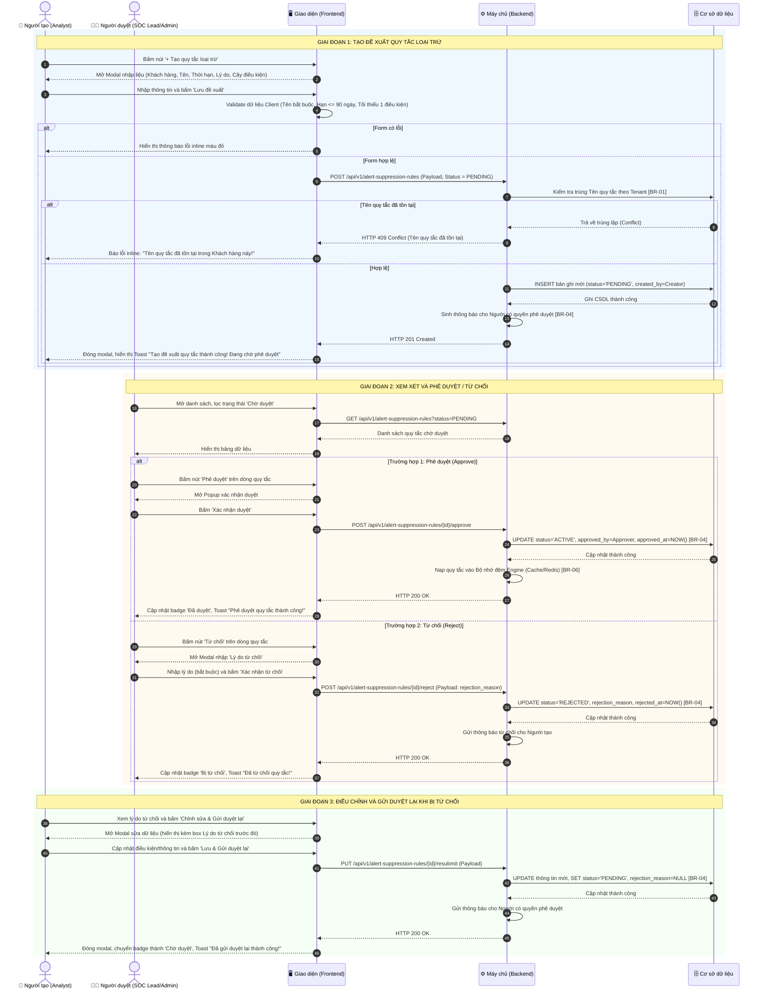
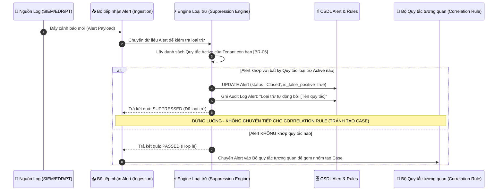

# ĐẶC TẢ YÊU CẦU PHẦN MỀM (SRS)
## TÍNH NĂNG: QUẢN LÝ QUY TẮC LOẠI TRỪ CẢNH BÁO (ALERT SUPPRESSION / ALLOWLIST RULES)

---

# 1. THÔNG TIN CHUNG CHỨC NĂNG

| Thuộc tính | Nội dung |
| :--- | :--- |
| **Mã chức năng** | `SOAR_ALERT_SUPPRESS_01` |
| **Tên chức năng** | Quản lý Quy tắc loại trừ cảnh báo (Alert Suppression / Allowlist Rules) |
| **Mô tả tổng quan** | Tính năng này cho phép các kỹ sư an ninh (người dùng có quyền tạo/sửa/xóa) thiết lập các đề xuất quy tắc loại trừ cảnh báo nhiễu hoặc các hoạt động nghiệp vụ hợp lệ (như quét lỗ hổng định kỳ của máy chủ Nessus/Qualys, hoạt động diễn tập Pentest nội bộ, IP máy trạm của đội kiểm thử), và cho phép cấp quản lý (người dùng có quyền phê duyệt) xem xét, phê duyệt hoặc từ chối đề xuất. Cảnh báo khớp với quy tắc loại trừ đang hoạt động sẽ tự động chuyển sang trạng thái đã xử lý (`Closed`), gắn cờ cảnh báo giả (`is_false_positive = true`) và bị chặn không cho kích hoạt tạo Sự việc (Case) rác. Tính năng đảm bảo an toàn vận hành thông qua việc bắt buộc cấu hình thời hạn hiệu lực, lý do nghiệp vụ, quy trình phê duyệt chặt chẽ và cơ chế sửa/xóa/gửi duyệt lại minh bạch. |
| **Phạm vi tính năng** | - **Bao gồm:**<br>&nbsp;&nbsp;+ Xem danh sách quy tắc loại trừ theo từng Khách hàng (Tenant) với đầy đủ trạng thái và bộ lọc tìm kiếm.<br>&nbsp;&nbsp;+ Tạo mới đề xuất quy tắc loại trừ với Cây điều kiện lọc (Condition Tree) đa cấp (AND/OR, trường thuộc tính, toán tử so sánh, giá trị).<br>&nbsp;&nbsp;+ Bắt buộc thiết lập Thời hạn hiệu lực (tối đa 90 ngày) và Lý do loại trừ.<br>&nbsp;&nbsp;+ Quy trình Phê duyệt (Approve) và Từ chối (Reject - bắt buộc nhập lý do từ chối).<br>&nbsp;&nbsp;+ Chỉnh sửa, xóa đề xuất khi đang Chờ duyệt (`Pending`) hoặc Bị từ chối (`Rejected`).<br>&nbsp;&nbsp;+ Cơ chế "Lưu & Gửi duyệt lại" (Resubmit) chuyển bản ghi từ Bị từ chối sang Chờ duyệt.<br>&nbsp;&nbsp;+ Bật/Tắt (Active/Inactive) nhanh quy tắc đã duyệt mà không cần xóa.<br>&nbsp;&nbsp;+ Kiểm soát an toàn khi sửa quy tắc đang Hoạt động (chuyển về Chờ duyệt lại nếu sửa điều kiện lọc/thời hạn).<br>&nbsp;&nbsp;+ Engine tự động so khớp và loại trừ Alert ngay tại thời điểm tiếp nhận dữ liệu (Ingestion Pipeline).<br>- **Không bao gồm:**<br>&nbsp;&nbsp;+ Tự động khôi phục hoặc mở lại các Alert đã bị loại trừ trong quá khứ.<br>&nbsp;&nbsp;+ Quản lý cấu hình tích hợp nguồn log (thuộc phân hệ Integration Sources). |
| **Điều kiện trước** | 1. Người dùng đã đăng nhập thành công vào hệ thống SOAR.<br>2. Tài khoản của người dùng đã được phân quyền truy cập chức năng Quy tắc loại trừ (thuộc vai trò Người dùng có quyền tạo/sửa/xóa hoặc Người dùng có quyền phê duyệt).<br>3. Đã tồn tại ít nhất 01 Khách hàng (Tenant) hợp lệ trên hệ thống để gán phạm vi áp dụng quy tắc.<br>4. Danh mục các trường dữ liệu cảnh báo (Alert Schema: `Mức độ`, `Nguồn`, `srcAddr`, `destAddr`, `destPort`, `EventCode`...) đã được nạp sẵn vào hệ thống để phục vụ việc chọn điều kiện lọc. |
| **Điều kiện sau** | 1. **Khi tạo đề xuất thành công:** Bản ghi quy tắc mới được lưu vào CSDL ở trạng thái `Pending` (Chờ duyệt) hoặc `Active` (nếu người tạo có quyền phê duyệt ngay); hiển thị ở đầu danh sách; gửi thông báo đến cấp quản lý.<br>2. **Khi phê duyệt thành công:** Trạng thái chuyển sang `Active` (Hoạt động); ghi nhận `approved_by` và `approved_at`; Engine nhận diện quy tắc để bắt đầu loại trừ alert thực tế.<br>3. **Khi từ chối thành công:** Trạng thái chuyển sang `Rejected` (Bị từ chối); ghi nhận `rejection_reason`; gửi thông báo cho người đề xuất.<br>4. **Khi xóa thành công:** Bản ghi quy tắc bị xóa khỏi hệ thống (Soft delete); ghi nhận Audit Log.<br>5. **Khi có Alert phát sinh khớp quy tắc:** Alert chuyển trạng thái sang `Closed`, `is_false_positive = true`, ghi Audit Log trên Alert và ngăn chặn tạo Case. |
| **Ngoại lệ tổng quan** | 1. Lỗi mất kết nối CSDL hoặc máy chủ không phản hồi: Hiển thị thông báo lỗi hệ thống, không lưu thay đổi và giữ nguyên dữ liệu trên form để người dùng không bị mất nội dung đã nhập.<br>2. Xung đột dữ liệu (Concurrency Conflict): Bản ghi đang được chỉnh sửa nhưng vừa bị người khác phê duyệt hoặc xóa: Hệ thống thông báo xung đột và tự động tải lại dữ liệu mới nhất.<br>3. Alert có cấu trúc dữ liệu không đúng chuẩn hoặc thiếu trường so sánh: Bỏ qua việc áp dụng quy tắc đối với trường thiếu, cảnh báo được chuyển tiếp qua luồng xử lý thông thường để tránh bỏ lọt sự cố. |

---

# 2. MA TRẬN PHÂN QUYỀN

Bảng phân quyền kiểm soát truy cập và phạm vi thao tác dữ liệu đối với tính năng Quản lý Quy tắc loại trừ cảnh báo:

| Vai trò | Xem | Thêm mới | Chỉnh sửa | Xóa | Tác vụ đặc biệt | Phạm vi dữ liệu |
| :--- | :---: | :---: | :---: | :---: | :--- | :--- |
| **Người dùng có quyền phê duyệt**<br>*(SOC Lead / Security Admin)* | ✅ | ✅ | ✅ | ✅ | • Phê duyệt quy tắc (Approve)<br>• Từ chối quy tắc (Reject)<br>• Bật / Tắt quy tắc (Toggle Active/Inactive)<br>• Tạo và Kích hoạt ngay (Save & Approve) | Toàn bộ quy tắc trong phạm vi Khách hàng (Tenant) được phân công quản lý. |
| **Người dùng có quyền tạo/sửa/xóa**<br>*(Security Analyst / Kỹ sư SOC)* | ✅ | ✅ | ✅ | ✅ | • Gửi duyệt lại quy tắc bị từ chối (Resubmit)<br>• Xem lý do từ chối | • Xem toàn bộ quy tắc trong Tenant.<br>• Chỉ được Chỉnh sửa / Xóa các quy tắc do chính mình tạo khi ở trạng thái `Pending` hoặc `Rejected`.<br>• Không được sửa quy tắc `Active` hoặc quy tắc của người khác. |

*Ghi chú ràng buộc kiểm soát truy cập:*
1. Nút **"Phê duyệt"** và **"Từ chối"** chỉ hiển thị và kích hoạt đối với tài khoản thuộc vai trò *Người dùng có quyền phê duyệt*.
2. Nút **"Lưu & Phê duyệt ngay"** trên form tạo mới chỉ hiển thị cho *Người dùng có quyền phê duyệt*. Đối với *Người dùng có quyền tạo/sửa/xóa*, nút này được thay thế bằng **"Lưu đề xuất"** (trạng thái lưu mặc định là `Pending`).
3. Toggle **Bật / Tắt (Active/Inactive)** trên bảng danh sách chỉ cho phép *Người dùng có quyền phê duyệt* thao tác.

---

# 3. BIỂU ĐỒ LUỒNG XỬ LÝ

### 3.1. Sơ đồ tuần tự: Vòng đời Đề xuất, Phê duyệt, Từ chối và Gửi duyệt lại Quy tắc (Sequence Diagram)



---

### 3.2. Sơ đồ tuần tự: Hoạt động của Engine Loại trừ Cảnh báo tự động (Suppression Execution)



---

# 4. THIẾT KẾ UI VÀ ĐẶC TẢ CHI TIẾT COMPONENTS

### 4.1. Màn hình Danh sách Quy tắc loại trừ (Alert Suppression Rules Listing)

Toàn bộ các thành phần trên giao diện danh sách được mô tả chi tiết trong bảng sau:

| STT | Tên trường | Loại dữ liệu | Mô tả |
| :--- | :--- | :--- | :--- |
| **1** | **Tiêu đề trang** | Label | - Hiển thị tiêu đề chính của trang: `"QUY TẮC LOẠI TRỪ CẢNH BÁO"` (`"ALERT SUPPRESSION RULES"`).<br>- **Vị trí:** Góc trên bên trái giao diện. |
| **2** | **Thanh tìm kiếm** | Searchbox | - Cho phép người dùng nhập từ khóa để tìm kiếm nhanh theo Tên quy tắc hoặc Lý do loại trừ.<br>- **Placeholder:**<br>&nbsp;&nbsp;+ VI: Tìm kiếm theo: Tên quy tắc, Lý do...<br>&nbsp;&nbsp;+ EN: Search by: Rule name, Reason...<br>- **Giá trị mặc định:** Trống.<br>- **Giới hạn ký tự:** Tối đa 255 ký tự.<br>- **Quy tắc Nghiệp vụ:** Tự động trim khoảng trắng đầu cuối; Tự động kích hoạt tìm kiếm sau 400ms kể từ khi ngừng gõ (Debounce). |
| **3** | **Bộ lọc Khách hàng** | Combobox | - Cho phép người dùng lọc danh sách quy tắc theo từng Khách hàng (Tenant).<br>- **Placeholder:**<br>&nbsp;&nbsp;+ VI: Chọn khách hàng<br>&nbsp;&nbsp;+ EN: Select customer<br>- **Nguồn dữ liệu:** Danh sách Khách hàng mà người dùng có quyền quản lý trong hệ thống.<br>- **Giá trị mặc định:** Khách hàng đầu tiên trong danh sách hoặc `Tất cả khách hàng` (nếu là Super Admin).<br>- **Chức năng tìm kiếm:** Có hỗ trợ tìm kiếm nhanh theo tên khách hàng.<br>- **Thông báo lỗi tương ứng:** Không có (do luôn có giá trị mặc định). |
| **4** | **Bộ lọc Trạng thái** | Combobox (Single-select) | - Cho phép người dùng lọc danh sách theo trạng thái phê duyệt của quy tắc.<br>- **Placeholder:** (Lược bỏ do có giá trị mặc định).<br>- **Nguồn dữ liệu:**<br>&nbsp;&nbsp;+ `Tất cả trạng thái` (`All statuses`) - (Giá trị: `ALL`)<br>&nbsp;&nbsp;+ `Chờ duyệt` (`Pending`) - (Giá trị: `PENDING`)<br>&nbsp;&nbsp;+ `Đã duyệt` (`Active`) - (Giá trị: `ACTIVE`)<br>&nbsp;&nbsp;+ `Bị từ chối` (`Rejected`) - (Giá trị: `REJECTED`)<br>- **Giá trị mặc định:** `Tất cả trạng thái`<br>- **Quy tắc Nghiệp vụ:** Khi thay đổi lựa chọn, hệ thống tự động tải lại bảng danh sách tương ứng.<br>- **Thông báo lỗi tương ứng:** Không có (do luôn có giá trị mặc định). |
| **5** | **Nút Làm mới** | Button (Icon) | - Cho phép người dùng tải lại dữ liệu mới nhất từ máy chủ.<br>- **Hành vi khi nhấn:** Xoay tròn icon và gọi lại API lấy danh sách quy tắc.<br>- **Quyền hạn truy cập:** Tất cả vai trò. |
| **6** | **Nút Tạo quy tắc loại trừ** | Button (Primary) | - Cho phép người dùng mở modal thêm mới đề xuất quy tắc loại trừ cảnh báo.<br>- **Nhãn nút:** `"+ Tạo quy tắc loại trừ"` (`"+ Create Suppression Rule"`).<br>- **Trạng thái mặc định:** Enabled.<br>- **Hành vi khi nhấn:** Mở Modal Tạo mới quy tắc loại trừ.<br>- **Quyền hạn truy cập:** Người dùng có quyền tạo/sửa/xóa và Người dùng có quyền phê duyệt. |
| **7** | **Bảng danh sách Quy tắc** | Datatable | - Hiển thị danh sách các quy tắc loại trừ dạng bảng. Hỗ trợ phân trang (Pagination: 10, 20, 50 dòng/trang) và sắp xếp (Sorting theo Thời hạn, Thời gian tạo, Tên quy tắc).<br>- **Đặc tả chi tiết các cột dữ liệu:**<br>&nbsp;&nbsp;+ **Cột Tên quy tắc:** Hiển thị tên quy tắc dưới dạng link màu xanh. Khi click vào tên: Mở modal xem chi tiết/chỉnh sửa quy tắc.<br>&nbsp;&nbsp;+ **Cột Khách hàng:** Hiển thị tên Khách hàng (Tenant) áp dụng quy tắc.<br>&nbsp;&nbsp;+ **Cột Thời hạn hiệu lực:** Hiển thị ngày giờ hết hạn theo định dạng `dd/mm/yyyy HH:mm`. Nếu thời hạn đã qua so với giờ hệ thống, hiển thị kèm nhãn icon cảnh báo màu cam: `"Đã quá hạn hiệu lực"` (`"Expired"`).<br>&nbsp;&nbsp;+ **Cột Lý do:** Hiển thị văn bản tóm tắt lý do loại trừ (tối đa 2 dòng, hỗ trợ hiển thị dấu `...` và tooltip xem toàn bộ nội dung khi hover).<br>&nbsp;&nbsp;+ **Cột Trạng thái:** Hiển thị nhãn Badge màu sắc:<br>&nbsp;&nbsp;&nbsp;&nbsp;* Badge Vàng: `Chờ duyệt` (`Pending`)<br>&nbsp;&nbsp;&nbsp;&nbsp;* Badge Xanh lá: `Đã duyệt` (`Active`)<br>&nbsp;&nbsp;&nbsp;&nbsp;* Badge Đỏ: `Bị từ chối` (`Rejected`)<br>&nbsp;&nbsp;&nbsp;&nbsp;* Nút Toggle Bật/Tắt (Kích hoạt/Vô hiệu hóa): Chỉ hiển thị trên dòng có trạng thái `Đã duyệt`. Bật (Xanh lá) = Đang hoạt động; Tắt (Xám) = Tạm dừng hoạt động. Chỉ vai trò Người dùng có quyền phê duyệt mới click được [BR-05].<br>&nbsp;&nbsp;+ **Cột Người tạo & Ngày tạo:** Hiển thị tài khoản người tạo kèm thời gian tạo (`dd/mm/yyyy HH:mm`).<br>&nbsp;&nbsp;+ **Cột Người duyệt & Ngày duyệt:** Hiển thị tài khoản người duyệt kèm thời gian duyệt. Nếu chưa duyệt, hiển thị dấu `-`.<br>&nbsp;&nbsp;+ **Cột Thao tác (Action):** Hiển thị menu chức năng ngữ cảnh (dạng nút icon 3 chấm dọc `...`):<br>&nbsp;&nbsp;&nbsp;&nbsp;* **Khi dòng ở trạng thái `Chờ duyệt`:**<br>&nbsp;&nbsp;&nbsp;&nbsp;&nbsp;&nbsp;- Nút `Chỉnh sửa`: Cho phép Người tạo và Người duyệt mở modal sửa.<br>&nbsp;&nbsp;&nbsp;&nbsp;&nbsp;&nbsp;- Nút `Xóa đề xuất`: Cho phép Người tạo hủy đề xuất, Người duyệt xóa bỏ.<br>&nbsp;&nbsp;&nbsp;&nbsp;&nbsp;&nbsp;- Nút `Phê duyệt`: Chỉ hiển thị cho Người có quyền phê duyệt.<br>&nbsp;&nbsp;&nbsp;&nbsp;&nbsp;&nbsp;- Nút `Từ chối`: Chỉ hiển thị cho Người có quyền phê duyệt.<br>&nbsp;&nbsp;&nbsp;&nbsp;* **Khi dòng ở trạng thái `Bị từ chối`:**<br>&nbsp;&nbsp;&nbsp;&nbsp;&nbsp;&nbsp;- Nút `Xem lý do từ chối`: Mở popup xem ghi chú từ chối.<br>&nbsp;&nbsp;&nbsp;&nbsp;&nbsp;&nbsp;- Nút `Chỉnh sửa & Gửi duyệt lại`: Mở modal sửa để gửi duyệt lại.<br>&nbsp;&nbsp;&nbsp;&nbsp;&nbsp;&nbsp;- Nút `Xóa`: Cho phép xóa hẳn quy tắc.<br>&nbsp;&nbsp;&nbsp;&nbsp;* **Khi dòng ở trạng thái `Đã duyệt`:**<br>&nbsp;&nbsp;&nbsp;&nbsp;&nbsp;&nbsp;- Nút `Chỉnh sửa`: Chỉ cho phép Người có quyền phê duyệt (nếu sửa điều kiện/thời hạn sẽ yêu cầu xác nhận chuyển về Chờ duyệt lại [BR-05]).<br>&nbsp;&nbsp;&nbsp;&nbsp;&nbsp;&nbsp;- Nút `Xóa quy tắc`: Chỉ cho phép Người có quyền phê duyệt (bật popup cảnh báo rủi ro). |
| **8** | **Trạng thái Trống (Empty State)** | UI Container | - Hiển thị khi danh sách chưa có quy tắc nào hoặc không có kết quả phù hợp với bộ lọc tìm kiếm.<br>- **Biểu tượng:** Icon clipboard trống màu xám.<br>- **Văn bản thông báo:** `"Chưa có quy tắc loại trừ cảnh báo nào"` (`"No alert suppression rules found"`).<br>- **Nút hành động kèm theo:** Nút `"+ Tạo quy tắc loại trừ"` để điều hướng người dùng tạo mới nhanh. |
| **9** | **Trạng thái Lỗi kết nối (Error State)** | UI Container | - Hiển thị khi gọi API lấy danh sách thất bại hoặc mất kết nối mạng.<br>- **Biểu tượng:** Icon cảnh báo lỗi mạng màu đỏ.<br>- **Văn bản thông báo:** `"Không thể tải danh sách quy tắc loại trừ. Vui lòng kiểm tra lại kết nối mạng!"` (`"Failed to load suppression rules. Please check your network connection!"`).<br>- **Nút hành động kèm theo:** Nút `"Thử lại"` (`"Retry"`). |

---

### 4.2. Modal Tạo mới & Chỉnh sửa Quy tắc loại trừ

Toàn bộ các trường thông tin trong Modal Tạo mới / Chỉnh sửa được mô tả chi tiết trong bảng sau:

| STT | Tên trường | Loại dữ liệu | Mô tả |
| :--- | :--- | :--- | :--- |
| **1** | **Tiêu đề Modal** | Label | - Hiển thị tiêu đề modal phụ thuộc vào chế độ thao tác:<br>&nbsp;&nbsp;+ Khi tạo mới: `"TẠO QUY TẮC LOẠI TRỪ CẢNH BÁO"` (`"CREATE ALERT SUPPRESSION RULE"`).<br>&nbsp;&nbsp;+ Khi chỉnh sửa: `"CHỈNH SỬA QUY TẮC LOẠI TRỪ CẢNH BÁO"` (`"EDIT ALERT SUPPRESSION RULE"`).<br>&nbsp;&nbsp;+ Khi gửi duyệt lại: `"ĐIỀU CHỈNH & GỬI DUYỆT LẠI QUY TẮC"` (`"RESUBMIT SUPPRESSION RULE"`). |
| **2** | **Nút Đóng (Icon X)** | Button (Icon) | - Cho phép người dùng đóng modal.<br>- **Hành vi khi nhấn:** Nếu form đã có thay đổi dữ liệu, hiển thị Modal xác nhận hủy bỏ (STT 11). Nếu form chưa thay đổi, đóng ngay modal. |
| **3** | **Khung hiển thị Lý do từ chối (Chỉ ở chế độ Gửi duyệt lại)** | Alert Box (Warning) | - Hiển thị thông tin lý do bị từ chối trước đó do Người duyệt ghi nhận, giúp người đề xuất biết để sửa cho đúng.<br>- **Điều kiện hiển thị:** Chỉ hiển thị khi mở modal sửa một quy tắc đang ở trạng thái `Bị từ chối`.<br>- **Nội dung:** Icon thông tin màu cam kèm văn bản: `"Lý do từ chối trước đó: {Nội dung lý do từ chối}"` (`"Previous rejection reason: {Rejection reason}"`). |
| **4** | **Tên quy tắc** | Textbox | - Người dùng bắt buộc nhập vào tên định danh của quy tắc loại trừ.<br>- **Placeholder:**<br>&nbsp;&nbsp;+ VI: Nhập tên quy tắc loại trừ (ví dụ: Loại trừ quét Nessus định kỳ)<br>&nbsp;&nbsp;+ EN: Enter rule name (e.g. Suppress periodic Nessus scan)<br>- **Giá trị mặc định:** Trống (khi tạo mới) / Tên hiện tại (khi sửa).<br>- **Giới hạn ký tự:** Tối đa 255 ký tự. Hệ thống tự động chặn gõ khi đạt 255 ký tự.<br>- **Kiểu ký tự hợp lệ:** Tất cả ký tự UTF-8.<br>- **Quy tắc Nghiệp vụ:**<br>&nbsp;&nbsp;1. Tự động trim khoảng trắng ở đầu và cuối chuỗi.<br>&nbsp;&nbsp;2. Tên quy tắc phải là duy nhất trong cùng một Khách hàng/Tenant (Xem chi tiết tại [BR-01]).<br>- **Thông báo lỗi tương ứng:**<br>&nbsp;&nbsp;+ Trống và nhấn Lưu: Hiển thị lỗi inline màu đỏ: `"Tên quy tắc là bắt buộc!"` (`"Rule name is required!"`).<br>&nbsp;&nbsp;+ Trùng lặp trong Tenant: Hiển thị lỗi inline màu đỏ: `"Tên quy tắc đã tồn tại trong Khách hàng này!"` (`"Rule name already exists in this Customer!"`). |
| **5** | **Khách hàng (Tenant)** | Combobox (Single-select) | - Cho phép người dùng chọn Khách hàng áp dụng quy tắc loại trừ.<br>- **Placeholder:** (Lược bỏ do có giá trị mặc định sẵn).<br>- **Nguồn dữ liệu:** Danh sách Khách hàng người dùng được phân quyền.<br>- **Giá trị mặc định:** Khách hàng đang chọn ở màn hình danh sách bên ngoài.<br>- **Chức năng tìm kiếm:** Có.<br>- **Quy tắc Nghiệp vụ:** Khi chỉnh sửa bản ghi đã tạo, trường này bị khóa (Read-only / Disabled) để tránh xung đột dữ liệu đa người thuê [BR-07].<br>- **Thông báo lỗi tương ứng:** Không có (do luôn có giá trị mặc định). |
| **6** | **Thời hạn hiệu lực** | Date-Time Picker | - Người dùng bắt buộc chọn ngày và giờ hết hạn của quy tắc loại trừ.<br>- **Định dạng hiển thị & nhập:** `dd/mm/yyyy HH:mm`<br>- **Cách thức nhập:** Cho phép chọn từ bảng lịch kết hợp đồng hồ chọn giờ.<br>- **Giá trị mặc định:** Trống (khi tạo mới) / Thời hạn đã lưu (khi sửa).<br>- **Ràng buộc thời gian (Constraints):**<br>&nbsp;&nbsp;+ Min Datetime: Phải lớn hơn thời điểm hiện tại của hệ thống ít nhất 10 phút.<br>&nbsp;&nbsp;+ Max Datetime: Không được vượt quá **90 ngày** tính từ ngày tạo [BR-02].<br>- **Quy tắc Nghiệp vụ:** Vô hiệu hóa việc chọn các ngày quá khứ và các ngày vượt quá 90 ngày trên giao diện lịch chọn.<br>- **Thông báo lỗi tương ứng:**<br>&nbsp;&nbsp;+ Trống và nhấn Lưu: Hiển thị lỗi inline màu đỏ: `"Thời hạn hiệu lực là bắt buộc!"` (`"Expiration date is required!"`).<br>&nbsp;&nbsp;+ Nhỏ hơn thời điểm hiện tại: Hiển thị lỗi inline màu đỏ: `"Thời hạn hiệu lực phải lớn hơn thời điểm hiện tại!"` (`"Expiration date must be greater than current time!"`).<br>&nbsp;&nbsp;+ Vượt quá 90 ngày: Hiển thị lỗi inline màu đỏ: `"Thời hạn hiệu lực không được vượt quá 90 ngày kể từ ngày tạo!"` (`"Expiration date must not exceed 90 days from creation date!"`). |
| **7** | **Lý do loại trừ** | Textarea | - Người dùng bắt buộc nhập căn cứ, nguyên nhân nghiệp vụ cần tạo quy tắc loại trừ này.<br>- **Placeholder:**<br>&nbsp;&nbsp;+ VI: Nhập lý do loại trừ (ví dụ: Dải IP máy quét lỗ hổng đã được phê duyệt trong kế hoạch bảo trì quý 3...)<br>&nbsp;&nbsp;+ EN: Enter suppression reason (e.g. Approved vulnerability scanner IP range for Q3 maintenance...)<br>- **Giá trị mặc định:** Trống.<br>- **Giới hạn ký tự:** Tối đa 500 ký tự. Có hiển thị bộ đếm ký tự dạng `{n}/500`. Tự động chặn gõ khi đạt 500 ký tự.<br>- **Quy tắc Nghiệp vụ:** Tự động trim khoảng trắng đầu cuối.<br>- **Thông báo lỗi tương ứng:**<br>&nbsp;&nbsp;+ Trống và nhấn Lưu: Hiển thị lỗi inline màu đỏ: `"Lý do loại trừ là bắt buộc!"` (`"Suppression reason is required!"`). |
| **8** | **Cấu hình Cây điều kiện lọc (Condition Tree)** | Custom Builder | - Cho phép người dùng xây dựng các điều kiện lọc cảnh báo đa cấp để xác định các cảnh báo cần bị loại trừ (Tái sử dụng 100% component Bước 1 của Correlation Rule).<br>- **Cấu trúc chi tiết của Cây điều kiện:**<br>&nbsp;&nbsp;+ **Toán tử nhóm:** Nút toggle chọn giữa `VÀ (AND)` hoặc `HOẶC (OR)`. Mặc định: `VÀ (AND)`.<br>&nbsp;&nbsp;+ **Nút "+ Thêm điều kiện":** Click để bổ sung 1 dòng điều kiện vào nhóm hiện tại.<br>&nbsp;&nbsp;+ **Nút "+ Thêm nhóm":** Click để tạo một nhóm điều kiện lồng nhau (Sub-group).<br>&nbsp;&nbsp;+ **Các trường trong 1 dòng điều kiện:**<br>&nbsp;&nbsp;&nbsp;&nbsp;* *Chọn trường lọc (Dropdown):* `Mức độ`, `Nguồn`, `IP nguồn (srcAddr)`, `IP đích (destAddr)`, `Cổng đích (destPort)`, `Tên máy chủ (host)`, `Mã sự kiện (EventCode)`, `Nội dung cảnh báo (content)`.<br>&nbsp;&nbsp;&nbsp;&nbsp;* *Chọn toán tử (Dropdown):* Bằng (`=`), Khác (`!=`), Chứa (`contains`), Nằm trong danh sách (`in`), Không nằm trong (`not in`), Thuộc dải mạng (`cidr`), Biểu thức chính quy (`regex`).<br>&nbsp;&nbsp;&nbsp;&nbsp;* *Giá trị so sánh (Input/Dropdown):* Nhập giá trị tương ứng (ví dụ nhập `192.168.1.50` hoặc chọn mức `Low`).<br>&nbsp;&nbsp;&nbsp;&nbsp;* *Nút Xóa dòng (Icon thùng rác):* Click để xóa dòng điều kiện.<br>- **Quy tắc Nghiệp vụ:** Bắt buộc phải cấu hình ít nhất 01 dòng điều kiện hoàn chỉnh (đầy đủ Trường, Toán tử và Giá trị) (Xem chi tiết tại [BR-03]).<br>- **Thông báo lỗi tương ứng:**<br>&nbsp;&nbsp;+ Chưa có điều kiện nào hoặc có dòng để trống giá trị: Hiển thị lỗi inline màu đỏ dưới khung điều kiện: `"Vui lòng cấu hình tối thiểu 01 điều kiện lọc hợp lệ!"` (`"Please configure at least one valid filter condition!"`). |
| **9** | **Nút Hủy bỏ** | Button (Default) | - Cho phép người dùng đóng modal hủy bỏ thao tác.<br>- **Hành vi khi nhấn:** Nếu dữ liệu form đã bị thay đổi, mở Modal xác nhận hủy bỏ. Nếu chưa thay đổi, đóng modal ngay. |
| **10** | **Nút Lưu hành động (Action Save Button)** | Button (Primary) | - Tự động thay đổi nhãn và hành vi tùy theo vai trò người dùng và trạng thái bản ghi:<br>&nbsp;&nbsp;+ **Trường hợp 1: Vai trò Người dùng có quyền tạo/sửa/xóa tạo mới hoặc sửa bản ghi Pending:**<br>&nbsp;&nbsp;&nbsp;&nbsp;* Nhãn: `"Lưu đề xuất"` (`"Save Proposal"`).<br>&nbsp;&nbsp;&nbsp;&nbsp;* Hành vi: Validate dữ liệu, gửi API lưu bản ghi ở trạng thái `Pending`, hiển thị loading spinner, hiển thị Toast thành công.<br>&nbsp;&nbsp;+ **Trường hợp 2: Vai trò Người dùng có quyền phê duyệt tạo mới:**<br>&nbsp;&nbsp;&nbsp;&nbsp;* Nhãn: `"Lưu & Phê duyệt ngay"` (`"Save & Approve"`).<br>&nbsp;&nbsp;&nbsp;&nbsp;* Hành vi: Validate dữ liệu, lưu bản ghi ở trạng thái `Active` ngay lập tức, ghi nhận `approved_by` chính là người dùng hiện tại.<br>&nbsp;&nbsp;+ **Trường hợp 3: Khi chỉnh sửa bản ghi đang ở trạng thái Bị từ chối (Rejected):**<br>&nbsp;&nbsp;&nbsp;&nbsp;* Nhãn: `"Lưu & Gửi duyệt lại"` (`"Save & Resubmit"`).<br>&nbsp;&nbsp;&nbsp;&nbsp;* Hành vi: Cập nhật dữ liệu, tự động chuyển trạng thái từ `Rejected` sang `Pending`, xóa lý do từ chối cũ, gửi thông báo cho cấp quản lý duyệt lại [BR-04]. |
| **11** | **Modal Xác nhận Hủy bỏ (Discard Changes Modal)** | Popup Modal | - Hiển thị cảnh báo khi người dùng bấm Hủy hoặc Icon Đóng khi form đã nhập liệu dở dang.<br>- **Tiêu đề:** `"Xác nhận hủy bỏ"` (`"Discard Changes"`).<br>- **Nội dung:** `"Các thông tin bạn đã nhập chưa được lưu. Bạn có chắc chắn muốn thoát không?"` (`"Your changes have not been saved. Are you sure you want to discard them?"`).<br>- **Nút "Tiếp tục nhập":** Đóng popup xác nhận, giữ nguyên form nhập liệu.<br>- **Nút "Xác nhận thoát":** Đóng toàn bộ modal và hủy bỏ dữ liệu đang nhập. |

---

### 4.3. Modal Phê duyệt Quy tắc (Approve Rule Modal)

Modal hiển thị khi Người có quyền phê duyệt click nút **"Phê duyệt"** trên dòng quy tắc đang Chờ duyệt:

| STT | Tên trường | Loại dữ liệu | Mô tả |
| :--- | :--- | :--- | :--- |
| **1** | **Tiêu đề Modal** | Label | - Hiển thị: `"PHÊ DUYỆT QUY TẮC LOẠI TRỪ"` (`"APPROVE SUPPRESSION RULE"`). |
| **2** | **Nội dung tóm tắt** | Read-only Summary | - Hiển thị tóm tắt thông tin quy tắc được duyệt:<br>&nbsp;&nbsp;+ Tên quy tắc: `{Tên quy tắc}`<br>&nbsp;&nbsp;+ Khách hàng: `{Tên khách hàng}`<br>&nbsp;&nbsp;+ Thời hạn hiệu lực: `{dd/mm/yyyy HH:mm}`<br>&nbsp;&nbsp;+ Lý do loại trừ: `{Lý do}`<br>&nbsp;&nbsp;+ Số lượng điều kiện lọc: `{n} điều kiện`<br>&nbsp;&nbsp;+ Người đề xuất: `{Tên người tạo}`<br>- Văn bản cảnh báo: `"Sau khi phê duyệt, toàn bộ cảnh báo phát sinh khớp với quy tắc này sẽ tự động chuyển sang trạng thái Đã xử lý và không tạo Sự việc."` (`"Once approved, all alerts matching this rule will be automatically closed and will not create Cases."`). |
| **3** | **Nút Hủy** | Button (Default) | - Đóng modal xác nhận duyệt, không thay đổi trạng thái quy tắc. |
| **4** | **Nút Xác nhận Phê duyệt** | Button (Success) | - Người dùng bấm để thực hiện phê duyệt quy tắc.<br>- **Hành vi khi nhấn:** Chuyển trạng thái nút sang Loading, gửi API `POST /api/v1/alert-suppression-rules/{id}/approve`, cập nhật trạng thái quy tắc thành `Đã duyệt` (`Active`), nạp vào Engine lọc, đóng modal, hiển thị Toast: `"Phê duyệt quy tắc thành công!"` (`"Rule approved successfully!"`).<br>- **Quyền hạn truy cập:** Chỉ Người có quyền phê duyệt. |

---

### 4.4. Modal Từ chối Quy tắc (Reject Rule Modal)

Modal hiển thị khi Người có quyền phê duyệt click nút **"Từ chối"** trên dòng quy tắc đang Chờ duyệt:

| STT | Tên trường | Loại dữ liệu | Mô tả |
| :--- | :--- | :--- | :--- |
| **1** | **Tiêu đề Modal** | Label | - Hiển thị: `"TỪ CHỐI QUY TẮC LOẠI TRỪ"` (`"REJECT SUPPRESSION RULE"`). |
| **2** | **Nội dung cảnh báo** | Label | - Hiển thị cảnh báo: `"Vui lòng nhập lý do từ chối để người đề xuất biết nguyên nhân và điều chỉnh lại."` (`"Please provide a rejection reason so the requester can adjust the rule accordingly."`). |
| **3** | **Lý do từ chối** | Textarea | - Người duyệt bắt buộc nhập nguyên nhân không phê duyệt đề xuất.<br>- **Placeholder:**<br>&nbsp;&nbsp;+ VI: Nhập lý do từ chối phê duyệt (ví dụ: Dải IP quá rộng có nguy cơ lọt tấn công, cần thu hẹp dải mạng...)...<br>&nbsp;&nbsp;+ EN: Enter rejection reason (e.g. IP range is too broad, please narrow down the subnet...)...<br>- **Giá trị mặc định:** Trống.<br>- **Giới hạn ký tự:** Tối đa 500 ký tự. Có bộ đếm ký tự.<br>- **Thông báo lỗi tương ứng:**<br>&nbsp;&nbsp;+ Để trống và bấm Xác nhận: Hiển thị lỗi inline màu đỏ: `"Lý do từ chối là bắt buộc!"` (`"Rejection reason is required!"`). |
| **4** | **Nút Hủy** | Button (Default) | - Đóng modal từ chối, giữ nguyên trạng thái Chờ duyệt. |
| **5** | **Nút Xác nhận Từ chối** | Button (Danger) | - Người duyệt bấm để xác nhận từ chối đề xuất.<br>- **Hành vi khi nhấn:** Validate lý do từ chối, gửi API cập nhật trạng thái sang `Bị từ chối` (`Rejected`), ghi nhận lý do, gửi thông báo cho người đề xuất, đóng modal, hiển thị Toast: `"Đã từ chối quy tắc loại trừ!"` (`"Rule has been rejected!"`).<br>- **Quyền hạn truy cập:** Chỉ Người có quyền phê duyệt. |

---

### 4.5. Modal Xác nhận Xóa Quy tắc (Delete Rule Modal)

Modal hiển thị khi người dùng chọn thao tác **"Xóa quy tắc"** hoặc **"Xóa đề xuất"**:

| STT | Tên trường | Loại dữ liệu | Mô tả |
| :--- | :--- | :--- | :--- |
| **1** | **Tiêu đề Modal** | Label | - Hiển thị: `"XÁC NHẬN XÓA QUY TẮC LOẠI TRỪ"` (`"CONFIRM RULE DELETION"`). |
| **2** | **Nội dung cảnh báo** | Alert Box (Danger) | - Hiển thị văn bản cảnh báo phụ thuộc vào trạng thái quy tắc bị xóa:<br>&nbsp;&nbsp;+ Nếu xóa bản ghi `Pending` hoặc `Rejected`: `"Bạn có chắc chắn muốn xóa đề xuất quy tắc [Tên quy tắc] không? Thao tác này không thể hoàn tác."` (`"Are you sure you want to delete proposal [Rule name]? This action cannot be undone."`).<br>&nbsp;&nbsp;+ Nếu xóa bản ghi `Active` (Đã duyệt): `"CẢNH BÁO NGUY HIỂM: Quy tắc [Tên quy tắc] đang hoạt động để lọc cảnh báo. Khi xóa, các cảnh báo khớp điều kiện sẽ không còn bị loại trừ nữa và có thể sinh Sự việc. Bạn có chắc chắn muốn xóa không?"` (`"DANGER: Rule [Rule name] is currently active. Deleting it will stop suppressing matching alerts and may generate Cases. Are you sure you want to delete?"`). |
| **3** | **Nút Hủy** | Button (Default) | - Đóng modal xóa, không xóa dữ liệu. |
| **4** | **Nút Xác nhận Xóa** | Button (Danger) | - Người dùng bấm để thực hiện xóa bản ghi.<br>- **Hành vi khi nhấn:** Gọi API xóa bản ghi khỏi hệ thống (Soft delete), nếu là quy tắc Active thì gỡ khỏi Engine lọc, hiển thị Toast: `"Xóa quy tắc loại trừ thành công!"` (`"Rule deleted successfully!"`). |

---

# 5. QUY TẮC NGHIỆP VỤ CHUYÊN SÂU (BUSINESS RULES)

### Bảng tổng hợp quy tắc nghiệp vụ:
| Mã BR | Tên quy tắc nghiệp vụ | Phân loại | Mức độ ưu tiên |
| :--- | :--- | :--- | :---: |
| **[BR-01]** | Quy tắc kiểm tra tính duy nhất của Tên quy tắc loại trừ theo Tenant | Ràng buộc dữ liệu & Thuật toán | Bắt buộc |
| **[BR-02]** | Quy tắc ràng buộc Thời hạn hiệu lực (TTL/Expiration Date) | Ràng buộc dữ liệu & Thuật toán | Bắt buộc |
| **[BR-03]** | Quy tắc xác thực cấu trúc Cây điều kiện lọc (Condition Tree Validation) | Ràng buộc dữ liệu & Thuật toán | Bắt buộc |
| **[BR-04]** | Quy tắc quản lý Vòng đời trạng thái và Luồng phê duyệt (Lifecycle & State Machine) | Quy trình & Vòng đời trạng thái | Bắt buộc |
| **[BR-05]** | Quy tắc kiểm soát an toàn khi Chỉnh sửa hoặc Tắt quy tắc đang Hoạt động | Quy trình & Vòng đời trạng thái | Bắt buộc |
| **[BR-06]** | Thuật toán so khớp và Cơ chế Engine loại trừ cảnh báo tự động | Ràng buộc dữ liệu & Thuật toán | Bắt buộc |
| **[BR-07]** | Quy tắc phân quyền và Cô lập dữ liệu đa người thuê (Multi-tenancy Isolation) | Bảo mật & Sinh dữ liệu | Bắt buộc |

---

### Chi tiết từng quy tắc:

### [BR-01] Quy tắc kiểm tra tính duy nhất của Tên quy tắc loại trừ theo Tenant
- **Phân loại:** Ràng buộc dữ liệu & Thuật toán.
- **Phạm vi áp dụng:** Trong cùng một Không gian khách hàng (Tenant-level). Áp dụng cho cả luồng Web UI và API.
- **Điều kiện kích hoạt:** Khi người dùng bấm nút Lưu đề xuất / Lưu & Phê duyệt ngay hoặc gửi request API `POST /api/v1/alert-suppression-rules`.
- **Logic xử lý chi tiết:**
  1. Hệ thống tự động loại bỏ toàn bộ khoảng trắng dư thừa ở đầu và cuối chuỗi (`trim()`) của trường `rule_name`.
  2. Thay thế nhiều khoảng trắng liên tiếp ở giữa chuỗi thành một khoảng trắng duy nhất.
  3. Chuyển đổi chuỗi về dạng chữ thường (Lowercase) để kiểm tra đối soát trong CSDL (không phân biệt chữ hoa/chữ thường - Case-insensitive).
  4. Thực hiện truy vấn trong CSDL:
     ```sql
     SELECT COUNT(1) FROM alert_suppression_rules 
     WHERE LOWER(rule_name) = LOWER(:rule_name) 
       AND tenant_id = :tenant_id 
       AND is_deleted = false 
       AND (:current_rule_id IS NULL OR id != :current_rule_id);
     ```
  5. Nếu kết quả trả về `> 0`: Xác định tên quy tắc đã tồn tại.
- **Hành vi khi vi phạm:**
  - Hệ thống từ chối lưu, rollback transaction CSDL và trả về mã lỗi HTTP `409 Conflict`.
  - Trên giao diện: Hiển thị lỗi inline màu đỏ dưới trường Tên quy tắc: `"Tên quy tắc đã tồn tại trong Khách hàng này!"` (`"Rule name already exists in this Customer!"`).

---

### [BR-02] Quy tắc ràng buộc Thời hạn hiệu lực (TTL/Expiration Date)
- **Phân loại:** Ràng buộc dữ liệu & Thuật toán.
- **Phạm vi áp dụng:** Toàn bộ hệ thống SOAR.
- **Điều kiện kích hoạt:** Khi kiểm tra trường `valid_until` lúc lưu form tạo mới hoặc chỉnh sửa quy tắc.
- **Logic xử lý chi tiết:**
  1. Thời điểm hết hạn hiệu lực (`valid_until`) bắt buộc phải thỏa mãn công thức:
     $$\text{Thời điểm hiện tại} + 10 \text{ phút} \le \text{valid\_until} \le \text{Thời điểm hiện tại} + 90 \text{ ngày}$$
  2. Hệ thống **tuyệt đối không cho phép loại trừ vĩnh viễn (Không giới hạn thời gian)** để tránh rủi ro quên tắt quy tắc, dẫn đến việc bỏ sót tấn công mạng thực sự trong tương lai.
  3. Nếu người dùng muốn tiếp tục loại trừ sau khi hết hạn, họ bắt buộc phải thực hiện thao tác Chỉnh sửa gia hạn thời gian và gửi phê duyệt lại theo đúng quy trình [BR-05].
- **Hành vi khi vi phạm:**
  - Nếu `valid_until <= NOW() + 10 phút`: Báo lỗi inline `"Thời hạn hiệu lực phải lớn hơn thời điểm hiện tại ít nhất 10 phút!"`.
  - Nếu `valid_until > NOW() + 90 ngày`: Báo lỗi inline `"Thời hạn hiệu lực không được vượt quá 90 ngày kể từ ngày tạo!"`.

---

### [BR-03] Quy tắc xác thực cấu trúc Cây điều kiện lọc (Condition Tree Validation)
- **Phân loại:** Ràng buộc dữ liệu & Thuật toán.
- **Phạm vi áp dụng:** Khung Cấu hình Cây điều kiện lọc (Condition Tree).
- **Điều kiện kích hoạt:** Khi người dùng bấm Lưu form.
- **Logic xử lý chi tiết:**
  1. Cây điều kiện lọc được lưu trữ dưới dạng cấu trúc JSON phân cấp (Abstract Syntax Tree - AST).
  2. Bắt buộc phải có **tối thiểu 01 điều kiện lá (Leaf condition)** hợp lệ trong cây.
  3. Mỗi điều kiện lá bắt buộc phải có đầy đủ 3 thành phần:
     - `field`: Trường dữ liệu cảnh báo hợp lệ thuộc Alert Schema.
     - `operator`: Toán tử so sánh hợp lệ (`=`, `!=`, `contains`, `in`, `not_in`, `cidr`, `regex`).
     - `value`: Giá trị so sánh không được để trống (sau khi đã trim khoảng trắng).
  4. **Kiểm tra tính hợp lệ sâu theo từng loại toán tử:**
     - Nếu toán tử là `cidr`: Giá trị bắt buộc phải đúng định dạng IPv4/CIDR (ví dụ: `192.168.1.0/24` hoặc `10.0.0.1/32`). Nếu nhập sai format CIDR, báo lỗi cú pháp.
     - Nếu toán tử là `regex`: Giá trị bắt buộc phải là một Biểu thức chính quy hợp lệ (Valid Regex Syntax). Hệ thống biên dịch thử regex trên Backend; nếu lỗi cú pháp, báo lỗi invalid regex.
     - Nếu toán tử là `in` hoặc `not_in`: Giá trị phải chứa ít nhất 1 phần tử.
- **Hành vi khi vi phạm:**
  - Hệ thống chặn submit form, focus chuột vào dòng điều kiện bị lỗi và hiển thị thông báo lỗi chi tiết tương ứng.

---

### [BR-04] Quy tắc quản lý Vòng đời trạng thái và Luồng phê duyệt (Lifecycle & State Machine)
- **Phân loại:** Quy trình & Vòng đời trạng thái.
- **Phạm vi áp dụng:** Đối tượng Quy tắc loại trừ cảnh báo (`AlertSuppressionRule`).
- **Điều kiện kích hoạt:** Khi người dùng thực hiện các hành động: Tạo mới, Phê duyệt, Từ chối, Sửa gửi duyệt lại.
- **Máy trạng thái chi tiết (State Machine Transitions):**

```
                  ┌────────────────────────┐
                  │      [KHỞI TẠO]        │
                  └───────────┬────────────┘
                              │
            ┌─────────────────┴─────────────────┐
            │ Tạo bởi Analyst                   │ Tạo & Duyệt ngay bởi Admin
            ▼                                   ▼
   ┌─────────────────┐                 ┌─────────────────┐
   │ Chờ duyệt       │──(Lead Duyệt)──▶│ Đã duyệt        │◀────┐
   │ (PENDING)       │                 │ (ACTIVE)        │     │
   └────────┬────────┘                 └────────┬────────┘     │
            │                                   │              │
      (Lead Từ chối)                    (Sửa điều kiện)  (Lead Duyệt lại)
            │                                   │              │
            ▼                                   ▼              │
   ┌─────────────────┐                 ┌─────────────────┐     │
   │ Bị từ chối      │──(Sửa/Gửi lại)─▶│ Chờ duyệt lại   ├─────┘
   │ (REJECTED)      │                 │ (PENDING)       │
   └─────────────────┘                 └─────────────────┘
```

1. **Từ `Draft` $\rightarrow$ `Pending`:** Khi Kỹ sư tạo đề xuất. Ghi nhận `created_by`, `created_at`.
2. **Từ `Pending` $\rightarrow$ `Active`:** Khi Người có quyền phê duyệt bấm duyệt. Bắt buộc ghi nhận `approved_by` và `approved_at = NOW()`. Quy tắc được nạp vào Engine lọc.
3. **Từ `Pending` $\rightarrow$ `Rejected`:** Khi Người có quyền phê duyệt bấm từ chối. Bắt buộc nhập `rejection_reason` (chuỗi không rỗng, tối đa 500 ký tự) và ghi nhận `rejected_at = NOW()`.
4. **Từ `Rejected` $\rightarrow$ `Pending`:** Khi Kỹ sư chỉnh sửa và bấm "Lưu & Gửi duyệt lại". Hệ thống xóa lý do từ chối cũ, cập nhật dữ liệu mới và chuyển trạng thái về `Pending`.
5. **Cơ chế không sử dụng trạng thái Expired:** Trạng thái `Expired` **không tồn tại** như một mã trạng thái trong CSDL. Thời hạn hiệu lực là một điều kiện lọc thời gian thực: Khi thời điểm hiện tại vượt quá `valid_until`, Engine tự động bỏ qua quy tắc mà không cần tiến trình nền (Cronjob) quét cập nhật trạng thái.

---

### [BR-05] Quy tắc kiểm soát an toàn khi Chỉnh sửa hoặc Tắt quy tắc đang Hoạt động
- **Phân loại:** Quy trình & Vòng đời trạng thái.
- **Phạm vi áp dụng:** Các quy tắc đang ở trạng thái `Active` (Đã duyệt).
- **Điều kiện kích hoạt:** Khi người dùng thực hiện sửa hoặc tắt quy tắc đang hoạt động.
- **Logic xử lý chi tiết:**
  1. **Thao tác Bật/Tắt (Toggle Active/Inactive):**
     - Chỉ cho phép Người có quyền phê duyệt thao tác.
     - Khi chuyển sang `Inactive`: Quy tắc tạm thời bị vô hiệu hóa trong Engine (không lọc alert nữa), nhưng vẫn giữ nguyên trạng thái `Active` và thông tin người duyệt cũ.
     - Khi bật lại sang `Active`: Quy tắc tiếp tục có hiệu lực lọc nếu `valid_until` vẫn còn hạn.
  2. **Thao tác Chỉnh sửa (Edit Active Rule):**
     - Nếu chỉ sửa các trường thông tin chung không ảnh hưởng đến an ninh (như mô tả, ghi chú): Cho phép cập nhật trực tiếp mà không cần duyệt lại.
     - **Nếu sửa Cây điều kiện lọc (Condition Tree) HOẶC sửa Gia hạn thời gian (`valid_until`):**
       * Hệ thống coi đây là một thay đổi trọng yếu (Critical Change) có nguy cơ gây lọt tấn công hoặc tạo lỗ hổng bảo mật.
       * Bắt buộc hiển thị popup cảnh báo: *"Thay đổi điều kiện lọc hoặc thời hạn sẽ chuyển quy tắc này về trạng thái Chờ duyệt lại. Bạn có chắc chắn muốn tiếp tục?"*.
       * Khi người dùng xác nhận: Hệ thống gỡ quy tắc khỏi Engine lọc và tự động chuyển trạng thái quy tắc từ `Active` $\rightarrow$ `Pending` để chờ cấp quản lý phê duyệt lại.

---

### [BR-06] Thuật toán so khớp và Cơ chế Engine loại trừ cảnh báo tự động
- **Phân loại:** Ràng buộc dữ liệu & Thuật toán.
- **Phạm vi áp dụng:** Ingestion Pipeline của hệ thống SOAR khi tiếp nhận Alert thô.
- **Điều kiện kích hoạt:** Mỗi khi có 01 bản ghi Cảnh báo (Alert) mới được đẩy vào hệ thống từ bất kỳ nguồn tích hợp nào.
- **Logic xử lý chi tiết của Engine:**
  1. **Bước 1 (Lọc trước - Pre-filtering):**
     - Engine truy vấn danh sách quy tắc loại trừ trong Cache (Redis) thỏa mãn đồng thời 3 điều kiện:
       * `tenant_id = alert.tenant_id` (hoặc quy tắc Global `tenant_id IS NULL`).
       * `status = 'ACTIVE'` và toggle `is_enabled = true`.
       * `valid_until >= NOW()` (Thời hạn hiệu lực vẫn còn giá trị tại thời điểm nhận alert).
     - Nếu không có quy tắc nào thỏa mãn $\rightarrow$ Chuyển tiếp Alert sang Bộ quy tắc tương quan (Correlation Rule). Kết thúc luồng loại trừ.
  2. **Bước 2 (So khớp điều kiện - Condition Matching):**
     - Với từng quy tắc trong danh sách, Engine duyệt cây điều kiện AST đối chiếu với các trường dữ liệu của Alert:
       * So khớp IP theo CIDR: Chuyển đổi IP của alert và CIDR của rule sang dạng nhị phân 32-bit (IPv4) để thực hiện phép toán bitwise AND `(ip & mask) == network`.
       * So khớp chuỗi: Hỗ trợ kiểm tra Regex hoặc substring contains (không phân biệt hoa/thường).
     - Nếu cây điều kiện trả về kết quả `TRUE`: Alert được xác định là khớp quy tắc loại trừ. Dừng kiểm tra các quy tắc còn lại (Short-circuit evaluation).
  3. **Bước 3 (Thực thi hành động loại trừ - Suppression Actions):**
     - Cập nhật trạng thái của Alert trong CSDL:
       * `status = 'Closed'` (Đã xử lý).
       * `is_false_positive = true` (Đánh dấu cảnh báo giả).
     - Ghi nhận lịch sử vòng đời Alert (Nhật ký hệ thống):
       * `action = 'ALERT_SUPPRESSED'`
       * `message = 'Cảnh báo được tự động loại trừ bởi Quy tắc [' + rule.name + '] do [' + rule.approved_by + '] phê duyệt.'`
     - **CHẶN CHẶT CHẼ (Hard Block):** Ngắt luồng xử lý của Alert này, tuyệt đối **KHÔNG ĐƯA VÀO BỘ QUY TẮC TƯƠNG QUAN (Correlation Rules Engine)** để đảm bảo không sinh Case rác và không kích hoạt Playbook.

---

### [BR-07] Quy tắc phân quyền và Cô lập dữ liệu đa người thuê (Multi-tenancy Isolation)
- **Phân loại:** Bảo mật & Sinh dữ liệu.
- **Phạm vi áp dụng:** Toàn bộ API và CSDL của module Quy tắc loại trừ.
- **Điều kiện kích hoạt:** Mọi thao tác truy vấn (GET), thêm (POST), sửa (PUT), xóa (DELETE) quy tắc loại trừ.
- **Logic xử lý chi tiết:**
  1. Mọi bản ghi quy tắc loại trừ trong bảng CSDL `alert_suppression_rules` bắt buộc phải gắn với một `tenant_id` cụ thể.
  2. Backend tự động trích xuất `tenant_id` từ JWT Token của người dùng đang đăng nhập:
     - Mọi câu lệnh SQL truy vấn hoặc cập nhật đều bắt buộc phải kèm điều kiện `WHERE tenant_id = :user_tenant_id` (áp dụng Row-Level Security).
     - Người dùng thuộc Tenant A tuyệt đối không thể xem, sửa, xóa hoặc kích hoạt quy tắc của Tenant B.
  3. Trường `Khách hàng (Tenant)` trên form tạo mới chỉ hiển thị các Tenant mà người dùng có quyền quản trị; khi đã lưu thì trường này bị khóa cố định, không cho phép đổi Tenant của một quy tắc đã tồn tại.
- **Hành vi khi vi phạm:**
  - Nếu người dùng cố tình thay đổi `tenant_id` trên URL hoặc payload request API: Backend từ chối xử lý, trả về mã lỗi HTTP `403 Forbidden` và ghi nhận nhật ký cảnh báo an ninh (Security Violation Audit Log).

---
*Tài liệu đặc tả được tạo tự động và lưu trữ tại đường dẫn:* [`e:\work1\SOAR\alert 09-2026\SRS_Quy_Tac_Loai_Tru_Canh_Bao.md`](file:///e:/work1/SOAR/alert%2009-2026/SRS_Quy_Tac_Loai_Tru_Canh_Bao.md)
