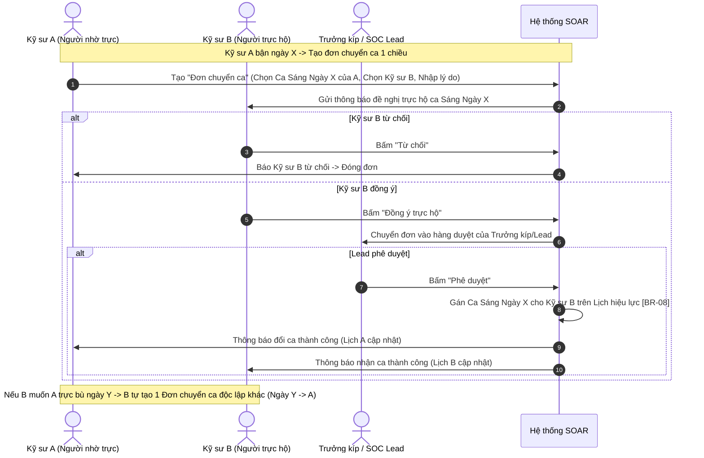

# TỔNG HỢP NỘI DUNG ĐỀ XUẤT NÂNG CẤP TÍNH NĂNG CẢNH BÁO (ALERTS) VÀ SỰ VIỆC (CASES) TRÊN SOAR

> **Mục đích tài liệu:** Tổng hợp toàn bộ yêu cầu nghiệp vụ cải tiến, phân tích hiện trạng, đề xuất giải pháp kiến trúc và luồng xử lý chi tiết cho hệ thống SOAR để phục vụ việc xem xét, đánh giá và ghi nhận ý kiến phản hồi (Review & Comment) trước khi tiến hành viết đặc tả chi tiết (SRS) và phát triển giao diện/tính năng.  
> **Ngày lập:** 07/09/2026  
> **Người lập:** Antigravity AI & Đội ngũ Phân tích Nghiệp vụ (BA)  
> **Mã tài liệu:** `SOAR_SPEC_ENHANCEMENT_2026_01`  

---

## MỤC LỤC

1. [TỔNG QUAN YÊU CẦU & KIẾN TRÚC PHÂN TẦNG](#1-tổng-quan-yêu-cầu--kiến-trúc-phân-tầng)
2. [KHỐI 1: QUẢN LÝ QUY TẮC LOẠI TRỪ CẢNH BÁO (ALERT SUPPRESSION RULES - YÊU CẦU 5.1.1.O)](#2-khối-1-quản-lý-quy-tắc-loại-trừ-cảnh-báo-alert-suppression-rules---yêu-cầu-511o)
3. [KHỐI 2: ĐÁNH GIÁ & ĐIỀU CHỈNH MỨC ĐỘ NGHIÊM TRỌNG ĐỘNG (DYNAMIC SEVERITY SCORING - YÊU CẦU 5.1.1.P)](#3-khối-2-đánh-giá--điều-chỉnh-mức-độ-nghiêm-trọng-động-dynamic-severity-scoring---yêu-cầu-511p)
4. [KHỐI 3: NÂNG CẤP PHÂN CÔNG TỰ ĐỘNG TRONG CORRELATION RULE (AUTO-ASSIGNMENT - YÊU CẦU 5.1.1.R)](#4-khối-3-nâng-cấp-phân-công-tự-động-trong-correlation-rule-auto-assignment---yêu-cầu-511r)
5. [KHỐI 4: PHÂN HỆ QUẢN LÝ CA - KÍP & HOÁN ĐỔI CA TRỰC (SHIFT & ROSTER MANAGEMENT - YÊU CẦU 5.1.3.D)](#5-khối-4-phân-hệ-quản-lý-ca---kíp--hoán-đổi-ca-trực-shift--roster-management---yêu-cầu-513d)
6. [KHỐI 5: HÀNG ĐỢI XỬ LÝ & BỘ LỌC LƯU SẴN CHO SỰ VIỆC (CASE QUEUES & SAVED VIEWS - YÊU CẦU 5.1.1.S)](#6-khối-5-hàng-đợi-xử-lý--bộ-lọc-lưu-sẵn-cho-sự-việc-case-queues--saved-views---yêu-cầu-511s)
7. [KHỐI 6: QUẢN LÝ SLA, LEO THANG ĐA CẤP & THÔNG BÁO ĐA KÊNH (ESCALATION & NOTIFICATION - YÊU CẦU 5.1.3.A, B, C)](#7-khối-6-quản-lý-sla-leo-thang-đa-cấp--thông-báo-đa-kênh-escalation--notification---yêu-cầu-513a-b-c)
8. [BẢNG TỔNG HỢP CÂU HỎI MỞ & Ý KIẾN CẦN REVIEW (REVIEW CHECKLIST)](#8-bảng-tổng-hợp-câu-hỏi-mở--ý-kiến-cần-review-review-checklist)

---

## 1. TỔNG QUAN YÊU CẦU & KIẾN TRÚC PHÂN TẦNG

### 1.1. Bối cảnh và Định hướng chuyển dịch
Theo định hướng tối ưu hóa vận hành SOC và tránh quá tải cảnh báo (Alert Fatigue):
* **Cảnh báo (Alerts):** Đóng vai trò là dữ liệu đầu vào thô/bán thô. Tập trung xử lý **lọc nhiễu tự động (Suppression)** và **chuẩn hóa/đánh giá mức độ nghiêm trọng động (Dynamic Severity)**.
* **Sự việc (Cases):** Đóng vai trò là **đơn vị tác chiến chính** của kỹ sư SOC. Các cảnh báo sau khi lọc sẽ được gom nhóm qua Quy tắc tương quan (Correlation Rules) để tạo Case. Do đó, toàn bộ quy định về **Tự động phân công, Hàng đợi xử lý, Lịch ca trực, Theo dõi SLA, Leo thang đa cấp và Bắn thông báo** sẽ được áp dụng trực tiếp cho **Case**.
* **Sự cố (Incident):** Khi Case trong quá trình điều tra xác nhận là sự cố an ninh nghiêm trọng (True Positive nguy cơ cao, mã hóa tệp, xâm nhập vùng nhạy cảm), kỹ sư sẽ bấm **"Leo thang thành Sự cố" (Promote to Incident)** để mở quy trình ứng cứu khẩn cấp (Incident Response lifecycle).

### 1.2. Mô hình phân tầng luồng dữ liệu

```
[ NGUỒN CẢNH BÁO BÊN NGOÀI (SIEM, EDR, Network, PT Logs...) ]
                         │
                         ▼
┌─────────────────────────────────────────────────────────────┐
│ 1. TẦNG CẢNH BÁO (ALERTS)                                   │
│  - Tiếp nhận & Chuẩn hóa dữ liệu JSON                       │
│  - Kiểm tra Quy tắc loại trừ (Suppression Rule - 5.1.1.o)   │
│    + Khớp rule -> Tự động đóng (Closed/Suppressed)         │
│    + Không khớp -> Chuyển bước kế tiếp                      │
│  - Đánh giá Mức độ nghiêm trọng động (5.1.1.p)              │
│    (Nội dung + Độ quan trọng tài sản + Làm giàu dữ liệu TI) │
└────────────────────────┬────────────────────────────────────┘
                         │
                         ▼
┌─────────────────────────────────────────────────────────────┐
│ 2. BỘ QUY TẮC TƯƠNG QUAN (CORRELATION RULES ENGINE)          │
│  - Gom nhóm các Alert theo điều kiện & khung thời gian      │
│  - Kích hoạt tạo Sự việc mới (Case) hoặc gộp vào Case cũ    │
└────────────────────────┬────────────────────────────────────┘
                         │
                         ▼
┌─────────────────────────────────────────────────────────────┐
│ 3. TẦNG SỰ VIỆC (CASES) - ĐIỀU PHỐI VẬN HÀNH                │
│  - Tự động phân công Case (5.1.1.r)                         │
│    (Theo Nhóm / Ca trực On-duty / Mức độ nghiêm trọng)      │
│  - Phân bổ vào Hàng đợi xử lý (5.1.1.s)                     │
│    (Hàng đợi của tôi / Hàng đợi nhóm / Hàng đợi ca trực)    │
│  - Theo dõi tiến độ SLA & Leo thang tự động (5.1.3.a, b)    │
│  - Bắn thông báo đa kênh Email/Teams/In-app (5.1.3.c)       │
│  - Điều phối nguồn lực từ Phân hệ Ca - Kíp (5.1.3.d)        │
└────────────────────────┬────────────────────────────────────┘
                         │ (Nếu xác nhận tấn công nghiêm trọng)
                         ▼
┌─────────────────────────────────────────────────────────────┐
│ 4. TẦNG SỰ CỐ CHUYÊN SÂU (INCIDENT RESPONSE)                │
│  - Kích hoạt phòng tác chiến (War-room)                     │
│  - Điều tra số (Forensic), Cô lập mạng, Phục hồi dữ liệu   │
└─────────────────────────────────────────────────────────────┘
```

---

## 2. KHỐI 1: QUẢN LÝ QUY TẮC LOẠI TRỪ CẢNH BÁO (ALERT SUPPRESSION RULES - YÊU CẦU 5.1.1.O)

### 2.1. Yêu cầu nghiệp vụ
* Cho phép cấu hình danh sách cho phép (Allowlist / Exclusion / Suppression Rule) để tự động lọc bỏ các cảnh báo đã biết là nhiễu hoặc các cảnh báo sinh ra từ hoạt động nghiệp vụ hợp lệ (như máy quét lỗ hổng định kỳ Nessus, hoạt động bảo trì mạng, IP kiểm thử nội bộ).
* Cảnh báo khớp quy tắc loại trừ sẽ **tự động chuyển sang trạng thái đã xử lý (Closed/Suppressed)** và **không kích hoạt tạo Case**, giảm thiểu tối đa tình trạng báo động giả.
* **Quy định bắt buộc trên mỗi quy tắc:**
  1. Phải có **Thời hạn hiệu lực (Expiration / TTL)**: Không cho phép loại trừ vĩnh viễn không kiểm soát.
  2. Phải có **Lý do loại trừ (Reason)**: Ghi rõ căn cứ loại trừ.
  3. Phải có **Người phê duyệt (Approved By)**: Phải qua quy trình duyệt trước khi có hiệu lực.

### 2.2. Thiết kế Cấu hình & Giao diện
* **Kế thừa giao diện Bộ lọc:** Màn hình cấu hình điều kiện loại trừ sẽ **tái sử dụng 100% Cây điều kiện (Condition Tree)** của Correlation Rule hiện tại:
  * Hỗ trợ toán tử nhóm: `AND`, `OR`.
  * Hỗ trợ các trường: `Nguồn`, `Nội dung`, `Mức độ`, `srcAddr (IP nguồn)`, `destAddr (IP đích)`, `destPort`, `Tên tài sản`, `Mã khách hàng/Tenant`, v.v.
  * Hỗ trợ các toán tử so sánh: `=`, `!=`, `in`, `not in`, `contains`, `regex`, `cidr`.
* **Các trường thông tin của Quy tắc loại trừ:**
  | Tên trường | Kiểu dữ liệu | Bắt buộc | Mô tả & Ràng buộc nghiệp vụ |
  | :--- | :--- | :---: | :--- |
  | **Tên quy tắc** | Text (255 ký tự) | Có | Tên gợi nhớ của quy tắc loại trừ. |
  | **Khách hàng (Tenant)** | Dropdown | Có | Quy tắc áp dụng cho khách hàng cụ thể hoặc toàn hệ thống. |
  | **Thời hạn hiệu lực** | Date-Time Picker | Có | Ngày giờ hết hạn hiệu lực của quy tắc. Tối đa không quá 90 ngày (hoặc cấu hình tùy chỉnh). |
  | **Lý do loại trừ** | Textarea (500 ký tự) | Có | Căn cứ loại trừ (ví dụ: *IP scan lỗ hổng của Trung tâm CNTT, diễn tập Pentest quý 3*). |
  | **Cây điều kiện lọc** | Condition Builder | Có | Logic nhận diện cảnh báo cần loại trừ (tương tự Correlation Rule). |
  | **Trạng thái** | Tag hiển thị | Tự động | Gồm 3 trạng thái chính: `Chờ duyệt (Pending)`, `Hoạt động (Active)`, `Bị từ chối (Rejected)`, cùng nút Toggle Bật/Tắt (`Inactive`). *(Không cần trạng thái Hết hạn - Expired; thời hạn hiệu lực là điều kiện kiểm tra tự động khi nhận alert)*. |
  | **Người tạo (Requester)**| Text | Tự động | Kỹ sư tạo đề xuất quy tắc. |
  | **Người duyệt (Approver)**| Text | Tự động | Quản trị viên / Trưởng ca thực hiện duyệt. |
  | **Lý do từ chối** | Textarea | Điều kiện | Bắt buộc nhập nếu người duyệt bấm "Từ chối". |
  | **Thời gian duyệt** | Datetime | Tự động | Ghi nhận thời điểm phê duyệt/từ chối. |

### 2.3. Quy định Hành vi Chỉnh sửa (Edit) và Xóa (Delete) theo từng Trạng thái
Để đảm bảo tính linh hoạt cho kỹ sư nhưng vẫn giữ nghiêm ngặt an toàn hệ thống, hành vi Sửa và Xóa được quy định như sau:

| Trạng thái quy tắc | Hành vi Chỉnh sửa (Edit) | Hành vi Xóa (Delete) |
| :--- | :--- | :--- |
| **1. Đang Chờ duyệt (Pending)** | • **Ai được sửa:** Người tạo hoặc Quản trị viên/Lead.<br>• **Hành vi:** Cho phép sửa lại toàn bộ thông tin (tên, thời hạn, lý do, điều kiện lọc). Sau khi lưu, quy tắc **vẫn giữ nguyên trạng thái `Chờ duyệt`** với nội dung mới nhất để người duyệt xem xét. | • **Ai được xóa:** Người tạo hoặc Quản trị viên/Lead.<br>• **Hành vi:** Cho phép Xóa đề xuất (hủy yêu cầu duyệt). Bản ghi bị xóa khỏi danh sách. |
| **2. Bị từ chối (Rejected)** | • **Ai được sửa:** Người tạo hoặc Quản trị viên/Lead.<br>• **Hành vi:** Người dùng xem được **"Lý do từ chối"** của cấp trên. Khi bấm Sửa và chọn **"Lưu & Gửi duyệt lại (Resubmit)"**, hệ thống **tự động chuyển trạng thái từ `Bị từ chối` $\rightarrow$ `Chờ duyệt (Pending)`** để đưa vào hàng đợi duyệt lại. | • **Ai được xóa:** Người tạo hoặc Quản trị viên/Lead.<br>• **Hành vi:** Cho phép Xóa hoàn toàn quy tắc bị từ chối nếu không còn nhu cầu đề xuất tiếp. |
| **3. Đang Hoạt động (Active)** | • **Ai được sửa:** Chỉ Quản trị viên / Trưởng ca.<br>• **Hành vi an toàn:** Nếu sửa các thông tin cơ bản (tên, mô tả, tắt toggle) thì cập nhật ngay. Nếu sửa **Cây điều kiện lọc** hoặc **Gia hạn thời gian**, hệ thống sẽ chuyển về `Chờ duyệt` lại để tránh việc âm thầm sửa điều kiện làm lọt tấn công. | • **Ai được xóa:** Chỉ Quản trị viên / Trưởng ca.<br>• **Hành vi:** Hiển thị popup cảnh báo xác nhận nguy cơ trước khi xóa vĩnh viễn. Có thể chọn phương án Tắt (Toggle Inactive) thay vì xóa. |

### 2.4. Ma trận Phân quyền (RBAC) cho Quy tắc loại trừ
* **Kỹ sư SOC (Analyst):**
  * Quyền xem danh sách quy tắc loại trừ.
  * Quyền tạo mới đề xuất quy tắc (`Chờ duyệt`).
  * Quyền sửa / xóa các quy tắc do chính mình tạo khi đang ở trạng thái `Chờ duyệt` hoặc `Bị từ chối`.
  * **Không có quyền:** Tự duyệt đề xuất; Không được trực tiếp sửa/xóa quy tắc đang `Hoạt động`.
* **Trưởng ca / Quản trị viên SOC (SOC Lead / Security Admin):**
  * Toàn quyền (Xem, Tạo, Sửa, Xóa) trên mọi quy tắc của mọi người dùng.
  * Quyền **Phê duyệt (Approve)** $\rightarrow$ kích hoạt quy tắc sang `Hoạt động (Active)`.
  * Quyền **Từ chối (Reject)** $\rightarrow$ bắt buộc nhập lý do từ chối để kỹ sư nắm được nguyên nhân.

---

## 3. KHỐI 2: ĐÁNH GIÁ & ĐIỀU CHỈNH MỨC ĐỘ NGHIÊM TRỌNG ĐỘNG (DYNAMIC SEVERITY SCORING - YÊU CẦU 5.1.1.P)

### 3.1. Yêu cầu nghiệp vụ
* Cảnh báo trên hệ thống phải có trường mức độ nghiêm trọng với **tối thiểu 04 giá trị chuẩn**:
  1. `Thấp (Low)`
  2. `Trung bình (Medium)`
  3. `Cao (High)`
  4. `Nghiêm trọng (Critical)`
* SOAR phải cho phép cấu hình quy tắc tự động xác định hoặc điều chỉnh tăng/giảm mức độ nghiêm trọng dựa trên sự kết hợp của 3 yếu tố:
  1. **Nội dung cảnh báo (Alert Context/Signature):** Bản chất hành vi tấn công (ví dụ: Port Scan vs RCE / Ransomware).
  2. **Mức độ quan trọng của tài sản (Asset Criticality):** Vị trí và vai trò của máy chủ/thiết bị bị tấn công trong hệ thống.
  3. **Kết quả làm giàu dữ liệu (Enrichment Results):** Điểm số uy tín tình báo mối đe dọa (Threat Intelligence - TI) và kết quả phân tích AI.

### 3.2. Mô hình Ma trận Tính điểm Nghiêm trọng Động (Dynamic Scoring Model)
Điểm mức độ nghiêm trọng cuối cùng ($S_{final}$) được tính toán theo công thức trọng số hoặc ma trận ánh xạ (Mapping Matrix):

$$\text{Final Severity Score} = \text{Base Severity} + \Delta\text{Asset} + \Delta\text{Threat Intelligence} + \Delta\text{AI}$$

```
+-------------------------------------------------------------------------------------------------+
|                                 BẢNG QUY TẮC ĐIỀU CHỈNH MỨC ĐỘ                                  |
+--------------------------+------------------------------------------------+---------------------+
| Yếu tố đánh giá          | Điều kiện thực tế                              | Mức điều chỉnh      |
+--------------------------+------------------------------------------------+---------------------+
| 1. Tài sản liên quan     | - Tài sản Tier 1 (Core Banking, DC, DB Prod)   | +2 mức (vd: Med->Cri|
|    (Asset Criticality)   | - Tài sản Tier 2 (Ứng dụng nội bộ, File Server)| +1 mức (vd: Low->Med|
|                          | - Tài sản Tier 3 (Máy test, Dev/Staging, Khách)| Giữ nguyên / -1 mức |
+--------------------------+------------------------------------------------+---------------------+
| 2. Làm giàu dữ liệu TI   | - IP/Domain có điểm Abuse/Malicious >= 80%    | +1 hoặc +2 mức      |
|    (Threat Intelligence) | - Hash mã độc xác nhận bởi Sandbox/VirusTotal  | Đẩy thẳng lên CRIT  |
|                          | - IP nội bộ sạch / False Positive đã biết      | Giảm về LOW         |
+--------------------------+------------------------------------------------+---------------------+
| 3. Điểm AI Triaging      | - AI Phân loại True Positive với tin cậy > 95% | Xác nhận mức cảnh báo|
|    (AI Score hiện có)    | - AI Phân loại False Positive với tin cậy > 95%| Giảm về LOW / Supp. |
+--------------------------+------------------------------------------------+---------------------+
```

* **Quy tắc kế thừa lên Case:**
  * Khi nhiều Alert được gom vào 1 Case thông qua Correlation Rule, mức độ nghiêm trọng của Case sẽ **mặc định lấy theo mức nghiêm trọng cao nhất (Highest Severity)** của các Alert thành phần trong Case đó.

---

## 4. KHỐI 3: NÂNG CẤP PHÂN CÔNG TỰ ĐỘNG TRONG CORRELATION RULE (AUTO-ASSIGNMENT - YÊU CẦU 5.1.1.R)

### 4.1. Hiện trạng & Điểm cần nâng cấp
* **Hiện trạng:** Tại Bước 2 (Cấu hình Mẫu sự việc) của Correlation Rule (`/settings/rules`), hệ thống đang có trường **"Người xử lý"** dạng chọn tĩnh 1 tài khoản cố định (ví dụ: `tamlv`).
* **Nâng cấp:** Thay thế trường chọn tĩnh bằng trường **"Chiến lược phân công tự động (Assignment Strategy)"** với 4 chế độ lựa chọn linh hoạt.

### 4.2. Đặc tả 3 Chiến lược Phân công Tự động trong Correlation Rule
Thay vì cấu hình phức tạp trên rule, giao diện Correlation Rule chỉ cần chọn 1 trong 3 chiến lược:
1. **Chế độ 1: Chỉ định tài khoản cố định (Specific User - Kế thừa hiện tại):**
   * Cho phép chọn đích danh 1 tài khoản người dùng xử lý (phù hợp với các rule kiểm thử hoặc chỉ định riêng).
2. **Chế độ 2: Phân công theo Nhóm chuyên trách (By Team / Squad):**
   * Cho phép chọn Nhóm (ví dụ: *SOC Tier 1*, *Đội Ứng phó sự cố*, *An ninh Ứng dụng*).
   * Thuật toán phân phối trong nhóm: *Xoay vòng (Round-Robin)* hoặc *Cân bằng tải (Least Open Cases)*.
3. **Chế độ 3: Phân công theo Ca / Kíp trực (By Shift / Crew - Tối ưu & Tinh gọn):**
   * Hệ thống tự động xác định Kíp trực đang làm nhiệm vụ tại thời điểm phát sinh Case.
   * **Điểm tối ưu:** Correlation Rule **không cần cấu hình ma trận mức độ nghiêm trọng**, mà việc *"Mức độ nào gán cho thành viên nào"* sẽ được **định nghĩa tập trung ngay trong cấu hình của từng Kíp trực** (ở Khối 4). Giúp rule tương quan rất gọn nhẹ và dễ bảo trì.

---

## 5. KHỐI 4: PHÂN HỆ QUẢN LÝ CA - KÍP & HOÁN ĐỔI CA TRỰC (SHIFT & ROSTER MANAGEMENT - YÊU CẦU 5.1.3.D)

### 5.1. Kiến trúc Tổ chức Ca - Kíp 3 Tầng & Cấu hình Gán theo Mức độ trong Kíp
Phân hệ được chia thành 3 tầng quản lý:

```
[ 1. KHUNG CA (SHIFTS) ] ──▶ [ 2. KÍP TRỰC (CREWS) ] ──▶ [ 3. LỊCH PHÂN CÔNG (ROSTER) ]
- Định nghĩa giờ làm việc     - Danh sách nhân sự kíp     - Phân công Kíp vào từng Ngày
- Ca Sáng / Chiều / Đêm       - MA TRẬN GÁN THEO MỨC ĐỘ   - Xử lý Hoán đổi ca (Shift Swap)
- Hỗ trợ ca vắt qua đêm       - Quy định Trưởng kíp       - Tạo ra LỊCH HIỆU LỰC (Effective)
```

#### A. Khung Ca (Shift Definition):
* Định nghĩa các khoảng thời gian làm việc trong ngày: Tên ca, Giờ bắt đầu, Giờ kết thúc.
* Hỗ trợ cấu hình ca vắt qua đêm (Cross-midnight: ví dụ 22:00 hôm nay đến 06:00 sáng hôm sau).

#### B. Kíp trực (Crew Definition) & Cấu hình Phân bổ theo Mức độ nghiêm trọng:
Mỗi Kíp trực gồm một nhóm nhân sự cùng làm việc với nhau. Khi tạo/sửa một Kíp, quản trị viên sẽ:
1. Chọn danh sách các thành viên trong kíp và chỉ định **Trưởng kíp (Crew Lead)**.
2. **Cấu hình ma trận tiếp nhận theo Mức độ nghiêm trọng của Case:**
   * **Mức Thấp & Trung bình (Low & Medium):** Gán cho $\rightarrow$ `[ Tất cả thành viên trong kíp ]` (phân bổ xoay vòng Round-Robin hoặc ai đang có ít việc nhất sẽ nhận).
   * **Mức Cao (High):** Gán cho $\rightarrow$ `[ Chọn lọc các chuyên viên Senior / L2 trong kíp ]`.
   * **Mức Nghiêm trọng (Critical):** Gán cho $\rightarrow$ `[ Trưởng kíp ]` (hoặc Kỹ sư phụ trách chính của kíp).

> **Lợi ích:** Khi Correlation Rule tạo ra một Case mức "Cao" vào lúc 02:00 sáng, hệ thống tra ra Kíp 3 đang trực và tự động gán thẳng cho kỹ sư Senior được chỉ định cho mức "Cao" của Kíp 3.

#### C. Lịch phân công theo ngày (Roster & Personal Schedule):
* **Bảng phân bổ tổng thể (Master Roster):** Phân bổ Kíp nào trực Ca nào vào Ngày nào trên giao diện Calendar/Gantt (hỗ trợ xoay ca tự động theo chu kỳ: 3 ca 4 kíp, 2 ca 3 kíp...).
* **Giao diện "Lịch trực của tôi" (Personal Calendar View):** Cho phép mỗi kỹ sư chuyển đổi nhanh sang góc nhìn cá nhân để xem riêng lịch trực của mình trong tuần/tháng. Hệ thống đánh dấu mã màu rõ ràng:
  * *Ca trực chuẩn của tôi* (Màu xanh dương)
  * *Ca tôi đã chuyển cho người khác trực hộ* (Màu xám gạch ngang)
  * *Ca tôi đang trực thay cho đồng nghiệp* (Màu xanh lá)

---

### 5.2. Làm rõ Vai trò: Trưởng ca vs Trưởng kíp
Để tránh mơ hồ và phức tạp hóa phân quyền, hai khái niệm này được định nghĩa rõ ràng như sau:
* **Kíp (Crew) là tổ chức con người:** Kíp 1 có anh Hùng (Trưởng kíp) và các thành viên A, B, C. Dù Kíp 1 trực ca sáng hay ca đêm thì anh Hùng vẫn là người quản lý trực tiếp của nhóm này.
* **Ca (Shift) là phiên trực thời gian:** Ca Sáng (06h - 14h), Ca Đêm (22h - 06h).
* **Mối liên hệ:** Khi **Kíp 1** được phân công trực **Ca Đêm**, thì **Trưởng kíp 1 chính là Trưởng ca (Shift Lead)** chịu trách nhiệm chỉ huy trong suốt ca đêm đó!
* **Cấp phê duyệt:** Tùy quy mô tổ chức, việc duyệt đổi ca có thể giao cho **Trưởng kíp** (nếu đổi nội bộ) hoặc **Quản lý SOC (SOC Manager / Admin)** duyệt toàn bộ.

---

### 5.3. Quy trình Đổi ca Tinh gọn: Chuẩn hóa 100% về Đơn chuyển giao ca 1 chiều
Để loại bỏ sự phức tạp của việc "Đổi chéo ca 2 chiều" (khiến Kỹ sư A phải dò tìm ca trực của Kỹ sư B), toàn bộ phân hệ đổi ca được **tinh giản thành 1 loại đơn duy nhất: Đơn chuyển giao ca (1 chiều)**:



1. **Giao diện tạo đơn đơn giản tuyệt đối:**
   * Kỹ sư A bận ngày $X$, mở màn hình **"Lịch trực của tôi"**, click vào ca trực ngày $X$ của mình $\rightarrow$ Chọn nút **"Đề nghị trực hộ"**.
   * Chỉ cần chọn danh tính **Kỹ sư B** (người mình nhờ) và điền **Lý do** $\rightarrow$ Bấm **Gửi yêu cầu**.
   * *Không cần quan tâm lịch của B ngày nào, không cần cấu hình đổi chéo phức tạp.* Nếu Kỹ sư B muốn A trực bù lại một ngày khác, Kỹ sư B chỉ việc tự tạo một đơn chuyển ca tương tự cho ngày đó!

---

### 5.4. Ràng buộc An toàn Dữ liệu khi Thay đổi Thành viên trong Kíp (Crew Membership Change Edge-cases)
Bài toán đặt ra: *Sau khi đã tạo hoặc duyệt đơn chuyển ca giữa A và B, nếu Quản trị viên vào phân hệ quản lý Kíp để chỉnh sửa (ví dụ: xóa Kỹ sư B khỏi Kíp 2) thì xử lý thế nào?*

* **Quy tắc giải quyết [BR-08]:**
  1. **Ràng buộc cấp cá nhân (Individual Binding):** Đơn chuyển ca sau khi được phê duyệt sẽ **khóa trực tiếp vào User ID của Kỹ sư B** và mốc thời gian cụ thể trên **Lịch trực hiệu lực (Effective Schedule)**. Việc Kỹ sư B sau đó bị chuyển sang Kíp khác hoặc gỡ khỏi Kíp cũ **không làm hủy bỏ ca trực đã phân cho B**. Kỹ sư B vẫn có trách nhiệm trực ca đó.
  2. **Tự động hủy đơn đang Chờ duyệt (Pending):** Nếu Kỹ sư B bị xóa khỏi Kíp hoặc bị khóa tài khoản khi đơn chuyển ca vẫn đang ở trạng thái `Chờ duyệt` $\rightarrow$ Hệ thống tự động hủy đơn, gửi thông báo cho Kỹ sư A: *"Đơn chuyển ca bị hủy do nhân sự tiếp nhận không còn hoạt động trong kíp"*.
  3. **Trường hợp xóa vĩnh viễn tài khoản:** Nếu Kỹ sư B bị xóa tài khoản khỏi hệ thống $\rightarrow$ Hệ thống hiển thị cảnh báo đỏ trên Lịch hiệu lực và gửi thông báo khẩn cho Trưởng kíp/SOC Lead để phân công lại nhân sự thay thế.

---

### 5.5. Thuật toán Xác định Người trực Hiệu lực (Effective On-Duty Resolver)
Khi có Case mới sinh ra vào thời điểm $T$:
1. Hệ thống xác định thời điểm $T$ nằm trong **Khung ca nào** của ngày hôm đó.
2. Hệ thống kiểm tra **Lịch trực hiệu lực**:
   * Kiểm tra ngày đó có đơn chuyển giao ca nào đã được duyệt hay không.
   * Nếu có người trực thay $\rightarrow$ Lấy danh sách nhân sự trực thay thực tế.
   * Nếu không $\rightarrow$ Lấy danh sách nhân sự của Kíp trực theo lịch chuẩn.
3. Áp dụng quy tắc phân công (Round-robin hoặc theo Mức độ nghiêm trọng của Case) để gán cho kỹ sư phù hợp.

---

### 5.6. Cơ chế Phân công Dự phòng khi Thiếu Lịch trực (Fallback Assignment Policy)
Trong thực tế vận hành, có thể xảy ra tình huống: **Hệ thống chưa được lên Lịch trực cho ngày hôm đó** (quên phân bổ kíp vào ca) hoặc **phát sinh khoảng trống giữa các ca** (gap hour). Để tránh tình trạng Case bị "mồ côi" (Orphan Case) và không ai chịu trách nhiệm, SOAR áp dụng cơ chế bảo vệ 3 lớp:

```
[ Case mới tạo tại thời điểm T ]
               │
               ▼
   Kiểm tra Lịch trực hiệu lực
               │
               ├── (Có Kíp & Nhân sự) ────▶ Gán cho Kỹ sư trong Ca (theo Severity/Round-robin)
               │
               └── (KHÔNG CÓ LỊCH TRỰC) ──▶ KÍCH HOẠT CƠ CHẾ DỰ PHÒNG 3 CẤP:
                                            ├─ Cấp 1: Gán cho Đối tượng dự phòng (Fallback Assignee)
                                            ├─ Cấp 2: Đẩy vào Tab "Chưa phân công" (Unassigned Queue)
                                            └─ Cấp 3: Bắn cảnh báo khẩn cấp tới Quản lý SOC
```

#### 1. Cấu hình Đối tượng Dự phòng (Default Fallback Assignee):
* Trong màn hình Cài đặt Ca trực (`/settings/shifts`) hoặc ngay tại Correlation Rule, Quản trị viên cấu hình:
  * **"Khi ngoài ca trực hoặc thiếu lịch trực, gán cho:"**
    * *Tùy chọn A (Mặc định):* Gán cho **Tài khoản Trưởng phòng SOC / Quản lý SOC** (hoặc Trưởng ca trực gần nhất).
    * *Tùy chọn B:* Gán cho **Nhóm Quản trị SOC (SOC Admins / Tier 2 Team)**.
    * *Tùy chọn C:* Để trạng thái **Chưa phân công (Unassigned)**.

#### 2. Đưa vào Hàng đợi "Chưa phân công" & Cơ chế Nhận việc (Claiming):
* Nếu chọn để *Chưa phân công* hoặc gán theo nhóm, Case sẽ tự động xuất hiện tại Tab **"Chưa phân công (Unassigned)"** trên màn hình Sự việc.
* Case được gắn Tag cảnh báo: `[⚠️ Thiếu lịch trực]`.
* Bất kỳ kỹ sư SOC nào đang online cũng có thể bấm nút **"Nhận việc" (Claim Case)** để tiếp nhận xử lý ngay, hệ thống sẽ tự động đổi Người xử lý sang người bấm.

#### 3. Cảnh báo Vi phạm Lịch trực (Roster Breach Alert):
* Hệ thống tự động kích hoạt thông báo khẩn cấp (In-app + Telegram/Teams Bot) gửi trực tiếp đến Quản lý SOC / Người lập lịch:
  > *"⚠️ CẢNH BÁO LỊCH TRỰC: Sự việc [Mã Case] mức [Severity] vừa phát sinh vào lúc [Thời gian], tuy nhiên ca làm việc hiện tại CHƯA ĐƯỢC GÁN KÍP TRỰC. Hệ thống đã gán tạm cho [Tên người/nhóm dự phòng]. Đề nghị Quản lý kiểm tra và cập nhật Lịch trực ca!"*

---

## 6. KHỐI 5: HÀNG ĐỢI XỬ LÝ & BỘ LỌC LƯU SẴN CHO SỰ VIỆC (CASE QUEUES & SAVED VIEWS - YÊU CẦU 5.1.1.S)

### 6.1. Hàng đợi Xử lý Sự việc (Case Queues)
Tại màn hình Quản lý Sự việc (`/case`), bổ sung thanh điều hướng hàng đợi (Queue Tabs) ở phía trên bảng dữ liệu:
1. **Hàng đợi của tôi (My Cases):**
   * Chỉ hiển thị các Case đang được phân công trực tiếp cho tài khoản đang đăng nhập và có trạng thái chưa đóng (`New`, `Processing`).
2. **Hàng đợi của Nhóm (Team Cases):**
   * Hiển thị toàn bộ các Case được gán cho các Nhóm/Kíp mà người dùng hiện tại là thành viên.
3. **Hàng đợi trong Ca trực (Current Shift Cases):**
   * Hiển thị toàn bộ các Case phát sinh trong khung giờ ca trực hiện tại. Kỹ sư trong ca có thể bấm nút **"Nhận việc" (Claim Case)** để gán Case về mình.
4. **Tất cả sự việc (All Cases):**
   * Hiển thị toàn bộ sự việc theo phân quyền Tenant (như giao diện hiện tại).

### 6.2. Tính năng Lưu và Tái sử dụng Bộ lọc (Saved Views / Filter Presets)
* Cho phép người dùng lưu lại bất kỳ tổ hợp điều kiện lọc nào (ví dụ: *Case Critical chưa gán*, *Case của khách hàng VIP trong tuần này*).
* **Các tính năng hỗ trợ:**
  * Đặt tên cho bộ lọc (vd: `[SOC-L1] Case cần xử lý gấp`).
  * Tùy chọn: **"Đặt làm bộ lọc mặc định khi mở trang"**.
  * Tùy chọn: **"Chia sẻ bộ lọc này cho toàn bộ thành viên trong nhóm"**.
  * Danh sách bộ lọc lưu sẵn hiển thị dưới dạng dropdown nhanh trên thanh công cụ để chuyển đổi qua 1 click chuột.

---

## 7. KHỐI 6: QUẢN LÝ SLA, LEO THANG ĐA CẤP & THÔNG BÁO ĐA KÊNH (ESCALATION & NOTIFICATION - YÊU CẦU 5.1.3.A, B, C)

### 7.1. Ma trận Leo thang Tự động Đa cấp (Multi-tier Escalation Matrix)
Hệ thống giám sát hạn xử lý (SLA) của từng Case theo thời gian thực (đếm ngược). Khi phát hiện vi phạm hoặc sự cố nghiêm trọng, cơ chế leo thang được kích hoạt tự động theo bảng ma trận:

| Mức leo thang | Điều kiện kích hoạt (Trigger) | Hành động tự động của Hệ thống | Người tiếp nhận xử lý | Kênh thông báo |
| :---: | :--- | :--- | :--- | :--- |
| **Mức 1 (Cảnh báo sớm)** | Còn 20% thời gian SLA (Sắp đến hạn) hoặc Trễ hạn 0 - 15 phút. | Gửi thông báo nhắc nhở đôn đốc tiến độ. | Kỹ sư đang được phân công (Assignee). | In-app Notification, Email |
| **Mức 2 (Trưởng ca)** | Trễ hạn SLA quá 30 phút HOẶC Mức độ Case tăng lên `Nghiêm trọng (Critical)`. | • Tự động gắn cờ `Escalated - Mức 2`.<br>• Gán bổ sung Trưởng ca vào theo dõi. | Trưởng ca trực hiện tại (Shift Lead). | In-app, Telegram/Teams Webhook |
| **Mức 3 (Quản lý SOC)** | Trễ hạn SLA quá 60 phút và chưa có cập nhật tiến độ. | • Tự động gắn cờ `Escalated - Mức 3`.<br>• Chuyển Case vào danh sách sự cố khẩn. | Trưởng phòng SOC / Quản lý An ninh thông tin (CISO). | Email khẩn, SMS, Telegram/Teams |

### 7.2. Dịch vụ Thông báo Đa kênh (Multi-channel Notification System)
Hệ thống tích hợp tối thiểu **03 kênh thông báo**:
1. **Thông báo nội bộ trên giao diện Web (In-app Notification & Toast):** Hiển thị chuông thông báo góc trên màn hình kèm âm thanh cảnh báo khi có case khẩn.
2. **Email thông báo (SMTP Email):** Gửi mẫu email chuẩn hóa đầy đủ thông tin Case, thời gian SLA và link truy cập trực tiếp.
3. **Webhook Tức thì (Telegram Bot / Microsoft Teams / Slack):** Bắn tin nhắn trực tiếp vào kênh tác chiến của đội trực SOC.

* **3 sự kiện bắt buộc kích hoạt thông báo (theo yêu cầu 5.1.3.c):**
  1. **Khi Sự việc được phân công:** Bắn thông báo ngay cho kỹ sư được giao việc.
  2. **Khi Sự việc sắp đến hạn hoặc quá hạn SLA:** Bắn thông báo cảnh báo sớm và thông báo vi phạm SLA.
  3. **Khi Kịch bản tự động (Playbook) cần người dùng tương tác/phê duyệt:** Ví dụ Playbook chạy đến bước xin phê duyệt *"Cô lập máy chủ 192.168.1.10?"* $\rightarrow$ Bắn thông báo khẩn yêu cầu người có thẩm quyền vào bấm Duyệt/Từ chối.

---

## 8. BẢNG TỔNG HỢP CÂU HỎI MỞ & Ý KIẾN CẦN REVIEW (REVIEW CHECKLIST)

Kính mời bạn đọc và để lại nhận xét, phản hồi trực tiếp vào bảng dưới đây hoặc phản hồi qua khung chat:

| STT | Vấn đề / Tính năng | Nội dung đề xuất | Ý kiến phản hồi / Đóng góp của bạn |
| :---: | :--- | :--- | :--- |
| **1** | **Quy tắc loại trừ cảnh báo** | • Dùng chung Condition Tree với Correlation Rule.<br>• Bắt buộc có: Thời hạn (tối đa 90 ngày), Lý do, Phân quyền duyệt.<br>• Alert bị loại trừ sẽ tự đóng, không tạo Case. | *(Bạn có muốn thay đổi thời hạn tối đa hoặc cho phép loại trừ vĩnh viễn không?)* |
| **2** | **Công thức Mức độ nghiêm trọng** | • Đánh giá dựa trên: Nội dung alert + Độ quan trọng tài sản + Làm giàu dữ liệu TI.<br>• Case kế thừa mức cao nhất của các alert con. | *(Đơn vị của bạn hiện đã có danh mục phân loại Tài sản quan trọng chưa?)* |
| **3** | **Chiến lược phân công Case** | • Rút gọn còn 3 chế độ: Chỉ định / Theo Nhóm / Theo Ca trực.<br>• Logic phân bổ theo mức độ nghiêm trọng chuyển sang cấu hình tập trung trong Kíp trực. | *(Đã thống nhất theo ý kiến của bạn)* |
| **4** | **Phân hệ Ca - Kíp, Đổi ca & Dự phòng** | • Kíp trực định nghĩa phân vai theo Severity.<br>• Bổ sung giao diện *"Lịch trực của tôi"* (Personal Calendar View).<br>• Tinh giản đổi ca thành Đơn chuyển ca 1 chiều.<br>• Cơ chế dự phòng (Fallback) khi thiếu lịch trực: Gán Quản lý/Nhóm SOC + Đẩy vào hàng đợi "Chưa phân công" + Bắn cảnh báo cho Quản lý. | *(Đã bổ sung cơ chế bảo vệ 3 lớp khi quên xếp lịch trực)* |
| **5** | **Hàng đợi & Bộ lọc** | • Thêm 3 tab hàng đợi: Của tôi, Nhóm, Ca trực.<br>• Cho phép lưu bộ lọc và ghim làm mặc định. | *(Cần bổ sung thêm tab hàng đợi đặc thù nào khác không, ví dụ "Chờ đóng", "Đã leo thang"?)* |
| **6** | **Leo thang & Thông báo** | • 3 mức leo thang (Mức 1: Kỹ sư $\rightarrow$ Mức 2: Trưởng ca $\rightarrow$ Mức 3: SOC Manager).<br>• Thông báo qua Email, In-app và Telegram/Teams. | *(Đơn vị ưu tiên dùng Telegram hay Microsoft Teams làm kênh chat tác chiến?)* |

---
*Tài liệu được lưu tại đường dẫn:* [`e:\work1\SOAR\tong_hop_de_xuat_nang_cap_alert_va_case_soar.md`](file:///e:/work1/SOAR/tong_hop_de_xuat_nang_cap_alert_va_case_soar.md)
