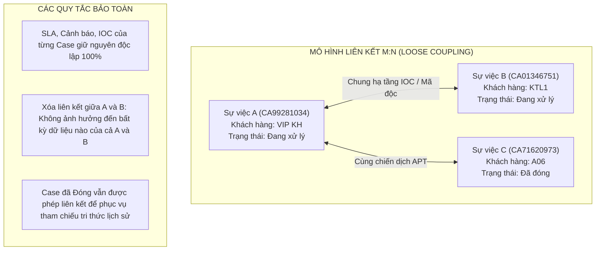

# TÀI LIỆU PHÂN TÍCH & THIẾT KẾ CHI TIẾT
## 5.6.4 PHÂN CẤP, LIÊN KẾT VÀ BẢO MẬT TÌNH HUỐNG
### b) LIÊN KẾT TÌNH HUỐNG (LINK CASES) - BẢO TOÀN NGUYÊN VẸN LỊCH SỬ XỬ LÝ
**Phân hệ:** Quản lý Sự việc SOAR (NCS SOAR - Incident Management)  
**Tương thích:** Giao diện chuẩn hóa theo thiết kế `NCS SOAR - Case list.html`  
**Ngày cập nhật:** 18/09/2026 (Phiên bản v3.0 - Chuyên biệt hóa Nghiệp vụ Liên kết Tình huống)  
**Trạng thái:** Đã hoàn thiện toàn diện

---

## 1. TỔNG QUAN YÊU CẦU & BỐI CẢNH VẬN HÀNH

Trong hoạt động giám sát an ninh mạng và ứng cứu sự cố (SOC/IR) tại các tổ chức quy mô lớn, các cuộc tấn công thường diễn ra phân tán, đa điểm và kéo dài qua nhiều giai đoạn. Yêu cầu **5.6.4 b (phần Liên kết tình huống)** đặt ra nhằm giải quyết các bài toán tác chiến trọng yếu:

1. **Nhận diện Mối liên hệ Đa chiều (Incident Correlation & Linkage):**
   * Cho phép liên kết một sự việc với một hoặc nhiều sự việc khác có chung thuộc tính điều tra (cùng một chiến dịch tấn công APT, cùng nhóm đối tượng đe dọa, dùng chung hạ tầng C2/mã độc/IOC, hoặc sự việc này là nguyên nhân gốc dẫn tới sự việc kia).
   * Phục vụ đắc lực cho chuyên viên điều tra (Tier 2/Tier 3) nhìn thấy bức tranh tổng thể của chiến dịch mà không cần phải hợp nhất dữ liệu hay làm xáo trộn quy trình xử lý của từng vụ việc.
2. **Độc lập Tác chiến & Phân quyền Multi-tenancy:**
   * Các sự việc được liên kết vẫn **hoàn toàn độc lập** về vòng đời, tiến trình SLA, trạng thái, mức độ ưu tiên và quyền thụ lý.
   * Cho phép liên kết tham chiếu điều tra xuyên khách hàng/phân vùng (khi chuyên viên có đủ quyền hạn) mà vẫn đảm bảo cách ly dữ liệu hồ sơ giữa các bên.
3. **Bảo toàn Nguyên vẹn Lịch sử Xử lý (Audit Trail & Forensic Integrity):**
   * Toàn bộ lịch sử xử lý, ý kiến thảo luận, các bước thay đổi trạng thái và phân công của Case nào sẽ được **lưu giữ nguyên vẹn 100% tại chính Case đó**.
   * Hệ thống chỉ ghi nhận thêm bản ghi sự kiện thiết lập hoặc gỡ bỏ liên kết, đảm bảo tính pháp lý và chuỗi hành trình chứng cứ số (Chain of Custody).
4. **Trải nghiệm Tác chiến Nhanh (Streamlined UX):**
   * Bổ sung trực tiếp nút hành động Tạo liên kết `[🔗]` ngay trên từng dòng của bảng danh sách sự việc.
   * Thể hiện trực quan số lượng liên kết tại cột Quan hệ đi kèm Popover xem nhanh danh sách liên kết.
   * Cung cấp Tab "Sự việc liên quan" trong Drawer chi tiết với khả năng xem chi tiết trên tab mới và xóa liên kết kèm Popup xác nhận riêng biệt.

---

## 2. BẢN CHẤT NGHIỆP VỤ LIÊN KẾT TÌNH HUỐNG (LINK CASES)

| Tiêu chí | Đặc tả Nghiệp vụ Liên kết Tình huống (Link Cases) |
| :--- | :--- |
| **Bản chất quan hệ** | **Quan hệ mềm (Loose Coupling - M:N)** giữa các thực thể độc lập. |
| **Tác động vòng đời** | **Không làm thay đổi vòng đời:** Các Case tham gia giữ nguyên 100% trạng thái, SLA riêng, người xử lý riêng, phân loại riêng. |
| **Dịch chuyển dữ liệu** | **Tuyệt đối không dịch chuyển dữ liệu:** Cảnh báo (Alerts), Bằng chứng (IOCs), Công việc (Tasks) của Case nào giữ nguyên tại Case đó. Hệ thống chỉ lưu bản ghi quan hệ tham chiếu hai chiều giữa các Case. |
| **Cơ chế Lịch sử xử lý** | **Giữ nguyên 100% Timeline tại từng Case:** Khi tạo hoặc xóa liên kết, hệ thống chỉ ghi nhận 1 dòng log sự kiện trong Timeline của các bên liên quan. |
| **Bảo mật Multi-tenancy** | Cho phép liên kết tham chiếu chiến dịch (Campaign) xuyên khách hàng (nếu tài khoản có thẩm quyền) hoặc giữa các đơn vị nội bộ. |
| **Tính thuận nghịch** | **Hoàn nguyên dễ dàng:** Người dùng có thể xóa mối liên kết bất kỳ lúc nào mà không để lại bất kỳ di chứng hay phân mảnh dữ liệu nào. |

---

## 3. QUY TẮC VẬN HÀNH NGHIỆP VỤ CỐT LÕI (CORE BUSINESS RULES)

Để đảm bảo tính nhất quán và loại trừ hoàn toàn các xung đột logic trong hệ thống SOAR, nghiệp vụ Liên kết tình huống tuân thủ các quy tắc chặt chẽ sau:



### 3.1. Tính Hai chiều & Đối xứng (Bidirectional Relationship)
* Mối quan hệ liên kết có tính chất hai chiều: Nếu Sự việc $A$ được liên kết với Sự việc $B$, thì trên hồ sơ của Sự việc $B$ cũng tự động hiển thị mối liên kết đến Sự việc $A$.
* Khi một trong hai bên thực hiện thao tác **Xóa liên kết**, mối liên kết sẽ được gỡ bỏ đồng thời trên cả hai sự việc.

### 3.2. Không Tự Liên kết (No Self-Link)
* Một sự việc **tuyệt đối không được phép liên kết với chính nó** ($A \not\leftrightarrow A$).
* Hệ thống tự động loại trừ sự việc hiện tại ra khỏi danh sách tìm kiếm khi mở popup tạo liên kết.

### 3.3. Không Giới hạn Trạng thái Vòng đời
* **Case đang Mở (`Open`)** có thể liên kết với **Case đang Mở** khác.
* **Case đang Mở** được phép liên kết với **Case đã Đóng (`Closed`)** để tham chiếu đến bài học kinh nghiệm, nguồn gốc lỗ hổng hoặc chiến dịch tấn công cũ đã từng xử lý trong quá khứ.
* Việc liên kết với Case đã đóng **không làm mở lại (re-open)** Case đã đóng đó.

### 3.4. Đa dạng Phân loại Liên kết (Link Taxonomies)
Mỗi mối liên kết bắt buộc phải được gắn một loại liên kết cụ thể để phục vụ phân loại và báo cáo:
1. **Cùng chiến dịch APT:** Các sự việc phát sinh từ một chiến dịch gián điệp mạng hoặc tấn công có chủ đích kéo dài.
2. **Chung hạ tầng IOC / Mã độc:** Các sự việc phát hiện có chung địa chỉ IP C2, tên miền độc hại, hoặc chữ ký mã độc.
3. **Quan hệ Nguyên nhân - Hệ quả:** Sự việc này là tiền đề hoặc kết quả trực tiếp của sự việc kia (ví dụ: Sự việc lừa đảo Phishing lấy cắp credential là nguyên nhân dẫn đến Sự việc chiếm quyền quản trị Domain Admin).
4. **Nghi vấn liên quan điều tra:** Mối liên hệ đang trong quá trình nghi vấn và cần phối hợp theo dõi thêm giữa các tổ công tác.

---

## 4. THIẾT KẾ GIAO DIỆN & TƯƠNG TÁC NGƯỜI DÙNG (UI/UX SPECIFICATION)

Giao diện được thiết kế hiện đại, đồng bộ theo phong cách Dark Mode chuyên nghiệp của hệ thống NCS SOAR:

---

### 4.1. Bảng Danh sách Sự việc (Case Data Table)

#### A. Cột Hành động (Actions Column)
Trên mỗi dòng sự việc trong bảng dữ liệu, bổ sung nút tạo liên kết nhanh:
* **Icon `[ 🔗 ]` (Tạo liên kết):**
  * Nằm trực tiếp trong cụm thao tác nhanh của từng dòng case.
  * Khi click: Mở ngay popup **"Tạo liên kết sự việc"** cho sự việc tương ứng.
  * Hiệu ứng hover nổi bật, tooltip: `Tạo liên kết`.

#### B. Cột "Quan hệ" (Relations Column)
* **Hiển thị trực quan trên dòng:**
  * Nếu case chưa có liên kết: Hiển thị dấu gạch ngang mờ `—`.
  * Nếu case có liên kết: Hiển thị chip màu tím/xanh indigo thể hiện số lượng liên kết (ví dụ: `1 liên kết`, `2 liên kết`, `3 liên kết`).
* **Popover Xem nhanh (Quick-view Popover):**
  * Khi hover hoặc click vào ô Quan hệ, hiển thị popover nổi:
    * Tiêu đề: *Sự việc liên kết điều tra ({Số_lượng})*.
    * Danh sách các sự việc liên kết: Mã case, Tiêu đề sự việc, Khách hàng, Mức độ nghiêm trọng, Loại liên kết.
    * Cho phép click trực tiếp vào Mã sự việc trong Popover để mở xem chi tiết.

---

### 4.2. Màn hình Chi tiết Sự việc (Drawer & Full Screen View)

Trong màn hình chi tiết sự việc (hỗ trợ cả dạng ngăn kéo trượt - Drawer bên phải và chế độ Toàn màn hình - Full Screen):

#### A. Tab "Sự việc liên quan"
* Thanh tab hiển thị biểu tượng liên kết `[ 🔗 ]` và tên tab: **"Sự việc liên quan"**.
* Phía trên góc phải của khu vực nội dung tab trang bị nút hành động:
  * **Nút `[ + Thêm liên kết mới ]`:** Nút bấm nổi bật (màu xanh indigo), khi click sẽ mở popup "Tạo liên kết sự việc".

#### B. Danh sách Sự việc Liên kết
Bảng dữ liệu danh sách liên kết được trình bày chuyên nghiệp gồm các cột:
1. **Mã SV:** Hiển thị mã sự việc (ví dụ: `CA11039733`), định dạng màu xanh lam nổi bật.
2. **Tiêu đề sự việc:** Tên sự việc liên kết.
3. **Khách hàng:** Tên tổ chức/khách hàng của sự việc liên kết.
4. **Mức độ nghiêm trọng:** Thể hiện bằng badge màu sắc quy chuẩn (Nghiêm trọng: Đỏ, Cao: Cam, Trung bình: Vàng, Thấp: Lam).
5. **Loại liên kết:** Tag phân loại quan hệ (ví dụ: `Cùng chiến dịch APT`, `Chung hạ tầng IOC / Mã độc`...).
6. **Ghi chú liên kết:** Nội dung căn cứ/ghi chú được nhập khi thiết lập liên kết.
7. **Thao tác:** Gồm 2 nút hành động trên từng dòng:
   * **Nút `Xem`:**
     - Định dạng: Icon mắt `[ 👁 ]` và chữ `"Xem"` nằm **trên cùng 1 dòng** (`display: inline-flex; align-items: center; gap: 4px; white-space: nowrap;`).
     - Hành vi: **Mở màn hình chi tiết của sự việc đó trên một tab trình duyệt mới** (`openCaseInNewTab`), giúp điều tra viên đối chiếu song song hai sự việc dễ dàng.
   * **Nút `Xóa`:**
     - Định dạng: Icon thùng rác `[ 🗑 ]` và chữ `"Xóa"` nằm **trên cùng 1 dòng** (`white-space: nowrap;`).
     - Hành vi: Kích hoạt hiển thị **Popup Modal xác nhận riêng biệt** (không dùng popup mặc định của trình duyệt).

---

### 4.3. Đặc tả Chi tiết các Popup Thao tác

#### 4.3.1. Popup "Tạo liên kết sự việc" (`#modal-link-cases`)

1. **Mục đích:** Cho phép người dùng tìm kiếm một hoặc nhiều sự việc khác để tạo quan hệ liên kết với sự việc hiện tại.
2. **Header Popup:**
   * Icon liên kết màu xanh tím.
   * Tiêu đề: `Tạo liên kết sự việc [{Mã_Case_Hiện_tại}]`.
   * Gợi ý tìm kiếm: `"Chỉ hiển thị các sự việc chưa liên kết với sự việc hiện tại"`.
3. **Ô tìm kiếm thời gian thực:**
   * Placeholder: `Nhập mã sự việc hoặc tiêu đề...`.
   * Lọc tức thời danh sách sự việc thỏa mãn điều kiện.
4. **Danh sách Kết quả Sự việc:**
   * Tự động loại trừ sự việc hiện tại và các sự việc đã được liên kết trước đó.
   * Mỗi dòng gồm:
     * Checkbox chọn (hỗ trợ tích chọn nhiều case để liên kết hàng loạt).
     * Mã sự việc và Tiêu đề sự việc.
     * Thông tin định danh phụ: **`Mức độ nghiêm trọng · Trạng thái`** (ví dụ: `Cao · Đang xử lý`, `Nghiêm trọng · Mới`).
5. **Thông tin Cấu hình Liên kết:**
   * `Loại liên kết *` (Dropdown bắt buộc, chuẩn hóa tiếng Việt thuần túy):
     * *Cùng chiến dịch APT*
     * *Chung hạ tầng IOC / Mã độc*
     * *Quan hệ Nguyên nhân - Hệ quả*
     * *Nghi vấn liên quan điều tra*
   * `Ghi chú liên kết` (Textarea tùy chọn): Nhập lý do, căn cứ kết nối phục vụ báo cáo.
6. **Footer Popup:**
   * Nút `[ Hủy ]`: Đóng popup, không lưu dữ liệu.
   * Nút `[ Lưu liên kết ]`:
     - Mặc định ở trạng thái **Vô hiệu hóa (`disabled`)**.
     - Tự động kích hoạt khi người dùng đã tích chọn ít nhất 1 sự việc trong danh sách.
     - Khi click: Lưu quan hệ vào hệ thống, hiển thị Toast thông báo thành công và cập nhật ngay bảng danh sách liên kết mà không cần tải lại toàn bộ trang.

---

#### 4.3.2. Popup Modal Xác nhận Xóa liên kết (`#modal-custom-confirm`)

Nhằm đảm bảo trải nghiệm người dùng cao cấp và an toàn vận hành, toàn bộ thao tác gỡ bỏ liên kết sử dụng Modal xác nhận riêng theo chuẩn Dark Mode SOAR:

1. **Header Modal:**
   * Biểu tượng cảnh báo lỗi / nguy hiểm màu đỏ.
   * Tiêu đề chính: **"Xác nhận xóa liên kết sự việc"**.
   * Tiêu đề phụ: *"Hủy bỏ quan hệ liên kết tham chiếu điều tra"*.
2. **Nội dung Thông báo:**
   * Hiển thị rõ ràng mã của hai sự việc tham gia quan hệ:
     > *"Bạn có chắc chắn muốn xóa mối liên kết giữa sự việc **{Mã_Case_1}** và **{Mã_Case_2}** không?"*
   * Khối cảnh báo an toàn:
     > *"Mối liên kết tham chiếu điều tra giữa hai sự việc sẽ bị gỡ bỏ khỏi hồ sơ của cả hai bên. Dữ liệu cảnh báo, IOCs và tiến trình SLA của từng sự việc hoàn toàn không bị ảnh hưởng."*
3. **Nút Thao tác:**
   * Nút `[ Hủy ]`: Đóng popup, giữ nguyên liên kết.
   * Nút `[ Xác nhận xóa ]`: Nút màu đỏ nổi bật (`cl-mbtn danger`), thực hiện xóa liên kết hai chiều, cập nhật ngay giao diện và hiển thị Toast thông báo thành công.

---

## 5. THIẾT KẾ CƠ SỞ DỮ LIỆU ĐỀ XUẤT (DATABASE SCHEMA)

Mô hình dữ liệu được tối ưu hóa tối đa, tập trung duy nhất vào quan hệ liên kết nhiều - nhiều ($M:N$):

```sql
-- 1. Bảng lưu mối quan hệ Liên kết giữa các Sự việc (M:N)
CREATE TABLE soar_case_links (
    id UUID PRIMARY KEY DEFAULT gen_random_uuid(),
    source_case_id UUID NOT NULL REFERENCES soar_cases(id) ON DELETE CASCADE,
    target_case_id UUID NOT NULL REFERENCES soar_cases(id) ON DELETE CASCADE,
    link_type VARCHAR(50) NOT NULL, -- 'CAMPAIGN', 'SHARED_IOC', 'ROOT_CAUSE', 'INVESTIGATIVE'
    rationale TEXT,                 -- Ghi chú / Căn cứ liên kết
    created_at TIMESTAMP WITH TIME ZONE DEFAULT NOW(),
    created_by VARCHAR(100) NOT NULL,
    
    -- Đảm bảo không trùng lặp cặp liên kết giữa 2 case
    CONSTRAINT unique_case_pair UNIQUE (source_case_id, target_case_id),
    -- Cấm tự liên kết với chính nó
    CONSTRAINT chk_no_self_link CHECK (source_case_id <> target_case_id)
);

-- Tạo Index tăng tốc truy vấn hai chiều
CREATE INDEX idx_soar_case_links_source ON soar_case_links(source_case_id);
CREATE INDEX idx_soar_case_links_target ON soar_case_links(target_case_id);

-- 2. Ghi nhận Lịch sử Xử lý (Audit Trail Log)
-- Khi tạo hoặc xóa liên kết, hệ thống tự động ghi nhận vào bảng Timeline của Case:
-- Ví dụ: "Đã tạo liên kết với sự việc CA01346751 (Loại: Chung hạ tầng IOC / Mã độc)"
--        "Đã gỡ bỏ liên kết với sự việc CA01346751"
```

---

## 6. KẾT LUẬN

Tài liệu này chuẩn hóa toàn diện giải pháp thiết kế cho tính năng **Liên kết Tình huống (Case Linking)** trong NCS SOAR:
* **Tối ưu hóa mục tiêu:** Tập trung giải quyết bài toán cốt lõi là liên kết và đối soát thông tin giữa các sự cố mạng mà không làm phức tạp hóa vòng đời xử lý như các nghiệp vụ gộp/tách.
* **Bảo toàn dữ liệu tuyệt đối:** Độc lập 100% về SLA, cảnh báo, bằng chứng và nhật ký xử lý của từng vụ việc.
* **Giao diện thân thiện & Đồng bộ:** Tích hợp nút hành động trực tiếp trên từng dòng bảng, popover xem nhanh, tab "Sự việc liên quan", mở tab mới khi xem, và popup modal xác nhận riêng biệt chuẩn Dark Mode.
