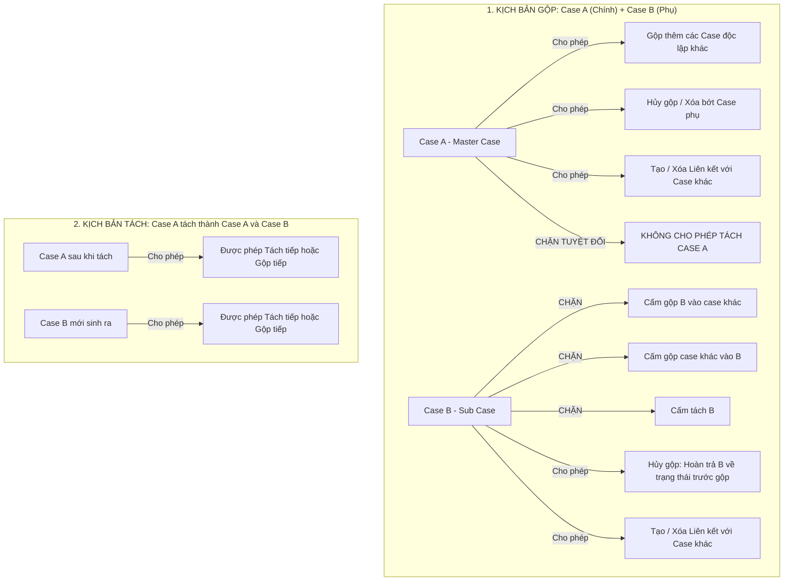

# TÀI LIỆU PHÂN TÍCH & THIẾT KẾ CHI TIẾT
## 5.6.4 PHÂN CẤP, LIÊN KẾT VÀ BẢO MẬT TÌNH HUỐNG
### b) LIÊN KẾT, GỘP VÀ TÁCH TÌNH HUỐNG (LINK, MERGE & SPLIT CASES) - BẢO TOÀN NGUYÊN VẸN LỊCH SỬ XỬ LÝ
**Phân hệ:** Quản lý Sự việc SOAR (NCS SOAR - Incident Management)  
**Tương thích:** Giao diện mới chuẩn hóa theo thiết kế `NCS SOAR - Case list.html`  
**Ngày cập nhật:** 15/09/2026 (Phiên bản v2.4 - Chi tiết Hóa Logic & Giao diện các Popup Liên kết, Gộp, Tách Tình huống)  
**Trạng thái:** Đã hoàn thiện toàn diện

---

## 1. TỔNG QUAN YÊU CẦU & BỐI CẢNH VẬN HÀNH

Trong hoạt động giám sát và ứng cứu sự cố SOC thực tế, các cuộc tấn công mạng thường có tính chất phân tán, kéo dài và phát sinh hàng loạt cảnh báo (Alerts) liên tiếp. Yêu cầu **5.6.4 b** đặt ra nhằm giải quyết các bài toán tác chiến trọng yếu:
1. **Liên kết (Link Cases):** Nhận diện các sự việc độc lập nhưng có mối liên hệ mật thiết (cùng một chiến dịch APT, cùng một nhóm hacker, cùng sử dụng chung dải IP C2/mã độc, hoặc sự cố A là nguyên nhân gốc dẫn tới sự cố B) mà không làm mất đi tính độc lập xử lý của từng đơn vị/khách hàng.
2. **Gộp (Merge Cases):** Hợp nhất các sự việc trùng lặp (Duplicates) hoặc nhiều cảnh báo phát sinh từ cùng một sự cố duy nhất trên cùng một khách hàng để quy về một đầu mối điều tra tập trung (Master Case), tránh lãng phí nguồn lực SOC và sai lệch chỉ số KPI.
3. **Tách (Split Cases):** Khi một sự việc ban đầu quá lớn, hoặc sau khi phân tích phát hiện chứa đựng các vector tấn công khác nhau tác động vào các phân vùng mạng khác nhau, hệ thống cho phép tách một phần cảnh báo/bằng chứng (Alerts + IOCs) ra thành một Sự việc mới độc lập; hoặc hoàn tác việc gộp nhầm (Unmerge).
4. **Bảo toàn lịch sử (Audit Trail & Timeline Preservation):** Toàn bộ lịch sử xử lý, ý kiến thảo luận, các bước thay đổi trạng thái của Case nào sẽ được **lưu giữ nguyên vẹn tại chính Case đó**, đảm bảo tính toàn vẹn pháp lý (Forensic Integrity) và không gây xáo trộn dòng thời gian điều tra.
5. **Thao tác nhanh từ Cột Hành động (Row Actions):** Bổ sung trực tiếp các biểu tượng hành động Liên kết `[🔗]`, Gộp `[⛙]`, Tách `[✂]` ngay trên từng dòng của danh sách sự việc, đi kèm kiểm soát ma trận trạng thái chặt chẽ.

---

## 2. PHÂN ĐỊNH 3 MÔ HÌNH NGHIỆP VỤ CỐT LÕI

| Tiêu chí | 1. Liên kết tình huống (Link Cases) | 2. Gộp tình huống (Merge Cases) | 3. Tách tình huống (Split Cases) |
| :--- | :--- | :--- | :--- |
| **Bản chất quan hệ** | **Quan hệ mềm (Loose Coupling - M:N)** | **Quan hệ cứng (Tight Coupling - N $\rightarrow$ 1)** | **Phân rã (Decomposition - 1 $\rightarrow$ N)** |
| **Tác động vòng đời** | Các Case tham gia **giữ nguyên 100% trạng thái** độc lập, SLA riêng, người xử lý riêng. | **Chỉ còn 01 Case chính (Master Case) hoạt động.** Các Case phụ (Sub-cases) chuyển trạng thái `Đã gộp (Merged)` và khóa Chỉ đọc (Read-only). | Sinh ra 01 hoặc nhiều **Case mới** độc lập; hoặc khôi phục lại Case cũ về trạng thái trước gộp. |
| **Dịch chuyển dữ liệu** | Không chuyển dữ liệu, chỉ lưu bản ghi quan hệ tham chiếu hai chiều giữa các Case. | Cảnh báo (Alerts), Bằng chứng / IOCs, Công việc (Tasks) chưa hoàn thành của Case phụ được chuyển giao/ánh xạ vào Case chính. | Một phần Alert, IOC, Task được chọn chuyển sang Case mới; phần còn lại tiếp tục xử lý ở Case cũ. |
| **Cơ chế Lịch sử xử lý** | **Giữ nguyên 100% tại từng Case**, chỉ ghi nhận thêm log thiết lập liên kết. | **Lịch sử xử lý của Case nào giữ nguyên tại Case đó.** Không sao chép log cũ của Case phụ sang Case chính. Chỉ ghi nhận 1 log sự kiện Gộp trên cả 2 Case. | **Case mới bắt đầu Timeline riêng từ thời điểm tách.** Case gốc giữ nguyên lịch sử cũ và ghi nhận 1 log đã tách đối tượng sang Case mới. |
| **Bảo mật Multi-tenancy** | Cho phép liên kết tham chiếu chiến dịch (Campaign) xuyên khách hàng. | **Tuyệt đối cấm gộp khác Khách hàng.** *(Nút Gộp tự động DISABLE trên UI khi chọn khác khách hàng; Popup chỉ tìm kiếm case cùng khách hàng)* | Kế thừa thông tin khách hàng và phòng ban của Case gốc (Read-only). |

---

## 3. QUY TẮC VẬN HÀNH NGHIỆP VỤ CỐT LÕI (CORE BUSINESS RULES)

Để đảm bảo luồng nghiệp vụ vận hành rõ ràng, loại trừ hoàn toàn các xung đột logic và phân mảnh dữ liệu cảnh báo, toàn bộ hệ thống tuân thủ theo các quy tắc cốt lõi sau:



---

### 3.1. Kịch bản Gộp: Case A gộp với Case B (Case A là Case chính, Case B là Case phụ)

Sau khi hoàn tất thao tác gộp, quyền hạn và hành vi của từng case được xác lập rõ ràng như sau:

#### A. Đối với Case A (Case chính - Master Case):
1. **Gộp thêm (Add more Sub-cases):** 
   * Case A **cho phép gộp thêm các case khác vào**. Khi gộp thêm, Case A vẫn tiếp tục giữ vai trò là Case chính, và các case được gộp thêm bắt buộc phải là **các case độc lập (hiện đang không bị gộp vào case nào)** và **cùng khách hàng** với Case A.
   * **Quy tắc trạng thái Đóng của Case chính A:** 
     * Nếu Case chính A đang ở trạng thái **ĐÓNG (`Closed`)**: Hệ thống **chỉ cho phép gộp thêm các case khác cũng ở trạng thái ĐÓNG**, tuyệt đối **KHÔNG CHO PHÉP gộp thêm case đang ở trạng thái MỞ**. *(Lý do: Nếu cho gộp một sự việc đang mở vào một hồ sơ đã đóng thì bắt buộc phải mở lại case A, làm sai lệch trạng thái đóng sổ và chỉ số MTTR đã lưu trữ)*.
2. **Hủy bớt case phụ (Remove Sub-cases):**
   * Case chính A **cho phép hủy gộp (xóa bớt) từng case phụ** đang gộp vào nó. Việc xóa bớt một case phụ sẽ phục hồi riêng case phụ đó mà không làm ảnh hưởng đến các case phụ còn lại trong Case A.
3. **CẤM TÁCH CASE (No Split):**
   * Case chính A **KHÔNG ĐƯỢC PHÉP TÁCH CASE**. 
   * *Nguyên nhân xung đột:* Nếu Case B có các cảnh báo $\{Alert_1, Alert_2, Alert_3\}$ gộp vào Case A. Sau đó Case A lại tách $Alert_2$ sang Case C mới. Đến khi người dùng thực hiện Hủy gộp Case B thì $Alert_2$ sẽ bị rơi vào tình trạng xung đột không thể giải quyết (nếu trả về cho B thì Case C bị mất chứng cứ, nếu giữ ở C thì Case B bị mất dữ liệu gốc ban đầu). Vì vậy, hệ thống **chặn hoàn toàn việc tách đối với case đang trong quan hệ gộp**.
4. **Tạo / Xóa liên kết (Link Management):**
   * Case A **vẫn được quyền tạo mới hoặc xóa liên kết** với các case khác bình thường.

#### B. Đối với Case B (Case phụ - Sub-case):
1. **Khóa chức năng Gộp (Lock Merge):**
   * Case B **KHÔNG ĐƯỢC PHÉP gộp vào case khác**, và cũng **KHÔNG ĐƯỢC PHÉP gộp case khác vào nó** (chặn triệt để chuỗi gộp lồng nhau gây rối loạn phân cấp và xung đột SLA).
2. **Hủy gộp hoàn trả trạng thái (Unmerge):**
   * Người dùng **được phép thực hiện HỦY GỘP**. Khi hủy gộp, Case B sẽ được hoàn trả nguyên vẹn về trạng thái độc lập trước khi gộp (mở lại chế độ chỉnh sửa, SLA tiếp tục đếm, giữ nguyên đầy đủ lịch sử xử lý ban đầu).
3. **CẤM TÁCH CASE (No Split):**
   * Case B đang ở trạng thái `Đã gộp` và khóa Chỉ đọc (Read-only), do đó **KHÔNG CHO PHÉP TÁCH CASE**.
4. **Tạo / Xóa liên kết (Link Management):**
   * Case B **vẫn cho phép tạo mới hoặc xóa liên kết** với các case khác để phục vụ việc tham chiếu chiến dịch điều tra.

---

### 3.2. Kịch bản Tách: Case A được tách thành Case A và Case B

Khi một sự việc độc lập ban đầu (Case A) được phân tách thành Case A (sau khi trích xuất bớt dữ liệu) và Case B (sự việc mới được sinh ra):
1. **Cả Case A và Case B đều là các thực thể ĐỘC LẬP HOÀN TOÀN** (mỗi case có ID riêng, SLA riêng, người thụ lý riêng).
2. **Quyền hạn tiếp theo:** 
   * **Cả Case A và Case B đều ĐƯỢC PHÉP TÁCH TIẾP** (nếu tiếp tục phát sinh các nhánh điều tra mới và thỏa mãn điều kiện có từ 2 alert/IOC trở lên).
   * **Cả Case A và Case B đều ĐƯỢC PHÉP GỘP TIẾP** vào các case khác (hoặc làm Master Case cho case khác cùng khách hàng).
3. **Phả hệ nguồn gốc:** Mối quan hệ nguồn gốc `[Case B tách từ Case A]` được lưu giữ dạng tham chiếu lịch sử và không hề hạn chế bất kỳ quyền xử lý tác chiến nào của cả hai case.

---

## 4. THIẾT KẾ GIAO DIỆN & TƯƠNG TÁC NGƯỜI DÙNG (UI/UX SPECIFICATION)

---

### 4.1. Bảng Dữ liệu Sự việc (Case Data Table)

#### A. Cột Hành động (Actions Column)
Bổ sung bộ 3 icon thao tác quan hệ nhanh trên từng dòng:
```
[ 🔗 ]  [ ⛙ ]  [ ✂ ]  |  [ 👁 ]  [ ⋮ ]
(Link)  (Merge) (Split)   (Detail) (More)
```
* **Icon `[ 🔗 ]` (Liên kết):** Luôn sáng. Click mở Popup tìm kiếm các case chưa liên kết để tạo liên kết nhanh.
* **Icon `[ ⛙ ]` (Gộp):** 
  * Sáng khi Case đang Mở (Normal hoặc Master).
  * Bị **Disabled (mờ `opacity-30`, con trỏ `not-allowed`)** khi Case là **Case phụ (`Đã gộp`)**.
* **Icon `[ ✂ ]` (Tách):** 
  * Chỉ sáng với Case độc lập có $\ge 2$ Alert hoặc có IOC.
  * Bị **Disabled** đối với: (1) Case phụ đã gộp, (2) Case chính đang chứa case phụ, (3) Case chỉ có 1 alert duy nhất.

#### B. Cột "Quan hệ" (Relations Column) - Xử lý Trường hợp 1 Case Vừa Gộp Vừa Liên kết
Khi một case vừa có quan hệ gộp (Master/Sub), vừa có nhiều case liên kết (Link), vừa mang phả hệ tách:
1. **Hiển thị gọn gàng trên bảng (Tối đa 02 Chip ưu tiên):**
   * *Ưu tiên 1 (Quan hệ Cứng - Gộp):* Chip `2 phụ` hoặc `Thuộc CA...`
   * *Ưu tiên 2 (Quan hệ Mềm - Liên kết):* Chip `3 liên kết`
   * *Nếu có thêm quan hệ khác:* Hiển thị chip phụ `+1 quan hệ`
2. **Popover Xem nhanh khi Hover / Click vào Ô:**
   Hiển thị khung thông tin nổi phân loại rõ ràng từng nhóm:
   * *Tình huống gộp:* Danh sách các case phụ hoặc case chính.
   * *Tình huống liên kết:* Danh sách các case liên kết kèm tên khách hàng.
   * *Phả hệ nguồn gốc:* Tách từ case nào, ngày nào.
   * Click vào mã case trong Popover để mở xem trực tiếp.

---

### 4.2. Màn hình Chi tiết (Drawer & Full Detail View): Tab "Sự việc liên quan"

Tên tab được chuẩn hóa là: **Tab: "Sự việc liên quan"**.

#### A. Thanh Tiêu đề Tab & Nút Thao tác Nhanh
* **Nút `[ + Thêm liên kết ]`:** Luôn sáng, mở popup tìm kiếm và thêm liên kết mới.
* **Nút `[ ⛙ Gộp sự việc ]`:**
  * Sáng rõ khi case đang xem là Case bình thường hoặc Master Case đang mở.
  * Bị ẩn hoặc mờ khi case đang xem là Case phụ đã gộp hoặc Case đã đóng.

#### B. Cấu trúc 3 Phân khu Chi tiết trong Tab "Sự việc liên quan":

##### 1. Phân khu 1: Sự việc gộp
* **Nếu case đang xem là CASE CHÍNH (Master Case):**
  - Hiển thị danh sách bảng các Case phụ đang gộp vào nó.
  - **Trên từng dòng Case phụ:** Có nút **`[ ↩ Hủy gộp ]`** để tách riêng case phụ đó ra độc lập mà không ảnh hưởng các case phụ khác.
  - Có nút **`[ + Gộp thêm sự việc ]`** ngay dưới chân bảng.
* **Nếu case đang xem là CASE PHỤ (Sub-case đã gộp):**
  - Hiển thị khối thông báo màu cam hổ phách:
    > ⚠️ **Sự việc này đã được gộp vào Sự việc chính: [CA99281034 - APT29 Phishing Attack]**  
  - Có 2 nút hành động trực tiếp:
    - **`[ ➜ Xem Sự việc chính ]`**: Chuyển ngay đến màn hình của Case chính.
    - **`[ ↩ Hủy gộp Sự việc này ]`**: Phục hồi case này về trạng thái độc lập trước khi gộp và tiếp tục tính SLA.
* **Nếu case chưa gộp với ai:** Hiển thị thông báo hướng dẫn và nút mời gộp.

##### 2. Phân khu 2: Sự việc liên kết
* Hiển thị danh sách tất cả các case đang liên kết với case hiện tại (Mã case, Tiêu đề, Khách hàng, Loại liên kết, Căn cứ).
* **Thao tác trên từng dòng:**
  - Nút xem chi tiết case liên kết `[ 👁 ]`.
  - Nút **`[ ✕ Xóa liên kết ]`**: Cho phép xóa bỏ mối liên kết giữa 2 case bất kỳ lúc nào.
* Nút **`[ + Thêm liên kết mới ]`** ở đầu danh sách.

##### 3. Phân khu 3: Nguồn gốc
* Nếu case này được sinh ra từ việc tách: Hiển thị badge `✂ Tách từ Sự việc [CA...] lúc [Thời_gian] bởi [Người_tách]`.
* Nếu case này đã từng tách ra các case con: Hiển thị danh sách các case con đã được trích xuất từ nó.

---

### 4.3. ĐẶC TẢ CHI TIẾT LOGIC & THÔNG TIN HIỂN THỊ TRÊN CÁC POPUP THAO TÁC

Nhằm đảm bảo tính chính xác và nhất quán trong quá trình lập trình và vận hành, dưới đây là đặc tả chi tiết giao diện và luồng dữ liệu cho từng Popup khi người dùng thao tác:

---

#### 4.3.1. Popup "Tạo liên kết sự việc"

1. **Mục đích:** Cho phép người dùng tìm kiếm một hoặc nhiều sự việc khác để thiết lập mối quan hệ liên kết (tham chiếu điều tra) với sự việc đang thao tác.
2. **Luồng nghiệp vụ & Logic tìm kiếm:**
   * Khi mở popup từ Sự việc $A$, hệ thống hiển thị ô nhập từ khóa tìm kiếm: `[ 🔍 Nhập mã sự việc, tiêu đề... ]`.
   * **Quy tắc lọc dữ liệu (Search Filtering Rules):**
     * **Chỉ tìm kiếm các case CHƯA liên kết với Case A** (hệ thống tự động loại trừ chính Case A và toàn bộ các case đã có liên kết từ trước với Case A).
     * **Phạm vi khách hàng:** Cho phép tìm kiếm cả các case cùng khách hàng lẫn khác khách hàng (nếu tài khoản có quyền truy cập) để phục vụ liên kết chiến dịch APT / dùng chung mã độc xuyên đơn vị.
   * Khi người dùng gõ từ khóa, danh sách kết quả hiển thị dạng bảng/danh sách gợi ý: Mã sự việc, Tiêu đề, Khách hàng, Trạng thái, Mức độ nghiêm trọng.
   * Người dùng click chọn các case muốn liên kết (hỗ trợ chọn nhiều case cùng lúc).
3. **Các trường thông tin cấu hình trên Popup:**
   * `Loại liên kết *` (Dropdown bắt buộc):
     * *Cùng chiến dịch APT (Campaign)*
     * *Chung hạ tầng IOC / Mã độc (Shared Malware/IOC)*
     * *Quan hệ Nguyên nhân - Hệ quả (Root Cause / Derivative)*
     * *Nghi vấn liên quan điều tra (Investigative Association)*
   * `Căn cứ / Ghi chú liên kết` (Textarea tùy chọn): Nhập tóm tắt lý do kết nối để phục vụ báo cáo đối soát.
4. **Hành động Lưu:**
   * Nhấn `[ Lưu liên kết ]`: Hệ thống ghi nhận quan hệ vào bảng `soar_case_links`, hiển thị thông báo thành công (Toast) và cập nhật số lượng liên kết tại ô Quan hệ/Tab Sự việc liên quan mà không làm reload lại toàn trang.

---

#### 4.3.2. Popup "Gộp sự việc"

Popup Gộp tình huống được thiết kế thông minh, tự động phân nhánh logic tùy theo trạng thái và vai trò của các case tham gia:

1. **Điều kiện tiên quyết Bảo mật:** **CHỈ TÌM VÀ HIỂN THỊ CÁC CASE CÙNG KHÁCH HÀNG** với case hiện tại (`Customer(B) == Customer(A)`).

2. **Phân nhánh Logic theo Trạng thái & Vai trò của Case hiện tại:**

   * **Nhánh 1: Case hiện tại đang là CASE CHÍNH (Master Case) và ĐANG MỞ (`Open`):**
     - Tiêu đề popup: *Gộp thêm sự việc vào Sự việc chính [Mã_Case_A]*.
     - Ô tìm kiếm: Tìm kiếm các case cùng khách hàng.
     - **Quy tắc lọc:** **CHỈ TÌM THẤY CÁC CASE CHƯA TỪNG BỊ GỘP** (loại trừ các case đã là case phụ của vụ việc khác).
     - **Xác định vai trò:** **Mặc định Case A tiếp tục là Case chính**, các case được tìm và chọn thêm sẽ trở thành Case phụ mới của Case A.

   * **Nhánh 2: Case hiện tại đang là CASE CHÍNH (Master Case) nhưng ĐÃ ĐÓNG (`Closed`):**
     - Tiêu đề popup: *Gộp sự việc đã đóng vào Sự việc chính [Mã_Case_A]*.
     - **Quy tắc lọc đặc biệt:** **CHỈ TÌM ĐƯỢC CÁC CASE CHƯA TỪNG BỊ GỘP VÀ CŨNG Ở TRẠNG THÁI ĐÃ ĐÓNG (`Closed`)**.
     - **Chặn:** Tuyệt đối không hiển thị và không cho chọn các case đang ở trạng thái Mở (tránh làm thay đổi trạng thái đã đóng sổ của Case A).

   * **Nhánh 3: Case hiện tại CHƯA ĐƯỢC GỘP (Case độc lập bình thường):**
     - Khi mở popup hoặc khi chọn nhiều case trên danh sách:
       - **Trường hợp 3.1: Tất cả các case được chọn đều là case ĐỘC LẬP (chưa case nào là case chính):**
         - Hệ thống hiển thị danh sách tất cả các case được chọn.
         - **Bắt buộc người dùng phải chọn 01 case làm Case chính (Master Case)** bằng nút radio.
         - Danh sách được sắp xếp tự động từ trên xuống dưới theo thứ tự ưu tiên khách quan: *Đang mở > Mức độ nguy hiểm > Thời hạn SLA > Tạo sớm*. (Case đã đóng không được chọn làm Case chính nếu có case mở).
       - **Trường hợp 3.2: Trong các case được chọn ĐÃ CÓ SẴN 01 CASE CHÍNH:**
         - Hệ thống **BẮT BUỘC case chính đó phải tiếp tục giữ vai trò là Case chính**, các case độc lập còn lại sẽ gộp vào case chính đó (khóa radio chọn case chính, cố định vào case chính đã có).
       - **Trường hợp 3.3: Người dùng chọn 02 CASE ĐỀU ĐANG LÀ CASE CHÍNH:**
         - **HỆ THỐNG CHẶN HOÀN TOÀN (CẤM GỘP):** Vô hiệu hóa nút xác nhận gộp, hiển thị cảnh báo lỗi:
           `Không thể gộp: Cả 2 sự việc đã chọn đều đang là Sự việc chính của các sự việc phụ khác.`

3. **Thông tin cấu hình bổ sung khi Gộp:**
   * `Lý do gộp sự việc *` (Dropdown: Trùng lặp cảnh báo, Cùng một sự cố máy chủ, Phát hiện lặp lại từ một nguồn tấn công...).
   * `Ghi chú chi tiết` (Textarea).
   * Nút xác nhận: `[ Xác nhận gộp sự việc ]`.

---

#### 4.3.3. Popup "Tách sự việc"

Popup Tách tình huống chỉ áp dụng cho các case độc lập (chưa từng gộp), cho phép phân rã một phần tài nguyên sang một sự việc độc lập mới.

1. **Giao diện Phần 1: Lựa chọn Tài nguyên chuyển giao sang Case mới:**
   * **Bảng danh sách Cảnh báo (Alerts):**
     - Hiển thị danh sách toàn bộ Alert hiện có trong case gốc kèm checkbox từng dòng.
     - Cột hiển thị: Mã cảnh báo, Thời gian, Nội dung, Mức độ nghiêm trọng.
     - Người dùng tích chọn $\ge 1$ Alert muốn chuyển sang case mới. (Không cho phép chọn tất cả nếu không có IOCs nào ở lại, nhằm tránh biến case gốc thành case rỗng).
   * **Bảng danh sách Chỉ số an ninh (IOCs - Indicators of Compromise):**
     - Hiển thị danh sách các IOCs hiện có: IP nguy hại, Domain độc hại, Mã băm File Hash, URL.
     - Có checkbox từng dòng để người dùng tick chọn các IOCs thuộc về nhánh tấn công mới để chuyển sang case mới.

2. **Giao diện Phần 2: Cấu hình Thông tin Tình huống mới sinh ra:**
   * **Thông tin Nhận diện & Nghiệp vụ (Người dùng nhập):**
     * `Tên sự việc mới *` (Text Input - Bắt buộc).
     * `Mô tả *` (Textarea Description - Bắt buộc): Nhập bối cảnh và lý do phân tách để phục vụ tổ công tác tiếp nhận.
     * `Mức độ nghiêm trọng *` (Dropdown: *Nghiêm trọng (Critical)*, *Cao (High)*, *Trung bình (Medium)*, *Thấp (Low)*).
     * `Mức độ ưu tiên *` (Dropdown: *P1 Khẩn cấp*, *P2 Cao*, *P3 Trung bình*, *P4 Thấp*).
     * `SLA *` (Dropdown: *SLA Khẩn cấp 1h*, *SLA Tiêu chuẩn 4h*, *SLA 8h*, *SLA 24h*, *SLA 72h*).
     * `Người xử lý ` (Dropdown chọn chuyên viên tiếp nhận xử lý case mới).
     * `Lý do tách *` (Dropdown: *Phát hiện nhánh xâm nhập độc lập*, *Chuyểsn giao đơn vị phụ trách chuyên môn*, *Cảnh báo không cùng chuỗi tấn công*...) hoặc cho phép người dùng tự nhập text thủ công.
   * **Thông tin Kế thừa từ Case cũ (Tự động & Khóa Chỉ đọc):**
     * `Khách hàng (Customer)`: **Tự động kế thừa từ Case cũ** (hiển thị dạng combobox và disable).
     * `Đơn vị xử lý (Unit / Department)`: **Tự động kế thừa từ Case cũ** (hiển thị dạng combobox và disable).

3. **Hành động Xác nhận:**
   * Nhấn `[ ✂ Tách sự việc ]`:
     - Hệ thống sinh ra Case mới với mã sự việc mới (ví dụ: `CA43301388`).
     - Chuyển giao các Alert và IOC đã tick chọn sang Case mới.
     - Ghi log audit trail trên cả Case cũ và Case mới.
     - Đưa Case mới lên đầu danh sách sự việc kèm chip `Tách từ {Mã_Case_Gốc}` tại cột Quan hệ.

---

---

## 5. THIẾT KẾ CƠ SỞ DỮ LIỆU ĐỀ XUẤT (DATABASE SCHEMA)

```sql
-- 1. Bảng lưu mối quan hệ Liên kết giữa các Case (M:N)
CREATE TABLE soar_case_links (
    id UUID PRIMARY KEY DEFAULT gen_random_uuid(),
    source_case_id UUID NOT NULL REFERENCES soar_cases(id) ON DELETE CASCADE,
    target_case_id UUID NOT NULL REFERENCES soar_cases(id) ON DELETE CASCADE,
    link_type VARCHAR(50) NOT NULL, -- 'CAMPAIGN', 'SHARED_IOC', 'ROOT_CAUSE', 'RELATED'
    rationale TEXT, -- Căn cứ / ghi chú liên kết
    created_at TIMESTAMP WITH TIME ZONE DEFAULT NOW(),
    created_by VARCHAR(100) NOT NULL,
    CONSTRAINT unique_case_pair UNIQUE (source_case_id, target_case_id),
    CONSTRAINT chk_no_self_link CHECK (source_case_id <> target_case_id)
);

-- 2. Bảng lưu lịch sử Gộp & Hủy gộp (Merge Audit & Lineage)
CREATE TABLE soar_case_merges (
    id UUID PRIMARY KEY DEFAULT gen_random_uuid(),
    master_case_id UUID NOT NULL REFERENCES soar_cases(id),
    sub_case_id UUID NOT NULL REFERENCES soar_cases(id) UNIQUE, -- 1 sub-case chỉ thuộc 1 master case
    customer_id UUID NOT NULL, -- Bắt buộc cùng customer_id
    merge_reason TEXT NOT NULL,
    merged_at TIMESTAMP WITH TIME ZONE DEFAULT NOW(),
    merged_by VARCHAR(100) NOT NULL,
    is_unmerged BOOLEAN DEFAULT FALSE,
    unmerged_at TIMESTAMP WITH TIME ZONE,
    unmerged_by VARCHAR(100),
    unmerge_reason TEXT
);

-- 3. Bổ sung trường trong bảng Sự việc (soar_cases)
ALTER TABLE soar_cases ADD COLUMN IF NOT EXISTS parent_case_id UUID REFERENCES soar_cases(id); -- Trường hợp Tách từ case gốc
ALTER TABLE soar_cases ADD COLUMN IF NOT EXISTS is_merged BOOLEAN DEFAULT FALSE; -- True nếu là case phụ đã gộp
ALTER TABLE soar_cases ADD COLUMN IF NOT EXISTS current_master_case_id UUID REFERENCES soar_cases(id); -- Trỏ tới master case nếu đã gộp
```

---

## 6. KẾT LUẬN

* **Quy tắc Case chính:** Cho phép gộp thêm (chỉ gộp case mở nếu case chính mở; nếu case chính đóng thì chỉ gộp case đóng), cho phép xóa bớt case phụ, cấm tách case, cho phép tạo/xóa liên kết.
* **Quy tắc Case phụ:** Cấm gộp vào case khác, cấm gộp case khác vào nó, cấm tách case, cho phép hủy gộp để hoàn trả trạng thái trước gộp, cho phép tạo/xóa liên kết.
* **Quy tắc Case sau khi tách:** Cả case cũ và case mới đều là thực thể độc lập, được phép tách tiếp hoặc gộp tiếp bình thường.
* **Giao diện tối ưu:** Cột Quan hệ hiển thị chip đa quan hệ kèm Popover chi tiết; Tab "Sự việc liên quan" trang bị đầy đủ nút Gộp thêm, Hủy gộp, Thêm/Xóa liên kết trên từng dòng.
