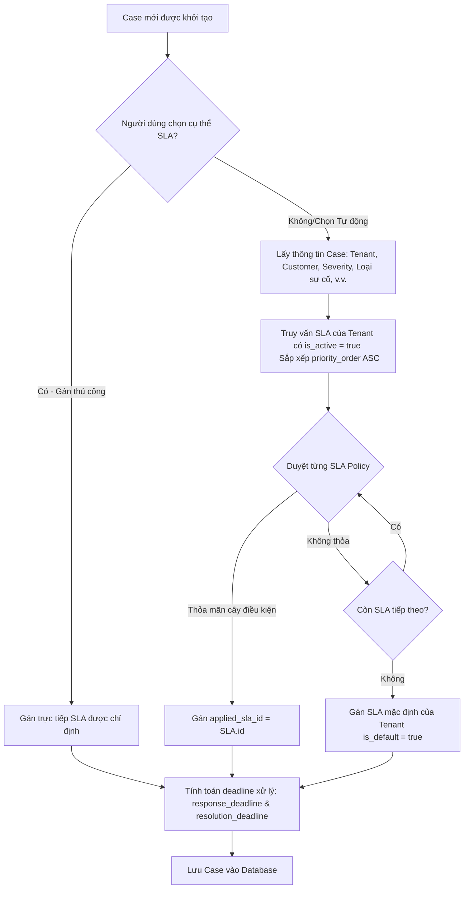
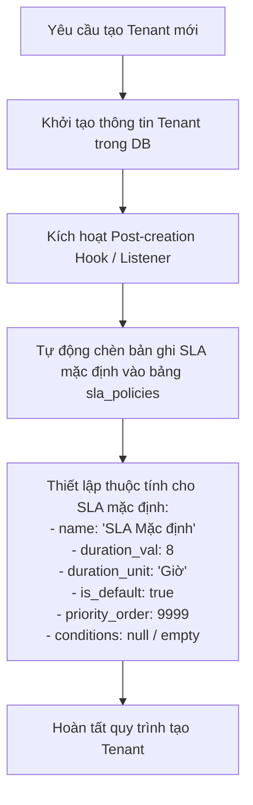

# TÀI LIỆU THIẾT KẾ CHI TIẾT: PHÂN HỆ QUẢN LÝ QUY TẮC SLA (CKTH) TỰ ĐỘNG - SOAR

Tài liệu này đặc tả chi tiết kiến trúc cơ sở dữ liệu, cấu trúc dữ liệu cây điều kiện, luồng xử lý nghiệp vụ của backend và thiết kế giao diện (UI) để tích hợp tính năng **Tự động áp dụng SLA theo quy tắc cây điều kiện** trong hệ thống SOAR đa thuê bao (Multi-tenant) và nhiều khách hàng (Multi-customer).

---

## 1. TỔNG QUAN HỆ THỐNG & MỤC TIÊU

### Bối cảnh Hiện tại
- Hệ thống đã có danh mục SLA (mỗi SLA gồm Tên và Thời hạn xử lý).
- Khi tạo Case (thủ công hoặc tự động qua Correlation Rules), người dùng chọn trực tiếp một SLA tĩnh hoặc Correlation Rule được cấu hình gán cứng một SLA.

### Mục tiêu Nâng cấp
1. **Tách biệt SLA theo từng Tenant:** Mỗi Tenant có danh sách SLA riêng.
2. **Áp dụng SLA tự động dựa trên Điều kiện (SLA Rules Engine):** Cho phép cấu hình cây điều kiện logic (nhóm AND/OR, trường thông tin của Case, toán tử, giá trị so sánh) để tự động quyết định Case thuộc SLA nào.
3. **Thứ tự Ưu tiên (Priority Order):** Cho phép sắp xếp thứ tự ưu tiên đánh giá giữa các chính sách SLA trong cùng một Tenant.
4. **SLA Mặc định cho Tenant mới:** Khi tạo mới một Tenant trên hệ thống, hệ thống tự động sinh ra một SLA mặc định (`is_default = true`, không cần điều kiện lọc) để làm phương án dự phòng (Fallback).

---

## 2. LUỒNG XỬ LÝ NGHIỆP VỤ (BACKEND & SLA ENGINE LOGIC)

### 2.1. Luồng Tự động Gán SLA khi Tạo Case mới
Khi có một Case được tạo ra (bất kể tạo thủ công từ màn hình Case, Alerts, tạo từ API bên ngoài, hay tạo tự động từ Correlation Rules), hệ thống sẽ kích hoạt **SLA Matching Engine**:

#### Giải thích các bước xử lý logic của SLA Matching Engine (Backend):
1. **Kiểm tra chỉ định thủ công:** Nếu Case được tạo từ giao diện thủ công và người dùng chọn chính xác một SLA (ví dụ: "Emergency SLA"), hệ thống bỏ qua bước quét luật và gán trực tiếp.
2. **Trường hợp tự động (Mặc định):** Nếu Case được tạo tự động từ Correlation Rule (đã thiết lập tùy chọn "Tự động gán SLA theo quy tắc") hoặc người dùng tạo thủ công chọn tùy chọn "Tự động phân bổ", Engine bắt đầu hoạt động.
3. **Lấy danh sách SLA Policy:** Thực hiện câu truy vấn SQL lấy danh sách chính sách SLA của Tenant đang xử lý:
4. **So khớp Cây Điều kiện (Evaluator):** Backend duyệt qua từng SLA, thực hiện đệ quy giải mã cây điều kiện trong trường `conditions` và so sánh với thuộc tính của Case.
   - *Phép so sánh Toán tử:*
     - `==`: Case[field] bằng với Value.
     - `!=`: Case[field] khác Value.
     - `in`: Case[field] nằm trong tập hợp các giá trị được phân tách bằng dấu phẩy trong Value.
     - `>`, `<`: Áp dụng cho các trường số hoặc so sánh độ nghiêm trọng (nếu quy đổi ra điểm số).
     - `contains`: Case[field] (kiểu chuỗi) chứa Value.
     - `regex`: Case[field] khớp với biểu thức chính quy trong Value.
5. **Fallback Cơ chế:** Nếu chạy hết danh sách vẫn không có SLA nào khớp, backend thực hiện gán SLA mặc định cho case
---

### 2.2. Luồng Tự động Tạo SLA Mặc định khi Tạo Tenant mới
Để đảm bảo mỗi Tenant luôn có tối thiểu một SLA mặc định khi vừa được tạo:

---

## 3. ĐẶC TẢ THAY ĐỔI TRÊN GIAO DIỆN NGƯỜI DÙNG (UI/UX SPECIFICATIONS)

Dựa trên cấu trúc giao diện hiện tại của hệ thống (Danh sách SLA và Modal Tạo mới SLA trong các ảnh đính kèm), chúng tôi đề xuất các thay đổi giao diện cụ thể như sau:

### 3.1. Màn hình Danh sách SLA (SLA List View)

Trên màn hình danh sách SLA, đề xuất bổ sung thông tin:
- **Cột "Độ ưu tiên":** 
  - Giá trị hiển thị sẽ là chỉ số `priority_order` (ví dụ: `1`, `2`, `3`). Đối với SLA mặc định thì hiển thị `-`.
- **Thêm cột "SLA mặc định":**
  - Chèn cột này sau cột `Tên SLA` hoặc trước cột `Trạng thái`. Cột này chứa một ô checkbox để người dùng phân biệt nhanh đâu là SLA mặc định.
  - Ô checkbox này **luôn ở trạng thái disabled (không cho người dùng tương tác trực tiếp trên bảng)**. Chỉ bản ghi SLA mặc định của Tenant là được tick chọn (`checked = true`), các bản ghi còn lại sẽ bỏ chọn.
- **Thêm cột "Quy tắc áp dụng":**
  - Chèn cột này vào trước cột **`Thời hạn`**.
  - Hiển thị tóm tắt ngắn gọn cây điều kiện (ví dụ: `Mức độ IN (Critical, High) AND Khách hàng IN (VIB, EVN)`).
  - Nếu là SLA mặc định, cột này sẽ hiển thị: `Áp dụng cho tất cả (Mặc định)`.

> [!WARNING]
> **Ràng buộc đối với SLA mặc định trên màn hình danh sách:**
> - Không cho phép thay đổi trạng thái kích hoạt của SLA mặc định trực tiếp từ bảng (nút gạt/toggle Trạng thái tại dòng này sẽ bị vô hiệu hóa hoàn toàn).
> - Không cho phép xóa SLA mặc định (nút Xóa tại dòng của SLA mặc định bị vô hiệu hóa).
> - Người dùng vẫn có thể bấm nút Sửa để thay đổi một số thông tin cơ bản được phép của SLA mặc định.

### 3.2. Modal Tạo mới / Chỉnh sửa SLA (SLA Form Modal)

Đề xuất bổ sung các thông tin sau vào Modal Tạo mới / Chỉnh sửa SLA:

1. **Trường "Là SLA mặc định" (Checkbox):**
   - Đặt ngay dưới trường **`Thời hạn`**.
   - Nhãn hiển thị: **`Là SLA mặc định`**.
   - *Hành vi & Ràng buộc:* Ô checkbox này **luôn ở trạng thái disabled (không cho phép người dùng tự sửa)**. SLA mặc định chỉ được hệ thống tự động sinh ra khi tạo mới Tenant. Người dùng không được phép tự thiết lập một SLA thông thường thành SLA mặc định để tránh phá vỡ quy tắc "chỉ có duy nhất 1 SLA mặc định".
2. **Trường "Độ ưu tiên" (Number Input - Bắt buộc):**
   - Đặt tên trường là **`Độ ưu tiên`**.
   - Nhãn mô tả giải thích ngắn gọn ngay dưới tiêu đề: *'SLA có độ ưu tiên thấp hơn (số nhỏ hơn) sẽ được gán cho Case nếu sự việc khớp với nhiều SLA. Nhập số nguyên từ 1 đến 100.'*
   - *Validate dữ liệu:* 
     - Chỉ được phép nhập số nguyên (kiểm tra kiểu số).
     - Giá trị nhập phải nằm trong khoảng **từ 1 đến 100**.
     - Khi người dùng bấm Tạo hoặc Lưu, hệ thống kiểm tra trùng lặp. Nếu số độ ưu tiên đã tồn tại ở một SLA khác của Tenant, hệ thống sẽ chặn lưu và báo lỗi: **"Độ ưu tiên này đã được sử dụng. Vui lòng nhập giá trị khác từ 1 đến 100."**
3. **Phần "Cấu hình điều kiện áp dụng cho Sự cố" (Condition Builder Tree):**
   - Đặt ngay trên trường **`Mô tả`**. Chỉ hiển thị và hoạt động đối với các SLA quy tắc (không hiển thị đối với SLA mặc định).
   - **Tham chiếu giao diện & code:** Thiết kế UI và logic tương tự như phần cấu hình điều kiện lọc của tính năng Correlation Rule, gồm các khối logic AND/OR lồng nhau, các nút Thêm nhóm OR, Thêm điều kiện con và nút xóa.
   - **Các trường dữ liệu lọc cụ thể (Field) & Kiểu chọn Giá trị (Value):**
     * **Tên sự cố (`title`):** Trình nhập giá trị so sánh (Value) chỉ hiển thị **ô nhập văn bản (Input text) cho người dùng nhập tay**. Không hỗ trợ chọn nhiều.
     * **Loại sự cố (`incident_type`):** Trình nhập giá trị hiển thị dưới dạng **Hộp chọn nhiều dạng thẻ (Multi-select Tag Combobox)**. Giá trị mặc định là rỗng (hiển thị placeholder "Chọn giá trị..."). Khi nhấp vào sẽ xổ xuống danh sách các loại sự cố để click chọn. Mỗi giá trị được chọn hiển thị dạng nhãn (Tag) có nút `x` để xóa nhanh.
     * **Khách hàng (`customer_id`):** Trình nhập giá trị hiển thị dưới dạng **Hộp chọn nhiều dạng thẻ (Multi-select Tag Combobox)**. Dữ liệu các tùy chọn lấy từ danh sách khách hàng thuộc Tenant hiện tại. Mỗi giá trị được chọn hiển thị dạng nhãn (Tag) có nút `x` để xóa nhanh.
     * **Mức độ nguy hiểm (`severity`):** Trình nhập giá trị hiển thị dưới dạng **Hộp chọn nhiều dạng thẻ (Multi-select Tag Combobox)**. Gồm các tùy chọn: Critical, High, Medium, Low. Mỗi giá trị được chọn hiển thị dạng nhãn (Tag) có nút `x` để xóa nhanh.
   - **Toán tử so sánh (Operator):**
     * Dropdown chọn toán tử so sánh gồm: `bằng (==)`, `khác (!=)`, `thuộc danh sách (in)`, `chứa chuỗi (contains)`, `biểu thức chính quy (regex)`.
   - **Giá trị so sánh (Value):**
     * Tùy thuộc vào trường dữ liệu được chọn, giao diện hiển thị ô nhập text tự do (cho `Tên sự cố`) hoặc bộ chọn **Multi-select Tag Combobox** tương ứng (cho `Loại sự cố`, `Khách hàng`, `Mức độ nguy hiểm`).

> [!IMPORTANT]
> **Ràng buộc chỉnh sửa đối với SLA Mặc định trong Form Modal:**
> Khi mở Modal Chỉnh sửa một bản ghi SLA Mặc định:
> - **Các trường CHO PHÉP sửa:** Tên SLA (Tiếng Việt & Tiếng Anh), Thời hạn xử lý, Đơn vị thời hạn, Mô tả.
> - **Các trường BỊ KHÓA / VÔ HIỆU HÓA:**
>   - Trạng thái hoạt động (luôn ở trạng thái Kích hoạt, các nút radio chọn trạng thái bị disabled và ẩn ý nghĩa tương tác để tránh người dùng tắt SLA mặc định).
>   - Độ ưu tiên (bị ẩn).
>   - Cấu hình điều kiện áp dụng cho Sự cố (bị ẩn hoàn toàn vì SLA mặc định áp dụng cho mọi trường hợp fallback).
> - Nút Xóa SLA mặc định này trên giao diện hoàn toàn bị vô hiệu hóa.

---

### 3.3. Màn hình Tạo mới Sự việc (Case Creation Screen)

Đề xuất bổ sung lựa chọn Tự động gán (Theo quy tắc)** vào trường **`SLA *`** (Dropdown):

- **Tùy chọn Mặc định (Default Option):**
  - Bổ sung tùy chọn **`Tự động gán (Theo quy tắc)`** làm dòng đầu tiên trong Dropdown chọn SLA.
  - Tùy chọn này luôn được **chọn sẵn theo mặc định** khi người dùng mở form Tạo mới Sự việc.
- **Danh sách Tùy chọn Phụ (Static SLAs List):**
  - Phía bên dưới tùy chọn mặc định sẽ hiển thị danh sách các SLA tĩnh cụ thể thuộc Tenant đang hoạt động (ví dụ: `SLA 8h cho công việc`, `SLA 2h`, `SLA 30 phút`...).
  - Vẫn giữ nguyên nút Thêm nhanh (`+`) ở bên phải của Dropdown để cho phép Admin tạo nhanh SLA danh mục nếu cần.

> [!TIP]
> **Hành vi xử lý dữ liệu khi Lưu (Submit):**
> - **Nếu giữ nguyên `Tự động gán (Theo quy tắc)`:** Khi lưu Sự việc, Backend sẽ tự động kích hoạt **SLA Matching Engine** để duyệt qua các SLA hoạt động theo thứ tự ưu tiên (`priority_order` từ 1 đến 100) nhằm tìm kiếm và áp dụng SLA phù hợp nhất cho Case.
> - **Nếu chọn SLA cụ thể (Ví dụ: `SLA 8h cho công việc`):** Khi lưu Sự việc, hệ thống gửi lên `sla_id` tương ứng. Backend sẽ áp dụng cứng SLA này cho Case mà không chạy bộ so khớp quy tắc (SLA Engine).
