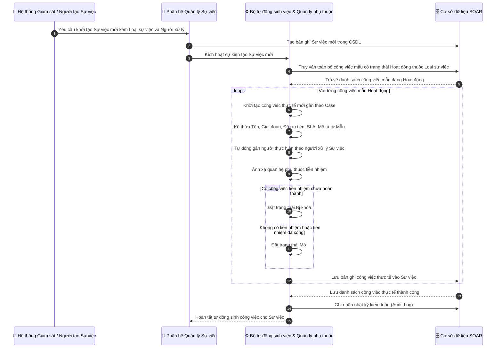
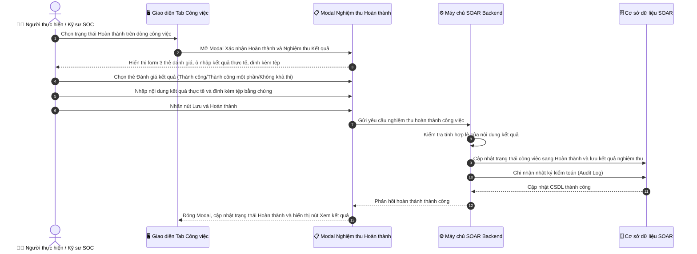
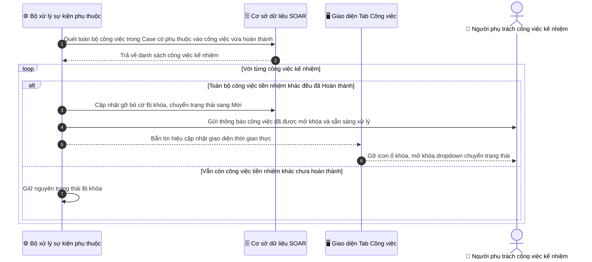
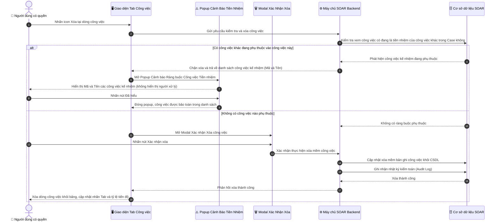

# ĐẶC TẢ YÊU CẦU PHẦN MỀM (SRS)
## TÍNH NĂNG: QUẢN LÝ & ĐIỀU PHỐI CÔNG VIỆC ỨNG CỨU TRONG SỰ VIỆC (INCIDENT TASK MANAGEMENT INSIDE CASE)

---

# 1. THÔNG TIN CHUNG CHỨC NĂNG

| Thuộc tính | Nội dung |
| :--- | :--- |
| **Mã chức năng** | `SOAR_CASE_TASK_MGMT_01` |
| **Tên chức năng** | Quản lý & Điều phối công việc ứng cứu trong Sự việc (Incident Task Management inside Case) |
| **Mô tả tổng quan** | Tính năng này nâng cấp Tab "CÔNG VIỆC" trong màn hình chi tiết Sự việc (`/case`) từ danh sách phẳng cơ bản thành trung tâm điều phối và giám sát toàn diện vòng đời ứng cứu sự cố an ninh mạng phân bổ theo 6 giai đoạn ứng cứu sự cố gồm: Giai đoạn 1: Chuẩn bị, Giai đoạn 2: Phát hiện và phân tích, Giai đoạn 3: Ngăn chặn, Giai đoạn 4: Loại bỏ, Giai đoạn 5: Khôi phục, Giai đoạn 6: Tổng kết rút kinh nghiệm.  **Đặc biệt, hệ thống áp dụng cơ chế tự động hóa quy trình phản ứng nhanh theo từng công việc mẫu:** Trong hệ thống SOAR, mỗi Loại sự việc an ninh mạng có một danh mục gồm nhiều công việc mẫu được định nghĩa sẵn trong thư viện quy trình, mỗi công việc mẫu có trạng thái độc lập (Hoạt động hoặc Không hoạt động). Ngay khi có Sự việc mới được khởi tạo (tạo thủ công hoặc tự động sinh từ Cảnh báo), hệ thống tự động quét toàn bộ các công việc mẫu đang ở trạng thái Hoạt động thuộc đúng Loại sự việc đó để tự động sinh ra toàn bộ danh sách công việc thực tế gắn vào Sự việc mà không cần người dùng thao tác thủ công.  Nhờ cơ chế tự động hóa thông minh này, giao diện Tab Công việc trong Sự việc được tinh gọn tối đa: **không còn hiển thị banner hay nút bấm áp dụng mẫu thủ công rườm rà**. Kỹ sư SOC khi mở tab sẽ thấy ngay toàn bộ checklist công việc kỹ thuật, thời hạn SLA cam kết, chỉ số tiến độ tổng thể và chuỗi phụ thuộc (Finish-to-Start), sẵn sàng bắt tay vào xử lý sự cố tức thì. Đơn vị xử lý và người thực hiện của các công việc thực tế được mặc định tự động gán theo người xử lý Sự việc (Assignee của Case). |
| **Phạm vi tính năng** | - **Bao gồm:** &nbsp;&nbsp;+ Cơ chế Tự động sinh Công việc khi Khởi tạo Sự việc (Auto Task Provisioning): Tự động quét và áp dụng toàn bộ các công việc mẫu đang ở trạng thái Hoạt động thuộc Loại sự việc tương ứng khi tạo Case, tự động kế thừa nhân sự xử lý theo Assignee của Case. &nbsp;&nbsp;+ Hiển thị nhãn Tab động phản ánh số lượng công việc: `CÔNG VIỆC ({Số lượng công việc})` (ví dụ: `CÔNG VIỆC (12)`). &nbsp;&nbsp;+ Thẻ đo lường tiến độ tổng thể với tiêu đề chuẩn hóa: `Tiến độ thực thi nhiệm vụ`, hiển thị tỷ lệ % hoàn thành và thanh Progress Bar phân đoạn 4 trạng thái (Hoàn thành, Đang xử lý, Bị khóa, Mới). &nbsp;&nbsp;+ Phân nhóm trực quan danh sách công việc theo 6 khối Accordion giai đoạn ứng cứu sự cố hiển thị thuần tiếng Việt, không chứa icon và text tiếng Anh: (1. Chuẩn bị ➔ 2. Phát hiện và phân tích ➔ 3. Ngăn chặn ➔ 4. Loại bỏ ➔ 5. Khôi phục ➔ 6. Tổng kết rút kinh nghiệm). &nbsp;&nbsp;+ Bộ lọc nhanh theo trạng thái: Tất cả, Công việc của tôi, 🔒 Bị khóa, ⏳ Đang xử lý, ✓ Đã hoàn thành. &nbsp;&nbsp;+ Nút tạo công việc: `+ Tạo công việc` trên thanh công cụ và nút `+ Thêm vào GĐ này` tại từng giai đoạn (hiển thị đối với người dùng có quyền Tạo/sửa/xóa công việc trong Sự việc). &nbsp;&nbsp;+ Kiểm soát khóa trạng thái phụ thuộc: Hiển thị trạng thái `Bị khóa` khi công việc tiền nhiệm chưa hoàn thành; vô hiệu hóa dropdown chuyển trạng thái. &nbsp;&nbsp;+ Tự động mở khóa (Auto-Unblock) và gửi thông báo khi công việc tiền nhiệm hoàn thành. &nbsp;&nbsp;+ Form Xác nhận hoàn thành & Nghiệm thu kết quả: Bỏ khối mô tả công việc ở đầu, đánh giá kết quả dạng 3 thẻ hiện đại thuần Việt (`Thành công`, `Thành công một phần`, `Không khả thi / Thất bại`), bỏ text giới hạn ký tự ở nhãn, nút `Hủy bỏ` và `Lưu & Hoàn thành`. &nbsp;&nbsp;+ Xem chi tiết kết quả xử lý và tải file bằng chứng của công việc đã hoàn thành qua Modal Xem kết quả. &nbsp;&nbsp;+ Popup cảnh báo chặn xóa an toàn (`CẢNH BÁO RÀNG BUỘC CÔNG VIỆC TIỀN NHIỆM`): Liệt kê danh sách các công việc kế nhiệm đang phụ thuộc gồm Mã và Tên, **tuyệt đối không hiển thị người xử lý**. &nbsp;&nbsp;+ Popup Modal Xác nhận Xóa công việc khi không có ràng buộc phụ thuộc. &nbsp;&nbsp;+ Popup Modal Cảnh báo dữ liệu chưa lưu khi thoát form. &nbsp;&nbsp;+ Ghi nhận Nhật ký kiểm toán (Audit Log) toàn bộ thao tác tự động sinh, thêm, sửa, xóa, hoàn thành công việc. - **Không bao gồm:** &nbsp;&nbsp;+ Quản lý danh mục Mẫu công việc gốc (thuộc tính năng `SOAR_TASK_TEMPLATE_03` trong phân hệ Quản trị). &nbsp;&nbsp;+ Cấu hình chính sách tính thời hạn SLA (thuộc phân hệ Cấu hình SLA hệ thống). |
| **Điều kiện trước** | 1. Người dùng đã đăng nhập thành công vào hệ thống SOAR và có quyền truy cập Sự việc. 2. Đã tồn tại ít nhất một Sự việc (Case) trong hệ thống ở trạng thái hoạt động. 3. Danh mục Loại sự việc và các công việc mẫu thuộc Loại sự việc đang ở trạng thái Hoạt động (Active) đã sẵn sàng trong hệ thống. 4. Múi giờ hệ thống (Timezone) đã được đồng bộ chuẩn UTC+7. |
| **Điều kiện sau** | 1. **Khi Sự việc được khởi tạo:** Toàn bộ danh sách công việc thực tế được tự động sinh ra trong CSDL từ các công việc mẫu đang Hoạt động của Loại sự việc đó, phân bổ vào 6 giai đoạn của Case, nhân sự được gán theo người xử lý Case, các task phụ thuộc được kích hoạt trạng thái Bị khóa, ghi nhận Audit Log. 2. **Khi người dùng truy cập Tab Công việc:** Nhãn Tab hiển thị `CÔNG VIỆC ({Số lượng công việc})`, toàn bộ cây 6 giai đoạn và checklist công việc đã sẵn sàng hiển thị. 3. **Khi tạo/sửa công việc thành công:** Công việc mới được lưu vào CSDL, cập nhật thanh tiến độ % của giai đoạn và của Case, ghi nhận Audit Log. 4. **Khi xóa công việc thành công:** Bản ghi công việc được xóa khỏi CSDL, cập nhật lại chỉ số tiến độ của Case, ghi nhận Audit Log. 5. **Khi một công việc hoàn thành:** Công việc chuyển trạng thái Hoàn thành, lưu kết quả nghiệm thu; các công việc kế nhiệm phụ thuộc tự động chuyển sang trạng thái Mới, gửi thông báo cho người phụ trách. |
| **Ngoại lệ tổng quan** | 1. Sự việc thuộc loại sự cố chưa có công việc mẫu nào ở trạng thái Hoạt động: Hệ thống khởi tạo Case với danh sách công việc rỗng, hiển thị Empty State và cho phép người dùng tự tạo công việc thủ công. 2. Xung đột phụ thuộc vòng lặp khi tạo/sửa công việc thủ công: Hệ thống từ chối lưu và báo lỗi theo [BR-05]. 3. Vi phạm ràng buộc xóa công việc: Người dùng xóa công việc đang có công việc khác phụ thuộc (Hệ thống chặn xóa và hiển thị Popup cảnh báo theo [BR-07]). |

---

# 2. BIỂU ĐỒ LUỒNG XỬ LÝ (SEQUENCE DIAGRAMS)

### 2.1. Sơ đồ tuần tự: Tự động khởi tạo công việc thực tế từ các công việc mẫu đang Hoạt động khi tạo Sự việc

---

### 2.2. Sơ đồ tuần tự: Thực thi và Nghiệm thu Hoàn thành công việc

---

### 2.3. Sơ đồ tuần tự: Tự động mở khóa công việc kế nhiệm (Auto-Unblock)

---

### 2.4. Sơ đồ tuần tự: Xóa công việc với kiểm tra an toàn ràng buộc tiền nhiệm

---

# 3. THIẾT KẾ GIAO DIỆN & ĐẶC TẢ CHI TIẾT UI COMPONENTS

### 3.1. Màn hình Tab "CÔNG VIỆC" trong Chi tiết Sự việc (`/case`)

Toàn bộ các thành phần giao diện trên Tab "CÔNG VIỆC" của Sự việc được đặc tả chi tiết trong bảng tập trung dưới đây:

| STT | Tên trường / Thành phần | Loại dữ liệu / Control | Mô tả chi tiết |
| :---: | :--- | :--- | :--- |
| 1 | **Nhãn Tab Công việc** | Tab Button / Badge | - Hiển thị nhãn Tab chứa số lượng công việc hiện có của Sự việc. - **Định dạng hiển thị:** `CÔNG VIỆC ({Số lượng công việc})` (`TASKS ({Count})`) (ví dụ: `CÔNG VIỆC (12)`). - **Tính chất hiển thị:** Động (Dynamic). - **Hành vi khi nhấn:** Điều hướng hiển thị khu vực điều phối và theo dõi checklist công việc của Sự việc. - **Quy tắc nghiệp vụ:** Tự động cập nhật số đếm theo thời gian thực mỗi khi có công việc được sinh tự động, thêm mới hoặc xóa bỏ khỏi Sự việc. |
| 2 | **Khối tóm tắt tiến độ thực thi** | Summary Card | - Hiển thị đo lường tiến độ tổng thể của toàn bộ checklist công việc trong Sự việc. - **Tiêu đề khối:** `"Tiến độ thực thi nhiệm vụ"` (`"Task Execution Progress"`). - **Tỷ lệ % lớn:** Hiển thị chỉ số phần trăm tiến độ tổng thể hoàn thành (ví dụ: `33%`), tính theo công thức tại [BR-01]. - **Thanh Progress Bar phân đoạn trực quan:** &nbsp;&nbsp;+ Phân đoạn Xanh lá cây: Tỷ lệ các công việc đã Hoàn thành. &nbsp;&nbsp;+ Phân đoạn Xanh lam: Tỷ lệ các công việc Đang xử lý. &nbsp;&nbsp;+ Phân đoạn Vàng cam: Tỷ lệ các công việc Bị khóa (chờ phụ thuộc). &nbsp;&nbsp;+ Phân đoạn Xám mờ: Tỷ lệ các công việc Mới chưa bắt đầu. - **Dòng chú giải & Thống kê số lượng:** &nbsp;&nbsp;+ Hiển thị: `Hoàn thành: {Completed} • Đang xử lý: {InProgress} • Bị khóa: {Blocked} • Mới: {New}`. &nbsp;&nbsp;+ Nhãn tổng số: `Tổng số công việc: {Total}` (`Total tasks: {Total}`). |
| 3 | **Bộ lọc nhanh trạng thái** | Button Group / Filter Chips | - Cho phép người dùng lọc nhanh danh sách công việc hiển thị trên giao diện theo từng trạng thái mong muốn. - **Giá trị mặc định:** `Tất cả ({Total})`. - **Các tùy chọn lọc:** &nbsp;&nbsp;+ `Tất cả ({Total})` (`All ({Total})`): Hiển thị toàn bộ công việc trong Sự việc. &nbsp;&nbsp;+ `Của tôi ({Mine})` (`My Tasks ({Mine})`): Chỉ hiển thị các công việc mà người dùng hiện tại là Người thực hiện. &nbsp;&nbsp;+ `🔒 Bị khóa ({Blocked})` (`🔒 Blocked ({Blocked})`): Chỉ hiển thị các công việc đang bị khóa do phụ thuộc tiền nhiệm chưa xong. &nbsp;&nbsp;+ `⏳ Đang xử lý ({InProgress})` (`⏳ In Progress ({InProgress})`): Chỉ hiển thị các công việc đang trong quá trình thực thi. &nbsp;&nbsp;+ `✓ Đã hoàn thành ({Completed})` (`✓ Completed ({Completed})`): Chỉ hiển thị các công việc đã hoàn tất nghiệm thu. - **Hành vi khi nhấn:** Lập tức lọc và chỉ hiển thị các dòng công việc thỏa mãn điều kiện lọc trong từng khối giai đoạn. |
| 4 | **Nút "+ Tạo công việc"** | Button (Primary) | - Cho phép người dùng mở modal tạo mới một công việc thủ công gắn trực tiếp vào Sự việc hiện tại. - **Nhãn hiển thị:** `"+ Tạo công việc"` (`"+ Create Task"`). - **Trạng thái mặc định:** Kích hoạt (Enabled). - **Quyền hạn truy cập:** Chỉ hiển thị đối với người dùng có quyền Tạo/sửa/xóa công việc trong Sự việc. Người dùng chỉ có quyền Xem hoặc Cập nhật sẽ bị ẩn nút này. - **Hành vi khi nhấn:** Mở Modal Tạo mới công việc (trường Sự việc được tự động khóa cố định theo Case hiện tại). |
| 5 | **Khối Giai đoạn 1: Chuẩn bị** | Accordion Card | - Hiển thị phân nhóm các công việc thuộc Giai đoạn 1 của quy trình ứng cứu. - **Tiêu đề khối:** `Giai đoạn 1: Chuẩn bị` (`Phase 1: Preparation`) (hiển thị thuần tiếng Việt, không chứa icon và text tiếng Anh). - **Thành phần trên Header khối:** &nbsp;&nbsp;+ Tên giai đoạn: `Giai đoạn 1: Chuẩn bị`. &nbsp;&nbsp;+ Chip thống kê tiến độ: `{Completed}/{Total} Hoàn thành ({Percent}%)`. &nbsp;&nbsp;+ Nút `"+ Thêm vào GĐ này"` (`"+ Add to Phase"`): Tạo nhanh công việc gán sẵn Giai đoạn 1 (chỉ hiển thị khi có quyền Tạo/sửa/xóa). &nbsp;&nbsp;+ Biểu tượng mũi tên mở rộng / thu gọn: Mặc định mở rộng nếu có công việc chưa hoàn thành; nhấp để đóng/mở khối công việc. |
| 6 | **Khối Giai đoạn 2: Phát hiện và phân tích** | Accordion Card | - Hiển thị phân nhóm các công việc thuộc Giai đoạn 2 của quy trình ứng cứu. - **Tiêu đề khối:** `Giai đoạn 2: Phát hiện và phân tích` (`Phase 2: Detection and Analysis`) (thuần tiếng Việt, không chứa icon). - **Thành phần trên Header khối:** Tương tự Giai đoạn 1. |
| 7 | **Khối Giai đoạn 3: Ngăn chặn** | Accordion Card | - Hiển thị phân nhóm các công việc thuộc Giai đoạn 3 của quy trình ứng cứu. - **Tiêu đề khối:** `Giai đoạn 3: Ngăn chặn` (`Phase 3: Containment`) (thuần tiếng Việt, không chứa icon). - **Thành phần trên Header khối:** Tương tự Giai đoạn 1. |
| 8 | **Khối Giai đoạn 4: Loại bỏ** | Accordion Card | - Hiển thị phân nhóm các công việc thuộc Giai đoạn 4 của quy trình ứng cứu. - **Tiêu đề khối:** `Giai đoạn 4: Loại bỏ` (`Phase 4: Eradication`) (thuần tiếng Việt, không chứa icon). - **Thành phần trên Header khối:** Tương tự Giai đoạn 1. |
| 9 | **Khối Giai đoạn 5: Khôi phục** | Accordion Card | - Hiển thị phân nhóm các công việc thuộc Giai đoạn 5 của quy trình ứng cứu. - **Tiêu đề khối:** `Giai đoạn 5: Khôi phục` (`Phase 5: Recovery`) (thuần tiếng Việt, không chứa icon). - **Thành phần trên Header khối:** Tương tự Giai đoạn 1. |
| 10 | **Khối Giai đoạn 6: Tổng kết rút kinh nghiệm** | Accordion Card | - Hiển thị phân nhóm các công việc thuộc Giai đoạn 6 của quy trình ứng cứu. - **Tiêu đề khối:** `Giai đoạn 6: Tổng kết rút kinh nghiệm` (`Phase 6: Lessons Learned`) (thuần tiếng Việt, không chứa icon). - **Thành phần trên Header khối:** Tương tự Giai đoạn 1. - **Quy tắc nghiệp vụ:** Toàn bộ công việc thuộc Giai đoạn 6 chỉ cho phép đóng/hoàn thành khi các Giai đoạn 3, 4, 5 đã hoàn tất nghiệm thu (Xem chi tiết tại [BR-04]). |
| 11 | **Tên & Mã công việc trên dòng** | Link / Text | - Hiển thị mã công việc in đậm dạng badge (ví dụ: `TA03`) kèm tên công việc đầy đủ. - **Hành vi khi nhấn:** Cho phép người dùng nhấp vào để mở Drawer chi tiết công việc hoặc chuyển hướng sang màn hình xem công việc tương ứng. - **Quy tắc hiển thị:** Tự động cắt tỉa và hiển thị dấu ba chấm `...` nếu tên công việc vượt quá 80 ký tự, hiển thị đầy đủ tên khi người dùng rê chuột (hover tooltip). |
| 12 | **Badge Quan hệ phụ thuộc** | Status Badge | - Hiển thị trực quan trạng thái liên kết phụ thuộc kỹ thuật của công việc trong Sự việc. - **Trường hợp 1 (Công việc bị khóa do chờ công việc trước):** &nbsp;&nbsp;+ Hiển thị Badge màu vàng cam: `🔒 Chờ [{Mã_Task_Tiền_Nhiệm}]`. &nbsp;&nbsp;+ Hover tooltip: `Chờ công việc {Mã_Task_Tiền_Nhiệm} hoàn thành`. - **Trường hợp 2 (Công việc đã mở khóa / có phụ thuộc đã xong):** &nbsp;&nbsp;+ Hiển thị Badge màu xám nhạt: `🔗 Tiền nhiệm: [{Mã_Task_Tiền_Nhiệm}]`. - **Trường hợp 3 (Công việc độc lập):** Không hiển thị badge phụ thuộc. |
| 13 | **Thông tin Người thực hiện trên dòng** | User Avatar + Name | - Hiển thị avatar đại diện kèm tên tài khoản người dùng được phân công phụ trách công việc (ví dụ: `tomhagen`). - **Trường hợp chưa phân công:** Hiển thị nhãn màu xám `"Chưa phân công"` (`"Unassigned"`). - **Quy tắc nghiệp vụ:** Mặc định khi sinh công việc tự động từ Mẫu, trường này tự động lấy theo người xử lý Sự việc (Assignee của Case). |
| 14 | **Badge SLA thời hạn** | SLA Badge | - Hiển thị thời hạn cam kết xử lý theo gói quy tắc SLA áp dụng từ hệ thống (ví dụ: `A05 - Đạt`, `A05 - 2h`). - Dữ liệu SLA lấy động từ danh mục quy tắc SLA của hệ thống. |
| 15 | **Dropdown Trạng thái trên dòng** | Dropdown Select | - Cho phép người dùng chuyển nhanh trạng thái xử lý của công việc trực tiếp trên từng dòng. - **Quyền hạn truy cập:** Cho phép người dùng có quyền Tạo/sửa/xóa công việc hoặc chính người dùng được gán là Người thực hiện (Assignee) của công việc đó. Người dùng chỉ có quyền Xem thì dropdown ở chế độ chỉ đọc (Disabled/Readonly). - **Các tùy chọn khi công việc mở khóa:** &nbsp;&nbsp;+ `"Mới"` (`"New"`) &nbsp;&nbsp;+ `"Đang xử lý"` (`"In Progress"`) &nbsp;&nbsp;+ `"Đang đợi đối tác"` (`"Pending Partner"`) &nbsp;&nbsp;+ `"Hoàn thành"` (`"Completed"`) - **Hành vi khi công việc đang bị khóa (`is_blocked = true`):** &nbsp;&nbsp;+ Dropdown bị vô hiệu hóa (disabled), hiển thị cố định tùy chọn duy nhất: `<option>🔒 Bị khóa</option>`. &nbsp;&nbsp;+ Hover tooltip: `"Công việc đang bị khóa do chờ công việc tiền nhiệm hoàn thành"`. - **Hành vi khi chọn `Hoàn thành`:** Hệ thống mở Modal Xác nhận Hoàn thành & Nghiệm thu Kết quả (Mục 3.2) để người dùng bắt buộc nhập báo cáo nghiệm thu trước khi đóng công việc. |
| 16 | **Nút "Xem kết quả" trên dòng** | Icon Button | - Cho phép người dùng xem lại nội dung kết quả xử lý và tệp bằng chứng của công việc đã hoàn thành. - **Điều kiện hiển thị:** Chỉ hiển thị duy nhất khi công việc ở trạng thái `Hoàn thành` (`👁️ Xem KQ`). - **Hành vi khi nhấn:** Mở Modal Xem Chi tiết Kết quả Xử lý & Nghiệm thu (Mục 3.3). |
| 17 | **Nút "Chỉnh sửa" trên dòng** | Icon Button | - Cho phép người dùng mở modal để chỉnh sửa thông tin công việc (`✏️`). - **Hover tooltip:** `"Chỉnh sửa công việc"` (`"Edit task"`). - **Quyền hạn truy cập:** Chỉ hiển thị đối với người dùng có quyền Tạo/sửa/xóa công việc hoặc chính Người thực hiện (Assignee) của công việc đó. Bị ẩn đối với tài khoản chỉ có quyền Xem. - **Hành vi khi nhấn:** Mở modal chỉnh sửa thông tin công việc tương ứng. |
| 18 | **Nút "Xóa" trên dòng** | Icon Button | - Cho phép người dùng thực hiện xóa công việc khỏi Sự việc (`🗑️`). - **Hover tooltip:** `"Xóa công việc"` (`"Delete task"`). - **Quyền hạn truy cập:** Chỉ hiển thị đối với người dùng có quyền Tạo/sửa/xóa công việc trong Sự việc. Người dùng chỉ có quyền Xem hoặc Cập nhật sẽ bị ẩn hoàn toàn icon này. - **Hành vi kiểm tra an toàn khi nhấn:** &nbsp;&nbsp;+ Nếu có công việc khác trong Sự việc đang phụ thuộc vào công việc này: Hệ thống chặn xóa và hiển thị Popup Cảnh báo Chặn Xóa do Ràng buộc Phụ thuộc (Mục 3.4). &nbsp;&nbsp;+ Nếu không có công việc nào phụ thuộc: Hệ thống hiển thị Popup Modal Xác nhận Xóa công việc (Mục 3.5). |

---

### 3.2. Modal Xác nhận Hoàn thành & Nghiệm thu Kết quả (Complete & Accept Task Modal)

Modal này tự động hiển thị khi người dùng chọn trạng thái `Hoàn thành` trên dropdown của công việc hoặc nhấn nút Hoàn thành công việc:

| STT | Tên trường / Thành phần | Loại dữ liệu / Control | Mô tả chi tiết |
| :---: | :--- | :--- | :--- |
| 1 | **Tiêu đề Modal** | Label | - Hiển thị tiêu đề modal xác nhận nghiệm thu. - **Nội dung hiển thị:** `"✓ Xác nhận Hoàn thành & Nghiệm thu Kết quả"` (`"✓ Complete & Accept Task Results"`). - **Lưu ý thiết kế:** Đã gỡ bỏ hoàn toàn cụm mô tả nhiệm vụ ở đầu form, giúp giao diện gọn gàng và tập trung trực tiếp vào nội dung nghiệm thu kết quả. |
| 2 | **Nút đóng Modal (Icon "✕")** | Button | - Cho phép người dùng đóng modal mà không lưu thông tin. - **Hành vi khi nhấn:** Nếu đã nhập nội dung kết quả, hiển thị Hộp thoại cảnh báo dữ liệu chưa lưu (Mục 3.6); nếu chưa nhập thì đóng modal ngay lập tức và giữ nguyên trạng thái cũ của công việc. |
| 3 | **Đánh giá kết quả thực hiện (*)** | Card Grid Segmented (3 thẻ) | - Cho phép người dùng đánh giá mức độ đạt được của công việc đã xử lý. - **Tiêu chuẩn thiết kế:** Bố cục dạng **3 thẻ lựa chọn hiện đại (Card Grid 3 cột)** hiển thị thuần tiếng Việt, không chứa icon và text tiếng Anh: &nbsp;&nbsp;1. **`Thành công`** (`SUCCESS`) - Kích hoạt hiệu ứng viền sáng xanh lá cây khi được chọn. &nbsp;&nbsp;2. **`Thành công một phần`** (`PARTIAL`) - Kích hoạt hiệu ứng viền sáng vàng cam khi được chọn. &nbsp;&nbsp;3. **`Không khả thi / Thất bại`** (`FAILED`) - Kích hoạt hiệu ứng viền sáng đỏ khi được chọn. - **Giá trị mặc định:** Chọn sẵn thẻ `Thành công`. - **Hành vi người dùng:** Nhấp chuột vào thẻ nào thì thẻ đó kích hoạt trạng thái được chọn (`active`). |
| 4 | **Nội dung kết quả xử lý thực tế (*)** | Textarea | - Cho phép người dùng nhập tóm tắt quá trình thực thi kỹ thuật, các thao tác đã tiến hành và kết quả thu được. - **Nhãn hiển thị:** `Nội dung kết quả xử lý thực tế *` (đã loại bỏ đoạn text `(tối thiểu 10 ký tự)` ở nhãn để giao diện súc tích). - **Placeholder:** &nbsp;&nbsp;+ VI: `Nhập tóm tắt thao tác kỹ thuật, các lệnh đã chạy, port switch đã shutdown, hash/IP đã chặn...` &nbsp;&nbsp;+ EN: `Enter technical actions summary, executed commands, shutdown ports, blocked hashes/IPs...` - **Giá trị mặc định:** Trống. - **Giới hạn ký tự:** Tối đa 5000 ký tự. - **Quy tắc Nghiệp vụ:** Tự động trim khoảng trắng ở đầu và cuối chuỗi trước khi lưu. - **Thông báo lỗi tương ứng:** Để trống và nhấn Lưu: Hiển thị thông báo lỗi inline màu đỏ dưới trường: `"Vui lòng nhập nội dung kết quả xử lý thực tế!"` (`"Please enter actual execution result notes!"`). |
| 5 | **Tệp đính kèm bằng chứng** | File Drag & Drop Box | - Cho phép người dùng tải lên các tệp bằng chứng kỹ thuật (Log, Ảnh chụp màn hình, Báo cáo phân tích). - **Khu vực kéo thả:** Hỗ trợ nhấp chuột chọn tệp hoặc kéo thả tệp trực tiếp. - **Quy cách tệp:** Hỗ trợ các định dạng `png, jpg, log, txt, docx, pdf` với dung lượng tối đa 50MB/tệp. |
| 6 | **Nút "Hủy bỏ"** | Button (Cancel) | - Cho phép người dùng hủy thao tác hoàn thành và đóng modal. - **Nhãn hiển thị:** `"Hủy bỏ"` (`"Cancel"`). - **Hành vi khi nhấn:** Nếu form đã có dữ liệu nhập, hiển thị Hộp thoại cảnh báo dữ liệu chưa lưu (Mục 3.6); nếu chưa có thay đổi thì đóng modal ngay lập tức và giữ nguyên trạng thái công việc. |
| 7 | **Nút "Lưu & Hoàn thành"** | Button (Primary) | - Cho phép người dùng thẩm định và xác nhận lưu kết quả xử lý để hoàn tất công việc. - **Nhãn hiển thị:** `"Lưu & Hoàn thành"` (`"Save & Complete"`). - **Hành vi khi nhấn:** &nbsp;&nbsp;1. Hệ thống kiểm tra tính hợp lệ của trường Nội dung kết quả xử lý thực tế. &nbsp;&nbsp;2. Nếu không hợp lệ: Hiển thị thông báo lỗi inline và chặn lưu. &nbsp;&nbsp;3. Nếu hợp lệ: Hệ thống chuyển nút sang trạng thái Đang xử lý (Loading spinner, vô hiệu hóa nút chống click đúp), cập nhật trạng thái công việc sang `Hoàn thành`, lưu kết quả nghiệm thu và thời gian hoàn tất vào CSDL. &nbsp;&nbsp;4. Tự động kích hoạt cơ chế kiểm tra mở khóa (Auto-unblock) cho các công việc kế nhiệm theo [BR-06]. &nbsp;&nbsp;5. Đóng modal, ghi Audit Log và hiển thị toast message tự động đóng: `"Đã hoàn thành công việc và lưu kết quả nghiệm thu thành công!"` (`"Task completed and acceptance result saved successfully!"`). |

---

### 3.3. Modal Xem Chi tiết Kết quả Xử lý & Nghiệm thu (View Task Result Modal)

Modal này hiển thị toàn bộ thông tin kết quả nghiệm thu khi người dùng nhấn nút `👁️ Xem KQ` trên dòng công việc đã hoàn thành:

| STT | Tên trường / Thành phần | Loại dữ liệu / Control | Mô tả chi tiết |
| :---: | :--- | :--- | :--- |
| 1 | **Tiêu đề Modal** | Label | - Hiển thị tiêu đề modal xem kết quả. - **Nội dung hiển thị:** `"Kết quả Xử lý & Nghiệm thu Công việc"` (`"Task Execution & Acceptance Results"`). |
| 2 | **Nút đóng Modal (Icon "✕")** | Button | - Cho phép người dùng đóng modal xem kết quả. - **Hành vi khi nhấn:** Đóng modal ngay lập tức. |
| 3 | **Thông tin nghiệm thu chung** | Meta Info Card | - Hiển thị các thông tin tổng hợp về kiểm toán hoàn thành công việc: &nbsp;&nbsp;+ Mã và tên công việc: `{Mã_Task}: {Tên_Task}`. &nbsp;&nbsp;+ Người nghiệm thu: `{Username}` • Thời gian hoàn thành: `{completedAt}`. &nbsp;&nbsp;+ Badge đánh giá kết quả: Hiển thị badge trực quan tương ứng: `✓ THÀNH CÔNG`, `THÀNH CÔNG MỘT PHẦN` hoặc `KHÔNG KHẢ THI / THẤT BẠI`. |
| 4 | **Nội dung báo cáo kết quả thực tế** | Text Box (Read-only) | - Hiển thị toàn văn nội dung mô tả quá trình thực thi kỹ thuật và kết quả do người thực hiện đã nhập khi hoàn tất công việc. - **Trạng thái:** Chế độ chỉ đọc. |
| 5 | **Danh sách tệp đính kèm bằng chứng** | File Item View | - Hiển thị danh sách các tệp bằng chứng đã đính kèm gồm: Biểu tượng tệp, Tên tệp, Dung lượng. - Cho phép người dùng nhấp vào nút Tải xuống (`⬇️`) để tải tệp về máy tính. |
| 6 | **Nút "Đóng"** | Button (Secondary) | - Cho phép người dùng đóng modal xem kết quả. - **Nhãn hiển thị:** `"ĐÓNG"` (`"CLOSE"`). - **Hành vi khi nhấn:** Đóng modal xem kết quả. |

---

### 3.4. Popup Cảnh báo Chặn Xóa do Ràng buộc Phụ thuộc (Delete Blocked Warning Popup)

Popup này tự động hiển thị khi người dùng thực hiện xóa một công việc đang là điều kiện tiền nhiệm bắt buộc của các công việc khác trong Sự việc:

| STT | Tên trường / Thành phần | Loại dữ liệu / Control | Mô tả chi tiết |
| :---: | :--- | :--- | :--- |
| 1 | **Tiêu đề Popup** | Label | - Hiển thị tiêu đề cảnh báo ràng buộc. - **Nội dung hiển thị:** `"CẢNH BÁO RÀNG BUỘC CÔNG VIỆC TIỀN NHIỆM"` (`"PREDECESSOR TASK DEPENDENCY WARNING"`). - **Tính chất:** Không chứa icon bên cạnh tiêu đề. |
| 2 | **Nút đóng Popup (Icon "✕")** | Button | - Cho phép đóng popup cảnh báo. - **Hành vi khi nhấn:** Đóng popup cảnh báo và giữ nguyên công việc trong danh sách. |
| 3 | **Thông điệp cảnh báo chính** | Alert Text | - Hiển thị dòng thông báo trực tiếp: &nbsp;&nbsp;`"Không thể xóa công việc [{Mã_Task}: {Tên_Task}]!"` (`"Cannot delete task [{Mã_Task}: {Tên_Task}]!"`). - **Tính chất:** Không chứa icon bên cạnh dòng thông báo. |
| 4 | **Danh sách công việc kế nhiệm bị phụ thuộc** | List Box Container | - Hiển thị khung danh sách liệt kê các công việc kế nhiệm đang phụ thuộc vào công việc này. - **QUY TẮC BẮT BUỘC:** **Chỉ hiển thị Mã công việc và Tên công việc, tuyệt đối KHÔNG hiển thị thông tin người xử lý**. - **Định dạng hiển thị mẫu:** &nbsp;&nbsp;`• TA08: Vô hiệu hóa tài khoản quản trị bị lộ lọt` &nbsp;&nbsp;`• TA10: Vá lỗ hổng dịch vụ RDP trên các máy chủ liên quan` - **Mục đích:** Đảm bảo giao diện súc tích, tập trung trực diện vào xung đột logic quy trình. |
| 5 | **Khối Phân tích Nguyên nhân & Hướng xử lý** | Info Box Container | - Hiển thị chi tiết nguyên nhân và hướng dẫn giải quyết cho người dùng: &nbsp;&nbsp;+ **Nguyên nhân:** `"Công việc này là điều kiện tiền nhiệm bắt buộc của các công việc kế nhiệm nêu trên. Nếu xóa công việc này, chuỗi phụ thuộc quy trình sẽ bị đứt gãy và các công việc kế nhiệm sẽ không thể kích hoạt thực hiện."` &nbsp;&nbsp;+ **Hướng xử lý:** `"Hệ thống chặn xóa để bảo đảm tính toàn vẹn dữ liệu. Vui lòng gỡ bỏ liên kết phụ thuộc tại các công việc kế nhiệm trước khi thực hiện xóa công việc này."` |
| 6 | **Nút "Đã hiểu"** | Button (CTA) | - Cho phép người dùng xác nhận đã nắm thông tin cảnh báo. - **Nhãn hiển thị:** `"ĐÃ HIỂU"` (`"UNDERSTOOD"`). - **Hành vi khi nhấn:** Đóng popup cảnh báo, không xóa dữ liệu và giữ nguyên công việc trên giao diện. |

---

### 3.5. Popup Modal Xác nhận Xóa công việc (Delete Confirmation Modal)

Modal này xuất hiện khi người dùng nhấn icon Xóa (`🗑️`) tại một công việc độc lập (không có công việc nào khác phụ thuộc vào nó):

- **Tên Modal:** Hộp thoại xác nhận xóa công việc trong Sự việc
- **Tiêu đề (Header):** `"Xác nhận xóa công việc"` (`"Confirm deletion of task"`)
- **Nội dung thông báo (Body text):** `"Bạn có chắc chắn muốn xóa công việc [{Mã_Task}: {Tên_Task}] khỏi Sự việc này không? Thao tác này sẽ không thể hoàn tác."` (`"Are you sure you want to delete task [{Mã_Task}: {Tên_Task}] from this incident? This action cannot be undone."`)
- **Nút Xác nhận (Confirm Button):**
  - Nhãn nút: `"Xác nhận xóa"` (`"Confirm Delete"`)
  - Quyền hạn truy cập: Người dùng có quyền Tạo/sửa/xóa công việc trong Sự việc.
  - Hành vi khi nhấn: Chuyển nút sang trạng thái Đang xử lý (Loading), gọi API xóa mềm bản ghi công việc khỏi CSDL. Nếu thành công: Đóng modal, xóa dòng công việc trên bảng, cập nhật lại nhãn Tab `CÔNG VIỆC ({Total-1})`, tính toán lại tiến độ % và hiển thị toast message: `"Đã xóa công việc thành công!"` (`"Task deleted successfully!"`). Nếu thất bại: Hiển thị toast message: `"Xóa công việc thất bại. Vui lòng thử lại!"` (`"Failed to delete task. Please try again!"`).
- **Nút Hủy (Cancel Button):**
  - Nhãn nút: `"Hủy bỏ"` (`"Cancel"`) hoặc nhấp icon `✕`.
  - Hành vi khi nhấn: Đóng modal, không thực hiện hành động xóa dữ liệu.
- **Hành vi khi click vùng ngoài Modal:** Không đóng hộp thoại.

---

### 3.6. Popup Modal Cảnh báo Dữ liệu Chưa Lưu khi Thoát Form (Unsaved Changes Modal)

- **Tên Modal:** Cảnh báo dữ liệu chưa được lưu
- **Tiêu đề (Header):** `"Thông tin chưa được lưu"` (`"Unsaved changes"`)
- **Nội dung thông báo (Body text):** `"Dữ liệu bạn vừa nhập chưa được lưu lại. Bạn có chắc chắn muốn thoát và hủy bỏ các thay đổi này không?"` (`"The data you entered has not been saved. Are you sure you want to exit and discard these changes?"`)
- **Nút Xác nhận thoát (Confirm Button):**
  - Nhãn nút: `"Thoát không lưu"` (`"Exit without saving"`)
  - Hành vi khi nhấn: Đóng modal cảnh báo, đồng thời đóng modal tác vụ hiện tại và không lưu dữ liệu.
- **Nút Hủy / Giữ lại (Cancel Button):**
  - Nhãn nút: `"Giữ lại"` (`"Keep editing"`)
  - Hành vi khi nhấn: Đóng modal cảnh báo, giữ nguyên dữ liệu trên form để người dùng tiếp tục thao tác.
- **Hành vi khi click vùng ngoài Modal:** Không đóng hộp thoại cảnh báo.

---

### 3.7. Đặc tả các trạng thái màn hình bổ trợ (Screen UX States)

#### 3.7.1. Trạng thái chưa có công việc (Empty State)
- **Điều kiện kích hoạt:** Xảy ra khi Sự việc mới được tạo nhưng Loại sự cố này chưa có công việc mẫu nào ở trạng thái Hoạt động trong hệ thống, hoặc toàn bộ công việc đã bị xóa.
- **Hình ảnh minh họa:** Icon tài liệu quy trình rỗng.
- **Tiêu đề chính:** `"Sự việc chưa có công việc ứng cứu nào"` (`"No incident response tasks found"`)
- **Mô tả phụ:** `"Loại sự cố này chưa có công việc mẫu nào ở trạng thái hoạt động. Bạn có thể tạo mới công việc thủ công để bắt đầu xử lý."` (`"This incident category has no active task templates. You can manually create tasks to start response."`)
- **Nút hành động (CTA Button):** Nút `"+ Tạo công việc"` (`"+ Create Task"`) - nhấn mở Modal Tạo mới công việc (chỉ hiển thị đối với người dùng có quyền Tạo/sửa/xóa công việc trong Sự việc).

#### 3.7.2. Trạng thái lọc không có kết quả (Filter Zero Results)
- **Điều kiện kích hoạt:** Khi người dùng chọn một bộ lọc trạng thái (ví dụ: "Của tôi", "Bị khóa", "Đang xử lý") nhưng không có bản ghi công việc nào thỏa mãn điều kiện lọc.
- **Hình ảnh minh họa:** Icon kính lúp không tìm thấy kết quả.
- **Tiêu đề chính:** `"Không có công việc nào trong bộ lọc này"` (`"No tasks match this filter"`)
- **Mô tả phụ:** `"Hiện tại không có công việc nào thuộc điều kiện lọc đã chọn. Hãy thử chuyển sang bộ lọc khác."` (`"There are currently no tasks matching the selected filter criteria. Try switching to another filter."`)
- **Nút hành động:** Nút `"Xem tất cả công việc"` (`"View All Tasks"`) - nhấn để đưa bộ lọc về `"Tất cả"` và hiển thị toàn bộ danh sách.

#### 3.7.3. Trạng thái lỗi tải dữ liệu (Error / Offline State)
- **Điều kiện kích hoạt:** Khi mất kết nối mạng hoặc máy chủ Backend gặp sự cố gián đoạn API lấy danh sách công việc.
- **Hình ảnh minh họa:** Icon cảnh báo lỗi kết nối mạng.
- **Tiêu đề chính:** `"Không thể tải danh sách công việc của Sự việc"` (`"Failed to load incident task list"`)
- **Mô tả phụ:** `"Đã xảy ra lỗi khi kết nối đến máy chủ. Vui lòng kiểm tra lại đường truyền mạng và thử lại."` (`"An error occurred while connecting to the server. Please check your network connection and try again."`)
- **Nút hành động:** Nút `"Tải lại"` (`"Retry"`) - nhấn để kích hoạt lại API lấy danh sách công việc.

---

# 4. QUY TẮC NGHIỆP VỤ CHUYÊN SÂU (BUSINESS RULES)

### Bảng tổng hợp quy tắc nghiệp vụ:

| Mã quy tắc | Tên quy tắc nghiệp vụ | Phân nhóm quy tắc | Phạm vi áp dụng |
| :---: | :--- | :--- | :--- |
| **[BR-01]** | Công thức tính toán chỉ số tiến độ hoàn thành Sự việc | Công thức tính toán | Phân hệ Sự việc & API |
| **[BR-02]** | Cơ chế áp dụng các công việc mẫu đang Hoạt động theo Loại sự việc khi khởi tạo Sự việc | Ràng buộc dữ liệu & Quy trình | Quản lý Mẫu & Khởi tạo Case |
| **[BR-03]** | Thuật toán tự động sinh hàng loạt công việc khi Khởi tạo Sự việc (Auto Provisioning) | Quy trình & Vòng đời trạng thái | Backend Hook & Case Service |
| **[BR-04]** | Quy chuẩn thứ tự hiển thị thuần Việt và tính linh hoạt thực thi 6 giai đoạn | Quy trình & Vòng đời trạng thái | Toàn hệ thống |
| **[BR-05]** | Cơ chế khóa phụ thuộc kỹ thuật Finish-to-Start (Trạng thái Bị khóa) | Quy trình & Vòng đời trạng thái | Toàn hệ thống |
| **[BR-06]** | Cơ chế Tự động Mở khóa (Auto-Unblock) và Thông báo đa kênh | Tích hợp & Sự kiện | Event Engine & Notification |
| **[BR-07]** | Ràng buộc toàn vẹn dữ liệu khi Xóa công việc (Cảnh báo không hiển thị người xử lý) | Ràng buộc dữ liệu & Thuật toán | API Xóa công việc & Popup Cảnh báo |
| **[BR-08]** | Quy chuẩn nghiệm thu và bắt buộc ghi nhận kết quả khi Hoàn thành (3 Thẻ đánh giá) | Ràng buộc dữ liệu & Nghiệp vụ | Form Hoàn thành công việc |
| **[BR-09]** | Quy chuẩn ghi nhận Nhật ký kiểm toán (Audit Logging) | Bảo mật & Kiểm toán | Toàn bộ phân hệ |

---

### [BR-01] Công thức tính toán chỉ số tiến độ hoàn thành Sự việc
- **Phân loại:** Công thức tính toán (Calculation & Formulas)
- **Phạm vi áp dụng:** Phân hệ Sự việc, API lấy dữ liệu và hiển thị UI.
- **Điều kiện kích hoạt:** Khi tải dữ liệu Case, hoặc khi có bất kỳ tác vụ Thêm, Xóa, Đổi trạng thái công việc nào trong Case.
- **Logic tính toán chi tiết:**
  1. *Tính số lượng hiển thị trên nhãn Tab Công việc:*
     $$\text{TotalTasks} = \text{Count}(\text{soar\_tasks WHERE case\_id = CaseID AND status } \neq \text{ 'CANCELLED'})$$
     - Nhãn Tab hiển thị động: `CÔNG VIỆC ({TotalTasks})` (ví dụ: `CÔNG VIỆC (12)`).
  2. *Tính tiến độ tổng thể của Sự việc (khối Tiến độ thực thi nhiệm vụ):*
     $$\text{CompletedTasks} = \text{Count}(\text{soar\_tasks WHERE case\_id = CaseID AND status = 'COMPLETED'})$$
     $$\text{ProgressPercent} = \begin{cases} 0\%, & \text{nếu TotalTasks} = 0 \\ \text{Round}\left(\frac{\text{CompletedTasks}}{\text{TotalTasks}} \times 100, 0\right)\%, & \text{nếu TotalTasks} > 0 \end{cases}$$
  3. *Tính tiến độ riêng của từng Giai đoạn (Phase 1 đến 6):*
     - Áp dụng tương tự công thức trên với điều kiện lọc bổ sung `AND phase = PhaseNumber`.
- **Hành vi hiển thị:** Giá trị `%` được làm tròn đến số nguyên gần nhất (0 chữ số thập phân), cập nhật real-time trên UI.

---

### [BR-02] Cơ chế áp dụng các công việc mẫu đang Hoạt động theo Loại sự việc khi khởi tạo Sự việc
- **Phân loại:** Ràng buộc dữ liệu & Quy trình (Data & Process Rules)
- **Phạm vi áp dụng:** Phân hệ Mẫu công việc và Quy trình Khởi tạo Sự việc.
- **Điều kiện kích hoạt:** Khi khởi tạo bất kỳ Sự việc (Case) mới nào trong hệ thống.
- **Logic ràng buộc chi tiết:**
  1. Trong phân hệ Quản trị Mẫu công việc, mỗi công việc mẫu được định nghĩa độc lập và thuộc về một Loại sự việc an ninh mạng cụ thể, có trạng thái hoạt động được quản lý qua Toggle Switch (`is_active = TRUE` hoặc `is_active = FALSE`).
  2. Khi một Sự việc mới thuộc Loại sự việc $X$ được khởi tạo:
     - Hệ thống quét toàn bộ danh sách các công việc mẫu thuộc Loại sự việc $X$ đang có trạng thái **Hoạt động** (`is_active = TRUE`).
     - Tự động chuyển đổi và sinh ra danh sách công việc thực tế tương ứng trong Sự việc.
     - Các công việc mẫu đang ở trạng thái **Không hoạt động** (`is_active = FALSE`) sẽ bị bỏ qua và không được sinh ra trong Sự việc.
  3. **Tối ưu hóa trải nghiệm người dùng trên Tab Công việc:**
     - Cơ chế tự động hóa diễn ra ngầm 100% tại backend ngay khi Case được tạo.
     - **Không hiển thị bất kỳ banner thông tin mẫu hay nút áp dụng mẫu thủ công nào trên giao diện Tab Công việc**, giúp giao diện hoàn toàn tinh gọn, sẵn sàng cho kỹ sư tác chiến ngay lập tức.

---

### [BR-03] Thuật toán tự động sinh hàng loạt công việc khi Khởi tạo Sự việc (Auto Provisioning)
- **Phân loại:** Quy trình & Vòng đời trạng thái (Process & State Transition)
- **Phạm vi áp dụng:** Backend Hook khi tạo Sự việc (`POST /api/v1/cases`).
- **Điều kiện kích hoạt:** Khi một Sự việc (Case) mới được tạo thành công (dù tạo thủ công qua Web UI hoặc tự động sinh từ Cảnh báo/Alert Escalation).
- **Thuật toán sinh dữ liệu tự động (Auto Task Provisioning):**
  1. Khi bản ghi Sự việc được tạo với `case_id`, `incident_type` và `assignee_id`:
     - Backend kích hoạt Hook `CaseCreatedEvent(case_id, incident_type)`.
     - Truy vấn toàn bộ các công việc mẫu đang Hoạt động thuộc Loại sự việc đó:
       $$\text{ActiveTemplates} = \text{SELECT * FROM soar\_task\_templates WHERE incident\_type = :incident\_type AND is\_active = TRUE ORDER BY id ASC}$$
  2. **Nếu tìm thấy danh sách công việc mẫu Hoạt động:**
     - Mở một Transaction CSDL.
     - Khởi tạo bảng ánh xạ mã mẫu sang ID công việc thực tế trong bộ nhớ: $\text{Map: } \text{template\_code} \rightarrow \text{new\_task\_id}$.
     - Tạo mới hàng loạt bản ghi trong bảng `soar_tasks`:
       * `case_id`: Gán theo Case vừa tạo.
       * `phase`: Kế thừa từ `template.phase` (1 đến 6).
       * `name`: Kế thừa từ `template.name`.
       * `description`: Kế thừa từ `template.description`.
       * `sla_id`: Kế thừa từ SLA của công việc mẫu.
       * `code`: Tự sinh mã công việc thực tế dạng `TA{RANDOM_8_DIGITS}` (hoặc mã tuần tự).
       * `assignee_id`: Kế thừa tự động theo người xử lý Sự việc (Assignee của Case).
     - **Ánh xạ chuỗi phụ thuộc thực tế:**
       * Duyệt qua từng công việc, thay thế các mã phụ thuộc mẫu bằng các `new_task_id` tương ứng và lưu vào cột `depends_on_ids`.
       * Nếu `depends_on_ids` có chứa ít nhất 1 công việc chưa hoàn thành: Đặt `status = 'NEW'` và `is_blocked = TRUE` (Hiển thị Badge `🔒 Chờ [{Mã_Task}]`).
       * Nếu không có phụ thuộc: Đặt `status = 'NEW'` và `is_blocked = FALSE`.
     - Ghi nhận Audit Log: `Tự động sinh {N} công việc từ các công việc mẫu Hoạt động cho Sự việc [{Case.code}]`.
     - Commit Database Transaction.
  3. **Nếu không có công việc mẫu nào ở trạng thái Hoạt động:**
     - Giữ nguyên danh sách công việc rỗng, hiển thị Empty State cho phép người dùng tự tạo công việc thủ công.

---

### [BR-04] Quy chuẩn thứ tự hiển thị thuần Việt và tính linh hoạt thực thi 6 giai đoạn
- **Phân loại:** Quy trình & Vòng đời trạng thái (Process & State)
- **Phạm vi áp dụng:** Toàn bộ phân hệ Sự việc và Giao diện Tab Công việc.
- **Điều kiện kích hoạt:** Áp dụng xuyên suốt vòng đời xử lý sự cố.
- **Logic xử lý chi tiết:**
  1. **Quy chuẩn hiển thị Tiêu đề 6 Giai đoạn:**
     - **Lược bỏ toàn bộ icon emoji và tên tiếng Anh trong ngoặc**, bắt buộc hiển thị cố định thứ tự 6 khối giai đoạn thuần tiếng Việt từ trên xuống dưới:
       * Khối 1: `Giai đoạn 1: Chuẩn bị`
       * Khối 2: `Giai đoạn 2: Phát hiện và phân tích`
       * Khối 3: `Giai đoạn 3: Ngăn chặn`
       * Khối 4: `Giai đoạn 4: Loại bỏ`
       * Khối 5: `Giai đoạn 5: Khôi phục`
       * Khối 6: `Giai đoạn 6: Tổng kết rút kinh nghiệm`
  2. **Tính linh hoạt trong thực thi kỹ thuật (Execution Flexibility):**
     - Cho phép kỹ sư SOC thực hiện song song các công việc thuộc các giai đoạn khác nhau nếu giữa chúng **không có quan hệ phụ thuộc kỹ thuật (Finish-to-Start)** bị chặn.
     - *Ngoại lệ bắt buộc của Giai đoạn 6:* Toàn bộ các công việc thuộc Giai đoạn 6 (Tổng kết rút kinh nghiệm) chỉ được phép hoàn thành khi toàn bộ công việc thuộc các Giai đoạn 3 (Ngăn chặn), Giai đoạn 4 (Loại bỏ) và Giai đoạn 5 (Khôi phục) đã ở trạng thái `Hoàn thành`.

---

### [BR-05] Cơ chế khóa phụ thuộc kỹ thuật Finish-to-Start (Trạng thái Bị khóa)
- **Phân loại:** Quy trình & Vòng đời trạng thái (Process & State)
- **Phạm vi áp dụng:** Toàn bộ công việc trong Sự việc.
- **Điều kiện kích hoạt:** Khi một công việc được cấu hình có `depends_on_ids`.
- **Logic khóa trạng thái chi tiết:**
  1. Một công việc $T$ có tập hợp các công việc tiền nhiệm $\text{Predecessors} = \{P_1, P_2, \dots, P_k\}$.
  2. Công việc $T$ rơi vào trạng thái Bị khóa (`is_blocked = TRUE`) nếu:
     $$\exists P_i \in \text{Predecessors} \quad \text{sao cho} \quad P_i.\text{status} \neq \text{'COMPLETED'}$$
  3. Khi $T$ đang `is_blocked = TRUE`:
     - Tên trạng thái hiển thị chuẩn hóa là: **`Bị khóa`** (không dùng text tiếng Anh `Blocked`).
     - Dropdown chuyển trạng thái trên dòng bị vô hiệu hóa (disabled), chỉ hiển thị tùy chọn duy nhất: `<option>🔒 Bị khóa</option>`.
     - Hệ thống chặn mọi request API cố tình cập nhật trạng thái của $T$ sang `IN_PROGRESS` hoặc `COMPLETED`.
- **Hành vi khi vi phạm:** Bắn Toast cảnh báo: `"Công việc đang bị khóa do chưa hoàn thành công việc tiền nhiệm [{Mã_Task}: {Tên_Task}]!"`.

---

### [BR-06] Cơ chế Tự động Mở khóa (Auto-Unblock) và Thông báo đa kênh
- **Phân loại:** Tích hợp & Sự kiện (Integration & Event Policy)
- **Phạm vi áp dụng:** Toàn bộ phân hệ Sự việc và Dịch vụ Thông báo (In-app, Telegram Bot, WebSocket).
- **Điều kiện kích hoạt:** Khi một công việc bất kỳ trong Case chuyển trạng thái sang `Hoàn thành` (`COMPLETED`).
- **Logic mở khóa tự động:**
  1. Khi Công việc $A$ hoàn thành, Event Engine quét toàn bộ các công việc trong cùng Case có chứa $A$ trong danh sách phụ thuộc.
  2. Với mỗi công việc kế nhiệm $B$:
     - Kiểm tra xem toàn bộ các công việc tiền nhiệm khác của $B$ đã hoàn thành hay chưa:
       $$\text{RemainingUnfinished} = \text{Count}(\text{Predecessors of } B \text{ with status } \neq \text{'COMPLETED'})$$
     - Nếu $\text{RemainingUnfinished} = 0$:
       * Cập nhật CSDL: $B.\text{is\_blocked} = \text{FALSE}$.
       * Đẩy sự kiện qua WebSocket để màn hình của kỹ sư tự động gỡ bỏ icon ổ khóa và mở dropdown trạng thái mà không cần reload trang.
       * Gửi thông báo trực tiếp đến Người thực hiện của $B$: *"🔔 Công việc [{B.code}: {B.name}] trong Sự việc [{Case.code}] đã được tự động mở khóa và sẵn sàng xử lý!"*.

---

### [BR-07] Ràng buộc toàn vẹn dữ liệu khi Xóa công việc (Cảnh báo không hiển thị người xử lý)
- **Phân loại:** Ràng buộc dữ liệu & Thuật toán (Data & Algorithm)
- **Phạm vi áp dụng:** Endpoint xóa công việc `DELETE /api/v1/tasks/{id}` và Popup cảnh báo `modalDeleteBlocked`.
- **Điều kiện kích hoạt:** Khi người dùng nhấn icon Xóa (thùng rác) tại một dòng công việc.
- **Logic kiểm tra an toàn và Quy tắc hiển thị cảnh báo:**
  1. Tiếp nhận ID của công việc cần xóa ($T_{\text{del}}$).
  2. Backend kiểm tra xem $T_{\text{del}}$ có đang là tiền nhiệm của bất kỳ công việc nào khác trong Case hay không:
     $$\text{DependentTasks} = \text{SELECT id, code, name FROM soar\_tasks WHERE case\_id = :case\_id AND JSON\_CONTAINS(depends\_on\_ids, '\"T_del_id\"')}$$
  3. Nếu $\text{Count}(\text{DependentTasks}) > 0$:
     - **Hệ thống chặn tuyệt đối thao tác xóa.**
     - Trả về mã lỗi HTTP `409 Conflict`.
     - Frontend bật Popup cảnh báo: `CẢNH BÁO RÀNG BUỘC CÔNG VIỆC TIỀN NHIỆM`.
     - **QUY TẮC HIỂN THỊ DANH SÁCH TASK KẾ NHIỆM:**
       * **Chỉ hiển thị Mã công việc và Tên công việc (ví dụ: `• TA08: Vô hiệu hóa tài khoản quản trị bị lộ lọt`).**
       * **Tuyệt đối KHÔNG hiển thị thông tin người xử lý (`(Người xử lý: ...)`).**
  4. Nếu $\text{Count}(\text{DependentTasks}) = 0$: Cho phép xóa bản ghi khỏi CSDL (Soft delete) và ghi Audit Log.

---

### [BR-08] Quy chuẩn nghiệm thu và bắt buộc ghi nhận kết quả khi Hoàn thành (3 Thẻ đánh giá)
- **Phân loại:** Ràng buộc dữ liệu & Nghiệp vụ (Data & Business Validation)
- **Phạm vi áp dụng:** Modal Xác nhận hoàn thành (`modalCompleteTask`) và API `POST /api/v1/tasks/{id}/complete`.
- **Điều kiện kích hoạt:** Khi người dùng chọn trạng thái `Hoàn thành` trên dropdown của công việc.
- **Logic nghiệm thu chi tiết:**
  1. Chặn tuyệt đối việc chuyển trạng thái sang `COMPLETED` mà không gửi kèm dữ liệu nghiệm thu kết quả.
  2. **Giao diện Form Nghiệm thu:**
     - **Bỏ cụm mô tả nhiệm vụ ở đầu form** (tập trung vào nội dung kết quả).
     - **Đánh giá kết quả thực hiện:** Bắt buộc chọn 1 trong **3 thẻ lựa chọn hiện đại thuần Việt (Card Grid Segmented), không có icon, không có chữ tiếng Anh trong ngoặc**:
       * `Thành công` (`SUCCESS`)
       * `Thành công một phần` (`PARTIAL`)
       * `Không khả thi / Thất bại` (`FAILED`)
     - **Nội dung kết quả xử lý thực tế:** Bắt buộc nhập nội dung tóm tắt thao tác kỹ thuật; **nhãn không hiển thị đoạn text `(tối thiểu 10 ký tự)`**.
     - **Tệp đính kèm bằng chứng:** Tùy chọn tải lên file log, ảnh chụp màn hình (tối đa 50MB/file).
     - **Nút hành động:** Nhãn chuẩn hóa là **`Hủy bỏ`** và **`Lưu & Hoàn thành`**.
  3. Khi lưu thành công, hệ thống tự động ghi nhận `completed_by = CurrentUser` và `completed_at = CURRENT_TIMESTAMP`.

---

### [BR-09] Quy chuẩn ghi nhận Nhật ký kiểm toán (Audit Logging)
- **Phân loại:** Bảo mật & Kiểm toán (Security & Audit Trail)
- **Phạm vi áp dụng:** Toàn bộ phân hệ Quản lý & Điều phối công việc trong Sự việc.
- **Điều kiện kích hoạt:** Khi phát sinh bất kỳ thao tác nào làm biến động dữ liệu.
- **Quy chuẩn ghi log:**
  1. Tự động ghi bản ghi vào bảng `soar_audit_logs` với đầy đủ: `timestamp`, `actor_id`, `actor_name`, `ip_address`, `case_id`, `task_id`, `action_type`, `old_value`, `new_value`.
  2. Các mã hành động chuẩn gồm:
     - `CASE_AUTO_APPLY_TEMPLATE`: Tự động sinh hàng loạt công việc khi tạo Sự việc từ các công việc mẫu Hoạt động.
     - `TASK_CREATE`: Tạo mới công việc thủ công.
     - `TASK_UPDATE`: Chỉnh sửa thông tin công việc.
     - `TASK_COMPLETE`: Nghiệm thu hoàn thành công việc kèm kết quả.
     - `TASK_DELETE`: Xóa công việc khỏi Sự việc.
     - `TASK_AUTO_UNBLOCK`: Tự động mở khóa công việc phụ thuộc.
