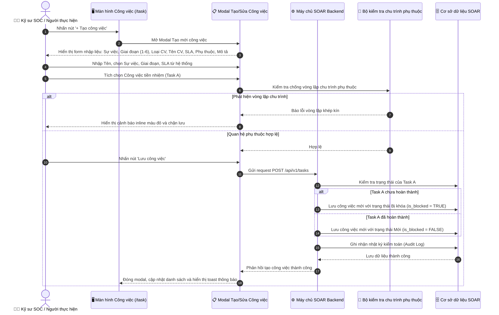
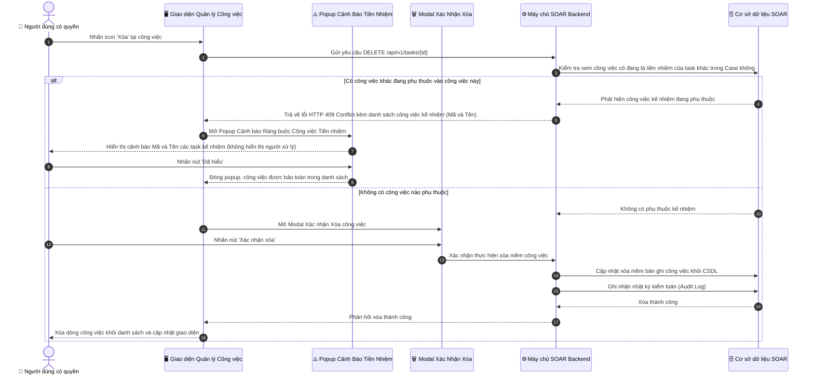

# ĐẶC TẢ YÊU CẦU PHẦN MỀM (SRS)
## TÍNH NĂNG: QUẢN LÝ CHI TIẾT CÔNG VIỆC VÀ FORM TẠO/SỬA/HOÀN THÀNH CÔNG VIỆC (TASK LIFECYCLE & CRUD MANAGEMENT)

---

# 1. THÔNG TIN CHUNG CHỨC NĂNG

| Thuộc tính | Nội dung |
| :--- | :--- |
| **Mã chức năng** | `SOAR_TASK_CRUD_MGMT_02` |
| **Tên chức năng** | Quản lý chi tiết công việc và Form Tạo/Sửa/Hoàn thành công việc (Task Lifecycle & CRUD Management) |
| **Mô tả tổng quan** | Tính năng này nâng cấp màn hình Quản lý Công việc (`/task`) và chuẩn hóa toàn diện vòng đời quản lý công việc ứng cứu sự cố trong trung tâm SOC. Tính năng cho phép kỹ sư tạo mới, chỉnh sửa, theo dõi, điều phối và hoàn thành công việc với các thông tin chuẩn hóa: phân loại Giai đoạn ứng cứu sự cố (theo 6 giai đoạn ứng cứu sự cố gồm: Giai đoạn 1: Chuẩn bị, Giai đoạn 2: Phát hiện và phân tích, Giai đoạn 3: Ngăn chặn, Giai đoạn 4: Loại bỏ, Giai đoạn 5: Khôi phục, Giai đoạn 6: Tổng kết rút kinh nghiệm), đo lường thời hạn hoàn thành thông qua gói quy tắc SLA hiện có trong hệ thống, thiết lập quan hệ phụ thuộc kỹ thuật (Finish-to-Start) giữa các công việc trong cùng Sự việc với thuật toán kiểm tra chống vòng lặp chu trình phụ thuộc, kiểm soát trạng thái khóa phụ thuộc (`Bị khóa`), tự động mở khóa công việc kế nhiệm khi công việc tiền nhiệm hoàn tất, bổ sung thao tác Xóa công việc có kiểm tra ràng buộc toàn vẹn dữ liệu (Popup cảnh báo súc tích, không hiển thị người xử lý), và bắt buộc nghiệm thu kết quả xử lý thực tế qua form 3 thẻ hiện đại (Thành công, Thành công một phần, Không khả thi / Thất bại) trước khi đóng công việc. |
| **Phạm vi tính năng** | - **Bao gồm:**<br>&nbsp;&nbsp;+ Nâng cấp màn hình danh sách `/task` & Drawer chi tiết: Thẻ công việc hiển thị Badge Giai đoạn ứng cứu (`[GĐ 1: Chuẩn bị]` đến `[GĐ 6: Tổng kết rút kinh nghiệm]`), Badge cảnh báo `🔒 Bị khóa`, khối liên kết Công việc phụ thuộc (Tiền nhiệm / Kế nhiệm), khối Kết quả thực hiện & Nghiệm thu, và nút Xóa công việc có kiểm tra an toàn.<br>&nbsp;&nbsp;+ Modal Tạo mới / Chỉnh sửa công việc: Bắt buộc chọn Giai đoạn ứng cứu (1 trong 6 giai đoạn ứng cứu sự cố), chọn SLA áp dụng lấy động từ danh mục SLA hệ thống, chọn Công việc phụ thuộc có thuật toán kiểm tra chống vòng lặp chu trình.<br>&nbsp;&nbsp;+ Modal Xác nhận Hoàn thành & Nghiệm thu Kết quả: Bắt buộc chọn Đánh giá kết quả dạng 3 thẻ hiện đại (`Thành công`, `Thành công một phần`, `Không khả thi / Thất bại`), nhập nội dung kết quả thực tế, đính kèm tệp bằng chứng, nút `Hủy bỏ` và `Lưu & Hoàn thành`.<br>&nbsp;&nbsp;+ Thao tác Xóa công việc: Kiểm tra nếu có task khác phụ thuộc ➔ Chặn xóa và hiển thị Popup cảnh báo `CẢNH BÁO RÀNG BUỘC CÔNG VIỆC TIỀN NHIỆM` chỉ liệt kê Mã và Tên công việc kế nhiệm, **tuyệt đối không hiển thị người xử lý**; nếu không có ràng buộc ➔ Hiển thị Modal Xác nhận Xóa.<br>&nbsp;&nbsp;+ Cơ chế Tự động Mở khóa (Auto-Unblock): Khi công việc tiền nhiệm Hoàn thành, hệ thống tự động gỡ khóa cho các công việc kế nhiệm và gửi thông báo cho nhân sự phụ trách.<br>&nbsp;&nbsp;+ Ghi nhận Audit Log toàn bộ thao tác Tạo, Sửa, Xóa, Đổi trạng thái và Hoàn thành công việc.<br>- **Không bao gồm:**<br>&nbsp;&nbsp;+ Phân nhóm giao diện theo 6 khối Accordion bên trong Sự việc (thuộc tính năng `SOAR_CASE_TASK_MGMT_01`).<br>&nbsp;&nbsp;+ Quản lý Mẫu công việc gốc theo loại sự cố (thuộc tính năng `SOAR_TASK_TEMPLATE_03`). |
| **Điều kiện trước** | 1. Người dùng đã đăng nhập thành công vào hệ thống SOAR và có quyền truy cập Công việc / Sự việc.<br>2. Đã tồn tại ít nhất một Sự việc (Case) trong hệ thống để liên kết công việc.<br>3. Danh mục gói quy tắc SLA đang hoạt động đã sẵn sàng trong hệ thống.<br>4. Múi giờ hệ thống (Timezone) đã được đồng bộ chuẩn UTC+7. |
| **Điều kiện sau** | 1. **Khi tạo/sửa công việc thành công:** Dữ liệu công việc được lưu vào CSDL; nếu có phụ thuộc chưa xong thì công việc tự động ở trạng thái `Bị khóa`; ghi nhận Audit Log.<br>2. **Khi hoàn thành công việc thành công:** Công việc chuyển trạng thái Hoàn thành, lưu kết quả nghiệm thu; các công việc kế nhiệm đủ điều kiện tự động chuyển sang trạng thái Mới (gỡ cờ Bị khóa), gửi thông báo cho người phụ trách.<br>3. **Khi xóa công việc thành công:** Bản ghi công việc được xóa khỏi CSDL (Soft delete), ghi nhận Audit Log.<br>4. **Khi thao tác thất bại / bị chặn:** Dữ liệu CSDL không thay đổi, hiển thị thông báo lỗi chi tiết cho người dùng. |
| **Ngoại lệ tổng quan** | 1. Phát hiện vòng lặp chu trình phụ thuộc khi tạo/sửa: Hệ thống từ chối quan hệ và thông báo lỗi theo [BR-03].<br>2. Cố tình chuyển trạng thái khi đang bị khóa phụ thuộc: Hệ thống từ chối cập nhật và báo lỗi theo [BR-04].<br>3. Vi phạm ràng buộc xóa công việc tiền nhiệm: Hệ thống chặn xóa và hiển thị Popup cảnh báo theo [BR-07].<br>4. Để trống kết quả khi bấm Hoàn thành: Hệ thống chặn lưu và yêu cầu nhập đủ nội dung theo [BR-06]. |

---

# 2. BIỂU ĐỒ LUỒNG XỬ LÝ (SEQUENCE DIAGRAMS)

### 2.1. Sơ đồ tuần tự: Tạo mới công việc có thiết lập quan hệ phụ thuộc tiền nhiệm



---

### 2.2. Sơ đồ tuần tự: Nghiệm thu hoàn thành công việc và tự động mở khóa công việc kế nhiệm

```mermaid
sequenceDiagram
    autonumber
    actor User as 👨‍💻 Người thực hiện công việc
    participant FE as 🖥️ Giao diện Quản lý Công việc
    participant Modal as 📋 Modal Nghiệm thu Hoàn thành
    participant BE as ⚙️ Máy chủ SOAR Backend
    participant Engine as ⚙️ Bộ xử lý sự kiện phụ thuộc
    participant DB as 🗄️ Cơ sở dữ liệu SOAR

    User->>FE: Chọn trạng thái 'Hoàn thành' trên dropdown công việc (Task A)
    FE->>Modal: Mở Modal Xác nhận Hoàn thành & Nghiệm thu Kết quả
    Modal-->>User: Hiển thị form 3 thẻ đánh giá, ô kết quả thực tế, đính kèm file
    User->>Modal: Chọn thẻ Đánh giá (Thành công/Thành công một phần/Không khả thi)
    User->>Modal: Nhập nội dung kết quả thực tế và đính kèm tệp bằng chứng
    User->>Modal: Nhấn nút 'Lưu & Hoàn thành'
    Modal->>BE: Gửi request nghiệm thu hoàn thành POST /api/v1/tasks/{id}/complete
    BE->>BE: Kiểm tra tính hợp lệ của nội dung báo cáo kết quả
    BE->>DB: Cập nhật trạng thái Task A sang Hoàn thành và lưu kết quả nghiệm thu
    BE->>DB: Ghi nhận nhật ký kiểm toán (Audit Log)
    BE->>Engine: Kích hoạt sự kiện TaskCompletedEvent(Task A)
    Engine->>DB: Quét toàn bộ công việc kế nhiệm có phụ thuộc vào Task A (Task B)
    loop Với từng công việc kế nhiệm
        alt Toàn bộ công việc tiền nhiệm khác đã Hoàn thành
            Engine->>DB: Cập nhật Task B gỡ cờ Bị khóa (is_blocked = FALSE, status = 'NEW')
            Engine->>User: Gửi thông báo Task B đã mở khóa và sẵn sàng xử lý
            Engine-->>FE: Bắn tín hiệu cập nhật giao diện thời gian thực
            FE-->>User: Task A hiển thị Hoàn thành; Task B mở khóa dropdown trạng thái
        else Vẫn còn tiền nhiệm khác chưa xong
            Engine->>Engine: Giữ nguyên trạng thái Bị khóa cho Task B
        end
    end
    DB-->>BE: Hoàn tất cập nhật
    BE-->>Modal: Phản hồi thành công
    Modal-->>FE: Đóng modal, hiển thị nút 'Xem kết quả' và thông báo thành công
```

---

### 2.3. Sơ đồ tuần tự: Xóa công việc với kiểm tra an toàn ràng buộc tiền nhiệm



---

# 3. THIẾT KẾ GIAO DIỆN & ĐẶC TẢ CHI TIẾT UI COMPONENTS

### 3.1. Màn hình Chi tiết Công việc: Đặc tả các UI Components Mới & Nâng cấp

Nhằm tập trung trực diện vào phạm vi nâng cấp chức năng, bảng dưới đây chỉ đặc tả chi tiết các thành phần giao diện mới và các thành phần được cải tiến trên thẻ công việc và Drawer chi tiết:

| STT | Tên trường / Thành phần | Loại dữ liệu / Control | Mô tả chi tiết |
| :---: | :--- | :--- | :--- |
| 1 | **Badge Giai đoạn ứng cứu trên thẻ công việc** | Status Badge | - Hiển thị phân loại giai đoạn ứng cứu sự cố trực tiếp trên từng thẻ công việc trong danh sách.<br>- **Định dạng hiển thị:** `[GĐ {N}: {Tên_Giai_Đoạn}]` (ví dụ: `[GĐ 1: Chuẩn bị]`).<br>- **6 giá trị hiển thị chuẩn hóa:**<br>&nbsp;&nbsp;+ `[GĐ 1: Chuẩn bị]` (`[Phase 1: Preparation]`)<br>&nbsp;&nbsp;+ `[GĐ 2: Phát hiện và phân tích]` (`[Phase 2: Detection & Analysis]`)<br>&nbsp;&nbsp;+ `[GĐ 3: Ngăn chặn]` (`[Phase 3: Containment]`)<br>&nbsp;&nbsp;+ `[GĐ 4: Loại bỏ]` (`[Phase 4: Eradication]`)<br>&nbsp;&nbsp;+ `[GĐ 5: Khôi phục]` (`[Phase 5: Recovery]`)<br>&nbsp;&nbsp;+ `[GĐ 6: Tổng kết rút kinh nghiệm]` (`[Phase 6: Lessons Learned]`)<br>- **Phối màu trực quan:** Màu xám xanh cho GĐ 1, màu xanh dương cho GĐ 2, màu vàng cam cho GĐ 3, màu đỏ cam cho GĐ 4, màu tím cho GĐ 5, màu xanh ngọc cho GĐ 6. |
| 2 | **Badge Cảnh báo Bị khóa trên thẻ** | Warning Badge | - Hiển thị cảnh báo trực quan khi công việc đang bị khóa do công việc tiền nhiệm chưa hoàn thành.<br>- **Định dạng hiển thị:** Badge màu vàng cam `🔒 Bị khóa` (hoặc `🔒 Chờ [{Mã_Task_Tiền_Nhiệm}]`).<br>- **Điều kiện hiển thị:** Chỉ xuất hiện khi `is_blocked = TRUE`. Khi toàn bộ công việc tiền nhiệm hoàn thành, hệ thống tự động gỡ bỏ badge này theo thời gian thực.<br>- **Hover tooltip:** `"Chờ công việc tiền nhiệm hoàn thành để mở khóa"` (`"Waiting for predecessor task completion to unblock"`). |
| 3 | **Dropdown Chuyển đổi trạng thái có kiểm soát khóa** | Dropdown Select | - Cho phép người dùng chuyển nhanh trạng thái xử lý của công việc trên Drawer chi tiết hoặc trên dòng danh sách.<br>- **Các tùy chọn khi công việc mở khóa:** `"Mới"` (`"New"`), `"Đang xử lý"` (`"In Progress"`), `"Đang đợi đối tác"` (`"Pending Partner"`), `"Hoàn thành"` (`"Completed"`).<br>- **Hành vi khi công việc đang bị khóa (`is_blocked = TRUE`):**<br>&nbsp;&nbsp;+ Dropdown bị vô hiệu hóa (disabled), hiển thị cố định tùy chọn duy nhất: `<option>🔒 Bị khóa</option>`.<br>&nbsp;&nbsp;+ Hover tooltip: `"Công việc đang bị khóa do chờ công việc tiền nhiệm hoàn thành"`.<br>- **Hành vi khi chọn `Hoàn thành`:** Hệ thống tự động mở Modal Xác nhận Hoàn thành & Nghiệm thu Kết quả (Mục 3.3) để người dùng bắt buộc nhập báo cáo nghiệm thu trước khi đóng công việc. |
| 4 | **Khối "Công việc phụ thuộc (Dependencies)" trong Drawer** | Sub-panel Container | - Hiển thị trực quan toàn bộ mạng lưới liên kết phụ thuộc kỹ thuật của công việc thành 2 khu vực rõ ràng:<br>&nbsp;&nbsp;1. **Khu vực Công việc tiền nhiệm (Phải làm trước):** Liệt kê danh sách các công việc mà công việc này phải chờ kèm trạng thái xử lý trực quan (`✓ Đã hoàn thành` màu xanh lá hoặc `🔒 Chưa hoàn thành` màu vàng cam). Nếu không có: Hiển thị nhãn `"Công việc độc lập (Không có phụ thuộc tiền nhiệm)"`.<br>&nbsp;&nbsp;2. **Khu vực Công việc kế nhiệm (Đang chờ công việc này):** Liệt kê danh sách các công việc đang chờ công việc này hoàn thành. Nếu không có: Hiển thị nhãn `"Không có công việc kế nhiệm nào phụ thuộc vào công việc này."`. |
| 5 | **Khối "Kết quả thực hiện & Nghiệm thu" trong Drawer** | Sub-panel Container | - Hiển thị thông tin kiểm toán nghiệm thu khi công việc đã ở trạng thái Hoàn thành:<br>&nbsp;&nbsp;+ **Badge đánh giá kết quả:** Hiển thị trực quan một trong 3 mức: `✓ THÀNH CÔNG`, `THÀNH CÔNG MỘT PHẦN` hoặc `KHÔNG KHẢ THI / THẤT BẠI`.<br>&nbsp;&nbsp;+ **Nội dung kết quả xử lý thực tế:** Toàn văn báo cáo kỹ thuật do người thực hiện đã nhập khi hoàn thành.<br>&nbsp;&nbsp;+ **Tệp đính kèm bằng chứng:** Danh sách các tệp bằng chứng kỹ thuật đã tải lên kèm dung lượng và nút Tải xuống (`⬇️`).<br>&nbsp;&nbsp;+ **Thông tin kiểm toán:** Tên người nghiệm thu và mốc thời gian hoàn thành.<br>- **Trường hợp công việc chưa hoàn thành:** Hiển thị dòng thông báo xám mờ: `"Chưa có kết quả thực hiện (Công việc đang trong quá trình xử lý)."` (`"No execution results yet (Task is in progress)."`). |
| 6 | **Nút "Xóa công việc" có kiểm tra an toàn** | Button (Danger) | - Cho phép người dùng thực hiện xóa công việc khỏi hệ thống.<br>- **Nhãn hiển thị:** `"Xóa công việc"` (`"Delete Task"`).<br>- **Hành vi kiểm tra an toàn khi nhấn:**<br>&nbsp;&nbsp;+ Nếu có công việc khác trong Sự việc đang phụ thuộc vào công việc này: Hệ thống chặn xóa và mở Popup Cảnh báo Chặn Xóa do Ràng buộc Phụ thuộc (Mục 3.4).<br>&nbsp;&nbsp;+ Nếu không có công việc phụ thuộc: Hệ thống mở Modal Xác nhận Xóa công việc (Mục 3.5). |

---

### 3.2. Modal Tạo mới / Chỉnh sửa Công việc (Create / Edit Task Modal)

Modal này xuất hiện khi người dùng nhấn nút `+ Tạo công việc` trên thanh công cụ hoặc nhấn nút Sửa trên Drawer chi tiết:

| STT | Tên trường / Thành phần | Loại dữ liệu / Control | Mô tả chi tiết |
| :---: | :--- | :--- | :--- |
| 1 | **Tiêu đề Modal** | Label | - Hiển thị tiêu đề modal theo ngữ cảnh thao tác.<br>- **Nội dung hiển thị:**<br>&nbsp;&nbsp;+ Khi tạo mới: `"Tạo công việc mới"` (`"Create New Task"`).<br>&nbsp;&nbsp;+ Khi chỉnh sửa: `"Chỉnh sửa công việc: {Mã_Task}"` (`"Edit Task: {Mã_Task}"`).<br>- Có nút dấu `✕` ở góc trên bên phải để đóng modal. |
| 2 | **Thuộc Sự việc (*)** | Textbox (Read-only) | - Hiển thị thông tin Sự việc (Case) mà công việc trực thuộc.<br>- **Hành vi:** Khi mở từ màn hình chi tiết Sự việc, hệ thống tự động điền sẵn mã và tên Sự việc (ví dụ: `CA01346751 - Sự cố Ransomware Server DB`) và khóa ở chế độ chỉ đọc. |
| 3 | **Giai đoạn ứng cứu (*)** | Dropdown Select | - Cho phép người dùng chọn giai đoạn ứng cứu sự cố mà công việc thuộc về.<br>- **Nguồn dữ liệu (6 giai đoạn ứng cứu sự cố):**<br>&nbsp;&nbsp;1. `Giai đoạn 1: Chuẩn bị` (`Phase 1: Preparation`)<br>&nbsp;&nbsp;2. `Giai đoạn 2: Phát hiện và phân tích` (`Phase 2: Detection and Analysis`)<br>&nbsp;&nbsp;3. `Giai đoạn 3: Ngăn chặn` (`Phase 3: Containment`)<br>&nbsp;&nbsp;4. `Giai đoạn 4: Loại bỏ` (`Phase 4: Eradication`)<br>&nbsp;&nbsp;5. `Giai đoạn 5: Khôi phục` (`Phase 5: Recovery`)<br>&nbsp;&nbsp;6. `Giai đoạn 6: Tổng kết rút kinh nghiệm` (`Phase 6: Lessons Learned`)<br>- **Giá trị mặc định:** Tự động chọn giai đoạn tương ứng nếu mở từ nút "+ Thêm vào GĐ này"; ngược lại mặc định chọn Giai đoạn 1. |
| 4 | **Loại công việc (*)** | Dropdown Select | - Cho phép người dùng chọn loại hình thực thi của công việc.<br>- **Các tùy chọn:** `"Thủ công"` (`"Manual"`) hoặc `"Tự động"` (`"Automated Playbook"`).<br>- **Giá trị mặc định:** `"Thủ công"`. |
| 5 | **Tên công việc (*)** | Textbox | - Bắt buộc người dùng nhập tên tóm tắt tiêu chuẩn của công việc.<br>- **Placeholder:**<br>&nbsp;&nbsp;+ VI: `Nhập tên công việc...`<br>&nbsp;&nbsp;+ EN: `Enter task name...`<br>- **Giới hạn ký tự:** Tối đa 255 ký tự. Hệ thống tự động trim khoảng trắng đầu cuối.<br>- **Thông báo lỗi khi để trống:** Hiển thị thông báo inline màu đỏ dưới trường: `"Vui lòng nhập tên công việc!"` (`"Please enter task name!"`). |
| 6 | **Mã công việc (*)** | Textbox | - Hiển thị mã định danh duy nhất của công việc trong hệ thống.<br>- **Giá trị mặc định:** Hệ thống tự động sinh tiền tố `TA` kèm chuỗi số ngẫu nhiên duy nhất (ví dụ: `TA8412`).<br>- Cho phép người dùng tùy chỉnh mã nhưng hệ thống kiểm tra tính duy nhất trên toàn hệ thống theo [BR-02]. |
| 7 | **Đơn vị xử lý (*)** | Dropdown Select | - Cho phép người dùng chọn đơn vị/phòng ban phụ trách thực hiện công việc.<br>- **Nguồn dữ liệu:** Lấy danh sách động từ cây cơ cấu tổ chức/phòng ban trong hệ thống (ví dụ: `NCS`, `Phòng SOC`, `Đội CERT`...).<br>- **Thông báo lỗi khi để trống:** `"Vui lòng chọn đơn vị xử lý!"` (`"Please select handling department!"`). |
| 8 | **Người thực hiện (*)** | Dropdown Select | - Cho phép người dùng chọn nhân sự kỹ sư SOC chịu trách nhiệm chính thực hiện công việc.<br>- **Nguồn dữ liệu:** Lấy danh sách người dùng đang ở trạng thái Hoạt động thuộc đơn vị xử lý đã chọn.<br>- **Chức năng tìm kiếm (Searchable):** Có (cho phép gõ tìm nhanh họ tên / username).<br>- **Thông báo lỗi khi để trống:** `"Vui lòng chọn người thực hiện!"` (`"Please select assignee!"`). |
| 9 | **Mức độ ưu tiên (*)** | Dropdown Select | - Cho phép người dùng chọn cấp độ ưu tiên của công việc.<br>- **Các tùy chọn:** `"Cao"` (`"High"`), `"Nghiêm trọng"` (`"Critical"`), `"Trung bình"` (`"Medium"`), `"Thấp"` (`"Low"`).<br>- **Giá trị mặc định:** `"Cao"`. |
| 10 | **SLA áp dụng (*) (Thời hạn)** | Dropdown Select | - Cho phép người dùng chọn gói quy tắc SLA làm hạn mức thời gian cam kết hoàn thành.<br>- **Nguồn dữ liệu:** Lấy dữ liệu động từ danh mục các gói quy tắc SLA đang hoạt động trong hệ thống (không gán cứng giá trị).<br>- **Placeholder:**<br>&nbsp;&nbsp;+ VI: `Chọn gói SLA cam kết...`<br>&nbsp;&nbsp;+ EN: `Select committed SLA package...`<br>- **Thông báo lỗi khi để trống:** `"Vui lòng chọn gói SLA áp dụng!"` (`"Please select applicable SLA package!"`). |
| 11 | **Công việc phụ thuộc (Tiền nhiệm)** | Checkbox List (Searchable) | - Cho phép người dùng tích chọn các công việc trong cùng Sự việc phải hoàn thành trước công việc này.<br>- **Quy tắc Nghiệp vụ & Chống vòng lặp chu trình [BR-03]:**<br>&nbsp;&nbsp;+ Mỗi khi người dùng xem danh sách, hệ thống tự động chạy thuật toán kiểm tra chu trình khép kín đối với từng công việc.<br>&nbsp;&nbsp;+ Nếu chọn một công việc mà việc tạo liên kết đó sẽ gây ra vòng lặp vô tận (chu trình kín): Hộp kiểm (checkbox) tương ứng bị làm mờ (disabled), hiển thị nhãn cảnh báo `⚠️ Vòng lặp`.<br>&nbsp;&nbsp;+ **Nội dung tooltip khi rê chuột vào:**<br>&nbsp;&nbsp;&nbsp;&nbsp;`"Không thể chọn: Quan hệ này sẽ tạo thành vòng lặp phụ thuộc khép kín!"` (`"Cannot select: This relationship creates a closed dependency loop!"`).<br>&nbsp;&nbsp;+ Nếu người dùng cố tình click chọn: Hệ thống tự động hủy tick và hiển thị cảnh báo đỏ inline: `"Phát hiện vòng lặp phụ thuộc không hợp lệ! Hệ thống từ chối quan hệ này."` (`"Invalid circular dependency detected! System rejected this relation."`). |
| 12 | **Mô tả công việc (SOP Playbook)** | Textarea | - Cho phép người dùng nhập kịch bản hướng dẫn xử lý kỹ thuật chi tiết, các lệnh CLI, địa chỉ IP/port liên quan.<br>- **Placeholder:**<br>&nbsp;&nbsp;+ VI: `Nhập kịch bản hướng dẫn thao tác chi tiết, các lệnh cần thực thi...`<br>&nbsp;&nbsp;+ EN: `Enter detailed procedure instructions, commands to execute...`<br>- **Giới hạn ký tự:** Tối đa 5000 ký tự. |
| 13 | **Tệp đính kèm kịch bản** | File Upload Box | - Cho phép người dùng đính kèm tài liệu kịch bản hướng dẫn (txt, png, log, pdf, docx tối đa 50MB). |
| 14 | **Nút "Hủy bỏ"** | Button (Cancel) | - Cho phép người dùng hủy thao tác và đóng modal.<br>- **Nhãn hiển thị:** `"Hủy bỏ"` (`"Cancel"`).<br>- **Hành vi khi nhấn:** Nếu form đã có thay đổi dữ liệu, hiển thị Hộp thoại cảnh báo dữ liệu chưa lưu (Mục 3.6); nếu chưa thay đổi thì đóng modal ngay lập tức. |
| 15 | **Nút "Lưu công việc"** | Button (Primary) | - Cho phép người dùng thẩm định và lưu thông tin công việc vào hệ thống.<br>- **Nhãn hiển thị:** `"Tạo mới"` (`"Create"`) khi tạo hoặc `"Lưu thay đổi"` (`"Save Changes"`) khi chỉnh sửa.<br>- **Hành vi khi nhấn:** Hệ thống kiểm tra dữ liệu bắt buộc. Nếu hợp lệ: Chuyển nút sang trạng thái Loading (spinner, disable nút), gửi request lưu CSDL, tự động xác định trạng thái Bị khóa nếu có phụ thuộc chưa xong, đóng modal và hiển thị toast message: `"Lưu thông tin công việc thành công!"` (`"Task saved successfully!"`). |

---

### 3.3. Modal Xác nhận Hoàn thành & Nghiệm thu Kết quả (Complete Task Modal)

Modal này hiển thị khi người dùng chọn chuyển trạng thái công việc sang `Hoàn thành`:

| STT | Tên trường / Thành phần | Loại dữ liệu / Control | Mô tả chi tiết |
| :---: | :--- | :--- | :--- |
| 1 | **Tiêu đề Modal** | Label | - Hiển thị tiêu đề modal xác nhận nghiệm thu.<br>- **Nội dung hiển thị:** `"✓ Xác nhận Hoàn thành & Nghiệm thu Kết quả"` (`"✓ Complete & Accept Task Results"`). |
| 2 | **Nút đóng Modal (Icon "✕")** | Button | - Cho phép người dùng đóng modal mà không lưu thông tin.<br>- **Hành vi khi nhấn:** Nếu đã nhập nội dung kết quả, hiển thị Hộp thoại cảnh báo dữ liệu chưa lưu (Mục 3.6); nếu chưa nhập thì đóng modal ngay lập tức và giữ nguyên trạng thái cũ của công việc. |
| 3 | **Đánh giá kết quả thực hiện (*)** | Card Grid Segmented (3 thẻ) | - Cho phép người dùng đánh giá mức độ đạt được của công việc đã xử lý.<br>- **Tiêu chuẩn thiết kế:** Bố cục dạng **3 thẻ lựa chọn hiện đại (Card Grid 3 cột)**:<br>&nbsp;&nbsp;1. **`Thành công`** (`SUCCESS`) - Kích hoạt hiệu ứng viền sáng xanh lá cây khi được chọn.<br>&nbsp;&nbsp;2. **`Thành công một phần`** (`PARTIAL`) - Kích hoạt hiệu ứng viền sáng vàng cam khi được chọn.<br>&nbsp;&nbsp;3. **`Không khả thi / Thất bại`** (`FAILED`) - Kích hoạt hiệu ứng viền sáng đỏ khi được chọn.<br>- **Giá trị mặc định:** Chọn sẵn thẻ `Thành công`.<br>- **Hành vi người dùng:** Nhấp chuột vào thẻ nào thì thẻ đó kích hoạt trạng thái được chọn (`active`). |
| 4 | **Nội dung kết quả xử lý thực tế (*)** | Textarea | - Cho phép người dùng nhập tóm tắt quá trình thực thi kỹ thuật, các thao tác đã tiến hành và kết quả thu được.<br>- **Nhãn hiển thị:** `Nội dung kết quả xử lý thực tế *`.<br>- **Placeholder:**<br>&nbsp;&nbsp;+ VI: `Nhập tóm tắt thao tác kỹ thuật, các lệnh đã chạy, port switch đã shutdown, hash/IP đã chặn...`<br>&nbsp;&nbsp;+ EN: `Enter technical actions summary, executed commands, shutdown ports, blocked hashes/IPs...`<br>- **Giá trị mặc định:** Trống.<br>- **Giới hạn ký tự:** Tối đa 5000 ký tự.<br>- **Quy tắc Nghiệp vụ:** Tự động trim khoảng trắng ở đầu và cuối chuỗi trước khi lưu.<br>- **Thông báo lỗi tương ứng:** Để trống và nhấn Lưu: Hiển thị thông báo lỗi inline màu đỏ dưới trường: `"Vui lòng nhập nội dung kết quả xử lý thực tế!"` (`"Please enter actual execution result notes!"`). |
| 5 | **Tệp đính kèm bằng chứng** | File Drag & Drop Box | - Cho phép người dùng tải lên các tệp bằng chứng kỹ thuật (Log, Ảnh chụp màn hình, Báo cáo phân tích).<br>- **Khu vực kéo thả:** Hỗ trợ nhấp chuột chọn tệp hoặc kéo thả tệp trực tiếp.<br>- **Quy cách tệp:** Hỗ trợ các định dạng `png, jpg, log, txt, docx, pdf` với dung lượng tối đa 50MB/tệp. |
| 6 | **Nút "Hủy bỏ"** | Button (Cancel) | - Cho phép người dùng hủy thao tác hoàn thành và đóng modal.<br>- **Nhãn hiển thị:** `"Hủy bỏ"` (`"Cancel"`).<br>- **Hành vi khi nhấn:** Nếu form đã có dữ liệu nhập, hiển thị Hộp thoại cảnh báo dữ liệu chưa lưu (Mục 3.6); nếu chưa có thay đổi thì đóng modal ngay lập tức và giữ nguyên trạng thái công việc. |
| 7 | **Nút "Lưu & Hoàn thành"** | Button (Primary) | - Cho phép người dùng thẩm định và xác nhận lưu kết quả xử lý để hoàn tất công việc.<br>- **Nhãn hiển thị:** `"Lưu & Hoàn thành"` (`"Save & Complete"`).<br>- **Hành vi khi nhấn:**<br>&nbsp;&nbsp;1. Hệ thống kiểm tra tính hợp lệ của trường Nội dung kết quả xử lý thực tế.<br>&nbsp;&nbsp;2. Nếu không hợp lệ: Hiển thị thông báo lỗi inline và chặn lưu.<br>&nbsp;&nbsp;3. Nếu hợp lệ: Chuyển nút sang trạng thái Đang xử lý (Loading spinner, vô hiệu hóa nút chống click đúp), cập nhật trạng thái công việc sang `Hoàn thành`, lưu kết quả nghiệm thu và thời gian hoàn tất vào CSDL.<br>&nbsp;&nbsp;4. Tự động kích hoạt cơ chế kiểm tra mở khóa (Auto-unblock) cho các công việc kế nhiệm theo [BR-05].<br>&nbsp;&nbsp;5. Đóng modal, ghi Audit Log và hiển thị toast message tự động đóng: `"Đã hoàn thành công việc và lưu kết quả nghiệm thu thành công!"` (`"Task completed and acceptance result saved successfully!"`). |

---

### 3.4. Popup Cảnh báo Chặn Xóa do Ràng buộc Phụ thuộc (Delete Blocked Warning Popup)

Popup này tự động hiển thị khi người dùng thực hiện xóa một công việc đang là điều kiện tiền nhiệm bắt buộc của các công việc khác trong Sự việc:

| STT | Tên trường / Thành phần | Loại dữ liệu / Control | Mô tả chi tiết |
| :---: | :--- | :--- | :--- |
| 1 | **Tiêu đề Popup** | Label | - Hiển thị tiêu đề cảnh báo ràng buộc.<br>- **Nội dung hiển thị:** `"CẢNH BÁO RÀNG BUỘC CÔNG VIỆC TIỀN NHIỆM"` (`"PREDECESSOR TASK DEPENDENCY WARNING"`). |
| 2 | **Nút đóng Popup (Icon "✕")** | Button | - Cho phép đóng popup cảnh báo.<br>- **Hành vi khi nhấn:** Đóng popup cảnh báo và giữ nguyên công việc trong danh sách. |
| 3 | **Thông điệp cảnh báo chính** | Alert Text | - Hiển thị dòng thông báo trực tiếp:<br>&nbsp;&nbsp;`"Không thể xóa công việc [{Mã_Task}: {Tên_Task}]!"` (`"Cannot delete task [{Mã_Task}: {Tên_Task}]!"`). |
| 4 | **Danh sách công việc kế nhiệm bị phụ thuộc** | List Box Container | - Hiển thị khung danh sách liệt kê các công việc kế nhiệm đang phụ thuộc vào công việc này.<br>- **QUY TẮC BẮT BUỘC:** **Chỉ hiển thị Mã công việc và Tên công việc, tuyệt đối KHÔNG hiển thị thông tin người xử lý**.<br>- **Định dạng hiển thị mẫu:**<br>&nbsp;&nbsp;`• TA08: Vô hiệu hóa tài khoản quản trị bị lộ lọt`<br>&nbsp;&nbsp;`• TA10: Vá lỗ hổng dịch vụ RDP trên các máy chủ liên quan`<br>- **Mục đích:** Đảm bảo giao diện súc tích, tập trung trực diện vào xung đột logic quy trình. |
| 5 | **Khối Phân tích Nguyên nhân & Hướng xử lý** | Info Box Container | - Hiển thị chi tiết nguyên nhân và hướng dẫn giải quyết cho người dùng:<br>&nbsp;&nbsp;+ **Nguyên nhân:** `"Công việc này là điều kiện tiền nhiệm bắt buộc của các công việc kế nhiệm nêu trên. Nếu xóa công việc này, chuỗi phụ thuộc quy trình sẽ bị đứt gãy và các công việc kế nhiệm sẽ không thể kích hoạt thực hiện."`<br>&nbsp;&nbsp;+ **Hướng xử lý:** `"Hệ thống chặn xóa để bảo đảm tính toàn vẹn dữ liệu. Vui lòng gỡ bỏ liên kết phụ thuộc tại các công việc kế nhiệm trước khi thực hiện xóa công việc này."` |
| 6 | **Nút "Đã hiểu"** | Button (CTA) | - Cho phép người dùng xác nhận đã nắm thông tin cảnh báo.<br>- **Nhãn hiển thị:** `"ĐÃ HIỂU"` (`"UNDERSTOOD"`).<br>- **Hành vi khi nhấn:** Đóng popup cảnh báo, không xóa dữ liệu và giữ nguyên công việc trên giao diện. |

---

### 3.5. Popup Modal Xác nhận Xóa công việc (Delete Confirmation Modal)

Modal này xuất hiện khi người dùng nhấn nút Xóa (`🗑️`) tại một công việc độc lập (không có công việc nào khác phụ thuộc vào nó):

- **Tên Modal:** Hộp thoại xác nhận xóa công việc
- **Tiêu đề (Header):** `"Xác nhận xóa công việc"` (`"Confirm deletion of task"`)
- **Nội dung thông báo (Body text):** `"Bạn có chắc chắn muốn xóa công việc [{Mã_Task}: {Tên_Task}] khỏi hệ thống không? Thao tác này sẽ không thể hoàn tác."` (`"Are you sure you want to delete task [{Mã_Task}: {Tên_Task}] from the system? This action cannot be undone."`)
- **Nút Xác nhận (Confirm Button):**
  - Nhãn nút: `"Xác nhận xóa"` (`"Confirm Delete"`)
  - Hành vi khi nhấn: Chuyển nút sang trạng thái Đang xử lý (Loading), gọi API xóa mềm bản ghi công việc khỏi CSDL. Nếu thành công: Đóng modal, xóa dòng công việc trên bảng và hiển thị toast message: `"Đã xóa công việc thành công!"` (`"Task deleted successfully!"`). Nếu thất bại: Hiển thị toast message: `"Xóa công việc thất bại. Vui lòng thử lại!"` (`"Failed to delete task. Please try again!"`).
- **Nút Hủy (Cancel Button):**
  - Nhãn nút: `"Hủy bỏ"` (`"Cancel"`) hoặc nhấp icon `✕`.
  - Hành vi khi nhấn: Đóng modal, không thực hiện hành động xóa dữ liệu.
- **Hành vi khi click vùng ngoài Modal:** Không đóng hộp thoại.

---

### 3.6. Popup Modal Cảnh báo Dữ liệu Chưa Lưu khi Thoát Form (Unsaved Changes Modal)

- **Tên Modal:** Cảnh báo dữ liệu chưa được lưu
- **Tiêu đề (Header):** `"Thông tin chưa được lưu"` (`"Unsaved changes"`)
- **Nội dung thông báo (Body text):** `"Dữ liệu bạn vừa nhập chưa được lưu lại. Bạn có chắc chắn muốn thoát và hủy bỏ các thay đổi này không?"` (`"The data you entered has not been saved. Are you sure you want to exit and discard these changes?"`)
- **Nút Xác nhận thoát (Confirm Button):**
  - Nhãn nút: `"Thoát không lưu"` (`"Exit without saving"`)
  - Hành vi khi nhấn: Đóng modal cảnh báo, đồng thời đóng modal tác vụ hiện tại và không lưu dữ liệu.
- **Nút Hủy / Giữ lại (Cancel Button):**
  - Nhãn nút: `"Giữ lại"` (`"Keep editing"`)
  - Hành vi khi nhấn: Đóng modal cảnh báo, giữ nguyên dữ liệu trên form để người dùng tiếp tục thao tác.
- **Hành vi khi click vùng ngoài Modal:** Không đóng hộp thoại cảnh báo.

---

### 3.7. Đặc tả các trạng thái màn hình bổ trợ (Screen UX States)

#### 3.7.1. Trạng thái chưa có công việc (Empty State trên `/task`)
- **Điều kiện kích hoạt:** Khi người dùng chưa được giao công việc nào (tab Công việc của tôi) hoặc đơn vị chưa có công việc nào (tab Công việc đơn vị).
- **Hình ảnh minh họa:** Icon tài liệu quy trình rỗng.
- **Tiêu đề chính:** `"Không có công việc nào cần xử lý"` (`"No tasks to handle"`)
- **Mô tả phụ:** `"Hiện tại bạn chưa có công việc nào được phân công trong danh mục này. Bạn có thể tạo công việc mới để bắt đầu xử lý."` (`"You currently have no tasks assigned in this view. You can create a new task to get started."`)
- **Nút hành động (CTA Button):** Nút `"+ Tạo công việc"` (`"+ Create Task"`) - nhấn mở Modal Tạo mới công việc.

#### 3.7.2. Trạng thái tìm kiếm không có kết quả (Search Zero Results)
- **Điều kiện kích hoạt:** Khi người dùng nhập từ khóa tìm kiếm hoặc lọc theo điều kiện mà không có bản ghi công việc nào khớp.
- **Hình ảnh minh họa:** Icon kính lúp không tìm thấy kết quả.
- **Tiêu đề chính:** `"Không tìm thấy công việc nào phù hợp"` (`"No matching tasks found"`)
- **Mô tả phụ:** `"Không có công việc nào phù hợp với từ khóa tìm kiếm hoặc điều kiện lọc hiện tại."` (`"No tasks match the current search keyword or filter criteria."`)
- **Nút hành động:** Nút `"Xóa bộ lọc"` (`"Clear Filters"`) - nhấn để đưa bộ lọc về mặc định và hiển thị danh sách đầy đủ.

#### 3.7.3. Trạng thái lỗi tải dữ liệu (Error / Offline State)
- **Điều kiện kích hoạt:** Khi mất kết nối mạng hoặc máy chủ Backend gặp sự cố gián đoạn API lấy danh sách công việc.
- **Hình ảnh minh họa:** Icon cảnh báo lỗi kết nối mạng.
- **Tiêu đề chính:** `"Không thể tải danh sách công việc"` (`"Failed to load task list"`)
- **Mô tả phụ:** `"Đã xảy ra lỗi khi kết nối đến máy chủ. Vui lòng kiểm tra lại đường truyền mạng và thử lại."` (`"An error occurred while connecting to the server. Please check your network connection and try again."`)
- **Nút hành động:** Nút `"Tải lại"` (`"Retry"`) - nhấn để kích hoạt lại API lấy danh sách công việc.

---

# 4. QUY TẮC NGHIỆP VỤ CHUYÊN SÂU (BUSINESS RULES)

### Bảng tổng hợp quy tắc nghiệp vụ:

| Mã quy tắc | Tên quy tắc nghiệp vụ | Phân nhóm quy tắc | Phạm vi áp dụng |
| :---: | :--- | :--- | :--- |
| **[BR-01]** | Quy tắc bắt buộc các trường thông tin khi Tạo mới và Chỉnh sửa công việc | Ràng buộc dữ liệu & Thuật toán | Toàn hệ thống |
| **[BR-02]** | Quy tắc tự động sinh và kiểm tra tính duy nhất của Mã công việc | Bảo mật & Sinh dữ liệu | Backend & DB |
| **[BR-03]** | Thuật toán kiểm tra chống vòng lặp chu trình phụ thuộc giữa các công việc | Ràng buộc dữ liệu & Thuật toán | Form & API Công việc |
| **[BR-04]** | Cơ chế khóa trạng thái phụ thuộc (Trạng thái Bị khóa) | Quy trình & Vòng đời trạng thái | Toàn hệ thống |
| **[BR-05]** | Cơ chế Tự động Mở khóa (Auto-Unblock) và Thông báo đa kênh | Tích hợp & Sự kiện | Event Engine & Notification |
| **[BR-06]** | Ràng buộc bắt buộc nghiệm thu và ghi nhận kết quả khi Hoàn thành (3 Thẻ đánh giá) | Ràng buộc dữ liệu & Nghiệp vụ | Form Hoàn thành công việc |
| **[BR-07]** | Ràng buộc toàn vẹn dữ liệu khi Xóa công việc (Cảnh báo không hiển thị người xử lý) | Ràng buộc dữ liệu & Thuật toán | API Xóa công việc & Popup Cảnh báo |
| **[BR-08]** | Quy tắc đối soát thời hạn hoàn thành theo SLA và cảnh báo vi phạm | Công thức tính toán | SLA Engine |
| **[BR-09]** | Quy chuẩn ghi nhận Nhật ký kiểm toán (Audit Logging) | Bảo mật & Kiểm toán | Toàn bộ phân hệ |

---

### [BR-01] Quy tắc bắt buộc các trường thông tin khi Tạo mới và Chỉnh sửa công việc
- **Phân loại:** Ràng buộc dữ liệu & Thuật toán (Data & Algorithm)
- **Phạm vi áp dụng:** Áp dụng trên toàn bộ Web UI và REST API `POST /api/v1/tasks`, `PUT /api/v1/tasks/{id}`.
- **Điều kiện kích hoạt:** Khi người dùng gửi request tạo mới hoặc cập nhật thông tin công việc.
- **Logic kiểm tra chi tiết:**
  1. Các trường sau đây là bắt buộc tuyệt đối không được phép rỗng hoặc chỉ chứa khoảng trắng:
     - `case_id`: Phải là ID của một Sự việc hợp lệ đang hoạt động trong hệ thống.
     - `phase`: Phải là số nguyên từ `1` đến `6` (tương ứng 6 giai đoạn ứng cứu sự cố gồm: Giai đoạn 1: Chuẩn bị, Giai đoạn 2: Phát hiện và phân tích, Giai đoạn 3: Ngăn chặn, Giai đoạn 4: Loại bỏ, Giai đoạn 5: Khôi phục, Giai đoạn 6: Tổng kết rút kinh nghiệm).
     - `name`: Độ dài từ 1 đến 255 ký tự.
     - `code`: Độ dài từ 3 đến 50 ký tự, không chứa ký tự đặc biệt ngoài dấu gạch dưới `_` hoặc gạch ngang `-`.
     - `handling_department`: Đơn vị xử lý hợp lệ trong cây phòng ban tổ chức của hệ thống.
     - `assignee_id`: User ID của tài khoản đang ở trạng thái Hoạt động.
     - `sla_id`: ID gói SLA đang hoạt động trong hệ thống.
  2. Trường `depends_on_ids`: Là tùy chọn (Optional). Nếu có giá trị, các ID trong mảng bắt buộc phải là các Task ID thuộc cùng `case_id` và phải thỏa mãn thuật toán kiểm tra chống vòng lặp [BR-03].
- **Hành vi khi vi phạm:** Hệ thống từ chối request, hiển thị thông báo lỗi chi tiết trên form.

---

### [BR-02] Quy tắc tự động sinh và kiểm tra tính duy nhất của Mã công việc
- **Phân loại:** Bảo mật & Sinh dữ liệu (Security & Generation)
- **Phạm vi áp dụng:** Toàn bộ hệ thống SOAR.
- **Điều kiện kích hoạt:** Khi mở Form Tạo mới công việc hoặc khi Backend tiếp nhận request tạo task mà không truyền `code`.
- **Logic sinh mã chi tiết:**
  1. Cấu trúc mã công việc tự động: `TA` + chuỗi số ngẫu nhiên 4-8 chữ số (ví dụ: `TA8412`, `TA76782850`).
  2. Backend thực hiện truy vấn đối soát trong bảng `soar_tasks`:
     $$\text{SELECT COUNT(*) FROM soar\_tasks WHERE code = GeneratedCode}$$
  3. Nếu mã bị trùng lặp: Tự động lặp lại quá trình sinh chuỗi ngẫu nhiên (Retry tối đa 5 lần).
  4. Nếu người dùng tự nhập mã tùy biến: Backend kiểm tra tính duy nhất không phân biệt hoa/thường (Case-insensitive).
- **Hành vi khi vi phạm:** Nếu người dùng nhập mã đã tồn tại, hệ thống báo lỗi: `"Mã công việc {code} đã tồn tại trên hệ thống!"`.

---

### [BR-03] Thuật toán kiểm tra chống vòng lặp chu trình phụ thuộc giữa các công việc
- **Phân loại:** Ràng buộc dữ liệu & Thuật toán (Data & Algorithm)
- **Phạm vi áp dụng:** Form Tạo/Sửa công việc và Backend Service.
- **Điều kiện kích hoạt:** Khi người dùng chọn hoặc sửa trường `depends_on_ids` của công việc.
- **Thuật toán xử lý chi tiết:**
  1. Xây dựng đồ thị có hướng $G = (V, E)$ đại diện cho các công việc trong cùng Case, trong đó:
     - Các đỉnh $V$: Toàn bộ các công việc trong Case.
     - Các cạnh $E$: Tập hợp các quan hệ phụ thuộc $(u \rightarrow v)$ nghĩa là $v$ phụ thuộc vào $u$ (Finish-to-Start).
  2. Bổ sung các cạnh phụ thuộc mới dự kiến thiết lập vào đồ thị tạm thời $G'$.
  3. Sử dụng giải thuật duyệt đồ thị (DFS) kiểm tra xem đỉnh đích có tạo thành đường đi quay ngược lại đỉnh nguồn hay không.
  4. Nếu phát hiện chu trình kín (ví dụ: $A \rightarrow B \rightarrow A$ hoặc $A \rightarrow B \rightarrow C \rightarrow A$):
     - **Trên giao diện Form:** Làm mờ checkbox tương ứng, hiển thị nhãn `⚠️ Vòng lặp`.
     - **Nội dung tooltip khi hover chuột:**  
       👉 **`Không thể chọn: Quan hệ này sẽ tạo thành vòng lặp phụ thuộc khép kín!`**
     - **Khi cố tình chọn:** Tự động hủy tick và hiển thị cảnh báo đỏ: `"Phát hiện vòng lặp phụ thuộc không hợp lệ! Hệ thống từ chối quan hệ này."`
     - **Trên Backend API:** Từ chối request và trả về mã lỗi HTTP `400 Bad Request`.

---

### [BR-04] Cơ chế khóa trạng thái phụ thuộc (Trạng thái Bị khóa)
- **Phân loại:** Quy trình & Vòng đời trạng thái (Process & State)
- **Phạm vi áp dụng:** Toàn bộ vòng đời công việc trên Web UI và API cập nhật trạng thái.
- **Điều kiện kích hoạt:** Khi khởi tạo công việc có phụ thuộc hoặc khi có yêu cầu chuyển trạng thái công việc.
- **Logic xử lý chi tiết:**
  1. Một công việc $T$ có danh sách công việc tiền nhiệm $\text{Predecessors} = T.\text{depends\_on\_ids}$.
  2. Công việc $T$ rơi vào trạng thái **`Bị khóa`** (`is_blocked = TRUE`) nếu:
     $$\exists P \in \text{Predecessors} : P.\text{status} \neq \text{'COMPLETED'}$$
  3. Khi `is_blocked = TRUE`:
     - Tên trạng thái hiển thị chuẩn hóa là: **`Bị khóa`** (không dùng text tiếng Anh `Blocked`).
     - Công việc $T$ không được phép chuyển trạng thái sang `Đang xử lý` hoặc `Hoàn thành`.
     - Dropdown trạng thái bị vô hiệu hóa (disabled), hiển thị `<option>🔒 Bị khóa</option>`.
- **Hành vi khi vi phạm:** Bắn Toast cảnh báo: `"Công việc đang bị khóa do chưa hoàn thành công việc tiền nhiệm [{Task_Code}: {Task_Name}]!"`.

---

### [BR-05] Cơ chế Tự động Mở khóa (Auto-Unblock) và Thông báo đa kênh
- **Phân loại:** Tích hợp & Sự kiện (Integration & Event Policy)
- **Phạm vi áp dụng:** Event Engine, Notification Service.
- **Điều kiện kích hoạt:** Khi một công việc bất kỳ chuyển trạng thái thành công sang `Hoàn thành` (`COMPLETED`).
- **Logic xử lý chi tiết:**
  1. Khi Công việc $A$ được xác nhận hoàn thành, hệ thống phát sinh sự kiện `TaskCompletedEvent(A.id)`.
  2. Event Engine quét toàn bộ các công việc trong cùng Case có trường `depends_on_ids` chứa `A.id`:
     - Với mỗi công việc kế nhiệm $B$:
       - Kiểm tra lại toàn bộ danh sách tiền nhiệm của $B$:
         $$\text{RemainingPending} = \text{SELECT COUNT(*) FROM soar\_tasks WHERE id } \in B.\text{depends\_on\_ids AND status } \neq \text{ 'COMPLETED'}$$
       - Nếu $\text{RemainingPending} = 0$:
         1. Cập nhật `is_blocked = FALSE` cho $B$ trong CSDL.
         2. Tự động gửi thông báo khẩn cấp (In-app Notification + Telegram Bot) đến tài khoản $B.\text{assignee\_id}$:
            > *"🔔 THÔNG BÁO SOAR: Tất cả các công việc tiền nhiệm của bạn đã hoàn thành. Công việc [{B.code}: {B.name}] trong Sự việc [{Case.code}] đã được TỰ ĐỘNG MỞ KHÓA và sẵn sàng xử lý!"*
  3. Màn hình của kỹ sư tự động gỡ bỏ icon ổ khóa và mở dropdown trạng thái theo thời gian thực mà không cần reload trang.

---

### [BR-06] Ràng buộc bắt buộc nghiệm thu và ghi nhận kết quả khi Hoàn thành (3 Thẻ đánh giá)
- **Phân loại:** Ràng buộc dữ liệu & Nghiệp vụ (Data & Business Validation)
- **Phạm vi áp dụng:** Endpoint `POST /api/v1/tasks/{id}/complete` và Modal Hoàn thành công việc.
- **Điều kiện kích hoạt:** Khi người dùng chuyển trạng thái công việc sang `Hoàn thành`.
- **Logic kiểm tra chi tiết:**
  1. Hệ thống chặn tuyệt đối việc chuyển trạng thái sang `COMPLETED` mà không gửi kèm dữ liệu nghiệm thu kết quả.
  2. **Giao diện Form Nghiệm thu:**
     - **Đánh giá kết quả thực hiện:** Bắt buộc chọn 1 trong **3 thẻ lựa chọn hiện đại**:
       * `Thành công` (`SUCCESS`)
       * `Thành công một phần` (`PARTIAL`)
       * `Không khả thi / Thất bại` (`FAILED`)
     - **Nội dung kết quả xử lý thực tế:** Bắt buộc nhập nội dung tóm tắt thao tác kỹ thuật.
     - **Tệp đính kèm bằng chứng:** Tùy chọn tải lên file log, ảnh chụp màn hình (tối đa 50MB/file).
     - **Nút hành động:** Nhãn chuẩn hóa là **`Hủy bỏ`** và **`Lưu & Hoàn thành`**.
  3. Khi lưu thành công, hệ thống tự động ghi nhận `completed_by = CurrentUser.username`, `completed_at = CURRENT_TIMESTAMP` và chuyển trạng thái công việc sang `COMPLETED`.

---

### [BR-07] Ràng buộc toàn vẹn dữ liệu khi Xóa công việc (Cảnh báo không hiển thị người xử lý)
- **Phân loại:** Ràng buộc dữ liệu & Thuật toán (Data & Algorithm)
- **Phạm vi áp dụng:** Endpoint `DELETE /api/v1/tasks/{id}` và Nút Xóa trên giao diện.
- **Điều kiện kích hoạt:** Khi người dùng nhấn nút Xóa công việc.
- **Logic kiểm tra chi tiết:**
  1. Tiếp nhận yêu cầu xóa Công việc $X$ (`id = task_x_id`).
  2. Backend quét trong cùng Case:
     $$\text{DependentTasks} = \text{SELECT id, code, name FROM soar\_tasks WHERE JSON\_CONTAINS(depends\_on\_ids, '\"task_x_id\"')}$$
  3. Nếu $\text{Count}(\text{DependentTasks}) > 0$:
     - Tồn tại ít nhất một công việc khác đang phụ thuộc vào Công việc $X$.
     - Hệ thống **chặn tuyệt đối thao tác xóa** để bảo vệ tính toàn vẹn của chuỗi quy trình.
     - Bật Popup Cảnh báo: `CẢNH BÁO RÀNG BUỘC CÔNG VIỆC TIỀN NHIỆM`.
     - **QUY TẮC HIỂN THỊ DANH SÁCH TASK KẾ NHIỆM:**
       * **Chỉ hiển thị Mã công việc và Tên công việc (ví dụ: `• TA08: Vô hiệu hóa tài khoản quản trị bị lộ lọt`).**
       * **Tuyệt đối KHÔNG hiển thị thông tin người xử lý (`(Người xử lý: ...)`).**
  4. Nếu $\text{Count}(\text{DependentTasks}) = 0$: Cho phép xóa bản ghi khỏi CSDL (Soft delete) và ghi Audit Log.

---

### [BR-08] Quy tắc đối soát thời hạn hoàn thành theo SLA và cảnh báo vi phạm
- **Phân loại:** Công thức tính toán (Calculation & Formulas)
- **Phạm vi áp dụng:** SLA Monitoring Engine và Hiển thị Badge SLA trên giao diện.
- **Điều kiện kích hoạt:** Định kỳ mỗi phút và khi tải dữ liệu chi tiết công việc.
- **Công thức tính toán thời hạn:**
  1. Khi công việc được tạo tại thời điểm $T_{\text{created}}$ với gói SLA có thời hạn cam kết là $H_{\text{sla}}$ phút:
     $$T_{\text{deadline}} = T_{\text{created}} + H_{\text{sla}}$$
  2. Thời gian còn lại tại thời điểm hiện tại $T_{\text{now}}$:
     $$\Delta T = T_{\text{deadline}} - T_{\text{now}}$$
  3. **Quy tắc phân loại trạng thái Badge SLA:**
     - Nếu $\Delta T > 30$ phút: Badge xanh lá `⏱️ Còn {hh}h {mm}m`.
     - Nếu $0 < \Delta T \le 30$ phút: Badge vàng cam `⚠️ Còn {mm}m`.
     - Nếu $\Delta T \le 0$: Badge đỏ đậm `🚨 Trễ {dd}d {hh}h`.
     - Nếu task đã hoàn thành ($T_{\text{completed}} \le T_{\text{deadline}}$): Badge xanh dương `✓ Đạt SLA`.

---

### [BR-09] Quy chuẩn ghi nhận Nhật ký kiểm toán (Audit Logging)
- **Phân loại:** Bảo mật & Kiểm toán (Security & Audit Trail)
- **Phạm vi áp dụng:** Toàn bộ phân hệ Quản lý Công việc.
- **Điều kiện kích hoạt:** Khi người dùng thực hiện bất kỳ thao tác nghiệp vụ nào trên công việc.
- **Logic xử lý chi tiết:**
  1. Hệ thống tự động ghi một bản ghi vào bảng `soar_audit_logs` với đầy đủ: `timestamp`, `actor_id`, `actor_name`, `ip_address`, `case_id`, `task_id`, `action_type`, `old_value`, `new_value`.
  2. Các mã hành động chuẩn gồm:
     - `TASK_CREATE`: Tạo mới công việc thủ công.
     - `TASK_UPDATE`: Chỉnh sửa thông tin công việc.
     - `TASK_COMPLETE`: Nghiệm thu hoàn thành công việc kèm kết quả.
     - `TASK_DELETE`: Xóa công việc khỏi Sự việc.
     - `TASK_AUTO_UNBLOCK`: Tự động mở khóa công việc phụ thuộc.
