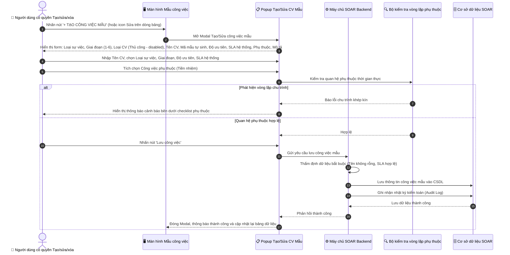
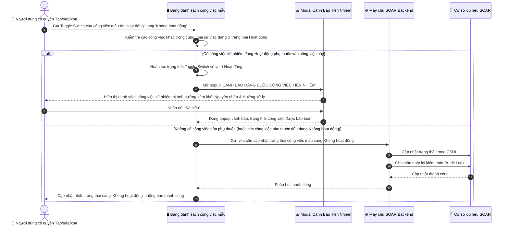
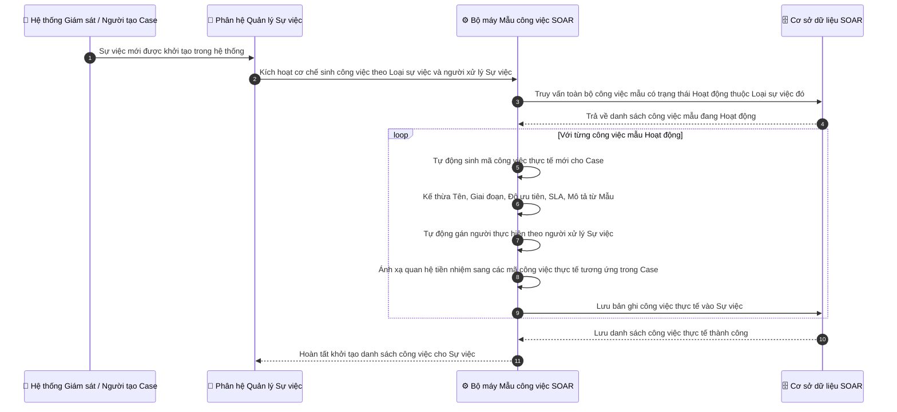

# ĐẶC TẢ YÊU CẦU PHẦN MỀM (SRS)
## TÍNH NĂNG: QUẢN LÝ MẪU CÔNG VIỆC THEO LOẠI SỰ VIỆC (INCIDENT TASK TEMPLATES MANAGEMENT)

---

# 1. THÔNG TIN CHUNG CHỨC NĂNG

| Thuộc tính | Nội dung |
| :--- | :--- |
| **Mã chức năng** | `SOAR_TASK_TEMPLATE_03` |
| **Tên chức năng** | Quản lý mẫu công việc theo loại sự việc (Incident Task Template Management) |
| **Mô tả tổng quan** | Tính năng này cung cấp cho người dùng có quyền quản trị công cụ định nghĩa và chuẩn hóa thư viện các kịch bản công việc ứng cứu sự cố an ninh mạng (Standard Operating Procedures - SOP) phân bổ theo 6 giai đoạn ứng cứu sự cố gồm: Giai đoạn 1: Chuẩn bị, Giai đoạn 2: Phát hiện và phân tích, Giai đoạn 3: Ngăn chặn, Giai đoạn 4: Loại bỏ, Giai đoạn 5: Khôi phục, Giai đoạn 6: Tổng kết rút kinh nghiệm. Mỗi công việc mẫu được cấu hình sẵn Mã mẫu công việc (định dạng chuẩn hóa `MCV...`), Tên công việc, Giai đoạn ứng cứu (1 đến 6), Loại công việc (mặc định cố định là Thủ công), Độ ưu tiên, Gói SLA thời hạn, danh sách Công việc phụ thuộc (Tiền nhiệm) với cơ chế kiểm tra chống vòng lặp chu trình phụ thuộc, và Mô tả công việc chi tiết.  **Hệ thống áp dụng cơ chế quản lý và tự động hóa quy trình như sau:** 1. **Mã mẫu công việc độc lập:** Màn hình này quản lý các công việc mẫu nên sử dụng Mã mẫu công việc (`MCV01`, `MCV02`...). Mã công việc thực tế sẽ được hệ thống tự động sinh ra và gắn với công việc khi nó được tạo thực tế từ Sự việc (Case). 2. **Tự động sinh công việc khi có Sự việc mới:** Khi một Sự việc (Case) mới được tạo, hệ thống sẽ tự động kích hoạt các công việc mẫu đang ở trạng thái Hoạt động thuộc đúng Loại sự việc đó để tự động sinh ra toàn bộ danh sách công việc thực tế gắn vào Sự việc mà không cần người dùng thao tác thủ công. 3. **Kế thừa nhân sự xử lý:** Đơn vị xử lý và người thực hiện của các công việc thực tế được mặc định tự động lấy theo người xử lý Sự việc (Assignee của Case). 4. **Kiểm soát trạng thái Toggle Switch với ràng buộc tiền nhiệm:** Chặn chuyển trạng thái công việc mẫu sang Không hoạt động nếu công việc đó đang là điều kiện tiền nhiệm bắt buộc của các công việc khác đang Hoạt động, hiển thị popup cảnh báo chuyên biệt giải thích rõ nguyên nhân và hướng dẫn xử lý. |
| **Phạm vi tính năng** | - **Bao gồm:** &nbsp;&nbsp;+ Menu điều hướng phân hệ Quản trị: `QUẢN TRỊ` -> `Mẫu công việc`. &nbsp;&nbsp;+ Màn hình Bảng danh sách công việc mẫu: `DANH SÁCH MẪU CÔNG VIỆC THEO LOẠI SỰ VIỆC`. &nbsp;&nbsp;&nbsp;&nbsp;* Thanh công cụ: Ô tìm kiếm tức thời (theo Tên công việc, Mã mẫu công việc, Giai đoạn), Combobox lọc theo Loại sự việc lấy từ danh sách loại sự việc có trong hệ thống, Nút Làm mới dữ liệu, Nút `+ TẠO CÔNG VIỆC MẪU` (hiển thị khi người dùng có quyền Tạo/sửa/xóa mẫu công việc). &nbsp;&nbsp;&nbsp;&nbsp;* Bảng dữ liệu gồm 11 cột: `STT`, `Mã mẫu công việc`, `Tên công việc`, `Loại sự việc`, `Giai đoạn ứng cứu`, `Loại công việc`, `Độ ưu tiên`, `SLA`, `Công việc phụ thuộc`, `Trạng thái (Toggle Switch)`, `Hành động`. &nbsp;&nbsp;&nbsp;&nbsp;* Cột Loại sự việc hiển thị badge chip phân loại trực quan theo từng loại sự việc có trong hệ thống. &nbsp;&nbsp;&nbsp;&nbsp;* Cột Trạng thái sử dụng Toggle Switch (Hoạt động / Không hoạt động) kèm ràng buộc nghiệp vụ tiền nhiệm [BR-09]. &nbsp;&nbsp;&nbsp;&nbsp;* Cột Hành động gồm 3 nút thao tác: Sửa, Nhân bản, Xóa (hiển thị khi người dùng có quyền Tạo/sửa/xóa mẫu công việc). &nbsp;&nbsp;+ Popup Modal Tạo mới / Chỉnh sửa công việc mẫu: &nbsp;&nbsp;&nbsp;&nbsp;* Thuộc Loại sự việc áp dụng (lấy theo danh sách loại sự việc có trong hệ thống). &nbsp;&nbsp;&nbsp;&nbsp;* Giai đoạn ứng cứu (chọn 1 trong 6 giai đoạn). &nbsp;&nbsp;&nbsp;&nbsp;* Loại công việc (mặc định hiển thị Thủ công, bị khóa disabled, giá trị chỉ hiển thị Thủ công). &nbsp;&nbsp;&nbsp;&nbsp;* Tên công việc (placeholder: Nhập tên công việc). &nbsp;&nbsp;&nbsp;&nbsp;* Mã mẫu công việc (hệ thống tự động sinh theo tiền tố `MCV...`, chế độ chỉ đọc). &nbsp;&nbsp;&nbsp;&nbsp;* Độ ưu tiên (Cao, Nghiêm trọng, Trung bình, Thấp). &nbsp;&nbsp;&nbsp;&nbsp;* SLA áp dụng (Thời hạn) (lấy dữ liệu từ danh mục SLA có trong hệ thống để người dùng chọn). &nbsp;&nbsp;&nbsp;&nbsp;* Công việc phụ thuộc (Tiền nhiệm) (danh sách công việc mẫu trong cùng Loại sự việc kèm cơ chế kiểm tra chống chu trình phụ thuộc [BR-03]). &nbsp;&nbsp;&nbsp;&nbsp;* Mô tả công việc (placeholder: Nhập mô tả công việc). &nbsp;&nbsp;+ Popup Modal Cảnh báo Ràng buộc Công việc Tiền nhiệm: &nbsp;&nbsp;&nbsp;&nbsp;* Tiêu đề: `CẢNH BÁO RÀNG BUỘC CÔNG VIỆC TIỀN NHIỆM` (không chứa icon). &nbsp;&nbsp;&nbsp;&nbsp;* Dòng thông báo chính: `Không thể chuyển công việc mẫu [MCV...: Tên công việc] sang trạng thái Không hoạt động!` (không chứa icon). &nbsp;&nbsp;&nbsp;&nbsp;* Danh sách công việc kế nhiệm bị ảnh hưởng hiển thị mã mẫu, tên công việc, giai đoạn và trạng thái Hoạt động. &nbsp;&nbsp;&nbsp;&nbsp;* Khối phân tích tách bạch rõ ràng: Nguyên nhân và Hướng xử lý. &nbsp;&nbsp;&nbsp;&nbsp;* Nút hành động: `Đã hiểu`. &nbsp;&nbsp;+ Popup Modal Xác nhận Xóa công việc mẫu (có kiểm tra ràng buộc tiền nhiệm, chặn xóa nếu có công việc khác phụ thuộc). &nbsp;&nbsp;+ Tính năng Nhân bản công việc mẫu: Tạo bản sao mới với mã hậu tố `_COPY`, trạng thái mặc định Không hoạt động. &nbsp;&nbsp;+ Ghi nhận Nhật ký kiểm toán (Audit Log) toàn bộ thao tác Tạo, Sửa, Nhân bản, Đổi trạng thái, Xóa. - **Không bao gồm:** &nbsp;&nbsp;+ Thao tác phân công nhân sự đích danh trong màn hình mẫu công việc (nhân sự thực hiện được tự động gán theo người xử lý Sự việc khi sinh công việc thực tế). &nbsp;&nbsp;+ Cấu hình danh mục Loại sự việc (sử dụng danh mục có sẵn của hệ thống). |
| **Điều kiện trước** | 1. Người dùng đã đăng nhập vào hệ thống SOAR và có quyền Xem hoặc quyền Tạo/sửa/xóa mẫu công việc. 2. Danh mục Loại sự việc đã được thiết lập sẵn trong hệ thống. 3. Danh mục các gói SLA đang hoạt động đã sẵn sàng trong hệ thống. |
| **Điều kiện sau** | 1. **Khi tạo/sửa công việc mẫu thành công:** Bản ghi công việc mẫu được lưu vào CSDL với mã mẫu `MCV...`, quan hệ phụ thuộc hợp lệ (không có chu trình lặp), sẵn sàng tự động áp dụng khi có Sự việc mới phát sinh. 2. **Khi chuyển đổi Toggle trạng thái:** Trạng thái được cập nhật nếu thỏa mãn ràng buộc tiền nhiệm; nếu vi phạm thì toggle bị hoàn tác và hiển thị popup cảnh báo. 3. **Khi nhân bản công việc mẫu thành công:** Bản ghi mới được tạo với mã `[MÃ_GỐC]_COPY`, tên `Bản sao - [TÊN_GỐC]` ở trạng thái Không hoạt động. 4. **Khi xóa công việc mẫu:** Xóa thành công nếu không có công việc nào khác phụ thuộc vào công việc đó. 5. **Khi có Sự việc mới phát sinh:** Hệ thống tự động quét các công việc mẫu có trạng thái Hoạt động thuộc đúng Loại sự việc của Sự việc đó, sinh ra danh sách công việc thực tế với mã công việc mới và phân công cho người xử lý Sự việc. |
| **Ngoại lệ tổng quan** | 1. Tên công việc mẫu để trống: Bị chặn và báo lỗi yêu cầu nhập. 2. Phát hiện chu trình khép kín trong quan hệ phụ thuộc: Bị chặn theo thuật toán kiểm tra chu trình [BR-03]. 3. Tắt hoạt động công việc mẫu đang là tiền nhiệm của công việc Hoạt động khác: Bị chặn theo [BR-09] và mở popup cảnh báo. 4. Xóa công việc mẫu đang là tiền nhiệm của công việc khác: Bị chặn xóa theo [BR-06]. |

---

# 2. PHÂN QUYỀN CHỨC NĂNG (RBAC)

Hệ thống phân chia tính năng Quản lý mẫu công việc thành các quyền chức năng (Permissions) cụ thể, không gắn cố định vào tên nhóm người dùng:

1. **Quyền Xem mẫu công việc (`VIEW_TASK_TEMPLATE`):**
   - Cho phép người dùng nhìn thấy menu **`Mẫu công việc`** trong phân hệ **QUẢN TRỊ**.
   - Cho phép truy cập màn hình danh sách, sử dụng ô tìm kiếm từ khóa, bộ lọc Loại sự việc và xem chi tiết thông tin các công việc mẫu.
   - Giao diện ở chế độ chỉ xem (View-only): Không hiển thị nút `+ TẠO CÔNG VIỆC MẪU`, không hiển thị các nút icon Sửa (`✏️`), Nhân bản (`📋`), Xóa (`🗑️`), và Toggle switch trạng thái ở chế độ chỉ đọc không cho phép gạt đổi.
2. **Quyền Tạo/sửa/xóa mẫu công việc (`MANAGE_TASK_TEMPLATE`):**
   - Bao gồm toàn bộ phạm vi của quyền Xem mẫu công việc.
   - Hiển thị nút **`+ TẠO CÔNG VIỆC MẪU`** trên thanh công cụ và cho phép mở popup tạo mới công việc mẫu.
   - Hiển thị và cho phép thao tác **Toggle Switch** chuyển đổi trạng thái Hoạt động / Không hoạt động của công việc mẫu (có kiểm tra ràng buộc tiền nhiệm).
   - Hiển thị và cho phép thao tác các nút icon tại cột Hành động:
     + Icon Sửa (`✏️`): Mở popup chỉnh sửa thông tin công việc mẫu.
     + Icon Nhân bản (`📋`): Nhân bản công việc mẫu thành bản sao.
     + Icon Xóa (`🗑️`): Mở popup xác nhận xóa công việc mẫu (có kiểm tra ràng buộc tiền nhiệm).

### Bảng ma trận ánh xạ quyền chức năng và các thành phần giao diện:

| Quyền chức năng | Truy cập Menu Mẫu công việc | Xem danh sách, Tìm kiếm & Lọc | Nút "+ TẠO CÔNG VIỆC MẪU" | Toggle Switch chuyển trạng thái | Icon Sửa (✏️) | Icon Nhân bản (📋) | Icon Xóa (🗑️) |
| :--- | :---: | :---: | :---: | :---: | :---: | :---: | :---: |
| **Xem mẫu công việc** | ✅ Cho phép | ✅ Cho phép | ❌ Ẩn nút | 🔒 Chỉ xem (Không cho đổi) | ❌ Ẩn nút | ❌ Ẩn nút | ❌ Ẩn nút |
| **Tạo/sửa/xóa mẫu công việc** | ✅ Cho phép | ✅ Cho phép | ✅ Hiển thị & Thao tác | ✅ Cho phép bật/tắt (kèm ràng buộc) | ✅ Hiển thị & Thao tác | ✅ Hiển thị & Thao tác | ✅ Hiển thị & Thao tác |

---

# 3. BIỂU ĐỒ LUỒNG XỬ LÝ (SEQUENCE DIAGRAMS)

### 3.1. Sơ đồ tuần tự: Tạo mới / Chỉnh sửa công việc mẫu qua Popup Modal

---

### 3.2. Sơ đồ tuần tự: Chuyển đổi trạng thái Toggle Switch với Kiểm tra Ràng buộc Tiền nhiệm [BR-09]

---

### 3.3. Sơ đồ tuần tự: Tự động khởi tạo công việc thực tế khi phát sinh Sự việc mới (Auto Task Instantiation)

---

# 4. THIẾT KẾ GIAO DIỆN & ĐẶC TẢ CHI TIẾT UI COMPONENTS

### 4.1. Màn hình Danh sách Mẫu công việc theo Loại sự việc (Template Tasks List View)

Toàn bộ các thành phần trên giao diện màn hình danh sách mẫu công việc tại menu `QUẢN TRỊ` -> `Mẫu công việc`:

| STT | Tên trường / Thành phần | Loại dữ liệu / Control | Mô tả chi tiết |
| :---: | :--- | :--- | :--- |
| 1 | **Tiêu đề phân hệ** | Label | - Tiêu đề khu vực chức năng trong phân hệ Quản trị. - **Nội dung hiển thị mặc định:** `Mẫu công việc` (`Task Templates`). - **Tính chất hiển thị:** Tĩnh (Static). - **Hành vi khi nhấn:** Điều hướng người dùng đến màn hình quản lý danh sách mẫu công việc theo loại sự việc. |
| 2 | **Tiêu đề màn hình danh sách** | Label | - Tiêu đề chính của màn hình danh sách mẫu công việc. - **Nội dung hiển thị mặc định:** `DANH SÁCH MẪU CÔNG VIỆC THEO LOẠI SỰ VIỆC` (`INCIDENT TASK TEMPLATES LIST`). - **Tính chất hiển thị:** Tĩnh (Static). |
| 3 | **Số lượng bản ghi** | Label | - Hiển thị tổng số lượng công việc mẫu tương ứng theo bộ lọc hiện tại. - **Nội dung hiển thị:** `Tổng số: {N}` (`Total: {N}`). - **Tính chất hiển thị:** Động (Dynamic - tự động cập nhật số lượng theo kết quả tìm kiếm và bộ lọc). |
| 4 | **Thanh tìm kiếm từ khóa** | Searchbox | - Cho phép người dùng nhập từ khóa để tìm kiếm nhanh các công việc mẫu trong danh sách. - **Placeholder:** &nbsp;&nbsp;+ VI: `Tìm kiếm theo Tên công việc, Mã mẫu công việc, Giai đoạn...` &nbsp;&nbsp;+ EN: `Search by Task Name, Template Task Code, Phase...` - **Giá trị mặc định:** Trống. - **Giới hạn ký tự:** Tối đa 255 ký tự. - **Quy tắc Nghiệp vụ:** &nbsp;&nbsp;1. Tự động trim khoảng trắng ở đầu và cuối chuỗi trước khi kích hoạt tìm kiếm. &nbsp;&nbsp;2. Hệ thống tự động kích hoạt tìm kiếm sau 300ms kể từ khi người dùng ngừng gõ (Debounce) không phân biệt hoa/thường trên các trường: Mã mẫu công việc, Tên công việc, Giai đoạn ứng cứu, Loại sự việc. &nbsp;&nbsp;3. Cho phép nhấp vào biểu tượng "✕" ở góc phải ô nhập để xóa nhanh nội dung tìm kiếm và tự động nạp lại danh sách mặc định. |
| 5 | **Bộ lọc Loại sự việc** | Dropdown | - Cho phép người dùng chọn loại sự việc để lọc danh sách các công việc mẫu tương ứng. - **Nguồn dữ liệu:** Lấy danh sách động từ Danh mục Loại sự việc có trong hệ thống, kèm theo tùy chọn xem tất cả loại sự việc. - **Giá trị mặc định:** Loại sự việc mặc định đầu tiên của hệ thống hoặc Tất cả loại sự việc. - **Chức năng tìm kiếm (Searchable):** Có (cho phép gõ tìm nhanh tên loại sự việc). - **Quy tắc hiển thị:** Không hiển thị biểu tượng cài đặt bên cạnh bộ lọc này. - **Quy tắc Nghiệp vụ & Kích hoạt động:** Khi người dùng thay đổi lựa chọn loại sự việc, hệ thống tự động tải lại bảng dữ liệu tương ứng theo loại sự việc được chọn và cập nhật số đếm tổng số bản ghi. - **Thông báo lỗi tương ứng:** Không có (do luôn có giá trị mặc định). |
| 6 | **Nút "Làm mới dữ liệu"** | Button | - Cho phép người dùng làm mới lại bảng dữ liệu và thiết lập lại các bộ lọc về mặc định. - **Trạng thái mặc định:** Kích hoạt (Enabled). - **Quyền hạn truy cập:** Người dùng có quyền Xem mẫu công việc hoặc quyền Tạo/sửa/xóa mẫu công việc theo Mục 2. - **Hành vi khi nhấn (OnClick Event):** &nbsp;&nbsp;Khi nhấn vào, hệ thống chuyển nút sang trạng thái đang tải (Loading spinner, tạm thời vô hiệu hóa nút để chống click lặp), xóa trắng ô tìm kiếm từ khóa, đặt bộ lọc Loại sự việc về giá trị mặc định, gọi API nạp lại danh sách công việc mẫu: &nbsp;&nbsp;+ Nếu nạp dữ liệu thành công: Cập nhật lại bảng dữ liệu và hiển thị toast message tự động đóng: `"Đã làm mới danh sách mẫu công việc!"` (`"Template tasks list refreshed successfully!"`). &nbsp;&nbsp;+ Nếu nạp dữ liệu thất bại: Hiển thị toast message tự động đóng: `"Không thể làm mới dữ liệu. Vui lòng thử lại!"` (`"Failed to refresh data. Please try again!"`). |
| 7 | **Nút "+ TẠO CÔNG VIỆC MẪU"** | Button | - Cho phép người dùng mở popup để khởi tạo một công việc mẫu mới cho kịch bản quy trình. - **Trạng thái mặc định:** Kích hoạt (Enabled). - **Quyền hạn truy cập:** Chỉ hiển thị đối với người dùng có quyền **Tạo/sửa/xóa mẫu công việc** theo Mục 2. Người dùng chỉ có quyền Xem mẫu công việc sẽ bị ẩn nút này. - **Hành vi khi nhấn (OnClick Event):** &nbsp;&nbsp;Khi nhấn vào, hệ thống mở Popup Modal Tạo mới công việc mẫu (Mục 4.2), điền sẵn Loại sự việc đang chọn ở bộ lọc, tự động sinh Mã mẫu công việc mới theo [BR-01], đặt Loại công việc mặc định là Thủ công, nạp danh sách công việc tiền nhiệm và đặt trắng các trường thông tin còn lại. |
| 8 | **Bảng danh sách công việc mẫu** | Datatable | - Hiển thị danh sách toàn bộ các công việc mẫu thuộc loại sự việc đã chọn dưới dạng bảng dữ liệu có cấu trúc. - **Các chức năng chung bổ trợ:** &nbsp;&nbsp;+ Phân trang (Pagination): Có, hỗ trợ chuyển trang trước/sau và chọn số trang hiển thị. &nbsp;&nbsp;+ Sắp xếp (Sorting): Cho phép nhấp vào tiêu đề các cột Mã mẫu công việc, Tên công việc, Giai đoạn, Độ ưu tiên để sắp xếp tăng/giảm dần. - **Đặc tả chi tiết các cột dữ liệu (Columns):** &nbsp;&nbsp;+ **Cột STT (Số thứ tự):** &nbsp;&nbsp;&nbsp;&nbsp;* Hiển thị số thứ tự tăng dần từ 1 cho các dòng dữ liệu trong bảng theo trang hiển thị. &nbsp;&nbsp;+ **Cột Mã mẫu công việc:** &nbsp;&nbsp;&nbsp;&nbsp;* Hiển thị mã định danh của công việc mẫu do hệ thống tự sinh theo định dạng chuẩn hóa (ví dụ: `MCV01`, `MCV02`... - Xem chi tiết tại [BR-01]). &nbsp;&nbsp;&nbsp;&nbsp;* **Hành vi khi nhấn:** Đối với người dùng có quyền Tạo/sửa/xóa mẫu công việc, khi nhấp vào mã, hệ thống mở Popup Modal Chỉnh sửa công việc mẫu (Mục 4.2) và tải toàn bộ dữ liệu của công việc tương ứng lên form. &nbsp;&nbsp;+ **Cột Tên công việc:** &nbsp;&nbsp;&nbsp;&nbsp;* Dòng trên hiển thị tên đầy đủ của công việc mẫu; dòng dưới hiển thị tóm tắt mô tả nội dung công việc (tự động cắt tỉa nếu vượt độ dài). &nbsp;&nbsp;&nbsp;&nbsp;* **Hành vi khi nhấn:** Đối với người dùng có quyền Tạo/sửa/xóa mẫu công việc, khi nhấp vào tên công việc, hệ thống mở Popup Modal Chỉnh sửa công việc mẫu (Mục 4.2) tương tự như khi nhấp vào mã mẫu. &nbsp;&nbsp;+ **Cột Loại sự việc:** &nbsp;&nbsp;&nbsp;&nbsp;* Hiển thị nhãn loại sự việc tương ứng của công việc mẫu dưới dạng badge nhận diện trực quan phân biệt theo từng loại sự việc có trong hệ thống (như Ransomware, Phishing, DDoS, Data Leak, Web Defacement...). &nbsp;&nbsp;+ **Cột Giai đoạn ứng cứu:** &nbsp;&nbsp;&nbsp;&nbsp;* Hiển thị tên 1 trong 6 giai đoạn ứng cứu sự cố mà công việc mẫu trực thuộc (xem danh sách 6 giai đoạn tại [BR-02]). &nbsp;&nbsp;+ **Cột Loại công việc:** &nbsp;&nbsp;&nbsp;&nbsp;* Hiển thị nhãn cố định: `"Thủ công"` (`"Manual"`). &nbsp;&nbsp;+ **Cột Độ ưu tiên:** &nbsp;&nbsp;&nbsp;&nbsp;* Hiển thị mức độ ưu tiên của công việc mẫu dưới dạng badge phân cấp: `"Nghiêm trọng"` (`"Critical"`), `"Cao"` (`"High"`), `"Trung bình"` (`"Medium"`), `"Thấp"` (`"Low"`). &nbsp;&nbsp;+ **Cột SLA:** &nbsp;&nbsp;&nbsp;&nbsp;* Hiển thị tên gói SLA và thời hạn cam kết hoàn thành công việc tương ứng lấy từ hệ thống (ví dụ: `A05 - 2h`, `SLA2HCCV - 4h`...). &nbsp;&nbsp;+ **Cột Công việc phụ thuộc:** &nbsp;&nbsp;&nbsp;&nbsp;* Hiển thị danh sách mã các công việc tiền nhiệm phải hoàn thành trước (ví dụ: `[MCV03]` hoặc `[MCV07, MCV08]`). Trường hợp công việc độc lập không có tiền nhiệm, hiển thị dấu gạch ngang `-`. &nbsp;&nbsp;+ **Cột Trạng thái (Toggle Switch):** &nbsp;&nbsp;&nbsp;&nbsp;* Cho phép người dùng có quyền Tạo/sửa/xóa mẫu công việc thay đổi nhanh trạng thái Hoạt động / Không hoạt động của công việc mẫu trực tiếp trên bảng. &nbsp;&nbsp;&nbsp;&nbsp;* **Giá trị mặc định:** Lấy theo trạng thái thực tế của công việc mẫu trong CSDL (`Hoạt động` hoặc `Không hoạt động`). &nbsp;&nbsp;&nbsp;&nbsp;* **Quyền hạn truy cập:** Chỉ người dùng có quyền Tạo/sửa/xóa mẫu công việc mới được phép nhấp gạt chuyển đổi. Người dùng chỉ có quyền Xem thì switch hiển thị ở chế độ chỉ đọc (Disabled/Readonly). &nbsp;&nbsp;&nbsp;&nbsp;* **Hành vi khi chuyển đổi trạng thái (OnClick Event):** &nbsp;&nbsp;&nbsp;&nbsp;&nbsp;&nbsp;Khi người dùng nhấp gạt Toggle Switch: &nbsp;&nbsp;&nbsp;&nbsp;&nbsp;&nbsp;. **Trường hợp chuyển từ Hoạt động sang Không hoạt động:** Hệ thống kiểm tra ràng buộc tiền nhiệm theo [BR-09]. Nếu công việc này đang là tiền nhiệm bắt buộc của các công việc khác đang Hoạt động ➔ Hệ thống chặn hành động, lập tức hoàn tác Toggle Switch về trạng thái Hoạt động và mở Popup Modal Cảnh báo Ràng buộc Công việc Tiền nhiệm (Mục 4.3). &nbsp;&nbsp;&nbsp;&nbsp;&nbsp;&nbsp;. **Trường hợp chuyển từ Không hoạt động sang Hoạt động:** Hệ thống kiểm tra theo [BR-09]. Nếu có công việc tiền nhiệm đang Không hoạt động ➔ Hệ thống chặn kích hoạt, hoàn tác Toggle Switch về Không hoạt động và mở Popup cảnh báo. &nbsp;&nbsp;&nbsp;&nbsp;&nbsp;&nbsp;. **Trường hợp thỏa mãn điều kiện:** Hệ thống gửi request cập nhật, nếu thành công hiển thị toast message tự động đóng: `"Cập nhật trạng thái công việc mẫu thành công!"` (`"Template task status updated successfully!"`); nếu thất bại thì hoàn tác switch và hiển thị toast message: `"Cập nhật trạng thái thất bại!"` (`"Failed to update template task status!"`). &nbsp;&nbsp;+ **Cột Hành động:** &nbsp;&nbsp;&nbsp;&nbsp;* Nhóm các icon thao tác trên từng dòng bản ghi. &nbsp;&nbsp;&nbsp;&nbsp;* **Điều kiện hiển thị:** Chỉ hiển thị đối với người dùng có quyền Tạo/sửa/xóa mẫu công việc theo Mục 2. Người dùng chỉ có quyền Xem sẽ bị ẩn toàn bộ cột này. &nbsp;&nbsp;&nbsp;&nbsp;* **Gồm đúng 3 icon thao tác:** &nbsp;&nbsp;&nbsp;&nbsp;&nbsp;&nbsp;. **Icon Chỉnh sửa (Edit ✏️):** Cho phép người dùng mở popup để chỉnh sửa thông tin công việc mẫu. *Hành vi khi nhấn:* Hệ thống mở Popup Modal Chỉnh sửa công việc mẫu (Mục 4.2) và nạp sẵn toàn bộ dữ liệu của bản ghi hiện tại lên form. &nbsp;&nbsp;&nbsp;&nbsp;&nbsp;&nbsp;. **Icon Nhân bản (Clone 📋):** Cho phép người dùng nhân bản công việc mẫu thành một bản ghi mới độc lập. *Hành vi khi nhấn:* Hệ thống tạo một bản ghi sao chép với mã mới có hậu tố `_COPY`, tên có tiền tố `Bản sao -`, trạng thái mặc định là Không hoạt động theo [BR-05], tự động nạp lại bảng dữ liệu và hiển thị toast message: `"Nhân bản công việc mẫu thành công!"` (`"Template task cloned successfully!"`). &nbsp;&nbsp;&nbsp;&nbsp;&nbsp;&nbsp;. **Icon Xóa (Delete 🗑️):** Cho phép người dùng thực hiện xóa công việc mẫu khỏi kịch bản quy trình. *Hành vi khi nhấn:* Hệ thống mở Popup Modal Xác nhận Xóa công việc mẫu (Mục 4.4) có kiểm tra ràng buộc tiền nhiệm an toàn theo [BR-06]. |

---

### 4.2. Popup Modal Tạo mới / Chỉnh sửa công việc mẫu (Create/Edit Modal)

Modal này xuất hiện khi người dùng có quyền Tạo/sửa/xóa mẫu công việc nhấn nút `+ TẠO CÔNG VIỆC MẪU` hoặc nhấn icon Sửa (`✏️`) trên bảng dữ liệu:

| STT | Tên trường / Thành phần | Loại dữ liệu / Control | Mô tả chi tiết |
| :---: | :--- | :--- | :--- |
| 1 | **Tiêu đề Modal** | Label | - Tiêu đề modal hiển thị tên tác vụ tương ứng. - **Nội dung hiển thị mặc định:** &nbsp;&nbsp;+ Khi tạo mới: `"Tạo công việc mẫu mới"` (`"Create New Template Task"`). &nbsp;&nbsp;+ Khi chỉnh sửa: `"Chỉnh sửa công việc mẫu: {Mã_Mẫu}"` (`"Edit Template Task: {Mã_Mẫu}"`). - **Tính chất hiển thị:** Động (Dynamic). |
| 2 | **Nút đóng Modal (Icon "✕")** | Button | - Cho phép người dùng đóng modal mà không lưu thông tin. - **Trạng thái mặc định:** Kích hoạt (Enabled). - **Hành vi khi nhấn (OnClick Event):** Nếu form đã có thay đổi dữ liệu, hệ thống hiển thị Hộp thoại cảnh báo dữ liệu chưa lưu (Mục 4.5); nếu chưa có thay đổi thì đóng modal ngay lập tức. |
| 3 | **Thuộc Loại sự việc áp dụng (*)** | Dropdown | - Cho phép người dùng chọn Loại sự việc an ninh mạng mà công việc mẫu này trực thuộc. - **Nguồn dữ liệu:** Lấy danh sách động từ Danh mục Loại sự việc có trong hệ thống để người dùng lựa chọn. - **Giá trị mặc định:** Lấy theo loại sự việc đang được chọn ở bộ lọc của màn hình danh sách. - **Chức năng tìm kiếm (Searchable):** Có. - **Quy tắc Nghiệp vụ & Kích hoạt động:** Khi người dùng thay đổi loại sự việc, hệ thống tự động sinh lại tiền tố Mã mẫu công việc tương ứng theo [BR-01], đồng thời xóa các lựa chọn tiền nhiệm cũ và nạp lại danh sách công việc mẫu thuộc loại sự việc mới để thiết lập phụ thuộc. - **Thông báo lỗi tương ứng:** Trống và nhấn nút Lưu: Hiển thị lỗi inline màu đỏ ngay dưới trường thông tin: `"Vui lòng chọn loại sự việc áp dụng!"` (`"Please select applicable incident type!"`). |
| 4 | **Giai đoạn ứng cứu (*)** | Dropdown | - Cho phép người dùng chọn giai đoạn ứng cứu sự cố mà công việc mẫu trực thuộc. - **Nguồn dữ liệu:** Danh sách cố định gồm 6 giá trị cụ thể: &nbsp;&nbsp;+ `Giai đoạn 1: Chuẩn bị` (`Phase 1: Preparation`) &nbsp;&nbsp;+ `Giai đoạn 2: Phát hiện và phân tích` (`Phase 2: Detection and Analysis`) &nbsp;&nbsp;+ `Giai đoạn 3: Ngăn chặn` (`Phase 3: Containment`) &nbsp;&nbsp;+ `Giai đoạn 4: Loại bỏ` (`Phase 4: Eradication`) &nbsp;&nbsp;+ `Giai đoạn 5: Khôi phục` (`Phase 5: Recovery`) &nbsp;&nbsp;+ `Giai đoạn 6: Tổng kết rút kinh nghiệm` (`Phase 6: Post-Incident / Lessons Learned`) - **Giá trị mặc định:** `Giai đoạn 1: Chuẩn bị` (khi tạo mới) hoặc giai đoạn hiện tại của công việc (khi chỉnh sửa). - **Chức năng tìm kiếm (Searchable):** Không. - **Thông báo lỗi tương ứng:** Không có (do luôn có giá trị mặc định). |
| 5 | **Loại công việc (*)** | Dropdown | - Hiển thị loại hình thực thi của công việc mẫu trong hệ thống. - **Nguồn dữ liệu:** Duy nhất 1 giá trị: `"Thủ công"` (`"Manual"`). - **Giá trị mặc định:** `"Thủ công"`. - **Trạng thái điều khiển:** Vô hiệu hóa (Disabled - khóa không cho phép người dùng thay đổi). - **Quy tắc Nghiệp vụ:** Toàn bộ công việc mẫu đều áp dụng loại hình thủ công theo [BR-04]. - **Thông báo lỗi tương ứng:** Không có (do luôn có giá trị mặc định và bị khóa). |
| 6 | **Tên công việc (*)** | Textbox | - Người dùng bắt buộc nhập vào tên tiêu chuẩn của công việc mẫu. - **Placeholder:** &nbsp;&nbsp;+ VI: `Nhập tên công việc` &nbsp;&nbsp;+ EN: `Enter task name` - **Giá trị mặc định:** Trống (khi tạo mới) hoặc tên hiện tại của công việc (khi chỉnh sửa). - **Giới hạn ký tự:** Tối đa 255 ký tự. Hành vi khi vượt quá: Hệ thống tự động chặn gõ, không hiển thị phần ký tự vượt quá 255. - **Kiểu ký tự hợp lệ:** Tất cả ký tự hợp lệ bao gồm chữ cái có dấu tiếng Việt, số, khoảng trắng và dấu câu cơ bản. - **Quy tắc Nghiệp vụ:** Tự động trim khoảng trắng ở đầu và cuối chuỗi trước khi lưu dữ liệu. - **Thông báo lỗi tương ứng:** &nbsp;&nbsp;+ Trống và nhấn nút Lưu: Hiển thị lỗi inline màu đỏ ngay dưới trường thông tin: `"Tên công việc là bắt buộc!"` (`"Task name is required!"`). |
| 7 | **Mã mẫu công việc** | Textbox | - Hiển thị mã định danh duy nhất của công việc mẫu trong hệ thống. - **Giá trị mặc định:** Hệ thống tự động sinh theo quy tắc chuẩn hóa `MCV...` (Xem chi tiết tại [BR-01]). - **Trạng thái điều khiển:** Chế độ chỉ đọc (Readonly - người dùng không được chỉnh sửa trực tiếp). - **Quy tắc Nghiệp vụ:** Mã mẫu công việc chỉ sử dụng để định danh mẫu và thiết lập quan hệ phụ thuộc nội bộ kịch bản quy trình. Mã công việc thực tế sẽ do hệ thống tự sinh khi tạo Sự việc. - **Thông báo lỗi tương ứng:** Không có (do hệ thống luôn tự sinh). |
| 8 | **Độ ưu tiên (*)** | Dropdown | - Cho phép người dùng chọn mức độ ưu tiên mặc định của công việc mẫu. - **Nguồn dữ liệu:** Danh sách gồm 4 mức: &nbsp;&nbsp;+ `Cao` (`High`) &nbsp;&nbsp;+ `Nghiêm trọng` (`Critical`) &nbsp;&nbsp;+ `Trung bình` (`Medium`) &nbsp;&nbsp;+ `Thấp` (`Low`) - **Giá trị mặc định:** `"Cao"` (khi tạo mới) hoặc giá trị hiện tại của công việc (khi chỉnh sửa). - **Chức năng tìm kiếm (Searchable):** Không. - **Thông báo lỗi tương ứng:** Không có (do luôn có giá trị mặc định). |
| 9 | **SLA áp dụng (Thời hạn) (*)** | Dropdown | - Cho phép người dùng chọn gói quy tắc SLA làm hạn mức thời gian hoàn thành mặc định cho công việc. - **Nguồn dữ liệu:** Lấy dữ liệu động từ danh mục các gói quy tắc SLA đang hoạt động trong hệ thống để người dùng lựa chọn (không gán cứng giá trị). - **Placeholder:** &nbsp;&nbsp;+ VI: `Chọn gói SLA cam kết` &nbsp;&nbsp;+ EN: `Select committed SLA package` - **Giá trị mặc định:** Gói SLA mặc định đầu tiên của hệ thống hoặc gói SLA hiện tại của công việc. - **Chức năng tìm kiếm (Searchable):** Có. - **Thông báo lỗi tương ứng:** Trống và nhấn nút Lưu: Hiển thị lỗi inline màu đỏ ngay dưới trường thông tin: `"Vui lòng chọn gói SLA áp dụng!"` (`"Please select applicable SLA package!"`). |
| 10 | **Công việc phụ thuộc (Tiền nhiệm)** | Checklist Container | - Cho phép người dùng chọn các công việc mẫu tiền nhiệm phải hoàn thành trước công việc này (quan hệ Finish-to-Start). - **Nguồn dữ liệu:** Danh sách toàn bộ các công việc mẫu khác trong cùng Loại sự việc (tự động loại trừ chính công việc đang chỉnh sửa). - **Giá trị mặc định:** Không chọn (công việc độc lập) hoặc danh sách mã tiền nhiệm hiện tại. - **Cách thức chọn:** Người dùng tích chọn hộp kiểm (Checkbox) trước mã và tên công việc tiền nhiệm. - **Quy tắc Nghiệp vụ & Kiểm tra chu trình:** Mỗi khi người dùng tích chọn một công việc, hệ thống tự động chạy thuật toán kiểm tra chống vòng lặp phụ thuộc khép kín theo [BR-03]. Nếu phát hiện chu trình (ví dụ: A phụ thuộc B và B phụ thuộc ngược lại A), hệ thống lập tức hiển thị cảnh báo đỏ bên dưới danh sách và vô hiệu hóa nút Lưu. - **Thông báo lỗi tương ứng:** Vi phạm vòng lặp chu trình: Hiển thị cảnh báo: `"Phát hiện vòng lặp chu trình! Không thể chọn công việc này vì sẽ tạo thành vòng lặp phụ thuộc khép kín."` (`"Circular dependency detected! Cannot select this task as it creates a closed dependency loop."`). |
| 11 | **Mô tả công việc** | Textarea | - Cho phép người dùng nhập nội dung hướng dẫn thao tác kỹ thuật, các bước xử lý chi tiết (SOP Playbook) cho công việc mẫu. - **Placeholder:** &nbsp;&nbsp;+ VI: `Nhập mô tả công việc` &nbsp;&nbsp;+ EN: `Enter task description` - **Giá trị mặc định:** Trống (khi tạo mới) hoặc nội dung mô tả hiện tại (khi chỉnh sửa). - **Giới hạn ký tự:** Tối đa 5000 ký tự. Hành vi khi vượt quá: Hệ thống tự động chặn gõ thêm ký tự vượt quá 5000. - **Kiểu ký tự hợp lệ:** Tất cả các ký tự văn bản, cho phép xuống dòng và định dạng văn bản kỹ thuật. - **Quy tắc Nghiệp vụ:** Tự động trim khoảng trắng ở đầu và cuối chuỗi trước khi lưu. - **Thông báo lỗi tương ứng:** Không có (trường tùy chọn không bắt buộc). |
| 12 | **Nút "Hủy bỏ"** | Button | - Cho phép người dùng hủy bỏ thao tác tạo mới hoặc chỉnh sửa công việc mẫu và đóng modal. - **Trạng thái mặc định:** Kích hoạt (Enabled). - **Quyền hạn truy cập:** Người dùng có quyền Tạo/sửa/xóa mẫu công việc theo Mục 2. - **Hành vi khi nhấn (OnClick Event):** Nếu form đã có thay đổi dữ liệu, hệ thống hiển thị Hộp thoại cảnh báo dữ liệu chưa lưu (Mục 4.5); nếu chưa có thay đổi thì đóng modal ngay lập tức và giữ nguyên dữ liệu trên màn hình danh sách. |
| 13 | **Nút "Lưu công việc"** | Button | - Cho phép người dùng thẩm định và lưu thông tin công việc mẫu vào hệ thống. - **Trạng thái mặc định:** Kích hoạt (Enabled). - **Quyền hạn truy cập:** Người dùng có quyền Tạo/sửa/xóa mẫu công việc theo Mục 2. - **Hành vi khi nhấn (OnClick Event):** &nbsp;&nbsp;Khi nhấn vào thì hệ thống sẽ kiểm tra thông tin người dùng nhập: &nbsp;&nbsp;+ Thông tin không hợp lệ (Tên công việc để trống hoặc vi phạm vòng lặp phụ thuộc): Hiển thị thông báo lỗi inline tương ứng dưới từng trường và chặn gửi request. &nbsp;&nbsp;+ Thông tin hợp lệ: Hệ thống chuyển nút sang trạng thái Loading (spinner, disable nút để chống click đúp), gửi request lưu công việc mẫu: &nbsp;&nbsp;&nbsp;&nbsp;. Nếu lưu thành công: Đóng modal, cập nhật lại bảng danh sách công việc mẫu và hiển thị toast message tự động đóng: `"Lưu công việc mẫu thành công!"` (`"Template task saved successfully!"`). &nbsp;&nbsp;&nbsp;&nbsp;. Nếu lưu không thành công: Hiển thị toast message tự động đóng: `"Lưu công việc mẫu thất bại. Vui lòng thử lại!"` (`"Failed to save template task. Please try again!"`), mở khóa nút để người dùng chỉnh sửa. |

---

### 4.3. Popup Modal Cảnh báo Ràng buộc Công việc Tiền nhiệm (Predecessor Warning Modal)

Modal này tự động hiển thị khi người dùng gạt tắt Toggle Switch của một công việc mẫu đang là tiền nhiệm bắt buộc của các công việc khác đang Hoạt động:

- **Tên Modal:** Cảnh báo ràng buộc công việc tiền nhiệm
- **Tiêu đề (Header):** `"CẢNH BÁO RÀNG BUỘC CÔNG VIỆC TIỀN NHIỆM"` (`"PREDECESSOR TASK DEPENDENCY WARNING"`) (không chứa icon cảnh báo).
- **Thông báo chính:** `"Không thể chuyển công việc mẫu [Mã: Tên công việc] sang trạng thái Không hoạt động!"` (`"Cannot change template task [Code: Name] to Inactive status!"`) (không chứa icon chặn/dừng).
- **Khối Danh sách công việc bị ảnh hưởng:**
  - Tiêu đề phụ: `DANH SÁCH CÔNG VIỆC KẾ NHIỆM BỊ ẢNH HƯỞNG:` (`AFFECTED SUCCESSOR TASKS:`)
  - Danh sách hiển thị các thẻ ngang gồm: Mã công việc mẫu, Tên công việc, Giai đoạn ứng cứu và nhãn trạng thái `Hoạt động`.
- **Khối Phân tích Nguyên nhân & Hướng xử lý:**
  - **Nguyên nhân:** `"Công việc này là điều kiện tiền nhiệm bắt buộc trong mẫu quy trình. Nếu tắt hoạt động, chuỗi liên kết sẽ bị đứt gãy và các công việc kế nhiệm sẽ bị treo khi sinh Sự việc mới."` (`"This task is a mandatory predecessor in the workflow template. Deactivating it breaks the dependency chain and causes successor tasks to stall during case creation."`)
  - **Hướng xử lý:** `"Vui lòng chuyển trạng thái các công việc kế nhiệm sang "Không hoạt động" hoặc gỡ bỏ ràng buộc phụ thuộc tại các công việc đó trước khi tắt công việc này."` (`"Please set the successor tasks to "Inactive" or remove their dependencies before deactivating this task."`)
- **Nút Xác nhận (Confirm Button):**
  - Nhãn nút: `"Đã hiểu"` (`"Understood"`)
  - Hành vi khi nhấn: Đóng modal cảnh báo, giữ nguyên Toggle Switch ở trạng thái Hoạt động.
- **Hành vi khi click vùng ngoài Modal:** Không đóng hộp thoại cảnh báo.

---

### 4.4. Popup Modal Xác nhận Xóa công việc mẫu (Delete Confirmation Modal)

- **Tên Modal:** Hộp thoại xác nhận xóa công việc mẫu
- **Tiêu đề (Header):** `"Xác nhận xóa công việc mẫu"` (`"Confirm deletion of template task"`)
- **Nội dung thông báo (Body text):**
  - *Trường hợp có công việc khác đang phụ thuộc:* `"Công việc [Mã: Tên] đang là điều kiện tiền nhiệm bắt buộc của các công việc khác trong mẫu. Vui lòng gỡ bỏ liên kết phụ thuộc trước khi xóa."` (`"Task [Code: Name] is a required predecessor for other tasks in the template. Please remove the dependencies before deleting."`). Ẩn nút Xác nhận xóa.
  - *Trường hợp không có ràng buộc:* `"Bạn có chắc chắn muốn xóa công việc mẫu [Mã: Tên] khỏi kịch bản quy trình không? Thao tác này sẽ không thể hoàn tác."` (`"Are you sure you want to delete template task [Code: Name] from the workflow template? This action cannot be undone."`)
- **Nút Xác nhận (Confirm Button):**
  - Nhãn nút: `"Xác nhận xóa"` (`"Confirm Delete"`)
  - Quyền hạn truy cập: Người dùng có quyền Tạo/sửa/xóa mẫu công việc theo Mục 2.
  - Hành vi khi nhấn: Chuyển nút sang trạng thái Loading, gọi API xóa công việc mẫu khỏi CSDL. Nếu thành công, đóng modal, nạp lại bảng dữ liệu và hiển thị toast message: `"Đã xóa công việc mẫu thành công!"` (`"Template task deleted successfully!"`). Nếu thất bại, hiển thị toast message: `"Xóa công việc mẫu thất bại!"` (`"Failed to delete template task!"`).
- **Nút Hủy (Cancel Button):**
  - Nhãn nút: `"Hủy bỏ"` (`"Cancel"`) hoặc click icon `✕`.
  - Hành vi khi nhấn: Đóng modal, không thực hiện hành động xóa.
- **Hành vi khi click vùng ngoài Modal:** Không đóng hộp thoại.

---

### 4.5. Popup Modal Cảnh báo Dữ liệu Chưa Lưu khi Thoát Form (Unsaved Changes Modal)

- **Tên Modal:** Cảnh báo dữ liệu form chưa được lưu
- **Tiêu đề (Header):** `"Thông tin chưa được lưu"` (`"Unsaved changes"`)
- **Nội dung thông báo (Body text):** `"Thông tin công việc mẫu bạn vừa nhập chưa được lưu lại. Bạn có chắc chắn muốn thoát và hủy bỏ các thay đổi này không?"` (`"The template task information you entered has not been saved. Are you sure you want to exit and discard these changes?"`)
- **Nút Xác nhận thoát (Confirm Button):**
  - Nhãn nút: `"Thoát không lưu"` (`"Exit without saving"`)
  - Hành vi khi nhấn: Đóng modal cảnh báo, đồng thời đóng Popup Modal Tạo mới / Chỉnh sửa công việc mẫu và không lưu thay đổi.
- **Nút Hủy/Giữ lại (Cancel Button):**
  - Nhãn nút: `"Giữ lại"` (`"Keep editing"`)
  - Hành vi khi nhấn: Đóng modal cảnh báo, giữ nguyên dữ liệu trên form để người dùng tiếp tục chỉnh sửa.
- **Hành vi khi click vùng ngoài Modal:** Không đóng hộp thoại cảnh báo.

---

### 4.6. Đặc tả các trạng thái màn hình bổ trợ (Screen UX States)

#### 4.6.1. Trạng thái danh sách rỗng (Empty State)
- **Điều kiện kích hoạt:** Khi Loại sự việc được chọn chưa có bất kỳ công việc mẫu nào được định nghĩa trong hệ thống.
- **Hình ảnh minh họa:** Icon tài liệu quy trình rỗng.
- **Tiêu đề chính:** `"Chưa có công việc mẫu nào"` (`"No template tasks found"`)
- **Mô tả phụ:** `"Bắt đầu bằng cách tạo công việc mẫu đầu tiên cho loại sự việc này để chuẩn hóa quy trình ứng cứu sự cố."` (`"Get started by creating the first template task for this incident category to standardize response workflows."`)
- **Nút hành động (CTA Button):** Nút `"+ TẠO CÔNG VIỆC MẪU"` (`"+ Create Template Task"`) - nhấn mở Popup Tạo mới công việc mẫu (chỉ hiển thị đối với người dùng có quyền Tạo/sửa/xóa mẫu công việc theo Mục 2).

#### 4.6.2. Trạng thái tìm kiếm không có kết quả (Search Zero Results)
- **Điều kiện kích hoạt:** Khi người dùng nhập từ khóa tìm kiếm hoặc lọc theo điều kiện mà không có bản ghi công việc mẫu nào khớp.
- **Hình ảnh minh họa:** Icon kính lúp không tìm thấy kết quả.
- **Tiêu đề chính:** `"Không tìm thấy công việc mẫu nào"` (`"No matching template tasks"`)
- **Mô tả phụ:** `"Không có công việc mẫu nào phù hợp với từ khóa tìm kiếm hoặc điều kiện lọc hiện tại."` (`"No template tasks match the current search keyword or filter criteria."`)
- **Nút hành động:** Nút `"Xóa bộ lọc"` (`"Clear Filters"`) - nhấn để đặt lại từ khóa tìm kiếm về trống và nạp lại danh sách đầy đủ.

#### 4.6.3. Trạng thái lỗi tải dữ liệu (Error / Offline State)
- **Điều kiện kích hoạt:** Khi kết nối mạng bị gián đoạn hoặc API máy chủ trả về lỗi không thể lấy danh sách công việc mẫu.
- **Tiêu đề chính:** `"Không thể tải danh sách mẫu công việc"` (`"Failed to load template tasks"`)
- **Mô tả phụ:** `"Đã xảy ra lỗi khi kết nối đến máy chủ. Vui lòng kiểm tra lại đường truyền mạng và thử lại."` (`"An error occurred while connecting to the server. Please check your network connection and try again."`)
- **Nút hành động:** Nút `"Tải lại"` (`"Retry"`) - nhấn để kích hoạt lại API lấy dữ liệu.

---

# 5. QUY TẮC NGHIỆP VỤ CHUYÊN SÂU (BUSINESS RULES)

### Bảng tổng hợp mã quy tắc nghiệp vụ:

| Mã quy tắc | Tên quy tắc nghiệp vụ | Phân nhóm | Phạm vi áp dụng |
| :---: | :--- | :--- | :--- |
| **[BR-01]** | Quy tắc đặt mã mẫu công việc (`MCV...`) và phân loại theo Loại sự việc | Ràng buộc dữ liệu | Mã định danh mẫu công việc |
| **[BR-02]** | Quy chuẩn phân loại công việc theo 6 giai đoạn ứng cứu sự cố | Ràng buộc dữ liệu | Giai đoạn ứng cứu |
| **[BR-03]** | Thuật toán kiểm tra chống vòng lặp phụ thuộc giữa các công việc mẫu | Thuật toán đồ thị | Quan hệ tiền nhiệm |
| **[BR-04]** | Ràng buộc Loại công việc (Thủ công cố định) và Gói SLA hệ thống | Ràng buộc dữ liệu | Popup Tạo/Sửa CV Mẫu |
| **[BR-05]** | Cơ chế Nhân bản công việc mẫu (Clone Task) | Vòng đời dữ liệu | Tác vụ Nhân bản |
| **[BR-06]** | Ràng buộc an toàn khi Xóa công việc mẫu | Ràng buộc dữ liệu | Tác vụ Xóa |
| **[BR-07]** | Cơ chế Tự động sinh công việc thực tế khi Khởi tạo Sự việc | Tích hợp tự động hóa | Khởi tạo Sự việc mới |
| **[BR-08]** | Quy chuẩn ghi nhận Nhật ký kiểm toán (Audit Logging) | Bảo mật & Kiểm toán | Toàn bộ phân hệ Mẫu |
| **[BR-09]** | **Quy tắc ràng buộc kiểm soát trạng thái Toggle Switch công việc mẫu** | **Ràng buộc nghiệp vụ & UX** | **Toggle Switch trạng thái** |

---

### [BR-01] Quy tắc đặt mã mẫu công việc (`MCV...`) và phân loại theo Loại sự việc
1. Sử dụng tiền tố chuẩn hóa **`MCV`** (viết tắt của **Mẫu Công Việc**) để phân biệt hoàn toàn với mã công việc thực tế được sinh ra trong Sự việc (mã công việc thực tế được sinh tự động khi tạo Sự việc).
2. Định dạng mã mẫu công việc tự sinh theo mẫu: `MCV{SỐ_THỨ_TỰ}` (ví dụ: `MCV01`, `MCV02`...) hoặc phân loại theo tiền tố loại sự việc có trong hệ thống (ví dụ: `MCV_PH01`, `MCV_DDOS_01`...).
3. Mã mẫu công việc do hệ thống tự sinh, hiển thị ở chế độ chỉ đọc, là duy nhất trong cùng Loại sự việc để phục vụ thiết lập quan hệ phụ thuộc tiền nhiệm.

---

### [BR-02] Quy chuẩn phân loại công việc theo 6 giai đoạn ứng cứu sự cố
1. Mọi công việc mẫu bắt buộc phải trực thuộc đúng một trong 6 giai đoạn ứng cứu sự cố gồm:
   - Giai đoạn 1: Chuẩn bị
   - Giai đoạn 2: Phát hiện và phân tích
   - Giai đoạn 3: Ngăn chặn
   - Giai đoạn 4: Loại bỏ
   - Giai đoạn 5: Khôi phục
   - Giai đoạn 6: Tổng kết rút kinh nghiệm
2. Trong popup tạo mới / chỉnh sửa, combobox giai đoạn ứng cứu cho phép người dùng lựa chọn chuyển đổi linh hoạt giữa 6 giai đoạn này.

---

### [BR-03] Thuật toán kiểm tra chống vòng lặp phụ thuộc giữa các công việc mẫu
1. Quan hệ phụ thuộc trong mẫu là quan hệ Finish-to-Start: Công việc tiền nhiệm (Predecessor) phải hoàn thành trước khi công việc kế nhiệm (Successor) được bắt đầu.
2. Hệ thống mô hình hóa mạng lưới công việc trong cùng một Loại sự việc thành đồ thị có hướng $G = (V, E)$.
3. Áp dụng thuật toán duyệt đồ thị (DFS) để kiểm tra chu trình khép kín:
   - Khi người dùng tích chọn một công việc tiền nhiệm trong popup, hệ thống kiểm tra xem việc bổ sung liên kết đó có tạo thành đường đi quay ngược lại chính công việc đó hay không.
   - Nếu phát hiện chu trình (ví dụ: `MCV03 -> MCV04 -> MCV03`): Hệ thống lập tức hiển thị cảnh báo lỗi và từ chối cho phép lưu công việc.

---

### [BR-04] Ràng buộc Loại công việc (Thủ công cố định) và Gói SLA hệ thống
1. **Loại công việc:**
   - Cố định là `Thủ công`.
   - Combobox Loại công việc trên popup bị khóa (disabled), giá trị chỉ hiển thị duy nhất là `Thủ công`. Toàn bộ công việc mẫu được tạo đều mang thuộc tính loại công việc là Thủ công.
2. **Gói SLA áp dụng:**
   - Lấy dữ liệu từ danh mục các gói quy tắc SLA đang có trong hệ thống để người dùng lựa chọn (không gán cứng giá trị cố định trong phần mềm).
3. **Đơn vị xử lý & Người thực hiện:**
   - Không cấu hình trong mẫu công việc. Thông tin nhân sự xử lý sẽ được hệ thống tự động gán theo người xử lý Sự việc khi công việc thực tế được sinh ra trong Case.

---

### [BR-05] Cơ chế Nhân bản công việc mẫu (Clone Task)
1. Khi người dùng có quyền thực hiện nhân bản công việc mẫu:
   - Mã mới: `[MÃ_GỐC]_COPY` (ví dụ: `MCV03_COPY`).
   - Tên mới: `Bản sao - [TÊN_GỐC]`.
   - Trạng thái: Mặc định đặt là `Không hoạt động` để người dùng rà soát nội dung trước khi đưa vào áp dụng.
2. Ghi nhận sự kiện nhân bản vào nhật ký kiểm toán hệ thống.

---

### [BR-06] Ràng buộc an toàn khi Xóa công việc mẫu
1. Khi người dùng thực hiện xóa một công việc mẫu, hệ thống kiểm tra xem công việc này có đang là tiền nhiệm của bất kỳ công việc nào khác trong cùng Loại sự việc hay không.
2. Nếu có công việc khác đang phụ thuộc vào công việc này: Hệ thống chặn hành động xóa và hiển thị thông báo yêu cầu gỡ bỏ liên kết phụ thuộc trước khi xóa.
3. Nếu không có công việc nào phụ thuộc: Cho phép xác nhận xóa công việc mẫu khỏi CSDL.

---

### [BR-07] Cơ chế Tự động sinh công việc thực tế khi Khởi tạo Sự việc
1. Khi có bất kỳ Sự việc (Case) mới nào được tạo trong hệ thống SOAR:
   - Hệ thống tự động quét toàn bộ các công việc mẫu có trạng thái Hoạt động (`isActive = true`) thuộc đúng Loại sự việc của Sự việc đó.
   - Tự động sinh danh sách công việc thực tế gắn vào Sự việc:
     * Tự động sinh mã công việc thực tế mới cho Sự việc.
     * Kế thừa Tên công việc, Giai đoạn ứng cứu, Độ ưu tiên, SLA, Mô tả từ Mẫu công việc.
     * Tự động gán người thực hiện theo người xử lý Sự việc (Assignee của Case).
     * Ánh xạ chính xác các quan hệ phụ thuộc tiền nhiệm sang các mã công việc thực tế tương ứng trong Sự việc.

---

### [BR-08] Quy chuẩn ghi nhận Nhật ký kiểm toán (Audit Logging)
Mọi thao tác Tạo mới, Chỉnh sửa, Nhân bản, Bật/Tắt Toggle trạng thái và Xóa công việc mẫu đều được tự động lưu vết vào nhật ký kiểm toán với đầy đủ: Thời gian thực hiện, Tài khoản thực hiện, Loại hành động, Mã công việc mẫu bị tác động và Chi tiết nội dung thay đổi.

---

### [BR-09] Quy tắc ràng buộc kiểm soát trạng thái Toggle Switch công việc mẫu
- **Phân loại:** Ràng buộc nghiệp vụ & Trải nghiệm người dùng.
- **Phạm vi áp dụng:** Cột Trạng thái (Toggle Switch) trên bảng danh sách mẫu công việc.
- **Bối cảnh & Mục đích:** Đảm bảo tính toàn vẹn của chuỗi quy trình phụ thuộc. Tránh tình huống một công việc đang Hoạt động lại bị phụ thuộc vào một công việc ở trạng thái Không hoạt động, gây lỗi gián đoạn quy trình khi tự động sinh việc cho Sự việc.
- **Logic kiểm tra chi tiết:**

#### 1. Ràng buộc khi chuyển từ "Hoạt động" sang "Không hoạt động" (Tắt Toggle Switch):
- Khi người dùng gạt tắt công việc mẫu $A$:
- Hệ thống kiểm tra toàn bộ các công việc mẫu khác trong cùng Loại sự việc thỏa mãn đồng thời 2 điều kiện:
  1. Đang ở trạng thái **Hoạt động**.
  2. Có khai báo công việc $A$ trong danh sách công việc phụ thuộc (tiền nhiệm).
- **Quy tắc xử lý:**
  - Nếu tìm thấy ít nhất $\ge 1$ công việc kế nhiệm đang Hoạt động:
    * Hệ thống lập tức chặn hành động chuyển trạng thái.
    * Tự động hoàn tác trạng thái Toggle Switch về vị trí **Hoạt động**.
    * Mở Popup Modal **`CẢNH BÁO RÀNG BUỘC CÔNG VIỆC TIỀN NHIỆM`** (Mục 4.3).
    * Hiển thị danh sách các công việc kế nhiệm đang Hoạt động bị ảnh hưởng.
    * Giải thích nguyên nhân và hướng dẫn người dùng chuyển trạng thái các công việc kế nhiệm sang *"Không hoạt động"* hoặc gỡ bỏ ràng buộc tiền nhiệm tại các công việc đó trước khi tắt công việc $A$.
  - Nếu không có công việc nào phụ thuộc (hoặc toàn bộ các công việc phụ thuộc đều đã ở trạng thái Không hoạt động):
    * Cho phép chuyển trạng thái $A$ sang **Không hoạt động** thành công.

#### 2. Ràng buộc khi chuyển từ "Không hoạt động" sang "Hoạt động" (Bật Toggle Switch):
- Khi người dùng gạt bật công việc mẫu $B$:
- Hệ thống kiểm tra danh sách các công việc tiền nhiệm của $B$:
- Nếu tồn tại ít nhất $\ge 1$ công việc tiền nhiệm đang ở trạng thái **Không hoạt động**:
  * Hệ thống lập tức chặn hành động kích hoạt.
  * Tự động hoàn tác trạng thái Toggle Switch về vị trí **Không hoạt động**.
  * Mở Popup Modal cảnh báo, liệt kê các công việc tiền nhiệm đang Không hoạt động và hướng dẫn người dùng kích hoạt các công việc tiền nhiệm trước.
- Nếu toàn bộ công việc tiền nhiệm đều đã Hoạt động (hoặc $B$ không có tiền nhiệm):
  * Cho phép chuyển trạng thái $B$ sang **Hoạt động** thành công.
