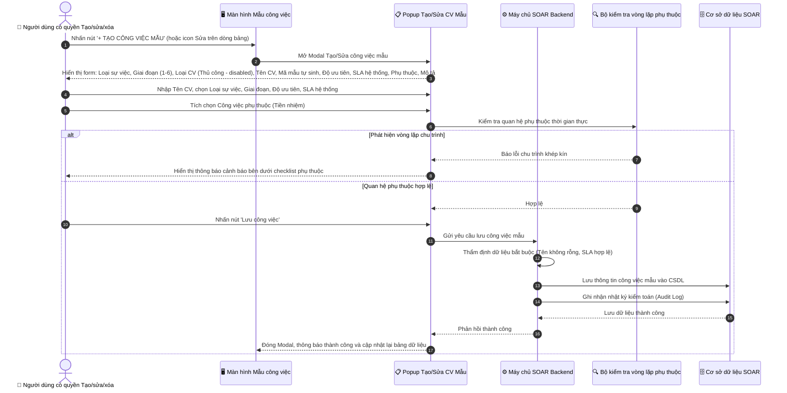
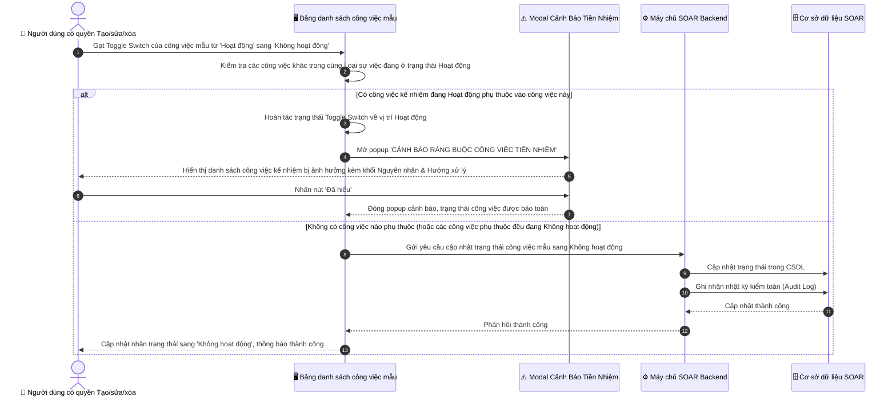
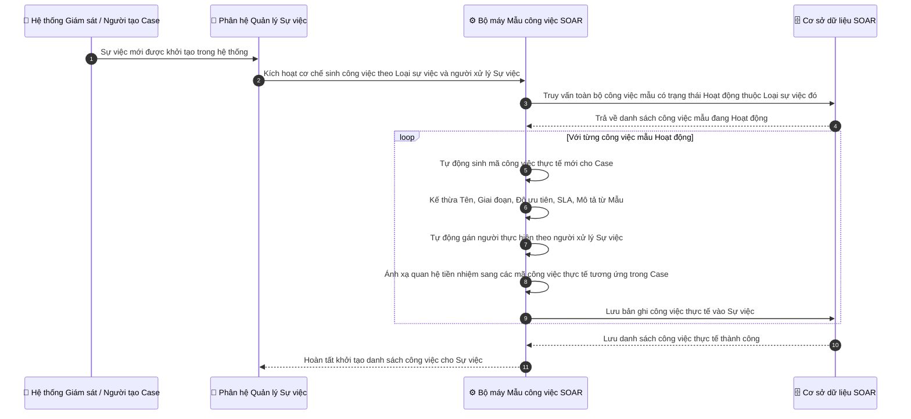
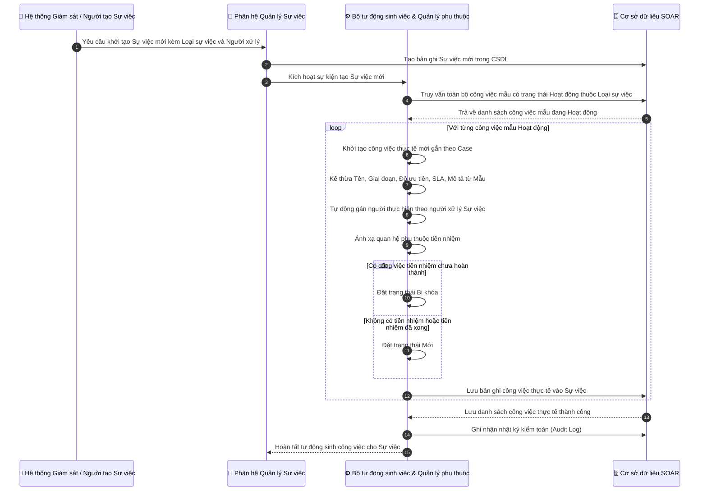
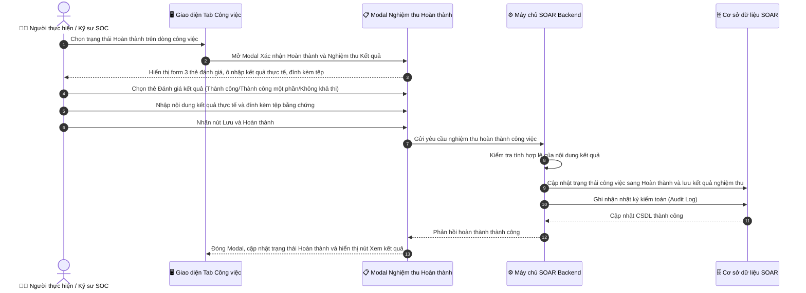
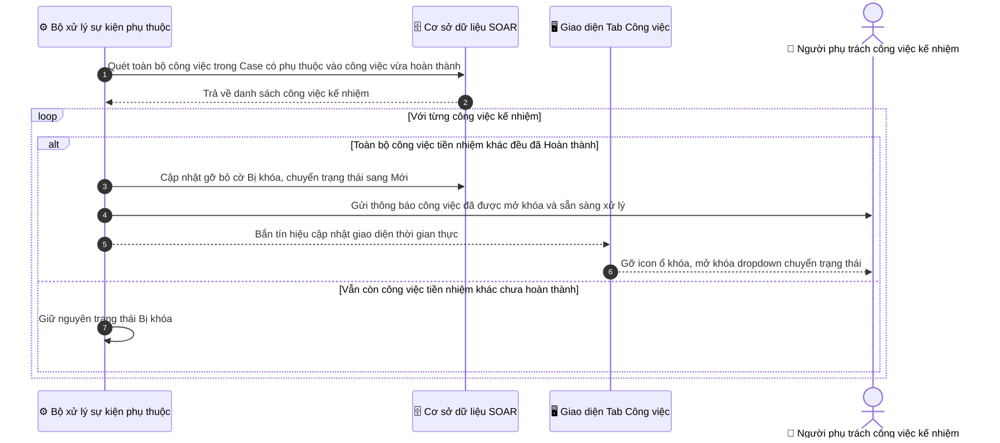
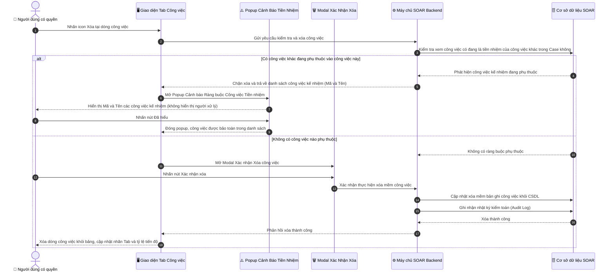
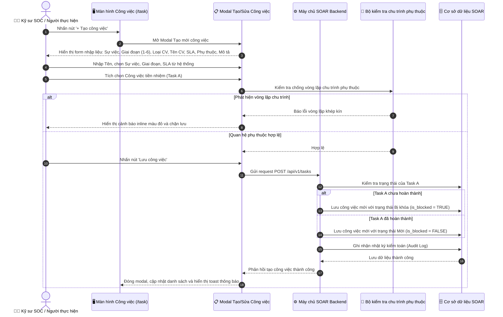
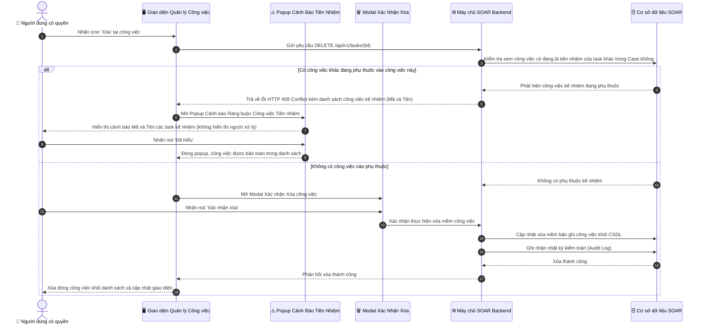

# ĐẶC TẢ YÊU CẦU PHẦN MỀM (SRS TỔNG HỢP)
# HỆ THỐNG QUẢN LÝ VÀ ĐIỀU PHỐI CÔNG VIỆC ỨNG CỨU SỰ CỐ (INCIDENT TASK MANAGEMENT SYSTEM)

---

# MỤC LỤC TỔNG THỂ VÀ CẤU TRÚC TÀI LIỆU

Tài liệu này là bản đặc tả yêu cầu phần mềm tổng hợp toàn diện (Consolidated Software Requirements Specification - SRS), hợp nhất toàn bộ 3 phân hệ chức năng cấu thành giải pháp quản lý, điều phối và thực thi công việc ứng cứu sự cố an ninh mạng trong hệ thống SOAR:

1. **[PHẦN I: QUẢN LÝ MẪU CÔNG VIỆC THEO LOẠI SỰ VIỆC (INCIDENT TASK TEMPLATES MANAGEMENT)](#phan-i-quan-ly-mau-cong-viec-theo-loai-su-viec-incident-task-templates-management)**
   - **Mã chức năng:** `SOAR_TASK_TEMPLATE_03`
   - Quản trị thư viện kịch bản quy trình (SOP) công việc mẫu theo Loại sự việc.
   - Điều khiển trạng thái Toggle Switch từng công việc mẫu với cơ chế kiểm tra ràng buộc tiền nhiệm.
   - Cơ chế tự động sinh danh sách công việc thực tế khi phát sinh Sự việc mới.
   - Thiết lập phụ thuộc với thuật toán kiểm tra chống vòng lặp chu trình.

2. **[PHẦN II: QUẢN LÝ & ĐIỀU PHỐI CÔNG VIỆC ỨNG CỨU TRONG SỰ VIỆC (INCIDENT TASK MANAGEMENT INSIDE CASE)](#phan-ii-quan-ly--dieu-phoi-cong-viec-ung-cuu-trong-su-viec-incident-task-management-inside-case)**
   - **Mã chức năng:** `SOAR_CASE_TASK_MGMT_01`
   - Nâng cấp Tab "CÔNG VIỆC" trong chi tiết Sự việc (`/case`) thành trung tâm điều phối trực chiến.
   - Đo lường chỉ số tiến độ tổng thể và phân bổ công việc theo 6 giai đoạn ứng cứu sự cố.
   - Cơ chế khóa trạng thái phụ thuộc (`Bị khóa`) và tự động mở khóa (Auto-Unblock) kèm thông báo.
   - Modal Nghiệm thu hoàn thành công việc theo 3 thẻ hiện đại, lưu kết quả thực tế và file bằng chứng.
   - Popup cảnh báo chặn xóa an toàn (chỉ hiển thị Mã và Tên, không hiển thị người xử lý).

3. **[PHẦN III: QUẢN LÝ CHI TIẾT CÔNG VIỆC VÀ FORM TẠO/SỬA/HOÀN THÀNH CÔNG VIỆC (TASK LIFECYCLE & CRUD MANAGEMENT)](#phan-iii-quan-ly-chi-tiet-cong-viec-va-form-taosuahoan-thanh-cong-viec-task-lifecycle--crud-management)**
   - **Mã chức năng:** `SOAR_TASK_CRUD_MGMT_02`
   - Nâng cấp màn hình danh sách Quản lý Công việc (`/task`) và Drawer chi tiết công việc.
   - Đặc tả chi tiết các UI Components mới: Badge 6 giai đoạn, Badge Bị khóa, Dropdown kiểm soát khóa, Khối phụ thuộc 2 chiều (tiền nhiệm/kế nhiệm), Khối kết quả thực hiện.
   - Form Modal Tạo mới / Chỉnh sửa công việc đầy đủ thông tin chuẩn hóa.
   - Modal Xác nhận Hoàn thành và các Modal nghiệp vụ theo tiêu chuẩn `srs_ui_spec_writer`.

---

# PHẦN I: QUẢN LÝ MẪU CÔNG VIỆC THEO LOẠI SỰ VIỆC (INCIDENT TASK TEMPLATES MANAGEMENT)
*(Mã chức năng: `SOAR_TASK_TEMPLATE_03`)*

---

## I. 1. THÔNG TIN CHUNG CHỨC NĂNG

| Thuộc tính | Nội dung |
| :--- | :--- |
| **Mã chức năng** | `SOAR_TASK_TEMPLATE_03` |
| **Tên chức năng** | Quản lý mẫu công việc theo loại sự việc (Incident Task Template Management) |
| **Mô tả tổng quan** | Tính năng này cung cấp cho người dùng có quyền quản trị công cụ định nghĩa và chuẩn hóa thư viện các kịch bản công việc ứng cứu sự cố an ninh mạng (Standard Operating Procedures - SOP) phân bổ theo 6 giai đoạn ứng cứu sự cố gồm: Giai đoạn 1: Chuẩn bị, Giai đoạn 2: Phát hiện và phân tích, Giai đoạn 3: Ngăn chặn, Giai đoạn 4: Loại bỏ, Giai đoạn 5: Khôi phục, Giai đoạn 6: Tổng kết rút kinh nghiệm. Mỗi công việc mẫu được cấu hình sẵn Mã mẫu công việc (định dạng chuẩn hóa `MCV...`), Tên công việc, Giai đoạn ứng cứu (1 đến 6), Loại công việc (mặc định cố định là Thủ công), Độ ưu tiên, Gói SLA thời hạn, danh sách Công việc phụ thuộc (Tiền nhiệm) với cơ chế kiểm tra chống vòng lặp chu trình phụ thuộc, và Mô tả công việc chi tiết.<br><br>**Hệ thống áp dụng cơ chế quản lý và tự động hóa quy trình như sau:**<br>1. **Mã mẫu công việc độc lập:** Màn hình này quản lý các công việc mẫu nên sử dụng Mã mẫu công việc (`MCV01`, `MCV02`...). Mã công việc thực tế sẽ được hệ thống tự động sinh ra và gắn với công việc khi nó được tạo thực tế từ Sự việc (Case).<br>2. **Tự động sinh công việc khi có Sự việc mới:** Khi một Sự việc (Case) mới được tạo, hệ thống sẽ tự động kích hoạt các công việc mẫu đang ở trạng thái Hoạt động thuộc đúng Loại sự việc đó để tự động sinh ra toàn bộ danh sách công việc thực tế gắn vào Sự việc mà không cần người dùng thao tác thủ công.<br>3. **Kế thừa nhân sự xử lý:** Đơn vị xử lý và người thực hiện của các công việc thực tế được mặc định tự động lấy theo người xử lý Sự việc (Assignee của Case).<br>4. **Kiểm soát trạng thái Toggle Switch với ràng buộc tiền nhiệm:** Chặn chuyển trạng thái công việc mẫu sang Không hoạt động nếu công việc đó đang là điều kiện tiền nhiệm bắt buộc của các công việc khác đang Hoạt động, hiển thị popup cảnh báo chuyên biệt giải thích rõ nguyên nhân và hướng dẫn xử lý. |
| **Phạm vi tính năng** | - **Bao gồm:**<br>&nbsp;&nbsp;+ Menu điều hướng phân hệ Quản trị: `QUẢN TRỊ` -> `Mẫu công việc`.<br>&nbsp;&nbsp;+ Màn hình Bảng danh sách công việc mẫu: `DANH SÁCH MẪU CÔNG VIỆC THEO LOẠI SỰ VIỆC`.<br>&nbsp;&nbsp;&nbsp;&nbsp;* Thanh công cụ: Ô tìm kiếm tức thời (theo Tên công việc, Mã mẫu công việc, Giai đoạn), Combobox lọc theo Loại sự việc lấy từ danh sách loại sự việc có trong hệ thống, Nút Làm mới dữ liệu, Nút `+ TẠO CÔNG VIỆC MẪU` (hiển thị khi người dùng có quyền Tạo/sửa/xóa mẫu công việc).<br>&nbsp;&nbsp;&nbsp;&nbsp;* Bảng dữ liệu gồm 11 cột: `STT`, `Mã mẫu công việc`, `Tên công việc`, `Loại sự việc`, `Giai đoạn ứng cứu`, `Loại công việc`, `Độ ưu tiên`, `SLA`, `Công việc phụ thuộc`, `Trạng thái (Toggle Switch)`, `Hành động`.<br>&nbsp;&nbsp;&nbsp;&nbsp;* Cột Loại sự việc hiển thị badge chip phân loại trực quan theo từng loại sự việc có trong hệ thống.<br>&nbsp;&nbsp;&nbsp;&nbsp;* Cột Trạng thái sử dụng Toggle Switch (Hoạt động / Không hoạt động) kèm ràng buộc nghiệp vụ tiền nhiệm [BR-09].<br>&nbsp;&nbsp;&nbsp;&nbsp;* Cột Hành động gồm 3 nút thao tác: Sửa, Nhân bản, Xóa (hiển thị khi người dùng có quyền Tạo/sửa/xóa mẫu công việc).<br>&nbsp;&nbsp;+ Popup Modal Tạo mới / Chỉnh sửa công việc mẫu:<br>&nbsp;&nbsp;&nbsp;&nbsp;* Thuộc Loại sự việc áp dụng (lấy theo danh sách loại sự việc có trong hệ thống).<br>&nbsp;&nbsp;&nbsp;&nbsp;* Giai đoạn ứng cứu (chọn 1 trong 6 giai đoạn).<br>&nbsp;&nbsp;&nbsp;&nbsp;* Loại công việc (mặc định hiển thị Thủ công, bị khóa disabled, giá trị chỉ hiển thị Thủ công).<br>&nbsp;&nbsp;&nbsp;&nbsp;* Tên công việc (placeholder: Nhập tên công việc).<br>&nbsp;&nbsp;&nbsp;&nbsp;* Mã mẫu công việc (hệ thống tự động sinh theo tiền tố `MCV...`, chế độ chỉ đọc).<br>&nbsp;&nbsp;&nbsp;&nbsp;* Độ ưu tiên (Cao, Nghiêm trọng, Trung bình, Thấp).<br>&nbsp;&nbsp;&nbsp;&nbsp;* SLA áp dụng (Thời hạn) (lấy dữ liệu từ danh mục SLA có trong hệ thống để người dùng chọn).<br>&nbsp;&nbsp;&nbsp;&nbsp;* Công việc phụ thuộc (Tiền nhiệm) (danh sách công việc mẫu trong cùng Loại sự việc kèm cơ chế kiểm tra chống chu trình phụ thuộc [BR-03]).<br>&nbsp;&nbsp;&nbsp;&nbsp;* Mô tả công việc (placeholder: Nhập mô tả công việc).<br>&nbsp;&nbsp;+ Popup Modal Cảnh báo Ràng buộc Công việc Tiền nhiệm:<br>&nbsp;&nbsp;&nbsp;&nbsp;* Tiêu đề: `CẢNH BÁO RÀNG BUỘC CÔNG VIỆC TIỀN NHIỆM` (không chứa icon).<br>&nbsp;&nbsp;&nbsp;&nbsp;* Dòng thông báo chính: `Không thể chuyển công việc mẫu [MCV...: Tên công việc] sang trạng thái Không hoạt động!` (không chứa icon).<br>&nbsp;&nbsp;&nbsp;&nbsp;* Danh sách công việc kế nhiệm bị ảnh hưởng hiển thị mã mẫu, tên công việc, giai đoạn và trạng thái Hoạt động.<br>&nbsp;&nbsp;&nbsp;&nbsp;* Khối phân tích tách bạch rõ ràng: Nguyên nhân và Hướng xử lý.<br>&nbsp;&nbsp;&nbsp;&nbsp;* Nút hành động: `Đã hiểu`.<br>&nbsp;&nbsp;+ Popup Modal Xác nhận Xóa công việc mẫu (có kiểm tra ràng buộc tiền nhiệm, chặn xóa nếu có công việc khác phụ thuộc).<br>&nbsp;&nbsp;+ Tính năng Nhân bản công việc mẫu: Tạo bản sao mới với mã hậu tố `_COPY`, trạng thái mặc định Không hoạt động.<br>&nbsp;&nbsp;+ Ghi nhận Nhật ký kiểm toán (Audit Log) toàn bộ thao tác Tạo, Sửa, Nhân bản, Đổi trạng thái, Xóa.<br>- **Không bao gồm:**<br>&nbsp;&nbsp;+ Thao tác phân công nhân sự đích danh trong màn hình mẫu công việc (nhân sự thực hiện được tự động gán theo người xử lý Sự việc khi sinh công việc thực tế).<br>&nbsp;&nbsp;+ Cấu hình danh mục Loại sự việc (sử dụng danh mục có sẵn của hệ thống). |
| **Điều kiện trước** | 1. Người dùng đã đăng nhập vào hệ thống SOAR và có quyền Xem hoặc quyền Tạo/sửa/xóa mẫu công việc.<br>2. Danh mục Loại sự việc đã được thiết lập sẵn trong hệ thống.<br>3. Danh mục các gói SLA đang hoạt động đã sẵn sàng trong hệ thống. |
| **Điều kiện sau** | 1. **Khi tạo/sửa công việc mẫu thành công:** Bản ghi công việc mẫu được lưu vào CSDL với mã mẫu `MCV...`, quan hệ phụ thuộc hợp lệ (không có chu trình lặp), sẵn sàng tự động áp dụng khi có Sự việc mới phát sinh.<br>2. **Khi chuyển đổi Toggle trạng thái:** Trạng thái được cập nhật nếu thỏa mãn ràng buộc tiền nhiệm; nếu vi phạm thì toggle bị hoàn tác và hiển thị popup cảnh báo.<br>3. **Khi nhân bản công việc mẫu thành công:** Bản ghi mới được tạo với mã `[MÃ_GỐC]_COPY`, tên `Bản sao - [TÊN_GỐC]` ở trạng thái Không hoạt động.<br>4. **Khi xóa công việc mẫu:** Xóa thành công nếu không có công việc nào khác phụ thuộc vào công việc đó.<br>5. **Khi có Sự việc mới phát sinh:** Hệ thống tự động quét các công việc mẫu có trạng thái Hoạt động thuộc đúng Loại sự việc của Sự việc đó, sinh ra danh sách công việc thực tế với mã công việc mới và phân công cho người xử lý Sự việc. |
| **Ngoại lệ tổng quan** | 1. Tên công việc mẫu để trống: Bị chặn và báo lỗi yêu cầu nhập.<br>2. Phát hiện chu trình khép kín trong quan hệ phụ thuộc: Bị chặn theo thuật toán kiểm tra chu trình [BR-03].<br>3. Tắt hoạt động công việc mẫu đang là tiền nhiệm của công việc Hoạt động khác: Bị chặn theo [BR-09] và mở popup cảnh báo.<br>4. Xóa công việc mẫu đang là tiền nhiệm của công việc khác: Bị chặn xóa theo [BR-06]. |

---

## I. 2. PHÂN QUYỀN CHỨC NĂNG (RBAC)

Hệ thống phân chia tính năng Quản lý mẫu công việc thành các quyền chức năng (Permissions) cụ thể, không gắn cố định vào tên nhóm người dùng:

1. **Quyền Xem mẫu công việc (`VIEW_TASK_TEMPLATE`):**
   - Cho phép người dùng nhìn thấy menu **`Mẫu công việc`** trong phân hệ **QUẢN TRỊ**.
   - Cho phép truy cập màn hình danh sách, sử dụng ô tìm kiếm từ khóa, bộ lọc Loại sự việc và xem chi tiết thông tin các công việc mẫu.
   - Giao diện ở chế độ chỉ xem (View-only): Không hiển thị nút `+ TẠO CÔNG VIỆC MẪU`, không hiển thị các nút icon Sửa (`✏️`), Nhân bản (`📋`), Xóa (`🗑️`), và Toggle switch trạng thái ở chế độ chỉ đọc không cho phép gạt đổi.
2. **Quyền Tạo/sửa/xóa mẫu công việc (`MANAGE_TASK_TEMPLATE`):**
   - Bao gồm toàn bộ phạm vi của quyền Xem mẫu công việc.
   - Hiển thị nút **`+ TẠO CÔNG VIỆC MẪU`** trên thanh công cụ và cho phép mở popup tạo mới công việc mẫu.
   - Hiển thị và cho phép thao tác **Toggle Switch** chuyển đổi trạng thái Hoạt động / Không hoạt động của công việc mẫu (có kiểm tra ràng buộc tiền nhiệm).
   - Hiển thị và cho phép thao tác các nút icon tại cột Hành động:
     + Icon Sửa (`✏️`): Mở popup chỉnh sửa thông tin công việc mẫu.
     + Icon Nhân bản (`📋`): Nhân bản công việc mẫu thành bản sao.
     + Icon Xóa (`🗑️`): Mở popup xác nhận xóa công việc mẫu (có kiểm tra ràng buộc tiền nhiệm).

#### Bảng ma trận ánh xạ quyền chức năng và các thành phần giao diện:

| Quyền chức năng | Truy cập Menu Mẫu công việc | Xem danh sách, Tìm kiếm & Lọc | Nút "+ TẠO CÔNG VIỆC MẪU" | Toggle Switch chuyển trạng thái | Icon Sửa (✏️) | Icon Nhân bản (📋) | Icon Xóa (🗑️) |
| :--- | :---: | :---: | :---: | :---: | :---: | :---: | :---: |
| **Xem mẫu công việc** | ✅ Cho phép | ✅ Cho phép | ❌ Ẩn nút | 🔒 Chỉ xem (Không cho đổi) | ❌ Ẩn nút | ❌ Ẩn nút | ❌ Ẩn nút |
| **Tạo/sửa/xóa mẫu công việc** | ✅ Cho phép | ✅ Cho phép | ✅ Hiển thị & Thao tác | ✅ Cho phép bật/tắt (kèm ràng buộc) | ✅ Hiển thị & Thao tác | ✅ Hiển thị & Thao tác | ✅ Hiển thị & Thao tác |

---

## I. 3. BIỂU ĐỒ LUỒNG XỬ LÝ (SEQUENCE DIAGRAMS)

#### 3.1. Sơ đồ tuần tự: Tạo mới / Chỉnh sửa công việc mẫu qua Popup Modal



---

#### 3.2. Sơ đồ tuần tự: Chuyển đổi trạng thái Toggle Switch với Kiểm tra Ràng buộc Tiền nhiệm [BR-09]



---

#### 3.3. Sơ đồ tuần tự: Tự động khởi tạo công việc thực tế khi phát sinh Sự việc mới (Auto Task Instantiation)



---

## I. 4. THIẾT KẾ GIAO DIỆN & ĐẶC TẢ CHI TIẾT UI COMPONENTS

#### 4.1. Màn hình Danh sách Mẫu công việc theo Loại sự việc (Template Tasks List View)

Toàn bộ các thành phần trên giao diện màn hình danh sách mẫu công việc tại menu `QUẢN TRỊ` -> `Mẫu công việc`:

| STT | Tên trường / Thành phần | Loại dữ liệu / Control | Mô tả chi tiết |
| :---: | :--- | :--- | :--- |
| 1 | **Tiêu đề phân hệ** | Label | - Tiêu đề khu vực chức năng trong phân hệ Quản trị.<br>- **Nội dung hiển thị mặc định:** `Mẫu công việc` (`Task Templates`).<br>- **Tính chất hiển thị:** Tĩnh (Static).<br>- **Hành vi khi nhấn:** Điều hướng người dùng đến màn hình quản lý danh sách mẫu công việc theo loại sự việc. |
| 2 | **Tiêu đề màn hình danh sách** | Label | - Tiêu đề chính của màn hình danh sách mẫu công việc.<br>- **Nội dung hiển thị mặc định:** `DANH SÁCH MẪU CÔNG VIỆC THEO LOẠI SỰ VIỆC` (`INCIDENT TASK TEMPLATES LIST`).<br>- **Tính chất hiển thị:** Tĩnh (Static). |
| 3 | **Số lượng bản ghi** | Label | - Hiển thị tổng số lượng công việc mẫu tương ứng theo bộ lọc hiện tại.<br>- **Nội dung hiển thị:** `Tổng số: {N}` (`Total: {N}`).<br>- **Tính chất hiển thị:** Động (Dynamic - tự động cập nhật số lượng theo kết quả tìm kiếm và bộ lọc). |
| 4 | **Thanh tìm kiếm từ khóa** | Searchbox | - Cho phép người dùng nhập từ khóa để tìm kiếm nhanh các công việc mẫu trong danh sách.<br>- **Placeholder:**<br>&nbsp;&nbsp;+ VI: `Tìm kiếm theo Tên công việc, Mã mẫu công việc, Giai đoạn...`<br>&nbsp;&nbsp;+ EN: `Search by Task Name, Template Task Code, Phase...`<br>- **Giá trị mặc định:** Trống.<br>- **Giới hạn ký tự:** Tối đa 255 ký tự.<br>- **Quy tắc Nghiệp vụ:**<br>&nbsp;&nbsp;1. Tự động trim khoảng trắng ở đầu và cuối chuỗi trước khi kích hoạt tìm kiếm.<br>&nbsp;&nbsp;2. Hệ thống tự động kích hoạt tìm kiếm sau 300ms kể từ khi người dùng ngừng gõ (Debounce) không phân biệt hoa/thường trên các trường: Mã mẫu công việc, Tên công việc, Giai đoạn ứng cứu, Loại sự việc.<br>&nbsp;&nbsp;3. Cho phép nhấp vào biểu tượng "✕" ở góc phải ô nhập để xóa nhanh nội dung tìm kiếm và tự động nạp lại danh sách mặc định. |
| 5 | **Bộ lọc Loại sự việc** | Dropdown | - Cho phép người dùng chọn loại sự việc để lọc danh sách các công việc mẫu tương ứng.<br>- **Nguồn dữ liệu:** Lấy danh sách động từ Danh mục Loại sự việc có trong hệ thống, kèm theo tùy chọn xem tất cả loại sự việc.<br>- **Giá trị mặc định:** Loại sự việc mặc định đầu tiên của hệ thống hoặc Tất cả loại sự việc.<br>- **Chức năng tìm kiếm (Searchable):** Có (cho phép gõ tìm nhanh tên loại sự việc).<br>- **Quy tắc hiển thị:** Không hiển thị biểu tượng cài đặt bên cạnh bộ lọc này.<br>- **Quy tắc Nghiệp vụ & Kích hoạt động:** Khi người dùng thay đổi lựa chọn loại sự việc, hệ thống tự động tải lại bảng dữ liệu tương ứng theo loại sự việc được chọn và cập nhật số đếm tổng số bản ghi.<br>- **Thông báo lỗi tương ứng:** Không có (do luôn có giá trị mặc định). |
| 6 | **Nút "Làm mới dữ liệu"** | Button | - Cho phép người dùng làm mới lại bảng dữ liệu và thiết lập lại các bộ lọc về mặc định.<br>- **Trạng thái mặc định:** Kích hoạt (Enabled).<br>- **Quyền hạn truy cập:** Người dùng có quyền Xem mẫu công việc hoặc quyền Tạo/sửa/xóa mẫu công việc theo Mục 2.<br>- **Hành vi khi nhấn (OnClick Event):**<br>&nbsp;&nbsp;Khi nhấn vào, hệ thống chuyển nút sang trạng thái đang tải (Loading spinner, tạm thời vô hiệu hóa nút để chống click lặp), xóa trắng ô tìm kiếm từ khóa, đặt bộ lọc Loại sự việc về giá trị mặc định, gọi API nạp lại danh sách công việc mẫu:<br>&nbsp;&nbsp;+ Nếu nạp dữ liệu thành công: Cập nhật lại bảng dữ liệu và hiển thị toast message tự động đóng: `"Đã làm mới danh sách mẫu công việc!"` (`"Template tasks list refreshed successfully!"`).<br>&nbsp;&nbsp;+ Nếu nạp dữ liệu thất bại: Hiển thị toast message tự động đóng: `"Không thể làm mới dữ liệu. Vui lòng thử lại!"` (`"Failed to refresh data. Please try again!"`). |
| 7 | **Nút "+ TẠO CÔNG VIỆC MẪU"** | Button | - Cho phép người dùng mở popup để khởi tạo một công việc mẫu mới cho kịch bản quy trình.<br>- **Trạng thái mặc định:** Kích hoạt (Enabled).<br>- **Quyền hạn truy cập:** Chỉ hiển thị đối với người dùng có quyền **Tạo/sửa/xóa mẫu công việc** theo Mục 2. Người dùng chỉ có quyền Xem mẫu công việc sẽ bị ẩn nút này.<br>- **Hành vi khi nhấn (OnClick Event):**<br>&nbsp;&nbsp;Khi nhấn vào, hệ thống mở Popup Modal Tạo mới công việc mẫu (Mục 4.2), điền sẵn Loại sự việc đang chọn ở bộ lọc, tự động sinh Mã mẫu công việc mới theo [BR-01], đặt Loại công việc mặc định là Thủ công, nạp danh sách công việc tiền nhiệm và đặt trắng các trường thông tin còn lại. |
| 8 | **Bảng danh sách công việc mẫu** | Datatable | - Hiển thị danh sách toàn bộ các công việc mẫu thuộc loại sự việc đã chọn dưới dạng bảng dữ liệu có cấu trúc.<br>- **Các chức năng chung bổ trợ:**<br>&nbsp;&nbsp;+ Phân trang (Pagination): Có, hỗ trợ chuyển trang trước/sau và chọn số trang hiển thị.<br>&nbsp;&nbsp;+ Sắp xếp (Sorting): Cho phép nhấp vào tiêu đề các cột Mã mẫu công việc, Tên công việc, Giai đoạn, Độ ưu tiên để sắp xếp tăng/giảm dần.<br>- **Đặc tả chi tiết các cột dữ liệu (Columns):**<br>&nbsp;&nbsp;+ **Cột STT (Số thứ tự):**<br>&nbsp;&nbsp;&nbsp;&nbsp;* Hiển thị số thứ tự tăng dần từ 1 cho các dòng dữ liệu trong bảng theo trang hiển thị.<br>&nbsp;&nbsp;+ **Cột Mã mẫu công việc:**<br>&nbsp;&nbsp;&nbsp;&nbsp;* Hiển thị mã định danh của công việc mẫu do hệ thống tự sinh theo định dạng chuẩn hóa (ví dụ: `MCV01`, `MCV02`... - Xem chi tiết tại [BR-01]).<br>&nbsp;&nbsp;&nbsp;&nbsp;* **Hành vi khi nhấn:** Đối với người dùng có quyền Tạo/sửa/xóa mẫu công việc, khi nhấp vào mã, hệ thống mở Popup Modal Chỉnh sửa công việc mẫu (Mục 4.2) và tải toàn bộ dữ liệu của công việc tương ứng lên form.<br>&nbsp;&nbsp;+ **Cột Tên công việc:**<br>&nbsp;&nbsp;&nbsp;&nbsp;* Dòng trên hiển thị tên đầy đủ của công việc mẫu; dòng dưới hiển thị tóm tắt mô tả nội dung công việc (tự động cắt tỉa nếu vượt độ dài).<br>&nbsp;&nbsp;&nbsp;&nbsp;* **Hành vi khi nhấn:** Đối với người dùng có quyền Tạo/sửa/xóa mẫu công việc, khi nhấp vào tên công việc, hệ thống mở Popup Modal Chỉnh sửa công việc mẫu (Mục 4.2) tương tự như khi nhấp vào mã mẫu.<br>&nbsp;&nbsp;+ **Cột Loại sự việc:**<br>&nbsp;&nbsp;&nbsp;&nbsp;* Hiển thị nhãn loại sự việc tương ứng của công việc mẫu dưới dạng badge nhận diện trực quan phân biệt theo từng loại sự việc có trong hệ thống (như Ransomware, Phishing, DDoS, Data Leak, Web Defacement...).<br>&nbsp;&nbsp;+ **Cột Giai đoạn ứng cứu:**<br>&nbsp;&nbsp;&nbsp;&nbsp;* Hiển thị tên 1 trong 6 giai đoạn ứng cứu sự cố mà công việc mẫu trực thuộc (xem danh sách 6 giai đoạn tại [BR-02]).<br>&nbsp;&nbsp;+ **Cột Loại công việc:**<br>&nbsp;&nbsp;&nbsp;&nbsp;* Hiển thị nhãn cố định: `"Thủ công"` (`"Manual"`).<br>&nbsp;&nbsp;+ **Cột Độ ưu tiên:**<br>&nbsp;&nbsp;&nbsp;&nbsp;* Hiển thị mức độ ưu tiên của công việc mẫu dưới dạng badge phân cấp: `"Nghiêm trọng"` (`"Critical"`), `"Cao"` (`"High"`), `"Trung bình"` (`"Medium"`), `"Thấp"` (`"Low"`).<br>&nbsp;&nbsp;+ **Cột SLA:**<br>&nbsp;&nbsp;&nbsp;&nbsp;* Hiển thị tên gói SLA và thời hạn cam kết hoàn thành công việc tương ứng lấy từ hệ thống (ví dụ: `A05 - 2h`, `SLA2HCCV - 4h`...).<br>&nbsp;&nbsp;+ **Cột Công việc phụ thuộc:**<br>&nbsp;&nbsp;&nbsp;&nbsp;* Hiển thị danh sách mã các công việc tiền nhiệm phải hoàn thành trước (ví dụ: `[MCV03]` hoặc `[MCV07, MCV08]`). Trường hợp công việc độc lập không có tiền nhiệm, hiển thị dấu gạch ngang `-`.<br>&nbsp;&nbsp;+ **Cột Trạng thái (Toggle Switch):**<br>&nbsp;&nbsp;&nbsp;&nbsp;* Cho phép người dùng có quyền Tạo/sửa/xóa mẫu công việc thay đổi nhanh trạng thái Hoạt động / Không hoạt động của công việc mẫu trực tiếp trên bảng.<br>&nbsp;&nbsp;&nbsp;&nbsp;* **Giá trị mặc định:** Lấy theo trạng thái thực tế của công việc mẫu trong CSDL (`Hoạt động` hoặc `Không hoạt động`).<br>&nbsp;&nbsp;&nbsp;&nbsp;* **Quyền hạn truy cập:** Chỉ người dùng có quyền Tạo/sửa/xóa mẫu công việc mới được phép nhấp gạt chuyển đổi. Người dùng chỉ có quyền Xem thì switch hiển thị ở chế độ chỉ đọc (Disabled/Readonly).<br>&nbsp;&nbsp;&nbsp;&nbsp;* **Hành vi khi chuyển đổi trạng thái (OnClick Event):**<br>&nbsp;&nbsp;&nbsp;&nbsp;&nbsp;&nbsp;Khi người dùng nhấp gạt Toggle Switch:<br>&nbsp;&nbsp;&nbsp;&nbsp;&nbsp;&nbsp;. **Trường hợp chuyển từ Hoạt động sang Không hoạt động:** Hệ thống kiểm tra ràng buộc tiền nhiệm theo [BR-09]. Nếu công việc này đang là tiền nhiệm bắt buộc của các công việc khác đang Hoạt động ➔ Hệ thống chặn hành động, lập tức hoàn tác Toggle Switch về trạng thái Hoạt động và mở Popup Modal Cảnh báo Ràng buộc Công việc Tiền nhiệm (Mục 4.3).<br>&nbsp;&nbsp;&nbsp;&nbsp;&nbsp;&nbsp;. **Trường hợp chuyển từ Không hoạt động sang Hoạt động:** Hệ thống kiểm tra theo [BR-09]. Nếu có công việc tiền nhiệm đang Không hoạt động ➔ Hệ thống chặn kích hoạt, hoàn tác Toggle Switch về Không hoạt động và mở Popup cảnh báo.<br>&nbsp;&nbsp;&nbsp;&nbsp;&nbsp;&nbsp;. **Trường hợp thỏa mãn điều kiện:** Hệ thống gửi request cập nhật, nếu thành công hiển thị toast message tự động đóng: `"Cập nhật trạng thái công việc mẫu thành công!"` (`"Template task status updated successfully!"`); nếu thất bại thì hoàn tác switch và hiển thị toast message: `"Cập nhật trạng thái thất bại!"` (`"Failed to update template task status!"`).<br>&nbsp;&nbsp;+ **Cột Hành động:**<br>&nbsp;&nbsp;&nbsp;&nbsp;* Nhóm các icon thao tác trên từng dòng bản ghi.<br>&nbsp;&nbsp;&nbsp;&nbsp;* **Điều kiện hiển thị:** Chỉ hiển thị đối với người dùng có quyền Tạo/sửa/xóa mẫu công việc theo Mục 2. Người dùng chỉ có quyền Xem sẽ bị ẩn toàn bộ cột này.<br>&nbsp;&nbsp;&nbsp;&nbsp;* **Gồm đúng 3 icon thao tác:**<br>&nbsp;&nbsp;&nbsp;&nbsp;&nbsp;&nbsp;. **Icon Chỉnh sửa (Edit ✏️):** Cho phép người dùng mở popup để chỉnh sửa thông tin công việc mẫu. *Hành vi khi nhấn:* Hệ thống mở Popup Modal Chỉnh sửa công việc mẫu (Mục 4.2) và nạp sẵn toàn bộ dữ liệu của bản ghi hiện tại lên form.<br>&nbsp;&nbsp;&nbsp;&nbsp;&nbsp;&nbsp;. **Icon Nhân bản (Clone 📋):** Cho phép người dùng nhân bản công việc mẫu thành một bản ghi mới độc lập. *Hành vi khi nhấn:* Hệ thống tạo một bản ghi sao chép với mã mới có hậu tố `_COPY`, tên có tiền tố `Bản sao -`, trạng thái mặc định là Không hoạt động theo [BR-05], tự động nạp lại bảng dữ liệu và hiển thị toast message: `"Nhân bản công việc mẫu thành công!"` (`"Template task cloned successfully!"`).<br>&nbsp;&nbsp;&nbsp;&nbsp;&nbsp;&nbsp;. **Icon Xóa (Delete 🗑️):** Cho phép người dùng thực hiện xóa công việc mẫu khỏi kịch bản quy trình. *Hành vi khi nhấn:* Hệ thống mở Popup Modal Xác nhận Xóa công việc mẫu (Mục 4.4) có kiểm tra ràng buộc tiền nhiệm an toàn theo [BR-06]. |

---

#### 4.2. Popup Modal Tạo mới / Chỉnh sửa công việc mẫu (Create/Edit Modal)

Modal này xuất hiện khi người dùng có quyền Tạo/sửa/xóa mẫu công việc nhấn nút `+ TẠO CÔNG VIỆC MẪU` hoặc nhấn icon Sửa (`✏️`) trên bảng dữ liệu:

| STT | Tên trường / Thành phần | Loại dữ liệu / Control | Mô tả chi tiết |
| :---: | :--- | :--- | :--- |
| 1 | **Tiêu đề Modal** | Label | - Tiêu đề modal hiển thị tên tác vụ tương ứng.<br>- **Nội dung hiển thị mặc định:**<br>&nbsp;&nbsp;+ Khi tạo mới: `"Tạo công việc mẫu mới"` (`"Create New Template Task"`).<br>&nbsp;&nbsp;+ Khi chỉnh sửa: `"Chỉnh sửa công việc mẫu: {Mã_Mẫu}"` (`"Edit Template Task: {Mã_Mẫu}"`).<br>- **Tính chất hiển thị:** Động (Dynamic). |
| 2 | **Nút đóng Modal (Icon "✕")** | Button | - Cho phép người dùng đóng modal mà không lưu thông tin.<br>- **Trạng thái mặc định:** Kích hoạt (Enabled).<br>- **Hành vi khi nhấn (OnClick Event):** Nếu form đã có thay đổi dữ liệu, hệ thống hiển thị Hộp thoại cảnh báo dữ liệu chưa lưu (Mục 4.5); nếu chưa có thay đổi thì đóng modal ngay lập tức. |
| 3 | **Thuộc Loại sự việc áp dụng (*)** | Dropdown | - Cho phép người dùng chọn Loại sự việc an ninh mạng mà công việc mẫu này trực thuộc.<br>- **Nguồn dữ liệu:** Lấy danh sách động từ Danh mục Loại sự việc có trong hệ thống để người dùng lựa chọn.<br>- **Giá trị mặc định:** Lấy theo loại sự việc đang được chọn ở bộ lọc của màn hình danh sách.<br>- **Chức năng tìm kiếm (Searchable):** Có.<br>- **Quy tắc Nghiệp vụ & Kích hoạt động:** Khi người dùng thay đổi loại sự việc, hệ thống tự động sinh lại tiền tố Mã mẫu công việc tương ứng theo [BR-01], đồng thời xóa các lựa chọn tiền nhiệm cũ và nạp lại danh sách công việc mẫu thuộc loại sự việc mới để thiết lập phụ thuộc.<br>- **Thông báo lỗi tương ứng:** Trống và nhấn nút Lưu: Hiển thị lỗi inline màu đỏ ngay dưới trường thông tin: `"Vui lòng chọn loại sự việc áp dụng!"` (`"Please select applicable incident type!"`). |
| 4 | **Giai đoạn ứng cứu (*)** | Dropdown | - Cho phép người dùng chọn giai đoạn ứng cứu sự cố mà công việc mẫu trực thuộc.<br>- **Nguồn dữ liệu:** Danh sách cố định gồm 6 giá trị cụ thể:<br>&nbsp;&nbsp;+ `Giai đoạn 1: Chuẩn bị` (`Phase 1: Preparation`)<br>&nbsp;&nbsp;+ `Giai đoạn 2: Phát hiện và phân tích` (`Phase 2: Detection and Analysis`)<br>&nbsp;&nbsp;+ `Giai đoạn 3: Ngăn chặn` (`Phase 3: Containment`)<br>&nbsp;&nbsp;+ `Giai đoạn 4: Loại bỏ` (`Phase 4: Eradication`)<br>&nbsp;&nbsp;+ `Giai đoạn 5: Khôi phục` (`Phase 5: Recovery`)<br>&nbsp;&nbsp;+ `Giai đoạn 6: Tổng kết rút kinh nghiệm` (`Phase 6: Post-Incident / Lessons Learned`)<br>- **Giá trị mặc định:** `Giai đoạn 1: Chuẩn bị` (khi tạo mới) hoặc giai đoạn hiện tại của công việc (khi chỉnh sửa).<br>- **Chức năng tìm kiếm (Searchable):** Không.<br>- **Thông báo lỗi tương ứng:** Không có (do luôn có giá trị mặc định). |
| 5 | **Loại công việc (*)** | Dropdown | - Hiển thị loại hình thực thi của công việc mẫu trong hệ thống.<br>- **Nguồn dữ liệu:** Duy nhất 1 giá trị: `"Thủ công"` (`"Manual"`).<br>- **Giá trị mặc định:** `"Thủ công"`.<br>- **Trạng thái điều khiển:** Vô hiệu hóa (Disabled - khóa không cho phép người dùng thay đổi).<br>- **Quy tắc Nghiệp vụ:** Toàn bộ công việc mẫu đều áp dụng loại hình thủ công theo [BR-04].<br>- **Thông báo lỗi tương ứng:** Không có (do luôn có giá trị mặc định và bị khóa). |
| 6 | **Tên công việc (*)** | Textbox | - Người dùng bắt buộc nhập vào tên tiêu chuẩn của công việc mẫu.<br>- **Placeholder:**<br>&nbsp;&nbsp;+ VI: `Nhập tên công việc`<br>&nbsp;&nbsp;+ EN: `Enter task name`<br>- **Giá trị mặc định:** Trống (khi tạo mới) hoặc tên hiện tại của công việc (khi chỉnh sửa).<br>- **Giới hạn ký tự:** Tối đa 255 ký tự. Hành vi khi vượt quá: Hệ thống tự động chặn gõ, không hiển thị phần ký tự vượt quá 255.<br>- **Kiểu ký tự hợp lệ:** Tất cả ký tự hợp lệ bao gồm chữ cái có dấu tiếng Việt, số, khoảng trắng và dấu câu cơ bản.<br>- **Quy tắc Nghiệp vụ:** Tự động trim khoảng trắng ở đầu và cuối chuỗi trước khi lưu dữ liệu.<br>- **Thông báo lỗi tương ứng:**<br>&nbsp;&nbsp;+ Trống và nhấn nút Lưu: Hiển thị lỗi inline màu đỏ ngay dưới trường thông tin: `"Tên công việc là bắt buộc!"` (`"Task name is required!"`). |
| 7 | **Mã mẫu công việc** | Textbox | - Hiển thị mã định danh duy nhất của công việc mẫu trong hệ thống.<br>- **Giá trị mặc định:** Hệ thống tự động sinh theo quy tắc chuẩn hóa `MCV...` (Xem chi tiết tại [BR-01]).<br>- **Trạng thái điều khiển:** Chế độ chỉ đọc (Readonly - người dùng không được chỉnh sửa trực tiếp).<br>- **Quy tắc Nghiệp vụ:** Mã mẫu công việc chỉ sử dụng để định danh mẫu và thiết lập quan hệ phụ thuộc nội bộ kịch bản quy trình. Mã công việc thực tế sẽ do hệ thống tự sinh khi tạo Sự việc.<br>- **Thông báo lỗi tương ứng:** Không có (do hệ thống luôn tự sinh). |
| 8 | **Độ ưu tiên (*)** | Dropdown | - Cho phép người dùng chọn mức độ ưu tiên mặc định của công việc mẫu.<br>- **Nguồn dữ liệu:** Danh sách gồm 4 mức:<br>&nbsp;&nbsp;+ `Cao` (`High`)<br>&nbsp;&nbsp;+ `Nghiêm trọng` (`Critical`)<br>&nbsp;&nbsp;+ `Trung bình` (`Medium`)<br>&nbsp;&nbsp;+ `Thấp` (`Low`)<br>- **Giá trị mặc định:** `"Cao"` (khi tạo mới) hoặc giá trị hiện tại của công việc (khi chỉnh sửa).<br>- **Chức năng tìm kiếm (Searchable):** Không.<br>- **Thông báo lỗi tương ứng:** Không có (do luôn có giá trị mặc định). |
| 9 | **SLA áp dụng (Thời hạn) (*)** | Dropdown | - Cho phép người dùng chọn gói quy tắc SLA làm hạn mức thời gian hoàn thành mặc định cho công việc.<br>- **Nguồn dữ liệu:** Lấy dữ liệu động từ danh mục các gói quy tắc SLA đang hoạt động trong hệ thống để người dùng lựa chọn (không gán cứng giá trị).<br>- **Placeholder:**<br>&nbsp;&nbsp;+ VI: `Chọn gói SLA cam kết`<br>&nbsp;&nbsp;+ EN: `Select committed SLA package`<br>- **Giá trị mặc định:** Gói SLA mặc định đầu tiên của hệ thống hoặc gói SLA hiện tại của công việc.<br>- **Chức năng tìm kiếm (Searchable):** Có.<br>- **Thông báo lỗi tương ứng:** Trống và nhấn nút Lưu: Hiển thị lỗi inline màu đỏ ngay dưới trường thông tin: `"Vui lòng chọn gói SLA áp dụng!"` (`"Please select applicable SLA package!"`). |
| 10 | **Công việc phụ thuộc (Tiền nhiệm)** | Checklist Container | - Cho phép người dùng chọn các công việc mẫu tiền nhiệm phải hoàn thành trước công việc này (quan hệ Finish-to-Start).<br>- **Nguồn dữ liệu:** Danh sách toàn bộ các công việc mẫu khác trong cùng Loại sự việc (tự động loại trừ chính công việc đang chỉnh sửa).<br>- **Giá trị mặc định:** Không chọn (công việc độc lập) hoặc danh sách mã tiền nhiệm hiện tại.<br>- **Cách thức chọn:** Người dùng tích chọn hộp kiểm (Checkbox) trước mã và tên công việc tiền nhiệm.<br>- **Quy tắc Nghiệp vụ & Kiểm tra chu trình:** Mỗi khi người dùng tích chọn một công việc, hệ thống tự động chạy thuật toán kiểm tra chống vòng lặp phụ thuộc khép kín theo [BR-03]. Nếu phát hiện chu trình (ví dụ: A phụ thuộc B và B phụ thuộc ngược lại A), hệ thống lập tức hiển thị cảnh báo đỏ bên dưới danh sách và vô hiệu hóa nút Lưu.<br>- **Thông báo lỗi tương ứng:** Vi phạm vòng lặp chu trình: Hiển thị cảnh báo: `"Phát hiện vòng lặp chu trình! Không thể chọn công việc này vì sẽ tạo thành vòng lặp phụ thuộc khép kín."` (`"Circular dependency detected! Cannot select this task as it creates a closed dependency loop."`). |
| 11 | **Mô tả công việc** | Textarea | - Cho phép người dùng nhập nội dung hướng dẫn thao tác kỹ thuật, các bước xử lý chi tiết (SOP Playbook) cho công việc mẫu.<br>- **Placeholder:**<br>&nbsp;&nbsp;+ VI: `Nhập mô tả công việc`<br>&nbsp;&nbsp;+ EN: `Enter task description`<br>- **Giá trị mặc định:** Trống (khi tạo mới) hoặc nội dung mô tả hiện tại (khi chỉnh sửa).<br>- **Giới hạn ký tự:** Tối đa 5000 ký tự. Hành vi khi vượt quá: Hệ thống tự động chặn gõ thêm ký tự vượt quá 5000.<br>- **Kiểu ký tự hợp lệ:** Tất cả các ký tự văn bản, cho phép xuống dòng và định dạng văn bản kỹ thuật.<br>- **Quy tắc Nghiệp vụ:** Tự động trim khoảng trắng ở đầu và cuối chuỗi trước khi lưu.<br>- **Thông báo lỗi tương ứng:** Không có (trường tùy chọn không bắt buộc). |
| 12 | **Nút "Hủy bỏ"** | Button | - Cho phép người dùng hủy bỏ thao tác tạo mới hoặc chỉnh sửa công việc mẫu và đóng modal.<br>- **Trạng thái mặc định:** Kích hoạt (Enabled).<br>- **Quyền hạn truy cập:** Người dùng có quyền Tạo/sửa/xóa mẫu công việc theo Mục 2.<br>- **Hành vi khi nhấn (OnClick Event):** Nếu form đã có thay đổi dữ liệu, hệ thống hiển thị Hộp thoại cảnh báo dữ liệu chưa lưu (Mục 4.5); nếu chưa có thay đổi thì đóng modal ngay lập tức và giữ nguyên dữ liệu trên màn hình danh sách. |
| 13 | **Nút "Lưu công việc"** | Button | - Cho phép người dùng thẩm định và lưu thông tin công việc mẫu vào hệ thống.<br>- **Trạng thái mặc định:** Kích hoạt (Enabled).<br>- **Quyền hạn truy cập:** Người dùng có quyền Tạo/sửa/xóa mẫu công việc theo Mục 2.<br>- **Hành vi khi nhấn (OnClick Event):**<br>&nbsp;&nbsp;Khi nhấn vào thì hệ thống sẽ kiểm tra thông tin người dùng nhập:<br>&nbsp;&nbsp;+ Thông tin không hợp lệ (Tên công việc để trống hoặc vi phạm vòng lặp phụ thuộc): Hiển thị thông báo lỗi inline tương ứng dưới từng trường và chặn gửi request.<br>&nbsp;&nbsp;+ Thông tin hợp lệ: Hệ thống chuyển nút sang trạng thái Loading (spinner, disable nút để chống click đúp), gửi request lưu công việc mẫu:<br>&nbsp;&nbsp;&nbsp;&nbsp;. Nếu lưu thành công: Đóng modal, cập nhật lại bảng danh sách công việc mẫu và hiển thị toast message tự động đóng: `"Lưu công việc mẫu thành công!"` (`"Template task saved successfully!"`).<br>&nbsp;&nbsp;&nbsp;&nbsp;. Nếu lưu không thành công: Hiển thị toast message tự động đóng: `"Lưu công việc mẫu thất bại. Vui lòng thử lại!"` (`"Failed to save template task. Please try again!"`), mở khóa nút để người dùng chỉnh sửa. |

---

#### 4.3. Popup Modal Cảnh báo Ràng buộc Công việc Tiền nhiệm (Predecessor Warning Modal)

Modal này tự động hiển thị khi người dùng gạt tắt Toggle Switch của một công việc mẫu đang là tiền nhiệm bắt buộc của các công việc khác đang Hoạt động:

- **Tên Modal:** Cảnh báo ràng buộc công việc tiền nhiệm
- **Tiêu đề (Header):** `"CẢNH BÁO RÀNG BUỘC CÔNG VIỆC TIỀN NHIỆM"` (`"PREDECESSOR TASK DEPENDENCY WARNING"`) (không chứa icon cảnh báo).
- **Thông báo chính:** `"Không thể chuyển công việc mẫu [Mã: Tên công việc] sang trạng thái Không hoạt động!"` (`"Cannot change template task [Code: Name] to Inactive status!"`) (không chứa icon chặn/dừng).
- **Khối Danh sách công việc bị ảnh hưởng:**
  - Tiêu đề phụ: `DANH SÁCH CÔNG VIỆC KẾ NHIỆM BỊ ẢNH HƯỞNG:` (`AFFECTED SUCCESSOR TASKS:`)
  - Danh sách hiển thị các thẻ ngang gồm: Mã công việc mẫu, Tên công việc, Giai đoạn ứng cứu và nhãn trạng thái `Hoạt động`.
- **Khối Phân tích Nguyên nhân & Hướng xử lý:**
  - **Nguyên nhân:** `"Công việc này là điều kiện tiền nhiệm bắt buộc trong mẫu quy trình. Nếu tắt hoạt động, chuỗi liên kết sẽ bị đứt gãy và các công việc kế nhiệm sẽ bị treo khi sinh Sự việc mới."` (`"This task is a mandatory predecessor in the workflow template. Deactivating it breaks the dependency chain and causes successor tasks to stall during case creation."`)
  - **Hướng xử lý:** `"Vui lòng chuyển trạng thái các công việc kế nhiệm sang "Không hoạt động" hoặc gỡ bỏ ràng buộc phụ thuộc tại các công việc đó trước khi tắt công việc này."` (`"Please set the successor tasks to "Inactive" or remove their dependencies before deactivating this task."`)
- **Nút Xác nhận (Confirm Button):**
  - Nhãn nút: `"Đã hiểu"` (`"Understood"`)
  - Hành vi khi nhấn: Đóng modal cảnh báo, giữ nguyên Toggle Switch ở trạng thái Hoạt động.
- **Hành vi khi click vùng ngoài Modal:** Không đóng hộp thoại cảnh báo.

---

#### 4.4. Popup Modal Xác nhận Xóa công việc mẫu (Delete Confirmation Modal)

- **Tên Modal:** Hộp thoại xác nhận xóa công việc mẫu
- **Tiêu đề (Header):** `"Xác nhận xóa công việc mẫu"` (`"Confirm deletion of template task"`)
- **Nội dung thông báo (Body text):**
  - *Trường hợp có công việc khác đang phụ thuộc:* `"Công việc [Mã: Tên] đang là điều kiện tiền nhiệm bắt buộc của các công việc khác trong mẫu. Vui lòng gỡ bỏ liên kết phụ thuộc trước khi xóa."` (`"Task [Code: Name] is a required predecessor for other tasks in the template. Please remove the dependencies before deleting."`). Ẩn nút Xác nhận xóa.
  - *Trường hợp không có ràng buộc:* `"Bạn có chắc chắn muốn xóa công việc mẫu [Mã: Tên] khỏi kịch bản quy trình không? Thao tác này sẽ không thể hoàn tác."` (`"Are you sure you want to delete template task [Code: Name] from the workflow template? This action cannot be undone."`)
- **Nút Xác nhận (Confirm Button):**
  - Nhãn nút: `"Xác nhận xóa"` (`"Confirm Delete"`)
  - Quyền hạn truy cập: Người dùng có quyền Tạo/sửa/xóa mẫu công việc theo Mục 2.
  - Hành vi khi nhấn: Chuyển nút sang trạng thái Loading, gọi API xóa công việc mẫu khỏi CSDL. Nếu thành công, đóng modal, nạp lại bảng dữ liệu và hiển thị toast message: `"Đã xóa công việc mẫu thành công!"` (`"Template task deleted successfully!"`). Nếu thất bại, hiển thị toast message: `"Xóa công việc mẫu thất bại!"` (`"Failed to delete template task!"`).
- **Nút Hủy (Cancel Button):**
  - Nhãn nút: `"Hủy bỏ"` (`"Cancel"`) hoặc click icon `✕`.
  - Hành vi khi nhấn: Đóng modal, không thực hiện hành động xóa.
- **Hành vi khi click vùng ngoài Modal:** Không đóng hộp thoại.

---

#### 4.5. Popup Modal Cảnh báo Dữ liệu Chưa Lưu khi Thoát Form (Unsaved Changes Modal)

- **Tên Modal:** Cảnh báo dữ liệu form chưa được lưu
- **Tiêu đề (Header):** `"Thông tin chưa được lưu"` (`"Unsaved changes"`)
- **Nội dung thông báo (Body text):** `"Thông tin công việc mẫu bạn vừa nhập chưa được lưu lại. Bạn có chắc chắn muốn thoát và hủy bỏ các thay đổi này không?"` (`"The template task information you entered has not been saved. Are you sure you want to exit and discard these changes?"`)
- **Nút Xác nhận thoát (Confirm Button):**
  - Nhãn nút: `"Thoát không lưu"` (`"Exit without saving"`)
  - Hành vi khi nhấn: Đóng modal cảnh báo, đồng thời đóng Popup Modal Tạo mới / Chỉnh sửa công việc mẫu và không lưu thay đổi.
- **Nút Hủy/Giữ lại (Cancel Button):**
  - Nhãn nút: `"Giữ lại"` (`"Keep editing"`)
  - Hành vi khi nhấn: Đóng modal cảnh báo, giữ nguyên dữ liệu trên form để người dùng tiếp tục chỉnh sửa.
- **Hành vi khi click vùng ngoài Modal:** Không đóng hộp thoại cảnh báo.

---

#### 4.6. Đặc tả các trạng thái màn hình bổ trợ (Screen UX States)

##### 4.6.1. Trạng thái danh sách rỗng (Empty State)
- **Điều kiện kích hoạt:** Khi Loại sự việc được chọn chưa có bất kỳ công việc mẫu nào được định nghĩa trong hệ thống.
- **Hình ảnh minh họa:** Icon tài liệu quy trình rỗng.
- **Tiêu đề chính:** `"Chưa có công việc mẫu nào"` (`"No template tasks found"`)
- **Mô tả phụ:** `"Bắt đầu bằng cách tạo công việc mẫu đầu tiên cho loại sự việc này để chuẩn hóa quy trình ứng cứu sự cố."` (`"Get started by creating the first template task for this incident category to standardize response workflows."`)
- **Nút hành động (CTA Button):** Nút `"+ TẠO CÔNG VIỆC MẪU"` (`"+ Create Template Task"`) - nhấn mở Popup Tạo mới công việc mẫu (chỉ hiển thị đối với người dùng có quyền Tạo/sửa/xóa mẫu công việc theo Mục 2).

##### 4.6.2. Trạng thái tìm kiếm không có kết quả (Search Zero Results)
- **Điều kiện kích hoạt:** Khi người dùng nhập từ khóa tìm kiếm hoặc lọc theo điều kiện mà không có bản ghi công việc mẫu nào khớp.
- **Hình ảnh minh họa:** Icon kính lúp không tìm thấy kết quả.
- **Tiêu đề chính:** `"Không tìm thấy công việc mẫu nào"` (`"No matching template tasks"`)
- **Mô tả phụ:** `"Không có công việc mẫu nào phù hợp với từ khóa tìm kiếm hoặc điều kiện lọc hiện tại."` (`"No template tasks match the current search keyword or filter criteria."`)
- **Nút hành động:** Nút `"Xóa bộ lọc"` (`"Clear Filters"`) - nhấn để đặt lại từ khóa tìm kiếm về trống và nạp lại danh sách đầy đủ.

##### 4.6.3. Trạng thái lỗi tải dữ liệu (Error / Offline State)
- **Điều kiện kích hoạt:** Khi kết nối mạng bị gián đoạn hoặc API máy chủ trả về lỗi không thể lấy danh sách công việc mẫu.
- **Tiêu đề chính:** `"Không thể tải danh sách mẫu công việc"` (`"Failed to load template tasks"`)
- **Mô tả phụ:** `"Đã xảy ra lỗi khi kết nối đến máy chủ. Vui lòng kiểm tra lại đường truyền mạng và thử lại."` (`"An error occurred while connecting to the server. Please check your network connection and try again."`)
- **Nút hành động:** Nút `"Tải lại"` (`"Retry"`) - nhấn để kích hoạt lại API lấy dữ liệu.

---

## I. 5. QUY TẮC NGHIỆP VỤ CHUYÊN SÂU (BUSINESS RULES)

#### Bảng tổng hợp mã quy tắc nghiệp vụ:

| Mã quy tắc | Tên quy tắc nghiệp vụ | Phân nhóm | Phạm vi áp dụng |
| :---: | :--- | :--- | :--- |
| **[BR-01]** | Quy tắc đặt mã mẫu công việc (`MCV...`) và phân loại theo Loại sự việc | Ràng buộc dữ liệu | Mã định danh mẫu công việc |
| **[BR-02]** | Quy chuẩn phân loại công việc theo 6 giai đoạn ứng cứu sự cố | Ràng buộc dữ liệu | Giai đoạn ứng cứu |
| **[BR-03]** | Thuật toán kiểm tra chống vòng lặp phụ thuộc giữa các công việc mẫu | Thuật toán đồ thị | Quan hệ tiền nhiệm |
| **[BR-04]** | Ràng buộc Loại công việc (Thủ công cố định) và Gói SLA hệ thống | Ràng buộc dữ liệu | Popup Tạo/Sửa CV Mẫu |
| **[BR-05]** | Cơ chế Nhân bản công việc mẫu (Clone Task) | Vòng đời dữ liệu | Tác vụ Nhân bản |
| **[BR-06]** | Ràng buộc an toàn khi Xóa công việc mẫu | Ràng buộc dữ liệu | Tác vụ Xóa |
| **[BR-07]** | Cơ chế Tự động sinh công việc thực tế khi Khởi tạo Sự việc | Tích hợp tự động hóa | Khởi tạo Sự việc mới |
| **[BR-08]** | Quy chuẩn ghi nhận Nhật ký kiểm toán (Audit Logging) | Bảo mật & Kiểm toán | Toàn bộ phân hệ Mẫu |
| **[BR-09]** | **Quy tắc ràng buộc kiểm soát trạng thái Toggle Switch công việc mẫu** | **Ràng buộc nghiệp vụ & UX** | **Toggle Switch trạng thái** |

---

#### [BR-01] Quy tắc đặt mã mẫu công việc (`MCV...`) và phân loại theo Loại sự việc
1. Sử dụng tiền tố chuẩn hóa **`MCV`** (viết tắt của **Mẫu Công Việc**) để phân biệt hoàn toàn với mã công việc thực tế được sinh ra trong Sự việc (mã công việc thực tế được sinh tự động khi tạo Sự việc).
2. Định dạng mã mẫu công việc tự sinh theo mẫu: `MCV{SỐ_THỨ_TỰ}` (ví dụ: `MCV01`, `MCV02`...) hoặc phân loại theo tiền tố loại sự việc có trong hệ thống (ví dụ: `MCV_PH01`, `MCV_DDOS_01`...).
3. Mã mẫu công việc do hệ thống tự sinh, hiển thị ở chế độ chỉ đọc, là duy nhất trong cùng Loại sự việc để phục vụ thiết lập quan hệ phụ thuộc tiền nhiệm.

---

#### [BR-02] Quy chuẩn phân loại công việc theo 6 giai đoạn ứng cứu sự cố
1. Mọi công việc mẫu bắt buộc phải trực thuộc đúng một trong 6 giai đoạn ứng cứu sự cố gồm:
   - Giai đoạn 1: Chuẩn bị
   - Giai đoạn 2: Phát hiện và phân tích
   - Giai đoạn 3: Ngăn chặn
   - Giai đoạn 4: Loại bỏ
   - Giai đoạn 5: Khôi phục
   - Giai đoạn 6: Tổng kết rút kinh nghiệm
2. Trong popup tạo mới / chỉnh sửa, combobox giai đoạn ứng cứu cho phép người dùng lựa chọn chuyển đổi linh hoạt giữa 6 giai đoạn này.

---

#### [BR-03] Thuật toán kiểm tra chống vòng lặp phụ thuộc giữa các công việc mẫu
1. Quan hệ phụ thuộc trong mẫu là quan hệ Finish-to-Start: Công việc tiền nhiệm (Predecessor) phải hoàn thành trước khi công việc kế nhiệm (Successor) được bắt đầu.
2. Hệ thống mô hình hóa mạng lưới công việc trong cùng một Loại sự việc thành đồ thị có hướng $G = (V, E)$.
3. Áp dụng thuật toán duyệt đồ thị (DFS) để kiểm tra chu trình khép kín:
   - Khi người dùng tích chọn một công việc tiền nhiệm trong popup, hệ thống kiểm tra xem việc bổ sung liên kết đó có tạo thành đường đi quay ngược lại chính công việc đó hay không.
   - Nếu phát hiện chu trình (ví dụ: `MCV03 -> MCV04 -> MCV03`): Hệ thống lập tức hiển thị cảnh báo lỗi và từ chối cho phép lưu công việc.

---

#### [BR-04] Ràng buộc Loại công việc (Thủ công cố định) và Gói SLA hệ thống
1. **Loại công việc:**
   - Cố định là `Thủ công`.
   - Combobox Loại công việc trên popup bị khóa (disabled), giá trị chỉ hiển thị duy nhất là `Thủ công`. Toàn bộ công việc mẫu được tạo đều mang thuộc tính loại công việc là Thủ công.
2. **Gói SLA áp dụng:**
   - Lấy dữ liệu từ danh mục các gói quy tắc SLA đang có trong hệ thống để người dùng lựa chọn (không gán cứng giá trị cố định trong phần mềm).
3. **Đơn vị xử lý & Người thực hiện:**
   - Không cấu hình trong mẫu công việc. Thông tin nhân sự xử lý sẽ được hệ thống tự động gán theo người xử lý Sự việc khi công việc thực tế được sinh ra trong Case.

---

#### [BR-05] Cơ chế Nhân bản công việc mẫu (Clone Task)
1. Khi người dùng có quyền thực hiện nhân bản công việc mẫu:
   - Mã mới: `[MÃ_GỐC]_COPY` (ví dụ: `MCV03_COPY`).
   - Tên mới: `Bản sao - [TÊN_GỐC]`.
   - Trạng thái: Mặc định đặt là `Không hoạt động` để người dùng rà soát nội dung trước khi đưa vào áp dụng.
2. Ghi nhận sự kiện nhân bản vào nhật ký kiểm toán hệ thống.

---

#### [BR-06] Ràng buộc an toàn khi Xóa công việc mẫu
1. Khi người dùng thực hiện xóa một công việc mẫu, hệ thống kiểm tra xem công việc này có đang là tiền nhiệm của bất kỳ công việc nào khác trong cùng Loại sự việc hay không.
2. Nếu có công việc khác đang phụ thuộc vào công việc này: Hệ thống chặn hành động xóa và hiển thị thông báo yêu cầu gỡ bỏ liên kết phụ thuộc trước khi xóa.
3. Nếu không có công việc nào phụ thuộc: Cho phép xác nhận xóa công việc mẫu khỏi CSDL.

---

#### [BR-07] Cơ chế Tự động sinh công việc thực tế khi Khởi tạo Sự việc
1. Khi có bất kỳ Sự việc (Case) mới nào được tạo trong hệ thống SOAR:
   - Hệ thống tự động quét toàn bộ các công việc mẫu có trạng thái Hoạt động (`isActive = true`) thuộc đúng Loại sự việc của Sự việc đó.
   - Tự động sinh danh sách công việc thực tế gắn vào Sự việc:
     * Tự động sinh mã công việc thực tế mới cho Sự việc.
     * Kế thừa Tên công việc, Giai đoạn ứng cứu, Độ ưu tiên, SLA, Mô tả từ Mẫu công việc.
     * Tự động gán người thực hiện theo người xử lý Sự việc (Assignee của Case).
     * Ánh xạ chính xác các quan hệ phụ thuộc tiền nhiệm sang các mã công việc thực tế tương ứng trong Sự việc.

---

#### [BR-08] Quy chuẩn ghi nhận Nhật ký kiểm toán (Audit Logging)
Mọi thao tác Tạo mới, Chỉnh sửa, Nhân bản, Bật/Tắt Toggle trạng thái và Xóa công việc mẫu đều được tự động lưu vết vào nhật ký kiểm toán với đầy đủ: Thời gian thực hiện, Tài khoản thực hiện, Loại hành động, Mã công việc mẫu bị tác động và Chi tiết nội dung thay đổi.

---

#### [BR-09] Quy tắc ràng buộc kiểm soát trạng thái Toggle Switch công việc mẫu
- **Phân loại:** Ràng buộc nghiệp vụ & Trải nghiệm người dùng.
- **Phạm vi áp dụng:** Cột Trạng thái (Toggle Switch) trên bảng danh sách mẫu công việc.
- **Bối cảnh & Mục đích:** Đảm bảo tính toàn vẹn của chuỗi quy trình phụ thuộc. Tránh tình huống một công việc đang Hoạt động lại bị phụ thuộc vào một công việc ở trạng thái Không hoạt động, gây lỗi gián đoạn quy trình khi tự động sinh việc cho Sự việc.
- **Logic kiểm tra chi tiết:**

##### 1. Ràng buộc khi chuyển từ "Hoạt động" sang "Không hoạt động" (Tắt Toggle Switch):
- Khi người dùng gạt tắt công việc mẫu $A$:
- Hệ thống kiểm tra toàn bộ các công việc mẫu khác trong cùng Loại sự việc thỏa mãn đồng thời 2 điều kiện:
  1. Đang ở trạng thái **Hoạt động**.
  2. Có khai báo công việc $A$ trong danh sách công việc phụ thuộc (tiền nhiệm).
- **Quy tắc xử lý:**
  - Nếu tìm thấy ít nhất $\ge 1$ công việc kế nhiệm đang Hoạt động:
    * Hệ thống lập tức chặn hành động chuyển trạng thái.
    * Tự động hoàn tác trạng thái Toggle Switch về vị trí **Hoạt động**.
    * Mở Popup Modal **`CẢNH BÁO RÀNG BUỘC CÔNG VIỆC TIỀN NHIỆM`** (Mục 4.3).
    * Hiển thị danh sách các công việc kế nhiệm đang Hoạt động bị ảnh hưởng.
    * Giải thích nguyên nhân và hướng dẫn người dùng chuyển trạng thái các công việc kế nhiệm sang *"Không hoạt động"* hoặc gỡ bỏ ràng buộc tiền nhiệm tại các công việc đó trước khi tắt công việc $A$.
  - Nếu không có công việc nào phụ thuộc (hoặc toàn bộ các công việc phụ thuộc đều đã ở trạng thái Không hoạt động):
    * Cho phép chuyển trạng thái $A$ sang **Không hoạt động** thành công.

##### 2. Ràng buộc khi chuyển từ "Không hoạt động" sang "Hoạt động" (Bật Toggle Switch):
- Khi người dùng gạt bật công việc mẫu $B$:
- Hệ thống kiểm tra danh sách các công việc tiền nhiệm của $B$:
- Nếu tồn tại ít nhất $\ge 1$ công việc tiền nhiệm đang ở trạng thái **Không hoạt động**:
  * Hệ thống lập tức chặn hành động kích hoạt.
  * Tự động hoàn tác trạng thái Toggle Switch về vị trí **Không hoạt động**.
  * Mở Popup Modal cảnh báo, liệt kê các công việc tiền nhiệm đang Không hoạt động và hướng dẫn người dùng kích hoạt các công việc tiền nhiệm trước.
- Nếu toàn bộ công việc tiền nhiệm đều đã Hoạt động (hoặc $B$ không có tiền nhiệm):
  * Cho phép chuyển trạng thái $B$ sang **Hoạt động** thành công.

---

# PHẦN II: QUẢN LÝ & ĐIỀU PHỐI CÔNG VIỆC ỨNG CỨU TRONG SỰ VIỆC (INCIDENT TASK MANAGEMENT INSIDE CASE)
*(Mã chức năng: `SOAR_CASE_TASK_MGMT_01`)*

---

## II. 1. THÔNG TIN CHUNG CHỨC NĂNG

| Thuộc tính | Nội dung |
| :--- | :--- |
| **Mã chức năng** | `SOAR_CASE_TASK_MGMT_01` |
| **Tên chức năng** | Quản lý & Điều phối công việc ứng cứu trong Sự việc (Incident Task Management inside Case) |
| **Mô tả tổng quan** | Tính năng này nâng cấp Tab "CÔNG VIỆC" trong màn hình chi tiết Sự việc (`/case`) từ danh sách phẳng cơ bản thành trung tâm điều phối và giám sát toàn diện vòng đời ứng cứu sự cố an ninh mạng phân bổ theo 6 giai đoạn ứng cứu sự cố gồm: Giai đoạn 1: Chuẩn bị, Giai đoạn 2: Phát hiện và phân tích, Giai đoạn 3: Ngăn chặn, Giai đoạn 4: Loại bỏ, Giai đoạn 5: Khôi phục, Giai đoạn 6: Tổng kết rút kinh nghiệm.<br><br>**Đặc biệt, hệ thống áp dụng cơ chế tự động hóa quy trình phản ứng nhanh theo từng công việc mẫu:** Trong hệ thống SOAR, mỗi Loại sự việc an ninh mạng có một danh mục gồm nhiều công việc mẫu được định nghĩa sẵn trong thư viện quy trình, mỗi công việc mẫu có trạng thái độc lập (Hoạt động hoặc Không hoạt động). Ngay khi có Sự việc mới được khởi tạo (tạo thủ công hoặc tự động sinh từ Cảnh báo), hệ thống tự động quét toàn bộ các công việc mẫu đang ở trạng thái Hoạt động thuộc đúng Loại sự việc đó để tự động sinh ra toàn bộ danh sách công việc thực tế gắn vào Sự việc mà không cần người dùng thao tác thủ công.<br><br>Nhờ cơ chế tự động hóa thông minh này, giao diện Tab Công việc trong Sự việc được tinh gọn tối đa: **không còn hiển thị banner hay nút bấm áp dụng mẫu thủ công rườm rà**. Kỹ sư SOC khi mở tab sẽ thấy ngay toàn bộ checklist công việc kỹ thuật, thời hạn SLA cam kết, chỉ số tiến độ tổng thể và chuỗi phụ thuộc (Finish-to-Start), sẵn sàng bắt tay vào xử lý sự cố tức thì. Đơn vị xử lý và người thực hiện của các công việc thực tế được mặc định tự động gán theo người xử lý Sự việc (Assignee của Case). |
| **Phạm vi tính năng** | - **Bao gồm:**<br>&nbsp;&nbsp;+ Cơ chế Tự động sinh Công việc khi Khởi tạo Sự việc (Auto Task Provisioning): Tự động quét và áp dụng toàn bộ các công việc mẫu đang ở trạng thái Hoạt động thuộc Loại sự việc tương ứng khi tạo Case, tự động kế thừa nhân sự xử lý theo Assignee của Case.<br>&nbsp;&nbsp;+ Hiển thị nhãn Tab động phản ánh số lượng công việc: `CÔNG VIỆC ({Số lượng công việc})` (ví dụ: `CÔNG VIỆC (12)`).<br>&nbsp;&nbsp;+ Thẻ đo lường tiến độ tổng thể với tiêu đề chuẩn hóa: `Tiến độ thực thi nhiệm vụ`, hiển thị tỷ lệ % hoàn thành và thanh Progress Bar phân đoạn 4 trạng thái (Hoàn thành, Đang xử lý, Bị khóa, Mới).<br>&nbsp;&nbsp;+ Phân nhóm trực quan danh sách công việc theo 6 khối Accordion giai đoạn ứng cứu sự cố hiển thị thuần tiếng Việt, không chứa icon và text tiếng Anh: (1. Chuẩn bị ➔ 2. Phát hiện và phân tích ➔ 3. Ngăn chặn ➔ 4. Loại bỏ ➔ 5. Khôi phục ➔ 6. Tổng kết rút kinh nghiệm).<br>&nbsp;&nbsp;+ Bộ lọc nhanh theo trạng thái: Tất cả, Công việc của tôi, 🔒 Bị khóa, ⏳ Đang xử lý, ✓ Đã hoàn thành.<br>&nbsp;&nbsp;+ Nút tạo công việc: `+ Tạo công việc` trên thanh công cụ và nút `+ Thêm vào GĐ này` tại từng giai đoạn (hiển thị đối với người dùng có quyền Tạo/sửa/xóa công việc trong Sự việc).<br>&nbsp;&nbsp;+ Kiểm soát khóa trạng thái phụ thuộc: Hiển thị trạng thái `Bị khóa` khi công việc tiền nhiệm chưa hoàn thành; vô hiệu hóa dropdown chuyển trạng thái.<br>&nbsp;&nbsp;+ Tự động mở khóa (Auto-Unblock) và gửi thông báo khi công việc tiền nhiệm hoàn thành.<br>&nbsp;&nbsp;+ Form Xác nhận hoàn thành & Nghiệm thu kết quả: Bỏ khối mô tả công việc ở đầu, đánh giá kết quả dạng 3 thẻ hiện đại thuần Việt (`Thành công`, `Thành công một phần`, `Không khả thi / Thất bại`), bỏ text giới hạn ký tự ở nhãn, nút `Hủy bỏ` và `Lưu & Hoàn thành`.<br>&nbsp;&nbsp;+ Xem chi tiết kết quả xử lý và tải file bằng chứng của công việc đã hoàn thành qua Modal Xem kết quả.<br>&nbsp;&nbsp;+ Popup cảnh báo chặn xóa an toàn (`CẢNH BÁO RÀNG BUỘC CÔNG VIỆC TIỀN NHIỆM`): Liệt kê danh sách các công việc kế nhiệm đang phụ thuộc gồm Mã và Tên, **tuyệt đối không hiển thị người xử lý**.<br>&nbsp;&nbsp;+ Popup Modal Xác nhận Xóa công việc khi không có ràng buộc phụ thuộc.<br>&nbsp;&nbsp;+ Popup Modal Cảnh báo dữ liệu chưa lưu khi thoát form.<br>&nbsp;&nbsp;+ Ghi nhận Nhật ký kiểm toán (Audit Log) toàn bộ thao tác tự động sinh, thêm, sửa, xóa, hoàn thành công việc.<br>- **Không bao gồm:**<br>&nbsp;&nbsp;+ Quản lý danh mục Mẫu công việc gốc (thuộc tính năng `SOAR_TASK_TEMPLATE_03` trong phân hệ Quản trị).<br>&nbsp;&nbsp;+ Cấu hình chính sách tính thời hạn SLA (thuộc phân hệ Cấu hình SLA hệ thống). |
| **Điều kiện trước** | 1. Người dùng đã đăng nhập thành công vào hệ thống SOAR và có quyền truy cập Sự việc.<br>2. Đã tồn tại ít nhất một Sự việc (Case) trong hệ thống ở trạng thái hoạt động.<br>3. Danh mục Loại sự việc và các công việc mẫu thuộc Loại sự việc đang ở trạng thái Hoạt động (Active) đã sẵn sàng trong hệ thống.<br>4. Múi giờ hệ thống (Timezone) đã được đồng bộ chuẩn UTC+7. |
| **Điều kiện sau** | 1. **Khi Sự việc được khởi tạo:** Toàn bộ danh sách công việc thực tế được tự động sinh ra trong CSDL từ các công việc mẫu đang Hoạt động của Loại sự việc đó, phân bổ vào 6 giai đoạn của Case, nhân sự được gán theo người xử lý Case, các task phụ thuộc được kích hoạt trạng thái Bị khóa, ghi nhận Audit Log.<br>2. **Khi người dùng truy cập Tab Công việc:** Nhãn Tab hiển thị `CÔNG VIỆC ({Số lượng công việc})`, toàn bộ cây 6 giai đoạn và checklist công việc đã sẵn sàng hiển thị.<br>3. **Khi tạo/sửa công việc thành công:** Công việc mới được lưu vào CSDL, cập nhật thanh tiến độ % của giai đoạn và của Case, ghi nhận Audit Log.<br>4. **Khi xóa công việc thành công:** Bản ghi công việc được xóa khỏi CSDL, cập nhật lại chỉ số tiến độ của Case, ghi nhận Audit Log.<br>5. **Khi một công việc hoàn thành:** Công việc chuyển trạng thái Hoàn thành, lưu kết quả nghiệm thu; các công việc kế nhiệm phụ thuộc tự động chuyển sang trạng thái Mới, gửi thông báo cho người phụ trách. |
| **Ngoại lệ tổng quan** | 1. Sự việc thuộc loại sự cố chưa có công việc mẫu nào ở trạng thái Hoạt động: Hệ thống khởi tạo Case với danh sách công việc rỗng, hiển thị Empty State và cho phép người dùng tự tạo công việc thủ công.<br>2. Xung đột phụ thuộc vòng lặp khi tạo/sửa công việc thủ công: Hệ thống từ chối lưu và báo lỗi theo [BR-05].<br>3. Vi phạm ràng buộc xóa công việc: Người dùng xóa công việc đang có công việc khác phụ thuộc (Hệ thống chặn xóa và hiển thị Popup cảnh báo theo [BR-07]). |

---

## II. 2. BIỂU ĐỒ LUỒNG XỬ LÝ (SEQUENCE DIAGRAMS)

#### 2.1. Sơ đồ tuần tự: Tự động khởi tạo công việc thực tế từ các công việc mẫu đang Hoạt động khi tạo Sự việc



---

#### 2.2. Sơ đồ tuần tự: Thực thi và Nghiệm thu Hoàn thành công việc



---

#### 2.3. Sơ đồ tuần tự: Tự động mở khóa công việc kế nhiệm (Auto-Unblock)



---

#### 2.4. Sơ đồ tuần tự: Xóa công việc với kiểm tra an toàn ràng buộc tiền nhiệm



---

## II. 3. THIẾT KẾ GIAO DIỆN & ĐẶC TẢ CHI TIẾT UI COMPONENTS

#### 3.1. Màn hình Tab "CÔNG VIỆC" trong Chi tiết Sự việc (`/case`)

Toàn bộ các thành phần giao diện trên Tab "CÔNG VIỆC" của Sự việc được đặc tả chi tiết trong bảng tập trung dưới đây:

| STT | Tên trường / Thành phần | Loại dữ liệu / Control | Mô tả chi tiết |
| :---: | :--- | :--- | :--- |
| 1 | **Nhãn Tab Công việc** | Tab Button / Badge | - Hiển thị nhãn Tab chứa số lượng công việc hiện có của Sự việc.<br>- **Định dạng hiển thị:** `CÔNG VIỆC ({Số lượng công việc})` (`TASKS ({Count})`) (ví dụ: `CÔNG VIỆC (12)`).<br>- **Tính chất hiển thị:** Động (Dynamic).<br>- **Hành vi khi nhấn:** Điều hướng hiển thị khu vực điều phối và theo dõi checklist công việc của Sự việc.<br>- **Quy tắc nghiệp vụ:** Tự động cập nhật số đếm theo thời gian thực mỗi khi có công việc được sinh tự động, thêm mới hoặc xóa bỏ khỏi Sự việc. |
| 2 | **Khối tóm tắt tiến độ thực thi** | Summary Card | - Hiển thị đo lường tiến độ tổng thể của toàn bộ checklist công việc trong Sự việc.<br>- **Tiêu đề khối:** `"Tiến độ thực thi nhiệm vụ"` (`"Task Execution Progress"`).<br>- **Tỷ lệ % lớn:** Hiển thị chỉ số phần trăm tiến độ tổng thể hoàn thành (ví dụ: `33%`), tính theo công thức tại [BR-01].<br>- **Thanh Progress Bar phân đoạn trực quan:**<br>&nbsp;&nbsp;+ Phân đoạn Xanh lá cây: Tỷ lệ các công việc đã Hoàn thành.<br>&nbsp;&nbsp;+ Phân đoạn Xanh lam: Tỷ lệ các công việc Đang xử lý.<br>&nbsp;&nbsp;+ Phân đoạn Vàng cam: Tỷ lệ các công việc Bị khóa (chờ phụ thuộc).<br>&nbsp;&nbsp;+ Phân đoạn Xám mờ: Tỷ lệ các công việc Mới chưa bắt đầu.<br>- **Dòng chú giải & Thống kê số lượng:**<br>&nbsp;&nbsp;+ Hiển thị: `Hoàn thành: {Completed} • Đang xử lý: {InProgress} • Bị khóa: {Blocked} • Mới: {New}`.<br>&nbsp;&nbsp;+ Nhãn tổng số: `Tổng số công việc: {Total}` (`Total tasks: {Total}`). |
| 3 | **Bộ lọc nhanh trạng thái** | Button Group / Filter Chips | - Cho phép người dùng lọc nhanh danh sách công việc hiển thị trên giao diện theo từng trạng thái mong muốn.<br>- **Giá trị mặc định:** `Tất cả ({Total})`.<br>- **Các tùy chọn lọc:**<br>&nbsp;&nbsp;+ `Tất cả ({Total})` (`All ({Total})`): Hiển thị toàn bộ công việc trong Sự việc.<br>&nbsp;&nbsp;+ `Của tôi ({Mine})` (`My Tasks ({Mine})`): Chỉ hiển thị các công việc mà người dùng hiện tại là Người thực hiện.<br>&nbsp;&nbsp;+ `🔒 Bị khóa ({Blocked})` (`🔒 Blocked ({Blocked})`): Chỉ hiển thị các công việc đang bị khóa do phụ thuộc tiền nhiệm chưa xong.<br>&nbsp;&nbsp;+ `⏳ Đang xử lý ({InProgress})` (`⏳ In Progress ({InProgress})`): Chỉ hiển thị các công việc đang trong quá trình thực thi.<br>&nbsp;&nbsp;+ `✓ Đã hoàn thành ({Completed})` (`✓ Completed ({Completed})`): Chỉ hiển thị các công việc đã hoàn tất nghiệm thu.<br>- **Hành vi khi nhấn:** Lập tức lọc và chỉ hiển thị các dòng công việc thỏa mãn điều kiện lọc trong từng khối giai đoạn. |
| 4 | **Nút "+ Tạo công việc"** | Button (Primary) | - Cho phép người dùng mở modal tạo mới một công việc thủ công gắn trực tiếp vào Sự việc hiện tại.<br>- **Nhãn hiển thị:** `"+ Tạo công việc"` (`"+ Create Task"`).<br>- **Trạng thái mặc định:** Kích hoạt (Enabled).<br>- **Quyền hạn truy cập:** Chỉ hiển thị đối với người dùng có quyền Tạo/sửa/xóa công việc trong Sự việc. Người dùng chỉ có quyền Xem hoặc Cập nhật sẽ bị ẩn nút này.<br>- **Hành vi khi nhấn:** Mở Modal Tạo mới công việc (trường Sự việc được tự động khóa cố định theo Case hiện tại). |
| 5 | **Khối Giai đoạn 1: Chuẩn bị** | Accordion Card | - Hiển thị phân nhóm các công việc thuộc Giai đoạn 1 của quy trình ứng cứu.<br>- **Tiêu đề khối:** `Giai đoạn 1: Chuẩn bị` (`Phase 1: Preparation`) (hiển thị thuần tiếng Việt, không chứa icon và text tiếng Anh).<br>- **Thành phần trên Header khối:**<br>&nbsp;&nbsp;+ Tên giai đoạn: `Giai đoạn 1: Chuẩn bị`.<br>&nbsp;&nbsp;+ Chip thống kê tiến độ: `{Completed}/{Total} Hoàn thành ({Percent}%)`.<br>&nbsp;&nbsp;+ Nút `"+ Thêm vào GĐ này"` (`"+ Add to Phase"`): Tạo nhanh công việc gán sẵn Giai đoạn 1 (chỉ hiển thị khi có quyền Tạo/sửa/xóa).<br>&nbsp;&nbsp;+ Biểu tượng mũi tên mở rộng / thu gọn: Mặc định mở rộng nếu có công việc chưa hoàn thành; nhấp để đóng/mở khối công việc. |
| 6 | **Khối Giai đoạn 2: Phát hiện và phân tích** | Accordion Card | - Hiển thị phân nhóm các công việc thuộc Giai đoạn 2 của quy trình ứng cứu.<br>- **Tiêu đề khối:** `Giai đoạn 2: Phát hiện và phân tích` (`Phase 2: Detection and Analysis`) (thuần tiếng Việt, không chứa icon).<br>- **Thành phần trên Header khối:** Tương tự Giai đoạn 1. |
| 7 | **Khối Giai đoạn 3: Ngăn chặn** | Accordion Card | - Hiển thị phân nhóm các công việc thuộc Giai đoạn 3 của quy trình ứng cứu.<br>- **Tiêu đề khối:** `Giai đoạn 3: Ngăn chặn` (`Phase 3: Containment`) (thuần tiếng Việt, không chứa icon).<br>- **Thành phần trên Header khối:** Tương tự Giai đoạn 1. |
| 8 | **Khối Giai đoạn 4: Loại bỏ** | Accordion Card | - Hiển thị phân nhóm các công việc thuộc Giai đoạn 4 của quy trình ứng cứu.<br>- **Tiêu đề khối:** `Giai đoạn 4: Loại bỏ` (`Phase 4: Eradication`) (thuần tiếng Việt, không chứa icon).<br>- **Thành phần trên Header khối:** Tương tự Giai đoạn 1. |
| 9 | **Khối Giai đoạn 5: Khôi phục** | Accordion Card | - Hiển thị phân nhóm các công việc thuộc Giai đoạn 5 của quy trình ứng cứu.<br>- **Tiêu đề khối:** `Giai đoạn 5: Khôi phục` (`Phase 5: Recovery`) (thuần tiếng Việt, không chứa icon).<br>- **Thành phần trên Header khối:** Tương tự Giai đoạn 1. |
| 10 | **Khối Giai đoạn 6: Tổng kết rút kinh nghiệm** | Accordion Card | - Hiển thị phân nhóm các công việc thuộc Giai đoạn 6 của quy trình ứng cứu.<br>- **Tiêu đề khối:** `Giai đoạn 6: Tổng kết rút kinh nghiệm` (`Phase 6: Lessons Learned`) (thuần tiếng Việt, không chứa icon).<br>- **Thành phần trên Header khối:** Tương tự Giai đoạn 1.<br>- **Quy tắc nghiệp vụ:** Toàn bộ công việc thuộc Giai đoạn 6 chỉ cho phép đóng/hoàn thành khi các Giai đoạn 3, 4, 5 đã hoàn tất nghiệm thu (Xem chi tiết tại [BR-04]). |
| 11 | **Tên & Mã công việc trên dòng** | Link / Text | - Hiển thị mã công việc in đậm dạng badge (ví dụ: `TA03`) kèm tên công việc đầy đủ.<br>- **Hành vi khi nhấn:** Cho phép người dùng nhấp vào để mở Drawer chi tiết công việc hoặc chuyển hướng sang màn hình xem công việc tương ứng.<br>- **Quy tắc hiển thị:** Tự động cắt tỉa và hiển thị dấu ba chấm `...` nếu tên công việc vượt quá 80 ký tự, hiển thị đầy đủ tên khi người dùng rê chuột (hover tooltip). |
| 12 | **Badge Quan hệ phụ thuộc** | Status Badge | - Hiển thị trực quan trạng thái liên kết phụ thuộc kỹ thuật của công việc trong Sự việc.<br>- **Trường hợp 1 (Công việc bị khóa do chờ công việc trước):**<br>&nbsp;&nbsp;+ Hiển thị Badge màu vàng cam: `🔒 Chờ [{Mã_Task_Tiền_Nhiệm}]`.<br>&nbsp;&nbsp;+ Hover tooltip: `Chờ công việc {Mã_Task_Tiền_Nhiệm} hoàn thành`.<br>- **Trường hợp 2 (Công việc đã mở khóa / có phụ thuộc đã xong):**<br>&nbsp;&nbsp;+ Hiển thị Badge màu xám nhạt: `🔗 Tiền nhiệm: [{Mã_Task_Tiền_Nhiệm}]`.<br>- **Trường hợp 3 (Công việc độc lập):** Không hiển thị badge phụ thuộc. |
| 13 | **Thông tin Người thực hiện trên dòng** | User Avatar + Name | - Hiển thị avatar đại diện kèm tên tài khoản người dùng được phân công phụ trách công việc (ví dụ: `tomhagen`).<br>- **Trường hợp chưa phân công:** Hiển thị nhãn màu xám `"Chưa phân công"` (`"Unassigned"`).<br>- **Quy tắc nghiệp vụ:** Mặc định khi sinh công việc tự động từ Mẫu, trường này tự động lấy theo người xử lý Sự việc (Assignee của Case). |
| 14 | **Badge SLA thời hạn** | SLA Badge | - Hiển thị thời hạn cam kết xử lý theo gói quy tắc SLA áp dụng từ hệ thống (ví dụ: `A05 - Đạt`, `A05 - 2h`).<br>- Dữ liệu SLA lấy động từ danh mục quy tắc SLA của hệ thống. |
| 15 | **Dropdown Trạng thái trên dòng** | Dropdown Select | - Cho phép người dùng chuyển nhanh trạng thái xử lý của công việc trực tiếp trên từng dòng.<br>- **Quyền hạn truy cập:** Cho phép người dùng có quyền Tạo/sửa/xóa công việc hoặc chính người dùng được gán là Người thực hiện (Assignee) của công việc đó. Người dùng chỉ có quyền Xem thì dropdown ở chế độ chỉ đọc (Disabled/Readonly).<br>- **Các tùy chọn khi công việc mở khóa:**<br>&nbsp;&nbsp;+ `"Mới"` (`"New"`)<br>&nbsp;&nbsp;+ `"Đang xử lý"` (`"In Progress"`)<br>&nbsp;&nbsp;+ `"Đang đợi đối tác"` (`"Pending Partner"`)<br>&nbsp;&nbsp;+ `"Hoàn thành"` (`"Completed"`)<br>- **Hành vi khi công việc đang bị khóa (`is_blocked = true`):**<br>&nbsp;&nbsp;+ Dropdown bị vô hiệu hóa (disabled), hiển thị cố định tùy chọn duy nhất: `<option>🔒 Bị khóa</option>`.<br>&nbsp;&nbsp;+ Hover tooltip: `"Công việc đang bị khóa do chờ công việc tiền nhiệm hoàn thành"`.<br>- **Hành vi khi chọn `Hoàn thành`:** Hệ thống mở Modal Xác nhận Hoàn thành & Nghiệm thu Kết quả (Mục 3.2) để người dùng bắt buộc nhập báo cáo nghiệm thu trước khi đóng công việc. |
| 16 | **Nút "Xem kết quả" trên dòng** | Icon Button | - Cho phép người dùng xem lại nội dung kết quả xử lý và tệp bằng chứng của công việc đã hoàn thành.<br>- **Điều kiện hiển thị:** Chỉ hiển thị duy nhất khi công việc ở trạng thái `Hoàn thành` (`👁️ Xem KQ`).<br>- **Hành vi khi nhấn:** Mở Modal Xem Chi tiết Kết quả Xử lý & Nghiệm thu (Mục 3.3). |
| 17 | **Nút "Chỉnh sửa" trên dòng** | Icon Button | - Cho phép người dùng mở modal để chỉnh sửa thông tin công việc (`✏️`).<br>- **Hover tooltip:** `"Chỉnh sửa công việc"` (`"Edit task"`).<br>- **Quyền hạn truy cập:** Chỉ hiển thị đối với người dùng có quyền Tạo/sửa/xóa công việc hoặc chính Người thực hiện (Assignee) của công việc đó. Bị ẩn đối với tài khoản chỉ có quyền Xem.<br>- **Hành vi khi nhấn:** Mở modal chỉnh sửa thông tin công việc tương ứng. |
| 18 | **Nút "Xóa" trên dòng** | Icon Button | - Cho phép người dùng thực hiện xóa công việc khỏi Sự việc (`🗑️`).<br>- **Hover tooltip:** `"Xóa công việc"` (`"Delete task"`).<br>- **Quyền hạn truy cập:** Chỉ hiển thị đối với người dùng có quyền Tạo/sửa/xóa công việc trong Sự việc. Người dùng chỉ có quyền Xem hoặc Cập nhật sẽ bị ẩn hoàn toàn icon này.<br>- **Hành vi kiểm tra an toàn khi nhấn:**<br>&nbsp;&nbsp;+ Nếu có công việc khác trong Sự việc đang phụ thuộc vào công việc này: Hệ thống chặn xóa và hiển thị Popup Cảnh báo Chặn Xóa do Ràng buộc Phụ thuộc (Mục 3.4).<br>&nbsp;&nbsp;+ Nếu không có công việc nào phụ thuộc: Hệ thống hiển thị Popup Modal Xác nhận Xóa công việc (Mục 3.5). |

---

#### 3.2. Modal Xác nhận Hoàn thành & Nghiệm thu Kết quả (Complete & Accept Task Modal)

Modal này tự động hiển thị khi người dùng chọn trạng thái `Hoàn thành` trên dropdown của công việc hoặc nhấn nút Hoàn thành công việc:

| STT | Tên trường / Thành phần | Loại dữ liệu / Control | Mô tả chi tiết |
| :---: | :--- | :--- | :--- |
| 1 | **Tiêu đề Modal** | Label | - Hiển thị tiêu đề modal xác nhận nghiệm thu.<br>- **Nội dung hiển thị:** `"✓ Xác nhận Hoàn thành & Nghiệm thu Kết quả"` (`"✓ Complete & Accept Task Results"`).<br>- **Lưu ý thiết kế:** Đã gỡ bỏ hoàn toàn cụm mô tả nhiệm vụ ở đầu form, giúp giao diện gọn gàng và tập trung trực tiếp vào nội dung nghiệm thu kết quả. |
| 2 | **Nút đóng Modal (Icon "✕")** | Button | - Cho phép người dùng đóng modal mà không lưu thông tin.<br>- **Hành vi khi nhấn:** Nếu đã nhập nội dung kết quả, hiển thị Hộp thoại cảnh báo dữ liệu chưa lưu (Mục 3.6); nếu chưa nhập thì đóng modal ngay lập tức và giữ nguyên trạng thái cũ của công việc. |
| 3 | **Đánh giá kết quả thực hiện (*)** | Card Grid Segmented (3 thẻ) | - Cho phép người dùng đánh giá mức độ đạt được của công việc đã xử lý.<br>- **Tiêu chuẩn thiết kế:** Bố cục dạng **3 thẻ lựa chọn hiện đại (Card Grid 3 cột)** hiển thị thuần tiếng Việt, không chứa icon và text tiếng Anh:<br>&nbsp;&nbsp;1. **`Thành công`** (`SUCCESS`) - Kích hoạt hiệu ứng viền sáng xanh lá cây khi được chọn.<br>&nbsp;&nbsp;2. **`Thành công một phần`** (`PARTIAL`) - Kích hoạt hiệu ứng viền sáng vàng cam khi được chọn.<br>&nbsp;&nbsp;3. **`Không khả thi / Thất bại`** (`FAILED`) - Kích hoạt hiệu ứng viền sáng đỏ khi được chọn.<br>- **Giá trị mặc định:** Chọn sẵn thẻ `Thành công`.<br>- **Hành vi người dùng:** Nhấp chuột vào thẻ nào thì thẻ đó kích hoạt trạng thái được chọn (`active`). |
| 4 | **Nội dung kết quả xử lý thực tế (*)** | Textarea | - Cho phép người dùng nhập tóm tắt quá trình thực thi kỹ thuật, các thao tác đã tiến hành và kết quả thu được.<br>- **Nhãn hiển thị:** `Nội dung kết quả xử lý thực tế *` (đã loại bỏ đoạn text `(tối thiểu 10 ký tự)` ở nhãn để giao diện súc tích).<br>- **Placeholder:**<br>&nbsp;&nbsp;+ VI: `Nhập tóm tắt thao tác kỹ thuật, các lệnh đã chạy, port switch đã shutdown, hash/IP đã chặn...`<br>&nbsp;&nbsp;+ EN: `Enter technical actions summary, executed commands, shutdown ports, blocked hashes/IPs...`<br>- **Giá trị mặc định:** Trống.<br>- **Giới hạn ký tự:** Tối đa 5000 ký tự.<br>- **Quy tắc Nghiệp vụ:** Tự động trim khoảng trắng ở đầu và cuối chuỗi trước khi lưu.<br>- **Thông báo lỗi tương ứng:** Để trống và nhấn Lưu: Hiển thị thông báo lỗi inline màu đỏ dưới trường: `"Vui lòng nhập nội dung kết quả xử lý thực tế!"` (`"Please enter actual execution result notes!"`). |
| 5 | **Tệp đính kèm bằng chứng** | File Drag & Drop Box | - Cho phép người dùng tải lên các tệp bằng chứng kỹ thuật (Log, Ảnh chụp màn hình, Báo cáo phân tích).<br>- **Khu vực kéo thả:** Hỗ trợ nhấp chuột chọn tệp hoặc kéo thả tệp trực tiếp.<br>- **Quy cách tệp:** Hỗ trợ các định dạng `png, jpg, log, txt, docx, pdf` với dung lượng tối đa 50MB/tệp. |
| 6 | **Nút "Hủy bỏ"** | Button (Cancel) | - Cho phép người dùng hủy thao tác hoàn thành và đóng modal.<br>- **Nhãn hiển thị:** `"Hủy bỏ"` (`"Cancel"`).<br>- **Hành vi khi nhấn:** Nếu form đã có dữ liệu nhập, hiển thị Hộp thoại cảnh báo dữ liệu chưa lưu (Mục 3.6); nếu chưa có thay đổi thì đóng modal ngay lập tức và giữ nguyên trạng thái công việc. |
| 7 | **Nút "Lưu & Hoàn thành"** | Button (Primary) | - Cho phép người dùng thẩm định và xác nhận lưu kết quả xử lý để hoàn tất công việc.<br>- **Nhãn hiển thị:** `"Lưu & Hoàn thành"` (`"Save & Complete"`).<br>- **Hành vi khi nhấn:**<br>&nbsp;&nbsp;1. Hệ thống kiểm tra tính hợp lệ của trường Nội dung kết quả xử lý thực tế.<br>&nbsp;&nbsp;2. Nếu không hợp lệ: Hiển thị thông báo lỗi inline và chặn lưu.<br>&nbsp;&nbsp;3. Nếu hợp lệ: Hệ thống chuyển nút sang trạng thái Đang xử lý (Loading spinner, vô hiệu hóa nút chống click đúp), cập nhật trạng thái công việc sang `Hoàn thành`, lưu kết quả nghiệm thu và thời gian hoàn tất vào CSDL.<br>&nbsp;&nbsp;4. Tự động kích hoạt cơ chế kiểm tra mở khóa (Auto-unblock) cho các công việc kế nhiệm theo [BR-06].<br>&nbsp;&nbsp;5. Đóng modal, ghi Audit Log và hiển thị toast message tự động đóng: `"Đã hoàn thành công việc và lưu kết quả nghiệm thu thành công!"` (`"Task completed and acceptance result saved successfully!"`). |

---

#### 3.3. Modal Xem Chi tiết Kết quả Xử lý & Nghiệm thu (View Task Result Modal)

Modal này hiển thị toàn bộ thông tin kết quả nghiệm thu khi người dùng nhấn nút `👁️ Xem KQ` trên dòng công việc đã hoàn thành:

| STT | Tên trường / Thành phần | Loại dữ liệu / Control | Mô tả chi tiết |
| :---: | :--- | :--- | :--- |
| 1 | **Tiêu đề Modal** | Label | - Hiển thị tiêu đề modal xem kết quả.<br>- **Nội dung hiển thị:** `"Kết quả Xử lý & Nghiệm thu Công việc"` (`"Task Execution & Acceptance Results"`). |
| 2 | **Nút đóng Modal (Icon "✕")** | Button | - Cho phép người dùng đóng modal xem kết quả.<br>- **Hành vi khi nhấn:** Đóng modal ngay lập tức. |
| 3 | **Thông tin nghiệm thu chung** | Meta Info Card | - Hiển thị các thông tin tổng hợp về kiểm toán hoàn thành công việc:<br>&nbsp;&nbsp;+ Mã và tên công việc: `{Mã_Task}: {Tên_Task}`.<br>&nbsp;&nbsp;+ Người nghiệm thu: `{Username}` • Thời gian hoàn thành: `{completedAt}`.<br>&nbsp;&nbsp;+ Badge đánh giá kết quả: Hiển thị badge trực quan tương ứng: `✓ THÀNH CÔNG`, `THÀNH CÔNG MỘT PHẦN` hoặc `KHÔNG KHẢ THI / THẤT BẠI`. |
| 4 | **Nội dung báo cáo kết quả thực tế** | Text Box (Read-only) | - Hiển thị toàn văn nội dung mô tả quá trình thực thi kỹ thuật và kết quả do người thực hiện đã nhập khi hoàn tất công việc.<br>- **Trạng thái:** Chế độ chỉ đọc. |
| 5 | **Danh sách tệp đính kèm bằng chứng** | File Item View | - Hiển thị danh sách các tệp bằng chứng đã đính kèm gồm: Biểu tượng tệp, Tên tệp, Dung lượng.<br>- Cho phép người dùng nhấp vào nút Tải xuống (`⬇️`) để tải tệp về máy tính. |
| 6 | **Nút "Đóng"** | Button (Secondary) | - Cho phép người dùng đóng modal xem kết quả.<br>- **Nhãn hiển thị:** `"ĐÓNG"` (`"CLOSE"`).<br>- **Hành vi khi nhấn:** Đóng modal xem kết quả. |

---

#### 3.4. Popup Cảnh báo Chặn Xóa do Ràng buộc Phụ thuộc (Delete Blocked Warning Popup)

Popup này tự động hiển thị khi người dùng thực hiện xóa một công việc đang là điều kiện tiền nhiệm bắt buộc của các công việc khác trong Sự việc:

| STT | Tên trường / Thành phần | Loại dữ liệu / Control | Mô tả chi tiết |
| :---: | :--- | :--- | :--- |
| 1 | **Tiêu đề Popup** | Label | - Hiển thị tiêu đề cảnh báo ràng buộc.<br>- **Nội dung hiển thị:** `"CẢNH BÁO RÀNG BUỘC CÔNG VIỆC TIỀN NHIỆM"` (`"PREDECESSOR TASK DEPENDENCY WARNING"`).<br>- **Tính chất:** Không chứa icon bên cạnh tiêu đề. |
| 2 | **Nút đóng Popup (Icon "✕")** | Button | - Cho phép đóng popup cảnh báo.<br>- **Hành vi khi nhấn:** Đóng popup cảnh báo và giữ nguyên công việc trong danh sách. |
| 3 | **Thông điệp cảnh báo chính** | Alert Text | - Hiển thị dòng thông báo trực tiếp:<br>&nbsp;&nbsp;`"Không thể xóa công việc [{Mã_Task}: {Tên_Task}]!"` (`"Cannot delete task [{Mã_Task}: {Tên_Task}]!"`).<br>- **Tính chất:** Không chứa icon bên cạnh dòng thông báo. |
| 4 | **Danh sách công việc kế nhiệm bị phụ thuộc** | List Box Container | - Hiển thị khung danh sách liệt kê các công việc kế nhiệm đang phụ thuộc vào công việc này.<br>- **QUY TẮC BẮT BUỘC:** **Chỉ hiển thị Mã công việc và Tên công việc, tuyệt đối KHÔNG hiển thị thông tin người xử lý**.<br>- **Định dạng hiển thị mẫu:**<br>&nbsp;&nbsp;`• TA08: Vô hiệu hóa tài khoản quản trị bị lộ lọt`<br>&nbsp;&nbsp;`• TA10: Vá lỗ hổng dịch vụ RDP trên các máy chủ liên quan`<br>- **Mục đích:** Đảm bảo giao diện súc tích, tập trung trực diện vào xung đột logic quy trình. |
| 5 | **Khối Phân tích Nguyên nhân & Hướng xử lý** | Info Box Container | - Hiển thị chi tiết nguyên nhân và hướng dẫn giải quyết cho người dùng:<br>&nbsp;&nbsp;+ **Nguyên nhân:** `"Công việc này là điều kiện tiền nhiệm bắt buộc của các công việc kế nhiệm nêu trên. Nếu xóa công việc này, chuỗi phụ thuộc quy trình sẽ bị đứt gãy và các công việc kế nhiệm sẽ không thể kích hoạt thực hiện."`<br>&nbsp;&nbsp;+ **Hướng xử lý:** `"Hệ thống chặn xóa để bảo đảm tính toàn vẹn dữ liệu. Vui lòng gỡ bỏ liên kết phụ thuộc tại các công việc kế nhiệm trước khi thực hiện xóa công việc này."` |
| 6 | **Nút "Đã hiểu"** | Button (CTA) | - Cho phép người dùng xác nhận đã nắm thông tin cảnh báo.<br>- **Nhãn hiển thị:** `"ĐÃ HIỂU"` (`"UNDERSTOOD"`).<br>- **Hành vi khi nhấn:** Đóng popup cảnh báo, không xóa dữ liệu và giữ nguyên công việc trên giao diện. |

---

#### 3.5. Popup Modal Xác nhận Xóa công việc (Delete Confirmation Modal)

Modal này xuất hiện khi người dùng nhấn icon Xóa (`🗑️`) tại một công việc độc lập (không có công việc nào khác phụ thuộc vào nó):

- **Tên Modal:** Hộp thoại xác nhận xóa công việc trong Sự việc
- **Tiêu đề (Header):** `"Xác nhận xóa công việc"` (`"Confirm deletion of task"`)
- **Nội dung thông báo (Body text):** `"Bạn có chắc chắn muốn xóa công việc [{Mã_Task}: {Tên_Task}] khỏi Sự việc này không? Thao tác này sẽ không thể hoàn tác."` (`"Are you sure you want to delete task [{Mã_Task}: {Tên_Task}] from this incident? This action cannot be undone."`)
- **Nút Xác nhận (Confirm Button):**
  - Nhãn nút: `"Xác nhận xóa"` (`"Confirm Delete"`)
  - Quyền hạn truy cập: Người dùng có quyền Tạo/sửa/xóa công việc trong Sự việc.
  - Hành vi khi nhấn: Chuyển nút sang trạng thái Đang xử lý (Loading), gọi API xóa mềm bản ghi công việc khỏi CSDL. Nếu thành công: Đóng modal, xóa dòng công việc trên bảng, cập nhật lại nhãn Tab `CÔNG VIỆC ({Total-1})`, tính toán lại tiến độ % và hiển thị toast message: `"Đã xóa công việc thành công!"` (`"Task deleted successfully!"`). Nếu thất bại: Hiển thị toast message: `"Xóa công việc thất bại. Vui lòng thử lại!"` (`"Failed to delete task. Please try again!"`).
- **Nút Hủy (Cancel Button):**
  - Nhãn nút: `"Hủy bỏ"` (`"Cancel"`) hoặc nhấp icon `✕`.
  - Hành vi khi nhấn: Đóng modal, không thực hiện hành động xóa dữ liệu.
- **Hành vi khi click vùng ngoài Modal:** Không đóng hộp thoại.

---

#### 3.6. Popup Modal Cảnh báo Dữ liệu Chưa Lưu khi Thoát Form (Unsaved Changes Modal)

- **Tên Modal:** Cảnh báo dữ liệu chưa được lưu
- **Tiêu đề (Header):** `"Thông tin chưa được lưu"` (`"Unsaved changes"`)
- **Nội dung thông báo (Body text):** `"Dữ liệu bạn vừa nhập chưa được lưu lại. Bạn có chắc chắn muốn thoát và hủy bỏ các thay đổi này không?"` (`"The data you entered has not been saved. Are you sure you want to exit and discard these changes?"`)
- **Nút Xác nhận thoát (Confirm Button):**
  - Nhãn nút: `"Thoát không lưu"` (`"Exit without saving"`)
  - Hành vi khi nhấn: Đóng modal cảnh báo, đồng thời đóng modal tác vụ hiện tại và không lưu dữ liệu.
- **Nút Hủy / Giữ lại (Cancel Button):**
  - Nhãn nút: `"Giữ lại"` (`"Keep editing"`)
  - Hành vi khi nhấn: Đóng modal cảnh báo, giữ nguyên dữ liệu trên form để người dùng tiếp tục thao tác.
- **Hành vi khi click vùng ngoài Modal:** Không đóng hộp thoại cảnh báo.

---

#### 3.7. Đặc tả các trạng thái màn hình bổ trợ (Screen UX States)

##### 3.7.1. Trạng thái chưa có công việc (Empty State)
- **Điều kiện kích hoạt:** Xảy ra khi Sự việc mới được tạo nhưng Loại sự cố này chưa có công việc mẫu nào ở trạng thái Hoạt động trong hệ thống, hoặc toàn bộ công việc đã bị xóa.
- **Hình ảnh minh họa:** Icon tài liệu quy trình rỗng.
- **Tiêu đề chính:** `"Sự việc chưa có công việc ứng cứu nào"` (`"No incident response tasks found"`)
- **Mô tả phụ:** `"Loại sự cố này chưa có công việc mẫu nào ở trạng thái hoạt động. Bạn có thể tạo mới công việc thủ công để bắt đầu xử lý."` (`"This incident category has no active task templates. You can manually create tasks to start response."`)
- **Nút hành động (CTA Button):** Nút `"+ Tạo công việc"` (`"+ Create Task"`) - nhấn mở Modal Tạo mới công việc (chỉ hiển thị đối với người dùng có quyền Tạo/sửa/xóa công việc trong Sự việc).

##### 3.7.2. Trạng thái lọc không có kết quả (Filter Zero Results)
- **Điều kiện kích hoạt:** Khi người dùng chọn một bộ lọc trạng thái (ví dụ: "Của tôi", "Bị khóa", "Đang xử lý") nhưng không có bản ghi công việc nào thỏa mãn điều kiện lọc.
- **Hình ảnh minh họa:** Icon kính lúp không tìm thấy kết quả.
- **Tiêu đề chính:** `"Không có công việc nào trong bộ lọc này"` (`"No tasks match this filter"`)
- **Mô tả phụ:** `"Hiện tại không có công việc nào thuộc điều kiện lọc đã chọn. Hãy thử chuyển sang bộ lọc khác."` (`"There are currently no tasks matching the selected filter criteria. Try switching to another filter."`)
- **Nút hành động:** Nút `"Xem tất cả công việc"` (`"View All Tasks"`) - nhấn để đưa bộ lọc về `"Tất cả"` và hiển thị toàn bộ danh sách.

##### 3.7.3. Trạng thái lỗi tải dữ liệu (Error / Offline State)
- **Điều kiện kích hoạt:** Khi mất kết nối mạng hoặc máy chủ Backend gặp sự cố gián đoạn API lấy danh sách công việc.
- **Hình ảnh minh họa:** Icon cảnh báo lỗi kết nối mạng.
- **Tiêu đề chính:** `"Không thể tải danh sách công việc của Sự việc"` (`"Failed to load incident task list"`)
- **Mô tả phụ:** `"Đã xảy ra lỗi khi kết nối đến máy chủ. Vui lòng kiểm tra lại đường truyền mạng và thử lại."` (`"An error occurred while connecting to the server. Please check your network connection and try again."`)
- **Nút hành động:** Nút `"Tải lại"` (`"Retry"`) - nhấn để kích hoạt lại API lấy danh sách công việc.

---

## II. 4. QUY TẮC NGHIỆP VỤ CHUYÊN SÂU (BUSINESS RULES)

#### Bảng tổng hợp quy tắc nghiệp vụ:

| Mã quy tắc | Tên quy tắc nghiệp vụ | Phân nhóm quy tắc | Phạm vi áp dụng |
| :---: | :--- | :--- | :--- |
| **[BR-01]** | Công thức tính toán chỉ số tiến độ hoàn thành Sự việc | Công thức tính toán | Phân hệ Sự việc & API |
| **[BR-02]** | Cơ chế áp dụng các công việc mẫu đang Hoạt động theo Loại sự việc khi khởi tạo Sự việc | Ràng buộc dữ liệu & Quy trình | Quản lý Mẫu & Khởi tạo Case |
| **[BR-03]** | Thuật toán tự động sinh hàng loạt công việc khi Khởi tạo Sự việc (Auto Provisioning) | Quy trình & Vòng đời trạng thái | Backend Hook & Case Service |
| **[BR-04]** | Quy chuẩn thứ tự hiển thị thuần Việt và tính linh hoạt thực thi 6 giai đoạn | Quy trình & Vòng đời trạng thái | Toàn hệ thống |
| **[BR-05]** | Cơ chế khóa phụ thuộc kỹ thuật Finish-to-Start (Trạng thái Bị khóa) | Quy trình & Vòng đời trạng thái | Toàn hệ thống |
| **[BR-06]** | Cơ chế Tự động Mở khóa (Auto-Unblock) và Thông báo đa kênh | Tích hợp & Sự kiện | Event Engine & Notification |
| **[BR-07]** | Ràng buộc toàn vẹn dữ liệu khi Xóa công việc (Cảnh báo không hiển thị người xử lý) | Ràng buộc dữ liệu & Thuật toán | API Xóa công việc & Popup Cảnh báo |
| **[BR-08]** | Quy chuẩn nghiệm thu và bắt buộc ghi nhận kết quả khi Hoàn thành (3 Thẻ đánh giá) | Ràng buộc dữ liệu & Nghiệp vụ | Form Hoàn thành công việc |
| **[BR-09]** | Quy chuẩn ghi nhận Nhật ký kiểm toán (Audit Logging) | Bảo mật & Kiểm toán | Toàn bộ phân hệ |

---

#### [BR-01] Công thức tính toán chỉ số tiến độ hoàn thành Sự việc
- **Phân loại:** Công thức tính toán (Calculation & Formulas)
- **Phạm vi áp dụng:** Phân hệ Sự việc, API lấy dữ liệu và hiển thị UI.
- **Điều kiện kích hoạt:** Khi tải dữ liệu Case, hoặc khi có bất kỳ tác vụ Thêm, Xóa, Đổi trạng thái công việc nào trong Case.
- **Logic tính toán chi tiết:**
  1. *Tính số lượng hiển thị trên nhãn Tab Công việc:*
     $$\text{TotalTasks} = \text{Count}(\text{soar\_tasks WHERE case\_id = CaseID AND status } \neq \text{ 'CANCELLED'})$$
     - Nhãn Tab hiển thị động: `CÔNG VIỆC ({TotalTasks})` (ví dụ: `CÔNG VIỆC (12)`).
  2. *Tính tiến độ tổng thể của Sự việc (khối Tiến độ thực thi nhiệm vụ):*
     $$\text{CompletedTasks} = \text{Count}(\text{soar\_tasks WHERE case\_id = CaseID AND status = 'COMPLETED'})$$
     $$\text{ProgressPercent} = \begin{cases} 0\%, & \text{nếu TotalTasks} = 0 \\ \text{Round}\left(\frac{\text{CompletedTasks}}{\text{TotalTasks}} \times 100, 0\right)\%, & \text{nếu TotalTasks} > 0 \end{cases}$$
  3. *Tính tiến độ riêng của từng Giai đoạn (Phase 1 đến 6):*
     - Áp dụng tương tự công thức trên với điều kiện lọc bổ sung `AND phase = PhaseNumber`.
- **Hành vi hiển thị:** Giá trị `%` được làm tròn đến số nguyên gần nhất (0 chữ số thập phân), cập nhật real-time trên UI.

---

#### [BR-02] Cơ chế áp dụng các công việc mẫu đang Hoạt động theo Loại sự việc khi khởi tạo Sự việc
- **Phân loại:** Ràng buộc dữ liệu & Quy trình (Data & Process Rules)
- **Phạm vi áp dụng:** Phân hệ Mẫu công việc và Quy trình Khởi tạo Sự việc.
- **Điều kiện kích hoạt:** Khi khởi tạo bất kỳ Sự việc (Case) mới nào trong hệ thống.
- **Logic ràng buộc chi tiết:**
  1. Trong phân hệ Quản trị Mẫu công việc, mỗi công việc mẫu được định nghĩa độc lập và thuộc về một Loại sự việc an ninh mạng cụ thể, có trạng thái hoạt động được quản lý qua Toggle Switch (`is_active = TRUE` hoặc `is_active = FALSE`).
  2. Khi một Sự việc mới thuộc Loại sự việc $X$ được khởi tạo:
     - Hệ thống quét toàn bộ danh sách các công việc mẫu thuộc Loại sự việc $X$ đang có trạng thái **Hoạt động** (`is_active = TRUE`).
     - Tự động chuyển đổi và sinh ra danh sách công việc thực tế tương ứng trong Sự việc.
     - Các công việc mẫu đang ở trạng thái **Không hoạt động** (`is_active = FALSE`) sẽ bị bỏ qua và không được sinh ra trong Sự việc.
  3. **Tối ưu hóa trải nghiệm người dùng trên Tab Công việc:**
     - Cơ chế tự động hóa diễn ra ngầm 100% tại backend ngay khi Case được tạo.
     - **Không hiển thị bất kỳ banner thông tin mẫu hay nút áp dụng mẫu thủ công nào trên giao diện Tab Công việc**, giúp giao diện hoàn toàn tinh gọn, sẵn sàng cho kỹ sư tác chiến ngay lập tức.

---

#### [BR-03] Thuật toán tự động sinh hàng loạt công việc khi Khởi tạo Sự việc (Auto Provisioning)
- **Phân loại:** Quy trình & Vòng đời trạng thái (Process & State Transition)
- **Phạm vi áp dụng:** Backend Hook khi tạo Sự việc (`POST /api/v1/cases`).
- **Điều kiện kích hoạt:** Khi một Sự việc (Case) mới được tạo thành công (dù tạo thủ công qua Web UI hoặc tự động sinh từ Cảnh báo/Alert Escalation).
- **Thuật toán sinh dữ liệu tự động (Auto Task Provisioning):**
  1. Khi bản ghi Sự việc được tạo với `case_id`, `incident_type` và `assignee_id`:
     - Backend kích hoạt Hook `CaseCreatedEvent(case_id, incident_type)`.
     - Truy vấn toàn bộ các công việc mẫu đang Hoạt động thuộc Loại sự việc đó:
       $$\text{ActiveTemplates} = \text{SELECT * FROM soar\_task\_templates WHERE incident\_type = :incident\_type AND is\_active = TRUE ORDER BY id ASC}$$
  2. **Nếu tìm thấy danh sách công việc mẫu Hoạt động:**
     - Mở một Transaction CSDL.
     - Khởi tạo bảng ánh xạ mã mẫu sang ID công việc thực tế trong bộ nhớ: $\text{Map: } \text{template\_code} \rightarrow \text{new\_task\_id}$.
     - Tạo mới hàng loạt bản ghi trong bảng `soar_tasks`:
       * `case_id`: Gán theo Case vừa tạo.
       * `phase`: Kế thừa từ `template.phase` (1 đến 6).
       * `name`: Kế thừa từ `template.name`.
       * `description`: Kế thừa từ `template.description`.
       * `sla_id`: Kế thừa từ SLA của công việc mẫu.
       * `code`: Tự sinh mã công việc thực tế dạng `TA{RANDOM_8_DIGITS}` (hoặc mã tuần tự).
       * `assignee_id`: Kế thừa tự động theo người xử lý Sự việc (Assignee của Case).
     - **Ánh xạ chuỗi phụ thuộc thực tế:**
       * Duyệt qua từng công việc, thay thế các mã phụ thuộc mẫu bằng các `new_task_id` tương ứng và lưu vào cột `depends_on_ids`.
       * Nếu `depends_on_ids` có chứa ít nhất 1 công việc chưa hoàn thành: Đặt `status = 'NEW'` và `is_blocked = TRUE` (Hiển thị Badge `🔒 Chờ [{Mã_Task}]`).
       * Nếu không có phụ thuộc: Đặt `status = 'NEW'` và `is_blocked = FALSE`.
     - Ghi nhận Audit Log: `Tự động sinh {N} công việc từ các công việc mẫu Hoạt động cho Sự việc [{Case.code}]`.
     - Commit Database Transaction.
  3. **Nếu không có công việc mẫu nào ở trạng thái Hoạt động:**
     - Giữ nguyên danh sách công việc rỗng, hiển thị Empty State cho phép người dùng tự tạo công việc thủ công.

---

#### [BR-04] Quy chuẩn thứ tự hiển thị thuần Việt và tính linh hoạt thực thi 6 giai đoạn
- **Phân loại:** Quy trình & Vòng đời trạng thái (Process & State)
- **Phạm vi áp dụng:** Toàn bộ phân hệ Sự việc và Giao diện Tab Công việc.
- **Điều kiện kích hoạt:** Áp dụng xuyên suốt vòng đời xử lý sự cố.
- **Logic xử lý chi tiết:**
  1. **Quy chuẩn hiển thị Tiêu đề 6 Giai đoạn:**
     - **Lược bỏ toàn bộ icon emoji và tên tiếng Anh trong ngoặc**, bắt buộc hiển thị cố định thứ tự 6 khối giai đoạn thuần tiếng Việt từ trên xuống dưới:
       * Khối 1: `Giai đoạn 1: Chuẩn bị`
       * Khối 2: `Giai đoạn 2: Phát hiện và phân tích`
       * Khối 3: `Giai đoạn 3: Ngăn chặn`
       * Khối 4: `Giai đoạn 4: Loại bỏ`
       * Khối 5: `Giai đoạn 5: Khôi phục`
       * Khối 6: `Giai đoạn 6: Tổng kết rút kinh nghiệm`
  2. **Tính linh hoạt trong thực thi kỹ thuật (Execution Flexibility):**
     - Cho phép kỹ sư SOC thực hiện song song các công việc thuộc các giai đoạn khác nhau nếu giữa chúng **không có quan hệ phụ thuộc kỹ thuật (Finish-to-Start)** bị chặn.
     - *Ngoại lệ bắt buộc của Giai đoạn 6:* Toàn bộ các công việc thuộc Giai đoạn 6 (Tổng kết rút kinh nghiệm) chỉ được phép hoàn thành khi toàn bộ công việc thuộc các Giai đoạn 3 (Ngăn chặn), Giai đoạn 4 (Loại bỏ) và Giai đoạn 5 (Khôi phục) đã ở trạng thái `Hoàn thành`.

---

#### [BR-05] Cơ chế khóa phụ thuộc kỹ thuật Finish-to-Start (Trạng thái Bị khóa)
- **Phân loại:** Quy trình & Vòng đời trạng thái (Process & State)
- **Phạm vi áp dụng:** Toàn bộ công việc trong Sự việc.
- **Điều kiện kích hoạt:** Khi một công việc được cấu hình có `depends_on_ids`.
- **Logic khóa trạng thái chi tiết:**
  1. Một công việc $T$ có tập hợp các công việc tiền nhiệm $\text{Predecessors} = \{P_1, P_2, \dots, P_k\}$.
  2. Công việc $T$ rơi vào trạng thái Bị khóa (`is_blocked = TRUE`) nếu:
     $$\exists P_i \in \text{Predecessors} \quad \text{sao cho} \quad P_i.\text{status} \neq \text{'COMPLETED'}$$
  3. Khi $T$ đang `is_blocked = TRUE`:
     - Tên trạng thái hiển thị chuẩn hóa là: **`Bị khóa`** (không dùng text tiếng Anh `Blocked`).
     - Dropdown chuyển trạng thái trên dòng bị vô hiệu hóa (disabled), chỉ hiển thị tùy chọn duy nhất: `<option>🔒 Bị khóa</option>`.
     - Hệ thống chặn mọi request API cố tình cập nhật trạng thái của $T$ sang `IN_PROGRESS` hoặc `COMPLETED`.
- **Hành vi khi vi phạm:** Bắn Toast cảnh báo: `"Công việc đang bị khóa do chưa hoàn thành công việc tiền nhiệm [{Mã_Task}: {Tên_Task}]!"`.

---

#### [BR-06] Cơ chế Tự động Mở khóa (Auto-Unblock) và Thông báo đa kênh
- **Phân loại:** Tích hợp & Sự kiện (Integration & Event Policy)
- **Phạm vi áp dụng:** Toàn bộ phân hệ Sự việc và Dịch vụ Thông báo (In-app, Telegram Bot, WebSocket).
- **Điều kiện kích hoạt:** Khi một công việc bất kỳ trong Case chuyển trạng thái sang `Hoàn thành` (`COMPLETED`).
- **Logic mở khóa tự động:**
  1. Khi Công việc $A$ hoàn thành, Event Engine quét toàn bộ các công việc trong cùng Case có chứa $A$ trong danh sách phụ thuộc.
  2. Với mỗi công việc kế nhiệm $B$:
     - Kiểm tra xem toàn bộ các công việc tiền nhiệm khác của $B$ đã hoàn thành hay chưa:
       $$\text{RemainingUnfinished} = \text{Count}(\text{Predecessors of } B \text{ with status } \neq \text{'COMPLETED'})$$
     - Nếu $\text{RemainingUnfinished} = 0$:
       * Cập nhật CSDL: $B.\text{is\_blocked} = \text{FALSE}$.
       * Đẩy sự kiện qua WebSocket để màn hình của kỹ sư tự động gỡ bỏ icon ổ khóa và mở dropdown trạng thái mà không cần reload trang.
       * Gửi thông báo trực tiếp đến Người thực hiện của $B$: *"🔔 Công việc [{B.code}: {B.name}] trong Sự việc [{Case.code}] đã được tự động mở khóa và sẵn sàng xử lý!"*.

---

#### [BR-07] Ràng buộc toàn vẹn dữ liệu khi Xóa công việc (Cảnh báo không hiển thị người xử lý)
- **Phân loại:** Ràng buộc dữ liệu & Thuật toán (Data & Algorithm)
- **Phạm vi áp dụng:** Endpoint xóa công việc `DELETE /api/v1/tasks/{id}` và Popup cảnh báo `modalDeleteBlocked`.
- **Điều kiện kích hoạt:** Khi người dùng nhấn icon Xóa (thùng rác) tại một dòng công việc.
- **Logic kiểm tra an toàn và Quy tắc hiển thị cảnh báo:**
  1. Tiếp nhận ID của công việc cần xóa ($T_{\text{del}}$).
  2. Backend kiểm tra xem $T_{\text{del}}$ có đang là tiền nhiệm của bất kỳ công việc nào khác trong Case hay không:
     $$\text{DependentTasks} = \text{SELECT id, code, name FROM soar\_tasks WHERE case\_id = :case\_id AND JSON\_CONTAINS(depends\_on\_ids, '\"T_del_id\"')}$$
  3. Nếu $\text{Count}(\text{DependentTasks}) > 0$:
     - **Hệ thống chặn tuyệt đối thao tác xóa.**
     - Trả về mã lỗi HTTP `409 Conflict`.
     - Frontend bật Popup cảnh báo: `CẢNH BÁO RÀNG BUỘC CÔNG VIỆC TIỀN NHIỆM`.
     - **QUY TẮC HIỂN THỊ DANH SÁCH TASK KẾ NHIỆM:**
       * **Chỉ hiển thị Mã công việc và Tên công việc (ví dụ: `• TA08: Vô hiệu hóa tài khoản quản trị bị lộ lọt`).**
       * **Tuyệt đối KHÔNG hiển thị thông tin người xử lý (`(Người xử lý: ...)`).**
  4. Nếu $\text{Count}(\text{DependentTasks}) = 0$: Cho phép xóa bản ghi khỏi CSDL (Soft delete) và ghi Audit Log.

---

#### [BR-08] Quy chuẩn nghiệm thu và bắt buộc ghi nhận kết quả khi Hoàn thành (3 Thẻ đánh giá)
- **Phân loại:** Ràng buộc dữ liệu & Nghiệp vụ (Data & Business Validation)
- **Phạm vi áp dụng:** Modal Xác nhận hoàn thành (`modalCompleteTask`) và API `POST /api/v1/tasks/{id}/complete`.
- **Điều kiện kích hoạt:** Khi người dùng chọn trạng thái `Hoàn thành` trên dropdown của công việc.
- **Logic nghiệm thu chi tiết:**
  1. Chặn tuyệt đối việc chuyển trạng thái sang `COMPLETED` mà không gửi kèm dữ liệu nghiệm thu kết quả.
  2. **Giao diện Form Nghiệm thu:**
     - **Bỏ cụm mô tả nhiệm vụ ở đầu form** (tập trung vào nội dung kết quả).
     - **Đánh giá kết quả thực hiện:** Bắt buộc chọn 1 trong **3 thẻ lựa chọn hiện đại thuần Việt (Card Grid Segmented), không có icon, không có chữ tiếng Anh trong ngoặc**:
       * `Thành công` (`SUCCESS`)
       * `Thành công một phần` (`PARTIAL`)
       * `Không khả thi / Thất bại` (`FAILED`)
     - **Nội dung kết quả xử lý thực tế:** Bắt buộc nhập nội dung tóm tắt thao tác kỹ thuật; **nhãn không hiển thị đoạn text `(tối thiểu 10 ký tự)`**.
     - **Tệp đính kèm bằng chứng:** Tùy chọn tải lên file log, ảnh chụp màn hình (tối đa 50MB/file).
     - **Nút hành động:** Nhãn chuẩn hóa là **`Hủy bỏ`** và **`Lưu & Hoàn thành`**.
  3. Khi lưu thành công, hệ thống tự động ghi nhận `completed_by = CurrentUser` và `completed_at = CURRENT_TIMESTAMP`.

---

#### [BR-09] Quy chuẩn ghi nhận Nhật ký kiểm toán (Audit Logging)
- **Phân loại:** Bảo mật & Kiểm toán (Security & Audit Trail)
- **Phạm vi áp dụng:** Toàn bộ phân hệ Quản lý & Điều phối công việc trong Sự việc.
- **Điều kiện kích hoạt:** Khi phát sinh bất kỳ thao tác nào làm biến động dữ liệu.
- **Quy chuẩn ghi log:**
  1. Tự động ghi bản ghi vào bảng `soar_audit_logs` với đầy đủ: `timestamp`, `actor_id`, `actor_name`, `ip_address`, `case_id`, `task_id`, `action_type`, `old_value`, `new_value`.
  2. Các mã hành động chuẩn gồm:
     - `CASE_AUTO_APPLY_TEMPLATE`: Tự động sinh hàng loạt công việc khi tạo Sự việc từ các công việc mẫu Hoạt động.
     - `TASK_CREATE`: Tạo mới công việc thủ công.
     - `TASK_UPDATE`: Chỉnh sửa thông tin công việc.
     - `TASK_COMPLETE`: Nghiệm thu hoàn thành công việc kèm kết quả.
     - `TASK_DELETE`: Xóa công việc khỏi Sự việc.
     - `TASK_AUTO_UNBLOCK`: Tự động mở khóa công việc phụ thuộc.

---

# PHẦN III: QUẢN LÝ CHI TIẾT CÔNG VIỆC VÀ FORM TẠO/SỬA/HOÀN THÀNH CÔNG VIỆC (TASK LIFECYCLE & CRUD MANAGEMENT)
*(Mã chức năng: `SOAR_TASK_CRUD_MGMT_02`)*

---

## III. 1. THÔNG TIN CHUNG CHỨC NĂNG

| Thuộc tính | Nội dung |
| :--- | :--- |
| **Mã chức năng** | `SOAR_TASK_CRUD_MGMT_02` |
| **Tên chức năng** | Quản lý chi tiết công việc và Form Tạo/Sửa/Hoàn thành công việc (Task Lifecycle & CRUD Management) |
| **Mô tả tổng quan** | Tính năng này nâng cấp màn hình Quản lý Công việc (`/task`) và chuẩn hóa toàn diện vòng đời quản lý công việc ứng cứu sự cố trong trung tâm SOC. Tính năng cho phép kỹ sư tạo mới, chỉnh sửa, theo dõi, điều phối và hoàn thành công việc với các thông tin chuẩn hóa: phân loại Giai đoạn ứng cứu sự cố (theo 6 giai đoạn ứng cứu sự cố gồm: Giai đoạn 1: Chuẩn bị, Giai đoạn 2: Phát hiện và phân tích, Giai đoạn 3: Ngăn chặn, Giai đoạn 4: Loại bỏ, Giai đoạn 5: Khôi phục, Giai đoạn 6: Tổng kết rút kinh nghiệm), đo lường thời hạn hoàn thành thông qua gói quy tắc SLA hiện có trong hệ thống, thiết lập quan hệ phụ thuộc kỹ thuật (Finish-to-Start) giữa các công việc trong cùng Sự việc với thuật toán kiểm tra chống vòng lặp chu trình phụ thuộc, kiểm soát trạng thái khóa phụ thuộc (`Bị khóa`), tự động mở khóa công việc kế nhiệm khi công việc tiền nhiệm hoàn tất, bổ sung thao tác Xóa công việc có kiểm tra ràng buộc toàn vẹn dữ liệu (Popup cảnh báo súc tích, không hiển thị người xử lý), và bắt buộc nghiệm thu kết quả xử lý thực tế qua form 3 thẻ hiện đại (Thành công, Thành công một phần, Không khả thi / Thất bại) trước khi đóng công việc. |
| **Phạm vi tính năng** | - **Bao gồm:**<br>&nbsp;&nbsp;+ Nâng cấp màn hình danh sách `/task` & Drawer chi tiết: Thẻ công việc hiển thị Badge Giai đoạn ứng cứu (`[GĐ 1: Chuẩn bị]` đến `[GĐ 6: Tổng kết rút kinh nghiệm]`), Badge cảnh báo `🔒 Bị khóa`, khối liên kết Công việc phụ thuộc (Tiền nhiệm / Kế nhiệm), khối Kết quả thực hiện & Nghiệm thu, và nút Xóa công việc có kiểm tra an toàn.<br>&nbsp;&nbsp;+ Modal Tạo mới / Chỉnh sửa công việc: Bắt buộc chọn Giai đoạn ứng cứu (1 trong 6 giai đoạn ứng cứu sự cố), chọn SLA áp dụng lấy động từ danh mục SLA hệ thống, chọn Công việc phụ thuộc có thuật toán kiểm tra chống vòng lặp chu trình.<br>&nbsp;&nbsp;+ Modal Xác nhận Hoàn thành & Nghiệm thu Kết quả: Bắt buộc chọn Đánh giá kết quả dạng 3 thẻ hiện đại (`Thành công`, `Thành công một phần`, `Không khả thi / Thất bại`), nhập nội dung kết quả thực tế, đính kèm tệp bằng chứng, nút `Hủy bỏ` và `Lưu & Hoàn thành`.<br>&nbsp;&nbsp;+ Thao tác Xóa công việc: Kiểm tra nếu có task khác phụ thuộc ➔ Chặn xóa và hiển thị Popup cảnh báo `CẢNH BÁO RÀNG BUỘC CÔNG VIỆC TIỀN NHIỆM` chỉ liệt kê Mã và Tên công việc kế nhiệm, **tuyệt đối không hiển thị người xử lý**; nếu không có ràng buộc ➔ Hiển thị Modal Xác nhận Xóa.<br>&nbsp;&nbsp;+ Cơ chế Tự động Mở khóa (Auto-Unblock): Khi công việc tiền nhiệm Hoàn thành, hệ thống tự động gỡ khóa cho các công việc kế nhiệm và gửi thông báo cho nhân sự phụ trách.<br>&nbsp;&nbsp;+ Ghi nhận Audit Log toàn bộ thao tác Tạo, Sửa, Xóa, Đổi trạng thái và Hoàn thành công việc.<br>- **Không bao gồm:**<br>&nbsp;&nbsp;+ Phân nhóm giao diện theo 6 khối Accordion bên trong Sự việc (thuộc tính năng `SOAR_CASE_TASK_MGMT_01`).<br>&nbsp;&nbsp;+ Quản lý Mẫu công việc gốc theo loại sự cố (thuộc tính năng `SOAR_TASK_TEMPLATE_03`). |
| **Điều kiện trước** | 1. Người dùng đã đăng nhập thành công vào hệ thống SOAR và có quyền truy cập Công việc / Sự việc.<br>2. Đã tồn tại ít nhất một Sự việc (Case) trong hệ thống để liên kết công việc.<br>3. Danh mục gói quy tắc SLA đang hoạt động đã sẵn sàng trong hệ thống.<br>4. Múi giờ hệ thống (Timezone) đã được đồng bộ chuẩn UTC+7. |
| **Điều kiện sau** | 1. **Khi tạo/sửa công việc thành công:** Dữ liệu công việc được lưu vào CSDL; nếu có phụ thuộc chưa xong thì công việc tự động ở trạng thái `Bị khóa`; ghi nhận Audit Log.<br>2. **Khi hoàn thành công việc thành công:** Công việc chuyển trạng thái Hoàn thành, lưu kết quả nghiệm thu; các công việc kế nhiệm đủ điều kiện tự động chuyển sang trạng thái Mới (gỡ cờ Bị khóa), gửi thông báo cho người phụ trách.<br>3. **Khi xóa công việc thành công:** Bản ghi công việc được xóa khỏi CSDL (Soft delete), ghi nhận Audit Log.<br>4. **Khi thao tác thất bại / bị chặn:** Dữ liệu CSDL không thay đổi, hiển thị thông báo lỗi chi tiết cho người dùng. |
| **Ngoại lệ tổng quan** | 1. Phát hiện vòng lặp chu trình phụ thuộc khi tạo/sửa: Hệ thống từ chối quan hệ và thông báo lỗi theo [BR-03].<br>2. Cố tình chuyển trạng thái khi đang bị khóa phụ thuộc: Hệ thống từ chối cập nhật và báo lỗi theo [BR-04].<br>3. Vi phạm ràng buộc xóa công việc tiền nhiệm: Hệ thống chặn xóa và hiển thị Popup cảnh báo theo [BR-07].<br>4. Để trống kết quả khi bấm Hoàn thành: Hệ thống chặn lưu và yêu cầu nhập đủ nội dung theo [BR-06]. |

---

## III. 2. BIỂU ĐỒ LUỒNG XỬ LÝ (SEQUENCE DIAGRAMS)

#### 2.1. Sơ đồ tuần tự: Tạo mới công việc có thiết lập quan hệ phụ thuộc tiền nhiệm



---

#### 2.2. Sơ đồ tuần tự: Nghiệm thu hoàn thành công việc và tự động mở khóa công việc kế nhiệm

```mermaid
sequenceDiagram
    autonumber
    actor User as 👨‍💻 Người thực hiện công việc
    participant FE as 🖥️ Giao diện Quản lý Công việc
    participant Modal as 📋 Modal Nghiệm thu Hoàn thành
    participant BE as ⚙️ Máy chủ SOAR Backend
    participant Engine as ⚙️ Bộ xử lý sự kiện phụ thuộc
    participant DB as 🗄️ Cơ sở dữ liệu SOAR

    User->>FE: Chọn trạng thái 'Hoàn thành' trên dropdown công việc (Task A)
    FE->>Modal: Mở Modal Xác nhận Hoàn thành & Nghiệm thu Kết quả
    Modal-->>User: Hiển thị form 3 thẻ đánh giá, ô kết quả thực tế, đính kèm file
    User->>Modal: Chọn thẻ Đánh giá (Thành công/Thành công một phần/Không khả thi)
    User->>Modal: Nhập nội dung kết quả thực tế và đính kèm tệp bằng chứng
    User->>Modal: Nhấn nút 'Lưu & Hoàn thành'
    Modal->>BE: Gửi request nghiệm thu hoàn thành POST /api/v1/tasks/{id}/complete
    BE->>BE: Kiểm tra tính hợp lệ của nội dung báo cáo kết quả
    BE->>DB: Cập nhật trạng thái Task A sang Hoàn thành và lưu kết quả nghiệm thu
    BE->>DB: Ghi nhận nhật ký kiểm toán (Audit Log)
    BE->>Engine: Kích hoạt sự kiện TaskCompletedEvent(Task A)
    Engine->>DB: Quét toàn bộ công việc kế nhiệm có phụ thuộc vào Task A (Task B)
    loop Với từng công việc kế nhiệm
        alt Toàn bộ công việc tiền nhiệm khác đã Hoàn thành
            Engine->>DB: Cập nhật Task B gỡ cờ Bị khóa (is_blocked = FALSE, status = 'NEW')
            Engine->>User: Gửi thông báo Task B đã mở khóa và sẵn sàng xử lý
            Engine-->>FE: Bắn tín hiệu cập nhật giao diện thời gian thực
            FE-->>User: Task A hiển thị Hoàn thành; Task B mở khóa dropdown trạng thái
        else Vẫn còn tiền nhiệm khác chưa xong
            Engine->>Engine: Giữ nguyên trạng thái Bị khóa cho Task B
        end
    end
    DB-->>BE: Hoàn tất cập nhật
    BE-->>Modal: Phản hồi thành công
    Modal-->>FE: Đóng modal, hiển thị nút 'Xem kết quả' và thông báo thành công
```

---

#### 2.3. Sơ đồ tuần tự: Xóa công việc với kiểm tra an toàn ràng buộc tiền nhiệm



---

## III. 3. THIẾT KẾ GIAO DIỆN & ĐẶC TẢ CHI TIẾT UI COMPONENTS

#### 3.1. Màn hình Chi tiết Công việc: Đặc tả các UI Components Mới & Nâng cấp

Nhằm tập trung trực diện vào phạm vi nâng cấp chức năng, bảng dưới đây chỉ đặc tả chi tiết các thành phần giao diện mới và các thành phần được cải tiến trên thẻ công việc và Drawer chi tiết:

| STT | Tên trường / Thành phần | Loại dữ liệu / Control | Mô tả chi tiết |
| :---: | :--- | :--- | :--- |
| 1 | **Badge Giai đoạn ứng cứu trên thẻ công việc** | Status Badge | - Hiển thị phân loại giai đoạn ứng cứu sự cố trực tiếp trên từng thẻ công việc trong danh sách.<br>- **Định dạng hiển thị:** `[GĐ {N}: {Tên_Giai_Đoạn}]` (ví dụ: `[GĐ 1: Chuẩn bị]`).<br>- **6 giá trị hiển thị chuẩn hóa:**<br>&nbsp;&nbsp;+ `[GĐ 1: Chuẩn bị]` (`[Phase 1: Preparation]`)<br>&nbsp;&nbsp;+ `[GĐ 2: Phát hiện và phân tích]` (`[Phase 2: Detection & Analysis]`)<br>&nbsp;&nbsp;+ `[GĐ 3: Ngăn chặn]` (`[Phase 3: Containment]`)<br>&nbsp;&nbsp;+ `[GĐ 4: Loại bỏ]` (`[Phase 4: Eradication]`)<br>&nbsp;&nbsp;+ `[GĐ 5: Khôi phục]` (`[Phase 5: Recovery]`)<br>&nbsp;&nbsp;+ `[GĐ 6: Tổng kết rút kinh nghiệm]` (`[Phase 6: Lessons Learned]`)<br>- **Phối màu trực quan:** Màu xám xanh cho GĐ 1, màu xanh dương cho GĐ 2, màu vàng cam cho GĐ 3, màu đỏ cam cho GĐ 4, màu tím cho GĐ 5, màu xanh ngọc cho GĐ 6. |
| 2 | **Badge Cảnh báo Bị khóa trên thẻ** | Warning Badge | - Hiển thị cảnh báo trực quan khi công việc đang bị khóa do công việc tiền nhiệm chưa hoàn thành.<br>- **Định dạng hiển thị:** Badge màu vàng cam `🔒 Bị khóa` (hoặc `🔒 Chờ [{Mã_Task_Tiền_Nhiệm}]`).<br>- **Điều kiện hiển thị:** Chỉ xuất hiện khi `is_blocked = TRUE`. Khi toàn bộ công việc tiền nhiệm hoàn thành, hệ thống tự động gỡ bỏ badge này theo thời gian thực.<br>- **Hover tooltip:** `"Chờ công việc tiền nhiệm hoàn thành để mở khóa"` (`"Waiting for predecessor task completion to unblock"`). |
| 3 | **Dropdown Chuyển đổi trạng thái có kiểm soát khóa** | Dropdown Select | - Cho phép người dùng chuyển nhanh trạng thái xử lý của công việc trên Drawer chi tiết hoặc trên dòng danh sách.<br>- **Các tùy chọn khi công việc mở khóa:** `"Mới"` (`"New"`), `"Đang xử lý"` (`"In Progress"`), `"Đang đợi đối tác"` (`"Pending Partner"`), `"Hoàn thành"` (`"Completed"`).<br>- **Hành vi khi công việc đang bị khóa (`is_blocked = TRUE`):**<br>&nbsp;&nbsp;+ Dropdown bị vô hiệu hóa (disabled), hiển thị cố định tùy chọn duy nhất: `<option>🔒 Bị khóa</option>`.<br>&nbsp;&nbsp;+ Hover tooltip: `"Công việc đang bị khóa do chờ công việc tiền nhiệm hoàn thành"`.<br>- **Hành vi khi chọn `Hoàn thành`:** Hệ thống tự động mở Modal Xác nhận Hoàn thành & Nghiệm thu Kết quả (Mục 3.3) để người dùng bắt buộc nhập báo cáo nghiệm thu trước khi đóng công việc. |
| 4 | **Khối "Công việc phụ thuộc (Dependencies)" trong Drawer** | Sub-panel Container | - Hiển thị trực quan toàn bộ mạng lưới liên kết phụ thuộc kỹ thuật của công việc thành 2 khu vực rõ ràng:<br>&nbsp;&nbsp;1. **Khu vực Công việc tiền nhiệm (Phải làm trước):** Liệt kê danh sách các công việc mà công việc này phải chờ kèm trạng thái xử lý trực quan (`✓ Đã hoàn thành` màu xanh lá hoặc `🔒 Chưa hoàn thành` màu vàng cam). Nếu không có: Hiển thị nhãn `"Công việc độc lập (Không có phụ thuộc tiền nhiệm)"`.<br>&nbsp;&nbsp;2. **Khu vực Công việc kế nhiệm (Đang chờ công việc này):** Liệt kê danh sách các công việc đang chờ công việc này hoàn thành. Nếu không có: Hiển thị nhãn `"Không có công việc kế nhiệm nào phụ thuộc vào công việc này."`. |
| 5 | **Khối "Kết quả thực hiện & Nghiệm thu" trong Drawer** | Sub-panel Container | - Hiển thị thông tin kiểm toán nghiệm thu khi công việc đã ở trạng thái Hoàn thành:<br>&nbsp;&nbsp;+ **Badge đánh giá kết quả:** Hiển thị trực quan một trong 3 mức: `✓ THÀNH CÔNG`, `THÀNH CÔNG MỘT PHẦN` hoặc `KHÔNG KHẢ THI / THẤT BẠI`.<br>&nbsp;&nbsp;+ **Nội dung kết quả xử lý thực tế:** Toàn văn báo cáo kỹ thuật do người thực hiện đã nhập khi hoàn thành.<br>&nbsp;&nbsp;+ **Tệp đính kèm bằng chứng:** Danh sách các tệp bằng chứng kỹ thuật đã tải lên kèm dung lượng và nút Tải xuống (`⬇️`).<br>&nbsp;&nbsp;+ **Thông tin kiểm toán:** Tên người nghiệm thu và mốc thời gian hoàn thành.<br>- **Trường hợp công việc chưa hoàn thành:** Hiển thị dòng thông báo xám mờ: `"Chưa có kết quả thực hiện (Công việc đang trong quá trình xử lý)."` (`"No execution results yet (Task is in progress)."`). |
| 6 | **Nút "Xóa công việc" có kiểm tra an toàn** | Button (Danger) | - Cho phép người dùng thực hiện xóa công việc khỏi hệ thống.<br>- **Nhãn hiển thị:** `"Xóa công việc"` (`"Delete Task"`).<br>- **Hành vi kiểm tra an toàn khi nhấn:**<br>&nbsp;&nbsp;+ Nếu có công việc khác trong Sự việc đang phụ thuộc vào công việc này: Hệ thống chặn xóa và mở Popup Cảnh báo Chặn Xóa do Ràng buộc Phụ thuộc (Mục 3.4).<br>&nbsp;&nbsp;+ Nếu không có công việc phụ thuộc: Hệ thống mở Modal Xác nhận Xóa công việc (Mục 3.5). |

---

#### 3.2. Modal Tạo mới / Chỉnh sửa Công việc (Create / Edit Task Modal)

Modal này xuất hiện khi người dùng nhấn nút `+ Tạo công việc` trên thanh công cụ hoặc nhấn nút Sửa trên Drawer chi tiết:

| STT | Tên trường / Thành phần | Loại dữ liệu / Control | Mô tả chi tiết |
| :---: | :--- | :--- | :--- |
| 1 | **Tiêu đề Modal** | Label | - Hiển thị tiêu đề modal theo ngữ cảnh thao tác.<br>- **Nội dung hiển thị:**<br>&nbsp;&nbsp;+ Khi tạo mới: `"Tạo công việc mới"` (`"Create New Task"`).<br>&nbsp;&nbsp;+ Khi chỉnh sửa: `"Chỉnh sửa công việc: {Mã_Task}"` (`"Edit Task: {Mã_Task}"`).<br>- Có nút dấu `✕` ở góc trên bên phải để đóng modal. |
| 2 | **Thuộc Sự việc (*)** | Textbox (Read-only) | - Hiển thị thông tin Sự việc (Case) mà công việc trực thuộc.<br>- **Hành vi:** Khi mở từ màn hình chi tiết Sự việc, hệ thống tự động điền sẵn mã và tên Sự việc (ví dụ: `CA01346751 - Sự cố Ransomware Server DB`) và khóa ở chế độ chỉ đọc. |
| 3 | **Giai đoạn ứng cứu (*)** | Dropdown Select | - Cho phép người dùng chọn giai đoạn ứng cứu sự cố mà công việc thuộc về.<br>- **Nguồn dữ liệu (6 giai đoạn ứng cứu sự cố):**<br>&nbsp;&nbsp;1. `Giai đoạn 1: Chuẩn bị` (`Phase 1: Preparation`)<br>&nbsp;&nbsp;2. `Giai đoạn 2: Phát hiện và phân tích` (`Phase 2: Detection and Analysis`)<br>&nbsp;&nbsp;3. `Giai đoạn 3: Ngăn chặn` (`Phase 3: Containment`)<br>&nbsp;&nbsp;4. `Giai đoạn 4: Loại bỏ` (`Phase 4: Eradication`)<br>&nbsp;&nbsp;5. `Giai đoạn 5: Khôi phục` (`Phase 5: Recovery`)<br>&nbsp;&nbsp;6. `Giai đoạn 6: Tổng kết rút kinh nghiệm` (`Phase 6: Lessons Learned`)<br>- **Giá trị mặc định:** Tự động chọn giai đoạn tương ứng nếu mở từ nút "+ Thêm vào GĐ này"; ngược lại mặc định chọn Giai đoạn 1. |
| 4 | **Loại công việc (*)** | Dropdown Select | - Cho phép người dùng chọn loại hình thực thi của công việc.<br>- **Các tùy chọn:** `"Thủ công"` (`"Manual"`) hoặc `"Tự động"` (`"Automated Playbook"`).<br>- **Giá trị mặc định:** `"Thủ công"`. |
| 5 | **Tên công việc (*)** | Textbox | - Bắt buộc người dùng nhập tên tóm tắt tiêu chuẩn của công việc.<br>- **Placeholder:**<br>&nbsp;&nbsp;+ VI: `Nhập tên công việc...`<br>&nbsp;&nbsp;+ EN: `Enter task name...`<br>- **Giới hạn ký tự:** Tối đa 255 ký tự. Hệ thống tự động trim khoảng trắng đầu cuối.<br>- **Thông báo lỗi khi để trống:** Hiển thị thông báo inline màu đỏ dưới trường: `"Vui lòng nhập tên công việc!"` (`"Please enter task name!"`). |
| 6 | **Mã công việc (*)** | Textbox | - Hiển thị mã định danh duy nhất của công việc trong hệ thống.<br>- **Giá trị mặc định:** Hệ thống tự động sinh tiền tố `TA` kèm chuỗi số ngẫu nhiên duy nhất (ví dụ: `TA8412`).<br>- Cho phép người dùng tùy chỉnh mã nhưng hệ thống kiểm tra tính duy nhất trên toàn hệ thống theo [BR-02]. |
| 7 | **Đơn vị xử lý (*)** | Dropdown Select | - Cho phép người dùng chọn đơn vị/phòng ban phụ trách thực hiện công việc.<br>- **Nguồn dữ liệu:** Lấy danh sách động từ cây cơ cấu tổ chức/phòng ban trong hệ thống (ví dụ: `NCS`, `Phòng SOC`, `Đội CERT`...).<br>- **Thông báo lỗi khi để trống:** `"Vui lòng chọn đơn vị xử lý!"` (`"Please select handling department!"`). |
| 8 | **Người thực hiện (*)** | Dropdown Select | - Cho phép người dùng chọn nhân sự kỹ sư SOC chịu trách nhiệm chính thực hiện công việc.<br>- **Nguồn dữ liệu:** Lấy danh sách người dùng đang ở trạng thái Hoạt động thuộc đơn vị xử lý đã chọn.<br>- **Chức năng tìm kiếm (Searchable):** Có (cho phép gõ tìm nhanh họ tên / username).<br>- **Thông báo lỗi khi để trống:** `"Vui lòng chọn người thực hiện!"` (`"Please select assignee!"`). |
| 9 | **Mức độ ưu tiên (*)** | Dropdown Select | - Cho phép người dùng chọn cấp độ ưu tiên của công việc.<br>- **Các tùy chọn:** `"Cao"` (`"High"`), `"Nghiêm trọng"` (`"Critical"`), `"Trung bình"` (`"Medium"`), `"Thấp"` (`"Low"`).<br>- **Giá trị mặc định:** `"Cao"`. |
| 10 | **SLA áp dụng (*) (Thời hạn)** | Dropdown Select | - Cho phép người dùng chọn gói quy tắc SLA làm hạn mức thời gian cam kết hoàn thành.<br>- **Nguồn dữ liệu:** Lấy dữ liệu động từ danh mục các gói quy tắc SLA đang hoạt động trong hệ thống (không gán cứng giá trị).<br>- **Placeholder:**<br>&nbsp;&nbsp;+ VI: `Chọn gói SLA cam kết...`<br>&nbsp;&nbsp;+ EN: `Select committed SLA package...`<br>- **Thông báo lỗi khi để trống:** `"Vui lòng chọn gói SLA áp dụng!"` (`"Please select applicable SLA package!"`). |
| 11 | **Công việc phụ thuộc (Tiền nhiệm)** | Checkbox List (Searchable) | - Cho phép người dùng tích chọn các công việc trong cùng Sự việc phải hoàn thành trước công việc này.<br>- **Quy tắc Nghiệp vụ & Chống vòng lặp chu trình [BR-03]:**<br>&nbsp;&nbsp;+ Mỗi khi người dùng xem danh sách, hệ thống tự động chạy thuật toán kiểm tra chu trình khép kín đối với từng công việc.<br>&nbsp;&nbsp;+ Nếu chọn một công việc mà việc tạo liên kết đó sẽ gây ra vòng lặp vô tận (chu trình kín): Hộp kiểm (checkbox) tương ứng bị làm mờ (disabled), hiển thị nhãn cảnh báo `⚠️ Vòng lặp`.<br>&nbsp;&nbsp;+ **Nội dung tooltip khi rê chuột vào:**<br>&nbsp;&nbsp;&nbsp;&nbsp;`"Không thể chọn: Quan hệ này sẽ tạo thành vòng lặp phụ thuộc khép kín!"` (`"Cannot select: This relationship creates a closed dependency loop!"`).<br>&nbsp;&nbsp;+ Nếu người dùng cố tình click chọn: Hệ thống tự động hủy tick và hiển thị cảnh báo đỏ inline: `"Phát hiện vòng lặp phụ thuộc không hợp lệ! Hệ thống từ chối quan hệ này."` (`"Invalid circular dependency detected! System rejected this relation."`). |
| 12 | **Mô tả công việc (SOP Playbook)** | Textarea | - Cho phép người dùng nhập kịch bản hướng dẫn xử lý kỹ thuật chi tiết, các lệnh CLI, địa chỉ IP/port liên quan.<br>- **Placeholder:**<br>&nbsp;&nbsp;+ VI: `Nhập kịch bản hướng dẫn thao tác chi tiết, các lệnh cần thực thi...`<br>&nbsp;&nbsp;+ EN: `Enter detailed procedure instructions, commands to execute...`<br>- **Giới hạn ký tự:** Tối đa 5000 ký tự. |
| 13 | **Tệp đính kèm kịch bản** | File Upload Box | - Cho phép người dùng đính kèm tài liệu kịch bản hướng dẫn (txt, png, log, pdf, docx tối đa 50MB). |
| 14 | **Nút "Hủy bỏ"** | Button (Cancel) | - Cho phép người dùng hủy thao tác và đóng modal.<br>- **Nhãn hiển thị:** `"Hủy bỏ"` (`"Cancel"`).<br>- **Hành vi khi nhấn:** Nếu form đã có thay đổi dữ liệu, hiển thị Hộp thoại cảnh báo dữ liệu chưa lưu (Mục 3.6); nếu chưa thay đổi thì đóng modal ngay lập tức. |
| 15 | **Nút "Lưu công việc"** | Button (Primary) | - Cho phép người dùng thẩm định và lưu thông tin công việc vào hệ thống.<br>- **Nhãn hiển thị:** `"Tạo mới"` (`"Create"`) khi tạo hoặc `"Lưu thay đổi"` (`"Save Changes"`) khi chỉnh sửa.<br>- **Hành vi khi nhấn:** Hệ thống kiểm tra dữ liệu bắt buộc. Nếu hợp lệ: Chuyển nút sang trạng thái Loading (spinner, disable nút), gửi request lưu CSDL, tự động xác định trạng thái Bị khóa nếu có phụ thuộc chưa xong, đóng modal và hiển thị toast message: `"Lưu thông tin công việc thành công!"` (`"Task saved successfully!"`). |

---

#### 3.3. Modal Xác nhận Hoàn thành & Nghiệm thu Kết quả (Complete Task Modal)

Modal này hiển thị khi người dùng chọn chuyển trạng thái công việc sang `Hoàn thành`:

| STT | Tên trường / Thành phần | Loại dữ liệu / Control | Mô tả chi tiết |
| :---: | :--- | :--- | :--- |
| 1 | **Tiêu đề Modal** | Label | - Hiển thị tiêu đề modal xác nhận nghiệm thu.<br>- **Nội dung hiển thị:** `"✓ Xác nhận Hoàn thành & Nghiệm thu Kết quả"` (`"✓ Complete & Accept Task Results"`). |
| 2 | **Nút đóng Modal (Icon "✕")** | Button | - Cho phép người dùng đóng modal mà không lưu thông tin.<br>- **Hành vi khi nhấn:** Nếu đã nhập nội dung kết quả, hiển thị Hộp thoại cảnh báo dữ liệu chưa lưu (Mục 3.6); nếu chưa nhập thì đóng modal ngay lập tức và giữ nguyên trạng thái cũ của công việc. |
| 3 | **Đánh giá kết quả thực hiện (*)** | Card Grid Segmented (3 thẻ) | - Cho phép người dùng đánh giá mức độ đạt được của công việc đã xử lý.<br>- **Tiêu chuẩn thiết kế:** Bố cục dạng **3 thẻ lựa chọn hiện đại (Card Grid 3 cột)**:<br>&nbsp;&nbsp;1. **`Thành công`** (`SUCCESS`) - Kích hoạt hiệu ứng viền sáng xanh lá cây khi được chọn.<br>&nbsp;&nbsp;2. **`Thành công một phần`** (`PARTIAL`) - Kích hoạt hiệu ứng viền sáng vàng cam khi được chọn.<br>&nbsp;&nbsp;3. **`Không khả thi / Thất bại`** (`FAILED`) - Kích hoạt hiệu ứng viền sáng đỏ khi được chọn.<br>- **Giá trị mặc định:** Chọn sẵn thẻ `Thành công`.<br>- **Hành vi người dùng:** Nhấp chuột vào thẻ nào thì thẻ đó kích hoạt trạng thái được chọn (`active`). |
| 4 | **Nội dung kết quả xử lý thực tế (*)** | Textarea | - Cho phép người dùng nhập tóm tắt quá trình thực thi kỹ thuật, các thao tác đã tiến hành và kết quả thu được.<br>- **Nhãn hiển thị:** `Nội dung kết quả xử lý thực tế *`.<br>- **Placeholder:**<br>&nbsp;&nbsp;+ VI: `Nhập tóm tắt thao tác kỹ thuật, các lệnh đã chạy, port switch đã shutdown, hash/IP đã chặn...`<br>&nbsp;&nbsp;+ EN: `Enter technical actions summary, executed commands, shutdown ports, blocked hashes/IPs...`<br>- **Giá trị mặc định:** Trống.<br>- **Giới hạn ký tự:** Tối đa 5000 ký tự.<br>- **Quy tắc Nghiệp vụ:** Tự động trim khoảng trắng ở đầu và cuối chuỗi trước khi lưu.<br>- **Thông báo lỗi tương ứng:** Để trống và nhấn Lưu: Hiển thị thông báo lỗi inline màu đỏ dưới trường: `"Vui lòng nhập nội dung kết quả xử lý thực tế!"` (`"Please enter actual execution result notes!"`). |
| 5 | **Tệp đính kèm bằng chứng** | File Drag & Drop Box | - Cho phép người dùng tải lên các tệp bằng chứng kỹ thuật (Log, Ảnh chụp màn hình, Báo cáo phân tích).<br>- **Khu vực kéo thả:** Hỗ trợ nhấp chuột chọn tệp hoặc kéo thả tệp trực tiếp.<br>- **Quy cách tệp:** Hỗ trợ các định dạng `png, jpg, log, txt, docx, pdf` với dung lượng tối đa 50MB/tệp. |
| 6 | **Nút "Hủy bỏ"** | Button (Cancel) | - Cho phép người dùng hủy thao tác hoàn thành và đóng modal.<br>- **Nhãn hiển thị:** `"Hủy bỏ"` (`"Cancel"`).<br>- **Hành vi khi nhấn:** Nếu form đã có dữ liệu nhập, hiển thị Hộp thoại cảnh báo dữ liệu chưa lưu (Mục 3.6); nếu chưa có thay đổi thì đóng modal ngay lập tức và giữ nguyên trạng thái công việc. |
| 7 | **Nút "Lưu & Hoàn thành"** | Button (Primary) | - Cho phép người dùng thẩm định và xác nhận lưu kết quả xử lý để hoàn tất công việc.<br>- **Nhãn hiển thị:** `"Lưu & Hoàn thành"` (`"Save & Complete"`).<br>- **Hành vi khi nhấn:**<br>&nbsp;&nbsp;1. Hệ thống kiểm tra tính hợp lệ của trường Nội dung kết quả xử lý thực tế.<br>&nbsp;&nbsp;2. Nếu không hợp lệ: Hiển thị thông báo lỗi inline và chặn lưu.<br>&nbsp;&nbsp;3. Nếu hợp lệ: Chuyển nút sang trạng thái Đang xử lý (Loading spinner, vô hiệu hóa nút chống click đúp), cập nhật trạng thái công việc sang `Hoàn thành`, lưu kết quả nghiệm thu và thời gian hoàn tất vào CSDL.<br>&nbsp;&nbsp;4. Tự động kích hoạt cơ chế kiểm tra mở khóa (Auto-unblock) cho các công việc kế nhiệm theo [BR-05].<br>&nbsp;&nbsp;5. Đóng modal, ghi Audit Log và hiển thị toast message tự động đóng: `"Đã hoàn thành công việc và lưu kết quả nghiệm thu thành công!"` (`"Task completed and acceptance result saved successfully!"`). |

---

#### 3.4. Popup Cảnh báo Chặn Xóa do Ràng buộc Phụ thuộc (Delete Blocked Warning Popup)

Popup này tự động hiển thị khi người dùng thực hiện xóa một công việc đang là điều kiện tiền nhiệm bắt buộc của các công việc khác trong Sự việc:

| STT | Tên trường / Thành phần | Loại dữ liệu / Control | Mô tả chi tiết |
| :---: | :--- | :--- | :--- |
| 1 | **Tiêu đề Popup** | Label | - Hiển thị tiêu đề cảnh báo ràng buộc.<br>- **Nội dung hiển thị:** `"CẢNH BÁO RÀNG BUỘC CÔNG VIỆC TIỀN NHIỆM"` (`"PREDECESSOR TASK DEPENDENCY WARNING"`). |
| 2 | **Nút đóng Popup (Icon "✕")** | Button | - Cho phép đóng popup cảnh báo.<br>- **Hành vi khi nhấn:** Đóng popup cảnh báo và giữ nguyên công việc trong danh sách. |
| 3 | **Thông điệp cảnh báo chính** | Alert Text | - Hiển thị dòng thông báo trực tiếp:<br>&nbsp;&nbsp;`"Không thể xóa công việc [{Mã_Task}: {Tên_Task}]!"` (`"Cannot delete task [{Mã_Task}: {Tên_Task}]!"`). |
| 4 | **Danh sách công việc kế nhiệm bị phụ thuộc** | List Box Container | - Hiển thị khung danh sách liệt kê các công việc kế nhiệm đang phụ thuộc vào công việc này.<br>- **QUY TẮC BẮT BUỘC:** **Chỉ hiển thị Mã công việc và Tên công việc, tuyệt đối KHÔNG hiển thị thông tin người xử lý**.<br>- **Định dạng hiển thị mẫu:**<br>&nbsp;&nbsp;`• TA08: Vô hiệu hóa tài khoản quản trị bị lộ lọt`<br>&nbsp;&nbsp;`• TA10: Vá lỗ hổng dịch vụ RDP trên các máy chủ liên quan`<br>- **Mục đích:** Đảm bảo giao diện súc tích, tập trung trực diện vào xung đột logic quy trình. |
| 5 | **Khối Phân tích Nguyên nhân & Hướng xử lý** | Info Box Container | - Hiển thị chi tiết nguyên nhân và hướng dẫn giải quyết cho người dùng:<br>&nbsp;&nbsp;+ **Nguyên nhân:** `"Công việc này là điều kiện tiền nhiệm bắt buộc của các công việc kế nhiệm nêu trên. Nếu xóa công việc này, chuỗi phụ thuộc quy trình sẽ bị đứt gãy và các công việc kế nhiệm sẽ không thể kích hoạt thực hiện."`<br>&nbsp;&nbsp;+ **Hướng xử lý:** `"Hệ thống chặn xóa để bảo đảm tính toàn vẹn dữ liệu. Vui lòng gỡ bỏ liên kết phụ thuộc tại các công việc kế nhiệm trước khi thực hiện xóa công việc này."` |
| 6 | **Nút "Đã hiểu"** | Button (CTA) | - Cho phép người dùng xác nhận đã nắm thông tin cảnh báo.<br>- **Nhãn hiển thị:** `"ĐÃ HIỂU"` (`"UNDERSTOOD"`).<br>- **Hành vi khi nhấn:** Đóng popup cảnh báo, không xóa dữ liệu và giữ nguyên công việc trên giao diện. |

---

#### 3.5. Popup Modal Xác nhận Xóa công việc (Delete Confirmation Modal)

Modal này xuất hiện khi người dùng nhấn nút Xóa (`🗑️`) tại một công việc độc lập (không có công việc nào khác phụ thuộc vào nó):

- **Tên Modal:** Hộp thoại xác nhận xóa công việc
- **Tiêu đề (Header):** `"Xác nhận xóa công việc"` (`"Confirm deletion of task"`)
- **Nội dung thông báo (Body text):** `"Bạn có chắc chắn muốn xóa công việc [{Mã_Task}: {Tên_Task}] khỏi hệ thống không? Thao tác này sẽ không thể hoàn tác."` (`"Are you sure you want to delete task [{Mã_Task}: {Tên_Task}] from the system? This action cannot be undone."`)
- **Nút Xác nhận (Confirm Button):**
  - Nhãn nút: `"Xác nhận xóa"` (`"Confirm Delete"`)
  - Hành vi khi nhấn: Chuyển nút sang trạng thái Đang xử lý (Loading), gọi API xóa mềm bản ghi công việc khỏi CSDL. Nếu thành công: Đóng modal, xóa dòng công việc trên bảng và hiển thị toast message: `"Đã xóa công việc thành công!"` (`"Task deleted successfully!"`). Nếu thất bại: Hiển thị toast message: `"Xóa công việc thất bại. Vui lòng thử lại!"` (`"Failed to delete task. Please try again!"`).
- **Nút Hủy (Cancel Button):**
  - Nhãn nút: `"Hủy bỏ"` (`"Cancel"`) hoặc nhấp icon `✕`.
  - Hành vi khi nhấn: Đóng modal, không thực hiện hành động xóa dữ liệu.
- **Hành vi khi click vùng ngoài Modal:** Không đóng hộp thoại.

---

#### 3.6. Popup Modal Cảnh báo Dữ liệu Chưa Lưu khi Thoát Form (Unsaved Changes Modal)

- **Tên Modal:** Cảnh báo dữ liệu chưa được lưu
- **Tiêu đề (Header):** `"Thông tin chưa được lưu"` (`"Unsaved changes"`)
- **Nội dung thông báo (Body text):** `"Dữ liệu bạn vừa nhập chưa được lưu lại. Bạn có chắc chắn muốn thoát và hủy bỏ các thay đổi này không?"` (`"The data you entered has not been saved. Are you sure you want to exit and discard these changes?"`)
- **Nút Xác nhận thoát (Confirm Button):**
  - Nhãn nút: `"Thoát không lưu"` (`"Exit without saving"`)
  - Hành vi khi nhấn: Đóng modal cảnh báo, đồng thời đóng modal tác vụ hiện tại và không lưu dữ liệu.
- **Nút Hủy / Giữ lại (Cancel Button):**
  - Nhãn nút: `"Giữ lại"` (`"Keep editing"`)
  - Hành vi khi nhấn: Đóng modal cảnh báo, giữ nguyên dữ liệu trên form để người dùng tiếp tục thao tác.
- **Hành vi khi click vùng ngoài Modal:** Không đóng hộp thoại cảnh báo.

---

#### 3.7. Đặc tả các trạng thái màn hình bổ trợ (Screen UX States)

##### 3.7.1. Trạng thái chưa có công việc (Empty State trên `/task`)
- **Điều kiện kích hoạt:** Khi người dùng chưa được giao công việc nào (tab Công việc của tôi) hoặc đơn vị chưa có công việc nào (tab Công việc đơn vị).
- **Hình ảnh minh họa:** Icon tài liệu quy trình rỗng.
- **Tiêu đề chính:** `"Không có công việc nào cần xử lý"` (`"No tasks to handle"`)
- **Mô tả phụ:** `"Hiện tại bạn chưa có công việc nào được phân công trong danh mục này. Bạn có thể tạo công việc mới để bắt đầu xử lý."` (`"You currently have no tasks assigned in this view. You can create a new task to get started."`)
- **Nút hành động (CTA Button):** Nút `"+ Tạo công việc"` (`"+ Create Task"`) - nhấn mở Modal Tạo mới công việc.

##### 3.7.2. Trạng thái tìm kiếm không có kết quả (Search Zero Results)
- **Điều kiện kích hoạt:** Khi người dùng nhập từ khóa tìm kiếm hoặc lọc theo điều kiện mà không có bản ghi công việc nào khớp.
- **Hình ảnh minh họa:** Icon kính lúp không tìm thấy kết quả.
- **Tiêu đề chính:** `"Không tìm thấy công việc nào phù hợp"` (`"No matching tasks found"`)
- **Mô tả phụ:** `"Không có công việc nào phù hợp với từ khóa tìm kiếm hoặc điều kiện lọc hiện tại."` (`"No tasks match the current search keyword or filter criteria."`)
- **Nút hành động:** Nút `"Xóa bộ lọc"` (`"Clear Filters"`) - nhấn để đưa bộ lọc về mặc định và hiển thị danh sách đầy đủ.

##### 3.7.3. Trạng thái lỗi tải dữ liệu (Error / Offline State)
- **Điều kiện kích hoạt:** Khi mất kết nối mạng hoặc máy chủ Backend gặp sự cố gián đoạn API lấy danh sách công việc.
- **Hình ảnh minh họa:** Icon cảnh báo lỗi kết nối mạng.
- **Tiêu đề chính:** `"Không thể tải danh sách công việc"` (`"Failed to load task list"`)
- **Mô tả phụ:** `"Đã xảy ra lỗi khi kết nối đến máy chủ. Vui lòng kiểm tra lại đường truyền mạng và thử lại."` (`"An error occurred while connecting to the server. Please check your network connection and try again."`)
- **Nút hành động:** Nút `"Tải lại"` (`"Retry"`) - nhấn để kích hoạt lại API lấy danh sách công việc.

---

## III. 4. QUY TẮC NGHIỆP VỤ CHUYÊN SÂU (BUSINESS RULES)

#### Bảng tổng hợp quy tắc nghiệp vụ:

| Mã quy tắc | Tên quy tắc nghiệp vụ | Phân nhóm quy tắc | Phạm vi áp dụng |
| :---: | :--- | :--- | :--- |
| **[BR-01]** | Quy tắc bắt buộc các trường thông tin khi Tạo mới và Chỉnh sửa công việc | Ràng buộc dữ liệu & Thuật toán | Toàn hệ thống |
| **[BR-02]** | Quy tắc tự động sinh và kiểm tra tính duy nhất của Mã công việc | Bảo mật & Sinh dữ liệu | Backend & DB |
| **[BR-03]** | Thuật toán kiểm tra chống vòng lặp chu trình phụ thuộc giữa các công việc | Ràng buộc dữ liệu & Thuật toán | Form & API Công việc |
| **[BR-04]** | Cơ chế khóa trạng thái phụ thuộc (Trạng thái Bị khóa) | Quy trình & Vòng đời trạng thái | Toàn hệ thống |
| **[BR-05]** | Cơ chế Tự động Mở khóa (Auto-Unblock) và Thông báo đa kênh | Tích hợp & Sự kiện | Event Engine & Notification |
| **[BR-06]** | Ràng buộc bắt buộc nghiệm thu và ghi nhận kết quả khi Hoàn thành (3 Thẻ đánh giá) | Ràng buộc dữ liệu & Nghiệp vụ | Form Hoàn thành công việc |
| **[BR-07]** | Ràng buộc toàn vẹn dữ liệu khi Xóa công việc (Cảnh báo không hiển thị người xử lý) | Ràng buộc dữ liệu & Thuật toán | API Xóa công việc & Popup Cảnh báo |
| **[BR-08]** | Quy tắc đối soát thời hạn hoàn thành theo SLA và cảnh báo vi phạm | Công thức tính toán | SLA Engine |
| **[BR-09]** | Quy chuẩn ghi nhận Nhật ký kiểm toán (Audit Logging) | Bảo mật & Kiểm toán | Toàn bộ phân hệ |

---

#### [BR-01] Quy tắc bắt buộc các trường thông tin khi Tạo mới và Chỉnh sửa công việc
- **Phân loại:** Ràng buộc dữ liệu & Thuật toán (Data & Algorithm)
- **Phạm vi áp dụng:** Áp dụng trên toàn bộ Web UI và REST API `POST /api/v1/tasks`, `PUT /api/v1/tasks/{id}`.
- **Điều kiện kích hoạt:** Khi người dùng gửi request tạo mới hoặc cập nhật thông tin công việc.
- **Logic kiểm tra chi tiết:**
  1. Các trường sau đây là bắt buộc tuyệt đối không được phép rỗng hoặc chỉ chứa khoảng trắng:
     - `case_id`: Phải là ID của một Sự việc hợp lệ đang hoạt động trong hệ thống.
     - `phase`: Phải là số nguyên từ `1` đến `6` (tương ứng 6 giai đoạn ứng cứu sự cố gồm: Giai đoạn 1: Chuẩn bị, Giai đoạn 2: Phát hiện và phân tích, Giai đoạn 3: Ngăn chặn, Giai đoạn 4: Loại bỏ, Giai đoạn 5: Khôi phục, Giai đoạn 6: Tổng kết rút kinh nghiệm).
     - `name`: Độ dài từ 1 đến 255 ký tự.
     - `code`: Độ dài từ 3 đến 50 ký tự, không chứa ký tự đặc biệt ngoài dấu gạch dưới `_` hoặc gạch ngang `-`.
     - `handling_department`: Đơn vị xử lý hợp lệ trong cây phòng ban tổ chức của hệ thống.
     - `assignee_id`: User ID của tài khoản đang ở trạng thái Hoạt động.
     - `sla_id`: ID gói SLA đang hoạt động trong hệ thống.
  2. Trường `depends_on_ids`: Là tùy chọn (Optional). Nếu có giá trị, các ID trong mảng bắt buộc phải là các Task ID thuộc cùng `case_id` và phải thỏa mãn thuật toán kiểm tra chống vòng lặp [BR-03].
- **Hành vi khi vi phạm:** Hệ thống từ chối request, hiển thị thông báo lỗi chi tiết trên form.

---

#### [BR-02] Quy tắc tự động sinh và kiểm tra tính duy nhất của Mã công việc
- **Phân loại:** Bảo mật & Sinh dữ liệu (Security & Generation)
- **Phạm vi áp dụng:** Toàn bộ hệ thống SOAR.
- **Điều kiện kích hoạt:** Khi mở Form Tạo mới công việc hoặc khi Backend tiếp nhận request tạo task mà không truyền `code`.
- **Logic sinh mã chi tiết:**
  1. Cấu trúc mã công việc tự động: `TA` + chuỗi số ngẫu nhiên 4-8 chữ số (ví dụ: `TA8412`, `TA76782850`).
  2. Backend thực hiện truy vấn đối soát trong bảng `soar_tasks`:
     $$\text{SELECT COUNT(*) FROM soar\_tasks WHERE code = GeneratedCode}$$
  3. Nếu mã bị trùng lặp: Tự động lặp lại quá trình sinh chuỗi ngẫu nhiên (Retry tối đa 5 lần).
  4. Nếu người dùng tự nhập mã tùy biến: Backend kiểm tra tính duy nhất không phân biệt hoa/thường (Case-insensitive).
- **Hành vi khi vi phạm:** Nếu người dùng nhập mã đã tồn tại, hệ thống báo lỗi: `"Mã công việc {code} đã tồn tại trên hệ thống!"`.

---

#### [BR-03] Thuật toán kiểm tra chống vòng lặp chu trình phụ thuộc giữa các công việc
- **Phân loại:** Ràng buộc dữ liệu & Thuật toán (Data & Algorithm)
- **Phạm vi áp dụng:** Form Tạo/Sửa công việc và Backend Service.
- **Điều kiện kích hoạt:** Khi người dùng chọn hoặc sửa trường `depends_on_ids` của công việc.
- **Thuật toán xử lý chi tiết:**
  1. Xây dựng đồ thị có hướng $G = (V, E)$ đại diện cho các công việc trong cùng Case, trong đó:
     - Các đỉnh $V$: Toàn bộ các công việc trong Case.
     - Các cạnh $E$: Tập hợp các quan hệ phụ thuộc $(u \rightarrow v)$ nghĩa là $v$ phụ thuộc vào $u$ (Finish-to-Start).
  2. Bổ sung các cạnh phụ thuộc mới dự kiến thiết lập vào đồ thị tạm thời $G'$.
  3. Sử dụng giải thuật duyệt đồ thị (DFS) kiểm tra xem đỉnh đích có tạo thành đường đi quay ngược lại đỉnh nguồn hay không.
  4. Nếu phát hiện chu trình kín (ví dụ: $A \rightarrow B \rightarrow A$ hoặc $A \rightarrow B \rightarrow C \rightarrow A$):
     - **Trên giao diện Form:** Làm mờ checkbox tương ứng, hiển thị nhãn `⚠️ Vòng lặp`.
     - **Nội dung tooltip khi hover chuột:**  
       👉 **`Không thể chọn: Quan hệ này sẽ tạo thành vòng lặp phụ thuộc khép kín!`**
     - **Khi cố tình chọn:** Tự động hủy tick và hiển thị cảnh báo đỏ: `"Phát hiện vòng lặp phụ thuộc không hợp lệ! Hệ thống từ chối quan hệ này."`
     - **Trên Backend API:** Từ chối request và trả về mã lỗi HTTP `400 Bad Request`.

---

#### [BR-04] Cơ chế khóa trạng thái phụ thuộc (Trạng thái Bị khóa)
- **Phân loại:** Quy trình & Vòng đời trạng thái (Process & State)
- **Phạm vi áp dụng:** Toàn bộ vòng đời công việc trên Web UI và API cập nhật trạng thái.
- **Điều kiện kích hoạt:** Khi khởi tạo công việc có phụ thuộc hoặc khi có yêu cầu chuyển trạng thái công việc.
- **Logic xử lý chi tiết:**
  1. Một công việc $T$ có danh sách công việc tiền nhiệm $\text{Predecessors} = T.\text{depends\_on\_ids}$.
  2. Công việc $T$ rơi vào trạng thái **`Bị khóa`** (`is_blocked = TRUE`) nếu:
     $$\exists P \in \text{Predecessors} : P.\text{status} \neq \text{'COMPLETED'}$$
  3. Khi `is_blocked = TRUE`:
     - Tên trạng thái hiển thị chuẩn hóa là: **`Bị khóa`** (không dùng text tiếng Anh `Blocked`).
     - Công việc $T$ không được phép chuyển trạng thái sang `Đang xử lý` hoặc `Hoàn thành`.
     - Dropdown trạng thái bị vô hiệu hóa (disabled), hiển thị `<option>🔒 Bị khóa</option>`.
- **Hành vi khi vi phạm:** Bắn Toast cảnh báo: `"Công việc đang bị khóa do chưa hoàn thành công việc tiền nhiệm [{Task_Code}: {Task_Name}]!"`.

---

#### [BR-05] Cơ chế Tự động Mở khóa (Auto-Unblock) và Thông báo đa kênh
- **Phân loại:** Tích hợp & Sự kiện (Integration & Event Policy)
- **Phạm vi áp dụng:** Event Engine, Notification Service.
- **Điều kiện kích hoạt:** Khi một công việc bất kỳ chuyển trạng thái thành công sang `Hoàn thành` (`COMPLETED`).
- **Logic xử lý chi tiết:**
  1. Khi Công việc $A$ được xác nhận hoàn thành, hệ thống phát sinh sự kiện `TaskCompletedEvent(A.id)`.
  2. Event Engine quét toàn bộ các công việc trong cùng Case có trường `depends_on_ids` chứa `A.id`:
     - Với mỗi công việc kế nhiệm $B$:
       - Kiểm tra lại toàn bộ danh sách tiền nhiệm của $B$:
         $$\text{RemainingPending} = \text{SELECT COUNT(*) FROM soar\_tasks WHERE id } \in B.\text{depends\_on\_ids AND status } \neq \text{ 'COMPLETED'}$$
       - Nếu $\text{RemainingPending} = 0$:
         1. Cập nhật `is_blocked = FALSE` cho $B$ trong CSDL.
         2. Tự động gửi thông báo khẩn cấp (In-app Notification + Telegram Bot) đến tài khoản $B.\text{assignee\_id}$:
            > *"🔔 THÔNG BÁO SOAR: Tất cả các công việc tiền nhiệm của bạn đã hoàn thành. Công việc [{B.code}: {B.name}] trong Sự việc [{Case.code}] đã được TỰ ĐỘNG MỞ KHÓA và sẵn sàng xử lý!"*
  3. Màn hình của kỹ sư tự động gỡ bỏ icon ổ khóa và mở dropdown trạng thái theo thời gian thực mà không cần reload trang.

---

#### [BR-06] Ràng buộc bắt buộc nghiệm thu và ghi nhận kết quả khi Hoàn thành (3 Thẻ đánh giá)
- **Phân loại:** Ràng buộc dữ liệu & Nghiệp vụ (Data & Business Validation)
- **Phạm vi áp dụng:** Endpoint `POST /api/v1/tasks/{id}/complete` và Modal Hoàn thành công việc.
- **Điều kiện kích hoạt:** Khi người dùng chuyển trạng thái công việc sang `Hoàn thành`.
- **Logic kiểm tra chi tiết:**
  1. Hệ thống chặn tuyệt đối việc chuyển trạng thái sang `COMPLETED` mà không gửi kèm dữ liệu nghiệm thu kết quả.
  2. **Giao diện Form Nghiệm thu:**
     - **Đánh giá kết quả thực hiện:** Bắt buộc chọn 1 trong **3 thẻ lựa chọn hiện đại**:
       * `Thành công` (`SUCCESS`)
       * `Thành công một phần` (`PARTIAL`)
       * `Không khả thi / Thất bại` (`FAILED`)
     - **Nội dung kết quả xử lý thực tế:** Bắt buộc nhập nội dung tóm tắt thao tác kỹ thuật.
     - **Tệp đính kèm bằng chứng:** Tùy chọn tải lên file log, ảnh chụp màn hình (tối đa 50MB/file).
     - **Nút hành động:** Nhãn chuẩn hóa là **`Hủy bỏ`** và **`Lưu & Hoàn thành`**.
  3. Khi lưu thành công, hệ thống tự động ghi nhận `completed_by = CurrentUser.username`, `completed_at = CURRENT_TIMESTAMP` và chuyển trạng thái công việc sang `COMPLETED`.

---

#### [BR-07] Ràng buộc toàn vẹn dữ liệu khi Xóa công việc (Cảnh báo không hiển thị người xử lý)
- **Phân loại:** Ràng buộc dữ liệu & Thuật toán (Data & Algorithm)
- **Phạm vi áp dụng:** Endpoint `DELETE /api/v1/tasks/{id}` và Nút Xóa trên giao diện.
- **Điều kiện kích hoạt:** Khi người dùng nhấn nút Xóa công việc.
- **Logic kiểm tra chi tiết:**
  1. Tiếp nhận yêu cầu xóa Công việc $X$ (`id = task_x_id`).
  2. Backend quét trong cùng Case:
     $$\text{DependentTasks} = \text{SELECT id, code, name FROM soar\_tasks WHERE JSON\_CONTAINS(depends\_on\_ids, '\"task_x_id\"')}$$
  3. Nếu $\text{Count}(\text{DependentTasks}) > 0$:
     - Tồn tại ít nhất một công việc khác đang phụ thuộc vào Công việc $X$.
     - Hệ thống **chặn tuyệt đối thao tác xóa** để bảo vệ tính toàn vẹn của chuỗi quy trình.
     - Bật Popup Cảnh báo: `CẢNH BÁO RÀNG BUỘC CÔNG VIỆC TIỀN NHIỆM`.
     - **QUY TẮC HIỂN THỊ DANH SÁCH TASK KẾ NHIỆM:**
       * **Chỉ hiển thị Mã công việc và Tên công việc (ví dụ: `• TA08: Vô hiệu hóa tài khoản quản trị bị lộ lọt`).**
       * **Tuyệt đối KHÔNG hiển thị thông tin người xử lý (`(Người xử lý: ...)`).**
  4. Nếu $\text{Count}(\text{DependentTasks}) = 0$: Cho phép xóa bản ghi khỏi CSDL (Soft delete) và ghi Audit Log.

---

#### [BR-08] Quy tắc đối soát thời hạn hoàn thành theo SLA và cảnh báo vi phạm
- **Phân loại:** Công thức tính toán (Calculation & Formulas)
- **Phạm vi áp dụng:** SLA Monitoring Engine và Hiển thị Badge SLA trên giao diện.
- **Điều kiện kích hoạt:** Định kỳ mỗi phút và khi tải dữ liệu chi tiết công việc.
- **Công thức tính toán thời hạn:**
  1. Khi công việc được tạo tại thời điểm $T_{\text{created}}$ với gói SLA có thời hạn cam kết là $H_{\text{sla}}$ phút:
     $$T_{\text{deadline}} = T_{\text{created}} + H_{\text{sla}}$$
  2. Thời gian còn lại tại thời điểm hiện tại $T_{\text{now}}$:
     $$\Delta T = T_{\text{deadline}} - T_{\text{now}}$$
  3. **Quy tắc phân loại trạng thái Badge SLA:**
     - Nếu $\Delta T > 30$ phút: Badge xanh lá `⏱️ Còn {hh}h {mm}m`.
     - Nếu $0 < \Delta T \le 30$ phút: Badge vàng cam `⚠️ Còn {mm}m`.
     - Nếu $\Delta T \le 0$: Badge đỏ đậm `🚨 Trễ {dd}d {hh}h`.
     - Nếu task đã hoàn thành ($T_{\text{completed}} \le T_{\text{deadline}}$): Badge xanh dương `✓ Đạt SLA`.

---

#### [BR-09] Quy chuẩn ghi nhận Nhật ký kiểm toán (Audit Logging)
- **Phân loại:** Bảo mật & Kiểm toán (Security & Audit Trail)
- **Phạm vi áp dụng:** Toàn bộ phân hệ Quản lý Công việc.
- **Điều kiện kích hoạt:** Khi người dùng thực hiện bất kỳ thao tác nghiệp vụ nào trên công việc.
- **Logic xử lý chi tiết:**
  1. Hệ thống tự động ghi một bản ghi vào bảng `soar_audit_logs` với đầy đủ: `timestamp`, `actor_id`, `actor_name`, `ip_address`, `case_id`, `task_id`, `action_type`, `old_value`, `new_value`.
  2. Các mã hành động chuẩn gồm:
     - `TASK_CREATE`: Tạo mới công việc thủ công.
     - `TASK_UPDATE`: Chỉnh sửa thông tin công việc.
     - `TASK_COMPLETE`: Nghiệm thu hoàn thành công việc kèm kết quả.
     - `TASK_DELETE`: Xóa công việc khỏi Sự việc.
     - `TASK_AUTO_UNBLOCK`: Tự động mở khóa công việc phụ thuộc.
