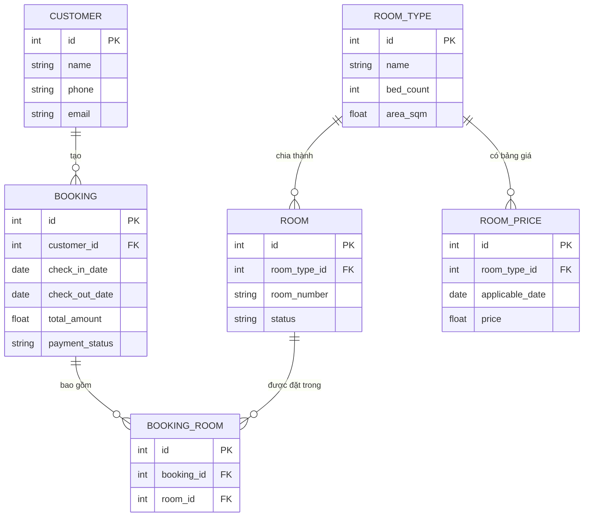

# Cấu trúc Dữ liệu và ERD: Hệ thống Đặt phòng Khách sạn

## 1. Danh sách Thực thể và Thuộc tính

**1.1. Thực thể: Khách hàng (CUSTOMER)**
- `id` (PK) - Integer: Mã khách hàng duy nhất.
- `name` - String: Tên khách hàng.
- `phone` - String: Số điện thoại.
- `email` - String: Địa chỉ email.

**1.2. Thực thể: Loại phòng (ROOM_TYPE)**
- `id` (PK) - Integer: Mã loại phòng.
- `name` - String: Tên loại phòng (VD: Phòng Đơn, Phòng Đôi, Suite).
- `bed_count` - Integer: Số lượng giường cấu hình.
- `area_sqm` - Float: Diện tích phòng (m2).

**1.3. Thực thể: Phòng (ROOM)**
- `id` (PK) - Integer: Mã phòng.
- `room_type_id` (FK) - Integer: Khóa ngoại liên kết tới Loại phòng.
- `room_number` - String: Số phòng cụ thể (VD: 101, 102).
- `status` - String: Trạng thái phòng (VD: Sẵn sàng, Đang bảo trì).

**1.4. Thực thể: Lịch sử Giá (ROOM_PRICE)**
- `id` (PK) - Integer: Mã bản ghi giá.
- `room_type_id` (FK) - Integer: Khóa ngoại liên kết tới Loại phòng.
- `applicable_date` - Date: Ngày áp dụng mức giá này (Ngày thường, Cuối tuần hoặc Lễ).
- `price` - Float: Mức giá áp dụng cho ngày tương ứng.

**1.5. Thực thể: Đơn đặt phòng (BOOKING)**
- `id` (PK) - Integer: Mã đơn đặt phòng.
- `customer_id` (FK) - Integer: Khóa ngoại liên kết tới Khách hàng.
- `check_in_date` - Date: Ngày bắt đầu lưu trú (Từ ngày).
- `check_out_date` - Date: Ngày kết thúc lưu trú (Đến ngày).
- `total_amount` - Float: Tổng tiền của đơn đặt phòng.
- `payment_status` - String: Trạng thái thanh toán (VD: Chưa thanh toán, Đã thanh toán).

**1.6. Thực thể: Chi tiết Đơn đặt phòng (BOOKING_ROOM)**
- `id` (PK) - Integer: Mã chi tiết.
- `booking_id` (FK) - Integer: Khóa ngoại liên kết tới Đơn đặt phòng.
- `room_id` (FK) - Integer: Khóa ngoại liên kết tới Phòng (Phòng cụ thể được đặt).

## 2. Sơ đồ Thực thể Liên kết (ERD)

