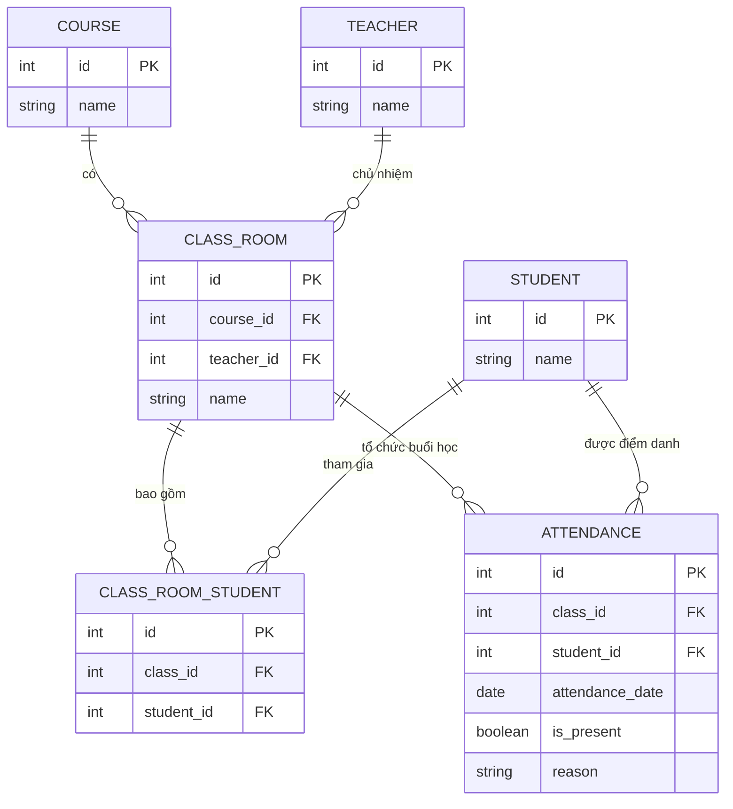

# Cấu trúc Dữ liệu và ERD: Hệ thống Quản lý Khóa học và Điểm danh

## 1. Danh sách Thực thể và Thuộc tính

**1.1. Thực thể: Khóa học (COURSE)**
- `id` (PK) - Integer: Mã khóa học duy nhất.
- `name` - String: Tên khóa học (VD: IELTS 6.5).

**1.2. Thực thể: Giảng viên (TEACHER)**
- `id` (PK) - Integer: Mã giảng viên.
- `name` - String: Tên giảng viên.

**1.3. Thực thể: Lớp học (CLASS_ROOM)**
- `id` (PK) - Integer: Mã lớp học.
- `course_id` (FK) - Integer: Khóa ngoại liên kết tới Khóa học.
- `teacher_id` (FK) - Integer: Khóa ngoại liên kết tới Giảng viên (Giảng viên chính chủ nhiệm).
- `name` - String: Tên lớp học (VD: IELTS-01).

**1.4. Thực thể: Học viên (STUDENT)**
- `id` (PK) - Integer: Mã học viên.
- `name` - String: Tên học viên.

**1.5. Thực thể: Ghi danh Lớp học (CLASS_ROOM_STUDENT)**
- `id` (PK) - Integer: Mã ghi danh.
- `class_id` (FK) - Integer: Khóa ngoại liên kết tới Lớp học.
- `student_id` (FK) - Integer: Khóa ngoại liên kết tới Học viên.
*(Thực thể này dùng để giải quyết mối quan hệ n-n, vì một lớp có nhiều học viên và một học viên có thể học nhiều lớp)*

**1.6. Thực thể: Điểm danh (ATTENDANCE)**
- `id` (PK) - Integer: Mã điểm danh.
- `class_id` (FK) - Integer: Khóa ngoại liên kết tới Lớp học.
- `student_id` (FK) - Integer: Khóa ngoại liên kết tới Học viên.
- `attendance_date` - Date: Ngày học (ngày diễn ra điểm danh).
- `is_present` - Boolean: Trạng thái đi học (True = Đi học, False = Nghỉ).
- `reason` - String: Lý do nghỉ (nếu có, để trống nếu đi học).

## 2. Sơ đồ Thực thể Liên kết (ERD)

