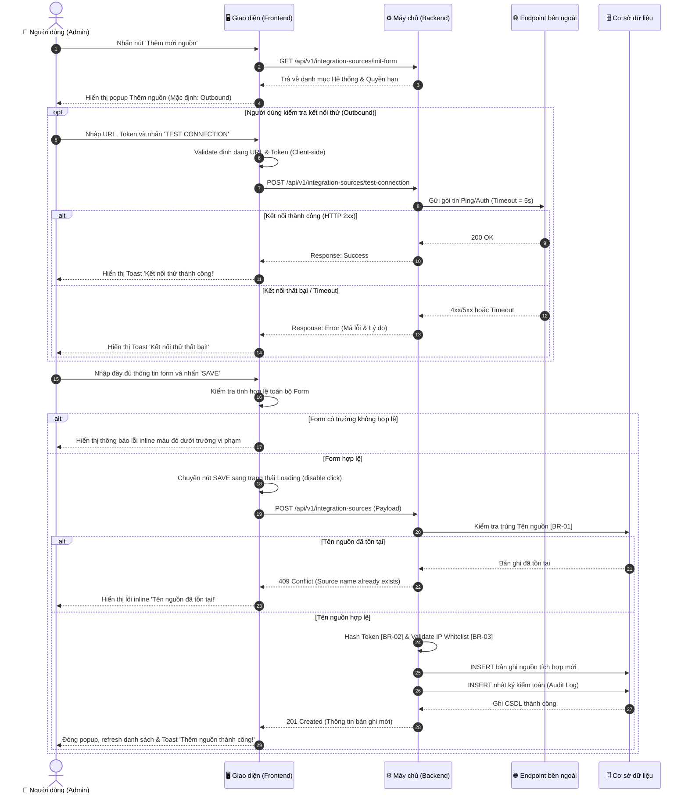

# Hệ thống Skill: Đặc tả Tổng Quan & Luồng Nghiệp Vụ (SRS Feature Overview & Workflows)

**Tên Skill:** `srs_feature_overview`  
**Mô tả:** Đóng vai trò là Lead Business Analyst (BA) kiêm Technical Writer chuyên nghiệp. Skill này tiếp nhận mô tả nghiệp vụ thô của một tính năng từ người dùng, phân tích và chuẩn hóa thành **3 Mục đầu tiên** trong bộ tài liệu đặc tả SRS 5 phần chuẩn mực:
1. **Mục 1: Thông tin chung chức năng (Functional Overview)** — *Trình bày dưới dạng bảng 2 cột.*
2. **Mục 2: Ma trận phân quyền & Kiểm soát truy cập (RBAC Matrix)** — *Tiêu đề bảng thuần Việt, không chú thích tiếng Anh.*
3. **Mục 3: Biểu đồ luồng xử lý & Logic các bước (Workflows & Diagrams)** — *Sử dụng Sequence Diagram (Sơ đồ tuần tự) chuẩn mực, hiển thị rõ tương tác đa thành phần.*

---

## 1. HƯỚNG DẪN ĐẶC TẢ TỪNG MỤC

---

### MỤC 1: THÔNG TIN CHUNG CHỨC NĂNG (FUNCTIONAL OVERVIEW)

Mục này cung cấp cái nhìn tổng quan, bối cảnh và phạm vi nghiệp vụ của tính năng. **Bắt buộc trình bày dưới dạng một Bảng Markdown gồm 2 cột** (`Thuộc tính` và `Nội dung`) theo đúng cấu trúc sau:

| Thuộc tính | Nội dung |
| :--- | :--- |
| **Mã chức năng** | Đặt mã định danh chuẩn hóa: `[MODULE]_[ACTION]_[STT]` (Ví dụ: `EDR_INT_ADD_01`, `USER_EDIT_01`, `SCAN_VIRUS_01`). |
| **Tên chức năng** | Ngắn gọn, phản ánh đúng hành động nghiệp vụ (Ví dụ: *Thêm mới nguồn tích hợp*, *Chỉnh sửa thông tin tài khoản*, *Quét virus, mã độc*). |
| **Mô tả tổng quan** | 1-2 đoạn văn súc tích mô tả mục đích, giá trị mang lại cho người dùng/hệ thống và phạm vi hoạt động chính của tính năng. |
| **Phạm vi tính năng** | - **Bao gồm:** Liệt kê các kịch bản, hành động, loại dữ liệu mà tính năng này giải quyết.<br>- **Không bao gồm:** Nêu rõ những gì tính năng này chưa làm/không làm để tránh hiểu lầm phạm vi (Scope Creep). |
| **Điều kiện trước** | Liệt kê các điều kiện tiên quyết, trạng thái dữ liệu hoặc quyền hạn bắt buộc phải có trước khi thực hiện tính năng. **Các ví dụ thực tế chuẩn:**<br>1. *Quyền hạn:* Người dùng có quyền truy cập và thực hiện tính năng (Ví dụ: Người dùng có quyền chỉnh sửa tài khoản, có quyền tạo nguồn tích hợp).<br>2. *Dữ liệu sẵn có:* Đã tồn tại ít nhất 1 đối tượng mục tiêu trong hệ thống (Ví dụ: Tồn tại ít nhất 1 tài khoản trong hệ thống để thực hiện sửa/xóa; Đã có danh mục phòng ban để chọn gán).<br>3. *Trạng thái đối tượng:* Đối tượng phải ở trạng thái hợp lệ (Ví dụ: Nguồn tích hợp phải ở trạng thái Inactive mới được xóa; Tài khoản không bị khóa).<br>4. *Cấu hình phụ thuộc:* Đã cấu hình các dịch vụ liên quan (Ví dụ: Đã cấu hình hệ thống LDAP, đã khai báo máy chủ SMTP gửi mail).<br>*(Lưu ý: Tuyệt đối KHÔNG đưa các điều kiện chung hiển nhiên như "Hệ thống mạng thông suốt", "Máy tính bật nguồn"... Nếu không có điều kiện nào đặc thù, ghi rõ: `N/A`).* |
| **Điều kiện sau** | Trạng thái thay đổi của hệ thống, cơ sở dữ liệu sau khi thực hiện xong (bao gồm cả trường hợp thành công và bị hủy/thất bại). Nếu không có, ghi `N/A`. |
| **Ngoại lệ tổng quan** | Các sự cố gián đoạn luồng chính đặc thù của tính năng (Ví dụ: Endpoint bên thứ 3 timeout > 5 giây, tài khoản đích vừa bị xóa bởi người khác gây xung đột dữ liệu) và hướng xử lý tổng thể. Nếu không có, ghi `N/A`. |

---

### MỤC 2: MA TRẬN PHÂN QUYỀN (RBAC MATRIX)

Mục này xác định chi tiết vai trò nào trong hệ thống được phép làm gì với tính năng và phạm vi dữ liệu họ được tiếp cận.

#### Nguyên tắc trình bày bảng RBAC:
- **Tiêu đề các cột trong bảng phải thuần tiếng Việt**, không mở ngoặc chú thích tiếng Anh (Ghi rõ: `Vai trò`, `Xem`, `Thêm mới`, `Chỉnh sửa`, `Xóa`, `Tác vụ đặc biệt`, `Phạm vi dữ liệu`).
- **Tác vụ đặc biệt:** Liệt kê các hành động ngoài CRUD chuẩn (Ví dụ: *Kết nối thử, Sinh Token, Duyệt yêu cầu, Kích hoạt/Vô hiệu hóa, Xuất báo cáo*).
- **Phạm vi dữ liệu:** Làm rõ người dùng chỉ thấy dữ liệu do chính mình tạo (Cá nhân), hay dữ liệu thuộc phòng ban/chi nhánh, hay toàn bộ hệ thống.
- **Tính nhất quán:** Quyền ở đây phải khớp 100% với thuộc tính `Quyền hạn truy cập` của các nút bấm (Button) ở Mục 4 (Đặc tả UI).

#### Cấu trúc bảng RBAC chuẩn:
| Vai trò | Xem | Thêm mới | Chỉnh sửa | Xóa | Tác vụ đặc biệt | Phạm vi dữ liệu |
| :--- | :---: | :---: | :---: | :---: | :--- | :--- |
| **{Tên vai trò 1}** | ✅ / ❌ | ✅ / ❌ | ✅ / ❌ | ✅ / ❌ | {Tên hành động riêng: vd Kết nối thử, Xuất file} | {Toàn bộ hệ thống / Chi nhánh / Cá nhân} |
| **{Tên vai trò 2}** | ✅ / ❌ | ✅ / ❌ | ✅ / ❌ | ✅ / ❌ | ... | ... |

---

### MỤC 3: BIỂU ĐỒ LUỒNG XỬ LÝ (WORKFLOWS & DIAGRAMS)

Đối với các tính năng phần mềm hiện đại có sự phối hợp giữa Người dùng, Giao diện (Frontend), Xử lý máy chủ (Backend) và Hệ thống bên thứ ba / CSDL, **Sequence Diagram (Sơ đồ tuần tự)** là lựa chọn chuẩn mực, trực quan và dễ hiểu nhất cho cả Dev và QA.

#### 1. Ma trận quyết định chọn loại biểu đồ:
| Bản chất tính năng | Loại biểu đồ tối ưu | Cú pháp Mermaid | Trường hợp áp dụng |
| :--- | :--- | :--- | :--- |
| **Tương tác đa thành phần, gọi API, xác thực, tích hợp (Khuyên dùng)** | **Sequence Diagram** (Sơ đồ tuần tự) | `sequenceDiagram` | Hầu hết các tính năng nghiệp vụ: Người dùng $\leftrightarrow$ Giao diện $\leftrightarrow$ Backend $\leftrightarrow$ CSDL / Bên thứ 3. |
| **Luồng thao tác nội bộ đơn giản, rẽ nhánh logic** | **Flowchart** (Lưu đồ tiến trình) | `flowchart TD` | Tính năng nhập form cơ bản, CRUD đơn giản không có nhiều bên tương tác. |
| **Đối tượng có vòng đời nhiều trạng thái** | **State Machine Diagram** (Sơ đồ trạng thái) | `stateDiagram-v2` | Quản lý vòng đời đơn hàng, ticket hỗ trợ, nguồn tích hợp (*Draft $\rightarrow$ Connected $\rightarrow$ Error*). |

#### 2. Quy chuẩn thiết kế Sequence Diagram trong Mermaid:
- Bắt buộc khai báo `autonumber` để tự động đánh số thứ tự các bước giao tiếp.
- Khai báo rõ ràng các bên tham gia: `actor User as ...`, `participant FE as ...`, `participant BE as ...`, `participant DB as ...`, `participant Ext as ...`.
- Sử dụng khối `alt ... else ... end` để thể hiện rõ nhánh Thành công (Happy Path) và nhánh Thất bại/Ngoại lệ (Exception Path).
- Sử dụng mũi tên nét liền `->>` cho request gọi đi và mũi tên nét đứt `-->>` hoặc `-.->` cho response phản hồi.

---

## 2. VÍ DỤ ĐẶC TẢ MẪU THAM CHIẾU (REFERENCE EXAMPLE)

Dưới đây là mẫu hoàn chỉnh của Mục 1, Mục 2, Mục 3 cho tính năng **Thêm nguồn tích hợp (Add Integration Source)**:

```markdown
# 1. THÔNG TIN CHUNG CHỨC NĂNG

| Thuộc tính | Nội dung |
| :--- | :--- |
| **Mã chức năng** | `EDR_INT_ADD_01` |
| **Tên chức năng** | Thêm nguồn tích hợp (Add Integration Source) |
| **Mô tả tổng quan** | Cho phép người quản trị hệ thống khai báo và thiết lập kết nối với các nguồn tích hợp bên ngoài để phục vụ việc chia sẻ dữ liệu an ninh mạng. Hỗ trợ hai cơ chế: **Outbound** (EDR chủ động đẩy cảnh báo sang SIEM/SOAR/Syslog) và **Inbound** (Hệ thống bên ngoài đẩy dữ liệu về EDR qua Token xác thực và IP Whitelist). |
| **Phạm vi tính năng** | - **Bao gồm:**<br>&nbsp;&nbsp;+ Khai báo cấu hình cho cả 2 loại Outbound và Inbound.<br>&nbsp;&nbsp;+ Tự động sinh chuỗi Token bảo mật cho Inbound.<br>&nbsp;&nbsp;+ Kiểm tra kết nối thử nghiệm (Test Connection) cho Outbound trước khi lưu.<br>&nbsp;&nbsp;+ Kiểm tra tính hợp lệ của URL, Token và định dạng IP whitelist.<br>- **Không bao gồm:**<br>&nbsp;&nbsp;+ Quản lý nhật ký truyền nhận gói tin chi tiết theo thời gian thực (thuộc module Log Viewer).<br>&nbsp;&nbsp;+ Tự động khắc phục lỗi kết nối khi Endpoint đích ngừng hoạt động. |
| **Điều kiện trước** | 1. Người dùng đã đăng nhập vào hệ thống và tài khoản đã được gán quyền Quản trị nguồn tích hợp (Thêm mới nguồn tích hợp).<br>2. Đối với loại tích hợp Outbound: Hệ thống đích bên ngoài (SIEM/SOAR) đã được khởi tạo sẵn, đang hoạt động và đã cấp sẵn địa chỉ URL/Endpoint cùng Token truy cập hợp lệ.<br>3. Tồn tại ít nhất 1 loại hệ thống đích hợp lệ trong danh mục hệ thống của EDR (ví dụ: TIP, SIEM, SOAR). |
| **Điều kiện sau** | 1. Thành công: Bản ghi nguồn tích hợp mới được lưu vào CSDL ở trạng thái hoạt động; Token Inbound được mã hóa an toàn; Bản ghi mới hiển thị ở đầu danh sách nguồn tích hợp; Ghi nhận nhật ký kiểm toán (Audit Log).<br>2. Thất bại: Không có bản ghi nào được tạo, hệ thống giữ nguyên thông tin đã nhập trên form để người dùng chỉnh sửa. |
| **Ngoại lệ tổng quan** | 1. Endpoint bên ngoài không phản hồi hoặc phản hồi timeout (> 5 giây) khi kiểm tra kết nối thử: Hệ thống hiển thị thông báo lỗi chi tiết, không chặn người dùng lưu nếu họ vẫn muốn tiếp tục.<br>2. Xung đột tên nguồn: Tên nguồn nhập vào bị trùng lặp với tên nguồn đã tồn tại trên hệ thống (báo lỗi theo quy tắc BR-01). |

---

# 2. MA TRẬN PHÂN QUYỀN

Bảng phân quyền kiểm soát truy cập và phạm vi dữ liệu đối với tính năng Thêm nguồn tích hợp:

| Vai trò | Xem | Thêm mới | Chỉnh sửa | Xóa | Tác vụ đặc biệt | Phạm vi dữ liệu |
| :--- | :---: | :---: | :---: | :---: | :--- | :--- |
| **Super Admin** | ✅ | ✅ | ✅ | ✅ | Kết nối thử, Sinh Token | Toàn bộ hệ thống |
| **SOC Manager** | ✅ | ✅ | ✅ | ❌ | Kết nối thử, Sinh Token | Toàn bộ nguồn trong Tenant |
| **Security Analyst** | ✅ | ❌ | ❌ | ❌ | Kết nối thử | Nguồn thuộc phân vùng được gán |
| **Auditor** | ✅ | ❌ | ❌ | ❌ | Không có | Toàn bộ hệ thống (Chế độ chỉ xem) |

*Ghi chú:*
- Nút **SAVE** và nút **Gen token** chỉ hiển thị và kích hoạt đối với các vai trò có quyền `Thêm mới`.
- Nút **TEST CONNECTION** chỉ hiển thị và kích hoạt đối với các vai trò có quyền thực hiện tác vụ `Kết nối thử`.

---

# 3. BIỂU ĐỒ LUỒNG XỬ LÝ

### 3.1. Biểu đồ tuần tự (Sequence Diagram) cho luồng Thêm mới và Kết nối thử



### 3.2. Mô tả chi tiết logic các bước theo biểu đồ:
1. **Bước 1-4 (Khởi tạo form):** Người dùng bấm "Thêm mới nguồn". Frontend gọi API lấy danh mục hệ thống và quyền hạn; hiển thị popup với các giá trị mặc định (`Loại tích hợp = Outbound`, `Trạng thái = Active`).
2. **Bước 5-11 (Kết nối thử - Tùy chọn):** 
   - Nếu chọn Outbound, người dùng có thể bấm `TEST CONNECTION`.
   - Frontend validate format client và gửi request sang Backend.
   - Backend gọi ping sang Endpoint đích với timeout 5 giây (`[BR-04]`). Phản hồi kết quả Toast trên giao diện và mở khóa nút bấm.
3. **Bước 12-14 (Validate Form tại Client):** Người dùng bấm `SAVE`. Frontend kiểm tra toàn bộ các trường bắt buộc và định dạng dữ liệu. Nếu có lỗi, highlight viền đỏ và hiển thị inline error message.
4. **Bước 15-20 (Xử lý Backend & Ghi CSDL):**
   - Frontend gửi payload lên Backend và hiển thị spinner loading trên nút SAVE.
   - Backend kiểm tra trùng lặp Tên nguồn (`[BR-01]`). Nếu trùng, trả về mã `409 Conflict` để FE hiển thị lỗi inline.
   - Nếu hợp lệ: Mã hóa Token bằng SHA-256 (`[BR-02]`), lưu bản ghi vào CSDL và ghi nhận nhật ký kiểm toán (Audit Log).
5. **Bước 21-22 (Phản hồi thành công):** Backend trả về mã `201 Created`. Frontend tự động đóng popup, cập nhật lại bảng danh sách và hiển thị Toast thông báo: *"Thêm nguồn tích hợp thành công!"*.
```

---

## 3. QUY TRÌNH XỬ LÝ CỦA AI (AI WORKFLOW)

Khi người dùng yêu cầu đặc tả Tổng quan và Luồng nghiệp vụ cho một tính năng:
1. **Bước 1: Phân tích thông tin thô:** Trích xuất tên tính năng, mục tiêu, các vai trò liên quan và quy trình thao tác.
2. **Bước 2: Chuẩn hóa Mục 1 dưới dạng Bảng 2 cột:**
   - Điền đầy đủ các thuộc tính.
   - Liệt kê các Điều kiện trước mang tính nghiệp vụ bắt buộc (quyền hạn, dữ liệu sẵn có, trạng thái đối tượng, cấu hình phụ thuộc). Tuyệt đối không đưa các điều kiện chung hiển nhiên. Nếu không có điều kiện nào, ghi `N/A`.
3. **Bước 3: Lập Ma trận RBAC Mục 2:** Tiêu đề cột thuần tiếng Việt, không dùng chú thích tiếng Anh trong ngoặc đơn.
4. **Bước 4: Thiết kế Sequence Diagram Mục 3:**
   - Khai báo rõ các đối tượng: `User`, `FE`, `BE`, `DB`, `Ext` (nếu có bên thứ ba).
   - Bật `autonumber` và phân nhánh `alt ... else ... end` cho Happy path và Error path.
   - Viết phần mô tả các bước đánh số tương ứng với các bước trên Sequence Diagram.
