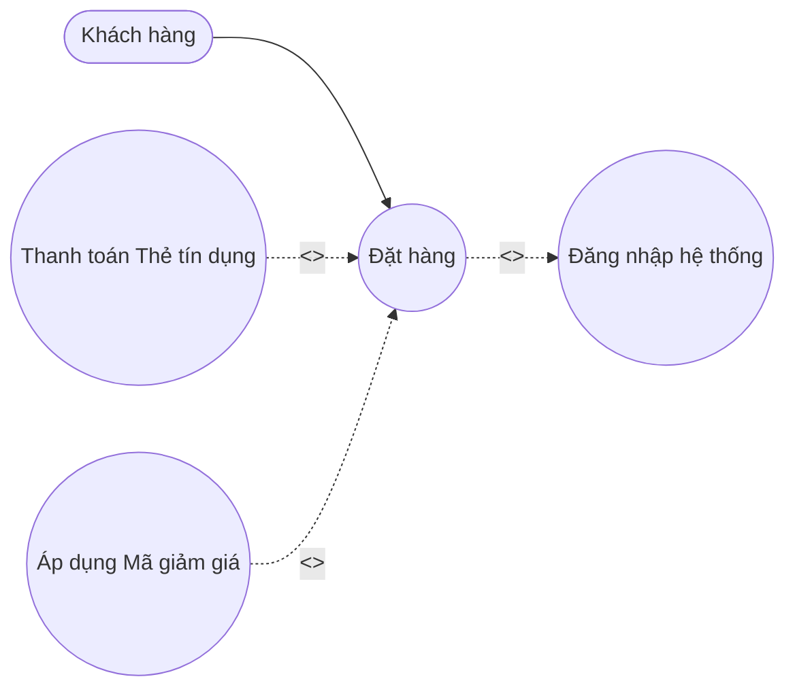
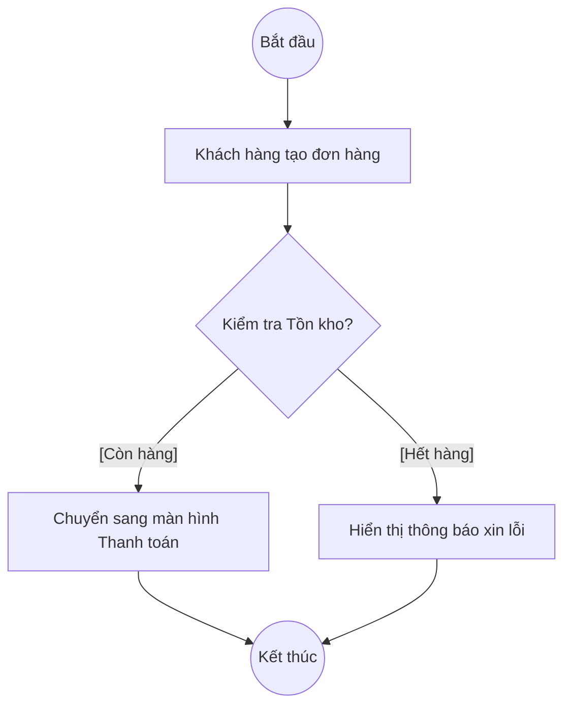

# Bài 4: Mô hình hóa Hệ thống (System Modeling)

> Ngôn ngữ tự nhiên đôi khi mang tính đa nghĩa và dễ gây hiểu lầm. Trong Phân tích Nghiệp vụ, "Một bức hình có giá trị bằng hàng ngàn từ ngữ". Việc mô hình hóa hệ thống (System Modeling) bằng các biểu đồ chuẩn UML (Unified Modeling Language) giúp Business Analyst truyền đạt luồng logic phức tạp một cách trực quan, chính xác đến cả Khách hàng và Đội ngũ Kỹ thuật.

## 1. Biểu đồ Ca sử dụng (Use Case Diagram)

Biểu đồ Use Case cung cấp bức tranh tổng thể về hệ thống từ góc nhìn của người dùng. Nó không mô tả hệ thống hoạt động *như thế nào*, mà tập trung trả lời câu hỏi: *Hệ thống cung cấp những chức năng gì, và ai là người sử dụng chúng?*

### 1.1. Các thành phần cốt lõi
- **Tác nhân (Actor):** Đại diện cho một vai trò (người dùng, hệ thống bên ngoài) tương tác với hệ thống. Ký hiệu là hình người (Stickman).
- **Ca sử dụng (Use Case):** Đại diện cho một chức năng cốt lõi hoặc một mục tiêu mà Actor muốn thực hiện. Ký hiệu là hình oval.
- **Ranh giới hệ thống (System Boundary):** Khung chữ nhật bao quanh tất cả các Use Case, phân định ranh giới giữa những gì thuộc về hệ thống và những gì nằm ngoài hệ thống (Actor).

### 1.2. Các mối quan hệ (Relationships) chuyên sâu
Hiểu rõ các mối quan hệ giúp mô hình Use Case mang tính cấu trúc và tái sử dụng cao:
1. **Association (Giao tiếp):** Đường nối liền cơ bản giữa Actor và Use Case.
2. **Include (Bao gồm):** Quan hệ bắt buộc. Nếu Use Case A `<<include>>` Use Case B, nghĩa là để hoàn thành A, hệ thống bắt buộc phải thực thi B. *(Ví dụ: Use Case "Thanh toán đơn hàng" `<<include>>` Use Case "Xác thực tài khoản").*
3. **Extend (Mở rộng):** Quan hệ tùy chọn. Use Case B `<<extend>>` Use Case A nghĩa là trong một số điều kiện nhất định, B sẽ được kích hoạt để bổ sung chức năng cho A. *(Ví dụ: Use Case "Thanh toán bằng thẻ tín dụng" `<<extend>>` Use Case "Thanh toán đơn hàng").*

### 1.3. Ví dụ minh họa (Hệ thống Đặt hàng)
Dưới đây là một sơ đồ Use Case đơn giản được vẽ trực quan để mô phỏng lại các mối quan hệ trên:

---

## 2. Biểu đồ Hoạt động (Activity Diagram / Flowchart)

Nếu Use Case Diagram cho thấy *cái gì* hệ thống làm, thì Activity Diagram mô tả chi tiết *luồng nghiệp vụ (Workflow)* diễn ra như thế nào. 

### 2.1. Các thành phần cốt lõi
- **Nút khởi đầu (Initial Node) & Nút kết thúc (Final Node):** Điểm bắt đầu (Hình tròn đen đặc) và điểm kết thúc luồng (Hình tròn đen có viền ngoài).
- **Hành động (Action/Activity):** Một bước thao tác trong quy trình. Ký hiệu là hình chữ nhật bo góc.
- **Nút quyết định (Decision Node):** Điểm rẽ nhánh logic dựa trên các điều kiện (Yes/No, True/False). Ký hiệu là hình thoi.
- **Phân làn (Swimlanes):** Rất quan trọng trong các quy trình có sự tham gia của nhiều phòng ban. Swimlanes chia biểu đồ thành các cột dọc/ngang, mỗi cột đại diện cho một Actor hoặc Hệ thống phụ, giúp làm rõ "Ai chịu trách nhiệm cho bước nào".

### 2.2. Ví dụ minh họa & Ứng dụng thực tế
Dưới đây là ví dụ về một luồng **Kiểm tra tồn kho và Thanh toán** cơ bản được thể hiện qua Activity Diagram:

*Ứng dụng thực tế:* Activity Diagram là công cụ đắc lực nhất để BA cùng Khách hàng rà soát lại các quy trình vận hành (SOP - Standard Operating Procedure) trước khi tiến hành viết tài liệu SRS chi tiết. Việc sử dụng Swimlanes (Phân làn) giúp phát hiện ngay lập tức các "nút thắt cổ chai" (Bottlenecks) trong quy trình chuyển giao công việc giữa các phòng ban.

---

## 3. Biểu đồ Tuần tự (Sequence Diagram)

> Đối với các công ty phát triển sản phẩm công nghệ sâu (SaaS, Cybersecurity, API Integration), Sequence Diagram là biểu đồ bắt buộc mọi BA phải nắm vững. Nó mô tả cách các đối tượng (Frontend, Backend, Database) giao tiếp với nhau theo trình tự thời gian.

### 3.1. Các thành phần cốt lõi
- **Đường đời (Lifeline):** Đường nét đứt kéo dài từ trên xuống dưới đại diện cho sự tồn tại của một đối tượng theo thời gian.
- **Thông điệp (Messages):**
  - *Synchronous Message (Thông điệp đồng bộ):* Ký hiệu bằng mũi tên nét liền, mũi tên đặc. Người gửi sẽ chặn luồng xử lý và chờ người nhận phản hồi rồi mới làm tiếp.
  - *Asynchronous Message (Thông điệp bất đồng bộ):* Ký hiệu bằng mũi tên nét liền, mũi tên mở. Người gửi gửi thông tin và tiếp tục công việc khác mà không cần chờ phản hồi.
  - *Return Message (Thông điệp phản hồi):* Ký hiệu bằng mũi tên nét đứt, mũi tên mở. Trả về kết quả cho người gửi.
- **Khung phân mảnh (Combined Fragments):** Dùng để biểu diễn các logic phức tạp như `alt` (Cấu trúc rẽ nhánh If/Else), `opt` (Cấu trúc tùy chọn), `loop` (Vòng lặp).

### 3.2. Ví dụ: Luồng Đăng nhập (Login Flow)
Một Sequence Diagram cơ bản cho tính năng Đăng nhập sẽ bao gồm 3 Lifelines: **User/Trình duyệt (Frontend)**, **Máy chủ (Backend API)**, và **Cơ sở dữ liệu (Database)**.
1. Frontend gửi `POST /login (username, password)` đến Backend.
2. Backend gửi truy vấn `SELECT user` đến Database.
3. Database trả về `Return (Thông tin user / Null)`.
4. Khung rẽ nhánh `alt`:
   - *Nếu hợp lệ (True):* Backend tạo Token bảo mật (JWT) và `Return (Token, Status 200)` cho Frontend. Frontend điều hướng người dùng vào Dashboard.
   - *Nếu không hợp lệ (False):* Backend `Return (Error Message, Status 401)` cho Frontend. Frontend hiển thị cảnh báo lỗi.

---

## 4. Công cụ Khuyến nghị (Recommended Tools)

Business Analyst có thể sử dụng các công cụ sau để vẽ biểu đồ chuyên nghiệp:
1. **Draw.io (Diagrams.net):** Công cụ miễn phí, giao diện kéo thả trực quan, tích hợp tốt với Google Drive và Confluence. Phù hợp cho mọi loại biểu đồ.
2. **PlantUML / MermaidJS:** Công cụ mô hình hóa dựa trên mã lệnh (Diagram-as-code). Rất được ưa chuộng trong giới kỹ thuật vì tốc độ chỉnh sửa nhanh và dễ dàng lưu trữ dưới dạng văn bản (Markdown).
3. **Lucidchart / Miro:** Nền tảng trả phí chuyên nghiệp, hỗ trợ cộng tác nhóm (Real-time collaboration) mạnh mẽ.

---

## 5. Bài tập & Tự nghiên cứu

### 5.1. Câu hỏi lý thuyết (Tự nghiên cứu)
1. Hãy phân tích sự khác biệt cốt lõi về mục đích sử dụng giữa **Activity Diagram** và **Sequence Diagram**. Trong giai đoạn làm việc với Khách hàng nghiệp vụ (Business Users), bạn nên sử dụng biểu đồ nào? Trong giai đoạn làm việc với Đội ngũ Kỹ thuật (Developers), biểu đồ nào sẽ mang lại giá trị cao hơn?
2. Trong Use Case Diagram, hãy tìm một ví dụ thực tế trong hệ thống Thương mại điện tử để phân biệt rõ cách sử dụng quan hệ `<<include>>` và quan hệ `<<extend>>`.

### 5.2. Bài tập thực hành (Mô hình hóa hệ thống)

**Bối cảnh dự án:**
Hệ thống phần mềm nội bộ của công ty cần xây dựng tính năng **"Quên Mật Khẩu" (Forgot Password)**. Quy trình nghiệp vụ được quy định như sau:
1. Người dùng nhập Email vào hệ thống.
2. Hệ thống kiểm tra xem Email có tồn tại trong cơ sở dữ liệu hay không.
   - Nếu KHÔNG tồn tại: Hiển thị thông báo lỗi và kết thúc luồng.
   - Nếu CÓ tồn tại: Hệ thống tự động tạo ra một Mã xác thực (OTP) có hiệu lực trong 5 phút và gửi qua Email cho người dùng.
3. Người dùng nhập mã OTP vào màn hình xác thực.
4. Hệ thống kiểm tra tính hợp lệ của mã OTP.
   - Nếu mã sai hoặc hết hạn: Hiển thị cảnh báo và yêu cầu nhập lại.
   - Nếu hợp lệ: Cho phép người dùng nhập Mật khẩu mới và Lưu lại.

**Yêu cầu dành cho học viên:**
1. Hãy sử dụng công cụ **Draw.io** để vẽ một **Activity Diagram (Biểu đồ hoạt động)** thể hiện chính xác quy trình nghiệp vụ nêu trên. Bắt buộc phải sử dụng biểu tượng rẽ nhánh (Decision Node) để xử lý các luồng kiểm tra điều kiện.
2. *(Nâng cao)* Viết mã giả (Pseudo-code) hoặc sử dụng 문 pháp của **PlantUML / MermaidJS** để phác thảo cấu trúc của một **Sequence Diagram** cho luồng "Hệ thống kiểm tra tính hợp lệ của mã OTP". *(Gợi ý: Cần có 3 Lifelines là User, System Backend, và Database; sử dụng khung rẽ nhánh `alt` cho kết quả Đúng/Sai).*

