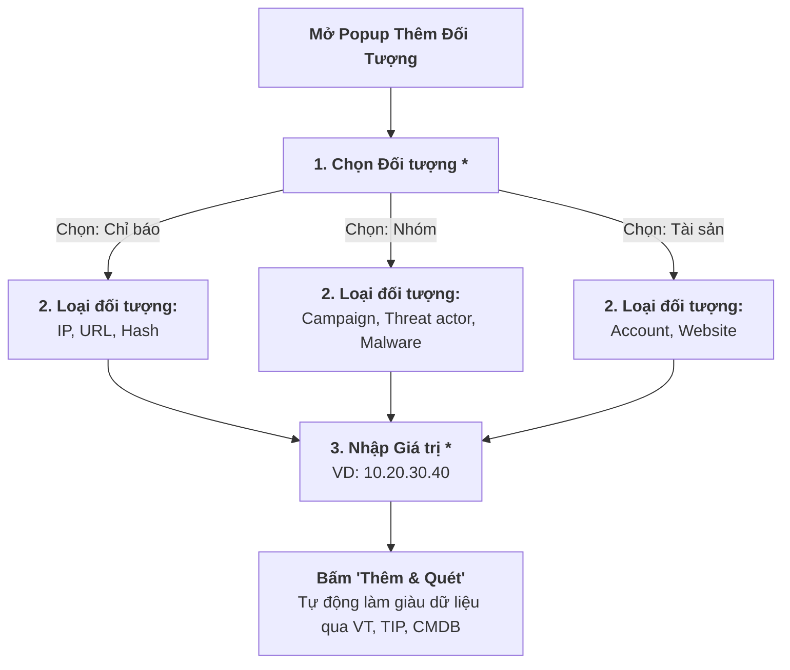

# KẾ HOẠCH CẢI TIẾN & THIẾT KẾ CHI TIẾT GIAO DIỆN QUẢN LÝ SỰ VIỆC NCS SOAR

> [!IMPORTANT]
> Bản kế hoạch đã cập nhật toàn bộ các tinh chỉnh mới nhất từ phản hồi của bạn:
> 1. **Playbook Runner - Ô tìm kiếm & Chọn gộp 1 ô duy nhất (Combobox):** Nhập từ khóa sẽ lọc và sổ ra danh sách tên Playbook tương ứng. Bấm chọn sẽ kích hoạt form tham số.
> 2. **Bảng Cảnh báo liên quan (90):** Chuẩn hóa tiêu đề, bỏ chữ "Alerts". Phân trang kiểu dáng NCS mới (`< | 1 | 2 | 3 | ... | 9 | >` kèm `10/ trang ▾`). Chuẩn hóa 9 cột: *STT, Thời gian, Alert ID, Mức độ, Nguồn, Nội dung cảnh báo, Kết quả AI phân tích (True/False Positive), Thời điểm phân tích (YYYY-MM-DD HH:MM:SS), Trạng thái (Đang xử lý/Đóng)*.
> 3. **Bảng Thông tin liên quan (Chỉ báo, Nhóm, Tài sản):** Phân trang kiểu mới. Cột "Đối tượng" & "Loại đối tượng" hiển thị text chuẩn. Cột "Nguồn" hiển thị tag gọn gàng. Popup Thêm đối tượng có logic phân cấp phụ thuộc (*Đối tượng $\rightarrow$ Loại đối tượng $\rightarrow$ Giá trị*).

---

## 1. CẤU TRÚC 5 PHẦN VÙNG NỘI DUNG CHÍNH (NCS DEEP BLACK THEME)

```
+-------------------------------------------------------------------------------------------------------------------------------+
| HEADER CHÍNH:                                                                                                                 |
| NCS SOAR | CA01346751: Phát hiện tấn công dò quét cổng & Brute-force từ IP lạ                                                 |
| [Khách hàng: KTL1]  [Mức độ: Low ●]  [Loại: Cảnh báo]  [SLA: Trễ 1d 11h ⚠️]  [Trạng thái: Mới ▾]  [Người xử lý: tier1 ▾]    |
| [ 🔒 Đóng sự việc ]                                                                                                           |
+-------------------------------------------------------------------------------------------------------------------------------+
| THANH SUBTAB ĐIỀU HƯỚNG NHANH (STICKY ANCHOR BAR):                                                                            |
| [ 1. Cảnh báo (90) ]  [ 2. Thông tin liên quan (3) ]  [ 3. Playbook (3) ]  [ 4. Công việc (2) ]  [ 5. Thông tin chung ]        |
+-------------------------------------------------------------------------------+-----------------------------------------------+
| VÙNG NỘI DUNG CHÍNH (MAIN INVESTIGATION CANVAS - 70% HOẶC 100%)               | SIDE PANEL (WAR ROOM & PLAYBOOK RUNNER - 30%) |
|                                                                               | [ 💬 War Room ]  [ ⚡ Playbook Runner ]   [X] |
| ============================================================================= | +-------------------------------------------+ |
| 1. DANH SÁCH CẢNH BÁO LIÊN QUAN (90)                                          | | BỘ LỌC STREAM:                            | |
| [ 🔍 Nhập để tìm kiếm... ]  [ Lọc trạng thái ▾ ]  [ Lọc mức độ ▾ ]            | | [* Tất cả *] [ Chỉ Chat ] [ System ] [ PB] | |
| [STT|Thời gian|Alert ID|Mức độ|Nguồn|Nội dung|Kết quả AI|Thời điểm AI|Trạng thái] | | (Không hiện Toast khi bấm lọc stream)     | |
| Phân trang NCS: [ < | 1 | 2 | 3 | ... | 9 | > ]      [ 10/ trang ▾ ]          | +-------------------------------------------+ |
|                                                                               | | 🤖 SYSTEM: Khởi tạo từ 90 alerts (15:22)  | |
| ============================================================================= | | 👤 tier1: Tiếp nhận điều tra (16:46)      | |
| 2. THÔNG TIN LIÊN QUAN (CHỈ BÁO, NHÓM, TÀI SẢN) [+ Thêm đối tượng]            | | ⚡ Playbook: PB_BRUTEFORCE Xong (16:48)    | |
| [ 🔍 Nhập để tìm kiếm... ]  [ Đối tượng: Tất cả ▾ ]  [ Trạng thái: Tất cả ▾ ] | +-------------------------------------------+ |
| [STT | Giá trị | Đối tượng | Loại đối tượng | Nguồn | Trạng thái | Thao tác ] | | [ Nhập tin nhắn trao đổi ca trực...     ] | |
| Phân trang NCS: [ < | 1 | 2 | 3 | ... | 10 | > ]     [ 10/ trang ▾ ]          +-------------------------------------------+ |
|                                                                               |                                               |
| ============================================================================= |                                               |
| 3. KỊCH BẢN PHẢN ỨNG SOAR (PLAYBOOKS) [+ Thêm Playbook]                       |                                               |
| - PB_BRUTEFORCE_MITIGATION_V2: Đang chạy (3/4 bước) [Sơ đồ DAG Stepper]       |                                               |
| - PB_ENRICH_VIRUSTOTAL_IOC: Hoàn thành (4/4 nodes • 1.2s)                     |                                               |
|                                                                               |                                               |
| ============================================================================= |                                               |
| 4. NHIỆM VỤ ĐIỀU TRA (TASKS CHECKLIST) [+ Thêm công việc]                     |                                               |
| - [x] Trích xuất PCAP từ Firewall (tier1 - Xong)                              |                                               |
| - [ ] Xác nhận IP quản trị với khách hàng KTL1 (tier2 - Còn 2h)               |                                               |
|                                                                               |                                               |
| ============================================================================= |                                               |
| 5. THÔNG TIN CHUNG (CHUYỂN XUỐNG DƯỚI CÙNG)                                   |                                               |
| - Đơn vị (NCS), Người tạo (SYSTEM), Thời gian xử lý/phát hiện/tạo/đóng...     |                                               |
| - Mô tả chi tiết & Thông tin thêm | File đính kèm [+] | Nhãn [+] | Ghi chú    |                                               |
+-------------------------------------------------------------------------------+-----------------------------------------------+
```

---

## 2. LOGIC PHÂN CẤP CỦA POPUP "THÊM ĐỐI TƯỢNG"


